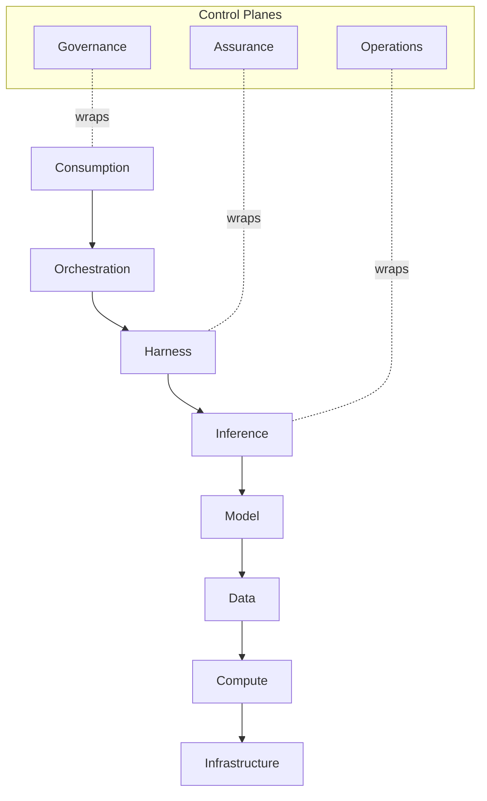

# Eight-Layer Stack

A **view**, not a competing layer model. The [[RackAI Enterprise AI Development Plan|dev plan]] describes the architecture as **eight layers** (consumption, orchestration, harness, inference, model, data, compute, infrastructure) wrapped by **three control planes** (governance, assurance, operations) and cut by two axes (cost, lifecycle). That is an *architecture decomposition of the stack*.

The knowledge base's **five layers** (L1 entities → L2 operations → L3 commercial → L4 evidence → L5 wiki) are *knowledge-graph tiers*, not architecture layers. The two are orthogonal and compose: the dev plan's architecture lives almost entirely inside canonical **L1** (entities) and **L2** (operations), with the cost axis in **L3**.

> **One-Concept Rule.** The five knowledge-graph layers remain canonical. This note is the single home for the eight-layer *framing*; it does not redefine any concept, it points at each concept's canonical home. Consumption maps to the initiative/channel layer, not a platform layer.

## Stack → Canonical Homes

| Dev-plan layer/plane | Knowledge layer | Canonical home(s) |
|---|---|---|
| **Consumption** | Initiatives / channels | [[OpenRouter Initiative]] (distribution channel), direct tenant consumption, Uniphore apps ([[Enterprise AI Portfolio]]) |
| **Orchestration** | L2 | [[Request Routing]] (+ [[Loop Planning & Credit Assignment]]) |
| **Harness** | L1 + L2 | [[Governed Harness]]; runtime overlaps [[Serving Runtime]] |
| **Inference** | L1 + L2 | [[Model Deployment]], [[Serving Runtime]]; [[Request Routing]], [[Quantization Program]] |
| **Model** | L1 + L2 | [[Model]], [[Model Class]], [[LoRA Adapter]], [[Fine-Tuning Job]]; [[Empirical Map]], [[Verification]] |
| **Data** | L1 (thin, integrate-not-build) | [[Dataset]]; perimeter edges in [[Perimeter Information-Flow Control]] |
| **Compute** | L1 | [[Accelerator Class]], [[GPU Node]], [[GPU Cluster]] |
| **Infrastructure** | L1 | [[GPU Fleet]], [[Region]], [[Topology]] |
| **Governance plane** | L2 + Governance Hub | [[Identity & Access Control]], [[Audit]], [[Governable Self-Modification]], provenance/replay (in [[Verification]]) |
| **Assurance plane** | L2 + L4 | [[Verification]], [[Eval as CI]], [[Performance Regression Gate]] |
| **Operations plane** | L2 | [[Metering]], [[Monitoring & Observability]], [[Autoscaling]], [[Procurement Trigger]], [[Agent Identity]], [[Action Controls]], [[Supply Chain Inventory]] |
| **Cost axis** | L2 + L3 | [[Metering]] → [[AI FinOps]], [[Cost per Outcome]] |
| **Lifecycle axis** | L2 | [[Standard Model Deployment]], [[Canary & Rollback]], [[Model Launch Factory]] |

## The Stack (reference diagram)

## Coverage & Gaps

The build-versus-consume-versus-partner detail (what RackAI/Uniphore/Palantir cover today, what is near-term build, what is long-term research or partner-accelerated) is preserved faithfully in Table 2 of the [[RackAI Enterprise AI Development Plan]]. The moat items — the [[Empirical Map]], [[Verification]], routing off the map, the [[Self-Improvement Loop]], and [[Governable Self-Modification]] — are the concepts that only accrue value inside the perimeter.

## See Also

- [[Enterprise AI Portfolio]]
- [[RackAI Platform]]
- [[Wiki Hub]]
