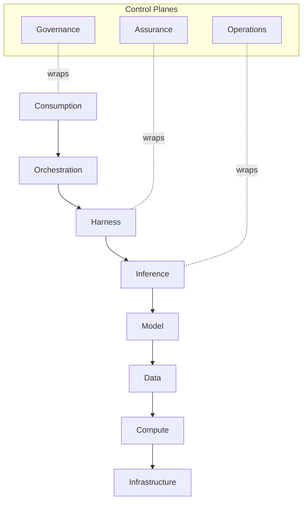
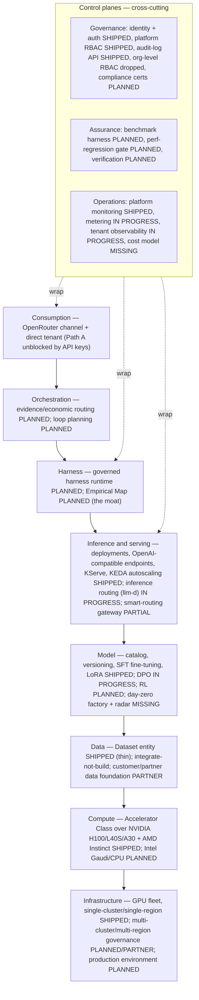

# Eight-Layer Stack

A **view**, not a competing layer model. The [[RackAI Enterprise AI Development Plan|dev plan]] describes the architecture as **eight layers** (consumption, orchestration, harness, inference, model, data, compute, infrastructure) wrapped by **three control planes** (governance, assurance, operations) and cut by two axes (cost, lifecycle). That is an *architecture decomposition of the stack*.

The knowledge base's **five layers** (L1 entities → L2 operations → L3 commercial → L4 evidence → L5 wiki) are *knowledge-graph tiers*, not architecture layers. The two are orthogonal and compose: the dev plan's architecture lives almost entirely inside canonical **L1** (entities) and **L2** (operations), with the cost axis in **L3**.

> **One-Concept Rule.** The five knowledge-graph layers remain canonical. This note is the single home for the eight-layer *framing*; it does not redefine any concept, it points at each concept's canonical home. Consumption maps to the initiative/channel layer, not a platform layer.

## Stack → Canonical Homes

| Dev-plan layer/plane | Knowledge layer | Canonical home(s) |
|---|---|---|
| **Consumption** | Initiatives / channels | [[OpenRouter Initiative]] (distribution channel), [[Solution Marketplace]] (FDE-authored [[Packaged Solution|Packaged Solutions]]), direct tenant consumption, Uniphore apps ([[Enterprise AI Portfolio]]) |
| **Orchestration** | L2 | [[Request Routing]] (+ [[Loop Planning & Credit Assignment]]) |
| **Harness** | L1 + L2 | [[Governed Harness]], [[Empirical Map]] (built in the harness program, dev-plan 1.5); runtime overlaps [[Serving Runtime]] |
| **Inference** | L1 + L2 | [[Model Deployment]], [[Serving Runtime]]; [[Request Routing]], [[Quantization Program]] |
| **Model** | L1 + L2 | [[Model]], [[Model Class]], [[LoRA Adapter]], [[Fine-Tuning Job]]; [[Verification]] |
| **Data** | L1 (thin, integrate-not-build) | [[Dataset]]; perimeter edges in [[Perimeter Information-Flow Control]] |
| **Compute** | L1 | [[Accelerator Class]], [[GPU Node]], [[GPU Cluster]] |
| **Infrastructure** | L1 | [[GPU Fleet]], [[Region]], [[Topology]] |
| **Governance plane** | L2 + Governance Hub | [[Identity & Access Control]], [[Audit]], [[Governable Self-Modification]], provenance/replay (in [[Verification]]) |
| **Assurance plane** | L2 + L4 | [[Verification]], [[Eval as CI]], [[Performance Regression Gate]] |
| **Operations plane** | L2 | [[Metering]], [[Monitoring & Observability]], [[Autoscaling]], [[Procurement Trigger]], [[Agent Identity]], [[Action Controls]], [[Supply Chain Inventory]] |
| **Cost axis** | L2 + L3 | [[Metering]] → [[AI FinOps]], [[Cost per Outcome]] |
| **Lifecycle axis** | L2 | [[Standard Model Deployment]], [[Canary & Rollback]], [[Model Launch Factory]] |

## The Stack (reference diagram)

```mermaid
flowchart TD
    subgraph PLANES[Control Planes]
      GOV[Governance]
      ASR[Assurance]
      OPS[Operations]
    end
    CON[Consumption] --> ORC[Orchestration]
    ORC --> HAR[Harness]
    HAR --> INF[Inference]
    INF --> MOD[Model]
    MOD --> DAT[Data]
    DAT --> CMP[Compute]
    CMP --> INFRA[Infrastructure]
    GOV -.wraps.- CON
    ASR -.wraps.- HAR
    OPS -.wraps.- INF
```

## Technical Stack (status-annotated)

The reference diagram above shows the *shape* of the architecture. This one is the **technical stack view** for an engineering or technical-buyer audience: the same eight layers plus three control planes, annotated with **what is shipped vs. planned today**. It is a projection over two authoritative sources — the shipped-product [[RackAI Platform|Capability Map]] and the [[Capability Gap Register]] — not a new decomposition.

> **Why this is `derived`, not `assumed`.** The layer *framing* comes from the dev plan (`assumed`), but the shipped/planned status on each layer is traced to RackAI 1.0.0 docs and the delivery roadmap via the [[Capability Gap Register]]. Status labels below use the register's vocabulary: **shipped** (`measured` in 1.0.0), **in progress** (staffed/tracked now), **planned** (`assumed`/`derived`, not built), **partner** (delivered via a [[Load-Bearing Bets|bet]]).

```mermaid
flowchart TD
    subgraph PLANES["Control planes — cross-cutting"]
        direction LR
        GOV["Governance: identity + auth SHIPPED, platform RBAC SHIPPED, audit-log API SHIPPED, org-level RBAC dropped, compliance certs PLANNED"]
        ASR["Assurance: benchmark harness PLANNED, perf-regression gate PLANNED, verification PLANNED"]
        OPS["Operations: platform monitoring SHIPPED, metering IN PROGRESS, tenant observability IN PROGRESS, cost model MISSING"]
    end

    CON["Consumption — OpenRouter channel + direct tenant (Path A unblocked by API keys)"]
    ORC["Orchestration — evidence/economic routing PLANNED; loop planning PLANNED"]
    HAR["Harness — governed harness runtime PLANNED; Empirical Map PLANNED (the moat)"]
    INF["Inference and serving — deployments, OpenAI-compatible endpoints, KServe, KEDA autoscaling SHIPPED; inference routing (llm-d) IN PROGRESS; smart-routing gateway PARTIAL"]
    MOD["Model — catalog, versioning, SFT fine-tuning, LoRA SHIPPED; DPO IN PROGRESS; RL PLANNED; day-zero factory + radar MISSING"]
    DAT["Data — Dataset entity SHIPPED (thin); integrate-not-build; customer/partner data foundation PARTNER"]
    CMP["Compute — Accelerator Class over NVIDIA H100/L40S/A30 + AMD Instinct SHIPPED; Intel Gaudi/CPU PLANNED"]
    INFRA["Infrastructure — GPU fleet, single-cluster/single-region SHIPPED; multi-cluster/multi-region governance PLANNED/PARTNER; production environment PLANNED"]

    CON --> ORC --> HAR --> INF --> MOD --> DAT --> CMP --> INFRA
    PLANES -. wrap .-> CON
    PLANES -. wrap .-> HAR
    PLANES -. wrap .-> INF
```

### Layer-by-layer status

| Layer | Shipped today | In progress / planned | Canonical home |
|---|---|---|---|
| **Consumption** | Direct tenant endpoints; OpenRouter Path A unblocked by [[API Key]] | Public provider path scaling | [[OpenRouter Initiative]] |
| **Orchestration** | — | Evidence/economic [[Request Routing]] planned | [[Request Routing]], [[Loop Planning & Credit Assignment]] |
| **Harness** | — | [[Governed Harness]] runtime + [[Empirical Map]] planned (the moat) | [[Governed Harness]] |
| **Inference** | [[Model Deployment]], OpenAI-compatible endpoints, [[Serving Runtime]] (vLLM/NIM), [[Autoscaling]] | Inference routing (llm-d) in progress; smart-routing gateway partial | [[Model Deployment]], [[Serving Runtime]] |
| **Model** | [[Model]] catalog, versioning, SFT [[Fine-Tuning Job]] → [[LoRA Adapter]] | DPO in progress; RL planned; [[Model Radar]] + [[Model Launch Factory]] not built | [[Model]], [[Model Class]] |
| **Data** | [[Dataset]] (thin) | Customer/partner data foundation (integrate, not build) | [[Dataset]] |
| **Compute** | [[Accelerator Class]] over [[NVIDIA H100]]/[[NVIDIA L40S]]/[[NVIDIA A30]]/[[AMD Instinct]] | Intel Gaudi, CPU planned | [[Accelerator Class]], [[GPU Node]] |
| **Infrastructure** | [[GPU Fleet]], single-cluster / single-region | Multi-cluster/region governance; production [[Environment]] | [[GPU Fleet]], [[Region]], [[Topology]] |
| **Governance plane** | Identity + auth, platform RBAC, audit-log query API | Org-level RBAC dropped; compliance certs (SOC 2 / ISO 42001) planned | [[Identity & Access Control]], [[Audit]] |
| **Assurance plane** | — | [[Benchmark Run]] harness, [[Performance Regression Gate]], [[Verification]] all planned | [[Verification]], [[Performance Regression Gate]] |
| **Operations plane** | Platform-level [[Monitoring & Observability]] | [[Metering]] in progress; tenant observability in progress; [[Cost per GPU-Hour]] cost model missing | [[Metering]], [[Monitoring & Observability]] |

> **The honest through-line** (from the [[Capability Gap Register]]): RackAI can **serve and increasingly meter/observe** models today — the bottom four layers (inference, model, compute, infrastructure) and parts of the governance/operations planes are real. The **top layers (orchestration, harness) and the assurance plane are largely planned**, and the moat items ([[Empirical Map]], [[Verification]]) are not built. A technical stack diagram must show that seam, not imply the whole tower is live.

## Coverage & Gaps

The build-versus-consume-versus-partner detail (what RackAI/Uniphore/Palantir cover today, what is near-term build, what is long-term research or partner-accelerated) is preserved faithfully in Table 2 of the [[RackAI Enterprise AI Development Plan]]. The moat items — the [[Empirical Map]], [[Verification]], routing off the map, the [[Self-Improvement Loop]], and [[Governable Self-Modification]] — are the concepts that only accrue value inside the perimeter.

## See Also

- [[Enterprise AI Portfolio]]
- [[RackAI Platform]] — the shipped-product Capability Map this technical view reconciles against
- [[Capability Gap Register]] — authoritative shipped-vs-planned status per capability
- [[Enterprise AI Solution Stack (Marketing)]] — the customer-facing projection of the same stack
- [[Enterprise AI Cloud Product Model]] — the canonical product model (three consumption offers) that maps every capability back to these layers
- [[Solution Marketplace]] — the second Consumption-layer channel (after OpenRouter): FDE-authored [[Packaged Solution|Packaged Solutions]], RackAI-governed
- [[Wiki Hub]]
