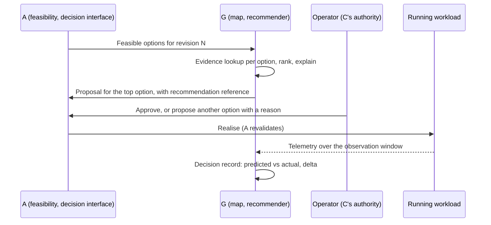

# Empirical Map & Evidence-Informed Routing — PRD

| Field | Value |
|:--|:--|
| Version | v0.2 |
| Status | Draft |
| Owner | rackai-product |
| Reviewers | Product owner; AI Harness (Map owner); Inference Optimization (benchmark producer); Inference and Serving Services (telemetry producer); A, B, C, D, E owners |
| Product review | **Product-owner review disposition, 2026-10-10: conditional acceptance; not formal artifact approval.** PD-1 to PD-11 approved in principle (PD-2, PD-3, PD-11 explicitly). Revised in v0.2: G owns `scid` ([[Serving Configuration Identity]], X-2); ranking evidence kept separate from `performance: verified`; typed statuses, failure classes and release gates adopted |
| Product approval | not yet approved |
| Date | 2026-10-10 |
| Roadmap items | Empirical Map v1 + transferable/isolated split; Workload characterization; Evidence-informed routing (routing reads the map); Accelerator selection (evidence-informed); Day-zero model factory, closed-loop optimization |
| Tech spec(s) | [[Empirical Map & Evidence-Informed Routing Tech Spec]] (v0.2 draft, not yet approved): designs Phase 1 and the Phase-2 routing interface; the two later rows are not designed |

> **Artifact type: Product Requirements Document.** The canonical concepts are [[Empirical Map]], [[Traffic Class]] and [[Request Routing]]. This PRD projects from them and must not redefine them. If they disagree, the canonical notes win and this PRD is stale.
>
> **Status banner.** *Draft PRD for a proposed initiative.* Nothing here is built. There is no map, no characterization and no recommender today, and no benchmark has been run (§2). Every requirement is intent, not commitment. Proposal **P-005**; the roadmap says **prototype first** (§14).
>
> **Scope line (read first).** This PRD owns **the evidence and the recommendation**: turning real traffic into workload classes, keeping the Empirical Map of what each model × configuration × accelerator achieves and costs, deciding which evidence counts as `performance: verified`, and ranking the options A has already found feasible. It does **not** own: the declaration, feasibility, the decision interface or placement execution (**A**); who may propose, approve or automate (**C**); what may leave the customer's boundary (**E**, which sets the rule G applies); the customer evidence report (**D**); cost data (**B**); running benchmarks (the [[Benchmark Evidence Chain]] producers); the inference routing substrate (llm-d, roadmap *M2: Inference routing*, engineering only).

## 1. Summary / Vision

RackAI should get better at choosing *how* to run a workload with every workload it runs. This PRD delivers that capability's first increment: a store of measured evidence (the [[Empirical Map]]), a way to describe real traffic in comparable terms ([[Traffic Class]]), and a recommender that ranks A's feasible placements with confidence, evidence, assumptions and uncertainty. A human approves at MOE-1. Every recommendation leaves a record of what was predicted and what happened, so a later decision can learn from it.

Why now: the roadmap calls the map the moat and the highest-information experiment (K2). Operating evidence not captured now cannot be backfilled. And A's `performance: verified` status has no evidence source beyond an operator-curated table until G exists.

## 2. Problem Statement

**What is missing today** (read-only survey, `RSS-Engineering/rackai@79ca4de`; `derived`):

- **No evidence store and no recommender.** Nothing turns operating data into a placement decision. Accelerator choice is the customer's, or the default scheduler's. The planned model-aware "auto" mode is a reserved name only (`rackai@79ca4de:api/v1alpha1/acceleratorclass_types.go`, RACKAI-251).
- **Routing is per deployment, not evidence-informed.** Each llmisvc deployment gets its own InferencePool and endpoint picker (EPP), with an empty scheduler block filled from KServe presets (`rackai@79ca4de:internal/runtime/build_llm.go`). Requests are routed by deployment name to that deployment's replicas. Nothing chooses between deployments, and nothing reads cost or reliability (`rackai@79ca4de:docs/architecture/inference.md`).
- **The telemetry a map needs is partial.** Per-request metering records tokens (input, output, cached), model, tenant and project, but leaves latency, queue and compute time at zero and carries no deployment or accelerator (`rackai@79ca4de:internal/meteringextproc/processor.go`). The vLLM engine series are not scraped on the llmisvc path by default, and no rule reads TTFT or inter-token latency (`charts/rackai-monitoring/templates/servicemonitor-llmisvc-workload.yaml`, values `serviceMonitors.llmisvcWorkload.enabled: false`). Tenant latency recording rules exist but are off by default, so the observability API returns empty series (`internal/observabilityservice/metrics.go`; values `recordingRules.enabled: false`).
- **No measured benchmark exists.** The [[Benchmark Library]] has planned runs only; the [[AMD MI350P Qualification Plan]] is planned and blocked on topology confirmation. Per-profile SLO thresholds are unratified (roadmap row 11), so no B4 qualification is possible yet.

**Why it matters.** Without evidence, A can only say `performance: unverified`, and "RackAI chooses by default" is a choice without a basis. **Hypothesis** (no evidence yet; K2): evidence accumulated from operating workloads improves placement decisions against a static baseline, and some of it transfers across customers without breaking isolation.

## 3. Product Principles

1. **Rank inside the boundary, never move it.** G only ranks options A already found feasible and never relaxes a hard constraint. Soft preferences shape the ranking; they never add or remove an option.
2. **One door.** Recommendations reach execution only through A's decision interface. Human approval now; later automation uses the same door.
3. **Say what the evidence supports, and no more.** **Ranking evidence is not verification evidence.** Evidence good enough to rank options (a B3 card, a similar configuration, another estate's aggregate) never supports a claim that a hard service-level target *will be met*; only `performance: verified` under PD-3 to PD-6 does ([[Verification Status Vocabulary]]). Evidence-backed is not empirically validated. Insufficient evidence is a result, not a gap to fill with a guess.
4. **Shape, never content.** The map learns from how workloads behave, never from what customers send. Customer-isolated data stays inside its boundary.
5. **Every decision is a learning event.** No recommendation without a record of what was predicted, what was chosen and what happened.
6. **Success is defined before it is measured.** The baseline and pass thresholds are fixed before evaluation, so a win can't be found after the fact on whichever metric moved.

## 4. Scope: Goals & Non-Goals

**Goals**
- Real traffic is characterised into [[Traffic Class]] profiles that can be compared with what the customer declared.
- The [[Empirical Map]] holds per (profile × model × serving configuration × accelerator) evidence of performance, reliability and cost, each value traceable to its source.
- A's `performance: verified` status rests on a stated, testable evidence standard (A's Q-13), supplied by G.
- Each feasible placement gets an evidence-backed recommendation that an operator can approve, override or ignore, and every decision leaves a learning record.
- The bet is tested against a pre-registered static baseline.

**Non-Goals / Out of Scope**
- Feasibility, the decision interface, approval enforcement, placement execution and runtime containment: **A**.
- Who may propose, approve or automate, and approval rules: **C**.
- The boundary rule for what may leave a customer's perimeter: **E**. G applies it.
- The customer-facing evidence report and [[SLO Attainment]] reporting: **D**. G contributes records.
- Cost per GPU-hour and cost per workload: **B**. G consumes them.
- Running benchmarks and signing qualification records: the [[Benchmark Evidence Chain]] (Inference Optimization; Inference and Serving Services). G consumes registered artifacts.
- The llm-d routing substrate (roadmap *M2: Inference routing*): engineering. G's Phase 2 reads it.
- Model quality and correctness ([[Verification]]). The map's reliability dimension is serving reliability in this PRD.
- Customer-visible capability-class declarations (A FR-18): A Phase 2, informed by G later.

## 5. Users & Personas

| Persona | Side | Needs from G |
|---|---|---|
| **RackAI operator** | RackAI | A ranked, explained recommendation per declaration; the evidence behind it; where evidence is missing |
| **AI Harness** (Map owner) | RackAI | One schema and surface for evidence; a record of every decision and outcome |
| **Inference Optimization; Inference and Serving Services** (producers) | RackAI | One place to register benchmark artifacts and telemetry, and a view of which gaps would change a decision |
| **RackAI product & finance** | RackAI | Evidence that the map improves decisions (the K2 test); cost and reliability by configuration |
| **Customer application owner** | Customer | Through A and D: why a placement was chosen, its `performance` status, how their traffic compares with what they declared. Never another customer's data |
| **Downstream PRDs** (A, D, F) | Platform | A: recommendations and the evidence source. D: performance records. F: a consumer of map gaps for its onboarding benchmark gate |

## 6. Core Entities

| Entity | Role here |
|---|---|
| [[Empirical Map]] | The store G builds and owns (canonical) |
| [[Traffic Class]] | The measured shape of traffic; profiles are instances of it (canonical) |
| [[Request Routing]] | The workflow that reads the map in Phase 2 (canonical) |
| [[Workload Declaration]] | The input: profile, service levels, expected load, soft preferences |
| [[Benchmark Run]] / [[Benchmark Evidence Chain]] | Where benchmark evidence comes from, with claim rights per tier (B1–B5) |
| [[SLO Attainment]] | The outcome metric; measured by D, against row-11 thresholds |
| [[Cost per 1M Tokens]] / [[Cost per Outcome]] | The cost dimension; inputs from B |
| [[Model Deployment Specification]] | Records which recommendation, if any, a placement followed |
| [[Serving Configuration Identity]] | `scid`: the one name for a serving configuration. **G owns it** (X-2): schema, digest, versioning, compatibility and verification semantics. F produces it at qualification; A matches evidence by it (canonical; written with this PRD) |
| [[Verification Status Vocabulary]] | The typed statuses G uses: `performance` (G's rules, A applies), distinct from F's `qualification` and from feasibility |

**Defined here, not yet canonical** (only G uses them):
- **Evidence cell**: one map entry for (profile, `scid`, cluster profile), holding measured operating points and their provenance.
- **Ranking evidence** vs **verification evidence**: ranking evidence may order options and set confidence; only verification evidence (PD-3 to PD-6) yields `performance: verified`. A recommendation states which kind each option rests on.
- **Recommendation**: a ranking of exactly A's feasible options for one declaration revision, with per-option predicted outcome, confidence, evidence references, assumptions and uncertainty.
- **Decision record (learning event)**: declared constraints, alternatives considered, chosen realisation, whether it followed the recommendation, predicted outcome, actual outcome and the measured delta.
- **Static baseline**: the choice RackAI would make without G (PD-9), used to test whether G helps.
- **Transferable / customer-isolated**: the classification every map field carries ([[Three Battlegrounds]]). The rule that sets it is E's.

G also consumes A's *supply target*, *accelerator pool* and *execution location*. That makes G their second consumer, which the [[PRD Coverage Plan]] says is when they become canonical (D-10).

## 7. User Journeys / Scenarios

**Worked example — recommendation at MOE-1.** A customer declares *GLM 5.3 Flash*, profile *interactive*, service levels per the ratified thresholds (D-1), expected load *steady, moderate concurrency*, Level 1, economics *lean toward cost*. A finds two feasible options on two pools.
1. G looks up evidence for each option's exact serving configuration. Option 1 has a current B4 qualification record covering the declared load: `performance: verified`. Option 2 has only a B3 benchmark card: `performance: unverified` (provisional). The card is ranking evidence only; it cannot support a claim that the target will be met.
2. G ranks both. Option 1 first: `performance: verified`, predicted cost per 1M tokens from B's inputs. Option 2 second: cheaper on paper, but its latency is unqualified. The explanation names both facts, the assumptions (B's cost confidence, the declared load) and the uncertainty (repeat variance).
3. The recommendation enters A's decision interface as a proposal for option 1. The operator approves under C's rule, or proposes option 2 instead with a reason. Either way the decision record notes whether the recommendation was followed.
4. After the observation window, G records the actual attainment and cost of the running placement and the delta from the prediction. The next recommendation for a similar workload cites this record.

**Worked example — no evidence.** Neither option has evidence. G says *insufficient evidence* for both, ranks them only by A's deterministic order (the baseline), states that, and lists the benchmark that would change the decision as a gap for Inference Optimization. Nothing claims the service level will be met.

## 8. Functional Requirements

**Workload characterization (row 29)**

| # | Requirement | Priority | Notes |
|---|-------------|:--------:|-------|
| FR-1 | RackAI characterises served traffic per declaration (or deployment) over a window: input and output token distributions, prefix reuse, arrival rate, concurrency and streaming, assigned to a [[Traffic Class]] profile | MUST | Shape only (FR-6). Tool and structured-output usage: SHOULD |
| FR-2 | The characterization is compared with the declared profile and expected load. A material divergence is shown to the operator and made available to D for the customer | SHOULD | What counts as material: D-1 thresholds |

**Empirical Map (row 28)**

| # | Requirement | Priority | Notes |
|---|-------------|:--------:|-------|
| FR-3 | The map holds evidence cells keyed by profile, model revision, serving configuration, accelerator type and cluster profile, with performance at measured operating points, reliability (errors, availability, attainment) and cost | MUST | |
| FR-4 | Every value carries provenance: source type, artifact or query reference, configuration identity, load covered, when measured, and who produced and accepted it. A value without provenance is rejected | MUST | PD-3, PD-7 |
| FR-5 | Evidence goes stale when anything it depends on changes (serving configuration, model revision, cluster profile, thresholds), and also past a maximum age | MUST | PD-6 |
| FR-6 | Every stored field is classified **transferable** or **customer-isolated** under E's rule. Isolated data never leaves its customer's scope. Unclassified data is rejected | MUST | PD-8 |
| FR-7 | G supplies A's performance-evidence source: for each feasible option and hard service-level target, a `performance` status of `verified`, `unverified` (with reason) or `known-fails`, with reference, under the evidence standard PD-3 to PD-6. Matching is by [[Serving Configuration Identity]] at the evidence's schema version | MUST | Replaces A's Phase-1 curated source (A spec, Q-13). The interface is a requested change to A (§16) |
| FR-8 | The operator can see map coverage: which offered cells have current evidence, which are stale, and which missing evidence would change a pending decision | SHOULD | Feeds benchmark requests |

**Recommendation and learning (row 28)**

| # | Requirement | Priority | Notes |
|---|-------------|:--------:|-------|
| FR-9 | For each feasible option set from A, G produces a recommendation over **exactly** that set: rank, predicted outcome per hard target, predicted cost, confidence, evidence references (each marked ranking or verification evidence), the option's `performance` status, assumptions, uncertainty and a plain explanation. No option is added, and none is dropped silently. A predicted outcome is never presented as the target being met unless the status is `performance: verified` | MUST | |
| FR-10 | G never relaxes a hard constraint and never ranks an option outside A's feasible set. Soft preferences (economics) affect ranking only | MUST | Invariant |
| FR-11 | Recommendations enter through A's decision interface as a placement proposal that references the recommendation. **In Phase 1 an operator creates that proposal; G's identity cannot propose.** From Phase 2, G's identity may propose at platform scope (C PD-5). G never approves | MUST | PD-2 |
| FR-12 | Where evidence is insufficient, the recommendation says so per option and falls back to the static baseline's order. It never invents confidence | MUST | |
| FR-13 | Each recommendation is labelled *evidence-backed*. *Empirically validated* is used only once the baseline evaluation supports it (PD-10) | MUST | |
| FR-14 | Every recommendation writes a decision record (§6). The actual outcome and delta are added after the observation window. An operator override records its reason | MUST | |
| FR-15 | Later recommendations use earlier decision records, and cite the ones they used | MUST | Learning test (row 28) |
| FR-16 | A baseline evaluation is pre-registered (baseline, workload, metrics, thresholds, tolerated regressions) and its results recorded per metric | MUST | PD-9 |
| FR-17 | Each characterization, evidence-status change, recommendation and decision outcome emits an evidence record in the D-0 shape | MUST | |

**Evidence-informed routing (row 30, Phase 2)**

| # | Requirement | Priority | Notes |
|---|-------------|:--------:|-------|
| FR-18 | Request routing reads the map when choosing among the backends realised under the request's own declaration, inside its approved envelope. It never sends a request to a backend outside them | SHOULD (Phase 2) | PD-11 |
| FR-19 | Map-derived routing changes are versioned, attributed and audited. A change that needs a new backend or a different serving configuration goes through A as a proposal | SHOULD (Phase 2) | |
| FR-20 | If the map is unavailable, routing falls back to the existing per-deployment behaviour | SHOULD (Phase 2) | |

**Later**

| # | Requirement | Priority | Notes |
|---|-------------|:--------:|-------|
| FR-21 | Engine × accelerator recommendations per workload cell for new supply and capability-class declarations (row 21) | MAY (later) | Includes the [[Accelerator Selection Spec]] Phase-4 model analysis as an input |
| FR-22 | Closed-loop improvement: observe a running workload and propose a better realisation inside its envelope, through A (row 64, P-007). Any automatic action needs C's authority | MAY (later) | |

## 9. Non-Functional Requirements

- **Constraint integrity.** Zero recommendations that rank an option outside A's feasible set or imply relaxing a hard constraint. An invariant, tested (AC-5).
- **Isolation.** No prompt, completion or payload content is stored. Customer-isolated records are tenant-scoped; transferable records carry no customer identity. Cross-customer use starts only after E's rule is ratified (D-4).
- **Reproducibility.** The same inputs (options, evidence snapshot, preferences) give the same ranking; each recommendation records an inputs digest.
- **Honest confidence.** A recommendation's confidence never exceeds its weakest cited input (corpus standard #8); B's cost confidence limits the cost prediction.
- **Fail closed for claims, open for placement.** If G is down, A's options are `performance: unverified`, never `performance: verified` and never *infeasible*, and operators can still propose (§12).
- **Responsiveness.** A recommendation arrives within A's interactive feasibility posture. The bound is set in the tech spec; there is no baseline.

## 10. Platform Integration

| System | Needs from it | Provides to it |
|---|---|---|
| Identity & access (IAC) | A service identity allowed to propose (C, D-7); operator and platform permissions to register, curate and read evidence | New permissions for map registration, curation and reading |
| Tenancy & isolation | Organisation and project scope for isolated records; E's transfer rule | Tenant-scoped views; no cross-tenant data |
| Metering, quotas & billing | Per-request token and timing records with deployment attribution (Metering); cost inputs (B) | None to billing; cost predictions back to B for comparison with actuals |
| Audit | The audit pipeline | Events for registration, curation, recommendation, override and outcome |
| Monitoring & observability | Engine latency, error and throughput series per deployment; tenant series turned on | Map coverage and recommendation metrics; staleness alerts |

## 11. Loop Role & Cross-PRD Interfaces

**Loop role:** *Deliver the how*: the **determining** half (choose an admissible realisation from evidence) and, later, the **improving** half (P-007). It serves the **operator** promise, bounded by the **sovereign** one: hard constraints come from A and C, and what may cross a boundary comes from E.

| Interface | Direction | Other PRD | Defined where |
|---|---|---|---|
| Workload declaration (intent + constraints) | consumes | A | [[Workload Declaration]] (canonical) |
| Feasible option set | consumes | A | [[Workload Declaration & Placement PRD]] FR-7, FR-14 |
| Placement recommendation (ranked options, confidence, evidence) | provides | A | **This PRD** (FR-9 to FR-13) |
| Performance evidence standard and source (`performance: verified` rules) | provides | A, D | **This PRD** (FR-7, PD-3 to PD-7) |
| Decision interface (`PlacementProposal`) | consumes | A | [[Workload Declaration & Placement Tech Spec]] |
| Authority to propose and approve; automation rungs | consumes | C | [[Governed Execution & Delegated Authority PRD]] |
| Transfer rule (what may leave a customer's perimeter) | consumes | E | [[Sovereign Isolation & Assurance PRD]] |
| Cost per GPU-hour and per workload | consumes | B | [[Operator Economics & KPI Instrumentation PRD]] |
| Benchmark artifacts (cards, qualification records) | consumes | — (policy) | [[Benchmark Evidence Chain]] |
| Onboarding benchmark gate results | consumes | F | [[Model Lifecycle PRD]] |
| Evidence records | provides | D | D-0 in [[Customer Observability & Evidence Report PRD]] |
| Per-profile SLO thresholds | consumes | — (decision) | Roadmap row 11 |

## 12. Failure Handling

Classes and response terms per [[Failure Mode Taxonomy]].

| Class | Failure | Response | Continues / stops / degrades | Notified | Exposure limit |
|---|---|---|---|---|---|
| Evidence | Map or evidence source unavailable | **Fail closed** for claims: options `performance: unverified` (reason: evidence unavailable); G proposes nothing | Placement continues through operator proposals (A Phase 1); recommendations stop | Operator (alert); customer sees the status | None needed: no claim is made |
| Evidence | Evidence goes stale or the `scid` drifts after realisation | **Unverified** (not a failure state): status lapses through A | Workload continues untouched | Customer and operator (status, evidence record) | — |
| Evidence | Unclassified or isolation-breaking data at ingest | **Fail closed**: rejected whole | Ingest of that item stops; others continue | Operator (alert) | Nothing partial stored |
| Evidence | Evidence artifact disputed | **Quarantine** (audited) | Excluded from new lookups; past decisions keep their record | Operator | — |
| Admission | Recommendation disagrees with A's current feasible set | **Fail closed** at A's recheck; G re-ranks the new set | Nothing placed from the stale proposal | Operator | — |
| Admission | Cost inputs (B) missing or low confidence | **Degrade**: rank without cost, labelled | Recommendation continues | Operator (in the explanation) | — |
| Authority | G's identity not permitted to propose (Phase 1, or C unavailable) | **Fail closed**: no G-created proposal | Operator-mediated proposals continue | Operator | — |
| Execution | (Phase 2) map unavailable for routing | **Degrade** to static per-deployment routing | Serving continues | Operator | — |

**Guaranteed never to happen:** a hard constraint relaxed by a recommendation; a recommendation approved by G; customer content stored in the map; one customer's isolated data shown to another; `performance: verified` claimed on ranking evidence or on evidence that fails the standard.

## 13. Data Retention & Compliance

The map holds traffic shape, performance, reliability and cost, never request content. Customer-isolated records (characterizations, outcomes, recommendations) follow the customer's audit retention setting and are deleted with the customer's organisation. Transferable cells are kept while any realised placement or decision record cites them, then per the evidence retention policy (D). Benchmark bundles are retained by their producers under the [[Benchmark Evidence Chain]].

## 14. Scope & Phasing

| Phase | Gate | Delivers | Roadmap items |
|---|---|---|---|
| **1a — Prototype** | MOE-0 → MOE-1 | One estate, a handful of workloads. Evidence registered from benchmark artifacts; G's evidence source replaces A's curated table (FR-7); recommendations through A with a human approving (FR-9 to FR-14); a pre-registered baseline evaluation (FR-16) | Empirical Map v1 + transferable/isolated split |
| **1b — Map v1** | MOE-1 | Continuous characterization (FR-1, FR-2); production-telemetry evidence and staleness (FR-5); coverage view (FR-8); the transferable split enforced (FR-6); D-0 records (FR-17); the K2 transfer test on 2–3 estates once E's rule exists | Empirical Map v1 + transferable/isolated split; Workload characterization |
| **2** | MOE-2 | Routing reads the map among a declaration's own backends (FR-18 to FR-20) | Evidence-informed routing (routing reads the map) |
| **Later** | MOE-4 | Engine × accelerator recommendations (FR-21) | Accelerator selection (evidence-informed) |
| **Later** | Beyond MOE-4 | Closed-loop improvement through A (FR-22) | Day-zero model factory, closed-loop optimization |

Sequencing: the prototype runs before any productised store is built (operate before automate). Phase 1b starts only if the prototype's evaluation is not falsifying (§18).

## 15. Acceptance Criteria & Success Metrics

**Acceptance criteria** (Phase 1 unless stated; each pass/fail; proposed, not approved):

| # | Criterion (observable, pass/fail) | Verifies | Evidence source | Gate |
|---|---|---|---|---|
| AC-1 | For a synthetic workload of known shape, the characterization assigns the expected profile and token and load distributions, and the stored record contains no request or response content | FR-1, FR-6 | Replay test report plus storage inspection | M2 / MOE-1 |
| AC-2 | Map ingest rejects an entry missing any provenance field, any [[Serving Configuration Identity]] field, or carrying an unclassified field; it accepts a complete registered artifact | FR-3, FR-4, FR-6 | Ingest test matrix results | M1 / prototype |
| AC-3 | For each evidence rule, a test option returns the stated `performance` status: current qualified record covering the load → `verified`; benchmark card only → `unverified` (provisional; ranking evidence only); configuration mismatch, identity-version mismatch, load not covered, metric not measured, stale → `unverified` with that reason; `known-fails` only on evidence that meets every rule | FR-7, PD-3 to PD-6 | Rule table test results | M1 / prototype |
| AC-4 | Changing a serving configuration's runtime image changes its `scid`, marks every cell citing the old one stale, and turns a realised placement relying on it `performance: unverified` | FR-5 | Change-injection test plus audit query | M1 (registry), M3 / MOE-1 (realised) |
| AC-5 | Across the recommendation suite, every recommendation ranks exactly A's feasible set: no extra option, no option missing without a stated status, and no ranked option violates a hard constraint | FR-9, FR-10 | Property test against A's engine | M1 / prototype |
| AC-6 | In Phase 1, a recommendation reaches A only as an operator-created proposal that references it, and G's identity is refused when it tries to create a proposal; in every phase G's identity is refused when it tries to create or alter an approval; A rechecks every proposal | FR-11 | Authorisation test results plus audit query | M1 / prototype; Phase-2 propose case at M5 / MOE-2 |
| AC-7 | Every recommendation carries an explanation, assumptions, uncertainty, confidence, evidence references marked ranking or verification, and each option's `performance` status; no option is described as meeting a target unless it is `performance: verified`; with no evidence it states *insufficient evidence* and uses the baseline order | FR-9, FR-12, FR-13 | Schema test plus no-evidence and ranking-only cases | M1 / prototype |
| AC-8 | Every committed placement has a decision record; after the observation window it holds the actual outcome and delta; an override holds its reason | FR-14 | Decision-record query on the prototype estate | M1 (record), M3 / MOE-1 (actuals) |
| AC-9 | At least one later recommendation cites an earlier decision record in its evidence | FR-15 | Recommendation record on the prototype estate | M3 / MOE-1 |
| AC-10 | The baseline evaluation's plan is recorded and dated before evaluation starts, and its results are recorded per metric, including regressions; a run started before registration is rejected | FR-16 | Evaluation plan and results records | M1 / prototype |
| AC-11 | Tenant B's views and recommendations contain no data from tenant A's isolated records, and no transferable record carries a customer identifier | FR-6, §9 | Cross-tenant test plus schema check | M1; re-run M4 |
| AC-12 | Every FR-17 event yields an evidence record that validates against D-0 with the status type bound to its kind | FR-17 | D-0 schema validation results | M1 (interim), M3 / MOE-1 |
| AC-13 | With the map unavailable, A returns `performance: unverified` options, G makes no proposal, and an operator proposal still completes | §12 | Fault-injection test results | M1 / prototype |
| AC-14 | (Phase 2) Routing never dispatches a request to a backend outside the declaration's approved envelope, and falls back to static routing when the map is down | FR-18, FR-20 | Negative test plus fault injection | M5 / MOE-2 |

**Success metrics** (ladder; baselines are "none today"; targets are postures, not values):
1. **Coverage:** share of offered cells with current evidence. Baseline 0.
2. **Verified placements:** share of realised placements verified at approval (A's metric 5, supplied by G).
3. **Use:** share of placement decisions with a G recommendation, and share where operators followed it.
4. **Prediction quality:** gap between predicted and actual attainment and cost, from decision records.
5. **Decision quality vs baseline:** per pre-registered metric (FR-16).
6. **Flywheel (the roadmap's killer metric):** share of operating decisions informed by cross-workload evidence. Starts only after E's rule.

## 16. Dependencies

- **Decision (row 11):** per-profile SLO thresholds and reference loads. Without them there is no B4 record and no `performance: verified` claim (D-1). Gating.
- **A:** the feasible option set, the decision interface and the evidence-source seam ([[Workload Declaration & Placement Tech Spec]]).
- **B:** cost per GPU-hour and per workload. Recommendations rank without cost until it exists.
- **C:** whether G's identity may propose; approval and automation rules.
- **E:** the transfer rule.
- **D:** the D-0 contract; [[SLO Attainment]] measurement for actual outcomes.
- **Benchmark Evidence Chain producers:** B3 cards and B4 qualification records ([[AMD MI350P Qualification Plan]] is the first).
- **Engineering:** metering timing fields, the engine-series scrape and recording rules (§2); llm-d routing (Phase 2).
- **Requested interface changes to A** (consumer requirements; A's contract until A adopts them): an `evidence.Source` signature; `PlacementProposal.spec.basis.recommendationRef` and `spec.override { recommendationRef, reason }`; the reasons `ProvisionalOnly`, `ThresholdsUnratified`, `IdentityVersionMismatch`.
- **Requested change to F:** produce `scid` at qualification and register qualification and benchmark records as evidence artifacts carrying the full identity record.
- **Depended on by:** A (evidence source, recommendations), D (performance records), F (benchmark gaps), H (explanations to customers, read only).

## 17. Risks & Mitigations

| Risk | Mitigation |
|---|---|
| Too little evidence to rank anything at MOE-1 | Prototype first; *insufficient evidence* is an honest result; the coverage view turns gaps into benchmark requests |
| The map becomes a side door around A | Proposals only through A's interface; G cannot approve (AC-6); the Phase-4 "auto" rebinding is not used for declaration-managed workloads (PD-2) |
| Cross-customer learning leaks customer information | Shape only; E owns the rule; transfer off until ratified; isolation test (AC-11) |
| Success claimed on whichever metric moved | Pre-registered evaluation (PD-9) |
| Evidence standard so strict that nothing is ever verified | It is the same standard A already applies; strictness is visible as coverage and drives benchmarking. Review after the prototype |
| No team owns measurement and self-improvement (P-005) | Ownership is D-3, raised as the first adoption blocker |

## 18. Kill / Falsification Criterion

Two bets, tested separately.

**Bet 1: evidence improves decisions.** Falsified if, on the pre-registered baseline evaluation, map-informed recommendations do not beat the static baseline on the pre-fixed thresholds for SLO attainment, cost efficiency and decision quality, with constraint compliance held at zero violations, **and** the result persists after one revision of the ranking method within this scope. If falsified: keep G's evidence standard and source for A (it still serves `performance: verified`), stop building recommendation and routing, and revisit P-005 with the product owner.

**Bet 2 (K2): learning transfers.** Falsified if, on 2–3 estates under E's rule, evidence from one estate does not improve decisions on another better than that estate's own evidence alone. If falsified: the map stays per customer; do not give it disproportionate investment (roadmap K2).

**Evidence:** decision records, the baseline evaluation, operator override reasons, B's cost actuals, D's attainment. The thresholds are fixed in the evaluation plan before it runs (PD-9, D-2).

## 19. Open Decisions

| # | Decision | Owner | Blocks |
|---|----------|-------|--------|
| D-1 | Per-profile SLO thresholds, reference loads and what counts as a material traffic divergence (roadmap row 11; A D-1) | Product owner | *Verified* claims; FR-2; AC-3 values |
| D-2 | The baseline evaluation's workload, metrics, pass thresholds and tolerated regressions | Product owner, with AI Harness | FR-16; §18 |
| D-3 | Who owns and staffs measurement and self-improvement (AI Harness per [[Pillar Working Model]]) | Product owner | Everything (P-005 blocker) |
| D-4 | E's transfer rule: which fields are transferable, minimum contributors before aggregation, and customer consent or opt-out | E owner, with product owner | Cross-customer use; Bet 2 |
| D-5 | Which 2–3 estates run the transfer test, and on what consent | Product owner | Bet 2 |
| D-6 | Routing scope in Phase 2: a declaration's own backends only, or shared-model pools across declarations (with I) | Product owner, with I | FR-18 |
| D-7 | Whether G's service identity may hold the propose permission; whether approver must differ from proposer | C owner | **Proposed answer in C** ([[Governed Execution & Delegated Authority PRD]] PD-5, FR-16): in Phase 2, G's identity may hold `placement:propose` at platform scope and never approve; approver differs from proposer. In Phase 1 an operator proposes from G's recommendation |
| D-8 | When B's cost inputs arrive, and at what confidence. G reads B's rate per accelerator class and B's `cost` records in the internal view (`audience: operator`) | B owner | Cost dimension of FR-9 |
| D-9 | Values for the evidence maximum age, the outcome observation window and the minimum telemetry window | Product owner, with AI Harness | FR-5, FR-14 |
| D-10 | Make *supply target*, *accelerator pool* and *execution location* canonical now that G consumes them | Knowledge-graph steward, with A | One-Concept Rule |

## 20. Proposed Product Decisions

Approved in principle by the product owner's review disposition (2026-10-10; conditional acceptance, not formal approval). PD-3 to PD-7 are the proposed answers to A's Q-13.

| # | Decision | Alternatives considered | Why this one | Status |
|---|---|---|---|---|
| PD-1 | **Prototype first.** Phase 1 starts as a prototype on one estate with a few workloads; the productised map follows only if the prototype is not falsifying | Build the map platform first | The roadmap's instruction; the cheapest test of the thesis (K2) | proposed — approved in principle 2026-10-10 (PO review) |
| PD-2 | **One door, no side door.** G ranks only A's feasible set and proposes only through A's decision interface. For declaration-managed workloads, the [[Accelerator Selection Spec]] Phase-4 "auto" rebinding and fallback list are not used to bind placements; its model-analysis output becomes an input to G and to the baseline | Let Phase 4 bind "auto" directly | Keeps "never silently relaxed" true; one decision record per placement | proposed — approved in principle 2026-10-10 (PO review) |
| PD-3 | **Provenance (A's Q-13).** *Verified* needs either (a) a current **B4 Service Qualification Record** against ratified thresholds, or (b) **production telemetry** of the same declaration's running workload over a stated window. A **B3 benchmark card** alone is evidence-backed context: it informs ranking, but is never `performance: verified` and never drives *fails* | Accept B3 cards as verified; accept operator entries | Matches the chain's rule that attainment exists only at B4; known infeasibility needs the same bar | proposed — approved in principle 2026-10-10 (PO review) |
| PD-4 | **Configuration match (A's Q-13).** Exact match on the serving configuration (runtime image digest, engine version, model revision and tokenizer, quantization, parallelism, scheduler flags, serving path) and the hardware (accelerator type, GPUs per replica, cluster profile). Identity is [[Serving Configuration Identity]] (`scid`, owned by G), matched at the evidence's schema version. Similar configurations may raise ranking confidence, never `performance: verified` | Similarity-based matching | A small change can move latency a lot; exact match is checkable | proposed — approved in principle 2026-10-10 (PO review) |
| PD-5 | **Load coverage (A's Q-13).** Evidence covers the declared load only for the same profile, when the qualified operating point is at or above the declared concurrency and arrival rate, and the declared token lengths sit inside the measured range. Interpolation is allowed, extrapolation never. No declared load → the profile's reference load (D-1) | Cover by profile only | Closed-loop and open-loop results differ; the chain requires open-loop for B4 | proposed — approved in principle 2026-10-10 (PO review) |
| PD-6 | **Freshness (A's Q-13).** Primarily event-driven: evidence is current until the chain's change-impact rules mark it stale or superseded. A maximum age is a backstop (value D-9). Re-checked at commit and periodically after realisation | Age only | Age alone misses the changes that matter and expires evidence that is still valid | proposed — approved in principle 2026-10-10 (PO review) |
| PD-7 | **Who curates (A's Q-13).** Producers stay authoritative for their data (Inference Optimization for cards, Inference and Serving Services for qualification records and telemetry, B for cost). AI Harness owns the schema and ingest. Evidence enters only by registration or a defined telemetry query. Nobody hand-enters a `performance: verified` row; an operator may quarantine evidence with an audited reason, never promote it. G's source **replaces** A's Phase-1 operator-curated source | Operators curate a table (A's interim) | Matches the [[Pillar Working Model]]; removes the one place a claim could be typed in | proposed — approved in principle 2026-10-10 (PO review) |
| PD-8 | **Transferable split by E's rule, transfer off until ratified.** The map stores shape, performance and cost by configuration as transferable, and everything identifying or derived from a customer as isolated. Cross-customer use starts only after E ratifies the rule | G decides transferability alone | E owns what crosses a boundary (ownership rule 1); fail closed | proposed — approved in principle 2026-10-10 (PO review) |
| PD-9 | **Pre-registered baseline.** The baseline is what RackAI would do without G: A's deterministic first feasible option, or the operator's choice made without seeing G's ranking. Metrics: SLO attainment, cost efficiency, decision quality, with constraint compliance as an invariant. Thresholds fixed before evaluation (D-2), on the same baseline workload replayed for both choices | Compare after the fact | Roadmap row 28 (2026-10-09): improvement defined in advance | proposed — approved in principle 2026-10-10 (PO review) |
| PD-10 | **Claims ladder.** Phase 1 claims *evidence-backed* only. *Empirically validated* needs a passing baseline evaluation across enough workloads (D-2). Customers see A's `performance` status and the explanation, never map internals or another customer's data | Claim validated from early wins | Few workloads can't support generalised claims | proposed — approved in principle 2026-10-10 (PO review) |
| PD-11 | **Phase-2 routing stays inside the envelope.** Routing chooses only among backends realised under the request's declaration, inside its approved envelope. Weight changes among them are routine and audited; adding a backend or changing the serving configuration is a proposal through A | Per-request routing across any eligible pool ([[Request Routing]] as written) | Per-request choices must not escape A's constraints or the approval rule | proposed — approved in principle 2026-10-10 (PO review) |

**Flagged as most contestable in v0.1 and explicitly approved in principle (PO review 2026-10-10):** PD-3, PD-11, PD-2.

## See Also

- [[Empirical Map]] · [[Traffic Class]] · [[Request Routing]] — the canonical concepts
- [[Empirical Map & Evidence-Informed Routing Tech Spec]] — the engineering design
- [[Workload Declaration & Placement PRD]] — A: the declaration, feasibility and the decision interface G proposes through
- [[Benchmark Evidence Chain]] · [[Benchmark Library]] · [[AMD MI350P Qualification Plan]] — where benchmark evidence comes from
- [[PRD Coverage Plan]] · [[RackAI Roadmap]] (P-005, K2) · [[Milestone Release Map]] (Track 3)
