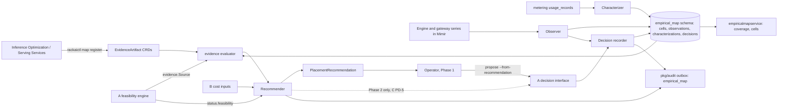
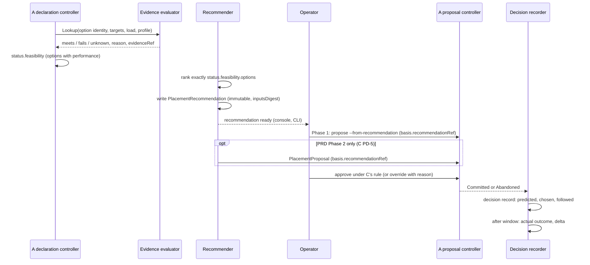

# Empirical Map & Evidence-Informed Routing — Technical Specification

| Field | Value |
|:--|:--|
| Version | v0.2 |
| Status | Draft |
| Author | Wiki agent for rackai-product (draft for platform engineering and AI Harness) |
| Reviewers | Platform engineering (control plane); AI Harness; Inference Optimization; Monitoring; Metering; Product owner; A, C, E owners |
| Engineering approval | not yet approved |
| Product review | **Product-owner review disposition, 2026-10-10: conditional acceptance; not formal artifact approval.** PRD G PD-1 to PD-11 approved in principle. Revised in v0.2: `scid` is canonical and G-owned ([[Serving Configuration Identity]], X-2; Q-16 closed); ranking evidence separated from `performance: verified`; Phase-1 operator-mediated proposal flow in components and diagrams; requested interface changes to A labelled (S-5); failure handling per [[Failure Mode Taxonomy]]; readiness states and release blockers per [[Release Readiness States]] |
| Product approval | not yet approved |
| Date created | 2026-10-10 |
| Based on PRD(s) | [[Empirical Map & Evidence-Informed Routing PRD]] (v0.2 draft, PO review 2026-10-10 conditional acceptance, not yet approved; spec drafted alongside per product-owner instruction 2026-10-10) |
| Roadmap items | Empirical Map v1 + transferable/isolated split; Workload characterization; Evidence-informed routing (routing reads the map) |
| Jira epic(s) | none yet: one epic per milestone (§13), to be created by platform engineering |

> **Artifact type: Technical Specification.** Its concepts have canonical notes: [[Empirical Map]], [[Traffic Class]], [[Request Routing]], [[Benchmark Run]]. This spec designs *how* to build them and does not redefine them.
>
> **Status banner.** *Proposed design; nothing is built.* Every design statement is `assumed`. Statements about today's code are `derived` from the read-only survey in §3, pinned to commits. *Evidence-informed routing* gets an interface and constraints only (§4.9); its full design is a later revision. *Accelerator selection (evidence-informed)* and *Day-zero model factory, closed-loop optimization* are not designed here (DV-1).

### 0. Status markers (convention)

- **AS BUILT (YYYY-MM-DD, TICKET):** what shipped where it differs from the design above it.
- **PROPOSED, NOT BUILT (YYYY-MM-DD):** designed here, not implemented.
- **RETAINED FOR THE RECORD:** a rejected or replaced design kept for the decision record.

**RETAINED FOR THE RECORD (v0.1 → v0.2, 2026-10-10):** v0.1 had the recommender create proposals from M3 and owned `scid` only inside this spec. v0.2 follows the PO review: in Phase 1 only an operator proposes (from the recommendation); the recommender proposes only from PRD Phase 2 (C PD-5). `scid` moves to the canonical [[Serving Configuration Identity]] note, with schema versioning.

## 1. Overview

This spec adds an **evidence registry**, an **Empirical Map store**, a **performance-evidence source** for A, a **recommender** and **decision records** to the RackAI control plane (`RSS-Engineering/rackai`). Benchmark artifacts are registered as immutable cluster-scoped objects. Production telemetry is summarised into PostgreSQL tables split into transferable and customer-isolated sets. The evidence source implements the seam A left for G (`evidence.Source`, A spec §4.6.1). The recommender reads A's feasibility result, ranks exactly A's options and writes an immutable recommendation. **In Phase 1 an operator turns it into a `PlacementProposal`** through A's decision interface (A spec §4.7); the recommender itself never proposes before PRD Phase 2 (C PD-5). A decision recorder follows each commit to its observed outcome.

The change is **additive**. It runs in the existing manager binary and PostgreSQL and adds one small read service. It **requests** two optional `PlacementProposal` fields and an `evidence.Source` signature from A (§1.6; requested interface changes to A, not A's contract until adopted). It needs three changes outside the control plane: timing fields in metering, the engine-series scrape turned on, and recording rules (§3.3).

### 1.1 Goals

- G-1: Evidence registered with full provenance and change-impact status; nothing hand-typed as `performance: verified` (FR-3, FR-4, FR-5; PD-3, PD-7).
- G-2: One evidence evaluator implementing A's seam, with the rules of PD-3 to PD-6 (FR-7).
- G-3: Traffic characterization from shape-only signals, stored customer-isolated (FR-1, FR-2, FR-6).
- G-4: A deterministic recommender over exactly A's feasible set, entering only through A's decision interface (FR-9 to FR-13).
- G-5: Decision records with predicted and actual outcomes, cited by later decisions, and a replayable baseline evaluation (FR-14 to FR-16).
- G-6: A transferable/isolated split enforced by the schema, with transfer off until E's rule exists (FR-6).
- G-7: D-0 evidence records for every G decision (FR-17).

### 1.2 Non-Goals

- **Feasibility, approval, commit, containment:** A. The recommender never writes `PlacementApproval` and never touches a `ModelDeployment`.
- **Authority rules:** C (Q-3). **Transfer rule:** E (Q-4). **Evidence report:** D (Q-5). **Cost model:** B (Q-6).
- **Running benchmarks** and storing evidence bundles: Inference Optimization, under the [[Benchmark Evidence Chain]]. The registry stores references and digests.
- **Changing llm-d or the EPP.** Phase 2 routing is interface-only (§4.9).
- **The Accelerator Selection Phase-4 "auto" scheduler** (RACKAI-251): not built here. Its fit table is an optional input (§4.6).
- **Model quality evaluation** ([[Verification]]).

### 1.3 Requirements Traceability

All 22 functional requirements of `prd-empirical-map-routing`. Throughout this spec, unprefixed FR-n, AC-n, PD-n and D-n are PRD G's; A's IDs are prefixed with A (e.g. A §4.7, A's DV-5), and Q-n are this spec's own (§14).

| PRD · req | Spec section(s) | Milestone | Status |
|---|---|---|---|
| prd G · FR-1 characterization | §4.7, §3.3 (metering timing fields) | M2 | covered (tool and structured-output usage deferred, Q-12) |
| prd G · FR-2 divergence vs declaration | §4.7 | M2 | covered (thresholds wait on PRD D-1, Q-1) |
| prd G · FR-3 evidence cells | §4.3 | M1 | covered |
| prd G · FR-4 provenance | §4.1, §4.3 | M1 | covered |
| prd G · FR-5 staleness | §4.1 status, §4.4 rule 5 | M1 (registry), M3 (telemetry) | covered |
| prd G · FR-6 transferable/isolated | §4.3, §4.8 | M1 (schema), M4 (transfer) | covered; transfer off until E (Q-4) |
| prd G · FR-7 A's evidence source | §4.4 | M1 | covered |
| prd G · FR-8 coverage view | §5 (map service), §4.3 | M3 | covered |
| prd G · FR-9 recommendation over exactly A's set | §4.5, §4.6 | M1 | covered |
| prd G · FR-10 never relax, never outside the set | §4.6 (invariant check) | M1 | covered |
| prd G · FR-11 through A's decision interface | §4.6 step 6, §1.6 | M1–M4 (operator proposes), Phase 2 (recommender proposes, C PD-5) | covered; DV-2 |
| prd G · FR-12 insufficient evidence | §4.6 | M1 | covered |
| prd G · FR-13 evidence-backed label | §4.5 `claim` | M1 | covered |
| prd G · FR-14 decision records | §4.10 | M1 (record), M3 (actuals from telemetry) | covered |
| prd G · FR-15 later decisions cite records | §4.6 step 3 | M3 | covered |
| prd G · FR-16 baseline evaluation | §4.11 | M1 | covered |
| prd G · FR-17 D-0 records | §4.12 | M1, M3 (coverage, gap sweep) | covered against D's D-0 (D spec §4) |
| prd G · FR-18 routing within the declaration's backends | §4.9 | M5 | partial: interface and invariant only (DV-3) |
| prd G · FR-19 routing changes audited; new backend via A | §4.9 | M5 | partial (DV-3) |
| prd G · FR-20 routing fallback | §4.9 | M5 | partial (DV-3) |
| prd G · FR-21 accelerator selection | — | later | deferred (DV-1) |
| prd G · FR-22 closed loop | — | later | deferred (DV-1) |

**Acceptance criteria → design and test:**

| AC | Designed in | Proven by (§12) | Milestone |
|---|---|---|---|
| AC-1 | §4.7 | Replay of a synthetic shape; schema and storage inspection | M2 |
| AC-2 | §4.1, §4.8 | Admission and ingest test matrix | M1 |
| AC-3 | §4.4 | Evidence rule table test | M1 |
| AC-4 | §4.1 status, §4.4 | Change injection: new image digest for a serving configuration | M1 (registry), M3 (realised re-check) |
| AC-5 | §4.6 | Property test against A's feasibility engine and fake supply | M1 |
| AC-6 | §4.6, §7 | Authorisation test: recommender identity cannot create approvals | M1, M3 |
| AC-7 | §4.5 | Schema test plus the no-evidence case | M1 |
| AC-8 | §4.10 | End-to-end on the prototype estate | M1, M3 |
| AC-9 | §4.6 step 3 | Prototype run | M3 |
| AC-10 | §4.11 | Plan object timestamped before the first run; results recorded | M1 |
| AC-11 | §4.3, §4.8 | Cross-tenant RLS test; column-classification test | M1 |
| AC-12 | §4.12 | Event schema test (interim, re-run when D-0 lands) | M1, M3 |
| AC-13 | §9 | Fault injection: map store down, registry unreadable | M1 |
| AC-14 | §4.9 | Deferred with FR-18 to FR-20 | M5 |

### 1.4 Deliberate Divergences from the PRD

| # | Divergence | Touches | Classification | Status |
|---|---|---|---|---|
| DV-1 | **Two roadmap rows are not designed.** The spec names *Empirical Map v1*, *Workload characterization* and *Evidence-informed routing* only. *Accelerator selection (evidence-informed)* (MOE-4) and *Day-zero model factory, closed-loop optimization* (beyond MOE-4) are PRD later phases; a later spec revision designs them | FR-21, FR-22 | non-material (sequencing; the PRD already phases them later) | no specific ruling in PO review 2026-10-10; consistent with PD-1 approved in principle; **confirmed by the product owner, 2026-10-10** (non-material) |
| DV-2 | **In Phase 1 an operator creates the proposal from the recommendation**, using `rackaictl placement propose --from-recommendation`. The recommender proposes directly only from PRD Phase 2, when C allows its service identity `placement:propose` at platform scope, never approve ([[Governed Execution & Delegated Authority PRD]] PD-5). Both paths go through A's decision interface | FR-11 | non-material (who presses propose; no constraint or customer-visible change) | **consistent with PO review 2026-10-10** (Phase 1 requires an operator to propose); applied in v0.2 |
| DV-3 | **Routing is interface-only.** In A's Phase 1 a declaration realises exactly one `ModelDeployment`, and the EPP routes only among that deployment's replicas (§3.2). There is nothing for map-informed routing to choose between until A supports more than one backend per envelope (Q-13) | FR-18 to FR-20 | non-material (a Phase-2 PRD item; the invariant is designed now) | no specific ruling in PO review 2026-10-10; consistent with PD-11 approved in principle; **confirmed by the product owner, 2026-10-10** (non-material) |

### 1.5 Terminology

| Term | Definition |
|:--|:--|
| `EvidenceArtifact` | Cluster-scoped, immutable registration of one B3 card or B4 qualification record (§4.1) |
| Serving configuration ID (`scid`) | Digest over the fields that define a serving configuration (§4.2) |
| Cell | Transferable map row for (profile, model revision, `scid`, accelerator type, cluster profile) (§4.3) |
| Observation | Customer-isolated telemetry summary of one running deployment over a window (§4.3) |
| `PlacementRecommendation` | Namespaced, immutable, controller-written ranking of one feasibility evaluation's options (§4.5) |
| Decision record | Customer-isolated learning event for one committed (or abandoned) proposal (§4.10) |
| Baseline | The option chosen without G: A's first option in its deterministic order (PRD PD-9) |
| Evaluation plan | Immutable pre-registration of a baseline evaluation (§4.11) |

### 1.6 Relationship to Other Specs and Canonical Notes

- **[[Workload Declaration & Placement Tech Spec]]** (A). **Requested interface changes to A** (consumer requirements from G; part of A's contract only once A adopts them):
  - *Requested:* G implements A's `evidence.Source` seam (A §4.6.1) and adds three unverified reasons, `ProvisionalOnly`, `ThresholdsUnratified` and `IdentityVersionMismatch` (§4.4). A's `placement.evidence.maxAge` chart value becomes G's backstop (Q-8). A's Phase-1 operator-curated source is retired when G's source is enabled (PRD PD-7).
  - *Requested:* `PlacementProposal.spec` gains two optional fields: `basis.recommendationRef` and `override { recommendationRef, reason }` (A §4.7). Both are covered by A's digest, so a proposal cannot be re-pointed after approval.
  - G's evaluator applies A §4.6.1's five rules (provenance, configuration match, workload match, target match, freshness) and its *fails* standard, and replaces the Phase-1 curated source named there. A §4.6 step 4 consumes the result; A §4.7 carries `basis.evidenceRef` and `performanceAtApproval`.
  - **Requested addition to A's spec:** A defines the `evidence.Source` seam but no signature. This spec proposes one (§4.4) for A to adopt (Q-2).
- **[[Accelerator Selection Spec]]**: not extended. Its Phase-4 model-analysis output (`Model.status.recommendedAccelerators`, designed, not built) is an optional ranking input (§4.6). Its "auto" rebinding is not used for declaration-managed workloads (PRD PD-2).
- **[[Multi-Tenancy and Metering Spec]]**: **exception**. Inference metering events populate the existing `latency_secs` column and add optional `ttftSeconds`, `streamed` and `deploymentRef` fields (§3.3).
- **[[Monitoring and Auditability Spec]]**: **exception**. Adds audit category `empirical_map`, engine-series recording rules, and turns on the llmisvc workload scrape by default (§3.3).
- **[[Identity and Access Control Spec]]**: new routes and permissions (§7).
- **Canonical notes implemented:** [[Empirical Map]], [[Traffic Class]] (profiles as instances), [[Request Routing]] (Phase-2 interface), and **[[Serving Configuration Identity]]** (written with this revision; G owns it).
- **Shared contracts adopted:** [[Verification Status Vocabulary]] (G emits only the `performance` status type), [[Failure Mode Taxonomy]] (§9), [[Release Readiness States]] (§13).
- **[[Model Lifecycle Tech Spec]]** (F). *Requested change to F:* produce `scid` (via G's identity library) at qualification and register qualification and benchmark records as `EvidenceArtifact`s with the full identity record.

## 2. Architecture

### 2.1 System Components

The registry, evidence evaluator, recommender, decision recorder and characterizer run in the existing manager binary (`cmd/main.go`) as reconcilers and periodic workers. Map tables live in the existing PostgreSQL. One new read service, `empiricalmapservice`, serves the platform-scope coverage and cell views; it follows `internal/observabilityservice` (Q-11 asks whether to fold it in there).

### 2.2 Component Responsibilities

| Component | Responsibility | Owner | New / changed / existing |
|---|---|---|---|
| `EvidenceArtifact` CRD + webhook | Immutable registration of B3/B4 artifacts; status `current/stale/superseded/quarantined` | control plane (data: Inference Optimization, Serving Services) | new |
| `pkg/empiricalmap/identity` | The one implementation of [[Serving Configuration Identity]] (`scid`, schema versions, golden vectors); imported by A, F and G | control plane (schema: AI Harness) | new |
| `pkg/empiricalmap/store` | PostgreSQL schema `empirical_map`, migrations, RLS, column classification | control plane (schema: AI Harness) | new |
| `pkg/empiricalmap/evidence` | Implements A's `evidence.Source` (§4.4) | control plane | new |
| `pkg/empiricalmap/recommend` + recommender reconciler | Ranking and `PlacementRecommendation`. **Phase 1: never creates proposals** (an operator proposes from the recommendation). Phase 2: may create proposals at platform scope (C PD-5) | control plane | new |
| Decision recorder | Follows proposals to outcome; writes decision records | control plane | new |
| Characterizer + observer | Periodic workers summarising metering and engine series into characterizations and observations | control plane | new |
| `EvaluationPlan` CRD | Immutable baseline-evaluation pre-registration | control plane | new |
| `empiricalmapservice` | Platform-scope read API for cells, coverage and gaps | control plane | new (small) |
| `PlacementProposal` | Two optional spec fields | control plane (A) | changed (additive) |
| `internal/meteringextproc`, `pkg/metering` | Timing and deployment fields on inference events | Metering | changed (additive) |
| `charts/rackai-monitoring` | Engine scrape on by default; G recording rules | Monitoring | changed |
| `pkg/audit` | Category `empirical_map` | control plane | changed (additive) |
| `rackaictl` | `map` command group; `placement propose --from-recommendation` (the Phase-1 operator path) | CLI | new |
| Console | Recommendation panel with *propose this option* (operator action) on A's approval page; operator coverage page | rackai-ui | new |
| Docs | Engineer guide (evidence registration), operator guide (recommendations) | rackai-docs | new |

### 2.3 Dependency Map



### 2.4 Data Flow



## 3. Codebase Grounding (read-only)

Surveyed read-only through local mirrors kept outside the wiki. Nothing was written to any code repo. HEADs were unchanged from PRD A's survey.

### 3.1 Repos & revisions read

| Repo | Commit SHA | Paths read | Why relevant |
|---|---|---|---|
| RSS-Engineering/rackai | `79ca4de` | `internal/controller/modeldeployment_compatroute.go`, `internal/controller/modeldeployment_llmisvc.go`, `internal/routing/`, `internal/runtime/build_llm.go`, `internal/observabilityservice/{metrics,mimir,server}.go`, `internal/meteringextproc/processor.go`, `pkg/metering/{event.go,migrations/}`, `pkg/audit/outbox.go`, `pkg/audit/migrations/`, `internal/autoscaling/promql.go`, `api/v1alpha1/acceleratorclass_types.go`, `charts/rackai-monitoring/{values.yaml,templates/}`, `docs/architecture/{runtime,inference}.md` | Routing, telemetry, metering, audit and chart extension points |
| RSS-Engineering/rackai-ui | `89bddb4` | `src/` (search for latency, benchmark, routing) | No performance or recommendation UI exists; A's approval page is where G's panel goes |
| RSS-Engineering/rackai-docs | `ccb52a3` | `docs/user/guides/rackai-user-guide.md`, `mkdocs.yml` | Known issue: no cache-aware routing; where guides go |

### 3.2 Existing patterns

- **Two serving paths.** A deployment is served by a KServe `InferenceService` or by an `LLMInferenceService` (llm-d), chosen by the `rackai.rackspace.com/serving-path` annotation; new deployments derive llmisvc (`RSS-Engineering/rackai@79ca4de:docs/architecture/runtime.md`). The isvc path and its compat `HTTPRoute` are marked `PHASE2-DELETE` (`rackai@79ca4de:internal/controller/modeldeployment_compatroute.go`). The serving path is therefore part of the serving configuration until that removal (§4.2).
- **Routing today is per deployment.** `BuildLLM` sets `Router { Gateway, Route, Scheduler }` to empty blocks, filled from KServe's well-known presets (`rackai@79ca4de:internal/runtime/build_llm.go`). Each llmisvc gets its own InferencePool and EPP; the endpoint path carries the deployment name (`docs/architecture/inference.md`). No component chooses between deployments. The user guide lists "no cache-aware routing" as a known issue (`rackai-docs@ccb52a3:docs/user/guides/rackai-user-guide.md`).
- **Telemetry.** The observability service queries Mimir through a `promQuerier` seam and returns the envelope with empty series until recording rules exist (`rackai@79ca4de:internal/observabilityservice/metrics.go`, "THE CONTRACT" block). Tenant recording rules exist but are gated off (`charts/rackai-monitoring/values.yaml`, `recordingRules.enabled: false`). The llmisvc workload `ServiceMonitor` is off by default, and its own comment records that `vllm:*` series were empty on that path (`charts/rackai-monitoring/templates/servicemonitor-llmisvc-workload.yaml`). Autoscaling reads `vllm:num_requests_waiting` and related gauges (`internal/autoscaling/promql.go`); no rule reads TTFT or inter-token latency histograms.
- **Metering.** Inference events carry model, tenant, project, input/output/cached tokens and a completion timestamp; `latency_secs`, `queue_secs` and `compute_secs` insert as zero, and the code notes latency is trivially derivable there (`rackai@79ca4de:internal/meteringextproc/processor.go`; `pkg/metering/migrations/000001_usage_records.up.sql`). No deployment or accelerator is recorded per request.
- **Audit.** PostgreSQL outbox with UUIDv5 idempotency and a closed category set `quota|config|dataset` (`rackai@79ca4de:pkg/audit/outbox.go`, `knownAuditCategory`). A adds `placement`; G adds `empirical_map` the same way.
- **CRD conventions** (A spec §3.2): kubebuilder v4, `v1alpha1`, CEL first, webhooks off by default so integrity runs in the controller, immutable specs by `self == oldSelf`. G follows them.
- **Model-aware selection** is designed (Accelerator Selection Phase 4) but not built: `"auto"` is a reserved sentinel only (`rackai@79ca4de:api/v1alpha1/acceleratorclass_types.go`); there is no `internal/modelanalysis` package.

**Pattern not followed:** A's spec put everything in the manager with no new service. G adds `empiricalmapservice` because the coverage and cell views are platform-scoped HTTP reads over PostgreSQL, the same shape as `usageservice` and `observabilityservice`, not Kubernetes resources (Q-11).

### 3.3 Extension points

| Extension | Where | Additive / breaking |
|---|---|---|
| New CRDs `EvidenceArtifact` (cluster), `PlacementRecommendation`, `EvaluationPlan` (namespaced) | `rackai@79ca4de:api/v1alpha1/` (new files) | additive |
| `PlacementProposal.spec.basis.recommendationRef`, `spec.override` | A's new type (not yet in code) | additive; **requested interface change to A** |
| `evidence.Source` implementation and signature | A's `pkg/placement/evidence` seam (not yet in code) | additive; signature is a **requested interface change to A** |
| Inference events: populate `LatencySeconds`; add optional `TTFTSeconds`, `Streamed`, `DeploymentRef` | `rackai@79ca4de:internal/meteringextproc/processor.go`, `pkg/metering/event.go`, new migration in `pkg/metering/migrations/` | additive (nullable columns) |
| Turn on `serviceMonitors.llmisvcWorkload` by default; add a G recording-rule group for engine TTFT, inter-token latency, throughput and errors per deployment | `rackai@79ca4de:charts/rackai-monitoring/values.yaml`, `templates/` | additive (new rules); default change for the scrape |
| Audit category `empirical_map` | `rackai@79ca4de:pkg/audit/outbox.go`, `pkg/audit/migrations/` | additive |
| Schema `empirical_map` and migrations | new `pkg/empiricalmap/migrations/` | additive |
| `empiricalmapservice` | new `internal/empiricalmapservice/`, new chart | additive |
| Authz routes and permissions | `rackai@79ca4de:internal/authz/routemap.go`, `internal/controller/platformrole_builtin.go` | additive |
| CLI `map` group; `placement propose --from-recommendation` | `rackai@79ca4de:hack/cli/cmd/` | additive |
| Console recommendation panel; coverage page | `rackai-ui@89bddb4:src/app/pages/manage/` (beside A's approvals page) | additive |

**Not extended:** the EPP and llm-d scheduler configuration; the `ModelDeployment` reconcile flow; the `"auto"` sentinel.

### 3.4 Standards to enforce

- **API conventions** as A §3.4: CEL first, bare names, no cross-namespace references; `make manifests generate` leaves no diff.
- **Immutability by CEL** on `EvidenceArtifact.spec`, `PlacementRecommendation.spec` and `EvaluationPlan.spec`; digests re-checked in the controller.
- **Determinism:** ranking, `scid` and decision IDs depend only on their inputs; no map-iteration order; wall-clock only for windows and the age backstop.
- **Column classification:** every `empirical_map` column carries a `transferable` or `isolated` tag in code; a unit test fails on any untagged column, and on any tenant, project, declaration or deployment column in a transferable table.
- **Migrations:** golang-migrate up/down pairs; forced RLS on isolated tables, matching the audit category tables.
- **Metric names:** `rackai:` recording-rule prefix per the observability contract (`internal/observabilityservice/metrics.go`).
- **No invented numbers in charts:** policy-owned values (`map.evidence.maxAge`, `map.outcome.window`, `map.telemetry.minWindow`, `map.transfer.minContributors`) have no defaults; the chart refuses to enable the feature they gate while unset (§3.5).
- **Tests:** Ginkgo `unit` and `integration` labels; envtest; the recommender suite runs against A's fake supply.
- **Docs:** each page registered in `mkdocs.yml`; `make check`.

### 3.5 Dependencies & fork prevention

- **Single sources of truth:**
  - Serving configuration identity: `pkg/empiricalmap/identity`, called by A's feasibility engine **and** by G's evaluator, so the two can never disagree about a match. F's `ConfigurationDigest` is a second function for the same identity; which one is the single source is open (Q-16).
  - Evidence rules: `pkg/empiricalmap/evidence`; A calls it through its seam, never re-implements it.
  - Profiles and thresholds: one generated table from the ratified row-11 decision (Q-1), read by the characterizer, the evaluator and D.
  - Cost inputs: B's published coefficient version; G records the version it used, never copies the value into code.
  - Reason codes: Go constants; the UI maps them in A's reasons table.
- **Shared contracts:** CRD schemas in `api/v1alpha1`; external OpenAPI `docs/api/openapi-external.yaml`; permissions in `routemap.go` and `platformrole_builtin.go`; D-0 envelope from D's spec.
- **Environments:** one flag, `map.enabled`, plus `map.recommender.propose` (PRD Phase 2) and `map.transfer.enabled` (M4). `map.transfer.enabled` refuses to render without `map.transfer.minContributors` and an E rule reference. The evidence source refuses to start without `map.evidence.maxAge`. Dev, staging and production cannot silently differ in what counts as verified.
- **UI and docs:** TS types diffed against `openapi-external.yaml` (A's I-4 follow-up applies); docs vendored with the release.

### 3.6 Improvement & modularity opportunities

| # | Opportunity | Scope |
|---|---|---|
| I-1 | Metering leaves `latency_secs` at zero although the ext-proc can compute it; populate it and add TTFT | **in scope** (M2) |
| I-2 | The llmisvc workload scrape is off by default and `vllm:*` series were observed empty on that path; turn it on by default | **in scope** (M2) |
| I-3 | Tenant recording rules are gated off, so the observability API returns empty series; G's rules reuse the same gate pattern but ship enabled with `map.enabled` | **in scope** for G's rules (M2); enabling the tenant rules is D's (Q-5) |
| I-4 | No per-request deployment or accelerator attribution; add `deploymentRef` (A's declaration labels then give the declaration) | **in scope** (M2) |
| I-5 | Accelerator Selection Phase-4 model analysis is unbuilt; if built later, expose it as a pure function so G can read it as a prior | proposed follow-up (Q-14) |
| I-6 | A spec §4.6, §4.6.1 and §4.7 were missing from the committed file; **restored 2026-10-10** by the orchestrator | resolved |
| I-7 | Serving path is a per-deployment annotation with two live builders; once `PHASE2-DELETE` lands, drop serving path from `scid` | proposed follow-up (Q-15) |

## 4. Data Model

### 4.1 `EvidenceArtifact` (cluster-scoped, immutable spec)

**Spec**
- `kind`: `benchmark-card | service-qualification-record`.
- `tier`: `B3 | B4` (must agree with `kind`).
- `runIds[]`: [[Benchmark Run]] IDs as registered in the [[Benchmark Library]].
- `bundle`: `{ uri, digest }`. The bundle stays in its producer's store; the registry keeps the reference and digest only (Q-9).
- `header`: the Benchmark Card header ([[Benchmark Evidence Chain]]): `vcp { id, version }`, `servingConfig { runtime, runtimeImageDigest, engineVersion, modelRevision, tokenizerRevision, quantization, parallelism { tp, pp, ep }, gpusPerReplica, schedulerFlagsDigest, servingPath }`, `acceleratorType`, `profile`, `loadMode: closed-loop | open-loop`, `harness`, `workloadSet`, `testClass`.
- `operatingPoints[]`: `{ concurrency?, arrivalRate?, inputTokens { p50, p95, max }, outputTokens { p50, p95, max }, metrics { ttftMs {p50,p95,p99}, tpotMs {p50,p95,p99}, outputTokensPerSecond, errorRate }, repeats, variance, qualified (B4 only), thresholdsRef (B4 only: the ratified row-11 version) }`.
- `producer`: `{ pillar, operator, reviewer, acceptor }` (acceptor required for B4, per handoff H4).
- `measuredAt`.

**Status:** `state: current | stale | superseded | quarantined`, `reason`, `supersededBy`, `scid` (computed by the controller from `header`).

**Controller behaviour:**
- Admission (webhook if enabled; the controller re-checks): rejects missing header fields, a B4 without `thresholdsRef` or acceptor, or a card whose `kind` and `tier` disagree (AC-2).
- **Change-impact staleness:** a newer artifact with the same `vcp.id` and a higher `vcp.version`, or a producer-set `supersededBy`, moves dependants to `stale` or `superseded`. A change of ratified thresholds stales every B4 that cites the old version.
- **Quarantine:** `map:curate` may set `quarantined` with a reason (audited). Nothing can set `current` except the controller, and only on registration (PRD PD-7).

### 4.2 Serving configuration identity (`pkg/empiricalmap/identity`)

`scid` is defined canonically in [[Serving Configuration Identity]], which G owns (PO ruling X-2): the schema-version-1 field set, the digest (`scid:v<N>:` + SHA-256 over the RFC 8785 canonical record), schema versioning and verification semantics. This package is its only implementation, with golden test vectors per schema version in CI. A's feasibility engine computes each option's `scid` from the same derived spec it uses for the pod shape (A §4.4); F computes it at qualification; G validates every registered artifact's `scid` against its stored identity record.

**Versioning in practice.** Artifacts and observations store the full identity record and the `scid` version. The evaluator recomputes the candidate's digest at the evidence's version. For fields added since that version, it checks the candidate against the version's declared equivalence values. A mismatch gives `IdentityVersionMismatch`, and a retired version gives `IdentityVersionRetired`. Both are `performance: unverified`, and the artifact stays usable as ranking evidence. The infrastructure profile (VCP id@version) is not part of `scid` and is matched separately.

### 4.3 Map store (PostgreSQL schema `empirical_map`)

| Table | Class | Key | Holds |
|---|---|---|---|
| `cells` | transferable | `(profile, model_revision, scid, accelerator_type, vcp)` | operating points from `current` artifacts; `sources[]` (artifact names); `as_of` |
| `transfer_aggregates` | transferable | as `cells` | aggregates of observations, written only by `Aggregate()` under E's rule (§4.8); empty while transfer is off |
| `observations` | isolated (RLS by tenant) | `(tenant, project, deployment, scid, window)` | production attainment per metric and profile thresholds, error rate, observed load, sample count, telemetry query reference |
| `characterizations` | isolated | `(tenant, project, declaration, window)` | profile assignment, token and arrival distributions, prefix-reuse ratio, streaming share, divergence flags |
| `decision_records` | isolated | `decision_id` | §4.10 |
| `evaluations` | isolated (tenant `rackai` for internal workloads) | `(plan, run)` | §4.11 results |

Transferable tables have no tenant, project, declaration or deployment column (§3.4 test). Retention per §10.

### 4.4 Evidence evaluator (implements A's `evidence.Source`)

**Signature** (requested addition to A's spec, Q-2; A §4.6.1 defines the rules but no signature): `Lookup(ctx, OptionIdentity{scid, acceleratorType, vcp, modelRevision}, profile, targets[], expectedLoad, scope{tenant, declaration?}) → []TargetResult{ metric, result: meets | fails | unknown, reason, evidenceRef, evidenceAsOf, confidence, rankingRefs[] }`. A's `meets | fails | unknown` map to the typed `performance` status `verified | known-fails | unverified` ([[Verification Status Vocabulary]]). `rankingRefs[]` carries evidence that may rank but cannot verify (B3 cards, similar configurations, transfer aggregates), kept apart from `evidenceRef`.

**Rules** (all must hold for *meets*; the first failing rule gives the reason):

| # | Rule | Accepted when | Unverified reason |
|---|---|---|---|
| 1 | Provenance (PD-3) | A `current` B4 artifact, or an `observation` for this declaration's own running deployment (realised re-check only) | `NoEvidence`; `ProvisionalOnly` when only B3 exists |
| 2 | Thresholds | The B4 `thresholdsRef` equals the currently ratified row-11 version | `ThresholdsUnratified` |
| 3 | Configuration match (PD-4) | `scid` equal at the evidence's schema version, with declared equivalences for later fields ([[Serving Configuration Identity]]); VCP id@version equal | `ConfigMismatch`; `IdentityVersionMismatch`; `IdentityVersionRetired` |
| 4 | Load coverage (PD-5) | Same profile; a qualified point with concurrency and (open-loop) arrival rate at or above the declared values; declared token lengths within the measured `max`; interpolation between points only | `LoadNotCovered` |
| 5 | Target and freshness (PD-6) | A measured value for the target metric under the same definition; artifact `current`; `measuredAt` within `map.evidence.maxAge`; an observation window of at least `map.telemetry.minWindow` | `MetricNotMeasured`; `StaleEvidence` |

**Fails** is returned only when evidence that passes rules 1 to 5 shows the target is missed at the declared load. Anything weaker is `unknown`, so A never refuses a workload on evidence it would not accept for `performance: verified`.

**Ranking evidence is not verification evidence.** Nothing in `rankingRefs[]` can move a status to `verified` or `known-fails`. The recommender may use it to order options and set confidence, and must label it as such in the explanation (PRD principle 3).

**Failure:** store or registry unreadable → `unknown` with `EvidenceUnavailable` for every target (A §9 row, unchanged).

### 4.5 `PlacementRecommendation` (namespaced, immutable, controller-written)

**Spec**
- `declaration`, `revision`, `evaluationId`, `policyDigest` (copied from A's feasibility result).
- `inputsDigest`: over the options, the evidence results, the cost-input version, the soft preferences and the cited decision records.
- `options[]`: `{ optionIndex, scid, rank, status: ranked | insufficient-evidence | evidence-fails, predicted { perTarget[] { metric, value?, result }, costPer1MTokens?, costConfidence }, confidence: measured | derived | assumed, uncertainty { variance? , note }, evidenceRefs[], decisionRecordRefs[], explanation }`.
- `baseline`: `{ optionIndex, method: a-first-option }`.
- `assumptions[]`, `claim: evidence-backed` (PRD PD-10; the only value in this revision).

**Status:** `proposalRef`, `followed?`, `decisionId`.

**Why a CRD.** Like A's revisions (A §4.2): an approval and an audit record must reference content that cannot change; it must be readable through the same authorised API; and it is bounded. Only the recommender's service account writes it. It has an owner reference to the declaration.

### 4.6 Recommender (`pkg/empiricalmap/recommend`)

**Trigger:** a declaration whose `status.feasibility` has `feasible: true`, a new `evaluationId`, and no in-flight decision.

**Algorithm (deterministic):**
1. **Input set = A's options, exactly.** Copy `status.feasibility.options[]` by index. The engine has no other source of options.
2. **Evidence:** reuse each option's `performance` from A's result (G's evaluator already produced it), plus the B3 cards that matched rule 3 as ranking context.
3. **Similar decisions:** load decision records of the same tenant for the same `(profile, scid)` with recorded actuals, and use their prediction error to widen or narrow `uncertainty` (FR-15). Cite them in `decisionRecordRefs`. Transfer aggregates are read only when `map.transfer.enabled` (M4).
4. **Cost:** predicted cost per 1M output tokens at the operating point, through the corpus chain [[Cost per 1M Tokens]], using B's cost per GPU-hour version (Q-6). If absent, `costPer1MTokens` is empty and the explanation says so.
5. **Rank** lexicographically: `performance` status (`verified` on every hard target, then `unverified`, then any `known-fails`), with ranking evidence ordering options inside each status band only; then the economics preference (`cost` → lower predicted cost first; `performance` → larger latency headroom first; `balanced` → the B-defined blend, Q-6); then A's option order. Options with no evidence anywhere are `insufficient-evidence` and keep A's order (FR-12).
6. **Invariant check, then write.** Assert the ranked set equals A's option set by index and `scid` (AC-5). On failure, write nothing and alert. Otherwise write the `PlacementRecommendation` and notify the operator. From PRD Phase 2 (`map.recommender.propose=true`, C PD-5), create a `PlacementProposal` for rank 1 with `basis.recommendationRef`. In Phase 1, the operator runs `rackaictl placement propose --from-recommendation` (DV-2).

**Overrides.** An operator who proposes a different option sets `override { recommendationRef, reason }`. A's proposal controller treats it like any proposal; the recorder marks `followed: false`.

**Never:** create a `PlacementApproval`, patch A's status, or propose an option not in the input set.

### 4.7 Characterizer and observer (periodic workers)

- **Characterizer** (per declaration, per window): reads `usage_records` rows for the declaration's deployments (through `deploymentRef`): token counts, cached tokens, `recorded_at`, `latency_secs`, `ttft_seconds`, `streamed`. It computes token distributions, arrival rate, concurrency (rate × mean latency), prefix-reuse ratio and streaming share, then assigns a profile using the generated row-11 table. It writes `characterizations` and flags divergence from the declared profile and expected load (FR-2). No request or response content is read; the ext-proc parses only the usage block (`processor.go`).
- **Observer** (per realised deployment, per window): queries G's recording rules (TTFT, inter-token latency, output throughput, errors) through the `promQuerier` pattern, scores attainment against the declared targets, and writes `observations`. It also re-runs the evidence lookup for the realised placement, so A's DV-5 lapse happens on schedule.

### 4.8 Transferable / isolated enforcement

- **Schema-level:** §3.4 classification test; transferable tables carry no customer key.
- **Write-level:** only `Aggregate()` writes `transfer_aggregates`. It refuses to run unless `map.transfer.enabled`, an E rule reference, and `map.transfer.minContributors` are set, and it writes a cell only when at least that many distinct tenants contributed (Q-4).
- **Read-level:** tenant reads go through RLS. Platform reads of isolated tables need `map:read-isolated`, which is audited.
- **Phase 1:** transfer off. Benchmark artifacts are RackAI's own measurements, so `cells` are transferable by construction.

### 4.9 Evidence-informed routing (interface only; FR-18 to FR-20)

**Invariant designed now:** a routing decision for a request carrying declaration `d` may select only backends whose derived `ModelDeployment` is labelled with `d` and lies inside `d`'s committed envelope.

**Shape for the later revision:** `RoutingWeights` (namespaced, owned by the declaration): `{ declaration, revision, backends[] { deployment, weight }, recommendationRef, inputsDigest }`, applied as Gateway API weighted `backendRefs` across the declaration's InferencePools. Weight changes inside the envelope are routine operations under A's rule (audited). Adding a backend or changing scheduler flags changes the envelope or the `scid`, so it is a `PlacementProposal` (PRD PD-11). If the map is unavailable, weights stay at their last applied value, or are absent, which leaves today's per-deployment behaviour.

**Blocked on:** A supporting more than one backend per envelope (Q-13), and PRD D-6 (routing scope).

### 4.10 Decision records (learning events)

**Decision ID:** UUIDv5 over (proposal UID, `decision-record`), the same idempotency pattern as A §4.11.

**Written at commit or abandon** (the recorder watches `PlacementProposal.status.decision`): `{ decisionId, declaration, revision, effectiveConstraintsDigest, alternatives: recommendation options, chosen: optionIndex, followed, overrideReason?, predicted (from the recommendation), baseline { optionIndex, predicted }, approver (from A's approval), recordedAt }`.

**Completed after `map.outcome.window`** (Q-7): `actual { perTarget attainment (from observations, D's metric definition), costPer1MTokens (B's actuals) }`, `delta = actual − predicted`, `outcomeAt`. Abandoned and contained decisions get `actual: none` with the reason.

Records are customer-isolated. Their D-0 kind is `decision-outcome` (§4.12).

### 4.11 Baseline evaluation (`EvaluationPlan`, namespaced, immutable)

**Spec:** `{ workloadSet (a dated, shape-only replay set: characterization-derived or AgentX-style), baseline: a-first-option | operator-unassisted, metrics[] { name: slo-attainment | cost-efficiency | decision-quality, passThreshold, toleratedRegression }, invariant: constraint-compliance = 0 violations, declarations[], registeredAt }`. Thresholds come from PRD D-2 and are never defaulted.

**Run:** for each declaration in the plan, replay the workload set on a staging estate against the baseline option and the recommended option (when they differ), measure with the same harness, and record per-metric results and regressions in `evaluations`. A run whose start precedes `registeredAt` is rejected (AC-10). The replay harness is Inference Optimization's (Q-12).

### 4.12 Audit and evidence records

**Audit category `empirical_map`:** table `audit.empirical_map_audit_log`, forced RLS. **Event kinds:** `artifact_registered`, `artifact_rejected`, `artifact_stale`, `artifact_superseded`, `artifact_quarantined`, `evidence_status_changed`, `characterized`, `divergence_flagged`, `recommendation_written`, `recommendation_invariant_failed`, `proposal_from_recommendation`, `recommendation_overridden`, `decision_recorded`, `outcome_recorded`, `evaluation_registered`, `evaluation_result`, `isolated_read`, `transfer_aggregated`.

**D-0 evidence records** (envelope per D spec §4; `contributor: prd-empirical-map-routing`; written through `pkg/evidence.EnqueueTx` in the same transaction as the audit row; append-only, corrections carry `supersedes` and a `sourceId` ending `#rN`):

| `kind` | `sourceId` | `subjects[]` | `claim` (`claimVersion`) | `basis` | `verification` | `audience` |
|---|---|---|---|---|---|---|
| `performance` | evidence-status change ID | declaration, revision, deployment | per-target result, reason, evidenceRef, evidenceAsOf (`performance/v1`) | `measured` with a benchmark or telemetry ref (B4 or observation); with no evidence, `derived` | `verification.type: performance`; `performance: verified` \| `unverified` + reason (`NoEvidence` when none) \| `known-fails` | `customer` |
| `placement-recommendation` | recommendation UID | declaration, revision | ranks, statuses, predictions, baseline, claim label (`placement-recommendation/v1`) | `derived` | `performance: unverified`, reason `Prediction` (a ranking is never a performance verification) | `operator` |
| `decision-outcome` | decision ID | declaration, revision, deployment | chosen, followed, predicted, actual, delta (`decision-outcome/v1`) | `measured` for actuals (telemetry ref), `derived` for predictions | n/a: a measured delta, not a `performance` status (attainment itself is D's `slo-attainment`) | `operator` |
| `characterization` | characterization row ID | declaration | profile, distributions, divergence flags (`characterization/v1`) | `measured` (usage-record query + window) | n/a | `customer` |
| `coverage` | `day|<date>` | — | daily count of G records by kind, with `watermark` (latest decision or event time reconciled) and `sourceOfRecord` (G's Kubernetes objects and `empirical_map` tables, not the outbox) | `derived` | n/a | `operator` |

`recordId = UUIDv5(NS("prd-empirical-map-routing"), kind+"|"+sourceId)`, with `NS(c) = UUIDv5(URL, "rackai.rackspace.com/evidence/"+c)`; a raw decision ID is never used as the recordId. `scope` carries `authorityPrincipal` taken from C's [[Authority Context]], never reconstructed by G. For G's system-produced records it comes from `authority.PrincipalFor(ctx, organization)` (C spec §4.13, C M2); on error the record is not emitted and waits (evidence class, fail closed), never guessed. `actor` is `{ type: system, id: <G component service account> }`, never `asserted`. `evidenceRefs[]` are typed `{type: benchmark-run | evidence-artifact | telemetry-query | decision-record, ref, query?, window?}`. Shared-endpoint records use the platform CustomerOrg with `audience: operator`.

## 5. API Surface

Kubernetes-style REST through the existing front proxy for CRDs; a platform-scope HTTP API for the map service. All endpoints are new.

| Resource / path | Verbs | Permission (new) | Notes |
|---|---|---|---|
| `/apis/.../evidenceartifacts` (cluster) | create, get, list | `map:register` (create), `map:read` | Spec immutable |
| `/apis/.../evidenceartifacts/{name}/status` | patch | `map:curate` | Quarantine only, with reason |
| `.../namespaces/{ns}/placementrecommendations` | get, list | `workload:read` | Tenant sees ranks, statuses, explanation, evidence test class; not other tenants' data |
| `.../namespaces/{ns}/evaluationplans` | create, get, list | `map:evaluate` | Immutable |
| `GET /platform/empirical-map/cells` | get | `map:read` | Filter by profile, model, accelerator |
| `GET /platform/empirical-map/coverage` | get | `map:read` | Offered cells vs evidence; gaps that would change a pending decision (FR-8) |
| `GET /namespaces/{ns}/empirical-map/characterizations` | get | `workload:read` | Tenant's own characterizations |

**CLI:** `rackaictl map register -f card.yaml | artifacts | quarantine <name> --reason | coverage | recommendation get|explain <decl>`; `rackaictl placement propose --from-recommendation <rec>`.

**Errors:** admission rejections use `Invalid` with field paths; invariant failures are a recommendation status, not an HTTP error.

## 6. Request Lifecycle

### 6.1 Registration → evidence status

1. A producer runs `rackaictl map register` with a card or qualification record. Admission checks the header; the controller computes `scid`, marks dependants stale per change impact, and upserts `cells`.
2. Any declaration whose options cite an affected `scid` is re-evaluated on its next reconcile (A re-runs feasibility; G's evaluator returns the new results).

### 6.2 Feasibility → recommendation → proposal → outcome

```mermaid
sequenceDiagram
  participant A as A controllers
  participant R as Recommender
  participant P as PlacementProposal
  participant X as Decision recorder
  participant O as Observer
  A->>R: feasibility evaluated (options, evaluationId)
  R->>R: rank exactly A's options; invariant check
  alt invariant fails
    R-->>R: write nothing; recommendation_invariant_failed alert
  else ok
    R->>R: PlacementRecommendation (immutable)
    R-->>R: notify operator
    Note over R,P: Phase 1: operator proposes --from-recommendation. Phase 2: recommender may propose rank 1
    P-->>X: Committed / Abandoned
    X->>X: decision record (predicted, followed)
    O->>X: observations after map.outcome.window
    X->>X: actual, delta
  end
```

## 7. Platform Integration Contract

| Concern | What this spec requires / emits |
|---|---|
| Identity & authorization | New permissions: `map:register`, `map:read`, `map:curate`, `map:evaluate`, `map:read-isolated`. Proposed mapping, to be confirmed by C: platform staff → all map permissions; tenant roles → read of their own recommendations and characterizations via `workload:read`. Recommender service account: write `PlacementRecommendation`; `placement:propose` at platform scope from PRD Phase 2 only (C PD-5); **never** `placement:approve`. Read of B's `/platform/economics/cost/*` routes (`economics:view`, B spec §5) |
| Tenancy & isolation | Recommendations and evaluation plans namespaced in the Organization namespace; isolated tables under forced RLS by tenant; transferable tables carry no customer key; transfer off until E (Q-4) |
| Metering & quotas | Consumes inference events with the new timing and deployment fields (§3.3). Emits no metering events. No quota checks |
| Audit | Category `empirical_map` (§4.12); deterministic IDs shared with D-0 records; correlation ID from A's revision through recommendation, proposal and decision record |
| Monitoring & alerting | Metrics: `rackai_map_artifacts{state}`, `rackai_map_cells_current`, `rackai_map_evidence_lookups_total{result,reason}`, `rackai_map_recommendations_total{outcome}`, `rackai_map_recommendation_invariant_failures_total`, `rackai_map_recommendations_followed_ratio`, `rackai_map_prediction_error{metric}`, `rackai_map_ingest_rejections_total{reason}`. Alerts: invariant failure (page); ingest isolation rejection (ticket); evidence source unavailable; decision records missing actuals past window + one sweep |
| Tenant-visible observability | Allowlist: recommendation ranks, statuses, explanation, assumptions, uncertainty, the evidence test class and `evidenceAsOf`; own characterizations and divergence flags. Never cells' raw operating points, other tenants' observations, or artifact bundle URIs |
| Billing | None produced. Cost predictions and actuals are compared with B's figures, not billed |

## 8. Security & Isolation

- **No side door.** The recommender cannot approve, cannot patch A's status, and cannot propose outside A's set (AC-5, AC-6). A rechecks every proposal anyway (A §4.7).
- **No claim typed in.** Only the controller sets an artifact `current`, and only on registration with a full header; curation can only quarantine (PRD PD-7).
- **Isolation by construction.** No content columns exist; the ext-proc reads only the usage block. Transferable tables have no customer key; aggregation needs E's rule and a minimum contributor count.
- **Isolated reads by platform staff** are audited (`isolated_read`).
- **Integrity checks run in the controller**, because webhooks may be off (A §3.4).

## 9. Failure Handling & Delivery Guarantees

Classes and response terms per [[Failure Mode Taxonomy]].

| Class | Failure | Response | Continues / stops / degrades | Notified | Exposure limit |
|---|---|---|---|---|---|
| Evidence | Map store or registry unreadable | **Fail closed** for claims: every target `performance: unverified` (`EvidenceUnavailable`) | Placement continues through operator proposals; recommendations stop | Operator (alert `rackai_map_evidence_lookups_total{reason="EvidenceUnavailable"}`); customer sees the status (AC-13) | No claim is made, so none needed |
| Evidence | Artifact missing identity or provenance fields | **Fail closed**: rejected at admission or by the controller | That registration stops; others continue | Producer (admission error), operator (audit) | — |
| Evidence | Unclassified column or customer key in a transferable write | **Fail closed**: write refused | That write stops | Operator (ticket alert) | Nothing partial stored |
| Evidence | Disputed artifact | **Quarantine** (`map:curate`, audited) | Excluded from new lookups; existing decision records keep it | Operator; affected realised placements re-evaluated (customer sees status) | — |
| Evidence | Telemetry series missing | **Unverified** after `map.evidence.maxAge` (`StaleEvidence`) | Workloads continue; status lapses | Customer and operator (status, evidence record) | Bounded by `maxAge` |
| Evidence | Outcome window passes without observations | **Degrade**: decision record stays without actuals | Recommendations continue without that record's calibration | Operator (alert after one sweep) | One sweep |
| Evidence | Audit store unavailable | Recommendations and records **wait** (fail closed, A §4.11 pattern); lookups (read-only) continue | No new recommendation | Operator (`auditPending` alert) | — |
| Evidence | `scid` schema version mismatch or retired | **Unverified** (`IdentityVersionMismatch` / `IdentityVersionRetired`); still ranking evidence | Placement continues | Operator (downgrade count at version bump); customer sees the status | — |
| Admission | Recommendation invariant fails (set differs from A's) | **Fail closed**: nothing written | Operator may still propose any of A's options directly | Operator (page) | — |
| Admission | A's feasible set changed after recommendation | **Fail closed** at A's recheck; a new recommendation follows the new evaluation | Nothing placed from the stale proposal | Operator | — |
| Admission | Cost inputs absent | **Degrade**: rank without cost, labelled in the explanation | Recommendation continues | Operator | — |
| Authority | Recommender attempts to propose in Phase 1, or C's source unavailable in Phase 2 | **Fail closed**: no recommender proposal | Operator-mediated proposals continue | Operator | — |
| Authority | Transfer rule absent | **Fail closed**: `Aggregate()` refuses | Per-customer evidence continues | Operator | — |
| Execution | (Phase 2) map unavailable for routing | **Degrade** to last applied or absent weights (static per-deployment routing) | Serving continues | Operator | — |

G performs no containment; containment failures are A's.

**Delivery:** audit and evidence rows go through the existing outbox (at-least-once, UUIDv5 idempotent). A periodic sweep compares recommendation and decision IDs in Kubernetes with outbox rows and re-enqueues gaps (`rackai_map_audit_gaps`), reusing A's gap-sweep design.

## 10. Data Retention

Isolated rows (observations, characterizations, decision records, evaluations) follow the tenant's audit retention window (`complianceRetentionDays`) and are deleted with the organisation. `PlacementRecommendation`s live with their declaration and are released with A's revisions. `EvidenceArtifact`s and transferable cells are kept while any realised placement, recommendation or decision record cites them, then for the evidence retention period D sets. No customer content is stored.

## 11. Non-Functional Requirements

| Requirement | Target | Basis |
|:--|:--|:--|
| Recommendations outside A's feasible set | zero (invariant) | invariant; AC-5 property test |
| Isolated data in transferable tables | zero (invariant) | invariant; schema test and AC-11 |
| Evidence lookup latency | inside A's interactive feasibility bound (A Q-12) | target (unmeasured; no baseline) |
| Recommendation latency after feasibility | interactive; bound set after M1 measurement (Q-10) | target (unmeasured) |
| Staleness propagation after a registration | within one reconcile of affected declarations | target (unmeasured) |
| Evidence maximum age | ≤ `map.evidence.maxAge` | policy (product, PRD D-9) |
| Outcome observation window | `map.outcome.window` | policy (product, PRD D-9) |
| Ranking reproducibility | identical `inputsDigest` gives identical ranks | invariant; unit test |

## 12. Testing Strategy

- **Unit:** `scid` canonicalisation; every evidence rule and reason, including *fails* on weak evidence returning `unknown`; ranking order for each economics preference; invariant check; column classification; decision-ID determinism.
- **Integration (envtest):** registration, staleness and quarantine flows (AC-2, AC-4); A's feasibility engine with G's evaluator over A's fake supply (AC-3, AC-5); recommendation → proposal with `recommendationRef`; override path; recommender identity denied `placementapprovals` create (AC-6); no-evidence case (AC-7); store-down fault injection (AC-13); RLS cross-tenant reads (AC-11); D-0 schema (AC-12).
- **e2e (kind + staging):** characterization of a synthetic replay with known shape (AC-1); decision record completed after a short configured window on staging (AC-8); a second decision citing the first (AC-9); an evaluation plan registered before its first run, and a run started before registration rejected (AC-10).
- **Metering and monitoring:** ext-proc test that `latency_secs` and `ttft_seconds` are populated and that no body content beyond the usage block is retained; recording-rule unit tests (`promtool`) for G's rules.
- **CI:** `make test`, `test-e2e.yml`, chart lint for the `map.*` guards; docs `make check`.

## 13. Milestones

Jira epics are not yet created ("TBD"). Each milestone tracks the four [[Release Readiness States]]: *implementation complete → integration ready → acceptance proven → customer available*. **All milestones are at none of these states today** (nothing is built). A milestone cannot be *integration ready* while a listed blocker is open.

### M1 — Prototype: registry, evidence source, recommendation, decision records

**Jira (Epic):** TBD · **Goal:** on one estate, A's options carry G's evidence status, an operator gets a ranked, explained recommendation and proposes from it, and every decision is recorded against a pre-registered baseline. · **Satisfies:** FR-3, FR-4, FR-5 (registry), FR-6 (schema), FR-7, FR-9 to FR-14, FR-16, FR-17 (interim) · **Gate:** MOE-0 → MOE-1 (prototype) · **Prerequisite for:** M2–M4 · **Depends on:** A M2–M3

| Item | For requirement | Jira | Estimate | Priority |
|---|---|---|---|---|
| `EvidenceArtifact` type, CEL, controller (staleness, quarantine) | FR-3, FR-4, FR-5 | TBD | TBD | Must have |
| `pkg/empiricalmap/identity` shared with A | FR-7, PD-4 | TBD | TBD | Must have |
| Schema `empirical_map`, migrations, RLS, classification test | FR-3, FR-6 | TBD | TBD | Must have |
| Evidence evaluator behind A's seam; retire A's curated source | FR-7 | TBD | TBD | Must have |
| Recommender, `PlacementRecommendation`, invariant check | FR-9, FR-10, FR-12, FR-13 | TBD | TBD | Must have |
| `PlacementProposal` optional fields (with A) and `propose --from-recommendation` | FR-11 | TBD | TBD | Must have |
| Decision recorder (commit/abandon part) | FR-14 | TBD | TBD | Must have |
| `EvaluationPlan` and replay run recording | FR-16 | TBD | TBD | Must have |
| Audit category `empirical_map`; interim evidence records | FR-17 | TBD | TBD | Must have |
| CLI `map register|artifacts|recommendation` | FR-4, FR-9 | TBD | TBD | Must have |

**Engineering checklist:** AC-5 property test green against A's fake supply. Recommender service account confirmed unable to create proposals (Phase 1) or approvals (always). Evidence source refuses to start without `map.evidence.maxAge`. Evaluation plan registered before the first run.
**Release checklist (prototype):** A registered B4 record makes a matching option `performance: verified`; a B3 card alone shows `performance: unverified` (provisional) (AC-3). Every recommendation has an explanation, assumptions and uncertainty, or says *insufficient evidence* (AC-7). Every committed placement has a decision record (AC-8).

**Release blockers (M1):**
- blocked-by: A M2 (feasibility engine with the `evidence.Source` seam; G's signature adopted, Q-2)
- blocked-by: A M3 (`PlacementProposal` with the requested `recommendationRef` and `override` fields)
- blocked-by: C M1 (platform-scope placement-operator role, so an operator can propose; C PD-5)
- blocked-by: D M1 (`pkg/evidence.EnqueueTx` and the kinds registry)
- blocked-by: F M2 (qualification and benchmark records carrying `scid` and the identity record)
- blocked-by: Roadmap row 11 decision (ratified thresholds; without it no option can reach `performance: verified`, rule 2)

**Readiness gates:** acceptance proven = AC-2, AC-3, AC-5, AC-6 (Phase-1 case), AC-7, AC-10, AC-12 (interim), AC-13 passed with results recorded. Customer available = prototype estate only (MOE-0 → MOE-1), operators only.

### M2 — Characterization and telemetry inputs

**Jira (Epic):** TBD · **Goal:** real traffic is summarised by shape per declaration, and the engine and timing series G needs exist. · **Satisfies:** FR-1, FR-2 · **Gate:** MOE-1

| Item | For requirement | Jira | Estimate | Priority |
|---|---|---|---|---|
| Ext-proc: populate `latency_secs`; add `ttft_seconds`, `streamed`, `deployment_ref` (migration) | FR-1 (I-1, I-4) | TBD | TBD | Must have |
| Turn on the llmisvc workload scrape by default (I-2) | FR-1 | TBD | TBD | Must have |
| G recording rules for engine TTFT, inter-token latency, throughput, errors per deployment (Q-10 for series names) | FR-1, FR-7 | TBD | TBD | Must have |
| Characterizer worker; divergence flags | FR-1, FR-2 | TBD | TBD | Must have |
| Tenant characterization read endpoint | FR-2 | TBD | TBD | Nice to have |

**Engineering checklist:** No request or response content retained (test). `vllm:*` series present on the llmisvc path in staging. Recording rules pass `promtool` tests.
**Release checklist (MOE-1):** A synthetic replay is characterised to the expected profile (AC-1).

**Release blockers (M2):**
- blocked-by: Metering (Multi-Tenancy and Metering Spec) owner accepting the timing and `deploymentRef` fields (requested change)
- blocked-by: Monitoring owner turning on the llmisvc workload scrape by default (requested change; Q-10)
- blocked-by: Roadmap row 11 decision (profile table)

**Readiness gates:** acceptance proven = AC-1 passed. Customer available = MOE-1.

### M3 — Map v1: production evidence, coverage

**Jira (Epic):** TBD · **Goal:** realised placements are re-checked against production evidence, decision records get actuals, operators see coverage. · **Satisfies:** FR-5 (telemetry), FR-8, FR-14 (actuals), FR-15, FR-17 (D-0) · **Gate:** MOE-1

| Item | For requirement | Jira | Estimate | Priority |
|---|---|---|---|---|
| Observer worker; observations; realised re-check | FR-5, FR-7 | TBD | TBD | Must have |
| Decision record actuals and deltas; cited by later recommendations | FR-14, FR-15 | TBD | TBD | Must have |
| `empiricalmapservice` cells and coverage; console coverage page | FR-8 | TBD | TBD | Must have |
| Console recommendation panel on A's approval page | FR-9, FR-11 | TBD | TBD | Must have |
| `map.recommender.propose` (PRD Phase 2; C PD-5; platform-scope propose only) | FR-11 | TBD | TBD | Nice to have (Phase 2) |
| D-0 mapping of evidence records; gap sweep | FR-17 | TBD | TBD | Must have |

**Engineering checklist:** Missing-actuals alert fires in a test. Gap sweep backfill verified. Isolated-read audit verified.
**Release checklist (MOE-1):** A later recommendation cites an earlier decision record (AC-9). Tenant views show no other tenant's data (AC-11). Map down → A shows `performance: unverified` and operators still propose (AC-13).

**Release blockers (M3):**
- blocked-by: B M2 (cost rates and cost per GPU-hour route)
- blocked-by: B M3 (`cost` evidence records, internal view `audience: operator`)
- blocked-by: D M1 (coverage reconciliation for G's daily `coverage` record)
- blocked-by: A M4 (realised re-check of `performance` status after realisation)

**Readiness gates:** acceptance proven = AC-4 (realised), AC-8, AC-9, AC-11, AC-12, AC-13 passed. Customer available = MOE-1.

### M4 — Transfer (K2 test)

**Jira (Epic):** TBD · **Goal:** evidence aggregated across 2–3 estates under E's rule informs ranking, so Bet 2 can be tested. · **Satisfies:** FR-6 (transfer) · **Gate:** MOE-1 → MOE-2 · **Blocked on:** Q-4, PRD D-4, D-5

| Item | For requirement | Jira | Estimate | Priority |
|---|---|---|---|---|
| `Aggregate()` with E's rule reference and minimum contributors | FR-6 | TBD | TBD | Must have |
| Recommender reads transfer aggregates (ranking confidence only) | FR-9 | TBD | TBD | Must have |
| Transfer evaluation plan per PRD §18 Bet 2 | FR-16 | TBD | TBD | Must have |

**Engineering checklist:** `Aggregate()` refuses without the rule; a cell below the contributor minimum is not written.
**Release checklist:** Transfer evaluation results recorded per estate.

**Release blockers (M4):**
- blocked-by: E M4 (ratified transfer rule and minimum contributors; Q-4)
- blocked-by: PRD G D-5 (estates and consent)

**Readiness gates:** acceptance proven = AC-11 re-run with transfer on, plus the Bet-2 evaluation recorded. Customer available = not customer-facing (internal evaluation).

### M5 — Evidence-informed routing (later revision)

**Jira (Epic):** TBD · **Goal:** routing reads the map among a declaration's own backends. · **Satisfies:** FR-18 to FR-20 · **Gate:** MOE-2 · **Blocked on:** Q-13, PRD D-6. Designed in a later revision from §4.9.

**Release blockers (M5):**
- blocked-by: A Phase 2 (an envelope with more than one backend per declaration; Q-13)
- blocked-by: C PD-5 Phase 2 (recommender identity may propose at platform scope)
- blocked-by: PRD G D-6 with I (routing scope)

**Readiness gates:** acceptance proven = AC-14. Customer available = MOE-2.

## 14. Open Questions

| # | Question | Owner | Blocks | Status |
|---|---|---|---|---|
| Q-1 | Row-11 profiles, thresholds, reference loads, divergence thresholds (PRD D-1) | Product owner | *Verified* (rule 2); characterization profile table | open |
| Q-2 | Requested interface changes to A (S-5): adopt the `evidence.Source` signature (§4.4; A never fixed one), the two new reasons, and the two optional `PlacementProposal` fields. (A §4.6, §4.6.1, §4.7 restored 2026-10-10: that part is resolved) | A owner (platform engineering) | M1 | open (narrowed) |
| Q-3 | Recommender identity and `placement:propose` (PRD D-7) | C owner | Phase-2 direct proposals | proposed answer in C (PD-5, FR-16): Phase 2, platform scope, propose only, approver differs from proposer; Phase 1 an operator proposes |
| Q-4 | E's transfer rule: transferable fields, minimum contributors, consent (PRD D-4) | E owner | M4 | open |
| Q-5 | Who enables the tenant recording rules (G's four kinds and the envelope are aligned with D spec §4) | D owner | none for G records | open (narrowed) |
| Q-6 | Cost inputs: G reads B's rate per `AcceleratorClass` (`/platform/economics/cost/gpu-hour`, rate version) for predictions and B's `cost` records (internal view, `audience: operator`) or `/cost/workloads?groupBy=declarationRevision` for actuals. Open: B's `cost` record still nests `internal.visibility` instead of `audience`; the `balanced` blend | B owner | Cost ranking | open |
| Q-16 | One serving-configuration identity shared by F, A and G | Product owner | — | **resolved 2026-10-10 (PO review, X-2):** G owns `scid` ([[Serving Configuration Identity]]); F produces it at qualification through G's library and registers its records as `EvidenceArtifact`s (requested change to F); A matches by it |
| Q-7 | `map.outcome.window`, `map.telemetry.minWindow`, `map.evidence.maxAge` values (PRD D-9; A Q-13 values) | Product owner with AI Harness | M1 (maxAge), M3 (windows) | open |
| Q-8 | Should A's `placement.evidence.maxAge` and G's `map.evidence.maxAge` be one value? (proposed: yes, G's) | A owner with product | M1 | open |
| Q-9 | Where evidence bundles live (object store, roadmap row 79) and how the registry verifies the digest | Inference Optimization with platform engineering | M1 | open |
| Q-10 | Exact engine series names for TTFT and inter-token latency in the pinned vLLM, NIM and AIM images; recommendation latency bound | Monitoring with platform engineering | M2, M1 exit | open |
| Q-11 | Host the map read API in a new `empiricalmapservice` or in `observabilityservice` | Platform engineering | M3 | open |
| Q-12 | Replay harness for evaluations (AIPerf or vLLM serving benchmark) and who runs it; tool and structured-output detection without reading content | Inference Optimization with E | M1 evaluations; FR-1 SHOULD part | open |
| Q-13 | A Phase 2: an envelope with more than one backend per declaration, so routing has a choice (FR-18) | A owner with product | M5 | open |
| Q-14 | Is Accelerator Selection Phase 4 (model analysis) still planned, and as a pure function G can read? | Platform engineering | FR-21 (later) | open |
| Q-15 | Drop serving path from `scid` after `PHASE2-DELETE` lands | Platform engineering | none (follow-up) | open |

## 15. References

- [[Empirical Map & Evidence-Informed Routing PRD]] (v0.1 draft)
- [[Workload Declaration & Placement Tech Spec]] (§4.4, §4.6, §4.6.1, §4.7, §4.11)
- [[Benchmark Evidence Chain]] · [[Benchmark Library]] · [[AMD MI350P Qualification Plan]] · [[AgentX Benchmark Standard]]
- [[Accelerator Selection Spec]] · [[Multi-Tenancy and Metering Spec]] · [[Monitoring and Auditability Spec]] · [[Identity and Access Control Spec]]
- Code: `RSS-Engineering/rackai@79ca4de`, `RSS-Engineering/rackai-ui@89bddb4`, `RSS-Engineering/rackai-docs@ccb52a3` (read-only)

## Appendix A. Engineering Details

**Reason codes (evidence):** `NoEvidence`, `ProvisionalOnly`, `ThresholdsUnratified`, `ConfigMismatch`, `LoadNotCovered`, `MetricNotMeasured`, `StaleEvidence`, `EvidenceUnavailable`.

**Recommendation option statuses:** `ranked`, `insufficient-evidence`, `evidence-fails`.

**Chart values (no defaults for policy-owned values):** `map.enabled`, `map.recommender.propose`, `map.transfer.enabled`, `map.transfer.minContributors`, `map.transfer.ruleRef`, `map.evidence.maxAge`, `map.outcome.window`, `map.telemetry.minWindow`.

## Appendix B. Where Things Live

| Component | Location (proposed) |
|---|---|
| CRD types | `rackai/api/v1alpha1/{evidenceartifact,placementrecommendation,evaluationplan}_types.go` |
| Identity, store, evidence, recommend, classify | `rackai/pkg/empiricalmap/` |
| Reconcilers and workers | `rackai/internal/controller/` (recommender, recorder, artifact), `rackai/internal/empiricalmap/` (characterizer, observer) |
| Map read service | `rackai/internal/empiricalmapservice/`, chart `charts/rackai-empiricalmap/` |
| Migrations | `rackai/pkg/empiricalmap/migrations/`, `pkg/metering/migrations/`, `pkg/audit/migrations/` |
| Recording rules, scrape default | `rackai/charts/rackai-monitoring/` |
| CLI | `rackai/hack/cli/cmd/map*.go` |
| Console | `rackai-ui/src/app/pages/manage/` |
| Docs | `rackai-docs/docs/guides/`, `docs/user/guides/` |

## See Also

- [[Empirical Map & Evidence-Informed Routing PRD]] — the requirements this spec implements
- [[Empirical Map]] · [[Traffic Class]] · [[Request Routing]] — the canonical concepts
- [[Workload Declaration & Placement Tech Spec]] — the decision interface and evidence seam this spec plugs into
