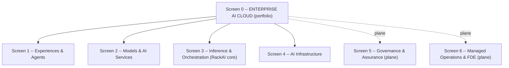
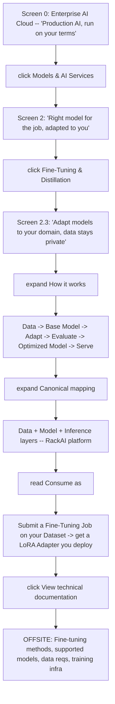
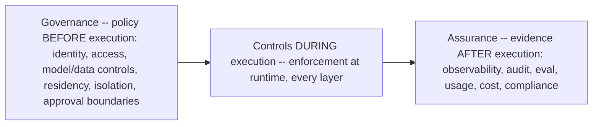
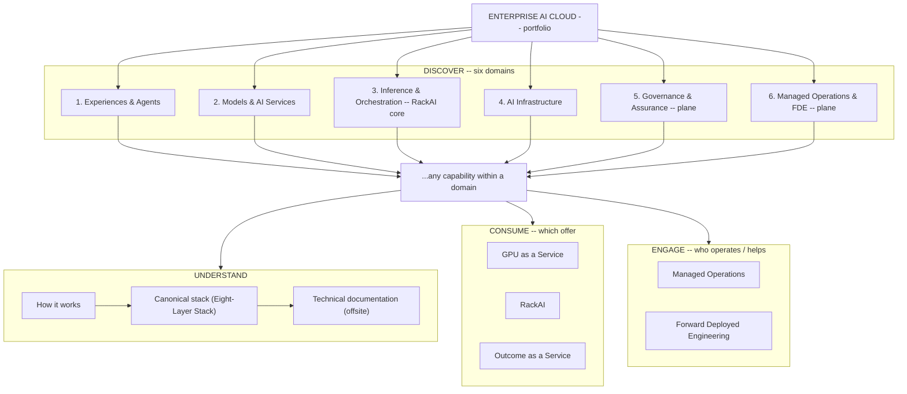

# Enterprise AI Cloud — Marketing Site Projection

A **projection**, not a source of truth. This note renders the [[Enterprise AI Cloud Product Model]] as a public marketing website — a screen-by-screen click-through the marketing/UX team can build from. Every concept here (the portfolio→product boundary, the six areas, the three consumption offers, the RackAI ownership convention, the discovery model) is **owned by the [[Enterprise AI Cloud Product Model]]**; this note only dresses it for a visitor.

> **Authority.** If this note and the [[Enterprise AI Cloud Product Model]] ever disagree, the product model wins and this note is corrected. For hero framing, ICP, and copy-safety rules see [[Enterprise AI Solution Stack (Marketing)]]. For shipped-vs-planned status see [[RackAI Platform]] and the [[Capability Gap Register]] — public copy must honor it (never assert planned capability as present, never print a price or performance number).

> **How the click-through maps to the model.** The site is the **DISCOVER → resolve-in-three-directions** model from the product-model note, rendered as screens: **Screen 0** (portfolio) → **Screen N** (a domain) → **Screen N.M** (a capability). Each capability screen lets the visitor branch to UNDERSTAND (how it works → canonical mapping → offsite docs), CONSUME (which of the three offers), or ENGAGE (Managed Operations / FDE) — at whatever depth suits them.

---

## How to read this projection

Each screen follows the same sequence — **What it is → Why it matters → What's under it → How it works → Canonical mapping → Consume as → Deeper** — so Marketing has both the map *and* the narrative ingredients:

- **What you see** — the customer-facing description at this depth.
- **Why it matters** — the **customer tension** this markets against: the problem or stakes the capability exists to resolve. This is the raw material for copy, campaigns, and decks — *what to sell against*, not just what it is. (State the tension and the stakes; never attach a performance/cost number or claim a planned capability is live — see Copy-Safety.)
- **What's under it** — the clickable children. Each child names the screen it opens (`▸ Child → Screen X.Y`).
- **How it works** — the one-line flow.
- **Canonical mapping** — where it sits in the [[Eight-Layer Stack]] (the UNDERSTAND branch toward docs).
- **Consume as** *(capability screens)* — the real consumption route, and which of the three offers the capability **rolls up into** (GPU as a Service, RackAI, or Outcome as a Service). Capabilities are not products; they resolve into an offer (see the product model).
- **Back / deeper** — where "up" goes, and at a capability screen the single **offsite** `↗` link to technical docs where the site stops.

The customer chooses the branch; they are not marched down a single funnel.

> **The strategic "why" behind the three offers** (the narrative Marketing should lead with): the portfolio answers *"how much of production AI do you want to own?"* — **GPUaaS:** you shouldn't have to become an AI-infrastructure operator. **RackAI:** you shouldn't have to become an inference-platform company. **Outcome as a Service:** you shouldn't have to assemble the whole stack just to solve a business problem. The customer chooses where their responsibility stops.

---

## Screen 0 — Enterprise AI Cloud (the landing screen)

**What you see**

> **Enterprise AI Cloud: Production AI, run on your terms.** *From silicon to outcomes. Secured, governed and operated by Rackspace.*

Lead with the **portfolio**, not the platform. "Enterprise AI Cloud" is intuitive to a visitor: the page opens on *why it matters* instead of first explaining what a "RackAI" is before the value is sticky.

> **Enterprise AI Cloud is the portfolio; RackAI is the platform at its core.** Palantir, agent solutions, and NVIDIA/AMD infrastructure can all belong **without becoming RackAI**. RackAI has the sharper job: **make private production AI actually run.** (Canonical boundary: [[Enterprise AI Cloud Product Model]].)

**What's under it — click any area to drill in**

| ▸ Click | What it is (one line) | Opens |
|---|---|---|
| ▸ **Experiences & Agents** | Build and run enterprise AI experiences and agents | **Screen 1** |
| ▸ **Models & AI Services** | Choose, adapt and optimize models for the workload | **Screen 2** |
| ▸ **Inference & Orchestration** *(RackAI core)* | Run AI reliably, efficiently and at scale | **Screen 3** |
| ▸ **AI Infrastructure** | Private, high-performance infrastructure for production AI | **Screen 4** |
| ▸ **Governance & Assurance** *(plane)* | Control what AI can do and prove what happened | **Screen 5** |
| ▸ **Managed Operations & FDE** *(plane)* | Rackspace operates it and turns it into outcomes | **Screen 6** |

> **Positioning line under the hero:** *Enterprise AI Cloud is the portfolio. RackAI is the inference and model-adaptation platform at its core* — foundational to Rackspace's identity as an AI operator, giving regulated enterprises a way to run production AI on their own data, models and infrastructure without surrendering control.

> **Why two areas are planes, not boxes.** Governance & Assurance and Managed Operations & FDE cut across every layer — the canonical three control planes ([[Eight-Layer Stack]]). Clicking a plane re-renders to show how it touches each layer, rather than opening a sibling box.

---

## Worked example — one path through the tree

One concrete walk: **DISCOVER** down to a capability, then the **UNDERSTAND** branch to docs with a stop at the **CONSUME** branch on the way. This is *one* path of several a visitor could take from the same capability.

A different visitor could stop at **Consume as** and branch straight to "talk to us about RackAI" without opening the docs, or branch to **ENGAGE** to add FDE — same capability screen, different direction.

---

## Screen 1 — Experiences & Agents

**What you see:** Build AI experiences around the way your business actually works.

**Why it matters:** AI only creates value when it's wired into real business processes and the tools people already use. Enterprises don't want another disconnected chatbot — they want AI that acts inside their workflows, under their control.

**Canonical anchor:** Consumption + [[AI Harness]]. **This area consumes RackAI — it is not RackAI** (see the boundary in [[Enterprise AI Cloud Product Model]]). Per the [[Three Battlegrounds|harness boundary]], *Rackspace* (company) owns the execution harness while customers/partners own the **business logic**; RackAI-the-platform sits below the harness as the inference + fine-tuning layer it consumes.

**What's under it — click a capability to open its screen**

| ▸ Click | What it is | Opens |
|---|---|---|
| ▸ **Enterprise Agents** | Put AI to work against real business processes | **Screen 1.1** |
| ▸ **Agent Harness** | A governed environment to build and operate agents | **Screen 1.2** |
| ▸ **Enterprise AI Experiences** | Governed AI inside the apps employees already use | **Screen 1.3** |
| ▸ **Agent Ecosystem** | Use the platform with AI tools you already have | **Screen 1.4** |

**Back:** ▸ Enterprise AI Cloud (Screen 0) · **Rolls up to:** **Outcome as a Service** (managed solution) — and **RackAI** underneath for teams building their own.

> **Copy-safety.** The [[Governed Harness]] runtime and [[Empirical Map]] are **planned** ([[Capability Gap Register]]). Frame this whole area as **the operated layer / roadmap**, not a live product.

### Screen 1.1 — Enterprise Agents *(capability view)*
- **What you see:** Put AI to work against real business processes.
- **Why it matters:** A model that only answers questions doesn't move the business. The value is in agents that take action across the systems and workflows where work actually happens — safely, and under enterprise control.
- **What's under it:** ▸ Task & workflow agents · ▸ Domain-specific agents · ▸ Multi-agent workflows · ▸ Human-in-the-loop actions · ▸ Enterprise system/tool integration.
- **How it works:** Enterprise context → Agent → Tools/Actions → Business workflow.
- **Canonical mapping:** Consumption → Orchestration → Harness.
- **Consume as:** Enterprise AI Cloud engagement (agent capability consuming RackAI) · partner-delivered ([[Load-Bearing Bets]]). *Packaging planned — no standalone agent SKU today.*
- **Deeper:** ↗ **Agent architecture · supported frameworks · tool/action integration · runtime security**. **Back:** ▸ Screen 1.

### Screen 1.2 — Agent Harness *(capability view)*
- **What you see:** A governed environment for building and operating agents.
- **Why it matters:** Building agents that are reliable, observable, and safe in production is hard and easy to get wrong. Teams need a governed runtime so they can focus on the agent's job, not on rebuilding guardrails, evaluation, and operations from scratch.
- **What's under it:** ▸ Agent SDK/runtime · ▸ Context & tool integration · ▸ Evaluation · ▸ Guardrails · ▸ Hosting · ▸ Agent lifecycle.
- **How it works:** Build → govern → run — the harness **consumes RackAI inference/model services** (Enterprise AI Cloud → Agent Harness → RackAI). The harness is not RackAI.
- **Canonical mapping:** Harness → Orchestration → Inference.
- **Consume as:** Enterprise AI Cloud harness capability (consumes RackAI). *Governed-harness runtime is planned — not a live SKU today.*
- **Deeper:** ↗ **Harness APIs/SDKs · runtime architecture · evaluation framework · deployment**. **Back:** ▸ Screen 1.

### Screen 1.3 — Enterprise AI Experiences *(capability view)*
- **What you see:** Bring governed AI into the applications and workflows employees already use.
- **Why it matters:** Adoption dies when AI lives in a separate tool nobody opens. Value shows up when AI meets people inside the apps they already work in — with the same governance and controls as the rest of the estate.
- **What's under it:** ▸ Chat · ▸ Code · ▸ Search/RAG · ▸ Business applications · ▸ APIs · ▸ Custom experiences.
- **How it works:** Employee surface → governed AI call → serving chain.
- **Canonical mapping:** Consumption → Harness.
- **Consume as:** Prebuilt experiences / APIs (Uniphore consumption apps, [[Load-Bearing Bets]]) or custom-built on RackAI endpoints. *Partner-delivered + planned packaging.*
- **Deeper:** ↗ **Application integration patterns · APIs · reference architectures**. **Back:** ▸ Screen 1.

### Screen 1.4 — Agent Ecosystem *(capability view)*
- **What you see:** Use the platform with the AI platforms and applications you already have.
- **Why it matters:** Enterprises have already invested in platforms like Palantir and their own agent frameworks. They shouldn't have to rip and replace to adopt private AI — the platform should slot underneath what they already run.
- **What's under it:** ▸ Palantir · ▸ Customer-built agents · ▸ Third-party frameworks · ▸ Partner solutions.
- **How it works:** Partner/third-party agent → Enterprise AI Cloud harness → **RackAI inference/model services** → serving chain.
- **Canonical mapping:** Consumption → Harness → integration interfaces. Leans on [[Load-Bearing Bets]] (Palantir, Uniphore), partner-delivered.
- **Consume as:** Bring-your-own agent platform integrating with RackAI. *Integration interfaces; partner-delivered.*
- **Deeper:** ↗ **Palantir integration · partner integrations · API specifications**. **Back:** ▸ Screen 1.

---

## Screen 2 — Models & AI Services

**What you see:** Use the right model for the job, adapt it to your business and continuously optimize it.

**Why it matters:** No single model is best for every workload, and generic models don't know a company's proprietary context. Enterprises need to choose, adapt, and evaluate models for their actual work — without their sensitive data leaving their control.

**Canonical anchor:** [[Model]] layer, routing in Orchestration, the [[Dataset|Data]] layer surfaced under fine-tuning. Owned by [[Model Services]] and [[Inference Optimization]] ([[Pillar Working Model]]).

**What's under it — click a capability to open its screen**

| ▸ Click | What it is | Opens |
|---|---|---|
| ▸ **Model Catalog** | Discover and deploy models validated for enterprise workloads | **Screen 2.1** |
| ▸ **Smart Model Router** | Route on quality, performance, cost and policy | **Screen 2.2** |
| ▸ **Fine-Tuning & Distillation** *(RackAI)* | Adapt models to your domain, data stays private | **Screen 2.3** |
| ▸ **Model Evaluation** | Understand quality, safety, performance and economics | **Screen 2.4** |

**Back:** ▸ Enterprise AI Cloud (Screen 0) · **Rolls up to:** **RackAI** (Fine-Tuning & Distillation is the RackAI platform; Catalog/Router/Evaluation are consumed through it). Available inside **Outcome as a Service** too.

> **Copy-safety.** **Shipped:** [[Model]] catalog, versioning, SFT [[Fine-Tuning Job]] → [[LoRA Adapter]]. **Planned:** Smart Model Router (2.2) — smart-routing gateway is only *partial* ([[Capability Gap Register]]); frame as roadmap. Model Evaluation (2.4) depends on the planned [[Benchmark Run]] harness — publish no latency/cost/throughput figures.

### Screen 2.1 — Model Catalog *(capability view)*
- **What you see:** Discover and deploy models validated for enterprise workloads.
- **Why it matters:** The model landscape changes weekly and most models aren't vetted for enterprise use. Teams need a trusted shortlist they can deploy with confidence instead of chasing and qualifying every new release themselves.
- **What's under it:** ▸ Open-weight models · ▸ Commercial models · ▸ Model profiles · ▸ Benchmarking · ▸ Playground · ▸ Model compatibility.
- **How it works:** Browse catalog → profile → benchmark → deploy.
- **Canonical mapping:** Model.
- **Consume as:** Deploy a catalog model to your tenant → direct tenant endpoints, or expose via the [[OpenRouter Initiative|OpenRouter channel]]. *Catalog + deployment shipped.*
- **Deeper:** ↗ **Supported catalog · compatibility matrix · benchmark methodology · deployment requirements**. **Back:** ▸ Screen 2.

### Screen 2.2 — Smart Model Router *(capability view)*
- **What you see:** Dynamically route workloads based on quality, performance, cost and policy.
- **Why it matters:** No single model is best for every request. Without routing, enterprises either overpay by sending everything to the most expensive model or hand-manage dozens of endpoints. Routing picks the right model per workload automatically, under policy.
- **What's under it:** ▸ Model selection · ▸ Policy-based routing · ▸ Cost optimization · ▸ Performance routing · ▸ Availability/failover · ▸ Hardware-aware placement.
- **How it works:** Request → Policy → Model selection → Infrastructure selection → Inference.
- **Canonical mapping:** Orchestration → Model → Inference ([[Request Routing]]).
- **Consume as:** Routing policy over your deployed models (planned). *Smart-routing gateway is partial today — frame as roadmap, not a live SKU.*
- **Deeper:** ↗ **Routing architecture · routing policies · APIs · supported providers/endpoints**. **Back:** ▸ Screen 2.

### Screen 2.3 — Fine-Tuning & Distillation *(RackAI · capability view)*
- **What you see:** Adapt models to your domain while keeping enterprise data private.
- **Why it matters:** Generic models don't know a company's proprietary language, processes, or context. Adaptation makes a model genuinely useful for the domain — and the enterprise's data and weights never have to leave its control boundary to get there.
- **What's under it:** ▸ Fine-tuning · ▸ LoRA/adapters · ▸ Distillation · ▸ Domain adaptation · ▸ Evaluation · ▸ Model artifact management.
- **How it works:** Enterprise Data → Base Model → Adaptation → Evaluation → Optimized Model → Inference. *(Where the [[Dataset|Data]] layer surfaces visually.)*
- **Canonical mapping:** Data → Model → Inference — a **RackAI core** capability.
- **Consume as:** Submit a [[Fine-Tuning Job]] against your [[Dataset]] → get a [[LoRA Adapter]] you deploy. *SFT + LoRA shipped; DPO in progress, RL planned.*
- **Deeper:** ↗ **Fine-tuning methods · supported models · data requirements · training infrastructure · model lifecycle**. **Back:** ▸ Screen 2.

### Screen 2.4 — Model Evaluation *(capability view)*
- **What you see:** Understand quality, safety, performance and economics before production.
- **Why it matters:** Putting an unevaluated model into production is a risk to quality, safety, and budget. Enterprises need evidence a model is fit for their workload *before* it's live, not a surprise after.
- **What's under it:** ▸ Quality evaluation · ▸ Safety evaluation · ▸ Performance benchmarks · ▸ Cost/token economics · ▸ Model comparison · ▸ Workload-specific evaluation.
- **How it works:** Model → eval suite → comparison → decision.
- **Canonical mapping:** Model + Assurance.
- **Consume as:** Evaluation run over candidate models before you deploy (planned). *Depends on the planned [[Benchmark Run]] harness — no live eval product or published numbers yet.*
- **Deeper:** ↗ **Evaluation methodology · benchmark results · evaluation APIs · observability**. **Back:** ▸ Screen 2.

---

## Screen 3 — Inference & Orchestration *(RackAI core)*

**What you see:** Turn models into reliable production services with the performance and economics enterprises need.

**Why it matters:** A model in a notebook isn't a product. The hard, expensive part is running it reliably at scale with economics that work — the "ugly middle" between GPUs and AI outcomes that most enterprises don't want to build or operate themselves.

**Canonical anchor:** Orchestration + Inference + Compute — the **center of gravity of the RackAI differentiation story** ([[Three Battlegrounds]]). Owned by [[Inference and Serving Services]] and [[Inference Optimization]].

**What's under it — click a capability to open its screen**

| ▸ Click | What it is | Opens |
|---|---|---|
| ▸ **Model Hosting & Serving** | Deploy models as secure, production-ready endpoints | **Screen 3.1** |
| ▸ **Batch Inference** | Process high-volume workloads asynchronously | **Screen 3.2** |
| ▸ **Inference Optimization** | Get more useful AI from every GPU | **Screen 3.3** |
| ▸ **Workload Orchestration** | Place, scale and isolate workloads automatically | **Screen 3.4** |

**Back:** ▸ Enterprise AI Cloud (Screen 0) · **Rolls up to:** **RackAI** — the platform's primary product domain. Also sits underneath **Outcome as a Service**.

> **Copy-safety.** **Shipped:** [[Model Deployment]], OpenAI-compatible endpoints, [[Serving Runtime]] (vLLM/NIM), [[Autoscaling]] — so Screen 3.1 is real and sellable today. **Planned/partial:** inference routing (llm-d), full policy-driven orchestration, the optimization benchmark harness — no published performance numbers.

### Screen 3.1 — Model Hosting & Serving *(shipped · capability view)*
- **What you see:** Deploy models as secure, production-ready endpoints.
- **Why it matters:** Standing up secure, scalable, OpenAI-compatible endpoints in-house takes serious platform engineering. Enterprises want a production endpoint they can call today, in their own environment, without building the serving plane themselves.
- **What's under it:** ▸ Serverless inference · ▸ Dedicated inference · ▸ API endpoints · ▸ AI containers · ▸ Streaming · ▸ Multimodal inference.
- **How it works:** Model → runtime → endpoint → traffic.
- **Canonical mapping:** Inference → Compute ([[Model Deployment]], [[Serving Runtime]]).
- **Consume as:** Direct tenant OpenAI-compatible endpoints (dedicated deployment) · [[OpenRouter Initiative|OpenRouter channel]] · customer environment. *Shipped and sellable today.*
- **Deeper:** ↗ **Serving architecture · supported runtimes · API docs · deployment options · SLAs**. **Back:** ▸ Screen 3.

### Screen 3.2 — Batch Inference *(capability view)*
- **What you see:** Process high-volume AI workloads asynchronously and economically.
- **Why it matters:** Not every workload is interactive. Large offline jobs — document processing, enrichment, back-catalog analysis — shouldn't pay real-time prices or compete with live traffic; they should run when and where it's most economical.
- **What's under it:** ▸ Batch APIs · ▸ Job queues · ▸ Scheduling · ▸ High-throughput processing · ▸ Cost optimization.
- **How it works:** Job → queue → schedule → high-throughput process.
- **Canonical mapping:** Orchestration → Inference → Compute.
- **Consume as:** Asynchronous batch job submission against your deployments (planned packaging). *Serving is shipped; a distinct batch product/quota model is roadmap.*
- **Deeper:** ↗ **Batch API · job architecture · limits/quotas · scheduling**. **Back:** ▸ Screen 3.

### Screen 3.3 — Inference Optimization *(capability view)*
- **What you see:** Get more useful AI from every GPU.
- **Why it matters:** GPU capacity is expensive and constrained. Inefficient serving drives up cost, caps throughput, and can force more hardware purchases. Better utilization lets more workloads run on the same fleet and improves the economics of production AI.
- **What's under it:** ▸ Quantization · ▸ KV/cache management · ▸ Memory optimization · ▸ Kernels · ▸ Batching · ▸ Parallelism · ▸ Hardware-specific optimization.
- **How it works:** Quantization + KV cache + batching + kernels + parallelism.
- **Canonical mapping:** Inference → Compute.
- **Consume as:** Included in RackAI serving (applied to your deployments), not a standalone purchase. *Competency shipped; benchmark/regression harness planned — no published numbers.*
- **Deeper:** ↗ **Optimization techniques · hardware/model compatibility · benchmarks · NVIDIA/AMD implementation docs**. **Back:** ▸ Screen 3.

### Screen 3.4 — Workload Orchestration *(capability view)*
- **What you see:** Automatically place, scale and isolate AI workloads across infrastructure.
- **Why it matters:** Manually placing and scaling AI workloads across heterogeneous GPUs is error-prone and doesn't hold up under real traffic. Enterprises need placement, scaling, and tenant isolation handled automatically so workloads stay reliable and separated without a platform team babysitting them.
- **What's under it:** ▸ Kubernetes · ▸ Scheduling · ▸ Autoscaling · ▸ Placement · ▸ Isolation · ▸ Capacity management · ▸ Failure recovery.
- **How it works:** Workload → Policy → Model → Hardware → Runtime → Scale.
- **Canonical mapping:** Orchestration → Inference → Compute → Infrastructure.
- **Consume as:** Managed placement/autoscaling within RackAI (part of a deployment), operated for you. *Autoscaling shipped; full policy-driven placement/isolation partial.*
- **Deeper:** ↗ **Kubernetes architecture · scheduler · isolation model · scaling architecture**. **Back:** ▸ Screen 3.

---

## Screen 4 — AI Infrastructure

**What you see:** Production AI infrastructure without customers having to become GPU infrastructure operators.

**Why it matters:** Buying, wiring, and operating GPU fleets is a specialized, capital-intensive discipline most enterprises don't want to build. They need production-grade AI infrastructure — and the freedom to run where requirements dictate — without becoming an infrastructure operator.

**Canonical anchor:** Compute + Infrastructure (+ Data for storage) — **below the Kubernetes line** ([[Pillar Working Model]]). This area **supplies** RackAI (the substrate it consumes), not RackAI itself. Supply is **abstracted** ([[Three Battlegrounds]]), framed as "run it where it makes sense," never *commodity*.

**What's under it — click a capability to open its screen**

| ▸ Click | What it is | Opens |
|---|---|---|
| ▸ **Accelerated Compute** | Run AI across NVIDIA and AMD infrastructure | **Screen 4.1** |
| ▸ **AI Networking** | Networking designed around distributed AI | **Screen 4.2** |
| ▸ **AI Storage** | Feed workloads with the performance they need | **Screen 4.3** |
| ▸ **Deployment Footprint** | Put AI where requirements dictate | **Screen 4.4** |

**Back:** ▸ Enterprise AI Cloud (Screen 0) · **Rolls up to:** **GPU as a Service** (buy the capacity directly; own what runs above). Also the substrate beneath **RackAI** and **Outcome as a Service**.

> **Copy-safety.** **Shipped:** [[Accelerator Class]] over [[NVIDIA H100]]/[[NVIDIA L40S]]/[[NVIDIA A30]]/[[AMD Instinct]]; [[GPU Fleet]], single-cluster/single-region. **Planned/partner:** Intel Gaudi + CPU; multi-cluster/region governance and production [[Environment]] ([[Multi-Cluster Governance Brief (Partner)]]). Fleet is topology-constrained ([[Fleet Competitiveness]]).

### Screen 4.1 — Accelerated Compute *(capability view)*
- **What you see:** Run AI across high-performance NVIDIA and AMD infrastructure.
- **Why it matters:** GPU supply is scarce, and betting on a single vendor is risky and often expensive. Access to both NVIDIA and AMD — dedicated or shared — gives enterprises capacity and flexibility instead of vendor lock-in.
- **What's under it:** ▸ NVIDIA GPUs · ▸ AMD GPUs · ▸ CPU · ▸ GPU clusters · ▸ Dedicated capacity · ▸ Shared capacity.
- **How it works:** Workload → accelerator class → GPU node/cluster.
- **Canonical mapping:** Compute ([[Accelerator Class]], [[GPU Node]]).
- **Consume as:** Dedicated GPU capacity · shared capacity · customer-owned infrastructure. *NVIDIA + AMD shipped; Intel Gaudi/CPU planned.*
- **Deeper:** ↗ **GPU SKUs · hardware specifications · supported accelerators · capacity/topology**. **Back:** ▸ Screen 4.

### Screen 4.2 — AI Networking *(capability view)*
- **What you see:** High-performance networking designed around distributed AI workloads.
- **Why it matters:** Distributed training and multi-GPU inference are bottlenecked by the network, not just the chips. Fabric built for AI keeps expensive accelerators fed and workloads isolated, instead of letting the interconnect become the constraint.
- **What's under it:** ▸ GPU fabrics · ▸ East/west networking · ▸ North/south connectivity · ▸ Low-latency networking · ▸ Isolation.
- **How it works:** GPU fabric → east/west + north/south → low-latency isolation.
- **Canonical mapping:** Infrastructure → Compute.
- **Consume as:** Part of the infrastructure substrate under a capacity engagement, not sold standalone.
- **Deeper:** ↗ **Network architecture · topologies · connectivity options**. **Back:** ▸ Screen 4.

### Screen 4.3 — AI Storage *(capability view)*
- **What you see:** Feed AI workloads with the performance and capacity they require.
- **Why it matters:** Models, datasets, and checkpoints are large and I/O-hungry; slow storage starves GPUs and stalls training and serving. Storage sized and tuned for AI keeps the pipeline moving instead of leaving accelerators waiting.
- **What's under it:** ▸ Object storage · ▸ High-performance storage · ▸ Model storage · ▸ Dataset storage · ▸ Checkpoints/artifacts.
- **How it works:** Object + high-perf storage → model/dataset/checkpoint artifacts.
- **Canonical mapping:** Infrastructure → Data.
- **Consume as:** Storage provisioned with a capacity/deployment engagement; customer-owned data foundation integrated, not resold.
- **Deeper:** ↗ **Storage architecture · performance characteristics · data interfaces**. **Back:** ▸ Screen 4.

### Screen 4.4 — Deployment Footprint *(capability view)*
- **What you see:** Put AI where enterprise requirements dictate it needs to run.
- **Why it matters:** Regulation, data residency, and sovereignty often decide *where* AI is allowed to run before anything else. Enterprises need placement choices — Rackspace, colo, their own environment — that satisfy those constraints rather than forcing the workload to a location that breaks them.
- **What's under it:** ▸ Rackspace data centers · ▸ Colocation · ▸ Customer environments · ▸ Dedicated/private · ▸ Sovereign/regional · ▸ Multi-tenant.
- **How it works:** Requirement → placement (RXT / colo / customer / sovereign).
- **Canonical mapping:** Infrastructure.
- **Consume as:** Rackspace data centers · colocation · your environment · dedicated/private. *Single-region shipped; multi-region/sovereign is planned/partner ([[Multi-Cluster Governance Brief (Partner)]]).*
- **Deeper:** ↗ **Deployment reference architectures · regions · facility requirements · sovereignty/residency**. **Back:** ▸ Screen 4.

---

## Screen 5 — Governance & Assurance *(persistent plane)*

**What you see:** Control what AI can do, and prove what happened.

**Why it matters:** Moving AI into production means giving models access to real data, systems, and actions. Regulated enterprises can't adopt without enforceable boundaries on that access *and* the evidence to prove, after the fact, exactly what happened. Governance is often the gate that decides whether a deal can happen at all.

This is **not a box** — clicking it re-renders the page to show how the plane intersects every layer ([[Eight-Layer Stack]]; [[AI Governance and Assurance]] pillar).

> **Boundary note.** This is an **Enterprise AI Cloud-wide plane**, broader than RackAI. **RackAI implements the controls and evidence required within its own boundary** — it does not own portfolio governance. Frame it as portfolio-wide, with RackAI implementing its part.

**What's under it — click a half to open its screen**

| ▸ Click | Answers | Opens |
|---|---|---|
| ▸ **Governance** | What is allowed? | **Screen 5.1** |
| ▸ **Assurance** | What actually happened? | **Screen 5.2** |

**Back:** ▸ Enterprise AI Cloud (Screen 0) · **Rolls up to:** **all three offers** — cross-cutting, not a separate purchase. More governance responsibility transfers to Rackspace across GPUaaS → RackAI → Outcome as a Service.

> **Copy-safety — most sensitive area.** **Shipped:** identity + auth, platform RBAC, audit-log query API, per-tenant isolation. **Planned:** the [[Verification|assurance]] harness, per-step verification, and certifications (SOC 2 / ISO 42001). **Never name a certification as held.** Say "built for regulated environments." Org-level RBAC was dropped.

### Screen 5.1 — Governance *(capability view)*
- **What you see:** What is allowed — policy before execution.
- **Why it matters:** Untrusted AI with broad access is a liability. Enterprises need to set — and enforce — who and what a model can touch *before* it runs, so autonomy never outruns the boundaries the business is willing to accept.
- **What's under it:** ▸ Identity & access · ▸ Policy · ▸ Model controls · ▸ Data controls · ▸ Residency · ▸ Workload isolation · ▸ Approval boundaries · ▸ Security.
- **Canonical mapping:** Governance plane ([[Identity & Access Control]], [[Audit]]).
- **Consume as:** Built into every RackAI engagement (identity, RBAC, tenant isolation shipped); portfolio-wide controls span partners too. *Not a standalone SKU; certifications planned.*
- **Deeper:** ↗ **Security architecture · IAM · tenant isolation · compliance documentation**. **Back:** ▸ Screen 5.

### Screen 5.2 — Assurance *(capability view)*
- **What you see:** What actually happened — evidence after execution.
- **Why it matters:** In regulated settings, "trust us" isn't enough — you have to *prove* it. Enterprises need a defensible record of what the AI did, on what data, so an audit becomes a query rather than a scramble.
- **What's under it:** ▸ Observability · ▸ Audit · ▸ Runtime evidence · ▸ Model evaluation · ▸ Performance · ▸ Usage · ▸ Cost · ▸ Compliance evidence.
- **Canonical mapping:** Assurance plane ([[Verification]], [[Performance Regression Gate]]).
- **Consume as:** Platform observability + audit-log query shipped today; per-step verification and the assurance harness are planned. *No live eval/verification product yet.*
- **Deeper:** ↗ **Audit architecture · observability architecture · compliance documentation**. **Back:** ▸ Screen 5.

---

## Screen 6 — Managed Operations & FDE *(persistent plane)*

**What you see:** Who makes all of this actually work.

**Why it matters:** Owning AI technology doesn't create value by itself — someone still has to operate it reliably and connect it to the customer's data, workflows, and business problem. Most enterprises don't have (or want to build) that operating muscle in-house; that's the responsibility they most want to hand off.

Not another architectural layer — the **delivery and operating spine** across the whole stack. This is the core of the [[Three Battlegrounds|Private Enterprise AI Operator]] identity: Rackspace assumes operational responsibility.

**What's under it — click a half to open its screen**

| ▸ Click | Promise | Opens |
|---|---|---|
| ▸ **Managed Operations** | Run the AI estate for me | **Screen 6.1** |
| ▸ **Forward Deployed Engineering** | Help me turn the platform into outcomes | **Screen 6.2** |

**Back:** ▸ Enterprise AI Cloud (Screen 0) · **Rolls up to:** the **operating/delivery model behind every offer** — fullest in **Outcome as a Service**, available as managed operations over **RackAI** and **GPUaaS** too.

> **Copy-safety.** **Shipped:** platform-level [[Monitoring & Observability]]. **In progress/missing:** [[Metering]] and tenant observability; the cost model ([[Cost per GPU-Hour]]) is missing ([[Capability Gap Register]]). Don't promise billing/showback UI as live.

### Screen 6.1 — Managed Operations *(capability view)*
- **What you see:** Run the AI estate for me.
- **Why it matters:** Production AI needs 24/7 monitoring, incident response, capacity and lifecycle management — a standing operational burden most teams would rather not carry. Handing the estate to an operator lets the customer focus on outcomes instead of on-call.
- **What's under it:** ▸ Platform operations · ▸ Monitoring · ▸ Incident management · ▸ Lifecycle management · ▸ Capacity management · ▸ Performance optimization · ▸ Support.
- **Canonical mapping:** Operations plane ([[Metering]], [[Monitoring & Observability]]).
- **Consume as:** Managed service engagement — Rackspace operates the estate for you. *Platform monitoring shipped; metering in progress, billing/showback UI not live.*
- **Deeper:** ↗ **Operating model · support model · service descriptions**. **Back:** ▸ Screen 6.

### Screen 6.2 — Forward Deployed Engineering *(capability view)*
- **What you see:** Help me turn the platform into business outcomes.
- **Why it matters:** A platform doesn't create value until it's wired to a real problem, in production. FDE closes the gap between "we have the technology" and "it's solving the business case" — the last mile many AI initiatives stall on.
- **What's under it:** ▸ Use-case discovery · ▸ Architecture · ▸ Integration · ▸ Data/model implementation · ▸ Agent/application implementation · ▸ Optimization · ▸ Productionization.
- **Canonical mapping:** Delivery spine (not a stack layer).
- **Consume as:** An **add-on to any offer** (GPUaaS, RackAI) — add engineers to accelerate discovery → productionization — **and included by default in Outcome as a Service**. *Delivery motion, not a self-serve product; not a termination point of its own.*
- **Deeper:** ↗ **Implementation methodology · service descriptions**. **Back:** ▸ Screen 6.

---

## Full site map

The site is **DISCOVER** (portfolio → domain → capability) followed by a **three-way resolution** at any capability. The diagram shows both: the six domains a visitor discovers, and the three directions any capability can branch to. It does **not** funnel every domain into architecture/docs — that is only the UNDERSTAND branch.

Which offer a capability rolls up into, and whether ENGAGE applies, is defined by the [[Enterprise AI Cloud Product Model]] (the Capability → Offer Map). Every capability screen above renders all three branches; the customer chooses which to follow and how deep.

---

## Copy-Safety

All copy is bound by [[Enterprise AI Solution Stack (Marketing)]] §4 and the shipped-vs-planned status in the [[Capability Gap Register]]:

> **Sell the operated whole and the control promise. Do not assert individual capabilities that are still planned, and never publish performance/cost numbers — no [[Benchmark Run]] or production telemetry exists yet.**

Per the truth hierarchy (**shipped beats planned**): sellable-as-real today = serving, model catalog, fine-tuning, identity/isolation, platform monitoring. Roadmap framing = harness, smart routing, verification, certifications, metering/billing.

---

## See Also

- [[Enterprise AI Cloud Product Model]] — the canonical model this projection renders (authority)
- [[Enterprise AI Solution Stack (Marketing)]] — hero framing, ICP, copy-safety rules
- [[Eight-Layer Stack]] — the canonical decomposition every capability maps to
- [[Capability Gap Register]] — per-capability shipped/planned status
- [[Wiki Hub]]
