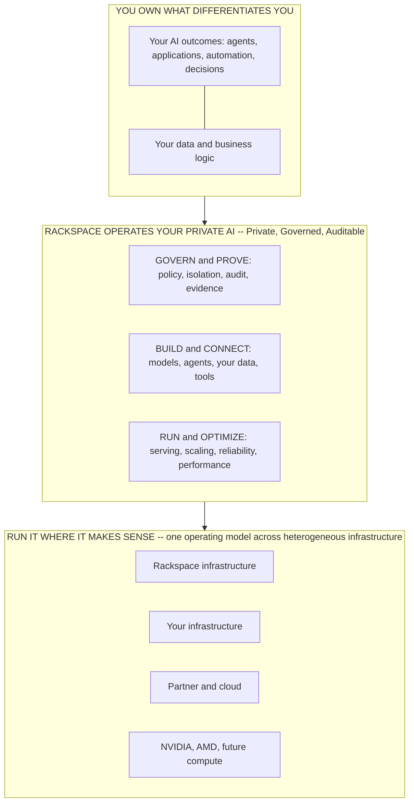
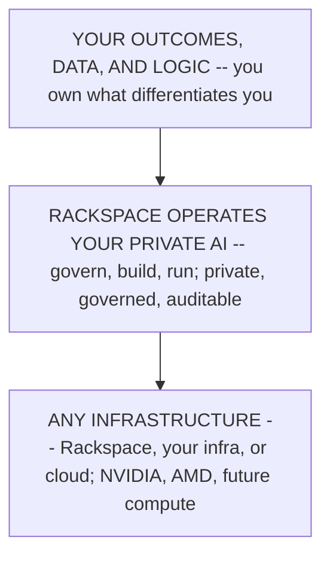

# Enterprise AI Solution Stack (Marketing)

A **wiki-layer projection** for the public-facing Enterprise AI page. It does two jobs: (1) name the **target audience inside the TAM** the page is written for, and (2) present a **marketing-friendly stack diagram** that converts a visitor into a click without over-claiming what has shipped.

> **This is a projection, not a new concept.** The stack framing is the canonical [[Three Battlegrounds|Operator Stack]] and the [[Eight-Layer Stack]], simplified for an external reader. The identity, the "own/abstract/partner/refuse" stance, and the customer promise are owned by [[Three Battlegrounds]]. This note only re-dresses them for marketing; it does not redefine anything.

> **Confidence discipline.** Public copy must not assert shipped capability that is `assumed`/planned. The [[RackAI Platform]] hub is authoritative for what exists today (inference + fine-tuning + tenancy shipped; harness, smart routing, metering/billing, compliance certs planned). The diagram below is designed so it sells the **operated whole** — which is a positioning claim, `derived` — without implying the planned machinery is live. See the copy-safety notes at the end.

---

## 1. Who This Page Is For (ICP within the TAM)

The broad TAM is "enterprises adopting AI." That is too wide to convert. The strategy already narrows it — this is the sharpened ICP the CEO questions in [[Three Battlegrounds]] asked the team to ratify:

> **Primary ICP.** Large, regulated or data-sensitive enterprises with **valuable proprietary data** that want **production** AI but **cannot hand a material subset of workloads to a shared or public AI service** — and do not want to become an AI-infrastructure company to run it themselves.

The decisive qualifier is **control**, not hosting topology (see the "what private means" definition in [[Three Battlegrounds]]): the buyer needs to keep control of where their data, models, inference, and operating context execute.

### The buyer inside that ICP

| Attribute | The page is written for | Not the page's audience |
|---|---|---|
| **Company shape** | Regulated / data-sensitive enterprise (financial services, healthcare, public sector, defense-adjacent, telco), proprietary data as an asset | Startups optimizing for developer velocity and cheapest tokens |
| **Workload** | A material subset of workloads that **cannot** run on public inference | All-public-cloud-is-fine workloads |
| **What they lack** | Operational capacity to run a heterogeneous AI estate reliably and compliantly | A sophisticated in-house AI platform team that *wants* to own it |
| **Economic buyer** | Head of AI / CISO / CIO / Chief Data Officer accountable for AI in production and for the audit | Individual developers |
| **Decision trigger** | "We have to run this in production, on our data, and prove it's governed" | "I want to prototype quickly" |

### The two fights this page must NOT pick

Straight from the "why we lose" column in [[Three Battlegrounds]] — the page should *not* try to convert either:

- **The build-it-themselves buyer** with a strong platform team who wants to own it.
- **The cheapest-tokens / developer-velocity buyer** — that is the [[Erebine Competitive Analysis|inference-platform]] fight, not ours.

### The one-line hook for the page

> **Run production AI on your data — without surrendering control of your data, models, inference, or operating environment.**

This is the [[Three Battlegrounds]] customer promise verbatim. It is the primary CTA copy candidate. The click it should drive: **"Talk to us about operating your AI estate."**

---

## 2. The Marketing Stack Diagram

The design principle is to make the graphic a **picture of the customer's operating decision, not an architecture diagram**. In three seconds the ICP buyer should read it as: *"What do I still have to own if I choose Rackspace? My outcomes, my data, my logic. They take the rest."*

Four design rules follow from that, all traceable to [[Three Battlegrounds]]:

1. **Outcomes sit at the very top** — the journey reads infrastructure → operated AI → business outcomes, which pulls the conversation toward "what problem, what is it worth" and away from "how many GPUs."
2. **The operated middle is described as the burden being removed**, in customer verbs (Govern / Build / Run), not product-category nouns (harness / model services). This is the "ugly middle between GPUs and AI outcomes" made visceral.
3. **Governance is a wrapper, not a box.** It is a *property* of the whole operated environment (Private • Governed • Auditable), not a service that runs before the harness.
4. **Compute is framed as a customer benefit** ("run it where it makes sense"), not the internal word *commodity*.

### Main diagram

The governance wrapper is carried in the **OPERATED band's own label** (`Private, Governed, Auditable`) rather than as a box inside it — most markdown renderers won't nest a styled boundary, and the "no forced colors/styles in Mermaid" rule means we can't draw a visual frame. If the final web graphic is authored in a design tool, draw governance as an actual boundary surrounding the three columns.

### Why the bands are drawn this way

| Band | Marketing message | Canonical source |
|---|---|---|
| **You own what differentiates you** (top) | Outcomes first, then data and logic — the customer keeps the things that make their business theirs and controls where they execute. Rackspace enables *their* AI, doesn't own it. | [[Three Battlegrounds]] harness boundary — "customers own the business logic" |
| **Rackspace operates your private AI** (middle) | Govern / Build / Run in customer verbs = "all the operational burden my team would otherwise carry." The "ugly middle between GPUs and AI outcomes." | [[Three Battlegrounds]] "what we own"; [[Pillar Working Model]] pillars |
| **Private • Governed • Auditable** (wrapper on the middle) | Governance is a property of the whole environment, not a step. For this ICP that is the reason to be on the page. | [[Enterprise AI Portfolio]] governance/assurance built in |
| **Run it where it makes sense** (bottom) | One operating model across heterogeneous infrastructure; no lock-in. Frames the benefit, keeps "abstract GPU supply" as the internal-only phrasing. | [[Three Battlegrounds]] "we abstract GPU supply" |

### Compact variant (hero-section version)

If the page needs a smaller graphic above the fold, collapse to the operating-decision journey — a visitor reads it in under two seconds:

### The pairing line

Set beside or below the graphic:

> **You build the AI that differentiates your business. Rackspace operates everything required to run it securely in production.**

---

## 3. Message Ladder (copy that pairs with the diagram)

Ordered so the page answers the ICP's questions in the order they ask them:

1. **Headline (promise):** Run production AI on your data — without giving up control.
2. **Subhead (the gap we fill):** You don't have to become an AI-infrastructure company, and you don't have to send your workloads to a public AI service.
3. **The operated middle (what you buy):** Rackspace operates the governed inference layer between your GPUs and your AI outcomes — serving, routing, fine-tuning, reliability, and the compliance evidence.
4. **Proof band (why you can trust it):** You control where your data, models, inference, and context execute; every AI action is governed and auditable.
5. **CTA:** Talk to us about operating your AI estate.

---

## 4. Copy-Safety Notes (so marketing doesn't over-claim)

Per the truth hierarchy — shipped beats planned. The following must be honored in the live copy:

| Claim area | Safe to say today | Do NOT say (planned / `assumed`) |
|---|---|---|
| Inference + fine-tuning | Shipped: private OpenAI-compatible endpoints, fine-tuning to domain models, per-tenant isolation | — |
| Smart routing / harness | Frame as **the operated layer** / roadmap in "what's coming" | Do not claim a live smart-routing gateway or governed-harness runtime — both are planned ([[RackAI Platform]], [[Capability Gap Register]]) |
| Governance / certifications | "Built for regulated environments"; governance and assurance are core to the product | Do not name a certification (SOC 2 / ISO 42001) as **held** until achieved — compliance envelope is a priority move, not a completed gate |
| Metering / billing | — | Do not promise usage-based billing UI; metering is planned, billing is a gap |
| Performance numbers | — | No latency/cost/throughput figures on the page — no [[Benchmark Run]] or production telemetry exists yet; all such KPIs are `assumed` |

> **Rule of thumb for the page:** sell the **operated whole** and the **control promise** (both `derived` positioning we can stand behind), not individual capability specs that are still planned.

---

## See Also

- [[Three Battlegrounds]] — canonical identity, operator stack, own/abstract/partner/refuse stance
- [[Enterprise AI Portfolio]] — portfolio vs product framing
- [[Eight-Layer Stack]] — the full architecture decomposition this diagram simplifies
- [[RackAI Platform]] — authoritative source for what is shipped vs planned
- [[Pillar Working Model]] — what each operated layer actually owns
- [[Load-Bearing Bets]] — partner elements that complete the portfolio
- [[Erebine Competitive Analysis]] — the developer-velocity fight this page deliberately does not pick
