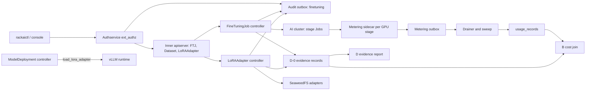
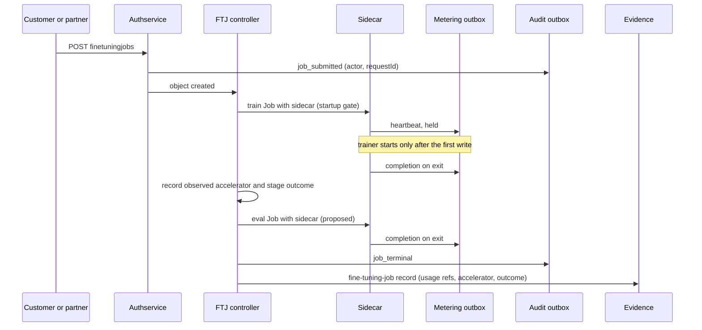

# Fine-Tuning Operations — Technical Specification

| Field | Value |
|:--|:--|
| Version | v0.2 |
| Status | Draft |
| Author | Wiki agent for rackai-product (draft for platform engineering) |
| Reviewers | Platform engineering (fine-tuning, metering); Security (RACKAI-588); UI; Docs; B and D owners |
| Engineering approval | not yet approved |
| Product review | **Product-owner review disposition, 2026-10-10: conditional acceptance; not formal artifact approval.** DV-1 approved with migration (no new attachment of unremediated legacy adapters; remediation by PRD D-10). DV-3 revised to C's attribution contract (gaps are audit coverage gaps, never actors). DV-2: no ruling. v0.2 also adopts the failure taxonomy (§9), readiness states and blockers (§13), and D's final envelope (§4.5) |
| Product approval | not yet approved |
| Date created | 2026-10-10 |
| Based on PRD(s) | [[Fine-Tuning Operations PRD]] (v0.2 draft, not yet approved; PO review disposition 2026-10-10 conditional; spec drafted alongside per product-owner instruction 2026-10-10) |
| Roadmap items | Uniphore: SFT/LoRA; DPO fine tuning |
| Jira epic(s) | RACKAI-385 (SFT/LoRA, in build); RACKAI-515 (fine-tuning metering, unmerged); RACKAI-252 and RACKAI-365 to 368 (DPO). New epics per milestone (§13) to be created by platform engineering |

> **Artifact type: Technical Specification.** The concepts it builds on have canonical notes: [[Fine-Tuning Job]], [[Dataset]], [[LoRA Adapter]], [[Model Deployment]], [[Accelerator Class]]. This spec designs *how*. It doesn't redefine them.
>
> **Status banner.** *Largely as built, with designed gaps.* The fine-tuning pipeline exists on `rackai@79ca4de`. Statements about it are `derived` from the read-only survey (§3) and carry **AS BUILT** markers. Fine-tuning metering exists **only on unmerged branches** (`rackai@cfbfd8d`) and has never run against a real database or GPU cluster; it is marked **IN BRANCH, NOT MERGED**. Everything else is **PROPOSED, NOT BUILT**, and `assumed`. Roadmap row *Fine-tuning domain-model experiment* (Phase 2) is not designed here (§1.2). It is named in the PRD only.

### 0. Status markers (convention)

- **AS BUILT (YYYY-MM-DD, TICKET):** what exists in code at the cited SHA.
- **IN BRANCH, NOT MERGED (YYYY-MM-DD, TICKET):** implemented and unit-tested on an unmerged branch; not on `main`, not deployed.
- **PROPOSED, NOT BUILT (YYYY-MM-DD):** designed here, not implemented.
- **RETAINED FOR THE RECORD:** a rejected or replaced design kept for the decision record.

## 1. Overview

The fine-tuning pipeline is built. A `FineTuningJob` drives Kubernetes Jobs on the outer AI cluster (validation, optional preprocessing, training, optional evaluation, adapter upload). It produces a `LoRAAdapter`, which a `ModelDeployment` hot-loads through vLLM's adapter endpoints. This spec does not redesign that.

It closes the gaps that PRD J's boundary needs, all **additively**:
1. an **adapter intake contract**: origin, producer and required integrity for adapters not made by a RackAI job;
2. **complete fine-tuning metering**: the evaluation stage, the accelerator actually used, a metering state on the job, and an attributed recovery of lost usage. This builds on the RACKAI-515 sidecar, which is to be merged on engineering's own schedule;
3. **admission-time rejection** of `RLHF` and `"auto"`, plus one method-availability table across surfaces;
4. a **`finetuning` audit category**;
5. **D-0 evidence records** (`fine-tuning-job`, `adapter-intake`) and the usage join that B prices and reconciles.

No new service. Phase-2 placement (PRD FR-18) gets only a seam.

### 1.1 Goals

- G-1: Adapter intake. Every adapter records an origin. Adapters not produced by a RackAI job must carry integrity hashes, which the controller enforces whether or not webhooks are on (FR-1, FR-2).
- G-2: Every GPU-holding stage is metered with stage and accelerator attribution. Lost usage is detected and recovered only by an attributed operator action (FR-7 to FR-12).
- G-3: Method and placement inputs that can't succeed are rejected at admission (FR-6, FR-17).
- G-4: Audit events with actors for jobs, adapters, the metering gate and usage promotion (FR-15).
- G-5: D-0 records, and a documented cost join for B (FR-12, FR-16).
- G-6: The built pipeline is unchanged for existing users (FR-5).

### 1.2 Non-Goals

- **Training-toolchain features:** checkpointing and resume (row 75), experiment tracking and new methods. These are partner scope (PRD PD-1, PD-2).
- **The cost model and pricing:** B. This spec emits quantities and attribution only.
- **Live mid-job quota enforcement:** Metering M3/M4. The pre-execution concurrency check is unchanged.
- **Phase-2 placement through A** (PRD FR-18): seam only (§4.8). The design follows in a revision once A's feasibility package exists.
- **The domain-model experiment** (PRD FR-19, roadmap *Fine-tuning domain-model experiment*): an experiment plan, not platform design. It uses the existing pipeline and the FR-1 serving path, so it needs no new code here. For that reason this spec does not name that roadmap row.
- **Non-LoRA artifacts** (PRD D-5).

### 1.3 Requirements Traceability

All 19 functional requirements of `prd-fine-tuning-operations`:

| PRD · req | Spec section(s) | Milestone | Status |
|---|---|---|---|
| prd J · FR-1 one serving path for any origin | §4.2 (as built), §4.2.1 | M2 | covered (path as built; origin added) |
| prd J · FR-2 intake contract, incl. legacy migration | §4.2.1, §9 | M2 | covered (legacy migration per DV-1, approved with migration) |
| prd J · FR-3 responsibility matrix published | §13 M4 (docs) | M4 | covered |
| prd J · FR-4 training only as `FineTuningJob` | §4.1 (as built), §7 | M3 | covered (partner identity per PRD D-8, Q-6) |
| prd J · FR-5 built pipeline retained | §4.1, §12 regression | all | covered |
| prd J · FR-6 method availability consistent; RLHF rejected | §4.6 | M2, M4 | covered (console DPO per PRD D-3) |
| prd J · FR-7 every GPU stage metered, with accelerator | §4.3, §4.3.1 | M0, M1 | covered (GPU product via the evidence join: DV-2) |
| prd J · FR-8 fail closed | §4.3 (in branch, not merged), §4.4 | M0, M3 | covered |
| prd J · FR-9 every outcome metered with outcome | §4.3 (in branch, not merged), §4.3.1 | M0, M1 | covered |
| prd J · FR-10 lost usage surfaced; attributed promotion | §4.3.2 | M1 | covered (who and when: PRD D-4, Q-3) |
| prd J · FR-11 tenant per-job usage | §5 (existing usage API) | M0 | covered after job end; in flight: deferred (Q-4) |
| prd J · FR-12 cost data for B | §4.5.3 | M3 | covered |
| prd J · FR-13 tokens informational | §4.3 (in branch, not merged) | M0 | covered |
| prd J · FR-14 inference attributed to adapter | §4.7 | M5 (nice to have) | partial: designed, scheduled last |
| prd J · FR-15 audit with attribution | §4.4 | M3 | covered; direct deletes are recorded as audit coverage gaps (DV-3, revised) |
| prd J · FR-16 D-0 records | §4.5 | M3 | covered (store per D, Q-5) |
| prd J · FR-17 placement as today; `"auto"` rejected early; accelerator recorded | §4.3.1, §4.6 | M1, M2 | covered |
| prd J · FR-18 inherited hard constraints via A (Phase 2) | §4.8 (seam) | Phase 2 | deferred |
| prd J · FR-19 domain-model experiment (Phase 2) | — | Phase 2 | deferred (no platform design needed, §1.2) |

**Acceptance criteria → design and test:**

| AC | Designed in | Proven by (§12) | Milestone |
|---|---|---|---|
| AC-1 | §4.2.1 | Integration: first-party and partner adapters side by side, attach, infer, compare usage rows | M2 |
| AC-2 | §4.2.1 | Table test: no hashes, wrong hash, missing file, foreign base model | M2 |
| AC-3 | §4.2.1, M4 | API test plus console component test | M2, M4 |
| AC-4 | M4 docs | Docs review | M4 |
| AC-5 | §4.4, §7 | Partner-identity job vs customer job: compare usage, audit, evidence | M3 |
| AC-6 | §12 | Existing suites unchanged (SFT, AMD, DPO, evaluation, upload) | all |
| AC-7 | §4.6 | Admission test plus surface diff | M2, M4 |
| AC-8 | §4.3.1 | GPU-cluster integration: training and evaluation, with and without a named class | M1 |
| AC-9 | §4.3 (in branch, not merged), §4.4 | Fault injection: metering DB down; gate flag flip produces an audit event | M0, M3 |
| AC-10 | §4.3.1 | Outcome matrix per stage | M1 |
| AC-11 | §4.3.2 | Hard-kill test, sweep, promote with audit | M1 |
| AC-12 | §5 | API test with project-confined caller | M0 |
| AC-13 | §4.5.3 | Join test over a seeded estate | M3 |
| AC-14 | §4.3 (in branch, not merged) | Record check | M0 |
| AC-15 | §4.4 | Audit query test | M3 |
| AC-16 | §4.5 | Schema and idempotency test | M3 |
| AC-17 | §4.6, §4.3.1 | Admission test; status test | M1, M2 |
| AC-18 | §4.2.1 legacy migration | Upgrade test on a copy of a real estate: attached legacy adapter keeps serving, new attach refused, deadline enforced | M2 |

### 1.4 Deliberate Divergences from the PRD

| # | Divergence | Touches | Classification | Status |
|---|---|---|---|---|
| DV-1 | **Legacy adapters: temporary grandfathering with migration.** Required hashes (PRD FR-2b) apply to adapters created after `finetuning.intake.requireIntegrity` is enabled. An existing adapter without hashes that is **already attached** keeps serving temporarily, with condition `IntakeComplete=False` (reason `LegacyNoIntegrity`), a customer-visible warning and an operator alert. **No new attachment** of it is allowed. It must be remediated (hashes supplied and checked, or replaced) by the deadline or trigger set by PRD D-10. After that it is not loadable: it is detached at the deployment's next reconcile, with customer notice beforehand (§4.2.1) | FR-2, AC-2, AC-18; customer-visible | material | **approved with migration, PO review 2026-10-10**; incorporated in v0.2 (deadline value pending PRD D-10) |
| DV-2 | **The GPU product comes from the evidence record when no class is named.** The usage record's `gpu_type` is the `AcceleratorClass` name if one is set, otherwise the vendor resource (`nvidia.com/gpu`, `amd.com/gpu`). The exact product (for example `NVIDIA-H100-80GB-HBM3`) is read by the controller from the scheduled node and carried on the `fine-tuning-job` record. B joins the two (§4.5.3). The sidecar can't read node labels from inside the pod | FR-7, FR-12 (where attribution lives, not whether it exists) | non-material | no ruling (PO review 2026-10-10); **confirmed by the product owner, 2026-10-10** (non-material) |
| DV-3 | **Actor attribution follows C's attribution contract** ([[Authority Context]], C spec §4.9). Actions through the governed path are `attributed` to the acting principal; controller-initiated actions (TTL cleanup, finalizers) are `system` with the controller's service account. A deletion made directly on the inner apiserver whose principal wasn't captured is `principal-not-captured`; an action with no known authority source is `unknown-authority-source`. Both are recorded as **audit coverage gaps** with the actor omitted, never as actors, and counted in J's daily `coverage` record. AC-15 fails visibly when any gap occurs in its window | FR-15, AC-15 | material | **revise, PO review 2026-10-10; revised v0.2, pending approval** |

There are two clarifications that are not divergences. Usage is one final record per **metered stage**, as in PRD AC-10. And the per-job usage read exists after job end; in-flight visibility (PRD FR-11 SHOULD) is Q-4.

### 1.5 Terminology

| Term | Definition |
|:--|:--|
| Metered stage | A Kubernetes Job of a `FineTuningJob` that holds GPUs: `train`, and `eval` when it runs |
| Sidecar | `rackai-ft-metering-sidecar`, a native sidecar in the GPU stage's pod that writes heartbeats and one completion to the metering outbox (branch) |
| `workloadId` | Metering key. Training: `{namespace}-{name}-{uid}` (in the unmerged branch). Evaluation: `{namespace}-{name}-{uid}-eval` (proposed) |
| Parked usage | A held heartbeat with no completion after the sweep window (48 h as built), dead-lettered as `stale_pending` |
| Intake | The controller checks an adapter must pass before `Ready` (§4.2.1) |
| Origin | `FineTuningJob`, `Partner` or `Customer` (§4.2.1) |
| Observed accelerator | The accelerator product the stage actually ran on, read from the scheduled node's labels |

### 1.6 Relationship to Other Specs and Canonical Notes

- **[[Multi-Tenancy and Metering Spec]]:** depends on the RACKAI-515 transport (outbox upsert, held heartbeats, drainer, sweep). **Exception:** this spec adds an evaluation-stage `workloadId` and a promotion procedure for parked rows (§4.3). It also flags that the wiki source note records the sidecar as built, while the code is on unmerged branches (§3.2).
- **[[Monitoring and Auditability Spec]]:** **exception**. Adds audit category `finetuning` to the closed category set, following the outbox and UUIDv5 pattern.
- **[[Identity and Access Control Spec]]:** reuses `job:create|view|cancel` and the `model` resource for adapters. No new permissions, except `finetuning:promote-usage` (platform-scoped, §4.3.2).
- **[[Workload Declaration & Placement Tech Spec]]:** no change in Phase 1. Phase 2 consumes its feasibility package (§4.8). A's `"auto"` sentinel is unchanged; this spec only rejects it on `FineTuningJob`.
- **[[Accelerator Selection Spec]]:** reuses the observed-accelerator derivation built for `ModelDeployment`.
- **D's spec** ([[Customer Observability & Evidence Report Tech Spec]]): records follow the D-0 envelope. The store is D's (Q-5).
- **Canonical notes implemented:** [[Fine-Tuning Job]], [[LoRA Adapter]], [[Dataset]], [[Fine-Tuning]]. Two are stale against the code (§3.2): the DPO status and the metering status.

## 2. Architecture

### 2.1 System Components

The manager's `FineTuningJobReconciler` and `LoRAAdapterReconciler` (inner apiserver), their Jobs and pods on the outer AI cluster, SeaweedFS storage for datasets and adapters, the metering outbox and drainer (PostgreSQL), the audit outbox, the usage and audit read APIs, `rackaictl`, and the console.

### 2.2 Component Responsibilities

| Component | Responsibility | Owner | New / changed / existing |
|---|---|---|---|
| `FineTuningJobReconciler` | Pipeline stages; attaches the sidecar; records the observed accelerator and metering state; emits audit and evidence | platform-eng | existing; changed (§4.1, §4.3.1, §4.4, §4.5) |
| `LoRAAdapterReconciler` | Storage and integrity checks; `UsedBy`; intake gate | platform-eng | existing; changed (§4.2.1) |
| FTJ / LoRAAdapter CRDs | API | platform-eng | existing; additive fields and CEL (§4.1, §4.2, §4.6) |
| `rackai-ft-metering-sidecar` | Heartbeats and completion per GPU stage | platform-eng | **IN BRANCH, NOT MERGED**; changed (eval stage) |
| Metering outbox, drainer, sweep | Durable usage | platform-eng (metering) | **IN BRANCH, NOT MERGED** on top of the built outbox |
| Authservice (ext_authz) / C's Authority Context | Supplies the Authority Context for job create and cancel and adapter create (requested interface change to C, §4.4) | C / platform-eng (IAC) | existing; changed |
| Audit outbox | `finetuning` category | platform-eng | existing; additive |
| Usage API | Per-job read | platform-eng (metering) | existing |
| Console | Origin display, method table, per-job usage | UI | existing; changed (M4) |
| Docs | Responsibility matrix, method table, intake guide | Docs | new pages (M4) |

### 2.3 Dependency Map

### 2.4 Data Flow

## 3. Codebase Grounding (read-only)

Surveyed read-only through local mirrors kept outside the wiki. Nothing was written to any code repo, and no fetch, build or test was run. `main` was read at the SHAs below. The unmerged RACKAI-515 work was read with `git show` and `git diff main...cfbfd8d` only.

### 3.1 Repos & revisions read

| Repo | Commit SHA | Paths read | Why relevant |
|---|---|---|---|
| RSS-Engineering/rackai | `79ca4de` (main, 2026-10-08) | `api/v1alpha1/{finetuningjob,dataset,loraadapter,acceleratorclass}_types.go`, `internal/controller/finetuningjob_{controller,helpers}.go`, `internal/controller/finetuningjob_dpo_*_test.go`, `internal/controller/modeldeployment_{lora,accelerator}.go`, `internal/webhook/v1alpha1/{finetuningjob,loraadapter}_webhook.go`, `pkg/scope/finetuningjob_resolve.go`, `pkg/metering/`, `pkg/audit/{outbox,drain}.go`, `internal/meteringextproc/processor.go`, `internal/usageservice/`, `internal/observabilityservice/`, `internal/authz/routemap.go`, `internal/controller/platformrole_builtin.go`, `hack/cli/cmd/{finetuningjob,loraadapter,dataset}.go`, `docs/metering_m2.md`, `docs/architecture/finetuning-telemetry.md`, `charts/rackai-monitoring/templates/podmonitor-finetuningjob-trainer.yaml` | Built pipeline, serving, metering, audit, authz |
| RSS-Engineering/rackai | `cfbfd8d` (branch `private/Rohitrajak1807/RACKAI-515-metering-core-tmp`, 2026-10-09; not merged) | `docs/finetuning-metering-design.md`, `internal/controller/finetuningjob_metering_sidecar.go`, `internal/ftmeteringsidecar/`, `cmd/rackai-ft-metering-sidecar/`, diff stat vs main | Fine-tuning metering as implemented |
| RSS-Engineering/rackai-ui | `89bddb4` | `src/app/pages/fine-tuning/{ChooseJobMethodDialog,CreateFineTuningJobForm,FineTuningJobDetailsPage,UploadLoRAAdapterDialog,LoRAAdaptersPage}.tsx`, `src/app/data/{fine-tuning-jobs,lora-adapters,datasets}/` | Console surfaces |
| RSS-Engineering/rackai-docs | `ccb52a3` | `mkdocs.yml`, `docs/user/guides/rackai-user-guide.md`, `docs/release-notes/1.0.0.md` | Docs surfaces |

### 3.2 Existing patterns

- **Pipeline (AS BUILT, 2026-10-08, RACKAI-385).** The `FineTuningJob` reconciler runs stage Jobs on the outer AI cluster: validation, optional preprocessing, training, optional evaluation, and LoRA upload through a copier. Each Job has `BackoffLimit` 0. Phase and per-stage status and conditions are set through `updateFineTuningJobSummary` and `setStageCondition` (`RSS-Engineering/rackai@79ca4de:internal/controller/finetuningjob_controller.go`, `finetuningjob_helpers.go`). Phases are `Pending | Running | Succeeded | SucceededEarlyStop | Failed`.
- **Methods (AS BUILT, 2026-10-07, RACKAI-365 to 368, `rackai@6c4aedb`).**
  - `spec.training.jobType` enum `SFT | RLHF | DPO`.
  - DPO is wired for the NVIDIA (Axolotl) trainer: CEL ties `spec.dpo` to `jobType == DPO`; the controller guards `beta`, loss type and label smoothing, and requires a `preference` dataset (`finetuningjob_dpo_guards_test.go`).
  - The AMD path uses a separate image and recipe contract, with no DPO handling.
  - RLHF has no trainer path. The CLI offers only SFT and DPO (`hack/cli/cmd/finetuningjob.go`).
  - **Stale canonical notes:** [[Fine-Tuning Job]] and [[Fine-Tuning]] say DPO is "Coming Soon", and the console still says so (`rackai-ui@89bddb4:src/app/pages/fine-tuning/ChooseJobMethodDialog.tsx`, `available: false`). The user guide lists `SFT | RLHF | DPO` (`rackai-docs@ccb52a3:docs/user/guides/rackai-user-guide.md`).
- **Placement (AS BUILT).** `ResolveFineTuningJobAcceleratorClass` returns no class when unset, `ErrAcceleratorAutoPending` for `"auto"`, and a class whose `nodeSelectorTerms` are stamped onto training and evaluation pods. Resolution is one-shot, and failures are terminal (`rackai@79ca4de:pkg/scope/finetuningjob_resolve.go`). The console's default is "any accelerator", which sends no class (`CreateFineTuningJobForm.tsx`).
- **Adapters (AS BUILT).**
  - `LoRAAdapter.spec` has `project`, `model` (required, immutable), `sourceFineTuningJob` and `dataset` (informational) and optional `integrity.md5`.
  - Job-produced adapters carry a controller-reserved UID label and an upload finalizer (`rackai@79ca4de:api/v1alpha1/loraadapter_types.go`, `LabelProducingFineTuningJobUID`).
  - The webhook checks that the base model exists, pins `model`, and blocks delete while a deployment uses the adapter (`internal/webhook/v1alpha1/loraadapter_webhook.go`).
  - Users can create and upload adapters directly (`rackaictl loraadapter create|upload`; the console's `UploadLoRAAdapterDialog.tsx`).
  - Serving hot-loads through vLLM `/v1/load_lora_adapter` (`internal/controller/modeldeployment_lora.go`).
- **Metering on main (AS BUILT).** `MeteringEvent` has `workloadType` `fine-tuning`. `usage_records` has `compute_secs`, `gpu_count`, `gpu_type` and `adapter_id`. For fine-tuning these are NULL on main: "Not built; columns exist and are NULL" (`rackai@79ca4de:docs/metering_m2.md`). The usage API's fine-tuning block is "zero across the board until RACKAI-515 emits fine-tuning usage records" (`rackai@79ca4de:internal/usageservice/types.go`, `FineTuningTotals`), `pkg/metering/migrations` stops at 000004, and `internal/ftmeteringsidecar` does not exist on main. `FineTuningJob.spec.project` exists (RACKAI-501), and its effective-project rule is on the type (RACKAI-515 fix-up, `rackai@2763e5f`). Inference metering takes `model_id` from the request path and never sets `adapter_id` (`internal/meteringextproc/processor.go`).
- **Metering sidecar (IN BRANCH, NOT MERGED, 2026-10-08, RACKAI-515; PRs #391 to #396, none merged).** A native sidecar on the training Job only, for NVIDIA and AMD (`rackai@cfbfd8d:internal/controller/finetuningjob_metering_sidecar.go`, `attachMeteringSidecar`; called from the two training builders). It writes:
  - heartbeats every 5 minutes, held;
  - one write-once completion on SIGTERM;
  - `computeSeconds` = time since sidecar start × GPU limit;
  - `GPU_TYPE` only when an `AcceleratorClass` is set;
  - tokens from the trainer, informational and NULL for AMD.

  A startup gate holds the trainer until the first write is accepted. The sweep parks a held row after 48 h. The credential is a `metering_writer` role with EXECUTE on one function, copied into tenant namespaces (RACKAI-588). Status: "Never run against a real database or GPU cluster" (`rackai@cfbfd8d:docs/finetuning-metering-design.md`). **Conflict:** [[Multi-Tenancy and Metering Spec]] and [[Open Questions]] record this as built and writing. The evaluation Job copies `spec.resources`, GPUs included (`calculateFTJobResources`), and gets no sidecar.
- **Audit (AS BUILT).** No fine-tuning audit events. The category set is closed: `quota | config | dataset` (`rackai@79ca4de:pkg/audit/outbox.go`). `audit.dataset_audit_log` has a `job_id` column, but nothing produces `dataset` events (`pkg/audit/drain.go`). Cancel is `DELETE /namespaces/{ns}/finetuningjobs/{name}` gated by `job:cancel` (`internal/authz/routemap.go`), with no actor recorded.
- **Observability (AS BUILT).** Job status workloads and `rackai_finetuningjob_status_total` (`internal/observabilityservice/`); training metrics through a PodMonitor on trainer pods.
- **Conventions:** kubebuilder v4, `v1alpha1`, CEL first with webhooks off by default (so integrity rules run in the controller), Ginkgo/Gomega plus testing-package tests, envtest, `make manifests generate` drift check.

### 3.3 Extension points

| Extension | Where | Additive / breaking |
|---|---|---|
| `FineTuningJob` CEL: reject `jobType == 'RLHF'` and `acceleratorClass == 'auto'` on create | `rackai@79ca4de:api/v1alpha1/finetuningjob_types.go` | additive for new objects; stored objects are unaffected by CRD validation ratcheting (Q-7) |
| `FineTuningJob.status.observedAccelerator`, `status.metering` | same file | additive |
| Shared observed-accelerator helper, extracted from `deriveObservedAccelerator` | `rackai@79ca4de:internal/controller/modeldeployment_accelerator.go` → shared package | additive refactor (I-1) |
| Sidecar on the evaluation Job, with a stage-suffixed `workloadId` | `rackai@cfbfd8d:internal/controller/finetuningjob_metering_sidecar.go`, evaluation builder in `finetuningjob_controller.go` | additive (after RACKAI-515 merges) |
| `LoRAAdapter.spec.origin`, `spec.producer`; intake condition | `rackai@79ca4de:api/v1alpha1/loraadapter_types.go`, `internal/controller/loraadapter_controller.go` | additive |
| Audit category `finetuning` (constant, table, migration) | `rackai@79ca4de:pkg/audit/outbox.go`, `pkg/audit/drain.go`, `pkg/audit/migrations/` | additive (exception to the closed set) |
| Authority Context available to the J audit writer for job create, cancel and adapter create (requested interface change to C) | `rackai@79ca4de:internal/authservice/server.go` | additive |
| Parked-usage promotion command | `cmd/rackai-metering` (branch) | additive |
| Inference `adapter_id` | `rackai@79ca4de:internal/meteringextproc/processor.go` | additive (M5) |
| CLI: `--origin`, `--producer` on `loraadapter create`; drop RLHF from help | `rackai@79ca4de:hack/cli/cmd/loraadapter.go`, `finetuningjob.go` | additive |
| Console: method table, origin column, per-job usage | `rackai-ui@89bddb4:src/app/pages/fine-tuning/` | additive / display-only |
| Docs: responsibility matrix, method table, intake guide | `rackai-docs@ccb52a3:mkdocs.yml`, `docs/user/guides/` | additive |

**Not extended:** the pipeline stages, the trainer images and recipes, and `AcceleratorClass`.

### 3.4 Standards to enforce

- Markers and CEL first. Rules that must hold with webhooks off run in the controller (the intake gate). `make manifests generate` leaves no diff.
- Controller-reserved markers stay reserved: origin `FineTuningJob` is set only by the controller, never accepted from a client.
- Audit: UUIDv5 idempotency keys over (object UID, event kind, discriminator). Migrations as golang-migrate up/down pairs, applied before the category is written.
- Metering: cumulative snapshots only; never two completions for one `workloadId`; deploy order per the RACKAI-515 rollout (migrations → drainer → ext-proc → manager → enable).
- No silent defaults for policy-owned values: the sweep window and the promotion SLA come from PRD D-4 (chart values without defaults, Q-3).
- Tests: Ginkgo `unit`/`integration` labels and envtest. The DPO, AMD and Axolotl suites must pass unchanged (AC-6).
- Docs: pages registered in `mkdocs.yml`; the method table generated from one source (§4.6).

### 3.5 Dependencies & fork prevention

- **Single sources of truth:**
  - CRD schemas: `api/v1alpha1`.
  - **Method availability:** one Go table in `api/v1alpha1` (method → trainer vendors → status), exported to `openapi-external.yaml`. CLI help, docs and the console read from it (§4.6).
  - Effective project: `FineTuningJobSpec.EffectiveProject`.
  - Observed accelerator: one helper shared by `ModelDeployment` and `FineTuningJob` (I-1).
  - Metering event shape: `pkg/metering/event.go`.
  - Permissions: `routemap.go` and `platformrole_builtin.go`.
- **The RACKAI-515 branch is a moving dependency.** M1 starts only after the branch merges. This spec's metering changes are written against the merged code, not the branch. Until then, everything in §4.3 marked *branch* is a dependency, not a fact on main.
- **UI:** types are hand-mirrored, so M4 diffs them against `openapi-external.yaml`. Console method availability comes from the API table, not from a hard-coded list.
- **Environments:** `finetuning.meteringSidecar.enabled` (built on the branch, off by default) and `finetuning.intake.requireIntegrity` (new, off by default). The chart refuses `requireIntegrity=true` unless the metering sidecar is enabled, so environments can't run with intake on and metering off.

### 3.6 Improvement & modularity opportunities

| # | Opportunity | Scope |
|---|---|---|
| I-1 | Extract the observed-accelerator derivation into a shared helper used by both controllers | **in scope** (M1) |
| I-2 | `finetuningjob_controller.go` is about 3,100 lines with two training builders. Extract a stage-Job builder, so the sidecar, labels and resources are applied in one place | proposed follow-up (Q-8) |
| I-3 | A `dataset` audit table with no producer: emit dataset upload, validation and delete events | proposed follow-up (Q-8) |
| I-4 | The method list is duplicated in the CRD enum, the CLI, the console and the docs | **in scope** (M2, §4.6) |
| I-5 | Canonical notes are stale (DPO status, metering status) | wiki follow-up, reported to the orchestrator |

## 4. Data Model

### 4.1 `FineTuningJob` (namespaced)

**AS BUILT (2026-10-08, RACKAI-385, `rackai@79ca4de`):** spec `resources`, `datasets[]` (one training and at most one validation), `training` (job type, base model, hyperparameters, early stopping, validation split), `peft`, `dpo`, `workPVC`, `project`, `acceleratorClass`, `displayName`, `description`. Status: phase, per-stage status, artifacts, evaluation metrics, upload, resolved parameters and conditions. Unchanged.

**PROPOSED, NOT BUILT (2026-10-10):**
- **CEL on create:** `jobType != 'RLHF'` (message: "RLHF has no trainer; use SFT or DPO") and `acceleratorClass != 'auto'` (message: "automatic placement is not available for fine-tuning; name an AcceleratorClass or leave it unset"). The `AutoSchedulerPending` controller path stays for stored objects (Q-7).
- **`status.observedAccelerator`** per GPU stage: `{ stage, acceleratorClass, vendorResource, product, gpuCount, observedAt }`. Read once the stage's pod is scheduled, from the node labels through the shared helper (I-1). The node name is not exposed to tenants.
- **`status.metering`**: `{ state: Pending | Gated | Metered | Parked | Skipped | Unmetered | GateDisabled, stages[]: { stage, workloadId, completionRecorded } }`. `Skipped` means a stage had no GPU (the `MeteringSkipped` event is in the unmerged branch). `GateDisabled` means the startup gate was off when the stage started. `Unmetered` means a GPU stage ran with no sidecar (the evaluation stage until M1).
- **`status.evidence`**: `{ recordId, emittedAt }`. Marks the terminal record so a requeue doesn't re-emit (§4.5).

### 4.2 `LoRAAdapter` (namespaced)

**AS BUILT (`rackai@79ca4de`):** spec `project`, `model` (required, immutable), `sourceFineTuningJob`, `dataset`, `displayName`, `description`, `integrity.md5`. Status: phase, ready, upload complete, storage ref, files, size, integrity, `usedBy` and conditions. Job outputs carry `LabelProducingFineTuningJobUID` and the upload finalizer. Delete is blocked while used.

#### 4.2.1 Intake (PROPOSED, NOT BUILT, 2026-10-10)

- **`spec.origin`**: `FineTuningJob | Partner | Customer`. The default is `Customer`. `FineTuningJob` is accepted only on adapters carrying the producing-job UID label, which the controller stamps. A client-set `FineTuningJob` without the label is treated as `Customer`, with a warning condition.
- **`spec.producer`**: `{ name, reference }`, required when `origin == Partner` (CEL). `name` identifies the partner. `reference` is the partner's opaque run or artifact ID. Both are **asserted** by the creator and recorded as such.
- **Intake gate** (controller, so it holds with webhooks off). With `finetuning.intake.requireIntegrity=true`, an adapter whose origin is not `FineTuningJob` reaches `Ready` only if `spec.integrity.md5` has an entry for every observed file and every entry matches. Otherwise it gets `Ready=False`, reason `IntegrityRequired` or `IntegrityCheckFailed` (the latter as built). Job-produced adapters keep the copier-manifest integrity (as built).
- **Condition `IntakeComplete`**: True when origin is recorded and integrity passed. It is False with reason `LegacyNoIntegrity` for adapters created before enablement (DV-1).
- **Legacy migration (DV-1).** At enablement the controller snapshots, per legacy adapter, the deployments that already load it (`status.legacyAttachments`). Attachment to a deployment not in that snapshot is refused (the `ModelDeployment` controller won't load an adapter with `IntakeComplete=False` unless the deployment is in its snapshot). Supplying `spec.integrity.md5` re-runs intake; on success the adapter becomes `IntakeComplete=True` and the snapshot is cleared. At the deadline or trigger from PRD D-10 (`finetuning.intake.legacyDeadline`, no default), unremediated adapters become not loadable and are detached at each deployment's next reconcile. Customers are notified before the deadline (adapter condition plus the notice period set with D-10). Each step emits an `adapter-intake` record and an audit event.
- **Attach** (as built): a `ModelDeployment` referencing an adapter that is not `Ready` doesn't load it, and incompatible base models are rejected. Unchanged.

### 4.3 Fine-tuning metering

**IN BRANCH, NOT MERGED (2026-10-08, RACKAI-515, `rackai@cfbfd8d`):** the sidecar transport, held heartbeats, write-once completion, startup gate, 48 h sweep, `metering_writer` role, token fields and alerts, as summarised in §3.2. This spec relies on it unchanged, except for the following.

#### 4.3.1 Stage and accelerator completeness (PROPOSED, NOT BUILT, 2026-10-10)

- Attach the sidecar to the **evaluation Job** whenever its resources hold a GPU. `workloadId` is `{namespace}-{name}-{uid}-eval`. The training ID is unchanged, so no as-built data changes.
- The sidecar's `GPU_TYPE` is the `AcceleratorClass` name if set, otherwise the vendor resource name (DV-2).
- The controller fills `status.observedAccelerator` (§4.1) and puts the product on the evidence record (§4.5).
- Each completion carries `outcome` (`succeeded | early_stop | failed | oom | cancelled`), read from the stage Job's terminal state. This is a new optional payload field, mapped to a new nullable `usage_records.outcome` column (migration after 000007).

#### 4.3.2 Parked usage (PROPOSED, NOT BUILT, 2026-10-10)

- The sweep is as built. On a `stale_pending` dead letter, the controller sets `status.metering.state=Parked` on the job (looked up by `workloadId`), and the as-built alert fires.
- **Promotion** is a platform-scoped command: `rackai-metering promote --workload-id <id> --reason <text>`. It requires `finetuning:promote-usage`, changes `eventType` to `completion` (as the branch design intends), and writes a `usage_promoted` audit event with the actor and reason. The billing period follows PRD D-4 (Q-3). It never runs automatically.

### 4.4 Audit category `finetuning` (PROPOSED, NOT BUILT, 2026-10-10)

Table `audit.finetuning_audit_log`, migration `audit-00N_finetuning`, forced RLS like the other category tables. Columns: idempotency key, event type, `attribution`, actor ID and type (omitted for gaps), credential class (if known), tenant, project, authority principal, request ID, job, adapter, deployment, stage, result, reason, recorded at.

**Attribution comes from C's [[Authority Context]]** (C spec §4.5, §4.9), never reconstructed by J. Capturing it on `POST`/`DELETE finetuningjobs` and `POST loraadapters` at the authorization layer is a **consumer requirement / requested interface change to [[Governed Execution & Delegated Authority PRD]]**: those routes' Authority Context must be available to the J audit writer, keyed by request ID.

| Event | Emitted by | `attribution` (C's contract) |
|---|---|---|
| `job_submitted` | J audit writer, from the request's Authority Context | `attributed` |
| `job_cancel_requested` | same, on an allowed `DELETE` | `attributed` |
| `job_deleted_direct` | controller, on deletion with no matching request event | `principal-not-captured` (gap; DV-3) |
| `job_deleted_system` | controller, on its own TTL or cleanup deletion | `system` (controller service account) |
| `job_terminal` | controller, after the terminal status persists | `system` |
| `adapter_created` | J audit writer, from the request's Authority Context | `attributed` |
| `adapter_intake_accepted` / `adapter_intake_rejected` | adapter controller | `system`; correlated to `adapter_created` |
| `adapter_attached` / `adapter_detached` | deployment controller, on a `UsedBy` change | `system`; correlated to the deployment change's request when known |
| `adapter_legacy_detached` | adapter controller, at the D-10 deadline | `system` |
| `metering_gate_changed` | manager start, when the gate flag differs from the last recorded value | `system` (operator config) |
| `usage_promoted` | promotion command | `attributed` (operator) |
| `attribution_gap` | any of the above with no captured principal or authority source | `principal-not-captured` or `unknown-authority-source` |

The writer and controller events correlate by `requestId` where the API carries it (Q-1).

### 4.5 Evidence records (D-0) (PROPOSED, NOT BUILT, 2026-10-10)

Envelope exactly as D-0 (D spec §4): `recordId`, `schemaVersion`, `claimVersion`, `sourceId`, `contributor: prd-fine-tuning-operations`, `kind`, `audience`, `scope { customerOrg, organization, project, authorityPrincipal }` (`authorityPrincipal` copied from the action's [[Authority Context]], never reconstructed; for system-produced records such as sidecar usage or controller intake, from C's `authority.PrincipalFor(ctx, organization)` (C spec §4.13, C M2). If that returns an error, the record is held and retried, never emitted with a guessed principal), `subjects[]` (with optional `uid`), `at | period` (half-open), `claim`, `basis { source, evidenceRefs[] {type, ref, query?, window?}, confidence }`, `actor`, `correlationId`, `supersedes`, `producedAt`. `verification` is not used (these are not performance claims). Records are written through `pkg/evidence.EnqueueTx` in the same transaction as the matching audit row.

**Common rules.**
- `recordId = UUIDv5(NS(contributor), kind+"|"+sourceId)`, with `NS(contributor) = UUIDv5(URL, "rackai.rackspace.com/evidence/prd-fine-tuning-operations")`.
- **Corrections** are new records: `supersedes` = the earlier `recordId`, and `sourceId` gets the suffix `#rN` (N = 1, 2, ...). A higher `schemaVersion` is never a correction.
- Confidence never exceeds its source. `measured` only with a telemetry ref (the usage row). `asserted` only when the actor is a human.
- **Coverage:** a daily `coverage` record per organisation per UTC day, written with `Coverage.Emit`. `claim.counts[]` gives `fine-tuning-job` and `adapter-intake` counts, plus the day's `attribution_gap` count. `claim.sourceOfRecord` = `audit.finetuning_audit_log`. `claim.watermark` = the latest `recorded_at` the counts are complete up to. D reconciles the counts against that table independently (S-3), so complete collection is never read as complete observation.
- **No verification status.** Neither kind carries a [[Verification Status Vocabulary]] status. Intake integrity is an admission check, not `qualification` or `performance`.

#### 4.5.1 `kind: fine-tuning-job` (J-owned)

- `sourceId` = FTJ UID. `audience: customer`.
- `subjects`: `{job, <ns>/<name>, uid}`, `{model, <baseModel>}`, `{adapter, <name>}` if produced.
- `period`: `{ from: creation, to: completedAt }` (half-open).
- `claim` (`claimVersion` 1): `jobType`, `outcome` (phase), `stages[] { stage, outcome, requestedAcceleratorClass, observedAccelerator { vendorResource, product, gpuCount }, workloadId, meteringState, computeSeconds }`, `evaluation { result, deltaEvalLoss }`, `tokens { processed, trainable, informational: true }`. Until the evaluation-stage sidecar lands (M1), an evaluation stage that held GPUs has `meteringState: Unmetered` and no `computeSeconds`: the gap is stated in the record, not hidden.
- `basis`: `computeSeconds` and `tokens` are `measured`, with `evidenceRefs` `{type: telemetry, ref: usage_records/<workloadId>}`. `observedAccelerator` is `derived` (node labels at `observedAt`). The record's overall `confidence` is the weakest field.
- **Before drain:** if the usage rows haven't drained when the job ends, the record is emitted with `meteringState: Pending`. Once the rows exist, a correction is emitted (`sourceId` `<uid>#r1`, `supersedes` the first record). A parked stage that is later promoted gets a further correction (`#r2`).
- `actor`: the acting principal from the submission's [[Authority Context]] (for a partner, its own identity acting under a customer `AuthorityGrant`, per C). If attribution was a gap, the actor is omitted and the gap is stated. `correlationId`: the submission request ID.

#### 4.5.2 `kind: adapter-intake` (J-owned; `lifecycle` is F's)

- `sourceId` = `<adapter UID>|<event>|<generation>`. `audience: customer`. Events also include `legacy_detached`.
- Events: `intake_accepted`, `intake_rejected`, `attached`, `detached`.
- `claim` (`claimVersion` 1): `event`, `origin`, `producer`, `integrity { result, filesChecked }`, `deployment` (for attach and detach).
- `basis`: integrity is `derived` (controller check of storage MD5s, ref `{type: audit, ref: <audit event id>}`). Origin and producer are `asserted` when a human created the adapter, `derived` when a service identity did.
- `actor`: `system` (controller), with the creator from `adapter_created` in `correlationId`.

**Consistency.** As in A's spec (§4.11): Kubernetes status holds the marker (`status.evidence.recordId`), and PostgreSQL holds the record. The deterministic `recordId` makes re-emission a no-op in both. Evidence is emitted after the terminal status is persisted and is retried until accepted. It never blocks or reverts the job.

#### 4.5.3 Usage for B: charge view and reconciliation (PROPOSED, NOT BUILT, 2026-10-10)

- **Charge view (billable quantity):** J's usage rows drive the billable quantity: GPU-seconds per stage and accelerator, from `usage_records.compute_secs`. B's `charge` `cost` record (`audience: customer`) is built from them. J's rows are never used to compute internal cost.
- **Internal view (cost):** B's own ledger of allocated GPU time, priced per configuration (`audience: operator`). J doesn't compute it.
- **Reconciliation:** B reconciles ledger GPU time against J's billable `computeSeconds` per job (B FR-9). It shows the differences and raises `EconomicsBillableVariance` when they exceed tolerance.
- **Join keys:**
  - Rows join on `workload_id` = `claim.stages[].workloadId`.
  - The accelerator is `claim.stages[].observedAccelerator.product`, falling back to `usage_records.gpu_type`.
  - The period is the usage row's `billing_period`.
  - Scope is `org_id` and `project_id`.
- **Known gap until M1:** evaluation-stage GPU time is in B's ledger but not in J's usage rows. It shows up as an expected reconciliation difference, marked `meteringState: Unmetered`.
- J emits no `cost` record (PRD PD-9). AC-13 tests that the join leaves no row unattributed.

### 4.6 Method availability (PROPOSED, NOT BUILT, 2026-10-10)

One table in `api/v1alpha1`: `SFT` (NVIDIA, AMD; GA), `DPO` (NVIDIA; available, labelled *technique*), `RLHF` (none; not offered). It is exported in `openapi-external.yaml` as an `x-rackai-methods` extension. The CLI help is generated from it, the docs table is generated from it, and the console reads it from the API. Console exposure of DPO follows PRD D-3 through `window.RACKAI_FEATURES.fineTuningDPO`; until decided, it stays hidden, as today.

### 4.7 Inference attribution to adapters (PROPOSED, NOT BUILT, 2026-10-10)

**Consumer requirement / requested interface change to the inference metering path** ([[Multi-Tenancy and Metering Spec]], [[Inference Access & Distribution PRD]]). J owns the invariant (adapter inference is attributable); the mechanism below is a request to the metering owners. The inference ext-proc already parses the request. When the request body's `model` names a loaded adapter of the target deployment, it sets `adapterId`. The deployment's loaded-adapter set comes from `LoRAAdapter.status.usedBy` through a cached lookup. A failed lookup leaves `adapter_id` NULL and is counted, never blocking the request. Scheduled last (M5).

### 4.8 Phase-2 placement seam (PROPOSED, NOT BUILT, 2026-10-10)

There is no Phase-1 change. In Phase 2 the controller calls A's feasibility package (`pkg/placement/feasibility`) before creating the training Job, with the job's pod shape and the organisation's merged inherited constraints. A violating job fails at `Pending` with A's reason category. No declaration object is created. The design is a later revision of this spec, once A M2 lands.

## 5. API Surface

- **Changed resources:** `FineTuningJob` (CEL, new status fields), `LoRAAdapter` (`origin`, `producer`, `IntakeComplete`). These are additive. RLHF and `"auto"` rejection affects new creates only.
- **Existing endpoints reused:**
  - `GET /namespaces/{ns}/usagerecords/{workloadId}` (per-stage usage, tenant-scoped; `rackai@79ca4de:internal/usageservice/server.go`);
  - `GET .../usagesummary` (fine-tuning block);
  - the audit read API with category `finetuning`;
  - `GET .../observability/workloads/finetuning`.
- **New, platform-only:** `rackai-metering promote`, a command, not a tenant API.
- **Permissions:** existing `job:create|view|cancel`, and `model:*` for adapters. New `finetuning:promote-usage` (platform scope).

## 6. Request Lifecycle

**Happy path:** submit → `job_submitted` → validation and preprocessing (no GPU, not metered) → training Job with sidecar → startup gate passes → heartbeats → trainer exits → completion → observed accelerator recorded → evaluation Job with sidecar (if it runs) → completion → upload → adapter `Ready` (copier integrity) → `job_terminal` → `fine-tuning-job` record (`Pending` until the usage rows drain, then final).

**Main failure path (hard kill during training):** no SIGTERM, so no completion → heartbeat silent for 30 minutes, alert → after 48 h, `stale_pending` → job `status.metering.state=Parked` → an operator investigates → `promote` (audited) or leaves it unbilled → the evidence record is superseded with the final state.

## 7. Platform Integration Contract

| Concern | What this spec requires / emits |
|---|---|
| Identity & authorization | Existing `job:*` and `model:*`. New `finetuning:promote-usage` (platform). Partner identities act under their own identity through a customer `AuthorityGrant`, never customer-issued credentials (C FR-9; PRD D-8, Q-6). Attribution from C's [[Authority Context]] (§4.4; requested interface change to C) |
| Tenancy & isolation | All objects are namespaced and project-scoped (as built). Observed accelerator node names are not exposed to tenants. The metering credential's tenant scope is open (RACKAI-588, Q-2) |
| Metering & quotas | Sidecar on every GPU stage. Per-stage `workloadId`. `outcome` field. Parked-usage state. The pre-execution concurrency check is unchanged. No live quota |
| Audit | Category `finetuning` (§4.4); UUIDv5 keys; request-ID correlation |
| Monitoring & alerting | In the unmerged branch: six metering alerts. New: `rackai_finetuning_metering_state{state}`, `rackai_lora_intake_total{result,reason}`, `rackai_finetuning_evidence_pending`. Alerts: a `Parked` job (ticket), intake rejections at a sustained rate (ticket), `GateDisabled` in production (page) |
| Tenant-visible observability | Allowlist: job phase and stages, `status.metering.state` and `computeSeconds` after drain, `observedAccelerator.product` (not the node), adapter `origin`, `producer.name`, `IntakeComplete`, per-job usage |
| Billing | Usage rows (`compute_secs`, `gpu_count`, `gpu_type`, `outcome`) are the billable quantity (charge view) B prices; B's ledger is the internal cost view and B reconciles the two. No rating here |

## 8. Security & Isolation

- **Forged or pre-empted usage:** the shared `metering_writer` credential lets a holder write any `workloadId` (in the unmerged branch). Production enablement is gated on RACKAI-588 (PRD D-7, Q-2).
- **Adapter content:** intake proves the files are what the creator declared, not that they are safe or good. Quality and content are the partner's or customer's (PRD §4). Adapters run inside the tenant's deployment only.
- **Origin spoofing:** `FineTuningJob` origin requires the controller-reserved label (as built and reserved at admission). Partner and producer are asserted, and evidence records say so.
- **Data:** datasets and adapters stay in the tenant's storage path. Partner off-platform training brings only the adapter. E decides whether partner datasets may be uploaded.
- **Webhooks off:** intake and origin checks run in the controller.

## 9. Failure Handling & Delivery Guarantees

Classes and responses follow [[Failure Mode Taxonomy]].

| Failure | Class | Response | Continues / stops / degrades | Notified (how) | Exposure limit |
|---|---|---|---|---|---|
| Metering DB unreachable at stage start | Metering | **Fail closed**: startup gate holds the pod; `status.metering.state=Gated` (in branch, not merged) | New GPU stages wait; running stages continue | Customer (job status), operator (alert) | none: no unmetered GPU work |
| Gate disabled by operator | Metering | **Fail open**, evidenced: `GateDisabled`, audit, page | Stages run | Operator (page), audit | until the gate is re-enabled; GPU-seconds in that window are flagged in coverage |
| Heartbeat write fails | Metering | **Degrade**: next heartbeat replaces it (in branch, not merged) | Job continues | none (counter) | one heartbeat interval |
| Completion write fails, hard kill or node loss | Metering | **Quarantine** the stage's usage: parked after the sweep window; billed only by attributed promotion | Other jobs unaffected | Operator (alert; job `Parked`) | the sweep window (PRD D-4) |
| Evaluation stage with GPU, before M1 | Metering | **Fail open** with a recorded gap: `Unmetered` | Job continues | Operator (B reconciliation, evidence record) | evaluation GPU time until M1 |
| Evaluation stage with GPU, after M1 | Metering | Metered like training (§4.3.1) | Job continues | — | none |
| Unrecognised GPU resource | Metering | **Fail open**, visible: not metered, warning event, `Skipped` (Q-9) | Job continues | Operator (event, metric) | until Q-9 is decided |
| Adapter fails intake | Admission | **Fail closed**: not loadable | Other adapters continue | Customer (condition), audit and evidence | none |
| Legacy adapter without hashes | Admission | **Quarantine**: kept on its snapshot deployments; no new attachment; not loadable after D-10 | Existing serving continues until the deadline | Customer (warning condition, notice), operator (alert) | the D-10 deadline |
| `RLHF` or `"auto"` submitted | Admission | **Fail closed** at admission | Nothing starts | Caller (error) | none |
| Authority source (C) unavailable on submit or cancel | Authority | **Fail closed** for the new action | Running jobs continue | Caller (error) | none |
| Principal not captured (direct delete) | Evidence | Action proceeds (it already happened); recorded as an **audit coverage gap** | — | Operator (gap count in `coverage`, alert) | counted per day; AC-15 fails |
| Audit store down | Evidence | Admitted jobs **proceed**; outbox retries idempotently; back-filled and flagged | Jobs continue | Operator (audit gap metrics) | until the store returns |
| Evidence store down | Evidence | Jobs **proceed**; `rackai_finetuning_evidence_pending` grows; retried | Jobs continue | Operator (alert) | until the store returns |
| Observed-accelerator read fails | Execution | **Degrade**: `product` empty, `derived: unknown`; B falls back to `gpu_type` | Job continues | Operator (metric) | one job's attribution |

**Delivery:** both outboxes are at-least-once with deterministic keys. Loss is detected by the metering sweep and alerts (in branch, not merged), the audit gap metrics, the evidence pending gauge, and D's reconciliation of J's `coverage` records.

## 10. Data Retention

Unchanged from the built system: usage per `retentionDays` (default 365, not erasable within the window); audit per `complianceRetentionDays`; evidence per D. Job objects are deleted by the customer, and their audit and evidence outlive them. Adapter files are deleted with the adapter. No training content is copied into any record.

## 11. Non-Functional Requirements

| Requirement | Target | Basis |
|:--|:--|:--|
| Unmetered fine-tuning GPU-seconds | zero (invariant), except when the gate is disabled, which is evidenced | invariant; AC-8, AC-9 |
| Lost-completion detection | ≤ heartbeat-silence alert (30 min, in the unmerged branch); parked at the sweep window (48 h as built; final value per PRD D-4) | target (unmeasured; never run on a real cluster) |
| Startup-gate delay added to job start | bounded by the startup probe (up to 5 min in the unmerged branch) | target (unmeasured) |
| Intake check latency | no worse than today's integrity check | target (unmeasured) |
| Evidence emission after terminal | within one requeue after the usage drain | target (unmeasured) |

## 12. Testing Strategy

- **Regression:** the existing FTJ suites (SFT, AMD trainer, Axolotl, DPO guards and trainer, evaluation, upload, project) unchanged (AC-6).
- **Unit / envtest:** CEL rejections (AC-7, AC-17); intake table (AC-2); origin label rules (AC-3); `status.metering` transitions; evidence `recordId` idempotency (AC-16); audit event emission (AC-15).
- **Integration (needs the GPU cluster, RACKAI-589):** training plus evaluation metering with and without a named class (AC-8); outcome matrix (AC-10); metering DB down (AC-9); hard kill → parked → promote (AC-11). These are the first real-cluster runs of the RACKAI-515 design.
- **Join test:** a seeded estate of jobs → B prices the charge view for every terminal job and reconciles it with its ledger; the evaluation gap shows as an expected difference until M1 (AC-13).
- **Authz:** project-confined usage read (AC-12); partner-identity job parity (AC-5).
- **UI:** the method table is rendered from the API; origin column (AC-3, AC-7).
- **CI:** existing `test`, `lint`, `test-e2e` and chart workflows; the new migration must have an up/down pair.

## 13. Milestones

The RACKAI-385 and RACKAI-515 schedules are unchanged (PRD §14). M0 is engineering's existing work, listed as the prerequisite. M1 to M5 are additive and need epics.

Each milestone carries the four [[Release Readiness States]] (implementation complete → integration ready → acceptance proven → customer available) and its named release blockers. All states are *not reached* on 2026-10-10.

### M0 — Merge and enable fine-tuning metering (prerequisite; existing work)

**Jira (Epic):** RACKAI-515 (with RACKAI-588, RACKAI-589) · **Goal:** the branch design on main and running on the GPU cluster · **Satisfies:** FR-8, FR-9 (training), FR-11, FR-13 · **Prerequisite for:** M1, M3

| Item | For requirement | Jira | Estimate | Priority |
|---|---|---|---|---|
| Merge PRs #391 to #396, #400, #401 | FR-8, FR-9 | RACKAI-515 | engineering | Must have |
| Security sign-off on the shared credential | FR-8 (production) | RACKAI-588 | engineering | Must have |
| Cluster connectivity, Kubernetes version for native sidecars | FR-8 | RACKAI-589 | engineering | Must have |

**Engineering Checklist:** a real-database run of the migrations and function; one end-to-end job on each vendor; a killed-sidecar sweep run.
**Release Checklist:** a completed training job shows GPU-seconds in the tenant's usage.
**Readiness:** not reached (code on unmerged branch `rackai@cfbfd8d`). **Release blockers:** `blocked-by: internal RACKAI-588` (security sign-off on the shared credential); `blocked-by: internal RACKAI-589` (GPU-cluster connectivity, Kubernetes 1.29+). **Acceptance criteria carried:** AC-9 (gate), AC-12, AC-14.

### M1 — Metering completeness and lost usage

**Jira (Epic):** to create · **Goal:** every GPU stage metered and attributed; parked usage handled · **Satisfies:** FR-7, FR-9, FR-10, FR-17 (accelerator recorded)

| Item | For requirement | Jira | Estimate | Priority |
|---|---|---|---|---|
| Sidecar on the evaluation Job, `-eval` workload ID | FR-7 | — | — | Must have |
| Shared observed-accelerator helper; `status.observedAccelerator` | FR-7, FR-17 | — | — | Must have |
| `GPU_TYPE` vendor fallback | FR-7 | — | — | Must have |
| `outcome` payload and column | FR-9 | — | — | Must have |
| `status.metering`; `Parked` from the sweep | FR-10 | — | — | Must have |
| `rackai-metering promote` with audit | FR-10 | — | — | Must have |

**Engineering Checklist:** AC-8, AC-10, AC-11 green on the GPU cluster; migration rehearsed with the RACKAI-515 deploy order.
**Release Checklist:** an operator sees a parked job and can promote it, and the promotion is audited.
**Readiness:** not reached. **Release blockers:** `blocked-by: J M0` (sidecar merged and enabled). **Acceptance criteria carried:** AC-8, AC-10, AC-11, AC-17 (status).

### M2 — Intake and admission

**Jira (Epic):** to create · **Goal:** the intake contract and honest method and placement inputs · **Satisfies:** FR-1, FR-2, FR-6, FR-17

| Item | For requirement | Jira | Estimate | Priority |
|---|---|---|---|---|
| `origin`, `producer`, CEL; reserved-label rule | FR-2 | — | — | Must have |
| Intake gate in the controller; `IntakeComplete`; flag | FR-2 | — | — | Must have |
| Legacy handling (DV-1, pending product review) | FR-2 | — | — | Must have |
| CEL rejecting RLHF and `"auto"` | FR-6, FR-17 | — | — | Must have |
| Method table in `api/v1alpha1` plus OpenAPI extension | FR-6 | — | — | Must have |
| CLI `--origin` and `--producer`; help generated from the table | FR-2, FR-6 | — | — | Must have |

**Engineering Checklist:** AC-1, AC-2, AC-7, AC-17 green with webhooks both on and off.
**Release Checklist:** a partner-delivered adapter with hashes serves; one without hashes is refused with the reason shown.
**Readiness:** not reached. **Release blockers:** `blocked-by: J M0`; `blocked-by: PRD J D-10` (legacy deadline value) before *customer available*. **Acceptance criteria carried:** AC-1, AC-2, AC-3 (API), AC-7 (API, CLI), AC-17 (admission), AC-18.

### M3 — Audit and evidence

**Jira (Epic):** to create · **Goal:** actors on fine-tuning actions; D-0 records; the cost join · **Satisfies:** FR-4, FR-12, FR-15, FR-16

| Item | For requirement | Jira | Estimate | Priority |
|---|---|---|---|---|
| Audit category `finetuning`: constant, table, migration | FR-15 | — | — | Must have |
| Authservice actor capture (create, cancel, adapter create) | FR-15 | — | — | Must have |
| Controller events: terminal, intake, attach and detach, direct delete, gate change | FR-15 | — | — | Must have |
| `fine-tuning-job` and `adapter-intake` records, daily `coverage` (D-0) | FR-16 | — | — | Must have |
| Cost-join fixture and test with B | FR-12 | — | — | Must have |
| Partner-identity parity test | FR-4 | — | — | Must have |

**Engineering Checklist:** AC-5, AC-13, AC-15, AC-16 green; re-emission is a no-op.
**Release Checklist:** a customer's auditor can see who submitted and who cancelled each job.
**Readiness:** not reached. **Release blockers:** `blocked-by: C M2` (Authority Context and attribution contract, C spec §4.5, §4.9); `blocked-by: D M1` (`pkg/evidence`, evidence store, `Coverage.Emit`); `blocked-by: B M3` (ledger reconciliation for AC-13). **Acceptance criteria carried:** AC-5, AC-9 (audit), AC-13, AC-15, AC-16.

### M4 — Console and docs

**Jira (Epic):** to create · **Goal:** surfaces match the boundary · **Satisfies:** FR-3, FR-6, FR-2 (display), FR-11 (display)

| Item | For requirement | Jira | Estimate | Priority |
|---|---|---|---|---|
| Docs page: responsibility matrix and partner integration guide | FR-3, FR-4 | — | — | Must have |
| Docs method table from the API table; remove RLHF from the user guide | FR-6 | — | — | Must have |
| Console: method dialog from the API; origin column; per-job usage on job details | FR-2, FR-6, FR-11 | — | — | Must have |

**Engineering Checklist:** UI types diffed against `openapi-external.yaml`; strict docs build.
**Release Checklist:** API, CLI, console and docs show the same methods (AC-7); the matrix is published (AC-4).
**Readiness:** not reached. **Release blockers:** `blocked-by: J M2` (method table, origin fields). **Acceptance criteria carried:** AC-3 (console), AC-4, AC-7 (console, docs).

### M5 — Adapter attribution of inference (nice to have)

**Jira (Epic):** to create · **Goal:** partner adapters' inference volume is measurable · **Satisfies:** FR-14

| Item | For requirement | Jira | Estimate | Priority |
|---|---|---|---|---|
| ext-proc `adapterId` from the loaded-adapter lookup | FR-14 | — | — | Nice to have |

**Engineering Checklist:** the lookup failure path never blocks inference.
**Release Checklist:** usage by adapter is queryable.
**Readiness:** not reached. **Release blockers:** `blocked-by: Metering spec owners` (accepting the requested ext-proc change, §4.7). **Acceptance criteria carried:** FR-14 criterion, when written.

## 14. Open Questions

| # | Question | Owner | Blocks | Status |
|---|---|---|---|---|
| Q-1 | Does every create and cancel path carry a request ID the controller can see, so authservice and controller events correlate? | Platform eng (IAC) | M3 correlation | open |
| Q-2 | Per-tenant metering credential, or a tenant check in `metering_enqueue` (PRD D-7, RACKAI-588) | Security, with E | M0 production | open |
| Q-3 | Sweep window, promotion SLA and billing period for promoted usage (PRD D-4); chart values have no defaults until set | Product owner, with B and finance | M1 values | open |
| Q-4 | In-flight usage for tenants (PRD FR-11 SHOULD): expose held heartbeats read-only, or not | Platform eng (metering), with product | FR-11 in flight | open |
| Q-5 | D's evidence store (`rackai-evidence` or its no-new-service fallback, D spec Q-2) | D owner | M3 | open (supersession rule resolved by D-0: `supersedes` plus `#rN`) |
| Q-6 | Partner identity model in a customer organisation (PRD D-8) | Product owner, with C | FR-4 parity test | proposed answer in C: own identity via a customer `AuthorityGrant` (C FR-9); awaiting approval |
| Q-7 | Confirm CRD validation ratcheting on the inner apiserver's Kubernetes version, so new CEL rules don't block status writes on stored RLHF or `"auto"` objects | Platform eng | M2 | open |
| Q-8 | Follow-ups I-2 (stage-Job builder) and I-3 (dataset audit producer): schedule or drop | Platform eng | none | open |
| Q-9 | Unrecognised GPU resources (MIG, other vendors) are unmetered: acceptable, or fail closed? | Product owner, with platform eng | FR-7 edge | open |

## 15. References

[[Fine-Tuning Operations PRD]]; [[Multi-Tenancy and Metering Spec]]; [[Monitoring and Auditability Spec]]; [[Identity and Access Control Spec]]; [[Accelerator Selection Spec]]; [[Workload Declaration & Placement Tech Spec]]; RACKAI-385, RACKAI-515, RACKAI-588, RACKAI-589, RACKAI-252, RACKAI-365 to 368; `rackai@cfbfd8d:docs/finetuning-metering-design.md`.

## Appendix A. Engineering Details

**Example: a partner-delivered adapter (proposed fields)**

| Field | Value |
|---|---|
| `spec.model` | `llama3-8b-base` (must exist in the namespace) |
| `spec.origin` | `Partner` |
| `spec.producer.name` | the partner's identifier |
| `spec.producer.reference` | the partner's run ID |
| `spec.integrity.md5` | one entry per file, keyed by the full storage path |

**`usage_records` addition:** `outcome TEXT NULL`, migration ordered after 000007 (branch), applied before the drainer that writes it.

**Chart values (new):** `finetuning.intake.requireIntegrity` (default false); `metering.sweep.staleAfter` and `metering.promote.slaHours`, with no defaults (Q-3).

## Appendix B. Where Things Live

| Component | Path |
|---|---|
| FTJ types, CEL | `RSS-Engineering/rackai@79ca4de:api/v1alpha1/finetuningjob_types.go` |
| Adapter types | `rackai@79ca4de:api/v1alpha1/loraadapter_types.go` |
| FTJ controller | `rackai@79ca4de:internal/controller/finetuningjob_controller.go`, `finetuningjob_helpers.go` |
| Placement resolve | `rackai@79ca4de:pkg/scope/finetuningjob_resolve.go` |
| Adapter serving | `rackai@79ca4de:internal/controller/modeldeployment_lora*.go` |
| Observed accelerator | `rackai@79ca4de:internal/controller/modeldeployment_accelerator.go` |
| Metering sidecar (branch) | `rackai@cfbfd8d:internal/controller/finetuningjob_metering_sidecar.go`, `internal/ftmeteringsidecar/`, `cmd/rackai-ft-metering-sidecar/` |
| Metering event and outbox | `rackai@79ca4de:pkg/metering/` |
| Usage API | `rackai@79ca4de:internal/usageservice/` |
| Audit | `rackai@79ca4de:pkg/audit/` |
| Routes and roles | `rackai@79ca4de:internal/authz/routemap.go`, `internal/controller/platformrole_builtin.go` |
| CLI | `rackai@79ca4de:hack/cli/cmd/{finetuningjob,loraadapter,dataset}.go` |
| Console | `rackai-ui@89bddb4:src/app/pages/fine-tuning/` |
| Docs | `rackai-docs@ccb52a3:docs/user/guides/rackai-user-guide.md`, `mkdocs.yml` |

## See Also

- [[Fine-Tuning Operations PRD]] — the requirements this spec implements
- [[Fine-Tuning Job]], [[LoRA Adapter]], [[Dataset]], [[Fine-Tuning]] — the canonical concepts
- [[Multi-Tenancy and Metering Spec]] — the metering transport this builds on
- [[Workload Declaration & Placement Tech Spec]] — the Phase-2 feasibility seam
