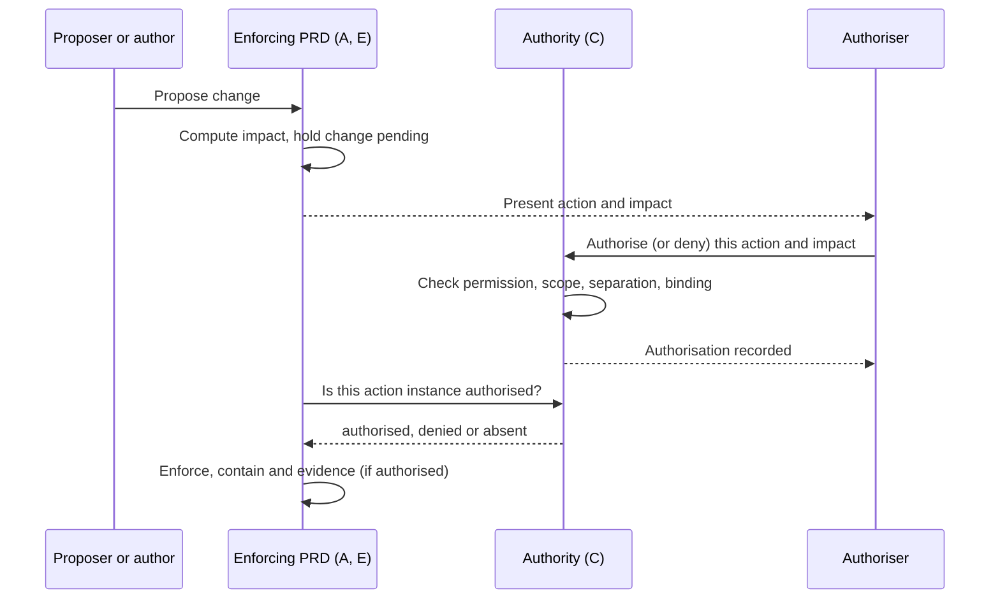

# Governed Execution & Delegated Authority — PRD

| Field | Value |
|:--|:--|
| Version | v0.2 |
| Status | Draft |
| Owner | rackai-product |
| Reviewers | Product owner; Platform engineering (IAC, control plane); Security; Governance (E owner); A, D and H owners |
| Product review | **Product-owner review disposition, 2026-10-10: conditional acceptance; not formal artifact approval.** PD-2 to PD-5, PD-7 and PD-9 to PD-13 approved in principle, subject to X-1 (authority principal) and X-3 (intent versus execution); PD-6 and PD-8 revised in v0.2; PD-1 held for the IAC owner |
| Product approval | not yet approved — recorded by the product owner only (who, date, version); passing checks is not approval |
| Date | 2026-10-10 |
| Roadmap items | Governed execution harness v1; IAC M4 (org-level RBAC + metering/billing/quota perms); Authority under incomplete intent; Governed harness - full runtime; Govern & assure inside the perimeter |
| Tech spec(s) | [[Governed Execution & Delegated Authority Tech Spec]] (v0.2 draft, drafted alongside per product-owner instruction 2026-10-10): designs Phase 1, the C/A interfaces and the C/E exception interface; Phase 2 and later phases are deferred there |

> **Artifact type: Product Requirements Document.** The canonical concepts are [[Governed Harness]], [[Agent Identity]] (identity plus delegated authority) and [[Action Controls]] (approval gates, reversibility, containment). This PRD projects from them and must not redefine them. If they disagree, the canonical notes win and this PRD is stale. It **consumes** the shipped identity and access services described in [[Identity and Access Control Spec]] and [[Identity & Access Control]]; it does not re-specify authentication, roles, role bindings or API keys.
>
> **Status banner.** *Draft PRD for a proposed capability.* Nothing here is built: RackAI has permissions today, but no authorisation of individual actions, no delegation, no separation of duties and no emergency path (§2). Requirements are intent, not commitments. Every product decision (§20) is *proposed*. Proposal **P-006**, decision **D3**.
>
> **Scope line (read first).** This PRD owns **who or what may act, which actions are permitted, and how that is enforced and evidenced**: the authority model, delegated authority, the authorisation of consequential and disruptive actions, the emergency path, and the governed path operators act through. It does **not** own: authentication, roles and role bindings (IAC, consumed as built); *where* execution happens and what may cross the boundary (**E**, [[Sovereign Isolation & Assurance PRD]], whose boundary rules C enforces actions against); the placement contract and its enforcement, containment and evidence (**A**, [[Workload Declaration & Placement PRD]]: C authorises, A enforces); the customer evidence report (**D**, [[Customer Observability & Evidence Report PRD]]); the conversational agent (**H**, [[Concierge Engineer PRD]], a consumer of C); multi-CustomerOrg tenancy (IAC).

## 1. Summary / Vision

RackAI asks customers to let Rackspace operate AI workloads inside their boundary. That only works if every action on their estate has an answer to three questions: **who acted, on whose authority, and was that action allowed**. This PRD adds the missing layer above today's permissions. Routine actions run on permission alone. Consequential actions need an authorisation bound to the exact action. Disruptive actions need the customer's authority, given after the consequences have been shown. A customer can delegate part of its authority, scoped and time-bound, to people, to RackAI operators and later to agents, without ever handing over more than it holds.

Why now: the governed execution harness is the MOE-0 Must that Proof 3 (*assume responsibility*) depends on, and PRD A already rejects disruptive policy changes until this authority model exists ([[Workload Declaration & Placement Tech Spec]] §4.5).

## 2. Problem Statement

**What exists today** (read-only code survey, `RSS-Engineering/rackai@79ca4de`; `derived`):

- **Permissions are built and solid.** Two authorization layers (Envoy ext_authz evaluating RoleBindings, then Kubernetes RBAC on the bridged identity), default deny, and a scope table that decides how far a permission reaches: platform, org (CustomerOrg), tenant and project (`internal/authz/scope.go`, `internal/authz/routemap.go`). There are five built-in roles (`internal/controller/platformrole_builtin.go`), and allows on sensitive resources are audited (`internal/authservice/server.go`, `sensitiveResources`).
- **There is nothing above permission.** A permission says an identity *may* do a kind of thing at a scope. Nothing authorises *this* action instance. The authz and authservice code has no approval, delegation, separation-of-duties or emergency concept.
- **Enforcement ships switched off.** `rbac.enforcement.mode=off`, `webhook.enabled=false` and `rbac.k8sGrants.enabled=false` by default, flipped together at one cutover (`docs/operations/rbac.md`).
- **Audit cannot say "on behalf of".** Audit actors are `user`, `service` or `controller` (`pkg/audit/event.go`). There is no agent actor and no delegation chain. Direct cluster access is the break-glass path by design, and a raw `kubectl` change is recorded with actor `unknown` because the audit webhook is not built ([[Monitoring and Auditability Spec]]).
- **The IAC M4 record conflicts with the code.** The roadmap says IAC M4 (org-level RBAC + metering/billing/quota permissions) was dropped. In the code, org-level role bindings (`scope.level: org`) are built and work whenever enforcement is on; what ships switched off is *multiple CustomerOrgs* (`rbac.multiOrg.enabled`, `internal/webhook/v1alpha1/customerorg_webhook.go`). `usage:view` and `observability:view` are enforced on their routes. `billing:*` and `quota:*` exist in the roles but have no routes, because no billing or quota API exists yet (`server.go` notes they "land in M4").
- **PRD A is waiting.** A's spec needs C to answer who sets inherited constraints, who approves placements, how long an approval lives, and who may authorise a policy change that stops a running workload. Until then A rejects disruptive policy changes (fail closed).

**Why it matters.** A regulated MOE-1 customer will not delegate operation unless it can see and limit what RackAI may do, and prove afterwards what was done under whose authority. Permissions alone can't express "RackAI may realise my declared workload but may not stop it without my say". **Hypothesis** (no customer evidence yet): MOE-1 customers will delegate routine operation to RackAI if consequential actions are authorised explicitly and every action is attributable.

## 3. Product Principles

1. **Permission is necessary, never sufficient for consequence.** IAC answers *may this identity do this kind of thing here*. C answers *is this action, now, authorised*.
2. **The customer owns customer outcomes.** Anything that stops a customer's workload, changes the customer's policy or excepts a customer boundary needs customer authority, direct or delegated. RackAI operator authority alone never suffices.
3. **Show the consequences, then authorise exactly those.** An authorisation is bound to the specific action and the impact that was presented. If the impact changes, the authorisation lapses.
4. **No one approves their own change.** The person who proposes or authors a consequential change is never the one who authorises it, except on the emergency path, which is reviewed afterwards.
5. **Delegation narrows, never widens.** A delegate never holds more than the delegator, and every delegation expires.
6. **C authorises; others enforce.** A enforces placement, E enforces the boundary, H acts through public APIs. None of them decides authority, and C never re-implements their enforcement.
7. **Fail closed, but never block safety.** If authority can't be established, nothing consequential happens. Containment (stopping a violating workload) is never held up by C.

## 4. Scope: Goals & Non-Goals

**Goals**
- Every consequential action on a RackAI estate is authorised, attributable to an authority, and evidenced.
- Customers can delegate scoped, time-bound authority without giving up control of their own outcomes.
- PRD A can turn on disruptive policy changes, with customer authorisation bound to the presented impact, including an emergency path.
- Operators run an MOE estate through one governed path, not a side door.
- Downstream PRDs (A, E, H) get one authority answer through one interface.

**Non-Goals / Out of Scope**
- Authentication, role bindings, built-in roles and API keys: IAC, consumed as built. C adds permissions and roles through IAC's own mechanisms.
- Multiple CustomerOrgs per installation (`rbac.multiOrg.enabled`): an IAC tenancy decision, not needed for C (D-1).
- Defining boundary rules, isolation levels and boundary evidence: **E**. C authorises exceptions to E's rules.
- Enforcing placement constraints, containment and placement evidence: **A**.
- The customer evidence report: **D**. C contributes records in the D-0 envelope.
- Agent scaffolding (context assembly, tools, memory, replay) of the [[Governed Harness]]: later phase (*Governed harness - full runtime*).
- Quota and billing policy themselves: Metering. C only requires that their permissions ship with their APIs (FR-23).

## 5. Users & Personas

| Persona | Side | Needs from C |
|---|---|---|
| **Customer security or platform admin** | Customer | Set organisation-wide policy; authorise or deny disruptive changes after seeing their effect; delegate authority; invoke the emergency path in an incident |
| **Customer application owner / ML engineer** | Customer | Act within their permissions without approval friction for routine work; know when a change needs someone else's authorisation |
| **RackAI operator** | RackAI | Propose and approve placements; operate the estate through one governed path; see what they are and aren't authorised to do |
| **RackAI security / compliance** | RackAI | Prove what was done, by whom, on whose authority; review emergency use |
| **Agents (later)** | Either | A task-scoped, expiring delegated identity (H v1; [[Agent Identity]]) |
| **Downstream PRDs** (A, E, H, D) | Platform | One authority interface; records in the D-0 shape |

## 6. Core Entities

| Entity | Role here |
|---|---|
| [[Authority Context]] | Canonical structure C produces for every governed action: acting principal, represented customer (authority principal), tenant scope, delegation chain, action instance, authorisation basis, expiry. Downstream PRDs consume it and never reconstruct it |
| [[Agent Identity]] | Canonical home of identity plus delegated authority (acting identity, delegation chain, scope, revocation, attribution). C's authority grant is its Phase-1 realisation for humans and operators; agents follow in Phase 2 |
| [[Action Controls]] | Canonical policy for approval gates, reversibility and containment. C's action classes apply it to platform actions |
| [[Governed Harness]] | The execution layer C's governed path is the first part of (v1); the full runtime is a later phase |
| [[Identity & Access Control]] | Permissions, scopes and roles C consumes (IAC M1 to M3, built) |
| [[Organization]] | Tenant scope, and the default **authority principal** for customer-owned policy. Its owning CustomerOrg is the authority principal only when it carries the validated single-customer attribute (FR-29, PD-14) |
| [[API Key]] | Service identity. In Phase 2 it may carry an agent's credential, but an agent's effective authority is always the intersection with the delegating user's authority through an authority grant, never the key's own role (spec Q-13; consistent with [[Concierge Engineer PRD]] §2) |
| [[Workload Declaration]] | The customer's statement; submitting it delegates the *how* to RackAI (A's PD-1, PD-4) |
| [[Sovereignty Levels]] | The boundary E defines and C enforces actions against |

**Defined here, not yet canonical** (C defines them; A, E and H consume them through C's interface, so they are candidates for a canonical note or an extension of [[Agent Identity]]: D-8):
- **Action class.** How much authority an action needs. *Routine*: permission is enough, inside an approved envelope or policy. *Consequential*: also needs an authorisation bound to the action instance. *Disruptive*: consequential, and it stops or moves a customer workload or weakens a customer-visible guarantee, so it needs customer authority and impact presentation first.
- **Action catalogue.** The single list of governed actions, each with its class, its required permission, who may authorise it, whether it may be delegated, whether it is eligible for the emergency path, and which boundary rules it touches.
- **Authority grant.** A delegation: a grantor who holds authority for some actions at a scope gives a delegate (user, group, operator group; agents later) the authority to perform or authorise them, with an expiry and optional conditions. Revocable.
- **Authorisation.** A single-use, immutable record that one action instance is authorised (or denied): bound to the action, its subject and version, and a digest of what was presented, with an expiry. The authoriser is recorded by the platform, never supplied by the client.
- **Authority decision.** The answer an enforcing PRD gets: *authorised* (with the authorisation and authoriser), *denied*, or *absent*.

## 7. User Journeys / Scenarios

**Worked example: a disruptive policy change (answers A's DV-3).** Acme's security admin, Priya, tightens Acme's organisation policy to *approved vendors: NVIDIA only* after an AMD driver advisory.
1. A computes the impact: two realised workloads run on AMD and would be stopped. The change stays *pending*; nothing running is touched.
2. The pending change, the two workloads and the consequence (*stopped until re-placed*) are shown to Priya and to Acme's other authorisers.
3. Priya cannot authorise her own change (FR-5). Sam, a second Acme admin, reviews the same impact and authorises it. His authorisation records the impact he saw.
4. A asks C: *is generation 7 with this impact authorised?* C answers *authorised (Sam)*. A makes the policy effective, stops the two workloads and records evidence. C records the authority decision.
5. If a third workload had started on AMD before Sam acted, the impact would have changed, Sam's authorisation would no longer match, and a new authorisation would be needed. If nobody acts by the deadline, the change is rejected.

**Worked example: emergency.** The advisory is an actively exploited vulnerability. Priya holds the emergency permission. She invokes the emergency path with an incident reference: the same impact is shown, she alone authorises it, A enforces at once, and a review by a second Acme authoriser is due within the review window. The path can only tighten; it cannot widen policy or except a boundary.

**Worked example: placement approval (answers A's Q-3, Q-14).** Ravi, a RackAI operator, proposes a placement for Acme's declaration. Dana, a different operator in the placement-approver group, approves it. Ravi could not approve his own proposal. A tenant-level Acme admin holds no placement approval authority at all; Acme's authority over the *what* is its declaration.

**Lifecycle (consequential action).**

## 8. Functional Requirements

**Authority model**

| # | Requirement | Priority | Notes |
|---|-------------|:--------:|-------|
| FR-1 | Every governed action is in one **action catalogue** with its class (routine, consequential, disruptive), required permission, authorising parties, delegability, emergency eligibility and the boundary rules it touches. A governed enforcement point refuses an action that isn't catalogued | MUST | PD-2 |
| FR-2 | No action proceeds unless the actor holds the IAC permission at the right scope. C consumes IAC's evaluation and never re-implements it | MUST | PD-3 |
| FR-3 | A **routine** action, with permission and inside an approved envelope or policy, proceeds without per-action authorisation and is audited | MUST | A's PD-4 routine operations |
| FR-4 | A **consequential** action needs an **authorisation** bound to the action, its subject and version, and a digest of what was presented. It is single-use and expires. The authoriser is recorded by the platform, never by the client, and the authorisation is re-checked when the action executes | MUST | PD-3, PD-6 |
| FR-5 | **Separation of duties** is the default for material changes: whoever proposed or authored a consequential or disruptive change cannot authorise it. The only exceptions are the emergency path (FR-15) and the recorded single-authoriser exception (FR-27). Self-approval is never allowed quietly | MUST | PD-6 (revised v0.2) |
| FR-6 | For a **disruptive** action, the affected workloads and the consequences are presented **before** authorisation, and the authorisation is bound to that impact. If the impact changes, the authorisation lapses | MUST | PD-7 |
| FR-7 | Disruptive actions on a customer's workloads, changes to customer policy and boundary exceptions need **customer authority**, direct or delegated. RackAI operator authority alone never suffices | MUST | PD-4, PD-7, PD-10; D-6 |
| FR-8 | An authorised party may **deny** an action instance. A denial wins over any authorisation for the same instance | MUST | |

**Delegation**

| # | Requirement | Priority | Notes |
|---|-------------|:--------:|-------|
| FR-9 | A holder of authority can create an **authority grant** to a user, group, operator group or a partner's own group (J D-8: partners act under their own identity, never customer-issued credentials), for named catalogue actions at a scope, with a mandatory expiry and optional conditions | MUST | PD-9 |
| FR-10 | A grant never exceeds the grantor's own authority. In Phase 1 a delegate cannot re-delegate. Actions the catalogue marks non-delegable (emergency, emergency review) can't be granted | MUST | PD-9 |
| FR-11 | Revoking or expiring a grant removes the authority it gave for every later decision, and an unused authorisation that relied on it fails its re-check at execution | MUST | |
| FR-12 | Every authority decision records the actor, the authority they acted on (direct permission or grant) and the authoriser(s) | MUST | [[Agent Identity]] attribution |

**Authority interfaces to other PRDs**

| # | Requirement | Priority | Notes |
|---|-------------|:--------:|-------|
| FR-13 | C provides **one authority decision interface** that returns *authorised* (reference, authoriser), *denied* or *absent* for an action instance. Enforcing PRDs (A, E, H) call it and never decide authority themselves. PRD A's `authority.ForPolicyChange(ctx, AuthorityContext, policyUID, generation, impactDigest)` is one use of it | MUST | PD-3; A spec §4.5 |
| FR-14 | **Inherited constraints:** customer admins set placement policy at the customer's **authority principal** (FR-29): the Organization, or the CustomerOrg only when it is validated single-customer. A policy at a lower scope may only narrow it. RackAI operators cannot author customer policy. A change that is disruptive follows FR-6 and FR-7 | MUST | PD-4; answers A Q-2 / D-2 |
| FR-15 | **Emergency security-policy path:** a customer holder of the emergency permission may authorise a *tightening* alone, with a reason and incident reference. The same impact is presented and A enforces and evidences it in the same way. A second customer authoriser must review it within a review window; overdue reviews alert. The path can't widen policy or except a boundary, and isn't delegable | MUST | PD-8 |
| FR-16 | **Placement authority:** placements are proposed and approved only under platform-scope (operator) authority; a tenant- or org-level binding never grants approval. The approver must differ from the proposer, and approvals expire per FR-4 | MUST | PD-5, PD-6; answers A Q-3 / D-3, Q-14 |
| FR-17 | A disruptive change that is still awaiting authorisation at its **deadline** is denied, and the enforcing PRD rejects it | MUST | A spec §4.5 step 7 |
| FR-18 | **Boundary exceptions:** an action blocked by one of E's exceptable boundary rules proceeds only with a customer authorisation bound to the rule, the rule-set version, the scope and the window. Without one, the answer is *absent* and nothing is excepted | MUST (interface Phase 1; live when E's rule set exists) | PD-10; E FR-16, FR-17 |

**Governed execution harness v1**

| # | Requirement | Priority | Notes |
|---|-------------|:--------:|-------|
| FR-19 | Operators take consequential actions on a customer estate through the governed path (API, CLI, console), not a side door. Direct cluster access stays the break-glass path for incidents. Each use is recorded with a reason (MUST), and out-of-path changes are detected where audit allows (SHOULD) | MUST / SHOULD | PD-12; D-7 |
| FR-20 | Customers can see, for their scope, the grants, pending requests with their impact, authorisations, denials and emergency uses. Operators can see what awaits them. API and CLI in Phase 1; console SHOULD in Phase 1 | MUST (API, CLI); SHOULD (console) | |
| FR-21 | If authority can't be established (C's source, the permission check or the audit store is unavailable), the answer is *absent* or the request is refused, and nothing consequential happens. C never blocks a containment (stop) action | MUST | Principle 7 |
| FR-22 | Every authorisation, denial, use, grant change, emergency use and review emits an audit event and an evidence record in the D-0 envelope | MUST | Feeds D |

**Phase 2**

| # | Requirement | Priority | Notes |
|---|-------------|:--------:|-------|
| FR-23 | **Permissions ship with their API:** when quota, billing or other platform APIs are added, their permissions are enforced at the correct scope in the same release (the remaining substance of IAC M4) | MUST (Phase 2) | PD-1 |
| FR-24 | **Incomplete-intent rule:** when a declaration is underspecified, RackAI infers only what is soft, reversible and within delegated authority; otherwise it asks, escalates or stops, or reports infeasibility. It never infers a hard constraint and never commits an irreversible choice on inference | SHOULD (Phase 2) | PD-11; D-3 |
| FR-25 | **Agent identities:** an agent acts under a task-scoped, expiring delegation from a user, never holds more than that user, and never holds authorisation or approval authority. Consequential agent actions need human confirmation. Audit records the agent and the user it acts for | SHOULD (Phase 2) | H v1 dependency; [[Agent Identity]] |
| FR-26 | **Standing delegations for disruptive maintenance:** a customer may grant RackAI time-windowed authority for disruptive re-placement within hard constraints (A FR-19) | SHOULD (Phase 2) | PD-5 |

**Added in v0.2 (product-owner review 2026-10-10)**

| # | Requirement | Priority | Notes |
|---|-------------|:--------:|-------|
| FR-27 | **Single-authoriser exception:** a customer authority principal with only one holder of the authorise permission may enrol, explicitly and for a bounded time, in a recorded exception. Under it the author may authorise their own change, but each such authorisation is marked as an exception, notifies an independent overseer, requires the overseer's after-the-fact review within a window, and appears in the customer's evidence. Never for placement approvals | MUST | PD-6 (revised) |
| FR-28 | **Platform-safety containment:** RackAI platform security may *contain* (stop a workload, quarantine a pool or endpoint from new use, withdraw a model configuration from new use) during a genuine security incident that threatens a customer or shared infrastructure. It may never weaken a customer boundary, change customer policy, re-place, delete, or make a discretionary change. Each use is catalogued, needs an incident reference, notifies the customer at once, is evidenced, and is reviewed by a second RackAI security reviewer and visible to the customer. Release follows the normal path | MUST | PD-8 (revised) |
| FR-29 | **Authority principal:** a CustomerOrg is the authority principal for customer-owned policy only when it carries an explicit, validated single-customer attribute. Otherwise customer-owned policy, including inherited `PlacementPolicy`, is scoped to the Organization. The installation is never a customer authority boundary. Invariant: *no customer can create, approve, weaken or inherit authority over another customer's workload through a shared parent* | MUST | PD-14; X-1 |
| FR-30 | **Attribution contract:** every governed record classifies its actor as one of: attributed principal; system-initiated with a known controller identity; direct administrative action whose authenticated principal was not captured; or unknown authority source. The last two are **audit coverage gaps**, never actors, and are counted as such. Break-glass uses the same attribution and incident-review contract | MUST | PD-16; J DV-3 |
| FR-31 | **Intent versus execution:** a customer expressing intent about its own resources (e.g. revising its declaration) needs no separate platform authorisation; executing it follows the catalogued authority. `model.retire` (commercial retirement) is disruptive, needs customer authority, and is never emergency-eligible. `model.security-withdraw` is a separate, narrowly scoped containment action, eligible for the emergency and platform-safety paths, with notice, evidence and review | MUST | PD-15; X-3 |
| FR-32 | **Authority Context for plain user sessions:** a caller acting as itself (no agent, no delegation) can obtain its own [[Authority Context]], derived by the platform from its credential, so its evidence records carry the right authority principal without reconstructing it | MUST | Requested by H (v0); spec §4.5 |

## 9. Non-Functional Requirements

- **Integrity (invariants, not targets).** Zero consequential actions executed without a matching, unexpired, unused authorisation; zero self-authorisations outside the emergency path; zero authorisations honoured for an impact other than the one presented. Each is testable (§15) and checkable in audit after the fact.
- **Fail closed.** §12. The one exception is safety: containment never waits for C.
- **Attribution.** Every consequential action is attributable to an actor, the authority they used and the authoriser, across both stores (Kubernetes and the audit store).
- **Responsiveness.** An authority decision is fast enough not to be noticed in an interactive flow. The bound is a target posture for the spec to measure; there is no baseline.
- **Tenancy.** A customer sees only grants and authorisations in its scope. Operator-group membership is not exposed to customers, but every RackAI decision affecting a customer names the operator who made it.
- **Sovereign installs.** The rules hold by scope, so they hold when the customer runs the platform itself (D-6).
- **Compatibility.** Additive to IAC. No existing permission, role or binding changes meaning.

## 10. Platform Integration

| System | Needs from it | Provides to it |
|---|---|---|
| Identity & access (IAC) | Authenticated identity, the permission evaluator and scope table, role bindings, built-in roles, the mint-style write path, enforcement on (`rbac.enforcement.mode=enforce`) | New permissions and roles (authority, placement policy, placement approval); a customer-only scope class (spec) |
| Tenancy & isolation | CustomerOrg and tenant scopes; E's boundary rules | Grants and authorisations scoped to one customer |
| Metering, quotas & billing | none in Phase 1 | Phase 2: the rule that quota and billing permissions ship with their APIs (FR-23) |
| Audit | Audit pipeline, a new category (spec) | Events for every authority decision and grant change (FR-22) |
| Monitoring & observability | Alerting | Metrics and alerts: pending past deadline, emergency use, unreviewed emergency, authority source errors |

## 11. Loop Role & Cross-PRD Interfaces

**Loop role:** *Stay inside your boundaries*, the "who may act" half. It serves the **sovereign** promise (the customer's authority over its own outcomes) and makes the operator promise deliverable (RackAI can operate because its authority is explicit).

| Interface | Direction | Other PRD | Defined where |
|---|---|---|---|
| Authority decision (`authorised` / `denied` / `absent`), incl. A's `authority.ForPolicyChange` | provides | A, E, H | This PRD (FR-13); mechanism in the spec |
| [[Authority Context]] (acting principal, authority principal, scope, chain, action, basis, expiry) | provides | A, D, E, F, G, H, I, J | [[Authority Context]] (canonical) |
| Placement approval rule (who proposes and approves, separation, expiry) | provides | A | This PRD (FR-16) |
| Inherited-constraint authority (who sets organisation and tenant policy) | provides | A | This PRD (FR-14) |
| Emergency security-policy path | provides | A | This PRD (FR-15) |
| Boundary-exception authorisation | provides | E | This PRD (FR-18) |
| Delegated agent identity and confirmation gate (Phase 2) | provides | H | This PRD (FR-25); canonical concept [[Agent Identity]] |
| Workload declaration (submitting it delegates the *how*) | consumes | A | [[Workload Declaration]] |
| Impact of a disruptive policy change (affected workloads, consequences, digest) | consumes | A | A spec §4.5 (`status.pendingImpact`) |
| Boundary rule set (exceptable flag) | consumes | E | [[Sovereign Isolation & Assurance PRD]] (FR-1) |
| Evidence envelope (D-0); C owns `policy-decision`, `authority-decision`, `authority-grant` (plus a daily `coverage` record) | provides to | D | [[Customer Observability & Evidence Report PRD]] |

**The C/E rule.** E defines boundary rules as constraints and says which are exceptable. C enforces actions against them: a catalogued action that touches a rule is refused unless an exception exists, and an exception is a C authorisation of that E rule. E applies the exception and records the `boundary-exception` record; C records the authority decision behind it.

## 12. Failure Handling

Stated in the terms of [[Failure Mode Taxonomy]].

| Failure | Class | Response | Continues / stops / degrades | Notified |
|---|---|---|---|---|
| C's authority source unavailable | Authority | **Fail closed** for new consequential and disruptive actions; decisions are *absent* | Running work continues; routine actions continue; containment still completes; A keeps disruptive policy changes pending | Operator (alert); customer sees *pending* |
| Permission check or audit store unavailable when authorising | Authority / Evidence | **Fail closed**: the authorisation is refused | Nothing is recorded as authorised that isn't audited | Requester (error); operator (alert) |
| Impact changed after authorisation | Admission | **Fail closed**: the authorisation isn't honoured | The change stays pending; a new authorisation is needed | Authoriser and author (status) |
| Grant revoked or expired, or the grantor lost its authority | Authority | **Fail closed** for later decisions | Unused authorisations relying on it fail their re-check | Grantor and delegate (status) |
| Nobody authorises before the deadline | Admission | **Fail closed**: denied; the enforcing PRD rejects and reverts | Effective policy unchanged | Author and authorisers |
| Emergency, single-authoriser or platform-safety review overdue | Evidence | **Escalate**: alert; evidence record; no automatic revert (reverting could reopen the risk) | The change stays in force | Customer admins, overseer, RackAI security |
| Containment needed while C is down | Containment | **Contain** proceeds; evidence back-filled and flagged | Stopping a workload never waits for authority | Customer and operator (A's notification) |
| Platform-safety containment fails to complete | Containment | **Escalate**: page and runbook (A/E); never delete or relax | — | Operator (page); customer |
| Out-of-path change with uncaptured or unknown principal | Evidence | Recorded as an **audit coverage gap**, never as an actor | The change itself is not undone by C | RackAI security; counted in coverage |

**Guaranteed never to happen:** a disruptive change to a customer's workloads authorised by RackAI alone; a self-authorisation outside the emergency path or the recorded single-authoriser exception; an authorisation used twice; a delegate holding more than its grantor; a platform-safety action that widens, deletes or changes customer policy; authority over a customer's workload gained through a shared parent.

## 13. Data Retention & Compliance

C holds grants, authorisations, denials and reviews: identities, action references and digests, never customer content. Grants and authorisations are kept while they are live and then for the platform's audit retention window (`complianceRetentionDays`). Audit rows follow the existing retention policy. These records are the evidence that the customer's authority held, which MOE-1 assurance relies on (D, E).

## 14. Scope & Phasing

| Phase | Gate | Delivers | Roadmap items |
|---|---|---|---|
| **1** | MOE-0 → MOE-1 | Governed execution harness v1: action catalogue and classes (FR-1 to FR-8), delegation depth 1 (FR-9 to FR-12), the authority interface with A's answers (FR-13 to FR-17), the boundary-exception interface (FR-18), the governed operator path, visibility, fail-closed behaviour and evidence (FR-19 to FR-22); the v0.2 additions (FR-27 to FR-31: single-authoriser exception, platform-safety containment, authority principal, attribution contract, intent versus execution). Rehearse with one MOE-0 workload first | Governed execution harness v1 |
| **2** | MOE-1 → MOE-2 | IAC M4 resolved as FR-23 (permissions ship with their APIs); incomplete-intent rule (FR-24); agent identities and confirmation (FR-25, for H v1); standing delegations for disruptive maintenance (FR-26) | IAC M4 (org-level RBAC + metering/billing/quota perms); Authority under incomplete intent |
| **Later** | Beyond MOE-4 | The full harness runtime: guardrails for agents at execution time (tools, context, memory), replay and recovery | Governed harness - full runtime |
| **Later** | MOE-4 | Govern and assure at estate scale, including estates on customer supply | Govern & assure inside the perimeter |

Sequencing: C's Phase 1 doesn't wait for E. The boundary-exception interface returns *absent* until E's rule set exists, which is the fail-closed answer E already expects (E FR-17).

## 15. Acceptance Criteria & Success Metrics

**Acceptance criteria** (Phase 1; each pass/fail; proposed, not approved; gates per [[Release Readiness States]]):

| # | Criterion and expected result (observable, pass/fail) | Verifies | Evidence source | Milestone · gate |
|---|---|---|---|---|
| AC-1 | A governed enforcement point refuses an uncatalogued action with `UnknownAction`, and every catalogue entry has a class, a permission and its authorising parties | FR-1, FR-21 | Catalogue unit test; negative API test log | M1 · MOE-0 |
| AC-2 | A routine action with permission completes without an authorisation and produces an audit row; without permission it gets HTTP 403 from IAC | FR-2, FR-3 | API test; audit query | M1 · MOE-0 |
| AC-3 | A consequential action with no authorisation does not execute. With a valid one it executes exactly once. Replayed, expired, mismatched-digest and revoked-basis authorisations are each refused, and a denial for the same instance wins | FR-4, FR-8, FR-11 | API test matrix; audit query showing one `authorization_consumed` per authorisation | M2 · MOE-0 |
| AC-4 | An authorisation by the change's author, or an approval by the placement's proposer, is rejected (`SelfAuthorization`, `SelfApproval`) unless the recorded single-authoriser exception applies (AC-14) | FR-5, FR-16 | API test; `authorization_rejected` audit rows | M2 · MOE-0 |
| AC-5 | `authority.ForPolicyChange` returns *absent* with no authorisation and *authorised* only for the exact generation and impact digest; no authorisation can be minted for a digest other than the one presented; after the impact changes, the earlier authorisation is not honoured | FR-6, FR-13 | Integration test with A's policy controller; audit and evidence records | M2 · MOE-0 |
| AC-6 | An identity whose only authority is platform scope can neither author customer policy nor authorise a customer's disruptive change. The authority-principal admin can set policy, and a lower scope can only narrow it | FR-7, FR-14 | API test per scope | M1 · MOE-0 |
| AC-7 | The emergency path works with a single authoriser holding the emergency permission and requires a reason and incident reference. It is refused for a widening, a boundary exception, `model.retire` and a delegated holder. A second authoriser's review is required, and an overdue review raises an alert and an evidence record | FR-15, FR-31 | API test; alert fired in staging; evidence record | M3 · MOE-1 |
| AC-8 | A grant exceeding the grantor's authority, or naming a non-delegable action, is rejected. After revocation or expiry the delegate's later authorisations are refused and unused ones fail their re-check. Each decision records the delegation chain in its [[Authority Context]] | FR-9 to FR-12 | API test; audit query | M3 · MOE-1 |
| AC-9 | Placement approval is granted only through a platform-scope binding; a tenant- or org-level binding carrying the same permission gets HTTP 403 | FR-16 | API test | M1 · MOE-0 |
| AC-10 | A disruptive change with no authorisation at its deadline is reported *denied*, and A rejects and reverts it | FR-17 | Integration test with a short test deadline; A's `policy_change_rejected` audit row | M2 · MOE-0 |
| AC-11 | With a stub of E's `BoundaryException`: an exception proceeds only with a customer authorisation bound to its spec digest; a RackAI-only authorisation is rejected; with none the answer is *absent* | FR-18, FR-7 | Integration test against the stub | M3 · MOE-1 (live once E M3 lands) |
| AC-12 | With C's source, the permission check or the audit store unavailable, no consequential action executes and no authorisation is created, while an injected containment still completes | FR-21 | Fault-injection test log | M2 · MOE-0 |
| AC-13 | Every event listed in FR-22 produces an audit event and an evidence record of the right kind (`policy-decision`, `authority-decision`, `authority-grant`) that validates against D-0, and a daily `coverage` record reconciles against the `authority` audit category | FR-22 | Schema test; coverage reconciliation | M2 (audit), M4 (evidence) · MOE-1 |
| AC-14 | A customer without the single-authoriser enrolment can't self-authorise. With it, a self-authorisation succeeds only marked as an exception, the overseer is notified at mint, an overdue review alerts, and placement approvals stay two-person | FR-5, FR-27 | API test; notification and alert check; evidence record | M3 · MOE-1 |
| AC-15 | RackAI platform security can stop a workload, quarantine a pool or endpoint and withdraw a model configuration with an incident reference; the customer is notified, evidence is produced and a second reviewer is required. The same identity is refused for any policy change, widening, deletion, re-placement or boundary exception | FR-28 | API test matrix; notification check; evidence record | M3 · MOE-1 |
| AC-16 | On a CustomerOrg without the single-customer attribute, a CustomerOrg-level policy or authorisation over its Organizations is rejected, and an admin of one Organization cannot affect another Organization's workloads. With the validated attribute, CustomerOrg-level policy applies | FR-29 | API test with two Organizations under one CustomerOrg | M1 · MOE-0 |
| AC-17 | A system action is recorded with its controller identity; a direct administrative change with no captured principal, and one with no known authority source, are each recorded as coverage gaps (never as an actor) and counted in `coverage` | FR-30 | Test on the inner apiserver; coverage record | M2 · MOE-1 |
| AC-18 | `model.retire` requires customer authority and is refused on the emergency and platform-safety paths; `model.security-withdraw` is accepted on both, with notice and review | FR-31 | Catalogue test; API test | M3 · MOE-1 |

**Success metrics** (ladder; baselines are "none today" unless stated; targets are postures):

1. **Governed coverage:** share of consequential actions on MOE estates taken through the governed path. Baseline: none (no path exists).
2. **Integrity invariants** (must stay at zero): actions executed without a matching authorisation; self-authorisations outside the emergency path; authorisations honoured for a different impact.
3. **Out-of-path actions:** direct-cluster actions per estate, each with a recorded reason. Baseline: unknown, because such actions can't be attributed today (D-7).
4. **Time to authorise:** request to authorisation for disruptive changes. Instrument in Phase 1; no target.
5. **Emergency hygiene:** emergency uses, and the share reviewed within the window.
6. **Delegation uptake (Phase 2, diagnostic):** share of MOE-1 customers with at least one standing grant to RackAI.
7. **Outcome (measured by D):** evidence reports in which every consequential action is attributable to an authority.

## 16. Dependencies

- **IAC (built):** evaluator, scope table, built-in roles, role bindings, the mint-style write path; enforcement switched on for any estate where C is relied on.
- **A:** impact computation and presentation for disruptive policy changes (A spec §4.5), proposer and author stamping, enforcement and containment.
- **E:** the boundary rule set and exceptable flag (FR-18).
- **D-0:** the evidence envelope.
- **Auditing:** the audit webhook, for attributing out-of-path changes (D-7).
- **Depended on by:** A (DV-3 closure, placement approvals), E (exceptions), H (v1 agent identity and confirmation), D (authority evidence).

## 17. Risks & Mitigations

| Risk | Mitigation |
|---|---|
| Approval friction makes the governed path slower than going around it | Routine actions need no authorisation (FR-3); standing grants (FR-26); out-of-path actions measured (metric 3) and the kill criterion watches it |
| Separation of duties blocks small customers with one admin | Explicit open decision (D-4) before MOE-1 onboarding |
| Authority is "governed" in the product but RackAI can still act through the cluster | Break-glass recorded with a reason (FR-19); attribution gap stated honestly until the audit webhook ships (D-7) |
| The emergency path becomes the normal path | Tighten-only, single-use, reviewed, alerted, measured (metric 5) |
| C drifts into enforcing placement or the boundary itself | C returns decisions only; A and E enforce (principle 6, §11) |
| Group membership changes lag authority | Authorisations expire (FR-4); the remaining lag is the token lifetime IAC already accepts (spec) |

## 18. Kill / Falsification Criterion

The bet is that RackAI can operate inside a customer's boundary under **explicit, evidenced, delegated authority**, and that operators can run an estate through the governed path.

**Falsified if either holds after RackAI has fixed the stated problems within the approved scope:**
- **(a) The path can't carry real operation:** during the MOE-0 rehearsal and the first MOE-1 estate, operators routinely take consequential actions outside the governed path because it can't support the operation they need.
- **(b) Customers won't delegate:** most MOE-1 customers refuse to let RackAI act on authority they delegated, and instead insist on approving routine operation action by action.

**Evidence:** out-of-path action records and their reasons (metric 3), governed coverage (metric 1), customer grant and approval records, and MOE-1 customer reviews.

**If falsified:** for (a), re-scope harness v1 to the actions operators actually take and keep the rest evidence-only; for (b), fall back to per-action customer approval and revisit the P-006 framing with the product owner. The thresholds ("routinely", "most") are proposed for approval (PD-13).

## 19. Open Decisions

| # | Decision | Owner | Blocks |
|---|----------|-------|--------|
| D-1 | **IAC M4 conflict** (PD-1 held). *Built:* org-level role bindings (`scope.level: org`), enforced under `rbac.enforcement.mode=enforce`; `usage:view` and `observability:view` route enforcement; `billing:*` and `quota:*` defined in roles. *Remains:* billing and quota route enforcement (no APIs exist yet); multiple CustomerOrgs (`rbac.multiOrg.enabled`, gated off); custom roles; the cross-service identity consistency checks. *Depends on the remainder:* Metering M3/M4 quota APIs and A FR-22 (quota in declaration terms); any billing API (B); multi-customer installs that rely on CustomerOrg-level authority (PD-14) | IAC owner (Erik), with product owner | Row 38 disposition; FR-23 |
| D-2 | Policy values: approval and authorisation lifetimes (and the platform maximum), the pending-change deadline, the emergency, single-authoriser and platform-safety review windows, the single-authoriser enrolment lifetime | Product owner, with operations | FR-4, FR-15, FR-17, FR-27, FR-28 values before MOE-1 |
| D-3 | **Authority under incomplete intent:** ratify the infer / ask / escalate / stop rule (PD-11). A leadership decision per the roadmap | Leadership, via product owner | FR-24; H v2 |
| D-4 | Who may act as the **independent overseer** for single-authoriser customers (RackAI governance reviewer, a customer-nominated external reviewer, or either) | Product owner | FR-27 at MOE-1 onboarding |
| D-5 | ~~RackAI-initiated protective stop~~ — answered by revised PD-8 (platform-safety containment, FR-28). Remaining: which incidents count as "genuine security incidents" (severity criteria for the runbook) | Product owner, with security | FR-28 runbook |
| D-6 | Sovereign installs, where the customer's own staff hold platform scope: confirm the customer-versus-operator rule is applied by scope, not by employer | Product owner | FR-7 on sovereign installs |
| D-7 | Out-of-path (direct cluster) changes can't be attributed until the audit webhook ships; until then they are coverage gaps (FR-30). When does it ship? | Monitoring & Audit owner, with product owner | FR-19 detection; metric 3 |
| D-8 | Canonical home for *action class*, *authority grant* and *authorisation* (consumed by A, E, H). [[Authority Context]] is now canonical; the remaining terms may stay here | Knowledge-graph steward, with product owner | P-10 strictness |
| D-9 | ~~Is a CustomerOrg always one customer?~~ — answered by X-1 (PD-14, FR-29): only when it carries the validated single-customer attribute. Remaining: who attests the attribute at onboarding | Product owner, with E owner | FR-29 onboarding |

## 20. Proposed Product Decisions

None is approved. Each can be accepted, changed or rejected on its own. Statuses record the product-owner review disposition of 2026-10-10 (conditional acceptance; not formal artifact approval).

| # | Decision | Alternatives considered | Why this one | Status |
|---|---|---|---|---|
| PD-1 | **IAC M4 is not reinstated as a milestone.** Org-level RBAC is treated as built and consumed. The remaining substance (billing and quota permission enforcement) becomes a rule: permissions ship with their API (FR-23). Multiple CustomerOrgs stay an IAC tenancy decision outside C. Row 38 is re-dispositioned accordingly (D-1) | Reinstate IAC M4 as scoped; leave row 38 as dropped | The code already delivers org-level RBAC; billing and quota have no API to protect yet; a milestone with no API behind it would be empty. Matches P-006's outcome framing | proposed — held (PO review 2026-10-10): for the IAC owner (Erik); built, remaining and dependent capabilities recorded in D-1 |
| PD-2 | **Three action classes** (routine, consequential, disruptive) in **one action catalogue**; emergency is a path, not a class | Per-feature approval flags; one approval rule for everything | One place to read and test; routine work stays free of approval friction, applying [[Action Controls]] by blast radius | proposed — approved in principle 2026-10-10 (PO review) |
| PD-3 | **Authority = IAC permission + C authorisation**, answered through one interface that returns *authorised*, *denied* or *absent*. A denial wins | C builds its own role model; each PRD keeps its own approval rules | No second RBAC; enforcing PRDs can't drift into deciding authority | proposed — approved in principle 2026-10-10 (PO review) |
| PD-4 | **Inherited placement policy is customer-owned** (answers A Q-2 / D-2): set at the customer's authority principal (the Organization, or the CustomerOrg only when validated single-customer, PD-14) by customer admins, narrowable (never widenable) below it. RackAI operators can't author it. The `PlacementPolicy` object and its mechanics stay A's; C owns who may write it and how a disruptive change to it is authorised | Tenant scope only; RackAI-owned policy; a new C policy object | Matches the persona (organisation-wide constraints), uses org-level bindings that are built, keeps the boundary C authorises / A enforces. Needs A to read a CustomerOrg-level policy (spec exception) | proposed — approved in principle 2026-10-10 (PO review); text aligned to X-1 (PD-14) in v0.2 |
| PD-5 | **Placement authority** (answers A Q-3 / D-3): `placement:propose` and `placement:approve` are held only at platform scope, through a new built-in placement-operator role (in Phase 2, G's service identity may hold `placement:propose` at platform scope, never approve; G D-7); customers don't approve realisations, because their declaration is their authority over the *what*. **Disruptive re-placement** needs operator approval plus customer authority, given directly or through a standing grant (FR-26, Phase 2); until then it isn't offered | Customer admins approve placements; any platform admin approves | Puts operator judgement on the *how* and customer authority on disruption; separates approval from general admin | proposed — approved in principle 2026-10-10 (PO review) |
| PD-6 | **Separation by default, with a controlled exception; lifetimes mandatory** (answers A Q-14). The approver differs from the proposer and the authoriser from the author for every material (consequential or disruptive) change. **Controlled exception:** a customer authority principal with a single authoriser may enrol, for a bounded time, in a recorded single-authoriser exception (FR-27): each self-authorisation is marked, notifies an independent overseer (D-4), needs the overseer's review within a window, and appears in evidence. Placement approvals (RackAI side) never use it. Self-approval is never allowed quietly. Every authorisation and approval has a lifetime, set per estate within a platform maximum (D-2) | Strict two-person rule (v0.1); same-person approval allowed | The product owner ruled that separation stays the default but small customers need a governed way to operate; the exception is visible, reviewed and evidenced rather than silent | proposed — revise (PO review 2026-10-10): add a controlled exception model for small customer organisations with independent oversight, evidence and review; revised v0.2, pending approval |
| PD-7 | **Disruptive policy changes** (answers A Q-16 / DV-3): authorised by a customer-side holder of the authorise permission at the policy's scope, who is not its author, after the impact is presented. The authorisation carries the presented impact digest and generation, is single-use, and lapses if the impact changes. A pending change with no authorisation at the deadline is denied | RackAI operator authorises; author acknowledgment (v0.2 of A's spec, rejected) | The customer owns its outcomes (principle 2); binding to the presented impact is what makes "show, then authorise" checkable | proposed — approved in principle 2026-10-10 (PO review) |
| PD-8 | **Two incident paths.** (1) **Customer emergency security-policy path:** customer-side only, separate emergency permission, single authoriser, reason and incident reference, tighten-only, not delegable, same impact presentation, enforcement and evidence, review by a second customer authoriser within a window, no automatic revert. (2) **RackAI platform-safety containment** (FR-28): RackAI platform security may contain (stop, quarantine from new use, withdraw a configuration from new use) during a genuine security incident threatening a customer or shared infrastructure; never weaken a boundary, change customer policy, re-place, delete or make a discretionary change; catalogued, incident-referenced, customer-notified at once, evidenced, reviewed by a second RackAI reviewer. Release follows the normal path | Customer path only (v0.1); RackAI may invoke the customer path | Containment of a live threat can't wait for a customer, but containment is the only thing RackAI may do alone, so the sovereign promise holds | proposed — revise (PO review 2026-10-10): add narrowly scoped RackAI platform-safety containment authority; revised v0.2, pending approval |
| PD-9 | **Delegation depth 1 in Phase 1:** grants to users, groups and operator groups; mandatory expiry; no amplification; no re-delegation; emergency and review are non-delegable; agents never receive authorisation or approval authority | Unlimited chains; non-expiring grants | Smallest model that lets a customer delegate to RackAI; chains wait for agents (Phase 2) | proposed — approved in principle 2026-10-10 (PO review) |
| PD-10 | **Boundary exceptions need customer authority**, bound to the E rule, rule-set version, scope and window; never standing; never RackAI alone | RackAI may except for operational need; standing exceptions | Matches E (boundary exception = C authorisation of an E rule, never standing) and principle 2 | proposed — approved in principle 2026-10-10 (PO review) |
| PD-11 | **Incomplete-intent rule** (row 39, Phase 2): infer only soft, reversible values within delegated authority, and record and show each inference; otherwise ask the customer, escalate to an operator, or stop; report infeasibility rather than relax. Never infer a hard constraint or commit an irreversible choice on inference. Ratification is D-3 | Always ask; let operators decide case by case | The roadmap's ladder, made testable; consistent with A's principle *never silently relax* | proposed — approved in principle 2026-10-10 (PO review) |
| PD-12 | **Harness v1 is the governed action path** for operator and system actions (catalogue, authorisation, delegation, evidence), not an agent runtime. Agents act from Phase 2 under [[Agent Identity]]; the scaffolding of the [[Governed Harness]] is *Governed harness - full runtime* | Build an agent runtime for MOE-0 | MOE-0 is an operator rehearsal; the first thing to govern is what operators do. Agent work without authority underneath would be a side door | proposed — approved in principle 2026-10-10 (PO review) |
| PD-13 | **Falsification thresholds** (§18): "routinely" for out-of-path operator actions, and "most" MOE-1 customers refusing delegation, both after in-scope fixes | Fixed percentages now | No baseline exists to set a number honestly | proposed — approved in principle 2026-10-10 (PO review) |
| PD-14 | **Authority principal (X-1):** hierarchy Installation → CustomerOrg → Organization → Project → Workload. A CustomerOrg owns customer policy only with an explicit, validated single-customer attribute; otherwise the Organization does. The installation is never a customer authority boundary. Invariant: *no customer can create, approve, weaken or inherit authority over another customer's workload through a shared parent* | CustomerOrg always (v0.1 PD-4) | Today one installation's CustomerOrg may hold several customers; authority must follow the real customer security principal | proposed (v0.2, from PO review X-1), pending approval |
| PD-15 | **Intent versus execution (X-3):** expressing intent about one's own resources needs no platform authorisation; execution follows the catalogued authority. `model.retire` is disruptive, customer authority, never emergency-eligible; `model.security-withdraw` is a separate containment action eligible for the emergency and platform-safety paths, with notice, evidence and review | One `model.retire` with an emergency flag | Commercial lifecycle must never ride on a security path | proposed (v0.2, from PO review X-3), pending approval |
| PD-16 | **Attribution contract:** four cases (attributed; system with known controller; administrative with principal not captured; unknown authority source). The last two are coverage gaps, never actors. Break-glass uses the same contract and incident review | Record `unknown` as an actor | An unknown actor in evidence would read as an accountable party; a gap is honest and countable | proposed (v0.2, from J DV-3 interplay), pending approval |

## See Also

- [[Agent Identity]], [[Action Controls]], [[Governed Harness]] — the canonical concepts this PRD builds on
- [[Identity & Access Control]], [[Identity and Access Control Spec]] — the built permissions C consumes
- [[Governed Execution & Delegated Authority Tech Spec]] — the engineering design for this PRD
- [[Workload Declaration & Placement PRD]], [[Workload Declaration & Placement Tech Spec]] — A, which enforces what C authorises
- [[Sovereign Isolation & Assurance PRD]] — E, whose boundary rules C enforces actions against
- [[Concierge Engineer PRD]] — H, the first agent consumer of C
- [[PRD Coverage Plan]] — where C sits, and the C/E ownership rule
- [[RackAI Roadmap]] — P-006 and decision D3
