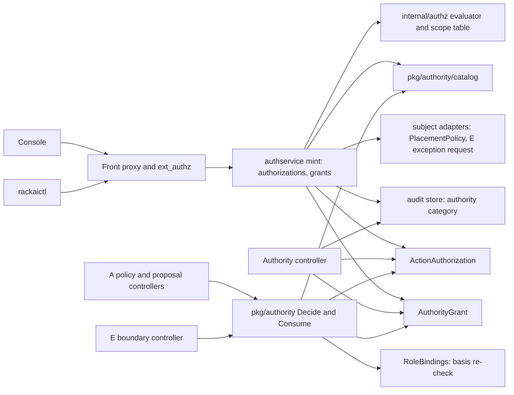

# Governed Execution & Delegated Authority — Technical Specification

| Field | Value |
|:--|:--|
| Version | v0.2 |
| Status | Draft |
| Author | Wiki agent for rackai-product (draft for platform engineering) |
| Reviewers | Platform engineering (IAC, control plane); Security; Product owner; A, E and D owners; UI; Docs |
| Engineering approval | not yet approved |
| Product review | **Product-owner review disposition, 2026-10-10: conditional acceptance; not formal artifact approval.** v0.2 applies the PRD rulings: single-authoriser exception (§4.6.2), platform-safety containment (§4.6.1), authority principal (§4.13), [[Authority Context]] in every interface (§4.5), attribution contract (§4.9), `model.retire` / `model.security-withdraw` (§4.1), failure handling in [[Failure Mode Taxonomy]] terms (§9), readiness states and blockers (§13). DV-1 and DV-2 received no ruling |
| Product approval | not yet approved |
| Date created | 2026-10-10 |
| Based on PRD(s) | [[Governed Execution & Delegated Authority PRD]] (v0.2 draft, conditionally accepted in PO review 2026-10-10, not yet approved; spec drafted alongside per product-owner instruction 2026-10-10) |
| Roadmap items | Governed execution harness v1; IAC M4 (org-level RBAC + metering/billing/quota perms); Authority under incomplete intent; Governed harness - full runtime; Govern & assure inside the perimeter |
| Jira epic(s) | none yet: one epic per milestone (§13), to be created by platform engineering |

> **Artifact type: Technical Specification.** An authored engineering design. Its concepts have canonical notes: [[Agent Identity]] (delegated authority), [[Action Controls]] (approval gates, containment), [[Governed Harness]], [[Identity & Access Control]]. This spec designs *how* to build PRD C's Phase 1 and does not redefine them.
>
> **Status banner.** *Proposed design; nothing is built.* Design statements are `assumed`. Statements about today's code are `derived` from the read-only survey in §3, pinned to commits. The spec designs PRD Phase 1 in full. The Phase-2 rows (*IAC M4 (org-level RBAC + metering/billing/quota perms)*, *Authority under incomplete intent*) and the later rows (*Governed harness - full runtime*, *Govern & assure inside the perimeter*) are named so their link-back holds; their designs are a later revision (§1.3, §13).

### 0. Status markers (convention)

- **AS BUILT (YYYY-MM-DD, TICKET):** what shipped where it differs from the design above it.
- **PROPOSED, NOT BUILT (YYYY-MM-DD):** designed here, not implemented.
- **RETAINED FOR THE RECORD:** a rejected or replaced design kept for the decision record.

**PROPOSED, NOT BUILT (2026-10-10):** everything in §4–§13.

## 1. Overview

This spec adds an **authority layer** on top of the built IAC permission system in `RSS-Engineering/rackai`. It has four parts:
- an **action catalogue** in code that classifies every governed action;
- two new CRDs: `ActionAuthorization`, a single-use, bound authorisation or denial, and `AuthorityGrant`, a delegation;
- a **mint path** in the existing authservice that creates both, evaluating the caller's authority with the full authenticated identity, the same way API keys are minted today;
- a `pkg/authority` package with one decision function. PRD A's controllers call it through `authority.ForPolicyChange`, and E's will call it through `authority.ForBoundaryException`.

It adds permissions, two built-in roles and one scope class to `internal/authz`, plus an audit category `authority`. The change is **additive**. No existing permission, role, binding or route changes meaning. It needs no new service: the mint runs in the authservice, and the controllers and decision package run in the manager.

### 1.1 Goals

- G-1: One catalogue that classifies governed actions and states who may authorise each (FR-1).
- G-2: Authorisations bound to action, subject, generation and presented digest. They are single-use, expiring and platform-stamped, and re-checked at use (FR-4 to FR-8).
- G-3: Delegation without amplification, with expiry, revocation and invalidation when the grantor loses authority (FR-9 to FR-12).
- G-4: One decision function behind A's and E's interfaces, returning `authorised` / `denied` / `absent` (FR-13, FR-17, FR-18).
- G-5: A's open questions answered in mechanism: customer-only authority for customer policy, platform-only placement approval, separation, lifetimes, the emergency path (FR-14 to FR-16).
- G-6: Fail closed everywhere except containment, with audit before success and D-0 evidence (FR-19 to FR-22).

### 1.2 Non-Goals

- **Authentication, role bindings, API keys:** IAC, unchanged.
- **Enforcing placement, containment and placement evidence:** A ([[Workload Declaration & Placement Tech Spec]]).
- **Boundary rules, the exception request object and applying exceptions:** E ([[Sovereign Isolation & Assurance PRD]]; E's spec).
- **Phase-2 FRs:** FR-23 to FR-26, deferred (§1.3).
- **Detecting out-of-path cluster changes:** depends on the audit webhook (Q-8).
- **Converging A's `PlacementApproval` into `ActionAuthorization`:** a Phase-2 option (Q-7). In Phase 1, A keeps its object and C supplies the rules it must apply.

### 1.3 Requirements Traceability

All 32 functional requirements of `prd-governed-execution-authority`:

| PRD · req | Spec section(s) | Milestone | Status |
|---|---|---|---|
| prd C · FR-1 action catalogue | §4.1 | M1 | covered |
| prd C · FR-2 IAC permission first | §4.2, §6 | M1 | covered (consumes `internal/authz`) |
| prd C · FR-3 routine actions | §4.1, §7 | M1 | covered (permission only; audit by the enforcing PRD) |
| prd C · FR-4 bound, single-use, expiring authorisation | §4.3, §4.5 | M2 | covered |
| prd C · FR-5 separation of duties | §4.3 (mint step 5), §4.6 | M2 | covered (single-authoriser customers: Q-6) |
| prd C · FR-6 impact presented, then bound | §4.3 (mint step 6), §4.7 | M2 | covered (needs A fields, §1.6) |
| prd C · FR-7 customer authority | §4.2 (customer-only class) | M1, M2 | covered (sovereign mapping: Q-12) |
| prd C · FR-8 denial wins | §4.5 | M2 | covered |
| prd C · FR-9 grants | §4.4 | M3 | covered |
| prd C · FR-10 no amplification, depth 1, non-delegable set | §4.4 (mint checks) | M3 | covered |
| prd C · FR-11 revocation and expiry | §4.4 controller, §4.5 re-check | M3 | covered (group-membership lag: DV-1) |
| prd C · FR-12 attribution chain | §4.3 `basis`, §4.9 | M2, M3 | covered |
| prd C · FR-13 one decision interface | §4.5 | M2 | covered |
| prd C · FR-14 inherited-constraint authority | §4.2, §4.7 | M1, M2 | covered (needs A's CustomerOrg-level source, §1.6) |
| prd C · FR-15 emergency path | §4.6 | M3 | covered |
| prd C · FR-16 placement authority | §4.2, §4.8 | M1, M2 | covered |
| prd C · FR-17 pending deadline | §4.5 step 6 | M2 | covered |
| prd C · FR-18 boundary exceptions | §4.10 | M3 | covered as interface; live when E's rule set and request object exist (Q-4) |
| prd C · FR-19 governed operator path, break-glass | §4.11, §5 | M2 (record), M4 (console) | partial: detection deferred (DV-2, Q-8) |
| prd C · FR-20 visibility | §5, §13 M4 | M2 (API, CLI), M4 (console) | covered |
| prd C · FR-21 fail closed, containment never blocked | §9 | M2 | covered |
| prd C · FR-22 audit and evidence | §4.9 | M2 (audit), M4 (evidence) | covered (D-0 mapping: Q-5) |
| prd C · FR-23 permissions ship with their API | — | Phase 2 | deferred (D-1; a standard in §3.4 meanwhile) |
| prd C · FR-24 incomplete-intent rule | — | Phase 2 | deferred (D-3) |
| prd C · FR-25 agent identities, confirmation | — | Phase 2 | deferred (needed by H v1) |
| prd C · FR-26 standing delegations for disruption | — | Phase 2 | deferred (needs A FR-19) |
| prd C · FR-27 single-authoriser exception | §4.6.2 | M3 | covered |
| prd C · FR-28 platform-safety containment | §4.1, §4.6.1 | M3 | covered (enforcement by A, E, F: consumer requirement) |
| prd C · FR-29 authority principal | §4.13, §4.2 | M1 | covered |
| prd C · FR-30 attribution contract | §4.9 | M2 | covered (detection of direct changes: Q-8) |
| prd C · FR-31 intent versus execution, `model.retire` | §4.1 | M1 (catalogue), F's phase (live) | covered |
| prd C · FR-32 Authority Context for plain user sessions | §4.5 | M2 | covered |

**Roadmap rows without Phase-1 design.** *IAC M4 (org-level RBAC + metering/billing/quota perms)* and *Authority under incomplete intent* are Phase 2 (FR-23, FR-24). *Governed harness - full runtime* and *Govern & assure inside the perimeter* are later phases. This spec names them so the roadmap links back, and §13 records only their entry conditions.

**Acceptance criteria → design and test:**

| AC | Designed in | Proven by (§12) | Milestone | Gate |
|---|---|---|---|---|
| AC-1 | §4.1 | Catalogue unit test; uncatalogued action refused at mint and at `Decide` | M1 | MOE-0 |
| AC-2 | §4.2 | Route tests: routine action with and without permission | M1 | MOE-0 |
| AC-3 | §4.3, §4.5 | Matrix: none / valid / replay / expired / digest mismatch / revoked basis / deny-and-authorise | M2 | MOE-0 |
| AC-4 | §4.3 step 5, §4.8 | Self-authorisation and self-approval rejected | M2 | MOE-0 |
| AC-5 | §4.5, §4.7 | Integration test with A's policy controller: absent → authorised → impact changes → absent | M2 | MOE-0 |
| AC-6 | §4.2 | Scope tests: platform-only identity, CustomerOrg admin, tenant admin | M1 | MOE-0 |
| AC-7 | §4.6 | Emergency matrix plus overdue-review alert | M3 | MOE-1 |
| AC-8 | §4.4 | Grant matrix: amplification, non-delegable, revoke, expire, grantor loses binding | M3 | MOE-1 |
| AC-9 | §4.2, §4.8 | Tenant- and org-level binding carrying `placement:approve` does not grant it | M1 | MOE-0 |
| AC-10 | §4.5 step 6 | Short test deadline; A rejects and reverts | M2 | MOE-0 |
| AC-11 | §4.10 | Stub rule set and stub request object | M3 | MOE-1 |
| AC-12 | §9 | Fault injection: CRD reader down, evaluator error, audit store down; containment completes | M2 | MOE-0 |
| AC-13 | §4.9 | Event schema test against D-0; coverage reconciliation | M2 (audit), M4 (evidence) | MOE-1 |
| AC-14 | §4.6.2 | Enrolment, marked self-authorisation, overseer notice, overdue alert | M3 | MOE-1 |
| AC-15 | §4.6.1 | Platform-safety matrix: allowed containment effects, refused discretionary effects | M3 | MOE-1 |
| AC-16 | §4.13 | Two Organizations under one CustomerOrg, with and without the attribute | M1 | MOE-0 |
| AC-17 | §4.9 | System, principal-not-captured and unknown-source cases on the inner apiserver | M2 | MOE-1 |
| AC-18 | §4.1 | Catalogue and path tests for `model.retire`, `model.security-withdraw` | M3 | MOE-1 |

### 1.4 Deliberate Divergences from the PRD

Each item is classified against the tech-spec standard's materiality rule. A change to a requirement, an acceptance criterion, a hard-constraint guarantee, a boundary or customer-visible behaviour counts as material.

| # | Divergence | Touches | Classification | Status |
|---|---|---|---|---|
| DV-1 | **Group-membership changes lag.** Authority is evaluated in full at mint time, with the caller's JWT groups. At use, `Decide` re-checks that the *basis* still holds (the role binding or grant is still active), but it cannot see a user's removal from a Keycloak group. That removal therefore takes effect when the authorisation expires or the token lifetime passes, whichever is first. Grant revocation and role-binding removal take effect at once, as FR-11 requires | FR-11 | non-material (FR-11 is about grants; group staleness is IAC's accepted posture, bounded by FR-4's lifetime) | **confirmed by the product owner, 2026-10-10** (non-material) (no ruling in PO review 2026-10-10) |
| DV-2 | **Break-glass is recorded, not detected.** Phase 1 records a declared break-glass use with its reason (§4.11). Detecting undeclared out-of-path changes waits for the audit webhook (Q-8) | FR-19 (SHOULD clause) | non-material (the SHOULD clause says "where audit allows") | **confirmed by the product owner, 2026-10-10** (non-material) (no ruling in PO review 2026-10-10); undetected changes are coverage gaps under §4.9 |

### 1.5 Terminology

| Term | Definition |
|:--|:--|
| Action ID | A catalogue key, e.g. `placementpolicy.change.disruptive` (§4.1) |
| `ActionAuthorization` | CRD: one immutable, single-use authorisation or denial of one action instance (§4.3) |
| `AuthorityGrant` | CRD: one delegation from a grantor to a delegate (§4.4) |
| Mint | The authservice endpoint that creates either CRD after evaluating the caller (§4.3) |
| Subject | The object an action instance is about, e.g. a `PlacementPolicy` generation or an E exception request |
| Presented digest | The digest of what was shown to the authoriser: A's impact digest, or E's exception digest |
| Basis | What gave the authoriser authority: a role binding (UID) or a grant (UID) |
| Customer-only scope | A new evaluator scope class that consults org- and tenant-level bindings but never platform-level ones (§4.2) |
| `Decide` | The decision function in `pkg/authority` (§4.5) |

### 1.6 Relationship to Other Specs and Canonical Notes

- **[[Identity and Access Control Spec]]**, extended additively:
  - New resources and actions in the permission taxonomy, and two new built-in roles (§4.2).
  - **Exception:** a new scope class, *customer-only namespace-typed*, in the §7.3 scope table (§4.2).
  - A second mint-style endpoint in the authservice, following the API-key mint pattern.
- **[[Workload Declaration & Placement Tech Spec]]** (A). C implements A's `authority.ForPolicyChange` (A §4.5 step 5) and supplies the values and rules A's Q-2, Q-3, Q-14 and Q-16 asked for. **Exceptions to A's contract**, which A's engineering must accept (Q-3):
  - `PlacementPolicy.status.pendingImpact` gains `author` (stamped from the admission user), `since` (when it became pending) and `tightenOnly` (the new inherited set is a subset of the effective one). C needs them for separation, the deadline and the emergency rule.
  - `inherited.Source` merges a **CustomerOrg-level** `PlacementPolicy` (in the CustomerOrg namespace) with the tenant-level one, which may only narrow it (PRD C PD-4). A §4.5 currently names only the Organization namespace.
  - `PlacementProposal` records its proposer, stamped at admission, and the proposal controller rejects an approval whose approver equals the proposer (§4.8).
  - After A records its decision intent, A's enforcement calls `authority.Consume(ref, decisionID)` (§4.5).
  - `authorised` gains an `emergency` field (additive), which A's step 8 already expects.
  - *Noted, not an exception:* the committed A spec (`e1ae63f`) references §4.6, §4.6.1 and §4.7, but those sections are missing from the file. This spec relies only on A's §4.5, §4.11, §6.2, §7 and §8.
- **[[Monitoring and Auditability Spec]]**: **exception**, a new audit category `authority` (closed set, §4.9). It follows the users API's "audited before success" pattern.
- **[[Sovereign Isolation & Assurance Tech Spec]]** (E) §4.8 `BoundaryException`: C defines the final signature `authority.ForBoundaryException(ctx, AuthorityContext, exceptionUID, specDigest) → authorised{ref, authoriser, emergency, context} | denied | absent` (§4.5), which extends the shape E's spec already calls with the context. `emergency` is always `false` (exceptions are not emergency-eligible). **Exceptions to E's contract** (Q-4): E stamps the requester (`status.requestedBy`, from the admission user) and includes the rule-set version in `specDigest` or in status.
- **D-0** ([[Customer Observability & Evidence Report PRD]]): C contributes `authority-decision` and `authority-grant` records (§4.9, Q-5).
- **Canonical notes implemented:** [[Agent Identity]] (delegated authority for humans and operators; agents are Phase 2), [[Action Controls]] (approval gates applied to platform actions).

## 2. Architecture

### 2.1 System Components

Mint handlers live in the existing authservice (`internal/authservice`), because it holds the evaluator and the full authenticated identity, groups included. The CRDs, their controller and `pkg/authority` live in the existing manager binary. PostgreSQL holds audit only.

### 2.2 Component Responsibilities

| Component | Responsibility | Owner | New / changed / existing |
|---|---|---|---|
| `pkg/authority/catalog` | The action catalogue (single source of truth) | control plane (content: product) | new |
| `pkg/authority` | `Decide`, `Consume`, `ForPolicyChange`, `ForBoundaryException`, subject adapters | control plane | new |
| `ActionAuthorization` CRD + webhook | Immutable, single-use authorisation or denial; create reserved to the mint path | control plane | new |
| `AuthorityGrant` CRD + webhook | Delegation; create reserved to the mint path; one-way `revoked` | control plane | new |
| Authority controller | Expiry, invalidation, staleness, review due and overdue; status; outbox audit for lifecycle events | control plane | new |
| Authservice mint handlers | Evaluate caller authority, separation, binding, emergency; audit synchronously; create | IAC | changed (additive) |
| `internal/authz` | New resources, scope class, route entries | IAC | changed (additive) |
| Built-in roles | `placement-operator`, `security-admin`; added permissions on existing roles | IAC | changed (additive) |
| Layer-2 grants | Read on the new CRDs for customers and tenants; platform role lists the new kinds | IAC | changed (additive) |
| `pkg/audit` + auditservice | Category `authority`: constant, table, migration, read API | control plane | changed (additive) |
| A's controllers | Call `ForPolicyChange` and `Consume`; stamp author, since, tightenOnly, proposer | control plane (A) | changed (A exceptions, §1.6) |
| `rackaictl` | `authority` command group | CLI | new |
| Console | Pending requests with impact, authorise/deny, grants, history, emergency | rackai-ui | new |
| Docs | Authority guide, emergency runbook, API reference | rackai-docs | new |

### 2.3 Dependency Map



### 2.4 Data Flow

```mermaid
sequenceDiagram
  participant Au as Customer authoriser
  participant M as authservice mint
  participant Z as authz evaluator
  participant PP as PlacementPolicy (A)
  participant AA as ActionAuthorization
  participant A as A policy controller
  participant D as pkg/authority
  A->>PP: pendingImpact {generation, impactDigest, author, since, tightenOnly}
  Au->>M: POST actionauthorizations {action, subject, generation, digest}
  M->>Z: authority:authorize (customer-only) or grant lookup
  M->>PP: read pendingImpact; check digest, generation, author
  M->>M: separation, emergency rules, lifetime
  M->>M: synchronous audit authorization_minted
  M->>AA: create (stamped authoriser, basis, notAfter)
  A->>D: ForPolicyChange(ctx, AuthorityContext, policyUID, generation, impactDigest)
  D->>AA: list matching, re-check basis
  D-->>A: authorised {ref, authoriser, emergency, context}
  A->>A: decision record stage 1 Intended
  A->>D: Consume(ref, decisionID)
  A->>A: make effective, contain, evidence (A §4.5 step 6)
```

## 3. Codebase Grounding (read-only)

Surveyed read-only through local mirrors kept outside the wiki (push disabled, synced by the orchestrator on 2026-10-10). Nothing was written to any code repo.

### 3.1 Repos & revisions read

| Repo | Commit SHA | Paths read | Why relevant |
|---|---|---|---|
| RSS-Engineering/rackai | `79ca4de` | `internal/authz/{scope,evaluator,routemap,grants}.go`, `internal/authservice/{server,apikey_mint,users}.go`, `internal/webhook/v1alpha1/{apikey,rolebinding,customerorg}_webhook.go`, `api/v1alpha1/{platformrole,rolebinding,apikey}_types.go`, `internal/controller/{platformrole_builtin,platformrole_bootstrap,rbac}.go`, `internal/audit/recorder.go`, `pkg/audit/{outbox,event}.go`, `pkg/audit/migrations/`, `internal/auditservice/query.go`, `cmd/main.go`, `config/rbac/`, `charts/rackai-manager/values.yaml`, `docs/operations/rbac.md`, `hack/cli/cmd/` | Authorization, audit and the mint pattern C extends |
| RSS-Engineering/rackai-ui | `89bddb4` | `src/app/hooks/usePermissions.ts`, `src/app/pages/manage/` | Where the authority pages and permission gating go |
| RSS-Engineering/rackai-docs | `ccb52a3` | `mkdocs.yml`, `docs/user/api-reference/` | Where the guide, runbook and API reference go |

### 3.2 Existing patterns

- **Permission model.** Permissions are `resource:action`, matched exactly, with no wildcards (`RSS-Engineering/rackai@79ca4de:api/v1alpha1/platformrole_types.go`, `PermissionRule`). A `PlatformRole` carries the permissions, and the binding's `scope.level` (`platform|org|tenant|project`) sets the blast radius (`api/v1alpha1/rolebinding_types.go`, `RoleBindingScope`).
- **Scope table as the single source of reach.** `internal/authz/scope.go` maps each resource to a scope class (`scopePlatform`, `scopeOrg`, `scopeTenant`, `scopeProject`, `scopeNamespaceTyped`). An unknown resource is *indeterminate* (HTTP 503), never allow or deny. `scopePlatform` consults platform bindings only. C adds one class and follows the same "unknown is indeterminate" rule.
- **Org resolution.** The evaluator resolves a tenant namespace to its owning CustomerOrg by name index; ambiguity fails closed (`internal/authz/evaluator.go`, `resolveOrgNamespace`). C's customer-only class reuses it.
- **Route map with default deny.** Every gateable route maps to one permission. Unmapped routes are default-deny, and a completeness test checks the route map against `docs/api/openapi-external.yaml` (`internal/authz/routemap.go`).
- **Mint pattern.** API keys are created only through an authservice handler. It authenticates, evaluates `apikeys:manage` *regardless of enforcement mode*, validates, then writes with a trusted identity. The APIKey webhook reserves create to that path and makes `createdBy` write-once (`internal/authservice/apikey_mint.go`; `internal/webhook/v1alpha1/apikey_webhook.go`, `APIKeyValidator`). C's two mints copy this pattern exactly.
- **Identity bridging.** After an allow, the authservice forwards `X-Remote-User` = identity and `X-Remote-Group` = tenant (or `aurora-system` for platform callers) to the inner apiserver (`internal/authservice/server.go`, `allow`). **Keycloak groups do not reach the apiserver or the webhooks.** This is why C evaluates authority at the mint, which has the groups, and not in an admission webhook (DV-1).
- **Audit before success.** User-management mutations wait for their audit row and answer 503 with no audit sink (`internal/authservice/users.go`). Sensitive allows are audited (`server.go`, `sensitiveResources`). The outbox uses deterministic UUIDv5 keys and a closed category set `quota|config|dataset` (`pkg/audit/outbox.go`, `knownAuditCategory`). The audit read API knows its categories in `categorySpecs` (`internal/auditservice/query.go`). Audit actor types are `user|service|controller` (`pkg/audit/event.go`).
- **Bootstrap seeding.** At startup the manager seeds the built-in roles, then one staff group per built-in role and one platform-scope Group binding per role (`internal/controller/platformrole_bootstrap.go`). A new built-in role therefore gets its staff group and platform binding automatically.
- **Layer-2 grants.** Customer and tenant k8s-RBAC grants are provisioned by the CustomerOrg and Organization reconcilers (`internal/controller/rbac.go`), and the platform ClusterRole must list every CRD, which a unit test pins (`config/rbac/rackai_platform_role.yaml`; `docs/operations/rbac.md`).
- **Inert by default.** Every IAC feature ships off and is flipped at one coordinated cutover (`docs/operations/rbac.md`, golden rule). C ships behind `authority.enabled`, off by default, under the same rule.
- **Tests and CI.** Ginkgo/Gomega with envtest, table tests in `internal/authservice/*_test.go`, golangci-lint (`.github/workflows/{test,lint,test-e2e}.yml`).
- **UI.** Permission gating only in Manage, through `usePermissions`, which **fails open to the API** when introspection is unavailable (`rackai-ui@89bddb4:src/app/hooks/usePermissions.ts`). Fine for display, so the API stays authoritative.

### 3.3 Extension points

| Extension | Where | Additive / breaking |
|---|---|---|
| Resources `authority` (authorize, delegate, emergency), `authority-record` (read, declare), `placement-policy` (manage), `placement` (propose, approve) | `rackai@79ca4de:internal/authz/scope.go`, `routemap.go` | additive |
| Scope class `scopeCustomerNamespaceTyped` (org + tenant by namespace type, never platform) | `internal/authz/scope.go`, decider in `grants.go` | additive (new class, no existing resource reclassified) |
| Built-in roles `placement-operator`, `security-admin`; new permissions on `admin`, `viewer`, `developer`, `ml-engineer` | `internal/controller/platformrole_builtin.go` | additive (built-in roles are platform-managed; tenants can't edit them) |
| Mint handlers for `actionauthorizations`, `authoritygrants`, and a break-glass declaration | `internal/authservice/` beside `apikey_mint.go`; Envoy route beside the API-key mint route | additive |
| CRDs `ActionAuthorization`, `AuthorityGrant` + webhooks reserving create | `api/v1alpha1/`, `internal/webhook/v1alpha1/` | additive |
| Audit category `authority` (constant, table, migration, read API) | `pkg/audit/outbox.go`, `pkg/audit/migrations/`, `internal/auditservice/query.go` | additive |
| Audit actor type: unchanged in Phase 1 (`user`, `controller`); `agent` waits for FR-25 | `pkg/audit/event.go` | none now |
| Layer-2 read grants on the new CRDs; platform ClusterRole lists them | `internal/controller/rbac.go`, `config/rbac/rackai_platform_role.yaml` | additive |
| CLI `authority` group | `hack/cli/cmd/` | additive |
| External OpenAPI | `docs/api/openapi-external.yaml` | additive |
| Console pages under Manage | `rackai-ui@89bddb4:src/app/pages/manage/` | additive |
| Docs pages | `rackai-docs@ccb52a3:mkdocs.yml`, `docs/user/` | additive |

**Not extended:** `RoleBinding`, `PlatformRole` CRD schemas, the evaluator's existing classes, the API-key path.

### 3.4 Standards to enforce

- **Kubebuilder conventions:** one group/version `rackai.rackspace.com/v1alpha1`; CEL first; bare-name references; no cross-namespace references (`rackai@79ca4de:docs/architecture/overview.md`). The subject reference is same-namespace, by name and UID.
- **Immutability by CEL** on `ActionAuthorization.spec` (`self == oldSelf`), and on `AuthorityGrant.spec` except a one-way `revoked`.
- **Integrity in the mint and in `Decide`, not in webhooks.** The webhooks only reserve create. Authority, separation and binding are checked where the full identity exists (the mint) and re-checked at use (`Decide`).
- **No fail-open:** an evaluator error, a CRD read error or an audit write error means 503 at the mint and `absent` (with error) at `Decide`, matching IAC §13.
- **Permissions ship with their API** (PRD FR-23, applied now as a review standard): any new route lands with its route-map entry, scope class and role mapping in the same PR. The route-map completeness test already enforces the first part.
- **Catalogue completeness test:** every catalogue entry names an existing permission and a scope class, and every A or E call site uses a catalogued action ID.
- **Migrations:** golang-migrate up/down pairs, ordered with A's `placement` migration (Q-9).
- **Charts:** `authority.enabled` refuses to render unless `rbac.enforcement.mode=enforce`, `webhook.enabled=true` and `rbac.k8sGrants.enabled=true`, and unless every policy value (§4.12) is set. No invented defaults.
- **Docs:** each page registered in `mkdocs.yml`; strict build; API reference vendored at release.

### 3.5 Dependencies & fork prevention

- **Single sources of truth:**
  - Permissions and reach: `routemap.go`, `scope.go`, `platformrole_builtin.go`. C adds to them and keeps no parallel table.
  - Action classes and authorising rules: `pkg/authority/catalog`, imported by the authservice, the manager, and A's and E's controllers.
  - Digest definitions: owned by the subject's PRD. A's impact digest is computed only by A's `pkg/placement/inherited`, and C compares it byte for byte without recomputing it.
  - CRD schemas: `api/v1alpha1`. The CLI imports them from the same commit.
- **Fork risks and how each is closed:**
  - UI types: diffed against `openapi-external.yaml` in M4 (codegen remains A's Q-10 follow-up).
  - Docs: API reference vendored in the same release.
  - **Two authorisation objects** (A's `PlacementApproval` and C's `ActionAuthorization`): both obey the catalogue's rules, and A's proposal controller calls `authority.CheckPlacementApproval` so the separation and lifetime rules exist once. Convergence is Q-7.
- **Environments:** one flag, `authority.enabled`, with the chart guard above. With the flag off, `Decide` returns `absent` for every disruptive action, which is A's approved interim behaviour (A §4.5 step 9). Dev, staging and production can't differ silently.

### 3.6 Improvement & modularity opportunities

| # | Opportunity | Scope |
|---|---|---|
| I-1 | The bridge forwards no Keycloak groups, so nothing downstream of ext_authz can re-evaluate group-based authority. Forwarding a signed identity assertion (or requestheader extras) would let webhooks and controllers re-check groups | proposed follow-up (Q-10) |
| I-2 | Hyphenated resource names (`placement-policy`, `authority-record`) break the single-word convention of §7.1. Agree the naming before M1 | **in scope** (M1 decision, Q-11) |
| I-3 | The mint handlers will be the second and third copy of the API-key mint skeleton. Extract a small `mint` helper (authenticate → evaluate → validate → audit → create → rollback) | **in scope** (M2) |
| I-4 | `sensitiveResources` duplicates part of what the catalogue knows. Derive allow-logging for `authority` from the catalogue | **in scope** (M2) |
| I-5 | No agent actor type in audit | proposed follow-up with FR-25 (Phase 2) |
| I-6 | Out-of-path changes recorded as actor `unknown` | proposed follow-up (Q-8, Auditing) |

## 4. Data Model

### 4.1 Action catalogue (`pkg/authority/catalog`)

A Go table, versioned with the code. Each entry: `id`, `class` (`routine|consequential|disruptive`), `performPermission`, `authorisePermission`, `authoriserScope` (`platform|customer`), `separation` (bool), `delegable` (bool), `emergencyEligible` (bool), `subjectKind`, `boundaryRules[]`, `enforcedBy` (`A|E|C`), `lifetimeKey` (§4.12).

**Phase-1 entries:**

| Action ID | Class | Perform / propose | Authorise | Authoriser scope | Separation | Delegable | Emergency | Enforced by |
|---|---|---|---|---|---|---|---|---|
| `placement.realize` (initial realisation, material envelope change, resume after containment) | consequential | `placement:propose` | `placement:approve` | platform | yes | no | no | A (`PlacementApproval`) |
| `placement.routine` (scale within bounds, replacement in pool) | routine | (A's controller) | none | — | — | — | — | A |
| `placement.contain` (stop on confirmed violation) | routine (safety; never gated) | (A's guard) | none | — | — | — | — | A |
| `placementpolicy.change` (non-disruptive) | routine | `placement-policy:manage` | none | — | — | — | — | A |
| `placementpolicy.change.disruptive` | disruptive | `placement-policy:manage` | `authority:authorize` | customer | yes | yes | yes (tighten-only) | A |
| `boundary.exception` | consequential, customer authority | (E's request permission) | `authority:authorize` | customer | yes | yes | no | E |
| `authority.grant` / `authority.revoke` | routine (with mint checks) | `authority:delegate` | none | customer | — | no | no | C |
| `authority.emergency.review` | consequential | — | `authority:authorize` | customer | yes (not the invoker) | no | no | C |
| `authority.breakglass.declare` | routine | `authority-record:declare` at platform scope (operators) | none | — | — | — | — | C (record only) |
| `platform.safety.contain` (stop a workload, quarantine a pool or endpoint from new use) | consequential, platform-safety path | `platform-safety:contain` | review by a second RackAI security reviewer | platform | review only | no | platform-safety path (§4.6.1) | A (stop), E (quarantine) |
| `authority.singleauthoriser.enrol` | consequential | `authority:delegate` | countersigned by an independent overseer (§4.6.2) | customer + overseer | yes | no | no | C |
| `authority.principal.attest` (set or clear the CustomerOrg single-customer attribute) | consequential | `customerorg:manage` (platform) | a customer admin bound at org scope | platform + customer | yes | no | no | C (§4.13) |
| `authority.oversight.review` | consequential | — | `authority-oversight:oversee` | platform or customer-nominated | not the author | no | no | C |

**Consumer actions, not Phase 1** (named so consumers can plan; each enters the catalogue with its owning PRD's phase):

| Action ID | Class | Authorise | Authoriser scope | Phase | Consumer |
|---|---|---|---|---|---|
| `placement.propose` by G's service identity | consequential (proposal only) | `placement:approve` by a human operator | platform | Phase 2 | G (D-7): G may hold `placement:propose` through a platform-scope service identity, never `placement:approve`; separation is then always met |
| `agent.act` / `agent.step.confirm` | consequential | the delegating user | customer | Phase 2 | H v1 (Q-13) |
| `model.request` | routine | none | — | F's phase | F (D-3): customer admin and ml-engineer may request |
| `model.gate.approve`, `model.promote` (platform catalogue promotion) | consequential | `model:approve` (new; held by the proposed `model-steward` platform role, from F's request; never `admin` by default) | platform, separation; lifetime key `authority.lifetimes.modelGate` | F's phase | F (D-3; answers F Q-4) |
| `model.retire` (commercial lifecycle retirement, in use by a customer) | disruptive; **never emergency-eligible**, never on the platform-safety path | `authority:authorize` | customer (subject: F's namespaced `ModelRetirement` per Organization) | F's phase | F (answers F Q-5) |
| `model.security-withdraw` (withdraw one configuration from new use, and stop it where a hard boundary requires) | consequential containment; emergency-eligible and platform-safety eligible | `authority:emergency` (customer) or `platform-safety:contain` (RackAI) | customer or platform, with review | F's phase | F (answers F Q-5) |
| `model.rollout.own` (a customer promoting a rollout of its own direct deployment) | routine: customer intent on its own resource (X-3) | customer permission only | — | F's phase | F (answers F Q-4) |
| `partner.act` | routine or consequential per action | grant from the customer to the partner's own group | customer | J Phase 1 boundary; grants in C M3 | J (D-8): the partner acts under its own identity with an `AuthorityGrant`, never with customer-issued credentials |

An action not in the table is refused by the mint (`UnknownAction`) and `Decide` returns an error, never `absent` (so a wiring bug surfaces rather than looking like "no authorisation yet").

### 4.2 Permissions, scope class and roles (`internal/authz`, built-in roles)

**New scope class `scopeCustomerNamespaceTyped`:** the depth follows the target namespace type, as `scopeNamespaceTyped` does. A CustomerOrg namespace consults org bindings, and a tenant namespace consults org and tenant bindings. **Platform bindings are never consulted.** This is what makes FR-7 structural: RackAI staff (bound at platform scope) cannot authorise a customer outcome unless the customer grants them authority (§4.4).

| Resource | Actions | Scope class |
|---|---|---|
| `authority` | `authorize`, `delegate`, `emergency` | `scopeCustomerNamespaceTyped` |
| `placement-policy` | `manage` | `scopeCustomerNamespaceTyped` (PD-4: RackAI can't author customer policy) |
| `authority-record` | `read`, `declare` | `scopeNamespaceTyped` (platform, org, tenant: operators and customers can read; `declare` is used only on the platform namespace, for break-glass) |
| `placement` | `propose`, `approve` | `scopePlatform` (PD-5: only platform bindings grant it, even on tenant-namespace paths) |
| `platform-safety` | `contain` | `scopePlatform` (§4.6.1) |
| `authority-oversight` | `oversee` | `scopeNamespaceTyped` (a RackAI governance group at platform scope, or a customer-nominated reviewer at the principal's scope; §4.6.2) |

**Roles (additive):**

| Role | Change |
|---|---|
| `admin` | + `placement-policy:manage`, `authority:authorize`, `authority:delegate`, `authority-record:read`, `authority-record:declare` |
| `ml-engineer`, `developer`, `viewer` | + `authority-record:read` |
| **`security-admin`** (new built-in) | `authority:emergency`, `authority:authorize`, `authority-record:read`, `tenant:view` |
| **`model-steward`** (new built-in, platform scope; proposed, from F's request) | `model:approve`, `model:read`, `authority-record:read`, `tenant:view`. Holds lifecycle gate approval and promotion, with separation of duties. Not merged into `placement-operator`, so model qualification and placement approval stay distinct duties |
| **`platform-security`** (new built-in, platform scope) | `platform-safety:contain`, `authority-record:read`, `authority-record:declare`, `tenant:view` |
| **`placement-operator`** (new built-in) | `placement:propose`, `placement:approve`, `workload:read`, `authority-record:read`, `authority-record:declare`, `tenant:view` |

Bootstrap seeding gives each new role a staff group (`/{prefix}placement-operator`, `/{prefix}security-admin`) and a platform-scope binding. That platform binding has no effect for `authority:*`, by the class above. `admin` deliberately does **not** get `placement:approve`, so approval is a distinct, named operator group.

**Org-level policy (FR-14, PD-4).** A CustomerOrg admin is bound at org scope, the level that is built and works under enforcement. A tenant admin is bound at tenant scope, and A's weakening rule (A §4.5) keeps tenant policy narrowing only.

### 4.3 `ActionAuthorization` (namespaced, immutable, single-use)

Lives in the subject's namespace.

**Spec** (client-supplied, validated by the mint, then immutable):

| Field | Type | Notes |
|---|---|---|
| `action` | catalogue ID | required |
| `subject` | `{apiVersion, kind, name, uid, generation}` | same namespace; `uid` and `generation` must match the live object |
| `digest` | sha256 hex | the presented digest: A's `pendingImpact.impactDigest`, or E's exception digest |
| `decision` | `Authorize` \| `Deny` | |
| `emergency` | `{incidentRef, reason}`, optional | presence means the emergency path (§4.6) |
| `reviewOf` | name of an emergency `ActionAuthorization`, optional | only for `authority.emergency.review` |
| `reason` | string, bounded | shown in audit and the console |

**Stamped by the mint** (never client-supplied; the webhook rejects any create that isn't from the mint identity, as the APIKey webhook does): `authoriser {principal "{issuer}#{sub}", identityProvider, actorType}`, `basis {kind: RoleBinding|AuthorityGrant, name, uid}`, `presented {generation, digest, affectedCount}`, `notAfter`, `requestId`.

**Status:** `phase` (`Valid` | `Consumed` | `Expired` | `Stale` | `Invalid`), `consumedBy {decisionId, at}`, and for emergencies `review {due, state: Pending|Ratified|Rejected|Overdue, by}`.

**Mint** (`POST /apis/rackai.rackspace.com/v1alpha1/namespaces/{ns}/actionauthorizations`, served by the authservice). Order:
1. Authenticate the caller (JWT; service identities are refused in Phase 1).
2. Look up the catalogue entry. Refuse unknown actions, actions with no authorising permission, and Deny or Authorize where the entry doesn't allow it.
3. **Authority.** Evaluate `authorisePermission` with the catalogue's authoriser scope (§4.2). If that fails, look for an `Active` `AuthorityGrant` in scope whose delegate is the caller (user, or one of the JWT groups) and whose actions include this one. If neither applies, 403. Record the basis.
4. **Subject.** Read the subject through its adapter (§4.7, §4.10). Refuse if the UID differs, the generation is not the pending one, or the digest differs from the presented one (`DigestMismatch`, `NotPending`).
5. **Separation.** If the entry requires separation, refuse when the caller is the subject's author (`SelfAuthorization`). For a review, refuse when the caller is the emergency invoker.
6. **Emergency** (if requested): require `authority:emergency` through a **role binding** (never a grant), an `emergencyEligible` entry, `tightenOnly=true` on the subject, a non-empty `incidentRef` and `reason`, and `decision=Authorize`. Separation is waived; `review.due` = now + `authority.emergency.reviewWindow`.
7. **Lifetime.** `notAfter` = now + `authority.lifetimes.<lifetimeKey>`, capped at `authority.maxLifetime`.
8. **Audit synchronously** (`authorization_minted`, or `authorization_denied` for a Deny). If the audit store is unavailable, answer 503 and create nothing.
9. Create the object with the authservice identity and return it. If the create fails after audit, write a compensating `authorization_mint_failed` event, so the audit trail never shows an authorisation that doesn't exist.

Every refusal is audited as `authorization_rejected` with its reason code.

### 4.4 `AuthorityGrant` (namespaced; delegation)

Lives in the CustomerOrg namespace (org scope) or the tenant namespace (tenant scope).

**Spec:** `delegate {kind: User|Group, name, identityProvider}`, `actions[]` (catalogue IDs), `scope {level: org|tenant}` (must match the namespace type), `notAfter` (required, at most `authority.grant.maxLifetime`), `reason`, `revoked` (one-way `false → true`). Phase 1 has no conditions beyond expiry; time windows come with FR-26.

**Stamped by the mint:** `grantor {principal, identityProvider}`, and `grantorBasis[]` (for each action, the role-binding UID through which the grantor holds its authorising permission).

**Mint** (`POST .../namespaces/{ns}/authoritygrants`). It requires `authority:delegate` in scope. For **every** action it requires:
- the action is delegable;
- the grantor holds that action's authorising permission at that scope **through a role binding**, not through another grant (depth 1, no re-delegation);
- the delegate is not the grantor;
- `notAfter` is within the maximum.

A RackAI operator group (platform-realm `identityProvider`) is a valid delegate: this is how a customer delegates authority to RackAI explicitly. Audited synchronously, as in §4.3.

**Controller:**
- `notAfter` passed → `Expired`.
- `revoked=true` → `Revoked`.
- Any `grantorBasis` binding deleted, `Suspended` or no longer carrying the permission → `Invalid` (the grantor lost the authority it delegated).

Each transition writes an outbox audit row with key UUIDv5(grant UID, transition). Grants are never deleted before the audit retention window has passed (§10).

### 4.5 Decision interface (`pkg/authority`)

Every interface takes and returns an **[[Authority Context]]** (canonical):

```
AuthorityContext{
  ActingPrincipal{Type: user|operator|service|system|agent, ID, IdentityProvider},
  AuthorityPrincipal{Kind: Organization|CustomerOrg, Name, UID},   // CustomerOrg only when single-customer (§4.13)
  Scope{CustomerOrg, Organization, Project},
  DelegationChain[]{GrantRef, Grantor, Delegate},                 // empty for direct permission; onBehalfOf for agents (Phase 2)
  Action{ID, Class, Subject{Kind, UID, Generation}, Digest},
  Basis{Kind: RoleBinding|AuthorityGrant|Authorization|EmergencyPath|PlatformSafetyPath, Ref, Separation: met|single-authoriser-exception|waived-emergency},
  Expiry,
  Attribution: attributed|system|principal-not-captured|unknown-authority-source,
}
Decide(ctx, AuthorityContext) (Decision{Outcome: Authorised|Denied|Absent, Ref, Authoriser, Emergency, Reason, Context AuthorityContext}, error)
Consume(ctx, AuthorityContext, ref, decisionID) (AuthorityContext, error)
ForPolicyChange(ctx, AuthorityContext, policyUID, generation, impactDigest) -> authorised{ref, authoriser, emergency, context} | denied | absent
ForBoundaryException(ctx, AuthorityContext, exceptionUID, specDigest) -> authorised{ref, authoriser, emergency, context} | denied | absent
CheckPlacementApproval(ctx, AuthorityContext, proposal, approval) error
```

**Phase-1 user sessions (FR-32).** A caller acting as a plain user (no agent, no delegation; e.g. H v0 read sessions) obtains its [[Authority Context]] from the existing caller-introspection endpoint `GET /namespaces/{namespace}/permissions[?project=]` (`internal/authservice/introspect.go`). Its response gains an additive `authorityContext` field. The authservice derives it from the caller's token on that request: acting principal from the verified identity, `scope` from the namespace and project, `authorityPrincipal` resolved per §4.13, an empty delegation chain, `basis.kind: RoleBinding` (direct permission), `expiry` = token expiry, and `attribution: attributed`. It has no action instance. The context is valid only for that token; callers re-fetch it when the token changes and never build it themselves.

The caller passes the context it holds (acting principal, scope, action instance); C fills in the authority principal, chain, basis, expiry and attribution, and returns it. Enforcing PRDs store the returned context with their decision record and copy it into evidence. They never reconstruct it. (The earlier positional signatures are kept as thin wrappers for A's and E's existing call sites; the requested interface change to A and E is to pass and store the context.)

**`Decide` algorithm** (deterministic for the same inputs and clock):
1. Unknown action → error.
2. If `authority.enabled=false` → `Absent` (reason `AuthorityDisabled`). This preserves A's interim behaviour.
3. List `ActionAuthorization` in the subject's namespace by labels `action`, `subject-uid`. Keep those with the same `generation` and `digest`, and `phase=Valid`.
4. Drop any whose `notAfter` has passed (the controller marks them `Expired`). Re-check each basis: the role binding still exists, is `Active` and still carries the permission, or the grant is still `Active`. A failed basis → dropped (the controller marks it `Invalid`).
5. Any remaining `Deny` → `Denied`. Otherwise exactly one `Authorize` → `Authorised`. More than one `Authorize` → the earliest by creation, deterministically; the others are left unused and expire.
6. None remain: if the subject's `pendingImpact.since` + `authority.pendingDeadline` has passed → `Denied` (reason `DeadlineExceeded`); otherwise `Absent`.
7. Any read error → return the error. Callers treat an error as `Absent` (fail closed).

**`Consume`** sets `status.consumedBy` with a `resourceVersion` precondition. The same `decisionID` again is a no-op, which fits A's crash recovery (A §4.11). A different `decisionID` → `ErrAlreadyConsumed` (replay). A calls `Consume` after its stage 1 *Intended* record and before any side effect. `Consume` writes an outbox row `authorization_consumed` with key UUIDv5(authorization UID, `consume`, decisionID).

**Staleness.** When a subject's generation or digest moves on, the controller marks matching `Valid` authorisations `Stale` (event `authorization_stale`). `Decide` already ignores them by step 3, so the marking is for visibility only.

### 4.6 Emergency path (FR-15, PD-8)

- The mint rules are in §4.3 step 6. `Decide` returns `emergency=true`, and A enforces through the same path as any other change (A §4.5 step 8).
- **Review.** A second customer authoriser mints an `ActionAuthorization` with `action=authority.emergency.review`, `reviewOf=<emergency authorisation>` and `decision=Authorize` (ratify) or `Deny` (reject). Separation is enforced against the invoker. The review is non-delegable, so the reviewer needs a role binding.
- **Overdue.** Once `review.due` passes with no review: `review.state=Overdue`, event `emergency_review_overdue`, metric and alert to the customer's admins and RackAI security. The policy is **not** reverted.
- **Rejected review:** an alert and an evidence record. Reversal is a normal, new policy change by the customer.
- RackAI staff cannot invoke the path: `authority:emergency` is customer-only, and the path refuses a grant basis. RackAI's own incident authority is §4.6.1, which can only contain.

#### 4.6.1 Platform-safety containment (FR-28, PD-8 revised)

- **Who:** holders of `platform-safety:contain`, a new resource classed `scopePlatform`, in a new built-in role `platform-security`. Its seeded staff group is separate from `admin` and `placement-operator`.
- **What:** only catalogue actions flagged `platformSafetyEligible`: `platform.safety.contain` (stop a workload via A's §4.9 stop; quarantine a pool or endpoint from new use via E or I) and `model.security-withdraw`. The mint refuses anything else on this path, including every customer-policy change, widening, deletion, re-placement, boundary exception and `model.retire` (`NotPlatformSafety`).
- **How:** an `ActionAuthorization` with `platformSafety {incidentRef, severity, reason}`, minted by a single platform-security holder. Separation is waived for speed, but a review by a **second** platform-security holder is due within `authority.platformSafety.reviewWindow`. At mint C emits a `policy-decision` and an `authority-decision` with `audience: customer`, and raises a customer notification (consumer requirement to D and the console: show it at once).
- **Release:** containment is never undone on this path. Resuming follows the normal path: a new placement proposal and approval, plus customer authority where the action is disruptive.
- **Overdue or rejected review:** alert to RackAI security leadership and the customer; evidence; no automatic release.

#### 4.6.2 Single-authoriser exception (FR-27, PD-6 revised)

- **Enrolment:** an authority principal with exactly one active holder of `authority:authorize` may mint `authority.singleauthoriser.enrol` (subject: its CustomerOrg or Organization). The enrolment is countersigned by an **independent overseer** holding `authority-oversight:oversee` (a RackAI governance group at platform scope, or a customer-nominated external reviewer bound at the principal's scope; D-4). It expires at `authority.singleAuthoriser.maxLifetime` and lapses automatically if a second authoriser appears.
- **Use:** while enrolled, the mint allows `SelfAuthorization` for customer-authority actions. It stamps `basis.separation = single-authoriser-exception`, notifies the overseer at mint, and sets `review.due`. Placement approvals (`CheckPlacementApproval`) never accept the exception, and neither does the emergency path's review.
- **Review:** the overseer mints `authority.oversight.review` (ratify or flag). Overseer review creates no authority over the customer's outcome; a flag raises an alert and an evidence record, and reversal is a new customer change.
- **Visibility:** every exception use is an `authority-decision` with `audience: customer`, so it appears in the customer's evidence report. Nothing about it is silent.

### 4.7 Policy-change adapter (A, FR-6, FR-13, FR-14)

The `PlacementPolicy` subject adapter reads `status.pendingImpact {generation, impactDigest, affected[], author, since, tightenOnly}` (the last three are A exceptions, §1.6). The mint compares the request against the **current** pending impact. Since A shows the same impact as an admission warning and in `status`, "presented" means *the digest the authoriser sent equals the digest A is currently showing*. The console and CLI show `affected[]` and the consequences, then send that digest. The audit row records `presented.affectedCount` and the digest, and A's own `policy_change_impact_presented` event records the full list.

### 4.8 Placement approval rule (A, FR-16, PD-5, PD-6)

A keeps `PlacementProposal` and `PlacementApproval` (A §6.2). C contributes:
- `placement:approve` is classified `scopePlatform` (§4.2), so ext_authz grants a create on `placementapprovals` only through a platform binding.
- `CheckPlacementApproval` (called by A's proposal controller at its binding check) refuses an approver who equals the stamped proposer (`SelfApproval`), and refuses an approval whose lifetime exceeds `authority.lifetimes.placementRealize`. A's chart value `placement.approval.ttl` must equal or be below that C value; the chart guard checks it.

### 4.9 Audit and evidence (FR-12, FR-22)

**Category `authority`:** table `audit.authority_audit_log`, migration `audit-00N_authority` (ordered with A's `placement`, Q-9), forced RLS consistent with the M2 tables, and added to the read API's `categorySpecs`.

**Event kinds:** `authorization_minted`, `authorization_denied`, `authorization_rejected`, `authorization_mint_failed`, `authorization_consumed`, `authorization_stale`, `authorization_expired`, `authorization_invalidated`, `emergency_invoked`, `emergency_reviewed`, `emergency_review_overdue`, `platform_safety_contained`, `platform_safety_reviewed`, `single_authoriser_enrolled`, `single_authoriser_used`, `oversight_reviewed`, `authority_principal_attested`, `authority_principal_invalidated`, `attribution_gap`, `grant_created`, `grant_rejected`, `grant_revoked`, `grant_expired`, `grant_invalidated`, `breakglass_declared`.

**Attribution contract (FR-30, PD-16).** Every audit row and evidence record from C, and every [[Authority Context]], carries `attribution`:

| Case | `attribution` | `actor` | Counted as |
|---|---|---|---|
| A person or service acted through the governed path | `attributed` | `{type, id}` of the principal | normal |
| System-initiated, with a known controller identity (e.g. the authority controller's service account) | `system` | `{type: system, id: <controller service account>}` | normal |
| Direct administrative action on the inner apiserver whose authenticated principal was not captured (e.g. an admin kubeconfig; no audit webhook yet) | `principal-not-captured` | **omitted**; the credential class is recorded if known | **audit coverage gap** |
| No known authority source at all | `unknown-authority-source` | **omitted** | **audit coverage gap** |

An unknown actor is never written as an actor (no `actor.id = unknown`). Gaps are counted in C's daily `coverage` record and linked to any `breakglass_declared` event in the same window. Break-glass uses this contract and the same incident review as §4.6.1: a second RackAI security reviewer within the review window. This is the shared contract for J's DV-3 (direct deletes), A's and E's direct-apiserver paths: consumer requirement that they use these values instead of `system:unknown`.

**Write semantics:**
- Mint events are synchronous, before success.
- Consumption and controller lifecycle events go through the outbox with deterministic keys.
- Every row carries `request_id` (the correlation ID) and actor `{issuer}#{sub}`, with `actor_type=user` for people and `controller` for lifecycle transitions.

**Evidence records** (the D-0 envelope; written through `pkg/evidence.EnqueueTx` in the same PostgreSQL transaction as their audit row, Q-5). C emits three kinds plus `coverage`:
- **`policy-decision`**: the outcome of a catalogued action under policy, one record per outcome, *distinct from* the authorisation behind it. Emitted when an action is allowed as routine, refused as uncatalogued, denied at its deadline, or when a disruptive policy change is made effective or rejected.
- **`authority-decision`**: one record per authorisation event (mint, deny, consume, stale, expired, invalidated, emergency, review).
- **`authority-grant`**: one record per grant transition.
- **`coverage`** (daily): counts of each kind emitted, counted from the `authority` audit category, so D can detect gaps.


| Envelope field | C's value |
|---|---|
| `recordId` | `UUIDv5(UUIDv5(URL, "rackai.rackspace.com/evidence/prd-governed-execution-authority"), kind + "|" + sourceId)`, where `sourceId` = object UID + event kind [+ decisionID] |
| `sourceId`, `claimVersion`, `supersedes` | `sourceId` as above; `claimVersion` `v1`; a correction is a new record with `supersedes` and a `sourceId` ending `#rN` |
| `audience` | `customer` for records in a customer scope (every mint, grant, policy decision, emergency); `operator` for platform-only records (break-glass declarations, platform-scope placement-rule refusals) |
| `contributor` | `prd-governed-execution-authority` |
| `kind` | `policy-decision` (the governed outcome of a catalogued action under policy: allowed as routine, refused as uncatalogued, denied at deadline, a disruptive policy change made effective or rejected), `authority-decision` (mint, deny, consume, stale, expired, invalidated, emergency, review) or `authority-grant` (create, revoke, expire, invalidate). C owns all three. C also emits a daily `coverage` record counted from the `authority` audit category |
| `scope` | `{customerOrg, organization, project, authorityPrincipal}`; `authorityPrincipal` is copied from the record's [[Authority Context]] (§4.13), never derived from the namespace |
| `verification` | omitted: none of C's kinds carries a typed status ([[Verification Status Vocabulary]]) |
| `coverage` (daily) | `{kind counts, watermark, sourceOfRecord: audit.authority_audit_log}`; `watermark` is the highest audit sequence and timestamp reconciled from the `authority` category |
| `subjects[]` | `{type: policy \| exception \| proposal, ref}`, `{type: action, ref: <action ID>}` |
| `at` | event time |
| `claim` (`authority-decision` v1) | `{action, class, decision, generation, digest, presentedAffectedCount, authoriser, basis {kind, ref}, separationSatisfied, emergency {incidentRef} \| null, lifetimeUntil}` |
| `claim` (`policy-decision` v1) | `{action, class, outcome: allowed \| refused \| denied \| effective \| rejected, reason, subjectGeneration, digest, authorisationRef \| null}` |
| `claim` (`authority-grant` v1) | `{grantor, delegate, actions[], scope, notAfter, transition, grantorBasis[]}` |
| `basis` | `{source: derived, evidenceRefs: [{type: audit-event, ref}], confidence: derived}`. Audit references alone are `derived` (D-0 rule); C never uses `measured` or `asserted` (a minted authorisation's human actor is in `actor`, not in `basis`) |
| `actor` | `{type: customer \| operator \| system, id}`; `agent` with `onBehalfOf` only from Phase 2 (FR-25) |
| `correlationId` | the mint request ID, carried into A's decision records |

E records the `boundary-exception` kind, and C does not duplicate it. C's `authority-decision` for the exception is joined to it by subject ref and correlation ID.

### 4.10 Boundary-exception adapter (E, FR-18, PD-10)

- **Final signature:** `ForBoundaryException(ctx, AuthorityContext, exceptionUID, specDigest) → authorised{ref, authoriser, emergency, context} | denied | absent` (§4.5). It calls `Decide` with action `boundary.exception`, subject = E's `BoundaryException` (Organization namespace, immutable spec, so generation is always 1) and digest = E's `status.specDigest`.
- **Fields read from E's object:** `spec.rule` (must be exceptable in E's catalogue), `spec.scope` (egress list or named telemetry export), `spec.window {from, to}`, `spec.justification`, `status.specDigest`, and `status.requestedBy` plus the rule-set version (E exceptions, Q-4). The mint refuses an authorisation whose `window.to` is past, and caps `notAfter` at `window.from` + `authority.lifetimes.boundaryException`, so an authorisation can't sit unused indefinitely. C never computes E's digest.
- E re-verifies at each resync (E §4.8 step 3). `Decide` re-checks the basis each time, so a revoked grant or binding withdraws the exception.
- E calls `Consume` when it applies the exception. The exception then lives for its window under E's control.
- C enforces actions against E's rules through the catalogue's `boundaryRules[]`. No Phase-1 catalogue action touches an E rule other than `boundary.exception` itself, so the general check (a call to E's `boundary.Check`, defined in E's spec) is wired but has nothing to check yet.
- Until E's `BoundaryException` ships, the adapter is a stub, and `ForBoundaryException` returns `absent`.

### 4.11 Governed operator path and break-glass (FR-19)

- Operators act through the API, `rackaictl` and the console. Each consequential action is catalogued and authorised as above. There is no operator-only route around `Decide`.
- **Break-glass declaration:** `rackaictl authority break-glass declare --reason --incident` calls a mint endpoint (`POST .../namespaces/aurora-system/breakglassdeclarations`, platform scope). It writes `breakglass_declared` synchronously, and creates no object. The runbook requires the declaration before cluster credentials are used.
- Detection of undeclared changes is DV-2 / Q-8.

### 4.12 Configuration

All values are required when `authority.enabled=true`, and none has a default (values are PRD D-2):
- `authority.maxLifetime`;
- `authority.lifetimes.{placementRealize, policyChange, boundaryException, emergencyReview}`;
- `authority.pendingDeadline`;
- `authority.emergency.reviewWindow`, `authority.platformSafety.reviewWindow`, `authority.singleAuthoriser.reviewWindow`, `authority.singleAuthoriser.maxLifetime`;
- `authority.grant.maxLifetime`.

They are set on both the authservice and the manager from one umbrella value block, so the two can't drift.

### 4.13 Authority principal (FR-29, PD-14; X-1)

**Invariant (verbatim):** *no customer can create, approve, weaken or inherit authority over another customer's workload through a shared parent.*

- **Hierarchy:** Installation → CustomerOrg → Organization → Project → Workload. The installation is never an authority principal.
- **Attribute:** `CustomerOrg.spec.authorityPrincipal: { mode: single-customer, customerRef, attestationRef }`. This is a requested interface change to the IAC `CustomerOrg` CRD (additive optional field).
  - Settable only through a consequential C action, `authority.principal.attest`, which needs both a platform `customerorg:manage` holder and a customer admin bound at org scope, with separation. `customerRef` must equal `spec.cmsAccountId` once that field exists. `attestationRef` cites the onboarding record.
  - The CustomerOrg webhook makes the attribute immutable once set; clearing it is the same two-party action.
  - The authority controller re-validates continuously. If an Organization under the CustomerOrg is attested to a different customer, the attribute's condition goes `False` (`MultipleCustomers`), and C stops treating the CustomerOrg as a principal.
- **Effect on authority:**
  - `scopeCustomerNamespaceTyped` (§4.2) consults **org-level** bindings only when the CustomerOrg's attribute is `True`. Otherwise it consults tenant-level bindings only, so a CustomerOrg-level admin has no customer authority over its Organizations.
  - A's `inherited.Source` merges a CustomerOrg-level `PlacementPolicy` only when the attribute is `True`; otherwise customer-owned policy is scoped to the Organization. This is a requested interface change to A (§1.6).
  - `Decide` sets `AuthorityContext.AuthorityPrincipal` to the CustomerOrg or the Organization accordingly.
- **Service-side lookup for system-produced records:** `authority.PrincipalFor(ctx, organization) (AuthorityPrincipal{Kind: Organization|CustomerOrg, Name, UID, AsOf}, error)` in `pkg/authority`, in-process. It returns the owning CustomerOrg only while its `authorityPrincipal` condition is `True`, and otherwise the Organization. A read error returns an error, never a guessed principal. Batch and controller producers (B, D, E, G, J) use it to set `scope.authorityPrincipal` on records with no user request, with `AsOf` recorded in the record.
- **Scope keys for evidence:** C's records carry `authorityPrincipal` as well as `{customerOrg, organization}`. D's row-level security must key on the authority principal, not `customerOrg` alone (consumer requirement to D).
- **E:** E resolves the isolation principal (the Organization, E PD-2). A consumes both without treating them as interchangeable.

## 5. API Surface

All new endpoints are additive. Paths are under `/apis/rackai.rackspace.com/v1alpha1`.

| Resource / path | Verbs | Permission | Served by | Notes |
|---|---|---|---|---|
| `namespaces/{ns}/actionauthorizations` | create | per catalogue entry (§4.3 step 3) | authservice mint | Returns the stamped object. Errors: `UnknownAction`, `DigestMismatch`, `NotPending`, `SelfAuthorization`, `EmergencyNotAllowed`, `Forbidden`, 503 |
| `namespaces/{ns}/actionauthorizations[/{name}]` | get, list | `authority-record:read` | apiserver | Read-only for clients |
| `namespaces/{ns}/authoritygrants` | create | `authority:delegate` + per-action checks | authservice mint | Errors: `Amplification`, `NotDelegable`, `SelfDelegation`, `LifetimeExceeded` |
| `namespaces/{ns}/authoritygrants/{name}` | get, list, patch (`revoked` only) | `authority-record:read`; `authority:delegate` to revoke | apiserver | The webhook allows only `revoked: false → true` |
| `namespaces/aurora-system/breakglassdeclarations` | create | `authority-record:declare` at platform scope | authservice | Audit-only |
| `placementpolicies` (A) | create, update | `placement-policy:manage` (customer-only) | apiserver | Classification changes A §5's row (§1.6) |
| `placementproposals`, `placementapprovals` (A) | create | `placement:propose`, `placement:approve` (platform) | apiserver | Classification set here |

**CLI:** `rackaictl authority pending | show <subject> | authorize <subject> --generation --digest [--deny] [--emergency --incident --reason] | review <authorization> [--reject] | grant create|list|revoke | history | break-glass declare`. `authorize` prints the impact and the digest before sending.

## 6. Request Lifecycle

**Happy path (disruptive policy change):** §2.4.

**Main failure paths:**
1. *Impact changes between display and authorisation:* the mint reads the current `pendingImpact`, the digest differs, and the result is `DigestMismatch` (409). The console reloads and shows the new impact.
2. *Impact changes after authorisation:* A's new digest no longer matches. `Decide` returns `Absent`, and the controller marks the authorisation `Stale`.
3. *The author tries to authorise:* `SelfAuthorization` (403, audited).
4. *Replay:* a second `Consume` with a different decision ID → `ErrAlreadyConsumed`. A's decision is abandoned and audited (A §4.11).
5. *Deadline:* `Decide` → `Denied (DeadlineExceeded)`; A rejects and reverts (A §4.5 step 7).
6. *Audit store down at mint:* 503, nothing created.

```mermaid
sequenceDiagram
  participant Au as Authoriser
  participant M as Mint
  participant A as A controller
  participant D as Decide
  Au->>M: authorize digest D1
  M-->>Au: 201 (Valid, notAfter)
  A->>A: new workload realised, impact digest becomes D2
  A->>D: ForPolicyChange(ctx, AuthorityContext, policyUID, generation, D2)
  D-->>A: absent (D1 does not match)
  A->>A: stays PolicyChangePendingAuthorization
  Note over A,D: controller marks D1 authorisation Stale; a new authorisation for D2 is needed
```

## 7. Platform Integration Contract

| Concern | What this spec requires / emits |
|---|---|
| Identity & authorization | New resources `authority`, `authority-record`, `placement-policy`, `placement`; new scope class `scopeCustomerNamespaceTyped`; new built-in roles `placement-operator`, `security-admin`; added permissions on existing roles (§4.2). Authority is evaluated at the mint with the full identity; the authservice is the only writer of the new CRDs. `authority.enabled` requires enforcement, webhooks and layer-2 grants |
| Tenancy & isolation | Authorisations and grants are namespaced in the subject's or scope's namespace; the subject must be in the same namespace; customers read only their own namespaces. Layer-2 read grants on the CustomerOrg and tenant Roles |
| Metering & quotas | None in Phase 1. FR-23 (Phase 2) governs quota and billing permissions when those APIs exist |
| Audit | Category `authority`; event kinds in §4.9; synchronous at mint, outbox for lifecycle; correlation ID carried into A's decision records |
| Monitoring & alerting | Metrics: `rackai_authority_mints_total{kind,outcome,reason}`, `rackai_authority_decisions_total{action,outcome}`, `rackai_authority_decide_duration_seconds`, `rackai_authority_pending{action}`, `rackai_authority_pending_past_deadline`, `rackai_authority_emergency_total`, `rackai_authority_emergency_unreviewed`, `rackai_authority_grants{phase}`, `rackai_authority_breakglass_total`. Alerts (`PrometheusRule`): emergency invoked (notify), emergency review overdue (page), authority source errors, break-glass declared (notify) |
| Tenant-visible observability | Allowlist: for the customer's namespaces, authorisations (action, subject, decision, authoriser, time, emergency flag, review state), grants (delegate, actions, expiry, state), pending disruptive changes with their impact. RackAI operators who approved or acted are named. Operator group membership and platform-only records are not shown |
| Billing | None |

## 8. Security & Isolation

- **Forgery:** only the mint identity can create the CRDs; the webhook refuses everyone else, and the stamped fields can't be client-supplied. If webhooks are off, `authority.enabled` can't be on (chart guard). `Decide` also ignores any object without mint stamps.
- **Replay:** single-use by `Consume` with optimistic concurrency, keyed by A's decision ID.
- **Amplification:** grants are checked per action against the grantor's own role-binding basis, re-checked by the controller, and depth is 1.
- **RackAI acting on customer outcomes:** the customer-only scope class excludes platform bindings. RackAI holds customer authority only through an explicit, expiring, revocable customer grant, and never for emergency or review.
- **Self-approval:** enforced at the mint (customer actions) and in `CheckPlacementApproval` (placements).
- **Cross-tenant:** the subject must be in the request namespace, the evaluator resolves the namespace's CustomerOrg, and ambiguity fails closed.
- **Known limit:** group-membership lag (DV-1). Out-of-path changes can't be attributed until the audit webhook ships (Q-8). Both are stated in customer-facing docs.

## 9. Failure Handling & Delivery Guarantees

Classes and responses per [[Failure Mode Taxonomy]].

| Failure | Class | Response | Continues / stops / degrades | Notified | Exposure limit |
|---|---|---|---|---|---|
| Evaluator indeterminate at mint | Authority | **Fail closed** (503); audited as `authorization_rejected` if the audit store is up | Running work and routine actions continue | Requester; operator alert on error rate | none: nothing new is authorised |
| Audit store unavailable at mint | Evidence | **Fail closed** (503); nothing created (AC-12) | Containment and routine actions continue | Requester; operator alert | none |
| Create fails after audit | Evidence | **Fail closed** (503) with compensating `authorization_mint_failed` | — | Requester | none |
| CRD read error in `Decide` | Authority | **Fail closed**: error, treated as absent | Disruptive change stays pending; running work continues | Operator alert; customer sees *pending* | none |
| `authority.enabled=false` | Authority | **Fail closed**: `Absent` for disruptive actions (A's interim) | Non-disruptive and routine actions continue | — | none |
| Basis binding or grant removed; authorisation expired or stale | Admission | **Fail closed**: not honoured; marked `Invalid` / `Expired` / `Stale` | — | Authoriser (status) | none |
| Replayed `Consume` | Admission | **Fail closed**: `ErrAlreadyConsumed`; A abandons | — | Operator (audit) | none |
| Deadline passed | Admission | **Fail closed**: `Denied (DeadlineExceeded)` | Effective policy unchanged | Author and authorisers | none |
| Emergency, single-authoriser, oversight or platform-safety review overdue | Evidence | **Escalate**: alert and evidence; no revert, no release | The change or containment stays in force | Customer admins, overseer, RackAI security | review window (D-2) |
| Containment while C is down | Containment | **Contain** proceeds (not gated by C); evidence back-filled and flagged | Stop completes | Customer and operator (A) | none |
| Platform-safety containment fails to complete | Containment | **Escalate**: page and run A's or E's runbook; never delete or relax | — | Operator (page), customer | — |
| CustomerOrg authority attribute invalidated (`MultipleCustomers`) | Authority | **Fail closed** for CustomerOrg-level authority; falls back to Organization scope | Organization-level authority continues; pending CustomerOrg-level changes are denied | Customer admins, RackAI governance | none |
| Direct change with principal not captured, or unknown authority source | Evidence | **Degrade**: recorded as an audit coverage gap, counted in `coverage` | The change is not undone by C | RackAI security | until the audit webhook ships (Q-8) |
| Lifecycle outbox write fails | Evidence | Retried at-least-once; dead-letter alert | — | Operator | dead-letter alert threshold |
| Controller crash | Execution | Recover: status transitions are idempotent and recomputed | — | — | — |

**Delivery:** mint events are written synchronously before success. Lifecycle and consumption events are at-least-once through the outbox with deterministic keys. Loss is detected by the existing dead-letter table and `audit_events_dropped_total`, plus a periodic check that every `Consumed` authorisation has its `authorization_consumed` row (`rackai_authority_audit_gaps`).

## 10. Data Retention

Authorisations and grants are kept while live. After they reach a terminal phase (`Consumed`, `Expired`, `Stale`, `Invalid`, `Revoked`), a finalizer keeps them until the audit retention window (`complianceRetentionDays`) has passed for their audit rows. Audit rows follow the existing policy. No customer content is stored.

## 11. Non-Functional Requirements

| Requirement | Target | Basis |
|:--|:--|:--|
| Actions executed without a matching authorisation | zero (invariant) | AC-3 suite plus audit query |
| Self-authorisations outside the emergency path | zero (invariant) | AC-4 |
| Authorisations honoured for an unpresented impact | zero (invariant) | AC-5 |
| `Decide` latency | below interactive notice; bound set after the M2 measurement | target (unmeasured; no baseline) |
| Mint latency | interactive; dominated by the synchronous audit write | target (unmeasured); the audit posture follows the [[Monitoring and Auditability Spec]] |
| Revocation effect | next `Decide` for grants and bindings; group membership per DV-1 | design posture |
| Authorisation lifetime, deadline, review window | per §4.12 values (D-2) | policy (product) |

## 12. Testing Strategy

- **Unit:** catalogue completeness; the scope class (platform bindings never consulted); `Decide` table tests over every outcome; digest, generation and separation checks; grant amplification.
- **Integration (envtest):** mint handlers against a fake evaluator and a real CRD store; A's policy controller with C's `Decide` (AC-5, AC-10); emergency review and overdue (AC-7); grant lifecycle (AC-8); boundary stub (AC-11).
- **Negative and isolation:** platform-only identity versus customer actions (AC-6); a tenant or org binding carrying `placement:approve` (AC-9); cross-namespace subject; forged create with webhooks on.
- **Fault injection:** evaluator error, CRD reader down, audit store down, crash between `Consume` and A's side effect (AC-12).
- **Schema:** audit and evidence records against D-0 (AC-13).
- **e2e (kind):** the full disruptive policy change with two authorisers, plus the emergency path.
- **CI:** existing `test`, `lint` and `test-e2e` workflows; the route-map completeness test covers the new routes.

## 13. Milestones

Jira epics are not created yet ("TBD"). Each milestone moves through the four states of [[Release Readiness States]]: **implementation complete** (engineering checklist), **integration ready** (named blockers cleared), **acceptance proven** (its ACs passed with evidence), **customer available** (release checklist, product sign-off at its gate).

| | **MOE-0: operator rehearsal** | **MOE-1: first operated estate** |
|---|---|---|
| Milestones complete | M1, M2 | M3, M4 (M1, M2 re-verified) |
| What it enables | A's disruptive policy changes, with two customer authorisers, on the rehearsal estate; placement approval rules; break-glass declaration | Delegation, the emergency path, boundary exceptions (once E lands), evidence, console |
| Decisions needed before the gate | Q-3 (A exceptions), Q-11 (naming), D-2 values for rehearsal | D-1, D-2, D-4, D-6 (PRD); Q-4, Q-5, Q-9 |

### M1 — Catalogue, permissions, scope class, roles

**Jira (Epic):** TBD · **Goal:** the authority vocabulary exists in code and IAC, with no behaviour change while `authority.enabled=false`. · **Satisfies:** FR-1, FR-2, FR-3, FR-7, FR-14, FR-16 · **Gate:** MOE-0 · **Prerequisite for:** M2–M4

| Item | For requirement | Jira | Estimate | Priority |
|---|---|---|---|---|
| `pkg/authority/catalog` with Phase-1 entries and the completeness test | FR-1 | TBD | TBD | Must have |
| New resources, `scopeCustomerNamespaceTyped`, route-map entries | FR-2, FR-7, FR-14, FR-16 | TBD | TBD | Must have |
| Built-in roles `placement-operator`, `security-admin`; permission additions; bootstrap seeding check | FR-14, FR-16 | TBD | TBD | Must have |
| Naming decision for hyphenated resources (I-2) | §3.4 | TBD | TBD | Must have (decision) |

**Engineering checklist:** Scope-class tests show platform bindings never reach `authority:*` or `placement-policy:*`, and only platform bindings reach `placement:*`. The role-matrix test is updated. The route-map completeness test is green.
**Release checklist (MOE-0):** A CustomerOrg admin can manage organisation policy, a tenant admin only narrows, and a RackAI platform admin can do neither (AC-6). Only the placement-operator group can approve placements (AC-9).

**Release blockers (M1):** `blocked-by: IAC CustomerOrg CRD optional field spec.authorityPrincipal (requested interface change)`; `blocked-by: C Q-11 resource naming decision`.

### M2 — Authorisations, mint, `Decide`, A integration, audit

**Jira (Epic):** TBD · **Goal:** A can turn on disruptive policy changes with a bound, separated, audited customer authorisation. · **Satisfies:** FR-4, FR-5, FR-6, FR-8, FR-12, FR-13, FR-16, FR-17, FR-19 (record), FR-20 (API, CLI), FR-21, FR-22 (audit) · **Gate:** MOE-0

| Item | For requirement | Jira | Estimate | Priority |
|---|---|---|---|---|
| `ActionAuthorization` CRD + reserving webhook | FR-4 | TBD | TBD | Must have |
| Mint handler with the shared mint helper (I-3) | FR-4, FR-5, FR-6 | TBD | TBD | Must have |
| `Decide`, `Consume`, `ForPolicyChange`, `CheckPlacementApproval` | FR-8, FR-13, FR-16, FR-17 | TBD | TBD | Must have |
| A exceptions: `pendingImpact.{author, since, tightenOnly}`, proposer stamping, `Consume` call | FR-5, FR-6, FR-17 | TBD (A) | TBD | Must have |
| Audit category `authority` (migration, table, RLS, read API) | FR-22 | TBD | TBD | Must have |
| Authority controller: expiry, stale, invalid | FR-4, FR-11 | TBD | TBD | Must have |
| Break-glass declaration endpoint | FR-19 | TBD | TBD | Must have |
| `authorityContext` in the `/namespaces/{ns}/permissions` introspection response | FR-32 | TBD | TBD | Must have |
| `authority.PrincipalFor(organization)` service-side lookup | FR-29 | TBD | TBD | Must have |
| CLI `authority` group | FR-20 | TBD | TBD | Must have |
| Chart guard and `authority.*` values | §4.12 | TBD | TBD | Must have |

**Engineering checklist:** The AC-3 matrix is green. A's integration test passes through absent → authorised → stale → absent. A crash between `Consume` and apply recovers without a double use. With the audit store down, the mint returns 503 and creates nothing. Containment still completes with C down.
**Release checklist (MOE-0):** On the rehearsal estate, a disruptive policy change becomes effective only after a second customer admin authorises the impact shown (AC-5), the author can't authorise it (AC-4), and an unanswered change is rejected at the deadline (AC-10).

**Release blockers (M2):** `blocked-by: A M4 pendingImpact.{author, since, tightenOnly}, proposer stamping, Consume call, AuthorityContext storage (requested interface change, Q-3)`; `blocked-by: A M1 PlacementPolicy CRD`; `blocked-by: C Q-9 migration ordering with A's placement category`.

### M3 — Delegation, emergency path, boundary-exception interface

**Jira (Epic):** TBD · **Goal:** customers can delegate, invoke an emergency tightening, and (once E lands) authorise boundary exceptions. · **Satisfies:** FR-9 to FR-12, FR-15, FR-18 · **Gate:** MOE-1

| Item | For requirement | Jira | Estimate | Priority |
|---|---|---|---|---|
| `AuthorityGrant` CRD, mint, controller (expiry, revoke, invalidate) | FR-9, FR-10, FR-11 | TBD | TBD | Must have |
| Grant lookup in the authorisation mint | FR-9, FR-12 | TBD | TBD | Must have |
| Emergency mint rules, review, overdue handling and alert | FR-15 | TBD | TBD | Must have |
| `ForBoundaryException` with a stub adapter; real adapter when E's request object exists | FR-18 | TBD | TBD | Must have (stub); Must have once E lands (adapter) |

**Engineering checklist:** The amplification and non-delegable tests are green. A grantor losing its binding invalidates the grant within one reconcile. Emergency is refused for widening, for a grant basis and for RackAI staff. The overdue alert has been seen firing.
**Release checklist (MOE-1):** A customer can delegate a named action to a RackAI operator group for a bounded time and revoke it (AC-8). An emergency tightening applies at once and shows as awaiting review (AC-7). An exception request without customer authorisation stays unapplied (AC-11).

**Release blockers (M3):** `blocked-by: E M3 BoundaryException with status.requestedBy and rule-set version (Q-4)` (for AC-11 live; the stub passes without it); `blocked-by: A M4 stop containment` (for platform-safety stop); `blocked-by: PRD C D-4 independent overseer` and `D-2 review-window values` (for customer available); `blocked-by: F model.security-withdraw enforcement` (for AC-18 live).

### M4 — Evidence, metrics, console, docs

**Jira (Epic):** TBD · **Goal:** customers and operators see and act on authority in the console, and every decision is evidenced. · **Satisfies:** FR-20 (console), FR-22 (evidence) · **Gate:** MOE-1

| Item | For requirement | Jira | Estimate | Priority |
|---|---|---|---|---|
| Evidence records in the D-0 envelope | FR-22 | TBD | TBD | Must have |
| Metrics, `PrometheusRule` alerts, audit-gap check | §7, §9 | TBD | TBD | Must have |
| Console: pending changes with impact, authorise/deny, grants, history, emergency and review | FR-20 | TBD | TBD | Must have |
| Docs: authority guide, emergency runbook, break-glass runbook, API reference | FR-19, FR-20 | TBD | TBD | Must have |

**Engineering checklist:** Evidence validates against D-0. The UI types are diffed against `openapi-external.yaml`. The docs strict build passes.
**Release checklist (MOE-1):** In the console, a customer authoriser sees the affected workloads before authorising, and the history shows who authorised what, on which basis (AC-13).

**Release blockers (M4):** `blocked-by: D M1 pkg/evidence.EnqueueTx and the kinds registry`; `blocked-by: D authority-principal-keyed row-level security (consumer requirement)`.

### Later (not this revision)

- **Phase 2:** FR-23 (with *IAC M4 (org-level RBAC + metering/billing/quota perms)*, after D-1), FR-24 (*Authority under incomplete intent*, after D-3), FR-25 (agent identities, for H v1), FR-26 (standing delegations, with A FR-19). Each extends the catalogue and the grant model without changing the Phase-1 contracts.
- **Later phases:** *Governed harness - full runtime* and *Govern & assure inside the perimeter*. Their design waits for the Phase-2 agent identity model.

## 14. Open Questions

| # | Question | Owner | Blocks | Status |
|---|---|---|---|---|
| Q-1 | IAC M4 disposition (PRD D-1, PD-1) | Product owner, with IAC owner (Erik) | FR-23; row 38 | open |
| Q-2 | Values for §4.12 (PRD D-2) | Product owner, with operations | M2 at MOE-1 (rehearsal values for MOE-0) | open |
| Q-3 | A's engineering accepts the §1.6 exceptions (pendingImpact fields, CustomerOrg-level policy source, proposer stamping, `Consume`, `emergency` field) | A owner, platform engineering | M2 | open |
| Q-4 | E accepts: `BoundaryException.status.requestedBy` stamped at admission; the rule-set version included in `specDigest` or status; E defines `boundary.Check` | E owner | M3 adapter | open |
| Q-5 | D-0 mapping | D-0 owner | M4 evidence schema | resolved 2026-10-10: `basis.source: derived` with typed `audit-event` refs; kinds `policy-decision`, `authority-decision`, `authority-grant`; written through `pkg/evidence.EnqueueTx` |
| Q-6 | Customers with a single authoriser (PRD D-4) | Product owner | MOE-1 onboarding | open |
| Q-7 | Converge A's `PlacementApproval` into `ActionAuthorization` in Phase 2? | Platform engineering, with A owner | none (follow-up) | open |
| Q-8 | Audit webhook for out-of-path changes (PRD D-7) | Monitoring & Audit owner | FR-19 detection; DV-2 | open |
| Q-9 | Migration ordering with A's `placement` category | Platform engineering | M2 | open |
| Q-10 | Forward a signed identity assertion past ext_authz so groups can be re-checked downstream (I-1)? | IAC owner | none (follow-up; would remove DV-1) | open |
| Q-11 | Resource naming: `placement-policy`, `authority-record` versus single-word names (I-2) | Platform engineering | M1 | open |
| Q-12 | Sovereign installs: confirm scope-based mapping of customer versus operator authority (PRD D-6) | Product owner | MOE-1 sovereign estates | open |
| Q-13 | H v1 (Phase 2, FR-25): delegated on-behalf-of identity as an `AuthorityGrant` with delegate kind `Agent` (task-scoped, expiring, actions ⊆ the user's), carried as a token-exchange `act` claim that ext_authz intersects with the user's permissions; per-step confirmation as an `ActionAuthorization` with action `agent.step.confirm`, bound to H's step digest, minted by the user, single-use, lifetime `authority.lifetimes.agentConfirm`. Designed in a later revision (H's Q-2, Q-3) | C owner, with H owner | H M3 | open |
| Q-15 | F Q-4 and Q-5 answered (§4.1): customer rollout of its own deployment is routine (X-3); platform catalogue promotion is consequential with `model:approve` at platform scope, separation, lifetime key `authority.lifetimes.modelGate`; a namespaced `ModelRetirement` per Organization is an acceptable subject; `model.retire` is never emergency-eligible, and security withdrawal is `model.security-withdraw` | F owner | F M2, M3, M5 | answered, pending F's acceptance |
| Q-14 | Is a CustomerOrg always one customer? E's PD-2 assumes one install's single CustomerOrg can hold several customers as Organizations. If so, CustomerOrg-level policy (PRD PD-4) must not be authorable by any one of them (PRD D-9) | Product owner, with E owner | M1 scope class for `placement-policy` | resolved 2026-10-10 by X-1: only with the validated single-customer attribute (§4.13) |

## 15. References

- [[Governed Execution & Delegated Authority PRD]] (v0.1 draft), the requirements implemented here
- [[Workload Declaration & Placement Tech Spec]] §4.5, §4.11, §6.2, §7, §8, §14 (Q-2, Q-3, Q-14, Q-16)
- [[Sovereign Isolation & Assurance PRD]] FR-16 to FR-18
- [[Identity and Access Control Spec]], [[Monitoring and Auditability Spec]], [[Identity & Access Control]]
- [[Agent Identity]], [[Action Controls]], [[Governed Harness]]
- Code read at `RSS-Engineering/rackai@79ca4de`, `RSS-Engineering/rackai-ui@89bddb4`, `RSS-Engineering/rackai-docs@ccb52a3`

## Appendix A. Engineering Details

**Labels.** `rackai.rackspace.com/action`, `/subject-uid`, `/authority-basis`, `/emergency`.

**Reason codes (mint).** `UnknownAction`, `Forbidden`, `NotPending`, `DigestMismatch`, `SubjectMismatch`, `SelfAuthorization`, `SelfApproval`, `EmergencyNotAllowed`, `EmergencyRequiresBinding`, `NotTightening`, `Amplification`, `NotDelegable`, `SelfDelegation`, `LifetimeExceeded`, `AuditUnavailable`.

**Decision reasons.** `Authorised`, `Denied`, `DeadlineExceeded`, `NoAuthorization`, `AuthorityDisabled`, `BasisInvalid`.

**`ActionAuthorization` conditions.** `Valid`, `Consumed`, `Stale`, `Expired`, `Invalid`; for emergencies `ReviewPending`, `Ratified`, `ReviewRejected`, `ReviewOverdue`.

**`AuthorityGrant` conditions.** `Active`, `Expired`, `Revoked`, `Invalid` (reason `GrantorBasisLost`).

**Idempotency keys.** Mint: the authorisation or grant UID plus kind. Consume: (authorisation UID, `consume`, decisionID). Lifecycle: (object UID, transition).

## Appendix B. Where Things Live

| Concern | Location (proposed) |
|---|---|
| Catalogue and decision | `rackai/pkg/authority/{catalog,decide,consume,adapters}` |
| Types | `rackai/api/v1alpha1/{actionauthorization,authoritygrant}_types.go` |
| Webhooks | `rackai/internal/webhook/v1alpha1/{actionauthorization,authoritygrant}_webhook.go` |
| Controller | `rackai/internal/controller/authority_controller.go` |
| Mint handlers | `rackai/internal/authservice/{authority_mint,grant_mint,breakglass}.go`, shared `mint` helper |
| Authz | `rackai/internal/authz/{scope,routemap,grants}.go`; `internal/controller/platformrole_builtin.go` |
| Layer-2 grants | `rackai/internal/controller/rbac.go`; `config/rbac/rackai_platform_role.yaml` |
| Audit | `rackai/pkg/audit/outbox.go`, `pkg/audit/migrations/`, `internal/auditservice/query.go` |
| CLI | `rackai/hack/cli/cmd/authority.go` |
| UI | `rackai-ui/src/app/pages/manage/authority/`, `src/app/data/authority/` |
| Docs | `rackai-docs/docs/user/guides/authority-and-approvals.md`, `docs/guides/emergency-and-break-glass.md`, `mkdocs.yml` |

## See Also

- [[Governed Execution & Delegated Authority PRD]]: the requirements this spec implements
- [[Agent Identity]]: the canonical concept of delegated authority
- [[Workload Declaration & Placement Tech Spec]]: A, which calls C's decision interface
