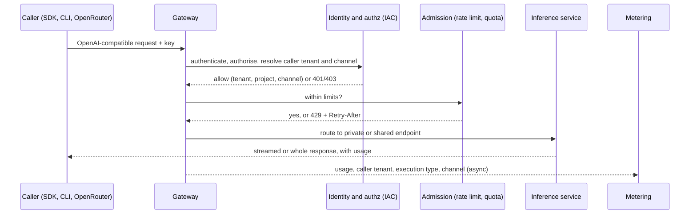

# Inference Access & Distribution — PRD

| Field | Value |
|:--|:--|
| Version | v0.2 |
| Status | Draft |
| Owner | rackai-product |
| Reviewers | Product owner; Platform engineering (gateway, authservice, metering); Commercial (billing, pricing); Security (compliance declarations); OpenRouter initiative owners (Ajay, Imran, Erik) |
| Product review | **Product-owner review disposition, 2026-10-10: conditional acceptance; not formal artifact approval.** PD-1 to PD-7 and PD-9 approved in principle (PD-6 kept conditional). PD-8 (exposure limit and automatic suspension) and PD-10 (economic decision framework) revised in v0.2. The spec's DV-2 was rejected: the shared endpoint is now not offered without E's technical cache check. Identity roles corrected (§6) |
| Product approval | not yet approved |
| Date | 2026-10-10 |
| Roadmap items | GLM 5.3 Flash deployment + OpenRouter Path A; OpenRouter: Inference aaS in OpenRouter; OpenRouter: BYOM in OpenRouter; Inference as a Service (direct) |
| Tech spec(s) | [[Inference Access & Distribution Tech Spec]] (v0.2 draft, not yet approved) |

> **Artifact type: Product Requirements Document.** This PRD projects from [[Sovereignty Levels]] (Level 0, Shared), [[API Key]], [[OpenRouter Private Model Integration]], [[OpenRouter Provider Integration]], [[Model Catalog Endpoint]] and [[Billing & Payment]]. It must not redefine them. If they disagree, the canonical notes win and this PRD is stale.
>
> **Status banner.** *Draft PRD for a partly built initiative.* The per-deployment OpenAI-compatible endpoint, API keys and inference metering are built (`derived`, §2). Shared multi-tenant endpoints, model listing, OpenRouter-conformant errors and rate limiting, BYOM exposure and billing are not. Requirements are intent, not commitments. Nothing here is approved.
>
> **Scope line (read first).** This PRD owns **the access surfaces for Level 0 inference**: the one request contract every caller uses, how the direct RackAI API, OpenRouter (private and public) and BYOM expose models through it, and the behaviours a distribution channel judges us on (errors, overload, listing, honest declarations). It does **not** own: the inference service itself (runtimes, routing and llm-d: row *M2: Inference routing*, [[RackAI Platform PRD]] §12); identity, API keys and RBAC (IAC spec); metering and quota (Metering spec); billing, pricing and payout ([[Billing & Payment]]; commercial, with B for unit economics); model onboarding and validation (**F**); Level 1 private inference and what any level guarantees technically (**E**); placement (**A**); the customer evidence report (**D**).

## 1. Summary / Vision

Customers reach RackAI inference through more than one door: the RackAI API and console, OpenRouter, and in future their own models. This PRD makes those doors **one product**. Every surface calls the same OpenAI-compatible contract, authenticates with the same RackAI identity, is metered the same way and fails the same way. OpenRouter is a client of that contract, never a second stack.

Why now: row 15 is in build for MOE-0 (GLM 5.3 Flash through OpenRouter Path A). Rows 76–78 are committed or pending decision. If each lands on its own, RackAI ends up with OpenRouter and direct inference as two loosely related products, with different credentials, metering and error behaviour.

## 2. Problem Statement

**What exists today** (read-only survey, `RSS-Engineering/rackai@79ca4de`; `derived`):

- **One endpoint per tenant deployment.** Inference is reached at `/apis/rackai.rackspace.com/v1alpha1/namespaces/<ns>/inference/<model>/v1/chat/completions` (and `/v1/completions`), authorised as `workload:execute` in that namespace (`rackai@79ca4de:internal/authz/routemap.go`, inference routes). The front proxy rewrites it to the KServe/llm-d route (`charts/rackai-frontproxy/templates/configmap-envoy.yaml`, Stage 4). There are no other inference routes: no `/v1/models`, no embeddings.
- **API keys are built.** `rkai_` keys, HMAC-hashed with a versioned platform secret, scoped to a tenant and optionally a project, with expiry and revocation, minted through a hosted endpoint that is on by default (`api/v1alpha1/apikey_types.go`, `internal/authservice/apikey.go`, `apikey_mint.go`). The console has no API-key page (`rackai-ui@89bddb4`: no API-key code under `src/`). The user guide shows bearer tokens from `rackaictl auth token`, not API keys (`rackai-docs@ccb52a3:docs/user/guides/rackai-user-guide.md`).
- **Inference metering is built, and assumes no sharing.** An Envoy ext_proc captures usage, including from streamed responses (the gateway injects `include_usage`). It stamps every event `executionType: tenant-specific`, because "nothing in M1" serves one instance to several tenants (`internal/meteringextproc/config.go`). It deliberately **skips** any request whose path namespace differs from the caller's verified tenant (`processor.go`, `path_tenant_mismatch`). Latency, queue and compute seconds are written as zero. Capture fails open, so a metering outage never breaks inference; authorisation fails closed (`configmap-envoy.yaml`, `failure_mode_allow`).
- **No shared endpoint exists.** A caller can reach only models in its own tenant namespace. A RackAI-operated model serving many tenants would be refused by authorisation and, if it were let through, left unmetered by the rule above.
- **No overload or error contract.** The gateway has no rate limiting and no 429 on the inference path. Errors are whatever the authservice or the runtime returns. OpenRouter scores uptime by error code ([[OpenRouter Integration Plan]], provider requirements).
- **No billing.** Metering ≠ billing. The billing-account join is proposed, not built ([[Billing & Payment]]). OpenRouter's public-provider onboarding requires automated payment, a P0 gate.
- **No OpenRouter code**, and the seeded catalog holds one model (`internal/bootstrap`). GLM and OpenRouter registration are operator work today.

**Why it matters.** The [[OpenRouter Initiative]] is meant to be a proving ground subordinate to the operator identity ([[RackAI Roadmap]], Cross-Cutting Surfaces). It can only feed the operating loop (telemetry, onboarding reps, price/performance) if its traffic runs through the same contract, metering and identity as every other customer. **Hypothesis** (no evidence yet): one shared Level 0 endpoint per popular model, sold through OpenRouter and directly, uses idle capacity at a price above cost.

## 3. Product Principles

1. **One contract, many doors.** Every surface uses the same request contract, identity, metering and errors. A behaviour OpenRouter needs is built once and every caller gets it.
2. **OpenRouter is subordinate.** It is a distribution channel and a test bench, not the product. Nothing is built only for OpenRouter that a direct customer could not use.
3. **Consume the platform; don't re-specify it.** Identity, metering, quota, model availability and the serving stack belong to their owners. This PRD states what access needs from them.
4. **Say what is true.** Level 0 is labelled Level 0. A compliance flag, datacenter or price is declared only with a recorded review. Usage is attributed to the scope the request's authority came from.
5. **No unmetered, unattributed traffic.** A request that executes is attributed to its caller. Loss is detected, never silent.
6. **Fail clearly.** Overload returns a fast 429 with a retry hint, not a timeout. Authentication failures fail closed.

## 4. Scope: Goals & Non-Goals

**Goals**
- Any authorised caller, on any surface, reaches a Level 0 model through one documented OpenAI-compatible contract.
- RackAI can run a **shared endpoint**: one RackAI-operated deployment serving many tenants, each attributed and isolated at the serving layer.
- A tenant's own deployment, or its own model, can be exposed to OpenRouter as a private model with RackAI credentials and no RackAI billing.
- A RackAI shared endpoint meets OpenRouter's provider conformance, so public listing waits only on billing and price.
- The direct-IaaS decision (row 78) can be taken with evidence, without rebuilding anything either way.

**Non-Goals / Out of Scope**
- The serving stack, runtimes, routing and KV-cache design (row *M2: Inference routing*, RACKAI-311). This PRD requires a per-tenant cache boundary (FR-12); it does not design it.
- Billing, rating, invoicing and payout ([[Billing & Payment]]). This PRD depends on them (D-2) and does not build them.
- Price setting and unit economics: **B** supplies cost per token, and commercial sets price (D-3).
- Model intake, validation, benchmarking and retirement: **F**. BYOM uses F's onboarding (PD-5).
- Level 1 (dedicated) private inference and its proof: **E** (row 42). The surfaces here may front a Level 1 deployment, but E defines what that guarantees.
- The customer observability product and evidence report: **D**.
- Self-service public sign-up and payment collection for direct customers. Out of scope unless D-1 decides otherwise.

## 5. Users & Personas

| Persona | Side | Needs from I |
|---|---|---|
| **Developer / application owner** (RackAI customer) | Customer | Call a model with a key and a standard SDK; get clear errors; know what level and price they are on |
| **Customer admin** | Customer | Issue, scope and revoke keys per project and channel; see usage per channel |
| **OpenRouter user** (private or public) | Customer via channel | A conformant, fast, honest endpoint; never sees RackAI internals |
| **OpenRouter** (the platform) | Channel | Conformant API, `/models` catalog, accurate errors, automated payment (public path) |
| **RackAI operator** | RackAI | List and unlist shared endpoints; register private models; see per-channel traffic and errors |
| **RackAI product, finance** (with **B**) | RackAI | Per-channel usage and execution type, to price and judge the bet |

## 6. Core Entities

| Entity | Role here |
|---|---|
| [[Sovereignty Levels]] | Every surface in this PRD serves **Level 0 (Shared)**. Its residual-risk statement is what customers are told |
| [[API Key]] | The credential every programmatic surface uses (built, IAC M1–M2) |
| [[Model Deployment]] | The serving unit behind every endpoint, private or shared |
| [[Workload Declaration]] | The contract a shared endpoint's deployment is realised from, when placement is declaration-managed (A) |
| [[OpenRouter Private Model Integration]] | Path A: a tenant deployment exposed to approved OpenRouter users |
| [[OpenRouter Provider Integration]] | Path B: RackAI as a public provider on OpenRouter |
| [[Model Catalog Endpoint]] | The OpenRouter-schema `/models` catalog (P0 for Path B) |
| [[Billing & Payment]] | The missing capability that gates Path B (metering ≠ billing) |
| [[Authority Context]] | C's structure for who is acting, for which customer, in which scope. I consumes it for attribution and never reconstructs it |

**Defined here, not yet canonical** (only I uses them; they move to a canonical note when a second PRD consumes them):
- **Access surface**: a door through which callers reach inference: the direct API (with CLI and console), OpenRouter private, OpenRouter public.
- **Access contract**: what every surface shares: request and response shape, streaming and usage, authentication, error and overload semantics, model listing.
- **Private endpoint**: a tenant's own deployment, callable only by that tenant's credentials (including keys it hands to OpenRouter). Metered `tenant-specific`. Level 0 when its GPUs are shared.
- **Shared endpoint**: a RackAI-operated deployment of a model that callers from many tenants reach, each under their own tenant. Metered `shared`. Always Level 0.
- **Listing**: RackAI's decision to offer a shared endpoint on a surface (direct, OpenRouter public), with its price and declared attributes.
- **Unreconciled exposure**: on a paid surface, the value at list price of executed requests that are not yet matched to a reconciled usage record. It covers missing records and records not yet agreed with the counterparty.

**Three roles, kept apart (document correction, v0.2).** Every surface uses the same identity contract. But the party that pays, the principal that calls and the scope usage is attributed to are different things, and on the public path they differ:

| Surface | Commercial account (who pays RackAI, or no one) | Authenticated execution principal ([[Authority Context]] acting principal) | Ultimate attribution scope (Authority Context tenant scope and authority principal) |
|---|---|---|---|
| Direct API, console, CLI | The customer's CustomerOrg billing account (the proposed RCN link, [[Billing & Payment]]) | The customer's user or API key | The caller's own Organization and project |
| OpenRouter private (Path A) | None at RackAI: OpenRouter bills the tenant's own OpenRouter account | The tenant's API key, held by OpenRouter for that tenant | The tenant's Organization and project |
| OpenRouter public (Path B) | OpenRouter, under the provider agreement (D-2) | A key of the RackAI-held **channel tenant** (D-8), presented by OpenRouter | The channel tenant. OpenRouter's end users are not known to RackAI and are never attributed |

The channel tenant is a RackAI customer scope used to carry public traffic. It is not an authority over any other tenant. No public-path call is ever attributed to a direct customer's scope, or the reverse.

## 7. User Journeys / Scenarios

**Worked example — Path A, private (row 15).** A tenant runs GLM 5.3 Flash as its own deployment. Its admin mints a project-scoped API key labelled for OpenRouter, with an expiry. The tenant registers its endpoint URL and key as an OpenRouter private model (OpenRouter Enterprise plan; usage bills to the tenant's own OpenRouter account). An approved OpenRouter user sends a streaming chat request. OpenRouter calls RackAI with the key. RackAI authenticates and authorises it, serves it, meters it to the tenant and project as `tenant-specific` from the `openrouter-private` channel, and returns OpenAI-conformant chunks with a usage block. When the admin revokes the key, OpenRouter's next call gets 401 and traffic stops.

**Worked example — shared endpoint, public (row 77).** RackAI operates GLM 5.3 Flash as a shared endpoint and lists it on OpenRouter with a price. OpenRouter presents a key of the RackAI-held channel tenant: that key is the execution principal, and the channel tenant is the attribution scope. OpenRouter is the commercial account, settling under the provider agreement (D-2) (§6). A burst exceeds the endpoint's admission limit. The extra requests get 429 with `Retry-After` immediately, which OpenRouter does not count against uptime. Requests from a second tenant calling the same endpoint directly (if D-1 allows it) are metered to that tenant, never to RackAI's channel tenant. Neither tenant's prompts can warm the other's cache.

**Lifecycle (request path, all surfaces).**

## 8. Functional Requirements

**Access contract (every surface)**

| # | Requirement | Priority | Notes |
|---|-------------|:--------:|-------|
| FR-1 | Every surface serves the same OpenAI-compatible contract: chat completions and completions, streamed (SSE, tokens emitted as generated) and whole, with a token-usage block on both | MUST | Built for private endpoints; conformance not yet recorded as validated |
| FR-2 | Every request is authenticated with a RackAI identity (API key or user token) and authorised to execute; no surface has its own credential type | MUST | Consumes IAC |
| FR-3 | Every executed request is metered to its **attribution scope**: the tenant scope and authority principal of the request's [[Authority Context]] (§6), with model, execution type and channel. No surface bypasses metering | MUST | Consumes the Metering spec and C |
| FR-4 | Execution type is recorded per endpoint: `shared` for shared endpoints, `tenant-specific` for private ones. A request is never recorded as `shared` by default | MUST | Pricing dimension; under-pricing risk |
| FR-5 | Errors follow one documented contract: OpenAI-style error bodies; 401/403 for authentication and authorisation; 400/413 for bad requests; 404 for an unknown model; 429 with a retry hint for overload; 5xx only for real server faults | MUST | OpenRouter scores uptime by code |
| FR-6 | Overload is refused early: requests beyond an endpoint's or caller's admission limit get 429 with `Retry-After` before they queue, not a timeout | MUST (shared endpoints); SHOULD (private) | Limits come from quota once it exists (D-5) |
| FR-7 | A caller can list the models it may call, in the OpenAI `/v1/models` shape. Shared endpoints appear only for serving configurations F marks *offered*; a tenant's own deployments appear with F's label (e.g. *customer-managed, not RackAI-qualified*) | MUST (Phase 1) | Today there is no listing. Availability is F's, per serving configuration (F PD-4) |
| FR-8 | Each request's channel (`direct`, `openrouter-private`, `openrouter-public`) is recorded with its usage, derived from the credential, never from a caller-supplied header | SHOULD | Feeds B and the kill criterion |

**Private endpoints and OpenRouter Path A (row 15)**

| # | Requirement | Priority | Notes |
|---|-------------|:--------:|-------|
| FR-9 | A tenant admin can expose one of the tenant's deployments to OpenRouter as a private model, using a project-scoped, expiring API key labelled for that channel, following published docs | MUST | Keys built; docs and channel label not |
| FR-10 | Revoking the key or retiring the deployment stops OpenRouter traffic on the next request (401 or 404), and the operator runbook covers deregistration | MUST | |

**Shared endpoints and OpenRouter public listing (row 77)**

| # | Requirement | Priority | Notes |
|---|-------------|:--------:|-------|
| FR-11 | RackAI can operate a shared endpoint: a RackAI-owned deployment that authorised callers from any tenant reach under their own identity, with usage attributed per FR-3 | MUST | New; not possible today (§2) |
| FR-12 | A shared endpoint is offered only when its serving path is **technically verified** to isolate or disable shared cache behaviour: E's boundary status for rule B-2 is `held`, shown by the condition `BoundaryCacheIsolated=True` ([[Sovereign Isolation & Assurance Tech Spec]] §4.6). If that cannot be established, the shared endpoint is **not offered**. An operator attestation may document evidence but never enables a listing | MUST | [[Sovereignty Levels]]; [[GPU Co-Tenancy Risk]]; revised v0.2 (DV-2 rejected) |
| FR-13 | A shared endpoint is presented as Level 0 (Shared) on every surface, with the residual risk stated, and is never described as dedicated or private | MUST | |
| FR-14 | RackAI publishes the OpenRouter-schema catalog for listed shared endpoints: price, context length, quantization, declared datacenter and compliance flags, sourced from the listing. Only attributes with a recorded review are declared | MUST (before public listing) | [[Model Catalog Endpoint]] |
| FR-15 | A shared endpoint is listed publicly on OpenRouter only when: conformance (FR-1, FR-5, FR-6) is recorded as passed on it, it has a price, and the billing and payout gate (D-2) is met | MUST | Gates G2–G4 in [[OpenRouter Integration Plan]] |
| FR-16 | An operator can list, reprice and unlist a shared endpoint per surface. Unlisting stops new traffic from that surface without affecting others | MUST | |
| FR-22 | Each paid surface has a **maximum unreconciled exposure**, set by its commercial owner (D-10). When unreconciled exposure exceeds it, **new paid admission on that surface is suspended automatically**; requests already running complete. Admission resumes automatically once reconciliation brings exposure back under the limit. Operators and the commercial owner are alerted, and the suspension and resumption are evidenced | MUST (before any priced traffic) | PD-8; [[Failure Mode Taxonomy]] metering class |

**BYOM (row 76)**

| # | Requirement | Priority | Notes |
|---|-------------|:--------:|-------|
| FR-17 | A customer's own model, registered through F (labelled *customer-managed, not RackAI-qualified*, or qualified for that organisation on request), can be exposed through the private-endpoint path (FR-9), carrying F's label on every surface. I adds no separate onboarding path | MAY (Phase 2) | RACKAI-510; F FR-13, FR-14, PD-9 |
| FR-18 | A customer-supplied model, whether customer-managed or organisation-scoped in F, is never served from a shared endpoint to other tenants | MUST | Enforced from Phase 1 |

**Direct inference as a service (row 78)**

| # | Requirement | Priority | Notes |
|---|-------------|:--------:|-------|
| FR-19 | If D-1 approves direct IaaS: RackAI customers can call listed shared endpoints with their own keys through the same contract, and the console shows the listed models, their level and price | MAY (Phase 2, conditional on D-1) | No new contract either way (PD-6) |

**Visibility and evidence**

| # | Requirement | Priority | Notes |
|---|-------------|:--------:|-------|
| FR-20 | A customer can see its usage split by channel and execution type through the existing usage API | SHOULD | D owns the report |
| FR-21 | Listing changes (listed, repriced, unlisted) and recorded conformance runs emit an audit event and an evidence record in the D-0 envelope | SHOULD | Kinds in §11 |

## 9. Non-Functional Requirements

- **Tenancy.** No caller can read another tenant's prompts, completions, usage or cache state. On a shared endpoint, attribution is to the request's Authority Context scope, never taken from the request path or headers.
- **Authentication fails closed.** If identity or authorisation is unavailable, no request executes.
- **Metering completeness.** Metering capture may fail open for availability (as built), but only within the maximum unreconciled exposure. Every gap is counted, and exceeding the limit suspends new paid admission (FR-22, PD-8).
- **No content retention.** Prompts and completions are not stored or logged by the access layer. A zero-data-retention flag is declared only after security confirms it (D-6).
- **Availability posture.** Shared endpoints aim for OpenRouter's normal-routing tier. OpenRouter publishes ≥95% uptime for normal routing, computed after 100+ requests (`measured`, OpenRouter provider docs via [[OpenRouter Integration Plan]]). RackAI has no measured baseline.
- **Latency.** The access layer adds no material time-to-first-token. The bound is a target posture for the spec to set and measure; no baseline today.
- **Compatibility.** Existing endpoint URLs, tokens and keys keep working.

## 10. Platform Integration

| System | Needs from it | Provides to it |
|---|---|---|
| Identity & access (IAC, C) | API keys (built). *Consumer requirement / requested interface change to IAC:* a channel label on keys, and authorisation for callers of a shared endpoint outside its namespace. From C: the [[Authority Context]] for each request (acting principal, authority principal, tenant scope) | Channel-labelled keys; a new route class to authorise |
| Tenancy & isolation | Tenant and project scope; from E, `BoundaryCacheIsolated` (FR-12) and the shared-namespace ingress fence | Attribution of shared-endpoint use to its Authority Context scope |
| Metering, quotas & billing | Inference capture (built). *Consumer requirement / requested interface change to the Metering spec:* `shared` execution type and channel per event, and a loss count for the exposure limit (FR-22). Quota for admission limits (Metering M3/M4, D-5); billing and payout (not built, D-2) | Per-channel, per-execution-type usage; unreconciled exposure; the demand case for billing |
| Audit | Audit pipeline (Auditability spec) | Listing-change events (FR-21) |
| Monitoring & observability | Gateway and runtime metrics | Per-surface request, error-code, 429 and metering-gap metrics |

## 11. Loop Role & Cross-PRD Interfaces

**Loop role:** *Deliver the how*, for how customers reach shared inference. It serves the **operator** promise (run models well and sell them through every door), and it feeds the loop: channel telemetry goes to G, usage and price go to B, onboarding reps go to F.

| Interface | Direction | Other PRD / spec | Defined where |
|---|---|---|---|
| Identity, API keys, authorisation | consumes | IAC (engineering) | [[Identity and Access Control Spec]] |
| Authority Context (who acts, for whom, in which scope) | consumes | C | [[Authority Context]] |
| Usage capture, execution type, quota | consumes | Metering (engineering) | [[Multi-Tenancy and Metering Spec]] |
| Model availability per serving configuration (*offered*, not qualified, deprecated, withdrawn; *customer-managed* label) | consumes | F | [[Model Lifecycle PRD]] (FR-10, FR-14, PD-4, PD-9) |
| Workload declaration for shared-endpoint deployments | consumes | A | [[Workload Declaration]] |
| Level 0 boundary rules: `BoundaryCacheIsolated`, shared-namespace fence | consumes | E | [[Sovereign Isolation & Assurance Tech Spec]] §4.5, §4.6 |
| Cost per token (price floor) | consumes | B | [[Operator Economics & KPI Instrumentation PRD]] |
| Per-channel usage and execution type | provides | B, D | Metering records (this PRD adds the fields) |
| Evidence records: `distribution-listing`, `conformance` | provides | D | D-0 envelope ([[Customer Observability & Evidence Report PRD]]) |
| Request telemetry per channel | provides | G | [[Empirical Map & Evidence-Informed Routing PRD]] |

## 12. Failure Handling

Classes and responses follow the [[Failure Mode Taxonomy]] (revised v0.2).

| Failure | Class | Response | What continues / stops / degrades | Who is told, how | Exposure limit |
|---|---|---|---|---|---|
| Identity or authorisation unavailable | Authority | **Fail closed** | Nothing new executes (401/503); running streams finish | Caller (error); operator (alert) | none: no unauthenticated execution |
| Endpoint or caller over its admission limit | Admission | **Fail closed** for the excess | Excess requests get 429 + `Retry-After` at once; others continue | Caller (429) | n/a |
| Cache isolation not shown for a shared endpoint (`BoundaryCacheIsolated` not `True`) | Admission | **Not offered** | The shared endpoint is excluded from every surface; private endpoints unaffected | Operator (listing condition, alert) | n/a |
| Cache isolation lost on a listed shared endpoint | Execution | **Quarantine** | The endpoint is unlisted from every surface: no new traffic, running requests finish | Operator (alert); channel (catalog no longer ready) | n/a |
| Model not ready, retired, or no longer offered by F | Admission | **Fail closed** / **not offered** | 404 or 503 + `Retry-After`; never a hung connection | Caller (error) | n/a |
| Metering capture down | Metering | **Fail open** within the limit | Inference continues; the gap is counted as unreconciled exposure. Past the limit, **new paid admission is suspended** (FR-22); private and unpriced traffic continues | Operator and commercial owner (alert); evidence record | Maximum unreconciled exposure per paid surface (D-10) |
| Reconciliation with the counterparty fails or lags | Metering | as above | Unmatched usage stays in unreconciled exposure; the same limit applies | Operator and commercial owner | as above |
| Listing or conformance evidence cannot be written | Evidence | Listing changes **wait** (fail closed); unlisting and suspension **proceed**, back-filled and flagged | — | Operator | n/a |
| Billing not available | Admission | **Fail closed** for public listing | Public listing stays off (FR-15); private endpoints unaffected | Operator | n/a |

**Guaranteed never to happen:** a request executed without authentication; a call attributed outside its Authority Context scope; one tenant's cache serving another; a compliance flag declared without a recorded review; priced traffic admitted past the exposure limit.

## 13. Data Retention & Compliance

The access layer holds no prompts or completions. It produces usage records (Metering retention, default 365 days per the Metering spec), API-key metadata (IAC), audit events for listing changes (audit retention) and evidence records (D). Declarations made to OpenRouter (compliance flags, datacenter) are statements RackAI must be able to evidence; security owns which can be made (D-6).

## 14. Scope & Phasing

| Phase | Gate | Delivers | Roadmap items |
|---|---|---|---|
| **Context** (in build) | MOE-0 | GLM 5.3 Flash served and reached through OpenRouter Path A, as planned in [[Phase 1 Execution Plan — GLM 5.3 Flash Proof Point]] and [[OpenRouter Integration Plan]] Phase 1. This PRD adds the access requirements it must meet (FR-1 to FR-5, FR-9, FR-10) and does not repeat the plan | GLM 5.3 Flash deployment + OpenRouter Path A |
| **1** | Not gated | Shared endpoints (FR-11 to FR-13), conformance and overload (FR-5, FR-6), model listing (FR-7), channel attribution (FR-8), OpenRouter catalog and listing control (FR-14 to FR-16), evidence (FR-20, FR-21). Public listing switches on only when D-2 and the price gate are met (FR-15) | OpenRouter: Inference aaS in OpenRouter |
| **2** | Not gated | BYOM through the private path (FR-17, FR-18), once F's onboarding exists | OpenRouter: BYOM in OpenRouter |
| **2, conditional** | D-1 | Direct IaaS for RackAI customers (FR-19), if approved | Inference as a Service (direct) |

**Release blockers** ([[Release Readiness States]]; milestones and states in the spec §13):
- Shared endpoint (Phase 1), any surface: `blocked-by: E (Sovereign Isolation & Assurance) M3 BoundaryCacheIsolated`. E's M3 is a **release blocker**: until it ships, no shared endpoint is offered (revised v0.2).
- Shared namespace fence: `blocked-by: E M2 shared-endpoint ingress fence`.
- Shared listings: `blocked-by: F ModelOffering (offered configurations)`.
- Attribution on the shared route: `blocked-by: C Authority Context` (consumed as given; until then the IAC identity headers map onto it, spec §4.4).
- Public listing: `blocked-by: product decision D-2 (billing)` and `blocked-by: D-10 (exposure limit set)`.

Sequencing note: run Path A first and record its conformance results; they decide how much of Phase 1's conformance work is new.

## 15. Acceptance Criteria & Success Metrics

**Acceptance criteria** (each pass/fail; proposed, not approved; revised v0.2 with an evidence source and a gate for each, per [[Release Readiness States]]; milestones M0 to M3 are the spec's):

| # | Criterion: expected result | Verifies | Evidence source | Gate |
|---|---|---|---|---|
| AC-1 | A standard OpenAI SDK, pointed at a private endpoint and at a shared endpoint, completes streamed and whole chat and completion requests; each response carries a usage block whose token counts equal the metered record | FR-1, FR-3 | `ConformanceRecord` (suite run) plus a `usage_records` comparison | M0 (private), M1 (shared): acceptance proven |
| AC-2 | A request with no credential, a revoked key or an expired key is refused 401, and is neither executed nor metered; a key without execute permission is refused 403 | FR-2, FR-10 | API test results in CI; absence check in `usage_records` | M0: acceptance proven |
| AC-3 | Two tenants call one shared endpoint; each tenant's usage shows only its own calls, attributed to its Authority Context scope, with `executionType=shared`; channel-tenant traffic appears only under the channel tenant; private calls show `tenant-specific`; no record is `shared` unless it came from a shared endpoint | FR-3, FR-4, FR-11 | E2E test plus a usage query | M1: acceptance proven |
| AC-4 | For each error class in FR-5 (bad request, too large, unknown model, unauthorised, overload, server fault) the response has the documented code and an OpenAI-style error body | FR-5 | `ConformanceRecord` error items | M0: acceptance proven |
| AC-5 | Beyond its admission limit, a shared endpoint answers 429 with `Retry-After` without contacting the runtime | FR-6 | Load-test report plus proxy metrics | M2: acceptance proven |
| AC-6 | `GET /v1/models` returns exactly the models the caller may call: its own deployments with F's labels, and shared listings only while F offers their configuration | FR-7 | Two-tenant API test | M2: acceptance proven |
| AC-7 | Usage from an OpenRouter-labelled key is recorded with its channel; a caller-supplied channel header is ignored | FR-8 | Forged-header E2E test plus a usage query | M1: acceptance proven |
| AC-8 | Following only the published docs, a tenant registers a private endpoint with OpenRouter and serves a request; revoking the key stops the next request | FR-9, FR-10 | Rehearsal record on the MOE-0 estate | M0: customer available at MOE-0 |
| AC-9 | (a) A shared endpoint whose `BoundaryCacheIsolated` is not `True` cannot be listed on any surface, and an attestation does not change that. (b) With a listed shared endpoint serving two tenants, a request from tenant B with tenant A's prompt prefix gets no cached tokens from A's requests | FR-12 | (a) listing-control API test; (b) cross-tenant probe results (cached-token count and timing), plus E's `boundary-held` record for B-2 | M2: acceptance proven; **release blocker** for the shared endpoint's customer availability |
| AC-10 | The OpenRouter catalog for a listed endpoint validates against OpenRouter's schema, and every declared compliance flag and datacenter cites a review record | FR-14 | Schema test plus review records (security) | M2: acceptance proven; before public listing |
| AC-11 | A shared endpoint cannot be publicly listed on OpenRouter while its conformance record is missing or failed, it has no price, the billing gate is unset, or no exposure limit is set | FR-15, FR-16, FR-22 | Listing-control API test | M2: acceptance proven |
| AC-12 | Unlisting from one surface stops new traffic from it (404) while the other surfaces keep serving | FR-16 | Per-surface E2E test | M2: acceptance proven |
| AC-13 | Every surface shows a shared endpoint as Level 0 (Shared) with its residual-risk text | FR-13 | API field check; console and docs review record | M2 (API), M3 (console, docs): customer available |
| AC-14 | Listing changes, conformance runs, suspensions and resumptions produce audit events and evidence records that validate against the D-0 envelope, plus a daily `coverage` record reconciled to the listing controller's state | FR-21, FR-22 | Evidence schema test; D's coverage results | M2: acceptance proven |
| AC-15 | When injected unreconciled exposure on a paid surface exceeds its limit, new paid requests on that surface are refused within one evaluation interval, running requests complete, unpriced traffic continues, the commercial owner and operator are alerted, and admission resumes automatically after reconciliation brings exposure under the limit | FR-22 | Fault-injection test (metering down; reconciliation lagging) plus alert and evidence records | M2: acceptance proven; before any priced traffic |

AC-16 and later, for BYOM and direct IaaS, are written when Phase 2 is scoped (FR-17 to FR-19).

**Success metrics** (ladder; baselines are "none today"; targets are postures to instrument):

1. **Conformance:** OpenRouter P0 conformance items recorded as passed (streaming, usage, error codes, 429). Baseline: none recorded.
2. **Reliability as judged by the channel:** OpenRouter uptime tier for each listed endpoint.
3. **Use:** tokens served per surface and per execution type.
4. **Integrity:** share of executed requests with a usage record; unreconciled exposure against its limit; suspensions; misattributed records (must be zero).
5. **Economics (with B):** realised price per token versus B's cost per token on shared endpoints.
6. **Loop value:** models whose scorecard has `measured` entries from channel traffic ([[GLM 5.3 Flash Scorecard]] first).

## 16. Dependencies

- **IAC:** API keys and authorisation (built); a channel label and a shared-endpoint route class (new).
- **Metering:** inference capture (built); `shared` execution type, channel field and loss counting (new); quota for admission limits (Metering M3/M4).
- **Billing & Payment:** automated payment for the public path. Not built, not funded (D-2).
- **E:** Level 0 serving-layer controls, including the per-tenant cache boundary.
- **F:** model availability; BYOM onboarding (Phase 2).
- **B:** cost per token, to price above cost (D-3).
- **A:** shared-endpoint deployments realised from declarations, once A ships. Until then they are operator-created.
- **Serving stack (row 19, RACKAI-311):** per-tenant KV and prefix cache scoping.
- **Depended on by:** D (evidence records), B (per-channel usage), G (channel telemetry).

## 17. Risks & Mitigations

| Risk | Mitigation |
|---|---|
| OpenRouter becomes its own product strategy | Principle 2 and PD-1: no OpenRouter-only stack; every conformance item helps direct callers too |
| Price routes first and our cost per token can't compete | The listing needs a price above B's floor (D-3); kill criterion §18 |
| Shared endpoints leak across tenants through the cache | FR-12 needs E's technical check (`BoundaryCacheIsolated=True`); without it the endpoint is not offered. Tested by AC-9; loss of the control unlists it |
| Billing never gets funded, so Phase 1 work sits idle | Phase 1 also serves direct callers and Path A; public listing is the only part billing gates |
| Unmetered traffic on a priced channel | A maximum unreconciled exposure with automatic suspension of paid admission (FR-22, PD-8) |
| Over-claiming compliance to win routing | FR-14 and D-6: declare only what security has reviewed |
| SPOT capacity can't hold the uptime tier | Open in [[OpenRouter Integration Plan]]; tracked as D-7 |

## 18. Kill / Falsification Criterion

The bet is that **one access contract can sell idle Level 0 capacity through OpenRouter and directly, at a price above cost, without a second stack.**

**Falsified if** either holds:
1. **Economics.** A public listing's kill threshold, below, ends in *breach*, and the product review that follows confirms it.
2. **Subordination.** Keeping the OpenRouter surface conformant needs behaviour the direct contract would not otherwise have, so the two surfaces diverge into separate stacks.

**Kill threshold (revised v0.2).** This reuses B's six-field kill-threshold framework ([[Operator Economics & KPI Instrumentation PRD]] §18.1). A threshold with any field missing is not armed. One threshold record is kept per public listing:

| Field | I's value |
|---|---|
| Metric | The listed endpoint's share of OpenRouter routed traffic for its model, at a realised price at or above B's cost per token for its serving configuration ([[Unit Economics Model]]) |
| Measurement window | Set at listing time. It is at least OpenRouter's evaluation threshold (uptime is computed after 100+ requests, `measured`, OpenRouter docs) plus one full pricing review with B |
| Minimum data coverage | OpenRouter usage reports and RackAI usage records reconciled for the whole window, with unreconciled exposure within its limit (FR-22). Below that, the result is *insufficient data* |
| Confidence requirement | Share and price `measured` (OpenRouter reports, usage records); cost `derived` or better (B) |
| Threshold | "No meaningful routed share at any price at or above cost", with the share set by the listing's named commercial owner. No default value (PD-10) |
| Action | An explicit **product review**: a record with owner, evidence and due date. Its outcomes are continue, reprice (only at or above cost), unlist public (keep Path A), or stop the channel. A breach never stops, reprices or unlists anything automatically |

The possible results are *within threshold*, *breach → product review*, or *insufficient data* (reported to the owner). The exposure suspension in FR-22 is an admission control, not a kill action.

**Evidence:** per-channel usage (FR-8), realised price versus cost (B), OpenRouter uptime tier, and the conformance, listing and review records (FR-21).

**If falsified:** unlist public shared endpoints, keep Path A (private, with no billing dependency) for telemetry and onboarding reps, and take the result into D-1.

## 19. Open Decisions

| # | Decision | Owner | Blocks |
|---|----------|-------|--------|
| D-1 | **Row 78: direct inference as a service.** Should listed shared endpoints be a direct `rackai.rax.io` feature for RackAI customers, or stay an OpenRouter-only proving surface? Options: (a) OpenRouter-only; (b) direct for existing RackAI customers under their contracts, no self-service sign-up; (c) public self-service with payment. Evidence to decide on: Phase 1 per-channel use and price versus cost (§15 metrics 3 and 5), billing state (D-2), and whether existing customers ask for shared endpoints | Product owner | FR-19; row 78 |
| D-2 | Billing and payout for the OpenRouter public path: who owns and funds it, and by which mechanism (auto top-up or invoicing). Billing is a declared non-goal of the Metering spec | Product owner, with commercial | FR-15 (public listing) |
| D-3 | Pricing of shared endpoints: per-token price, the price gap between `shared` and `tenant-specific`, and who approves price changes | Commercial, with B | FR-14, FR-16 |
| D-4 | Row 15 scope: the roadmap row names Path A (private), while [[Phase 1 Execution Plan — GLM 5.3 Flash Proof Point]] describes GLM live on OpenRouter as a provider (public). Which does MOE-0 need? | Product owner | Row 15 acceptance; §14 Context row |
| D-5 | Admission limits for shared endpoints before quota policy exists: per tenant, per key or per channel, and who sets them | Product owner, with Metering (Rohit) | FR-6 |
| D-6 | Which compliance flags (e.g. zero data retention) and datacenter claims RackAI may declare to OpenRouter | Security, with legal | FR-14 |
| D-7 | Whether SPOT H100 capacity may back a publicly listed shared endpoint | Product owner, with infrastructure | FR-15 |
| D-8 | Which tenant holds RackAI's own OpenRouter channel usage (a RackAI-held channel tenant, or the platform scope) | Product owner, with IAC | FR-3, FR-11 |
| D-9 | **In-process prefix cache on a shared endpoint.** Resolved in reconciliation (2026-10-10): E owns the rule. For a deployment serving several Organizations, E's B-2 holds only with prefix caching disabled until RACKAI-311 provides per-tenant scoping, signalled by `BoundaryCacheIsolated` ([[Sovereign Isolation & Assurance Tech Spec]] §4.6) | E | — (closed; FR-12 consumes E's signal) |
| D-10 | The maximum unreconciled exposure per paid surface, and the reconciliation cadence against the counterparty's usage reports (FR-22) | Commercial, with B and Metering | FR-22; any priced traffic |
| D-11 | Align §18 with B's kill-threshold framework | Product owner, with B | — (closed 2026-10-10: §18 reuses B §18.1) |

## 20. Proposed Product Decisions

None is approved. Each can be accepted, changed or rejected on its own.

| # | Decision | Alternatives considered | Why this one | Status |
|---|---|---|---|---|
| PD-1 | **One access contract.** OpenRouter (private and public), the direct API and BYOM all call the same gateway contract with RackAI credentials. OpenRouter is a client, not a separate provider stack | A dedicated provider gateway for OpenRouter | One identity, metering and error model; principle 2; anything built for OpenRouter helps direct customers | proposed — approved in principle 2026-10-10 (PO review) |
| PD-2 | **Two endpoint shapes at Level 0:** private (a tenant's own deployment, `tenant-specific`) and shared (RackAI-operated, many tenants, `shared`). This PRD covers access to both. Level 1 private inference is E's | Shared endpoints only; keep per-tenant deployments only (as today) | Path A needs private endpoints; rows 77 and 78 need shared ones; the metering spec already has both execution types | proposed — approved in principle 2026-10-10 (PO review) |
| PD-3 | **Usage is attributed to the request's Authority Context scope.** Shared-endpoint calls go to the caller's own Organization and project. Public-path traffic is attributed to the RackAI-held channel tenant (D-8). The commercial account, the execution principal and the attribution scope are recorded separately (§6) | Attribute to the endpoint's owning namespace | Keeps per-customer usage, quota and evidence honest; matches the built rule that attribution comes from identity, not the path | proposed — approved in principle 2026-10-10 (PO review); wording corrected v0.2 (identity roles) |
| PD-4 | **Public listing is gated on billing; this PRD does not build billing.** Phase 1 delivers everything except money movement, and the listing control refuses public listing until D-2 is met | Build a minimal billing path inside I; delay all of row 77 until billing | Metering ≠ billing; billing is commercial scope. Conformance work is useful to direct and Path A callers meanwhile | proposed — approved in principle 2026-10-10 (PO review) |
| PD-5 | **BYOM = F's registration (customer-managed, or qualified on request) + I's private endpoint.** No separate BYOM intake in I; F's label travels with the model; customer models never run on shared endpoints | A BYOM upload path owned by I; BYOM on shared endpoints | One model lifecycle (F, PD-9); a customer's model is the customer's | proposed — approved in principle 2026-10-10 (PO review) |
| PD-6 | **Row 78 is framed, not answered.** The direct API is the substrate in every option, so nothing is rebuilt whichever way D-1 goes. Whether to offer shared endpoints directly, and to whom, stays a product and commercial decision on a shared access contract | Decide row 78 now; design a separate direct IaaS product | The roadmap marks it a pending PM decision; Phase 1 evidence should inform it | proposed — approved in principle 2026-10-10 (PO review), kept conditional |
| PD-7 | **Declare only what is reviewed.** Level 0 is labelled; compliance flags, datacenter and quantization are declared only with a review record | Declare expected or planned attributes to win routing | OpenRouter routes on these flags; a false flag routes traffic we can't lawfully serve | proposed — approved in principle 2026-10-10 (PO review) |
| PD-8 | **Metering may fail open for availability, within an enforced exposure limit.** Capture stays fail-open, as built. Each paid surface has a maximum unreconciled exposure, set by its commercial owner (D-10). Exceeding it automatically suspends new paid admission on that surface until reconciliation brings it back under (FR-22). This is the metering class of the [[Failure Mode Taxonomy]] | Fail closed (no metering, no inference); accept silent loss; a reconciliation check with no automatic enforcement (v0.1) | Keeps availability for OpenRouter's uptime score while bounding unbilled usage on a priced channel | proposed — revise (PO review 2026-10-10): define a maximum unreconciled exposure and automatic suspension. Revised v0.2, pending approval |
| PD-9 | **Overload is refused fast with 429 and `Retry-After`** at the access layer, rather than queued until timeout | Queue and let callers time out; return 503 | OpenRouter does not count 429 against uptime but does count timeouts and 5xx | proposed — approved in principle 2026-10-10 (PO review) |
| PD-10 | **Economic kill thresholds reuse B's framework** ([[Operator Economics & KPI Instrumentation PRD]] §18.1): metric, window, minimum data coverage, confidence requirement, an owner-set threshold, and an explicit product review. A breach never auto-stops anything. The "meaningful share" threshold is set per listing by its commercial owner (§18) | A fixed percentage now; an unstructured per-listing threshold (v0.1) | No baseline exists to set an honest number; one shared framework keeps the decision explicit and auditable across PRDs | proposed — revise (PO review 2026-10-10): align with B's economic decision framework. Revised v0.2, pending approval |

## See Also

- [[Sovereignty Levels]]: Level 0, the offer every surface here serves
- [[OpenRouter Integration Plan]]: the paths, provider requirements and gates this PRD meets
- [[Phase 1 Execution Plan — GLM 5.3 Flash Proof Point]]: the row 15 plan this PRD cites
- [[Billing & Payment]]: the gate on the public path
- [[API Key]], [[OpenRouter Private Model Integration]], [[OpenRouter Provider Integration]], [[Model Catalog Endpoint]]
- [[Inference Access & Distribution Tech Spec]]: the engineering design
- [[PRD Coverage Plan]]: where I sits among the PRDs
