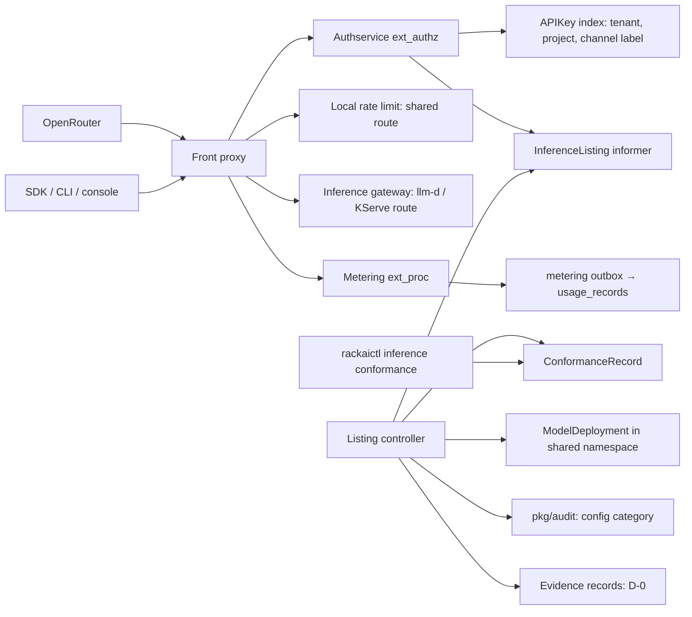
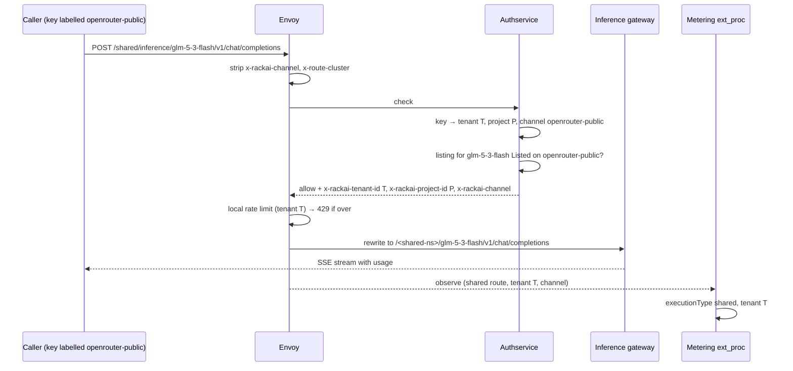

# Inference Access & Distribution — Technical Specification

| Field | Value |
|:--|:--|
| Version | v0.2 |
| Status | Draft |
| Author | Wiki agent for rackai-product (draft for platform engineering) |
| Reviewers | Platform engineering (gateway, authservice, metering); Product owner; UI; Docs; Security |
| Engineering approval | not yet approved |
| Product review | **Product-owner review disposition, 2026-10-10: conditional acceptance; not formal artifact approval.** DV-2 rejected: the attestation fallback is removed; E's M3 (`BoundaryCacheIsolated`) is a release blocker for the shared endpoint, which is not offered without it. v0.2 adds the exposure limit with automatic suspension (PRD FR-22), the Authority Context identity roles, taxonomy failure classes, readiness states and blockers |
| Product approval | not yet approved. Passing checks is not approval |
| Date created | 2026-10-10 |
| Based on PRD(s) | [[Inference Access & Distribution PRD]] (v0.2 draft, not yet approved; spec drafted alongside per product-owner instruction 2026-10-10) |
| Roadmap items | GLM 5.3 Flash deployment + OpenRouter Path A; OpenRouter: Inference aaS in OpenRouter |
| Jira epic(s) | none yet: one epic per milestone (§13) to be created by platform engineering. Row *OpenRouter: BYOM in OpenRouter* carries RACKAI-510 (Phase 2, not designed here) |

> **Artifact type: Technical Specification.** Concepts used here have canonical notes: [[Sovereignty Levels]], [[API Key]], [[Model Deployment]], [[OpenRouter Private Model Integration]], [[OpenRouter Provider Integration]], [[Model Catalog Endpoint]], [[Billing & Payment]]. This spec designs how to build access to them and does not redefine them.
>
> **Status banner.** *Proposed design on top of built code.* The per-deployment endpoint, API keys and inference metering exist; statements about them are `derived` from the read-only survey in §3 and carry AS BUILT markers. Everything else is `assumed`. **Rows named:** this spec designs rows 15 and 77 only. Row 76 (BYOM) needs no access-layer code beyond the private-endpoint path designed here; its work is F's onboarding. Row 78 (direct) is conditional on PRD D-1 and reuses the M1 shared route unchanged. Both are deferred in §1.3 and get a spec revision when scoped.

### 0. Status markers (convention)

- **AS BUILT (YYYY-MM-DD, TICKET):** what exists where it differs from, or underlies, the design.
- **PROPOSED, NOT BUILT (YYYY-MM-DD):** designed here, not implemented.
- **RETAINED FOR THE RECORD:** a rejected or replaced design kept for the decision record.

## 1. Overview

This spec turns the built per-deployment inference endpoint into one **access contract** shared by every surface, and adds **shared endpoints**: RackAI-operated deployments that callers from many tenants reach under their own identity. It adds:
- a shared-endpoint route class in the front proxy and authservice;
- per-request **channel** attribution from a label on the API key;
- `executionType: shared` set from the route, not a global default;
- one error and overload contract (OpenAI-style bodies, early 429);
- model listing (`/v1/models`);
- an `InferenceListing` resource that controls which shared endpoints are offered on which surface, at what price, and with which declared attributes;
- an immutable `ConformanceRecord`;
- the OpenRouter-schema catalog.

The change is **additive**. Existing URLs, tokens, keys and metering rows keep their meaning. No new service is added: routing is in the front proxy, authorisation and listing in the authservice, metering in the existing ext_proc, and the two CRDs are reconciled in the manager.

### 1.1 Goals

- G-1: One documented OpenAI-compatible contract with a conformance suite run against private and shared endpoints (FR-1, FR-5).
- G-2: A shared-endpoint route, authorised and metered to the caller's own tenant (FR-2, FR-3, FR-4, FR-11).
- G-3: Channel attribution from verified credentials (FR-8, FR-9).
- G-4: Early 429 and a stable error mapping on inference routes (FR-5, FR-6).
- G-5: Model listing for callers and the OpenRouter catalog for listed endpoints (FR-7, FR-14).
- G-6: A listing control that refuses public listing until conformance, price, serving controls and the billing gate are all present (FR-12, FR-15, FR-16).
- G-7: Audit and evidence for listing changes and conformance runs (FR-21).

### 1.2 Non-Goals

- **The serving stack:** runtimes, llm-d routing, the inference gateway and KV-cache scoping (row *M2: Inference routing*, RACKAI-311). This spec consumes E's `BoundaryCacheIsolated` condition as a listing precondition (§4.2); E's M3 is a release blocker (§13).
- **Billing, rating and payout:** [[Billing & Payment]]. The listing control reads a billing-gate setting; it does not implement billing (PRD PD-4).
- **Quota policy:** Metering M3/M4. Phase-1 admission limits are gateway rate limits (§4.6, DV-1).
- **Model onboarding and BYOM intake:** F. **Direct IaaS:** conditional on PRD D-1.
- **Placement:** shared-endpoint deployments are created by an operator in Phase 1. When A ships, they come from a [[Workload Declaration]]; this spec does not change.
- **Level 1 private inference:** E (row 42).

### 1.3 Requirements Traceability

All 21 functional requirements of `prd-inference-access-distribution`:

| PRD · req | Spec section(s) | Milestone | Status |
|---|---|---|---|
| FR-1 one OpenAI-compatible contract, streaming and usage | §4.7 (conformance suite), §5 | M0 | covered (built behaviour; conformance recorded at M0) |
| FR-2 RackAI identity, authorised to execute | §5.1, §5.2, §7 | M0 (private), M1 (shared) | covered |
| FR-3 metered to the Authority Context attribution scope, model, execution type, channel | §4.4, §4.5 | M1 | covered |
| FR-4 execution type per endpoint, never defaulted to shared | §4.5 | M1 | covered |
| FR-5 error contract | §5.4 | M0 | covered |
| FR-6 early 429 with `Retry-After` | §4.6 | M2 | covered with DV-1 (per-replica limits until quota exists) |
| FR-7 `/v1/models` listing | §5.3 | M0 (per deployment), M2 (aggregate) | covered (shared entries only for F-*offered* configurations; F labels shown) |
| FR-8 channel recorded from the credential | §4.3, §4.5 | M1 | covered (user tokens are always `direct`, §1.4 note) |
| FR-9 private model on OpenRouter with a channel-labelled key and docs | §4.3, §13 M0 | M0 | covered |
| FR-10 revocation stops traffic; deregistration runbook | §6.2, §13 M0 | M0 | covered (AS BUILT revocation; runbook new) |
| FR-11 shared endpoint | §4.1, §5.1 | M1 | covered |
| FR-12 shared endpoint offered only with technically verified cache isolation | §4.2 (`ServingControlsVerified`), §8 | M2 | covered: gated only on E's `BoundaryCacheIsolated=True` (E spec §4.6). E M3 is a release blocker (§13); no attestation fallback (DV-2 rejected) |
| FR-13 labelled Level 0 everywhere | §5.3, §13 M3 | M2 (API), M3 (console, docs) | covered |
| FR-14 OpenRouter catalog with reviewed attributes only | §4.2, §5.3 | M2 | covered |
| FR-15 public listing gate | §4.2 (`PublicListingAllowed`) | M2 | covered |
| FR-16 list, reprice, unlist per surface | §4.2, §5.2 | M2 | covered |
| FR-17 BYOM through the private path | — | Phase 2 | deferred: no access-layer change needed; depends on F's onboarding |
| FR-18 customer models never on shared endpoints | §4.2 (admission rule, on F's offering labels) | M2 | covered (enforced now, so BYOM inherits it) |
| FR-19 direct IaaS, conditional on D-1 | §5.1 (`direct` surface value exists, refused until enabled) | Phase 2 | deferred (D-1) |
| FR-20 usage split by channel and execution type | §4.5, §5.5 | M1 | covered |
| FR-21 audit and evidence for listing changes and conformance | §4.8 | M2 | covered (I's D-0 kinds `distribution-listing`, `conformance`, plus `coverage`) |
| FR-22 maximum unreconciled exposure; automatic suspension of paid admission | §4.9, §9 | M2 | covered |

**Acceptance criteria → design and test:**

| AC | Designed in | Proven by (§12); evidence source | Milestone | Gate |
|---|---|---|---|---|
| AC-1 | §4.7, §4.5 | Conformance suite on both endpoint kinds, plus a usage-record comparison | M0 (private), M1 (shared) | M0/M1 acceptance proven |
| AC-2 | §5.1, §5.2 | API tests: none, revoked, expired, no permission | M0 | M0 acceptance proven |
| AC-3 | §4.4, §4.5 | Two-tenant integration test against one shared endpoint | M1 | M1 acceptance proven |
| AC-4 | §5.4 | Table test per error class | M0 | M0 acceptance proven |
| AC-5 | §4.6 | Load test on the shared route | M2 | M2 acceptance proven |
| AC-6 | §5.3 | Two-tenant API test | M2 | M2 acceptance proven |
| AC-7 | §4.3 | Forged `x-rackai-channel` header test | M1 | M1 acceptance proven |
| AC-8 | §13 M0 | Docs-only rehearsal on the MOE-0 estate | M0 | M0 customer available (MOE-0) |
| AC-9 | §4.2, §8 | (a) listing-control test: no listing without `BoundaryCacheIsolated=True`, attestation ignored; (b) cross-tenant prefix-cache probe; evidence: probe report plus E's `boundary-held` B-2 record | M2 | M2 acceptance proven; release blocker for shared-endpoint customer availability |
| AC-10 | §4.2, §5.3 | Schema test and review-ref check | M2 | M2, before public listing |
| AC-11 | §4.2 | Listing-control API test | M2 | M2 acceptance proven |
| AC-12 | §4.2, §5.2 | Per-surface unlist test | M2 | M2 acceptance proven |
| AC-13 | §5.3, M3 | API field check; console and docs review | M2, M3 | M2 (API), M3 customer available |
| AC-14 | §4.8 | Evidence schema test; D's coverage results | M2 | M2 acceptance proven |
| AC-15 | §4.9, §9 | Fault injection: metering down and reconciliation lagging; evidence: alert, condition and evidence records | M2 | M2 acceptance proven; before any priced traffic |

### 1.4 Deliberate Divergences from the PRD

| # | Divergence | Touches | Classification | Status |
|---|---|---|---|---|
| DV-1 | **Phase-1 admission limits are per front-proxy replica.** Envoy's local rate limit is a per-replica token bucket, so the effective limit scales with the replica count. A global limit needs quota (Metering M3/M4) or a rate-limit service | FR-6, AC-5 | non-material (FR-6 asks for early 429, not an exact limit) | **confirmed by the product owner, 2026-10-10** (non-material) |
| DV-2 | ~~Before E's M3, FR-12 falls back to an operator attestation.~~ **RETAINED FOR THE RECORD:** v0.1 let an operator attestation enable a shared listing until E's M3. Replaced in v0.2: listings are gated only on E's `BoundaryCacheIsolated=True`. An attestation may be attached as supporting evidence but never satisfies the gate. E's M3 is a release blocker for the shared endpoint (§13), and without it the endpoint is not offered. No divergence remains | FR-12, AC-9; E's boundary | was material | **rejected (PO review 2026-10-10)**; closed by the v0.2 design |
| DV-3 | **Shared endpoints are unreachable from the direct surface until D-1.** The `direct` surface value exists on listings, but the authservice refuses it until a platform setting enables it | FR-19 | non-material (follows the PRD's conditional; PD-6 kept conditional) | **confirmed by the product owner, 2026-10-10** (non-material) |

Clarification, not a divergence: console and CLI callers use user tokens, which carry no channel label, so their usage is always `direct`.

### 1.5 Terminology

| Term | Definition |
|:--|:--|
| Shared namespace | The platform-owned namespace holding shared-endpoint deployments (chart value `inference.shared.namespace`) |
| Shared route | `/apis/rackai.rackspace.com/v1alpha1/shared/inference/<model>/...` |
| Surface | `direct`, `openrouter-private`, `openrouter-public`. The **channel** recorded on usage is the surface the credential is labelled for |
| `InferenceListing` | Namespaced CRD in the shared namespace: whether, where and at what price a shared deployment is offered |
| `ConformanceRecord` | Immutable CRD recording one conformance-suite run against one endpoint, runtime image and model |
| Channel tenant | The RackAI-held tenant whose keys OpenRouter uses for public traffic (PRD D-8) |

### 1.6 Relationship to Other Specs and Canonical Notes

- **[[Identity and Access Control Spec]]**: *consumer requirement / requested interface change to IAC* (additive). New routes in the route map; an `APIKey` channel label; a new identity output header. Uses the built caller-tenant header mechanism for user tokens on non-namespaced routes.
- **[[Multi-Tenancy and Metering Spec]]**: **exception**; *consumer requirement / requested interface change to the Metering spec*. This spec proposes a `channel` field to `MeteringEvent` and a nullable `channel` column on `usage_records`. It changes ext_proc so that the shared route stamps `executionType: shared` and is attributed to the verified tenant, bypassing the path-namespace check for that route only.
- **[[Governed Execution & Delegated Authority Tech Spec]]**: consumes C's [[Authority Context]] for attribution (§4.4). No change to C.
- **[[Sovereign Isolation & Assurance Tech Spec]]**: consumes `BoundaryCacheIsolated` (§4.6) and the shared-namespace ingress fence (§4.5). No change to E.
- **[[Monitoring and Auditability Spec]]**: listing changes use the existing `config` audit category; no new category.
- **[[Workload Declaration & Placement Tech Spec]]**: no change. A shared-endpoint deployment may later be derived from a declaration; the listing references the `ModelDeployment` by name either way.
- **Canonical notes implemented:** [[Model Catalog Endpoint]] (§5.3), the access side of [[OpenRouter Private Model Integration]] and [[OpenRouter Provider Integration]].

## 2. Architecture

### 2.1 System Components

No new service or repo. Changes land in the front-proxy chart (Envoy config), the authservice, the metering ext_proc, the manager (two CRDs and their controller), `rackaictl`, the console and the docs.

### 2.2 Component Responsibilities

| Component | Responsibility | Owner | New / changed / existing |
|---|---|---|---|
| Front proxy (Envoy) | Shared-route rewrite, header strips, local rate limit, error-body normalisation | gateway | changed |
| Authservice | Authenticate; tenant from key or caller-tenant header on the shared route; listing check; channel header; `/v1/models` aggregate; OpenRouter catalog | IAC | changed |
| Route map | Shared-route and `/v1/models` entries | IAC | changed (additive) |
| Metering ext_proc | `shared` from the route; channel; verified-tenant attribution on the shared route | metering | changed |
| `pkg/metering` | `Channel` field, migration | metering | changed (additive) |
| `InferenceListing` CRD + controller | Surfaces, price, declared attributes, gates, conditions | control plane | new |
| `ConformanceRecord` CRD | Immutable conformance results | control plane | new |
| Conformance suite | `rackaictl inference conformance` runs the suite and writes a `ConformanceRecord` | CLI | new |
| Console | Listed models with level and price; API-key page with channel label | rackai-ui | new |
| Docs | Access contract, error table, OpenRouter private-model guide, API-key guide | rackai-docs | new |

### 2.3 Dependency Map

### 2.4 Data Flow

## 3. Codebase Grounding (read-only)

Surveyed read-only through local mirrors kept outside the wiki. Nothing was written to any code repo. HEADs as below; no fetch was run by this work.

### 3.1 Repos & revisions read

| Repo | Commit SHA | Paths read | Why relevant |
|---|---|---|---|
| RSS-Engineering/rackai | `79ca4de` | `charts/rackai-frontproxy/{values.yaml,templates/configmap-envoy.yaml}`, `api/v1alpha1/{apikey_types,apikey_consts,modeldeployment_types}.go`, `pkg/apikey/apikey.go`, `internal/authservice/{server,apikey,apikey_mint,catalog,project}.go`, `internal/authz/routemap.go`, `internal/controller/{platformrole_builtin,modeldeployment_compatroute}.go`, `internal/meteringextproc/{config,processor,usage}.go`, `pkg/metering/{event.go,migrations/}`, `pkg/audit/outbox.go`, `internal/bootstrap/`, `hack/cli/cmd/chat.go`, `charts/rackai-authservice/values.yaml` | Gateway, identity, metering and CLI extension points |
| RSS-Engineering/rackai-ui | `89bddb4` | `src/api-client/RackAI.tsx`, `src/app/pages/ai-studio/`, `src/app/pages/models/deployed-models/` | Console: no API-key page; chat playground |
| RSS-Engineering/rackai-docs | `ccb52a3` | `docs/user/guides/rackai-user-guide.md`, `docs/user/api-reference/` | Where the access contract and guides go |

### 3.2 Existing patterns

- **AS BUILT (2026-10-10, survey at 79ca4de): the inference path.** Clients call `/apis/rackai.rackspace.com/v1alpha1/namespaces/<ns>/inference/<model>/<rest>`. Envoy Stage 4 rewrites it to `/<ns>/<model>/<rest>` and mints the trusted `x-route-cluster` marker, after first stripping any inbound value (`RSS-Engineering/rackai@79ca4de:charts/rackai-frontproxy/templates/configmap-envoy.yaml`, Stage 4). The `/<ns>/<model>` prefix is what the managed LLMInferenceService route matches. The shared route follows the same rewrite and strip pattern.
- **Route map, scope from the path.** Inference routes are `POST .../inference/{name}/v1/chat/completions` and `/v1/completions`, evaluated as `workload:execute` in the path namespace (`rackai@79ca4de:internal/authz/routemap.go`, inference block). No GET or `/v1/models` route exists.
- **Request attribution apart from access scope.** The authservice emits verified `x-rackai-tenant-id` / `x-rackai-project-id`, distinct from the caller-supplied `X-RackAI-Tenant` / `X-RackAI-Project` (`rackai@79ca4de:internal/authservice/server.go`, header constants; `docs/architecture/request-attribution.md`; RACKAI-535). The shared route uses the caller-tenant header for user tokens and the key's namespace for API keys.
- **AS BUILT: API keys.** `rkai_` prefix; the key ID embeds the tenant namespace; HMAC with a versioned platform secret; looked up through a label-selected in-memory index; exactly one match or fail closed (`rackai@79ca4de:internal/authservice/apikey.go`, `validate`; `pkg/apikey/apikey.go`). Optional `projectRef`, `expiresAt`, revocation by DELETE with a finalizer and audit (`api/v1alpha1/apikey_consts.go`). Hosted mint at `POST /namespaces/<ns>/apikeys`, default on (`internal/authservice/apikey_mint.go`; `charts/rackai-authservice/values.yaml`, `apiKeyMint`). The channel label rides this pattern.
- **AS BUILT: metering capture.** Stage 3m injects `stream_options.include_usage` into streaming bodies, and Stage 5m streams responses to an observe-only ext_proc with `failure_mode_allow` (`configmap-envoy.yaml`). ext_proc reads the verified tenant and project headers, parses usage from JSON or SSE (`internal/meteringextproc/usage.go`), stamps `DefaultExecutionType` (default `tenant-specific`, with the rationale that no instance is shared in M1: `config.go`), and **skips** requests whose path namespace differs from the verified tenant (`processor.go`, `path_tenant_mismatch`). Latency, queue and compute seconds are written as zero (`processor.go`, comment above the event build).
- **Authorisation fails closed** (`configmap-envoy.yaml`, ext_authz `failure_mode_allow: false`). Metering fails open. Both stay as they are.
- **Envoy roll-back constraint.** The config must stay loadable by the previous Envoy image (comments in `configmap-envoy.yaml` refer to v1.25.1), so no field newer than that may be used without a guarded bump.
- **Two serving paths.** `ModelDeployment.spec.servingPath` is `isvc`, `llmisvc-dualrun` or `llmisvc`; the compat route keeps the isvc path reachable under path dispatch and is marked `PHASE2-DELETE` (`rackai@79ca4de:internal/controller/modeldeployment_compatroute.go`, RACKAI-473). Shared endpoints are `llmisvc` only, so they never depend on the compat route.
- **CLI chat.** `rackaictl chat` posts to `<endpoint>/v1/chat/completions` with a bearer token and handles SSE (`rackai@79ca4de:hack/cli/cmd/chat.go`). The conformance command reuses its client.
- **Read-only catalog handler in the authservice.** `GET .../catalog` is served by the authservice itself (`internal/authservice/catalog.go`). The `/v1/models` aggregate and the OpenRouter catalog follow this pattern.
- **Audit:** closed category set with `config` among them; `RecordConfigChange` is synchronous (`rackai@79ca4de:pkg/audit/outbox.go`).

### 3.3 Extension points

| Extension | Where | Additive / breaking |
|---|---|---|
| Shared-route Lua rewrite and header strips (`x-rackai-channel`, `x-rackai-route-class`) | `charts/rackai-frontproxy/templates/configmap-envoy.yaml`, Stage 4 | additive |
| Local rate limit filter on the shared route, keyed by verified tenant | same file, new stage before the router | additive |
| Error-body normalisation on inference routes (response Lua) | same file | additive; changes error bodies on inference routes only (documented, §5.4) |
| Route-map entries: shared route, per-deployment `GET .../v1/models`, aggregate `/inference/v1/models`, OpenRouter catalog | `internal/authz/routemap.go` | additive |
| Authservice: tenant resolution on the shared route, listing check, channel header | `internal/authservice/server.go` | additive |
| `APIKey` label `rackai.rackspace.com/channel`, set at mint, immutable | `api/v1alpha1/apikey_consts.go`, `internal/authservice/apikey_mint.go`, APIKey webhook | additive |
| `MeteringEvent.Channel`; nullable `usage_records.channel` | `pkg/metering/event.go`, `pkg/metering/migrations/` | additive |
| ext_proc: shared-route recognition and attribution | `internal/meteringextproc/processor.go` | additive (private-route behaviour unchanged) |
| CRDs `InferenceListing`, `ConformanceRecord` | `api/v1alpha1/` (new files) | additive |
| `rackaictl inference conformance` | `hack/cli/cmd/` | additive |
| Console pages | `rackai-ui@89bddb4:src/app/pages/`, `src/api-client/RackAI.tsx` | additive |
| Docs pages | `rackai-docs@ccb52a3:docs/user/guides/`, `mkdocs.yml` | additive |

**Not extended:** the runtimes, the inference gateway, the compat route, `ModelDeployment` fields.

### 3.4 Standards to enforce

- Kubebuilder conventions: one group/version, bare-name references, no cross-namespace references (`docs/architecture/overview.md`). `InferenceListing` is therefore namespaced in the shared namespace and names its deployment by bare name.
- Immutability by CEL: `self == oldSelf` on `ConformanceRecord.spec`.
- Trusted headers are minted by the proxy or authservice only and stripped on ingress, following the `x-route-cluster` rule.
- Envoy config stays loadable by the roll-back image; `envoy --mode validate` for both auth modes on every change (`charts/rackai-frontproxy/values.yaml`, image comment).
- Metering migrations: up/down pairs, applied before the drainer writes the new column.
- No silent defaults for policy-owned values: rate limits (D-5), the billing gate (D-2) and the direct-surface switch (D-1) have no chart defaults that enable anything.
- Tests: Ginkgo/Gomega + envtest; CI workflows `test`, `lint`, `test-e2e`, `charts`.
- Docs: new pages in `mkdocs.yml`; the API reference vendored from `openapi-external.yaml` at release.

### 3.5 Dependencies & fork prevention

- **Single sources of truth:** route map for permissions; `api/v1alpha1` for CRD schemas; `pkg/metering` constants for execution types and channels (ext_proc and the drainer import the same constants, as ext_proc already does for execution types); the listing for price and declared attributes (catalog, console and docs read it, never a copy); `openapi-external.yaml` for the external API.
- **Fork risks:** the OpenRouter catalog must not become a second model registry. It is a view over listings and `ModelDeployment` status. UI types are diffed against `openapi-external.yaml` at M3. The CLI conformance suite is the one suite run in CI and by operators.
- **Environments:** `inference.shared.enabled` (default off). With it on, the chart refuses to render unless `metering.enabled=true` and an explicit rate-limit block is set. `inference.listing.openrouterPublic.billingReady` (default false) and `inference.listing.direct.enabled` (default false) are the D-2 and D-1 switches.

### 3.6 Improvement & modularity opportunities

| # | Opportunity | Scope |
|---|---|---|
| I-1 | Populate `LatencySeconds` in ext_proc; it is derivable from stream open and close (`processor.go` comment) | in scope (M1): needed for channel-level latency evidence |
| I-2 | Move the inference path regex out of three Lua stages and ext_proc into one generated table, so the shared route can't be matched in one place and missed in another | proposed follow-up (Q-6) |
| I-3 | A rate-limit service (or quota-backed admission) to replace per-replica limits | follow-up with Metering M3/M4 (DV-1) |
| I-4 | Delete the compat route after Phase 2 as planned (RACKAI-473) | not this spec |
| I-5 | UI API-client codegen from `openapi-external.yaml` | follow-up (shared with other specs) |

## 4. Data Model

### 4.1 Shared-endpoint deployment

A shared endpoint is an ordinary `ModelDeployment` in the shared namespace, `servingPath: llmisvc`, labelled `rackai.rackspace.com/endpoint-class: shared`. No `ModelDeployment` field changes. The shared namespace belongs to the platform scope and carries the label `rackai.rackspace.com/shared-endpoint=true`, so E fences it (E spec §4.5). Only platform roles may create deployments there, and it has no tenant RoleBindings. **PROPOSED, NOT BUILT (2026-10-10).**

### 4.2 `InferenceListing` (namespaced, shared namespace, platform admin)

**Spec**
- `deployment` (bare name of a shared `ModelDeployment`).
- `publicModelName`: the name callers use on the shared route and in catalogs (DNS-1123 plus `/`; unique across listings).
- `surfaces[]`: `{ surface: direct | openrouter-public, state: Listed | Unlisted }`. `openrouter-private` is not a listing surface; private endpoints are the tenant's own.
- `pricing`: `{ currency, inputPerMillionTokens, outputPerMillionTokens, cachedInputPerMillionTokens? }` as decimal strings. Required when any surface is Listed.
- `declared`: `{ contextLength, quantization, datacenters[], complianceFlags[] }`. Each entry in `datacenters` and `complianceFlags` carries a `reviewRef` (the ID of a review record). An entry without one is rejected.
- `exposure`: `{ maxUnreconciled { currency, amount }, owner }` per paid surface: the maximum unreconciled exposure and its commercial owner (PRD FR-22, D-10). No chart default; a paid surface without it cannot be Listed.
- `supportingEvidence[]` (optional): operator-attached references, e.g. a probe report. Informational only; no condition reads it.

**Status conditions**
- `DeploymentReady`: the deployment exists, is labelled shared and is Available.
- `ConformancePassed`: a `ConformanceRecord` exists for this deployment that passed every P0 item, and matches the deployment's current runtime image and model; it is not older than `inference.listing.conformanceMaxAge` (policy value, Q-3).
- `ServingControlsVerified`: the shared deployment's `BoundaryCacheIsolated` condition is `True` (E spec §4.6). `False` (`RemoteCacheShared`, `PrefixCacheSpansTenants`) and `Unknown` (`InputUnavailable`, `ConnectorUnrecognised`) count as not proven, and every surface drops. An absent condition (E's M3 not shipped) also counts as not proven, so **no shared endpoint is offered before E's M3**. E's `boundary-held` records for B-2 are cited by reference in `distribution-listing` claims; this spec does not emit them.
- `Priced`.
- `PaidAdmissionSuspended`: unreconciled exposure on a paid surface exceeds `exposure.maxUnreconciled` (§4.9). While true, that surface refuses new requests; listing state is unchanged.
- `PublicListingAllowed`: all of the above, plus `billingReady` and an `exposure` limit for `openrouter-public`. Without it, `openrouter-public: Listed` is reported as `Pending` with the missing gate named, and the authservice treats the endpoint as unlisted on that surface.
- `status.effectiveSurfaces[]`: what the authservice actually serves.

**Controller behaviour.** It recomputes conditions on any change to the listing, deployment, conformance records or gate settings. On every change to `spec.surfaces`, `pricing` or `declared`, and on every change to `effectiveSurfaces`, it writes a `config` audit event and an evidence record (§4.8) before updating status. A deployment that loses Available or changes runtime drops `effectiveSurfaces` for public traffic until conformance and serving controls are re-established (fail closed).

**Admission rule (FR-18) and availability.** A listing is admitted only when the deployment's `Model` and `ModelClass` carry F's `rackai.rackspace.com/offering` and `/offering-configuration` labels, and that `ModelOffering` configuration is `offered` with the offering `Available` and not organisation-scoped ([[Model Lifecycle Tech Spec]] §4.2, §4.7). A `Model` without an offering label is *customer-managed, not RackAI-qualified* in F and is rejected. If F later demotes, deprecates or withdraws the configuration, `DeploymentReady` goes false and every surface drops (fail closed).

### 4.3 Channel label on `APIKey`

`rackai.rackspace.com/channel: direct | openrouter-private | openrouter-public`. It is set at mint from a request field and defaults to `direct`. It is immutable afterwards (webhook when enabled; the authservice also ignores label changes after creation by caching the creation value in the key's HMAC Secret metadata). `openrouter-public` may be minted only in the channel tenant (PRD D-8). The authservice emits `x-rackai-channel` from the label. User tokens always emit `direct`. Envoy strips any inbound `x-rackai-channel`.

### 4.4 Shared-route attribution

**Three roles (PRD §6).** The listing's surface and the channel tenant determine the *commercial account*. The *execution principal* is the [[Authority Context]] acting principal: the API key or user. The *attribution scope* is the Authority Context tenant scope and authority principal; it is what usage and evidence are keyed on. On `openrouter-public`, the principal is a channel-tenant key, the scope is the channel tenant, and the commercial account is OpenRouter's provider agreement. This spec consumes the Authority Context as given. Until C ships it, the authservice's verified identity headers (`x-rackai-identity-id`, `x-rackai-tenant-id`, `x-rackai-project-id`) are mapped onto the same three fields, and are never reconstructed from the path.

On the shared route, the tenant is the API key's tenant, or for a user token the caller-supplied `X-RackAI-Tenant`, validated against the caller's grants as on other non-namespaced routes. The project is the key's `projectRef` or the caller's `X-RackAI-Project`, else `default`. Authorisation is `workload:execute` in **that** tenant, plus the listing check: `publicModelName` is in `effectiveSurfaces` for the caller's channel (`openrouter-public` keys see `openrouter-public`; `direct` callers see `direct`, refused until D-1, DV-3; `openrouter-private` keys are refused on the shared route).

### 4.5 Metering changes

- `MeteringEvent.Channel` (string; values from `pkg/metering` constants) and a nullable `usage_records.channel`. NULL means "recorded before channels existed", not `direct`.
- ext_proc recognises the shared route from `x-envoy-original-path` and then: stamps `executionType: shared`; attributes to the verified tenant header; and skips the path-namespace comparison for that route only (the path holds the shared namespace by design). It still refuses to meter when the verified tenant header is empty. Private routes keep today's behaviour exactly.
- Loss counting: a counter of executed shared-route responses with no usage record written, by reason, next to the existing `parse_failures` and `skipped` counters. This is the input to PRD PD-8's reconciliation.
- I-1: populate `LatencySeconds`.

### 4.6 Admission (FR-6)

An Envoy local rate limit on the shared route, keyed by `x-rackai-tenant-id`, with a per-listing default bucket and optional per-tenant overrides in chart values (no default numbers; D-5). Over limit: 429, `Retry-After`, OpenAI-style error body with `type: rate_limit_exceeded`. Upstream saturation that the inference gateway reports as 429 or 503 is passed through as 429 with `Retry-After` (Q-4: confirm what llm-d returns under saturation). Private endpoints get the same filter disabled by default (PRD FR-6 SHOULD).

### 4.7 `ConformanceRecord` (namespaced, immutable)

**Spec:** `endpoint` (the URL tested), `deployment` (bare name, same namespace), `runtimeImage` and `modelDigest` as observed, `suiteVersion`, `results[]`: `{ item, passed, detail }` for P0 items (streaming emits tokens incrementally; usage present on streamed and whole responses; usage matches the metered record; each error class in §5.4; 429 under burst; `/v1/models`), `runAt`, `runBy`. Written by `rackaictl inference conformance` (also run in CI against a kind fixture). Tenants may run it against their own private endpoints in their own namespace (Path A, M0). It is never edited. A new run is a new record.

### 4.8 Audit and evidence

- **Audit:** listing changes use the existing `config` category through `RecordConfigChange`. No new category.
- **Evidence (D-0 envelope, D spec §4):** `contributor: prd-inference-access-distribution`. I owns two kinds, `distribution-listing` and `conformance`, plus the daily `coverage` record every contributor emits. Records are written through `pkg/evidence.EnqueueTx` and are append-only.
  - **IDs:** `recordId = UUIDv5(NS(contributor), kind+"|"+sourceId)`, with `NS(contributor) = UUIDv5(URL, "rackai.rackspace.com/evidence/prd-inference-access-distribution")`. `sourceId` is `<listing UID>/<generation>/<surface>` for listings and the `ConformanceRecord` UID for conformance. A correction is a new record with `supersedes`, and its `sourceId` ends in `#rN`. Every record carries `claimVersion`.
  - `kind: distribution-listing`, `claim: { publicModelName, surface, state, effective, pricingDigest, declaredDigest, gates{conformance, servingControls, priced, billing} }`. `basis.source: asserted` when a human operator changed the listing; `derived` for the controller's gate evaluation (system actor, never asserted).
  - `kind: conformance`, `claim: { endpoint, suiteVersion, results, runtimeImage }`. `basis.source: measured`, `evidenceRefs: [{ type: benchmark-run, ref: <ConformanceRecord name> }]`.
  - **`scope.authorityPrincipal`:** taken from the [[Authority Context]] of the action the record describes (the operator's for listing changes; the tenant's for its own conformance runs), never reconstructed. Shared-endpoint records use the platform's own principal.
  - **`coverage`:** `counts[]` per kind; `sourceOfRecord`: the `InferenceListing` and `ConformanceRecord` objects (state transitions) and the `config` audit rows for listings; `watermark`: the latest `resourceVersion` and audit `recorded_at` read. Collection is reconciled against that independent source, not against what was enqueued.
  - **Scope and audience:** shared-endpoint records (listings, and conformance runs against shared endpoints) use the platform's own CustomerOrg in `scope`, with `audience: operator`. Conformance runs a tenant makes against its own private endpoint use that tenant's scope, with `audience: customer`.
  - `subjects`: `deployment`, `model`, `listing`.

### 4.9 Unreconciled exposure and paid-admission suspension (PRD FR-22, PD-8)

- **Paid surfaces:** `openrouter-public` and, if D-1 enables it, `direct` on shared listings. Private endpoints are not paid surfaces at RackAI (Path A bills through OpenRouter to the tenant).
- **Exposure** per listing and paid surface, evaluated every `inference.listing.exposure.evaluationInterval` (policy value, Q-3), equals the sum of:
  - the loss counter (§4.5) for executed requests on that surface without a usage record, valued at list price at the endpoint's mean tokens per request over the window; and
  - usage records not yet matched to the counterparty's usage report (for OpenRouter, its provider usage report: Q-12), valued at list price.
- Reconciliation is a manager job that imports the counterparty report and marks matched records. *Consumer requirement / requested interface change to the Metering spec:* a nullable `reconciled_at` on `usage_records`.
- **Enforcement:** when exposure exceeds `exposure.maxUnreconciled`, the controller sets `PaidAdmissionSuspended=True` for that surface, and the authservice refuses new requests on it with 503 + `Retry-After` (`type: service_unavailable`, message "temporarily suspended"). Running streams complete. Unpaid surfaces and private endpoints continue. When reconciliation brings exposure below the limit, admission resumes automatically. A manual resume needs `inference-listing:manage` and is audited.
- **Fail closed on the guard itself:** if exposure cannot be computed (metering store or report unavailable past one interval), the surface is treated as over the limit.
- **Notification:** alert to the operator and the listing's `exposure.owner`; a `distribution-listing` evidence record (`state: suspended | resumed`) and a `config` audit event on each transition.

## 5. API Surface

### 5.1 Inference routes

| Method | Path | Permission | Notes |
|---|---|---|---|
| POST | `.../namespaces/{ns}/inference/{name}/v1/chat/completions`, `/v1/completions` | `workload:execute` in `{ns}` | **AS BUILT**; error mapping (§5.4) added |
| GET | `.../namespaces/{ns}/inference/{name}/v1/models` | `workload:execute` in `{ns}` | new; passed to the runtime |
| POST | `.../shared/inference/{publicModelName}/v1/chat/completions`, `/v1/completions` | `workload:execute` in the caller's tenant + listing check (§4.4) | new |
| GET | `.../shared/inference/v1/models` | authenticated | new; listed models for the caller's channel, with `level: 0` and price |

`...` is `/apis/rackai.rackspace.com/v1alpha1`.

### 5.2 Management routes

| Method | Path | Permission | Notes |
|---|---|---|---|
| GET/POST/PUT/PATCH/DELETE | `.../namespaces/{shared-ns}/inferencelistings[/{name}]` | platform `inference-listing:manage` (new) | CRD REST |
| GET/POST | `.../namespaces/{ns}/conformancerecords[/{name}]` | `workload:execute` in `{ns}` (create, read); no update | CRD REST |
| POST | `.../namespaces/{ns}/apikeys` | `apikeys:manage` | **AS BUILT**; gains an optional `channel` field |

### 5.3 Listing and catalog

- `GET .../inference/v1/models` (aggregate, caller-scoped, served by the authservice): the caller tenant's Available deployments, each with F's offering status or the *customer-managed, not RackAI-qualified* label, plus shared listings effective for its channel. A shared listing appears only while its F configuration is `offered` (§4.2). OpenAI list shape plus `rackai: { level, executionType, offering, pricing? }`.
- `GET .../shared/openrouter/models`: the OpenRouter-schema catalog, built from listings whose `openrouter-public` surface is effective. It carries pricing, context length, quantization, declared datacenters and compliance flags. The `is_ready`-relevant fields are emitted only when `PublicListingAllowed` is true. Callers must authenticate with an `openrouter-public` key (Q-2: confirm OpenRouter's fetch auth). Schema fidelity is tested against OpenRouter's published schema (AC-10).

### 5.4 Error contract (inference routes)

A response Lua stage rewrites non-OpenAI error bodies into `{ "error": { "message", "type", "code" } }` and applies:

| Condition | Code | `type` |
|---|---|---|
| No or invalid credential | 401 | `authentication_error` |
| Not permitted, or not listed for the channel | 403 | `permission_error` |
| Unknown model or unlisted on this surface | 404 | `not_found_error` |
| Malformed or invalid body (including the runtime's 422) | 400 | `invalid_request_error` |
| Body over the buffer limit | 413 | `invalid_request_error` |
| Over admission limit or upstream saturated | 429 + `Retry-After` | `rate_limit_exceeded` |
| Model loading or no ready replica | 503 + `Retry-After` | `service_unavailable` |
| Other server fault | 500/502 | `server_error` |

Streams that fail mid-response end with an SSE error event, not a silent close (Q-4).

### 5.5 Usage

The existing usage API (`internal/usageservice`) gains `channel` and `executionType` as group-by dimensions. Additive.

## 6. Request Lifecycle

### 6.1 Shared endpoint, public channel

1. Envoy strips `x-rackai-channel`, `x-route-cluster` and `x-rackai-route-class`.
2. ext_authz: the authservice validates the key, resolves tenant, project and channel (§4.4), checks `workload:execute` and the listing, and emits identity headers. A failure is 401/403/404 and nothing executes.
3. The local rate limit is applied by verified tenant. Over the limit gives 429.
4. Stage 4 rewrites to `/<shared-ns>/<deployment>/<rest>` and mints `x-route-cluster` and `x-rackai-route-class: shared`.
5. Stage 3m injects `include_usage` on streams (built).
6. The runtime serves. The response Lua normalises any error.
7. ext_proc records usage: `shared`, verified tenant, channel. A miss is counted.

### 6.2 Path A private endpoint (row 15)

As built, plus: a channel-labelled key, error mapping and per-deployment `/v1/models`. Revocation: deleting the `APIKey` removes it from the authservice index, so the next request is 401 (**AS BUILT**, `internal/authservice/apikey.go` index lookup). Retiring the deployment gives 404. The runbook adds the OpenRouter deregistration step (operator, on OpenRouter's side).

## 7. Platform Integration Contract

| Concern | What this spec requires / emits |
|---|---|
| Identity & authorization | New routes in the route map; new platform permission `inference-listing:manage`; `APIKey` channel label; header `x-rackai-channel`; the shared route authorises in the caller's tenant |
| Tenancy & isolation | Platform-owned shared namespace with no tenant bindings; E's `BoundaryCacheIsolated=True` as a listing precondition; attribution to the Authority Context scope |
| Metering & quotas | `executionType: shared` from the route; `channel`; loss counter; Phase-1 admission by local rate limit (DV-1); quota later (Metering M3/M4) |
| Audit | `config` category for listing changes; existing API-key audit for keys |
| Monitoring & alerting | Per-route and per-channel request, error-code and 429 counts; metering-loss counter; alert when a public listing's error rate or loss counter rises (thresholds are policy, Q-3) |
| Tenant-visible observability | Usage by channel and execution type; listed models with level and price. No other tenant's data |
| Billing | Produces billing-ready usage dimensions (`executionType`, `channel`). Consumes only the `billingReady` gate; no billing logic |

## 8. Security & Isolation

- **Header forgery:** `x-rackai-channel`, `x-rackai-route-class` and `x-route-cluster` are stripped on ingress before any branch, following the existing `x-route-cluster` rule.
- **Cross-tenant attribution:** tenant comes only from the verified credential or a grant-checked caller-tenant header, never from the shared path.
- **Cross-tenant cache:** listing requires `ServingControlsVerified`, which reads E's `BoundaryCacheIsolated` condition (no attestation fallback; absent before E's M3 means not offered). AC-9's probe runs at M2 and on every runtime change of a listed deployment.
- **Network fence:** the shared namespace is labelled `rackai.rackspace.com/shared-endpoint=true`, and E's boundary controller renders the Level 0 ingress fence for it, with the same rules as the per-Organization fence (E spec §4.5, AC-6, E M2). This spec's chart renders no NetworkPolicy of its own (Q-10).
- **Key scope:** `openrouter-public` keys are minted only in the channel tenant and can reach only the shared route.
- **Declared attributes:** rejected without a `reviewRef`. Security owns the review records (PRD D-6).
- **No content logging:** the response Lua and ext_proc read usage and error fields only; no prompt or completion is logged.

## 9. Failure Handling & Delivery Guarantees

Classes and response terms follow the [[Failure Mode Taxonomy]] (revised v0.2).

| Failure | Class | Response | Continues / stops / degrades | Notified (how) | Exposure limit / loss detection |
|---|---|---|---|---|---|
| Authservice down | Authority | Fail closed (ext_authz) | Nothing new executes; running streams finish | Caller (401/503); operator (Envoy ext_authz alert) | none; no unauthenticated execution |
| Over rate limit | Admission | Fail closed for the excess | 429 + `Retry-After`; other callers continue | Caller | proxy rate-limit metrics |
| `BoundaryCacheIsolated` not `True` (including absent before E M3) | Admission | Not offered | No surface serves the shared endpoint; private endpoints continue | Operator (listing condition, alert) | n/a |
| Cache isolation lost on a listed endpoint | Execution | Quarantine | Unlisted on every surface; running requests finish | Operator (alert); channel (catalog not ready) | n/a |
| F demotes or withdraws the configuration | Admission | Not offered | Every surface drops | Operator | n/a |
| Listing informer stale | Admission | Fail closed on doubt | Last known `effectiveSurfaces` for at most one resync; Unlisted wins | Operator (informer lag alert) | informer lag metric |
| Metering ext_proc or DB down | Metering | Fail open within the limit | Inference continues. Past `exposure.maxUnreconciled`, new paid admission is **suspended** (§4.9); unpaid and private traffic continues | Operator and commercial owner (alert); evidence record | maximum unreconciled exposure per paid surface; loss counter, outbox lag |
| Exposure cannot be computed | Metering | Fail closed for paid admission | Paid surface treated as over the limit | Operator and commercial owner | as above |
| Evidence or audit write fails | Evidence | Listing changes wait; unlisting and suspension proceed, back-filled and flagged | — | Operator (`audit pending` alert) | coverage record gap |
| Rate-limit block missing in chart | Admission | Fail closed at deploy | Chart refuses to render with `inference.shared.enabled` | Deployer | chart test |
| Billing gate or exposure limit unset | Admission | Fail closed | Public listing `Pending` | Operator | condition |
| Usage events | Metering | at-least-once to the outbox; idempotent on request ID (as built) | — | — | dedupe on `workload_id` |

## 10. Data Retention

No prompts or completions are stored. `usage_records` follow Metering retention (per installation, default 365 days). Listings and conformance records live for the listing's life; their audit and evidence follow audit retention.

## 11. Non-Functional Requirements

| Requirement | Target | Basis |
|:--|:--|:--|
| Access-layer added latency to first token | no material addition; bound set at M1 from a baseline | target (unmeasured) |
| Shared-endpoint availability | OpenRouter normal-routing tier (≥95% uptime as OpenRouter publishes it) | target; OpenRouter's threshold is `measured` per its provider docs ([[OpenRouter Integration Plan]]); no RackAI baseline |
| 429 latency | answered at the proxy without contacting the runtime | target |
| Metering completeness on the shared route | loss counter at zero in steady state; reconciliation within the tolerance set by product (PD-8) | target |
| Misattributed usage | zero | invariant, tested (AC-3) |

## 12. Testing Strategy

- **Unit:** route-map entries; tenant and channel resolution; listing condition logic (table over every gate); ext_proc shared-route attribution and `executionType`; error-mapping table; channel label immutability.
- **Integration (envtest):** listing controller with deployments and conformance records; audit and evidence emission on each change.
- **E2E (kind):** two tenants against one shared endpoint (AC-3); forged headers (AC-7); unlist per surface (AC-12); revoked and expired keys (AC-2).
- **Conformance suite:** `rackaictl inference conformance` in CI against a fixture runtime, and by operators against real endpoints (AC-1, AC-4, AC-5, AC-6).
- **Isolation:** cross-tenant prefix-cache probe (AC-9).
- **Chart:** `envoy --mode validate` for both auth modes; refusal-to-render tests (§3.5).

## 13. Milestones

### M0 — Path A hardening (row 15)

**Jira (Epic):** none yet · **Goal:** the private-endpoint path that row 15 relies on is conformant, documented and evidenced · **Satisfies:** FR-1, FR-2, FR-5, FR-7 (per deployment), FR-9, FR-10 · **Prerequisite for:** M1

| Item | For requirement | Jira | Estimate | Priority |
|---|---|---|---|---|
| Conformance suite and `ConformanceRecord` CRD | FR-1 | — | — | Must have |
| Error-body normalisation on inference routes | FR-5 | — | — | Must have |
| Per-deployment `GET /v1/models` route | FR-7 | — | — | Must have |
| `APIKey` channel label at mint | FR-9 | — | — | Must have |
| Docs: access contract, error table, API keys, OpenRouter private-model guide, deregistration runbook | FR-9, FR-10 | — | — | Must have |

**Engineering checklist:** conformance run recorded against the GLM 5.3 Flash deployment; `envoy --mode validate` passes; revocation test green.
**Release checklist:** a tenant can follow the docs alone to register a private model and is refused after revoking its key (AC-8).

**Readiness** ([[Release Readiness States]]): implementation complete → integration ready → acceptance proven → customer available; all four are *not started* (2026-10-10). Customer available at MOE-0 (row 15).
**Release blockers:** none open. IAC API keys and inference metering are built (AS BUILT, §3.2).

### M1 — Shared route and attribution (row 77)

**Jira (Epic):** none yet · **Goal:** a shared endpoint is reachable and correctly metered · **Satisfies:** FR-2, FR-3, FR-4, FR-8, FR-11, FR-20 · **Prerequisite for:** M2

| Item | For requirement | Jira | Estimate | Priority |
|---|---|---|---|---|
| Shared namespace and label; chart flag | FR-11 | — | — | Must have |
| Shared-route Lua rewrite and header strips | FR-11 | — | — | Must have |
| Authservice tenant resolution and listing check (listing read from a minimal CRD stub) | FR-2, FR-11 | — | — | Must have |
| ext_proc shared-route attribution, `shared`, channel, loss counter, latency | FR-3, FR-4, FR-8 | — | — | Must have |
| `MeteringEvent.Channel`, migration, usage API dimensions | FR-8, FR-20 | — | — | Must have |

**Engineering checklist:** two-tenant attribution test green; private-route metering byte-identical to before; migration rehearsed up and down.
**Release checklist:** two tenants' calls to one shared endpoint appear only in their own usage, as `shared`.

**Readiness** ([[Release Readiness States]]): implementation complete → integration ready → acceptance proven → customer available; all four are *not started* (2026-10-10). M1 is never customer available on its own: shared endpoints become available only with M2.
**Release blockers:**
- `blocked-by: Multi-Tenancy and Metering Spec channel field and migration` (requested interface change, §1.6)
- `blocked-by: IAC channel label and shared-route authorisation` (requested interface change, §1.6)
- `blocked-by: C Authority Context` for integration ready; until then the IAC header mapping in §4.4 is used for tests only
- `blocked-by: E M2 shared-endpoint ingress fence` (E spec §4.5)

### M2 — Listings, admission and catalog (row 77)

**Jira (Epic):** none yet · **Goal:** shared endpoints can be listed per surface behind every gate · **Satisfies:** FR-6, FR-7 (aggregate), FR-12 to FR-16, FR-18, FR-21, FR-22

| Item | For requirement | Jira | Estimate | Priority |
|---|---|---|---|---|
| `InferenceListing` CRD, controller, conditions, gates | FR-12, FR-15, FR-16, FR-18 | — | — | Must have |
| Local rate limit and 429 contract | FR-6 | — | — | Must have |
| Aggregate `/v1/models` and OpenRouter catalog | FR-7, FR-14 | — | — | Must have |
| Audit and evidence for listings and conformance | FR-21 | — | — | Must have |
| Exposure evaluation, reconciliation job and paid-admission suspension | FR-22 | — | — | Must have |
| Cross-tenant cache probe | FR-12 | — | — | Must have |

**Engineering checklist:** public listing refused with each gate missing; catalog validates against OpenRouter's schema; probe shows no cross-tenant hit.
**Release checklist:** an operator can list GLM 5.3 Flash for OpenRouter public, and it stays `Pending` until the billing gate and exposure limit are set; with metering down past the limit, paid admission suspends and resumes (AC-15).

**Readiness** ([[Release Readiness States]]): implementation complete → integration ready → acceptance proven → customer available; all four are *not started* (2026-10-10).
**Release blockers:**
- `blocked-by: E (Sovereign Isolation & Assurance) M3 BoundaryCacheIsolated`. **No shared endpoint may be customer available on any surface until this clears** (PO review 2026-10-10; DV-2 rejected).
- `blocked-by: F ModelOffering offered configurations` (F spec §4.2)
- `blocked-by: D pkg/evidence.EnqueueTx` (D spec §4)
- For public customer availability only: `blocked-by: PRD D-2 billing` and `blocked-by: PRD D-10 exposure limit`

### M3 — Console and docs

**Jira (Epic):** none yet · **Goal:** customers see keys, channels, listed models and levels · **Satisfies:** FR-13, FR-20 (console)

| Item | For requirement | Jira | Estimate | Priority |
|---|---|---|---|---|
| Console API-key page with channel label | FR-9 | — | — | Must have |
| Console listed-models view with Level 0 label and price | FR-13 | — | — | Should have (needed for direct only after D-1) |
| Docs: shared endpoints, Level 0 text | FR-13 | — | — | Must have |

**Engineering checklist:** UI types diffed against `openapi-external.yaml`.
**Release checklist:** every surface shows a shared endpoint as Level 0 (Shared) with the residual-risk text (AC-13).

**Readiness** ([[Release Readiness States]]): implementation complete → integration ready → acceptance proven → customer available; all four are *not started* (2026-10-10).
**Release blockers:** `blocked-by: this spec M2` (no shared listing to show before it); the direct view `blocked-by: PRD D-1`.

### Later (not this revision)

BYOM through the private path (row 76, RACKAI-510), once F's onboarding exists; direct IaaS (row 78), if D-1 approves: flip `inference.listing.direct.enabled` and ship the M3 view.

## 14. Open Questions

| # | Question | Owner | Blocks | Status |
|---|---|---|---|---|
| Q-1 | Which tenant holds OpenRouter public channel traffic, and how is it provisioned (PRD D-8) | Product owner, with IAC | M1 | open |
| Q-2 | How OpenRouter authenticates its `/models` fetch and its inference calls (one key, per-region keys, IP allowlist) | Platform engineering, with the OpenRouter initiative | M2 catalog | open |
| Q-3 | Policy values: `conformanceMaxAge`, alert thresholds, `exposure.evaluationInterval` (the exposure amount itself is PRD D-10) | Product owner | M2 | open |
| Q-4 | What the llm-d inference gateway returns under saturation and mid-stream failure; whether it can return 429 itself | Platform engineering (routing, RACKAI-311) | §4.6, §5.4 | open |
| Q-5 | How F marks a model as customer-supplied, for the FR-18 admission rule | F | M2 admission rule | resolved (reconciliation 2026-10-10): F's offering labels and `ModelOffering` status (F spec §4.2, §4.7); an unlabelled `Model` is customer-managed |
| Q-6 | Generate the inference-path matcher once for Lua and ext_proc (I-2) | Platform engineering | none (follow-up) | open |
| Q-7 | A per-tenant cache signal for multi-tenant deployments | E | DV-2 closure | resolved (reconciliation round 3, 2026-10-10): E's `BoundaryCacheIsolated` condition (E spec §4.6, M3); E owns the prefix-cache rule for multi-tenant deployments |
| Q-8 | Rate-limit values per listing and tenant (PRD D-5) | Product owner, with Metering (Rohit) | M2 release | open |
| Q-9 | Whether row 15 needs Path A only, or public listing too (PRD D-4); if the latter, M2 and the billing gate move into MOE-0 | Product owner | M0 scope | open |
| Q-10 | E's tenant ingress fence for the platform-owned shared namespace | E | M1 | resolved (reconciliation round 3, 2026-10-10): E's boundary controller renders the Level 0 ingress fence for any namespace labelled `rackai.rackspace.com/shared-endpoint=true` (E spec §4.5, AC-6, E M2). This spec's chart sets the label and renders no NetworkPolicy of its own |
| Q-11 | Per-request latency capture for joint SLO attainment: a *consumer requirement / requested interface change* from D (D PRD D-10) to this spec's front-proxy ext_proc and to Platform Monitoring. I-1 already populates stream-open-to-close `LatencySeconds`; TTFT and inter-token latency per request need runtime or gateway signals not designed here | Platform engineering, with D and Platform Monitoring | D's joint attainment; not an I milestone | open |
| Q-12 | The counterparty usage report for reconciliation: OpenRouter's provider usage report format, cadence and access | Platform engineering, with commercial and the OpenRouter initiative | §4.9; public customer availability | open |

## 15. References

- [[Inference Access & Distribution PRD]]
- [[OpenRouter Integration Plan]], [[Phase 1 Execution Plan — GLM 5.3 Flash Proof Point]]
- [[Identity and Access Control Spec]], [[Multi-Tenancy and Metering Spec]], [[Monitoring and Auditability Spec]]
- [[Sovereignty Levels]], [[GPU Co-Tenancy Risk]], [[Billing & Payment]], [[Model Catalog Endpoint]]
- Tickets: RACKAI-204 (API keys), RACKAI-333 (hosted mint), RACKAI-478/488 (metering capture), RACKAI-535 (attribution), RACKAI-473 (compat route), RACKAI-311 (inference routing), RACKAI-510 (BYOM)

## Appendix B. Where Things Live

| Component | Path (`RSS-Engineering/rackai@79ca4de` unless noted) |
|---|---|
| Envoy config (stages 3m, 4, 5m; new shared-route, rate-limit and error stages) | `charts/rackai-frontproxy/templates/configmap-envoy.yaml` |
| Route map | `internal/authz/routemap.go` |
| Authservice identity, keys, catalog | `internal/authservice/{server,apikey,apikey_mint,catalog}.go` |
| API key types and key format | `api/v1alpha1/apikey_{types,consts}.go`, `pkg/apikey/apikey.go` |
| Metering capture | `internal/meteringextproc/`, `pkg/metering/` |
| Usage API | `internal/usageservice/` |
| New CRDs | `api/v1alpha1/inferencelisting_types.go`, `conformancerecord_types.go` (proposed) |
| CLI | `hack/cli/cmd/chat.go` (client reused), `hack/cli/cmd/inference_conformance.go` (proposed) |
| Console | `rackai-ui@89bddb4:src/app/pages/`, `src/api-client/RackAI.tsx` |
| Docs | `rackai-docs@ccb52a3:docs/user/guides/`, `mkdocs.yml` |

## See Also

- [[Inference Access & Distribution PRD]]: the requirements this spec implements
- [[Sovereignty Levels]]: Level 0, which every endpoint here serves
- [[OpenRouter Provider Integration]], [[OpenRouter Private Model Integration]]: the two OpenRouter paths
