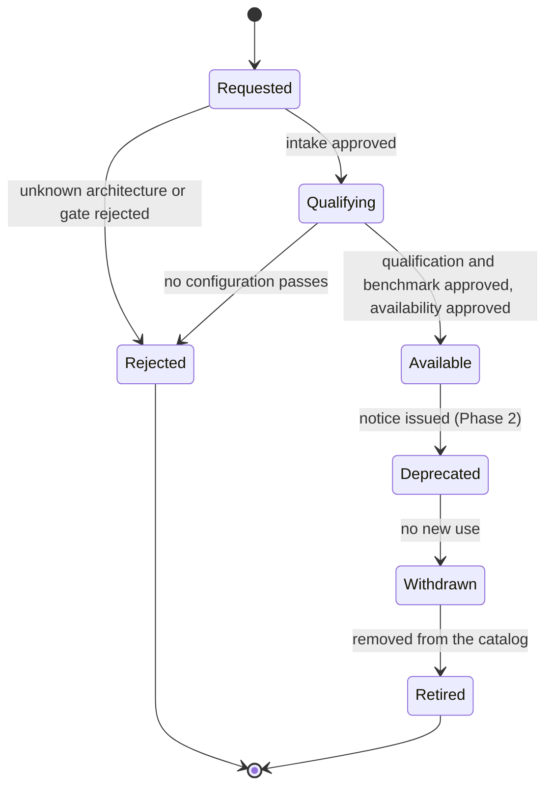

# Model Lifecycle — PRD

| Field | Value |
|:--|:--|
| Version | v0.2 |
| Status | Draft |
| Owner | rackai-product |
| Reviewers | Product owner; Model enablement (Erik, RACKAI-354); Platform engineering (control plane); Performance engineering (benchmark gate); Reliability (canary); Governance (C/E owners) |
| Product review | **Product-owner review disposition, 2026-10-10: conditional acceptance; not formal artifact approval.** PD-1 to PD-5 and PD-7 to PD-10 approved in principle (PD-4 with transition controls, §14.1); PD-6 revised (routine patch vs contract-affecting upgrade); security withdrawal separated from retirement (FR-30); DV-1 and DV-3 conditional; identity, qualification and offering states separated (§6) |
| Product approval | not yet approved |
| Date | 2026-10-10 |
| Roadmap items | M2: Request new model support; Model version upgrade (canary rollout); M2: Sunsetting a model; Multi-model operation |
| Tech spec(s) | [[Model Lifecycle Tech Spec]] (v0.2 draft; not yet approved) |

> **Artifact type: Product Requirements Document.** The capability's canonical home is [[Model Services]], with the workflows [[Model Radar]], [[Model Launch Factory]] and [[Canary & Rollback]], the entities [[Model]], [[Model Class]] and [[Model Deployment Specification]], and the metric [[Model Launch Lag]]. This PRD projects from them and does not redefine them. If they disagree, the canonical notes win and this PRD is stale.
>
> **Status banner.** *Draft PRD for a proposed capability.* Requirements are intent, not commitments. Row 59 (RACKAI-354) is committed on the roadmap, but no onboarding pipeline exists in code at the commits read (§2). Model registration, a compiled-in catalog and weight caching exist and are described as built (`derived`); everything else is `assumed`. Nothing here is approved.
>
> **Scope line (read first).** This PRD owns **the life of a model version in RackAI's offer**: how a model is requested, qualified, benchmarked and made available; how a served model moves to a new version; and how a version is deprecated and retired. It does **not** own: where a workload runs and the declaration contract (**A**); who may act, approve or authorise disruption (**C**); what counts as "performance verified" and evidence-informed ranking (**G**); the customer evidence report (**D**); instrumenting [[Model Launch Lag]] (**B**); fine-tuned adapters and jobs (**J**); OpenRouter publication and model access surfaces (**I**); Model Radar, automated intake of novel architectures and closed-loop optimisation (the day-zero factory, row 64); building and releasing serving images (row 80).

## 1. Summary / Vision

A model should enter RackAI's offer, move to a new version and leave it **on command**, the same way every time, with evidence at each step. A customer or operator asks for a model; RackAI checks it, tests it, benchmarks it, and offers it only once it has passed. Upgrades go out as a canary, promote on evidence and roll back on their own. Retirements give notice and never surprise a running customer.

Why now: the roadmap made fast, evidenced model adoption a Must for MOE-1 (rows 59 and 61, upgraded 2026-10-09). Today every new model and every upgrade is a hand-run engineering task, and the catalog can't tell a customer which entries actually work.

## 2. Problem Statement

**What exists and what is missing today** (read-only survey: `RSS-Engineering/rackai@79ca4de`, `rackai-ui@89bddb4`, `rackai-docs@ccb52a3`):

- **No onboarding pipeline exists.** `git log --grep RACKAI-354` returns nothing in any of the three repos. The roadmap CSV says *Not started* (owner Erik); the delivery-plan source says *In Progress* (Ajay Bedre). The rescope to "pipeline v0" was recorded as *proposed, confirm against RACKAI-354* (row 59). Engineering's design for it has not been received. (D-2)
- **Adding a model to the catalog is a code release.** The built-in catalog is compiled into the controller (`rackai@79ca4de:internal/bootstrap/catalog.go`, `//go:embed catalog/*.yaml`) and seeded into each new organisation, additively (`internal/bootstrap/seeder.go`). It holds 11 Models and 30 Model Classes. The architecture docs still say "59-entry catalog" (`rackai@79ca4de:docs/architecture/overview.md`), and the user guide lists DeepSeek, which is not seeded (`rackai-docs@ccb52a3:docs/user/guides/rackai-user-guide.md`). None of the three portfolio models ([[DeepSeek V4 Flash]], [[GLM 5.3 Flash]], [[Nemotron 3 Ultra]]) is in the seeded set.
- **The catalog offers entries that don't work, and nobody can see it.** The catalog README records that `gemma-4-12b-aim` cannot start, the FP8 `aim` class is unverified on hardware, and all twelve `optimized-nim-vllm` classes are not deployable as seeded (`rackai@79ca4de:internal/bootstrap/catalog/README.md`). The console catalog lists them like any other (`rackai-ui@89bddb4:src/app/pages/models/models-catalog/ModelsCatalog.tsx`). No field records whether an entry was tested.
- **"Ready" means the weights downloaded, not that the model serves.** A `Model`'s phases are `Pending → Processing → Ready → Failed`, about weights and cache (`rackai@79ca4de:api/v1alpha1/model_types.go`). Nothing checks generation, tool calling, long context or concurrency before a customer deploys it.
- **There are no versions and no safe upgrade.** `Model` has no version field; `source.uri` is immutable, and a revision pin (`hf://owner/repo:<rev>`) is optional (`internal/webhook/v1alpha1/model_webhook.go`). Upgrading today means repointing a `ModelClass` to another `Model` or changing a deployment's `spec.modelClass`; both are allowed (`modelclass_webhook.go`, `modeldeployment_webhook.go`) and roll the deployment in place, with no comparison, canary or automatic rollback. The only per-model rollback machinery is for the serving-path migration (`llmisvc-dualrun`), not model versions (`rackai@79ca4de:docs/architecture/controllers.md`).
- **There is no retirement.** Deletion is guarded (a `Model` while a class references it; a class while a deployment uses it, webhook-only and webhooks are off by default), but there is no deprecation state, notice, successor or migration. Removing an entry from the catalog leaves every tenant's copy in place.
- **Nothing is audited.** The audit category set is closed to `quota|config|dataset` (`rackai@79ca4de:pkg/audit/outbox.go`); `Model` and `ModelClass` changes emit no audit events.

**Why it matters.** MOE-1 needs a second model and safe upgrades the customer can see ([[Minimum Operable Estate]]), and the [[Model Launch Lag]] target (<24h median / <72h P90) is a roadmap assumption that has never been measured. **Hypothesis** (no evidence yet): a human-gated pipeline for known architectures will make onboarding and upgrades faster and safer than hand-run work, and will give customers a catalog they can trust.

## 3. Product Principles

1. **Offered means tested.** RackAI offers a model configuration only after it has passed qualification and has a benchmark record. Untested entries are labelled, not hidden and not passed off as offered.
2. **Versions are immutable; change is a rollout.** A new version is a new object. Moving to it is a controlled rollout, never an in-place edit.
3. **Operate before automate.** Every gate has a human approval in Phase 1. Later automation uses the same gates, never a side door.
4. **The customer's model is the customer's choice.** RackAI never moves a customer's declared workload to another version or model without the customer's say (A PD-6). It may recommend.
5. **Roll back first, ask later.** Rollback on a health breach is automatic and needs no approval. Promotion needs evidence and approval.
6. **No surprise retirements.** Notice comes first. A running customer workload is never stopped just because a date passed.
7. **Measure from the first model.** Every onboarding stamps the timestamps [[Model Launch Lag]] needs, so a baseline exists before a target is committed.

## 4. Scope: Goals & Non-Goals

**Goals**
- A model of a known architecture can go from request to offered through one repeatable, evidenced path.
- Customers see, per catalog entry, whether it is offered, untested, deprecated or withdrawn, and why.
- A served model moves to a new version through a canary with automatic rollback, visible to the customer.
- A model version can be retired with notice, without breaking running workloads.
- Two or more models are operated as a portfolio, rotated through the same path.

**Non-Goals / Out of Scope**
- Where a model runs, feasibility and the declaration contract: **A** ([[Workload Declaration & Placement PRD]]). F tells A what is offered; A places.
- Who may request, approve, upgrade or retire, and the emergency path: **C** ([[Governed Execution & Delegated Authority PRD]]).
- What evidence makes a placement "performance verified", and ranking by evidence: **G** ([[Empirical Map & Evidence-Informed Routing PRD]]). F supplies benchmark records.
- The benchmark method itself: the [[Benchmark Evidence Chain]] (performance engineering; row 10, RACKAI-382).
- The customer evidence report: **D** ([[Customer Observability & Evidence Report PRD]]).
- Computing and reporting [[Model Launch Lag]]: **B** ([[Operator Economics & KPI Instrumentation PRD]], row 18). F records the timestamps.
- LoRA adapters and fine-tuning jobs: **J** ([[Fine-Tuning Operations PRD]]). F notifies J when a base model is retired.
- OpenRouter publication, the `/models` endpoint and model access: **I** ([[Inference Access & Distribution PRD]]).
- [[Model Radar]], automated intake of new architectures, automated publication and closed-loop optimisation: the day-zero factory (row 64, not this horizon).
- Building and releasing model-serving images: CI (row 80). Runtime-image upgrades follow the [[Performance Regression Gate]], not this PRD's version rollout (D-6).

## 5. Users & Personas

| Persona | Side | Needs from F |
|---|---|---|
| **Customer ML engineer / application owner** | Customer | Ask for a model; know which catalog entries work; see and consent to upgrades of their workloads; get notice before retirement |
| **Customer platform admin** | Customer | Control who in the organisation may request models and accept upgrades (via **C**) |
| **Model enablement engineer** | RackAI | Run intake and qualification the same way every time; see where each request is stuck |
| **Performance engineer** | RackAI | Benchmark a qualified configuration and attach the evidence once |
| **RackAI operator / reliability** | RackAI | Approve gates; run canaries on shared endpoints; trust rollback; retire versions safely |
| **Product & finance** | RackAI | Portfolio view: what we run, at what version, with what launch lag |
| **Downstream PRDs** (A, G, D, B, I, J, H) | Platform | One availability state, one benchmark record shape, one lifecycle evidence kind |

## 6. Core Entities

| Entity | Role here |
|---|---|
| [[Model]] | The thing that is requested, versioned and retired. Its lifecycle states (Watch → Production → Deprecated) are canonical; this PRD adds the operational path between them |
| [[Model Class]] | One serving recipe for a model (runtime + engine configuration); qualification is per recipe |
| [[Model Deployment]] | A running instance; upgrades and retirements act on these |
| [[Model Deployment Specification]] | Its reference benchmark profile is the benchmark record F produces |
| [[Workload Declaration]] | A customer's declared model; upgrades and retirements of a declared model are changes A must handle |
| [[Benchmark Run]] | The evidence the benchmark gate attaches, per the [[Benchmark Evidence Chain]] |
| [[Registry Credential]] | Authenticates weight fetches during intake and qualification |
| [[Serving Runtime]], [[Accelerator Class]] | The other two parts of a serving configuration |

**Three separate states.** F keeps three things apart, so immutability and qualification never blur:
1. **Artifact identity** (immutable). A **model version** is one set of weights (artifact digest and pinned revision), tokenizer and precision/quantisation. It never changes; any change is a new version linked to its predecessor (FR-15). A **serving configuration** is a model version run a specific way, named by its [[Serving Configuration Identity]] (`scid`, owned by G; F produces it at qualification through G's library).
2. **Qualification state** (per `scid`). The `qualification` status of the [[Verification Status Vocabulary]]: `qualified`, `not-qualified`, `failed` or `revoked`. It changes as gates pass or evidence is revoked; the identity it describes does not.
3. **Offering state** (what RackAI advertises). Per model version: *Requested → Qualifying → Available → Deprecated → Withdrawn → Retired*, or *Rejected*. Per serving configuration: *offered* (only when `qualification: qualified`), *listed, not offered* (visible with an accurate label, e.g. *not yet qualified*), or *withdrawn from new use*.

`qualification: qualified` lets a configuration be *offered*. It is never a `performance` claim: whether an option meets a service level is G's rule, applied by A.

**Defined here, not yet canonical** (they move to a canonical note once a second PRD consumes them; A and I are the likely second consumers):
- **Model request**: a request to add a model version to the offer, with its intake facts, gate decisions and outcome.
- **Rollout**: a controlled move of a served model from a stable to a candidate version: comparison, canary stages, promotion or rollback.
- **Change class** of an upgrade (PD-6): *routine patch* (the contracted model identity, behaviour and compatibility stay the same: same model artifact, tokenizer, precision, context length, capability surface and API parameters; e.g. a runtime security patch) or *contract-affecting* (any of those change, including any new model version). When in doubt, it is contract-affecting.

## 7. User Journeys / Scenarios

**Worked example — onboarding.** An MOE-1 customer asks for a new instruction-tuned model from a known architecture family.
1. The customer files a request (API, CLI or console; or through SNOW if D-1 says so, which creates the same request). It names the weights with a pinned revision, a pull credential, and the intended workload profile.
2. Intake records the architecture, parameter counts, context, tokenizer, precision, capabilities and memory footprint, and confirms a runtime path supports the architecture. An operator accepts intake.
3. Qualification deploys each candidate serving configuration in a qualification estate and runs the standard functional tests. One configuration fails tool calling; it is recorded as *not qualified: tool calling*. Two pass. An operator approves qualification.
4. A performance engineer runs the benchmark on the two passing configurations under the [[Benchmark Evidence Chain]] and attaches the records. An operator approves the benchmark gate.
5. An operator approves availability. The model version is *Available* to that customer's organisation (or to all tenants), with two configurations offered and one shown as not qualified, with the reason.
6. Every step left an audit event, a `lifecycle` evidence record and a timestamp for [[Model Launch Lag]].

**Worked example — upgrade.** The model's lab publishes a new revision.
1. An operator requests the new version; it passes the same gates and becomes *Available*, linked to its predecessor.
2. A new revision is a *contract-affecting* upgrade (PD-6): on a RackAI-operated shared endpoint, each consumer's traffic moves only with their consent or contractual authorisation, and the rest stay on the current version. (A runtime security patch that keeps the model identity would be a *routine patch*: notice, then rollout.) For a customer's declared workload, the customer is offered the upgrade and accepts it by revising their declaration (A).
3. The rollout compares the candidate's benchmark with the current version's on the same profile and configuration, then sends a small share of traffic to the candidate. Errors rise past the stable baseline; the rollout rolls back on its own, and the customer sees *rolled back: error rate*. The stable version served throughout.

**Worked example — retirement (Phase 2).** An old version is deprecated with a date and a successor. Every organisation with a deployment, declaration or catalog copy of it gets notice. From deprecation it can't be newly deployed or declared. On the retirement date it leaves the catalog. One customer hasn't moved: their workload keeps running and they and the operator are told; retirement never stops it. If the version later turns out to have a security defect, that is a separate security withdrawal (FR-30) under C's `model.security-withdraw`, with notice and review.

## 8. Functional Requirements

**Request and intake**

| # | Requirement | Priority | Notes |
|---|-------------|:--------:|-------|
| FR-1 | A model request can be created with: weights source with a pinned revision, pull credential reference, requested runtime paths or accelerators (optional), intended workload profile, requester, and an optional external ticket reference | MUST (API, CLI); SHOULD (console in Phase 1) | Row 59 |
| FR-2 | The request is the record of truth whatever the intake channel. If requests arrive through SNOW (D-1), the ticket creates or links a RackAI request | MUST | proposed — approved in principle 2026-10-10 (PO review) |
| FR-3 | Intake records architecture, total and active parameters, context length, tokenizer, native precision and quantisation, capabilities and memory footprint, and whether a runtime path supports the architecture | MUST | [[Model Launch Factory]] step 2 |
| FR-4 | A request for an architecture no runtime path supports is declined with that reason. Nothing is deployed | MUST | PD-2; novel architectures belong to row 64 |
| FR-5 | The requester sees the request's state, and the reason for any stop, at every stage | MUST | |

**Qualification and benchmark**

| # | Requirement | Priority | Notes |
|---|-------------|:--------:|-------|
| FR-6 | Functional validation runs a standard test set (loading, generation, streaming, tokenisation, long context, tool calling, structured output, concurrency, where the model claims the capability) for each candidate serving configuration. A failure names the blocking capability | MUST | [[Model Launch Factory]] step 3 |
| FR-7 | Each serving configuration that passes functional validation has a benchmark record under the [[Benchmark Evidence Chain]] that states its full serving configuration (model artifact digest, runtime image digest, accelerator type, GPUs per replica, precision/quantisation, args digest), load profile, measured metrics, measurement date and producer, so G can match it to a placement. A B3 card passes F's gate but never makes a placement `performance: verified` (G PD-3; [[Verification Status Vocabulary]]) | MUST | Feeds A §4.6.1 and G PD-3 to PD-7 (§11) |
| FR-8 | Qualification and benchmarks make no quality claim. A configuration quantised below the model's reference precision is labelled as such and cites quality evidence or the standing assumption | MUST | Evidence Chain rule 10; A FR-17 |
| FR-9 | Filing a request is a *routine* action for customer admins and ML engineers (permission only). Each gate (intake accepted, qualification passed, benchmark passed, made available) is a *consequential* action: it needs an authorisation at platform scope from someone other than the request's author. A rejection at any gate records its reason | MUST | PD-3; action classes per C ([[Governed Execution & Delegated Authority PRD]]; C spec §4.1) |

**Availability**

| # | Requirement | Priority | Notes |
|---|-------------|:--------:|-------|
| FR-10 | Offering state is recorded per serving configuration (`scid`). Only a configuration with `qualification: qualified` (passed gates and a benchmark record) is advertised as RackAI-*offered*; any other is *listed, not offered*, with an accurate reason | MUST | PD-4; [[Verification Status Vocabulary]] |
| FR-11 | The catalog, API and console show each model version's availability state and each configuration's status and reason | MUST (API); SHOULD (console in Phase 1) | Fixes the invisible broken entries (§2) |
| FR-12 | Existing catalog entries stay visible with accurate labels (*listed, not offered: not yet qualified*) until qualified, and are never advertised as offered meanwhile. Entries known not to work are withdrawn from new use, with the reason. Existing deployments are not disrupted. The transition follows §14.1 | MUST | PD-4 transition controls |
| FR-13 | A request can be scoped to the requesting organisation. Its intake facts, evidence and availability are then visible only to that organisation and to RackAI operators | MUST | Private models |
| FR-14 | Customers can still register their own models directly. These are labelled *customer-managed, not RackAI-qualified*; a customer can request qualification for one | MUST | proposed — approved in principle 2026-10-10 (PO review) |

**Versions and upgrades**

| # | Requirement | Priority | Notes |
|---|-------------|:--------:|-------|
| FR-15 | A model version's identity is immutable. Any change to weights artifact, revision, tokenizer or precision/quantisation makes a new version, linked to its predecessor. Qualification and offering states change over time without changing the identity (§6) | MUST | proposed — approved in principle 2026-10-10 (PO review) |
| FR-16 | An upgrade is a rollout: the candidate's benchmark is compared with the current version's on the same profile and configuration; the candidate takes a share of traffic in canary stages; it is promoted or rolled back on the health signals of [[Canary & Rollback]] | MUST | Row 61; PD-7. For declaration-managed workloads the canary requirement is retained; its delivery is blocked by A's candidate revision (spec DV-1, A spec Q-18). The initial live signals exclude correctness (spec DV-3), with the limitation stated to approvers and a validation path |
| FR-17 | Rollback on a health-signal breach is automatic and needs no approval. Promotion follows C's catalogue (C spec §4.1): a customer promoting a rollout of its own direct deployment is routine (`model.rollout.own`); promoting a platform catalogue version or a shared endpoint is consequential (`model.promote`, platform scope, separation of duties). The stable version keeps serving until promotion completes | MUST | proposed — approved in principle 2026-10-10 (PO review) |
| FR-18 | A workload named in a customer's [[Workload Declaration]] moves to a new version only through a customer-authored declaration revision. RackAI never substitutes a different model unless the declaration allows it | MUST | PD-6; A PD-6, A FR-17 |
| FR-19 | A rollout that re-places a workload in a way that disrupts service follows C's authority rule | MUST | A FR-19, A PD-7 |
| FR-20 | On a RackAI-operated shared endpoint (one model serving many tenants), a *routine patch* is rolled out under RackAI's operator authority with notice to consumers before the canary starts. A *contract-affecting* upgrade needs each consumer's consent or a contractual authorisation (a standing delegation under C) before that consumer's traffic moves; consumers without it stay on the current version until its retirement (FR-22 to FR-24). Every upgrade uses the same rollout and evidence | MUST | PD-6 (revised v0.2) |
| FR-21 | The customer can see an upgrade's stage, the comparison result and the outcome (promoted, or rolled back with the signal that triggered it) | MUST (API); SHOULD (console in Phase 1) | |

**Deprecation and retirement** (Phase 2)

| # | Requirement | Priority | Notes |
|---|-------------|:--------:|-------|
| FR-22 | Deprecating a model version notifies every affected organisation (with a deployment, declaration or catalog copy of it) with the retirement date, reason and recommended successor | MUST (Phase 2) | Row 60 |
| FR-23 | From deprecation, the version cannot be newly deployed or declared. At withdrawal it leaves the catalog. At retirement its catalog record is closed | MUST (Phase 2) | |
| FR-24 | Retirement never stops a running customer workload by itself. Retiring a version a customer still uses is a *disruptive* action: it needs that customer's authority, given after the affected workloads and consequences are shown. Without it the version stays withdrawn from new use but keeps serving that customer. `model.retire` is never emergency-eligible; a security or licence defect uses security withdrawal (FR-30) instead | MUST (Phase 2) | PD-8; C spec §4.1 |
| FR-25 | Retiring a base model notifies the owners of affected LoRA adapters and fine-tuning jobs. Adapter and job records are J's (`adapter-intake`, `fine-tuning-job`), not F's | SHOULD (Phase 2) | Interface to J |

**Portfolio** (Phase 2)

| # | Requirement | Priority | Notes |
|---|-------------|:--------:|-------|
| FR-26 | Operators see every model version in operation: availability state, estates, owner, usage share and successor | MUST (Phase 2) | Row 32 |
| FR-27 | Rotating a portfolio slot is an onboarding plus a retirement through FR-1 to FR-25, never a side path | MUST (Phase 2) | |

**Evidence and measurement**

| # | Requirement | Priority | Notes |
|---|-------------|:--------:|-------|
| FR-28 | Every request, gate decision, availability change, rollout stage, rollback, promotion, notice and retirement emits an audit event and an evidence record of kind `lifecycle` in the D-0 envelope, with a daily `coverage` record | MUST | Feeds D ([[Customer Observability & Evidence Report PRD]] §1.2) |
| FR-29 | Each onboarding records: when the weights became publicly usable (asserted, with its source), request accepted, each gate, and available. Each upgrade records candidate available and promoted. B can read them | MUST | [[Model Launch Lag]] |
| FR-30 | **Security withdrawal** is separate from retirement. When a configuration has a security or licence defect, it can be withdrawn from new use at once and, only where a hard boundary requires it, its running workloads stopped. This uses C's `model.security-withdraw` action (customer emergency authority or RackAI platform-safety containment, with review), notifies affected customers, and leaves evidence. Commercial retirement never uses this path | MUST (Phase 1 for withdrawal from new use; stop per A's containment) | PD-8; C spec §4.1 |
| FR-31 | **Consumer requirement from E** ([[Sovereign Isolation & Assurance Tech Spec]] §4.5, E DV-2): for any model version that may be offered at Sovereignty Level 1, intake pre-stages the artefacts in the platform object store and produces E's **staging manifest**: source URI, revision, staged-by identity, staged-at, and each file's path and SHA-256. E checks it at resolution and the runtime checks each digest at load. Without it the version is *not offered* at Level 1 | MUST (before any Level 1 offer) | Release blocker for Level 1 offers (spec M2) |

## 9. Non-Functional Requirements

- **Integrity of the offer.** Zero configurations offered without a passed qualification and a benchmark record. An invariant, testable (AC-4) and auditable after the fact.
- **Safe upgrades.** The stable version serves throughout a rollout; rollback after a breach completes in bounded time. The bound is a target posture for the tech spec to set and measure; there is no baseline today.
- **Fail closed for promotion, fail safe for rollback.** Missing evidence or signals never make something available or promote it. Missing signals during a canary hold or roll back; they never promote (§12).
- **Tenancy.** An organisation-scoped request, its weights, evidence and availability are never visible to another organisation. Qualifying a customer's private model never places its weights where another tenant could reach them; for sovereign customers, where qualification runs follows E's rules (D-7).
- **Reproducibility.** Benchmark records follow the [[Benchmark Evidence Chain]]'s evidence bundle, so a result can be re-run and matched to a serving configuration.
- **Compatibility.** Existing Models, Model Classes, catalog copies and deployments keep working unchanged (FR-12).
- **Credentials.** Weight-fetch credentials are referenced, never copied into requests, records or evidence.

## 10. Platform Integration

| System | Needs from it | Provides to it |
|---|---|---|
| Identity & access (IAC) | Permissions to request models, approve gates, start and promote rollouts, deprecate and retire (via C) | A permission set for model lifecycle actions |
| Tenancy & isolation | Organisation and project scope; E's rules for where a sovereign customer's model may be qualified | Organisation-scoped requests and availability |
| Metering, quotas & billing | Usage per model version, including during a canary (D-8) | Version labels on deployments so usage can be attributed |
| Audit | The audit event pipeline (Auditability spec) | Events for every lifecycle decision (FR-28) |
| Monitoring & observability | Health signals per deployment for canary decisions | Lifecycle and rollout metrics; at-risk retirement signals |

## 11. Loop Role & Cross-PRD Interfaces

**Loop role:** *Deliver the how*: models enter, upgrade and retire on command. It serves the **operator** promise (fast, evidenced model adoption, roadmap N5), and the contract between the two centres where a customer's declared model is involved: the customer's choice of model is a constraint F never overrides.

| Interface | Direction | Other PRD | Defined where |
|---|---|---|---|
| Model availability (which versions and serving configurations are offered, not qualified, deprecated or withdrawn) | provides | A (feasibility: *not offered*), I (model availability), H (deploy/retire through public APIs) | This PRD (FR-10, FR-11, FR-23) |
| Candidate revision alongside a realised workload (for canaries) | consumer requirement / requested interface change to A | A | A spec Q-18 (retained requirement, design deferred) |
| Staging manifest for Level 1 artefacts | consumer requirement from E | E | E spec §4.5 (FR-31) |
| [[Authority Context]] carried by every gate, promotion, retirement and withdrawal | consumes | C | [[Authority Context]] (canonical) |
| Model change to a declared workload (upgrade, deprecation, retirement of a declared model) | provides | A | This PRD (FR-18, FR-22, FR-24); A handles it as a declaration change ([[Workload Declaration]]) |
| Model substitution and accuracy-affecting choices need the customer's permission | consumes | A | A PD-6, A FR-17 |
| Disruptive re-placement during a rollout | consumes | A, C | A FR-19 / PD-7; C's authority rule |
| Authority to request (routine), approve gates and promote (consequential), retire an in-use version (disruptive), and the emergency path | consumes | C | [[Governed Execution & Delegated Authority PRD]]; C spec §4.1 |
| Qualification records keyed by [[Serving Configuration Identity]] (`scid`, G-owned) and benchmark records registered as G `EvidenceArtifact`s | provides | G (what counts as "performance verified": A spec §4.6.1, G PD-3 to PD-7) | This PRD (FR-7); the verification rule is G's |
| Lifecycle evidence records (kind `lifecycle`) | provides | D | D-0 envelope (D's PRD) |
| Launch-lag timestamps | provides | B | This PRD (FR-29); the metric is [[Model Launch Lag]], computed by B |
| Base-model retirement notice | provides | J | This PRD (FR-25) |
| Where a sovereign customer's model may be qualified | consumes | E | E's PRD |

## 12. Failure Handling

Stated in the classes and terms of the [[Failure Mode Taxonomy]].

| Class | Failure | Response | Continues / stops / degrades | Who is told |
|---|---|---|---|---|
| Admission | Intake or qualification job can't run (credential rejected, weights unavailable, estate full) | **Fail closed**: the request stays at its stage; nothing is offered | Existing offers and deployments continue | Requester (status reason); a rejected credential is reported as a credential problem |
| Admission | New use of a deprecated, withdrawn or unqualified configuration | **Not offered** | Running workloads continue | Customer (status reason) |
| Evidence | Evidence or audit store unavailable | Gates, offers and promotions **wait** (fail closed). Rollback and security withdrawal **proceed**, evidence back-filled and flagged | Serving continues | Operator (alert) |
| Execution | Health signals lost during a canary | **Degrade** to hold; after the stated timeout, roll back. Never promote | Stable version keeps serving | Operator; customer sees the rollout state |
| Execution | Candidate fails to start or breaches a signal | Roll back (a safety action) | Stable version keeps serving | Customer and operator (rollout outcome) |
| Authority | Authorisation can't be checked (C unavailable) | **Fail closed** for gates, promotion, contract-affecting upgrades and retirement. Rollback and platform-safety containment still complete | Running workloads continue | Operator |
| Containment | Security withdrawal stop does not complete | **Escalate**: page and runbook (A's containment). Never silently delete | Configuration stays quarantined from new use | Operator (page); customer notified |
| Metering | Usage capture lost during a canary | Per [[Multi-Tenancy and Metering Spec]] exposure limits (I and B own them) | Serving continues within the stated limit | Operator |

**Guaranteed never to happen:** a configuration advertised as offered without `qualification: qualified`; a customer's declared workload moved to another version or model without their revision or permission; a contract-affecting upgrade applied to a consumer without consent or contractual authorisation; a running customer workload stopped by retirement; a credential copied into a record.

## 13. Data Retention & Compliance

Requests, intake facts, qualification results, benchmark references, gate approvals, rollout records and notices are kept for the life of the model version and then per the platform's audit retention setting. They hold model metadata and test results, not customer prompts or content. Qualification test prompts are synthetic. A private model's records are visible only to its organisation and RackAI operators. Retirement and notice records are evidence that customers were told in time, which MOE assurance (D) relies on.

## 14. Scope & Phasing

| Phase | Gate | Delivers | Roadmap items |
|---|---|---|---|
| **1** | MOE-0 → MOE-1 | Request and intake (FR-1 to FR-5), qualification and benchmark gate (FR-6 to FR-9), availability states and the catalog transition (FR-10 to FR-14), immutable versions and canary upgrades (FR-15 to FR-21), evidence and timestamps (FR-28, FR-29), security withdrawal from new use (FR-30), Level 1 staging manifests (FR-31). Known architectures only | M2: Request new model support; Model version upgrade (canary rollout) |
| **2** | MOE-1 → MOE-2 | Deprecation, withdrawal and retirement (FR-22 to FR-25); portfolio view and rotation (FR-26, FR-27) | M2: Sunsetting a model; Multi-model operation |
| **Later** | Beyond this horizon | Model Radar, automated intake of novel architectures, automated publication, gates that pass without a human | Day-zero model factory (row 64, not named here) |

### 14.1 Catalog transition plan (PD-4 transition controls)

1. **Label, don't hide.** On upgrade, every existing catalog entry becomes a model version with each class as a serving configuration in state *listed, not offered: not yet qualified*. It stays visible and deployable as today; the console and API say plainly that RackAI has not qualified it.
2. **Withdraw what's known broken.** Entries the catalog records as unable to start (e.g. `gemma-4-12b-aim`) become *withdrawn from new use*, with the reason. Entries recorded as unverified stay *listed, not offered*, with that reason.
3. **Never advertise as offered** until the configuration passes the gates (FR-9, FR-10). Marketing, the catalog and A's feasibility treat *listed, not offered* as not RackAI-offered.
4. **No disruption.** No existing deployment is changed, restarted or stopped by the transition; existing copies keep their names and content.
5. **Qualify in order of use.** Configurations with running customer deployments are qualified first, then portfolio models, then the rest. Each configuration that fails stays *listed, not offered* with its failing capability; it is withdrawn only after notice (FR-22).
6. **Report progress.** The portfolio view (FR-26) and a transition report show counts by state, so the product owner can see when the catalog is fully qualified or pruned.

Sequencing: prototype the pipeline on one real onboarding (the next portfolio model) before generalising (operate before automate). Row 59's benchmark gate depends on row 10 (RACKAI-382); image builds depend on row 80; per-profile thresholds depend on row 11 (D-9).

## 15. Acceptance Criteria & Success Metrics

**Acceptance criteria** (each pass/fail; proposed, not approved). Each names its expected result, evidence source and release gate ([[Release Readiness States]]; milestones are the spec's M1–M5).

| # | Criterion (expected result, pass/fail) | Verifies | Evidence source | Milestone / gate |
|---|---|---|---|---|
| AC-1 | A request with every FR-1 field is created through the API and the CLI and returns an identifier; read-back returns the same values, including an external ticket reference; state and reason are readable at every stage | FR-1, FR-2, FR-5 | API and CLI test results in CI | M2 / MOE-0 |
| AC-2 | Intake of a known-architecture model records every FR-3 fact; a request for an unsupported architecture is declined with that reason and nothing beyond the intake job exists | FR-3, FR-4 | API test with one supported and one unsupported model; object listing | M2 / MOE-0 |
| AC-3 | When one capability is made to fail (e.g. tool calling), that configuration's `qualification` is `failed` naming the capability, and it is not offered | FR-6, FR-10 | Fault-injection test; qualification record | M2 / MOE-0 |
| AC-4 | Advertising a configuration as offered without `qualification: qualified` and a benchmark record carrying its `scid` is rejected; with both it succeeds. Across the suite, zero offered configurations lack either | FR-7, FR-10, NFR integrity | API test plus audit query over `model` events | M2 / MOE-0 |
| AC-5 | A customer admin or ML engineer files a request with no authorisation. Each gate without a platform-scope `model.gate.approve` authorisation is rejected, and so is one minted by the request's own author; with a valid one, the authoriser and time are recorded; a rejection records its reason | FR-9 | API test per gate, including self-authorisation; C authorisation records | M2 / MOE-0 |
| AC-6 | After upgrade, every existing catalog entry is visible with an accurate offering label; none unqualified is advertised as offered; known-broken entries show *withdrawn from new use* with the reason; every existing deployment keeps serving unchanged (no restart) | FR-11, FR-12, §14.1 | Upgrade test on a copy of a real estate: catalog snapshot, pod restart counts | M1 / MOE-0 (copy), MOE-1 (live) |
| AC-7 | An organisation-scoped request, its evidence and its offering state are not visible to a second organisation; a customer-registered model shows *customer-managed, not RackAI-qualified* | FR-13, FR-14 | Negative tenancy test through the authservice | M1, M2 / MOE-1 |
| AC-8 | Changing the weights artifact, revision, tokenizer or quantisation of an existing version is rejected; the change can only be made as a new version linked to its predecessor, while qualification and offering states of the old version can still change | FR-15 | API test | M1 / MOE-0 |
| AC-9 | In a rollout: the comparison is recorded before any traffic moves; the candidate receives only its stage's share; for each live signal in the initial set, an injected breach rolls back without approval while the stable version keeps serving; promotion without the required authorisation (C's class for that rollout) is blocked; the customer can read the stage and outcome; the stated correctness limitation is shown to the approver | FR-16, FR-17, FR-21 | Rollout e2e with fault injection per signal; rollout status; `lifecycle` records | M3 / MOE-1 (direct deployments and shared endpoints); declared workloads blocked by A spec Q-18 |
| AC-10 | For a declaration-managed workload, a version move without a customer-authored declaration revision is rejected; a substitution the declaration does not allow is rejected; a disruptive re-placement without C's authority is rejected | FR-18, FR-19 | API test | M3 / MOE-1 |
| AC-11 | On a shared endpoint: a routine patch does not start until notice to consumers is recorded; a contract-affecting upgrade moves no consumer's traffic without that consumer's consent or contractual authorisation, and consumers without it stay on the current version | FR-20, PD-6 | API test with two consumers (one consenting, one not); routing weights and audit | M3 / MOE-1 |
| AC-12 | (Phase 2) Deprecation notifies each affected organisation (one with a deployment, one with a declaration, one with only a catalog copy) and no unaffected one; new deployments and declarations of the version are rejected; existing ones keep serving | FR-22, FR-23 | API test with four organisations; notice records | M5 / MOE-2 |
| AC-13 | (Phase 2) On the retirement date, a customer still using the version sees the impact; without that customer's `model.retire` authorisation the version is not retired for them and their workloads keep serving; with it, the version is retired for that customer, the impact, authorisation and outcome are recorded, and their running workloads are still not stopped; `model.retire` is refused on any emergency or platform-safety path | FR-24, PD-8 | API test; C authorisation records | M5 / MOE-2 |
| AC-14 | Every event in FR-28 produces an audit event and a `lifecycle` record that validates against the D-0 envelope, and the daily `coverage` record reconciles against F's decision records | FR-28 | Event schema test; coverage reconciliation test | M3 (audit), M4 (evidence) / MOE-1 |
| AC-15 | For each onboarding and upgrade, the FR-29 timestamps are retrievable through the API | FR-29 | API test | M2, M3 / MOE-1 |
| AC-16 | With the evidence or audit store unavailable, no configuration becomes offered and no rollout promotes; an injected breach during the outage still rolls back, with evidence back-filled and flagged | §12 | Fault-injection test | M2, M3 / MOE-1 |
| AC-17 | (Phase 2) The portfolio view lists at least two concurrently operated model versions with their FR-26 fields; rotating a slot is recorded as one onboarding and one retirement | FR-26, FR-27 | Operator API test | M5 / MOE-2 |
| AC-18 | A security withdrawal of one configuration (`model.security-withdraw`) blocks new use at once; a stop happens only where the hard-boundary condition is met and through A's containment; affected customers are notified; the action is reviewed afterwards; a commercial retirement cannot use this path | FR-30, PD-8 | API test with and without the hard-boundary condition; C review record; A containment record | M3 (withdraw), M5 (review reporting) / MOE-1 |
| AC-19 | A version that may be offered at Level 1 has a staging manifest with every file's SHA-256; without it, E reports *not offered* | FR-31 | Intake test plus E's resolution check | M2 / MOE-1 Level 1 offers (blocked until done) |

**Success metrics** (ladder; baselines are "none today"; targets are postures to instrument):

1. **Launch speed:** [[Model Launch Lag]] (median and P90) per onboarding, computed by B. The <24h / <72h figures stay a roadmap assumption until a baseline exists (PD-10).
2. **Upgrade speed:** time from a new version's weights to promotion on the first estate.
3. **Pipeline coverage:** share of models served to customers that went through the pipeline rather than by hand. Baseline 0%.
4. **Offer integrity:** configurations advertised as offered without `qualification: qualified` (invariant: zero).
5. **Catalog truthfulness:** share of first deployments of an offered configuration that reach ready.
6. **Rollout safety:** breaches caught by canary rollback, versus customer-visible regressions after promotion.
7. **No surprise retirements:** retirements where every affected organisation had notice before the date (invariant).

## 16. Dependencies

- **Row 10 (RACKAI-382):** the benchmark process the benchmark gate uses.
- **Row 80 (CI):** building and releasing serving images, including the qualification test image.
- **Row 11 (decision):** per-profile SLO thresholds, used for profile-level benchmark claims and canary thresholds (D-9; not decided here).
- **Row 18 (B):** Model Launch Lag instrumentation from F's timestamps.
- **A:** availability as a feasibility input; handling of model changes to declarations; the candidate realisation a canary needs (D-5).
- **C:** authority for every gate, promotion, deprecation and the emergency path.
- **G:** the rule for "performance verified" (A Q-13).
- **D-0:** the evidence envelope.
- **E:** where a sovereign customer's model may be qualified (D-7).
- **Routing (row 19) and I:** weighted traffic for canaries.
- **Depended on by:** A, G, I, H, J (base-model retirement), B.

## 17. Risks & Mitigations

| Risk | Mitigation |
|---|---|
| The pipeline is slower than hand-run work, so people bypass it | Measure lag from the first onboarding (FR-29); gates are per configuration so one bad recipe doesn't block the rest; kill criterion §18 |
| Honest catalog states make most current entries look untested | That is the truth today (§2); FR-12 keeps them usable and labelled while they are qualified |
| Canaries on shared prefix caches distort results | Compare like with like (same profile and configuration); the rollout design is the spec's |
| Engineering's RACKAI-354 design differs from this PRD | Row 59 is committed; D-2 reconciles before approval; divergences go to product review |
| Customers decline upgrades and old versions pile up | Deprecation with notice (Phase 2); upgrades are recommended, not forced (PD-6) |
| Retirement collides with a sovereign customer's running workload | Retirement never stops a workload by itself; a licence or security defect uses security withdrawal (FR-30), not retirement (PD-8) |

## 18. Kill / Falsification Criterion

The bet is that a **human-gated, evidenced pipeline for known architectures** makes model adoption faster and safer than hand-run work, so MOE-1 doesn't depend on bespoke model projects.

**Falsified if**, across the first onboardings and upgrades run through the pipeline (count proposed for approval, PD-10), any of these holds:
- [[Model Launch Lag]] is no better than the hand-run time measured for comparable models in the same period;
- operators routinely bypass the pipeline to meet deadlines;
- promoted upgrades cause customer-visible regressions of a kind the gates were meant to catch.

**Evidence:** B's launch-lag series, the share of served models with a pipeline record (metric 3), bypasses recorded by operators, rollout outcomes and post-promotion incidents.

**If falsified:** keep the availability states and evidence records (they still give customers a truthful catalog and D its proof), stop investing in pipeline automation, and redesign the gates with the product owner before any factory work (row 64).

## 19. Open Decisions

| # | Decision | Owner | Blocks |
|---|----------|-------|--------|
| D-1 | Do new-model requests go through ServiceNow (SNOW)? The roadmap notes it as likely; the delivery-platform decision with RXT is open | Product owner, with RXT delivery platform | FR-2 channel (not the request contract, per PD-1) |
| D-2 | Reconcile row 59 with RACKAI-354: scope (the 2026-10-09 rescope is *proposed*), owner (CSV: Erik; delivery plan: Ajay Bedre), status (CSV: Not started; delivery plan: In Progress), and engineering's design, which has not been received and has no commits | Product owner, with Erik | Approval of Phase 1 |
| D-3 | Who may request and approve | Product owner, with C | **Closed (C spec §4.1, Q-15):** request routine for customer admins and ML engineers; gates and platform promotion consequential (`model:approve`, platform, separation); own-deployment rollout routine (`model.rollout.own`); in-use retirement disruptive with customer authority, never emergency-eligible; security withdrawal via `model.security-withdraw` |
| D-4 | Deprecation notice period, and what happens to a declared workload still on a version at retirement | Product owner, with C and A | FR-22, FR-24 |
| D-5 | Candidate revision for declared-workload canaries: **consumer requirement / requested interface change to A** (A accepted it as a retained requirement, design deferred: A spec Q-18). The canary requirement for declared workloads is retained; until A delivers, it is a **release blocker** for declared-workload canaries (spec M3) | Product owner, with A | FR-16 for declared workloads (spec DV-1, conditional) |
| D-6 | Does a runtime-image or engine change to an offered configuration use this rollout, or only the [[Performance Regression Gate]]? | Product owner, with performance engineering | Scope of FR-16 |
| D-7 | Where a sovereign customer's private model is qualified and benchmarked (their estate, a dedicated qualification estate, or ours) | Product owner, with E | FR-6, FR-13 for sovereign customers |
| D-8 | How usage is attributed to each version during a canary | Product owner, with Metering (B) | Metering row in §10 |
| D-9 | Per-profile SLO thresholds (row 11): needed before benchmark records support profile-level claims or canaries use profile thresholds. Referenced, not decided here | Product owner (row 11) | Profile-level claims; canary thresholds |
| D-10 | Is a quality (accuracy) check part of qualification for some model classes, beyond the functional tests? | Product owner, with performance engineering | FR-8 |
| D-11 | Validation path for live correctness signals in canaries (spec DV-3, conditional): which correctness measures (e.g. sampled golden prompts, structured-output conformance) become rollback signals, and when | Product owner, with reliability and performance engineering | Lifting the DV-3 limitation |

## 20. Proposed Product Decisions

None is formally approved. The product-owner review disposition of 2026-10-10 is conditional acceptance, recorded per decision below.

| # | Decision | Alternatives considered | Why this one | Status |
|---|---|---|---|---|
| PD-1 | **The model request is a first-class RackAI object, whatever the intake channel.** If SNOW is adopted (D-1), a ticket creates or links the request | Requests live only in SNOW; requests live only in RackAI | Keeps the gates, evidence and launch-lag timestamps in one place, and lets D-1 be decided without changing the product contract | proposed — approved in principle 2026-10-10 (PO review) |
| PD-2 | **Phase 1 accepts known architectures only.** Others are declined with a reason and left for the factory (row 64) | Accept any architecture with best-effort engineering | The rescoped row 59 says so; novel architectures are where hand-run work is unavoidable | proposed — approved in principle 2026-10-10 (PO review) |
| PD-3 | **Four human gates in Phase 1**: intake accepted, qualification passed, benchmark passed, made available. Promotion of an upgrade is a fifth. Later automation uses the same gates | One approval at the end; no human gates | Operate before automate; puts judgement where risk is and makes each stop explainable | proposed — approved in principle 2026-10-10 (PO review) |
| PD-4 | **Availability is per serving configuration, and only qualified configurations are offered.** Untested entries are shown as *not qualified*, with a transition for today's catalog (FR-12) | Per model; keep today's catalog as is | A model can work on one runtime and fail on another, as today's catalog shows (§2). **Contestable:** most current entries will show *not yet qualified* until the pipeline runs | proposed — approved in principle 2026-10-10 (PO review), with transition controls: only qualified configurations advertised as offered; unqualified entries stay visible with accurate labels; existing deployments not disrupted (§14.1) |
| PD-5 | **Model versions are immutable; an upgrade is a new version plus a rollout.** In-place repointing is not the upgrade path for customer workloads | Mutable versions with an edit history | Evidence and benchmarks attach to something that can't change under them; rollback has a target | proposed — approved in principle 2026-10-10 (PO review) |
| PD-6 | **Two upgrade classes.** A *routine patch* (contracted model identity, behaviour and compatibility unchanged) on a shared endpoint is rolled out under RackAI's operator authority with notice. A *contract-affecting* upgrade (model identity, behaviour or material compatibility changes, including any new model version) needs customer consent or a contractual authorisation (standing delegation under C), per consumer; consumers without it stay on the current version until retirement. A customer's declared workload moves only by their declaration revision (A PD-6) | Notice only for all shared-endpoint upgrades (v0.1); consent for every patch | Operators can patch without a veto, while customers keep control of what model they are contracted to receive | proposed — revise (PO review 2026-10-10): separate routine patching from contract-affecting upgrades; revised v0.2, pending approval |
| PD-7 | **Rollback is automatic and unapproved; promotion needs evidence and the authorisation C's catalogue requires.** The initial live signals are those of [[Canary & Rollback]] that can be measured; correctness is a stated limitation with a validation path (spec DV-3, D-11) | Manual rollback; automatic promotion | Safety actions shouldn't wait for a person; advancing risk should | proposed — approved in principle 2026-10-10 (PO review) |
| PD-8 | **Retirement never stops a running workload by itself.** Notice, then no new use, then removal from the catalog; retiring a version a customer still uses needs that customer's authority (C's *disruptive* class, never emergency-eligible); a security or licence defect uses security withdrawal (FR-30, `model.security-withdraw`), never retirement | Stop on the retirement date | No surprise to the customer; keeps disruption authority with C. **Contestable:** RackAI may carry old versions longer than planned | proposed — approved in principle 2026-10-10 (PO review): retirement removes eligibility for new use and never authorises stopping; security containment is a separate path (FR-30, `model.security-withdraw`) |
| PD-9 | **Customer-registered models stay supported, labelled *customer-managed, not RackAI-qualified*.** Qualification is available on request | Block unqualified customer models; treat them as offered | Doesn't break today's Add Model path, and doesn't pretend RackAI tested what it didn't | proposed — approved in principle 2026-10-10 (PO review) |
| PD-10 | **Success is measured by [[Model Launch Lag]] with a ladder; the <24h / <72h target stays an assumption until a baseline exists.** The falsification count (§18) is set after the first onboardings, with the product owner | Commit the roadmap target now | No baseline exists; committing an unmeasured number would be invented precision | proposed — approved in principle 2026-10-10 (PO review) |

## See Also

- [[Model Services]] — the pillar hub this PRD projects from
- [[Model Launch Factory]], [[Canary & Rollback]], [[Model Radar]] — the canonical workflows
- [[Model Launch Lag]] — the success metric (instrumented by B)
- [[Model Lifecycle Tech Spec]] — the engineering design for this PRD (draft)
- [[Workload Declaration & Placement PRD]] — how declared workloads absorb model changes
- [[Benchmark Evidence Chain]] — the benchmark method behind the benchmark gate
- [[PRD Coverage Plan]] — where F sits among the PRDs
- [[RackAI Roadmap]] — rows 59, 60, 61 and 32
