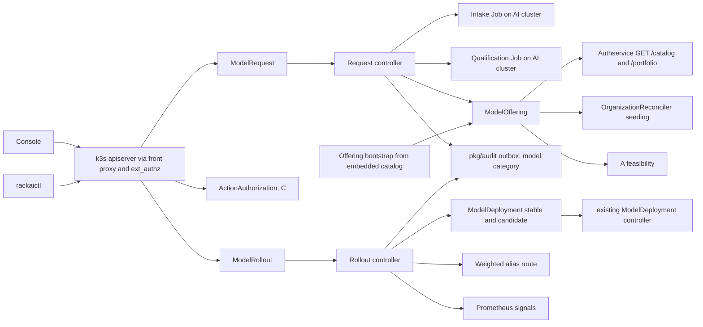

# Model Lifecycle — Technical Specification

| Field | Value |
|:--|:--|
| Version | v0.2 |
| Status | Draft |
| Author | Wiki agent for rackai-product (draft for platform engineering and model enablement) |
| Reviewers | Platform engineering (control plane); Model enablement (Erik, RACKAI-354); Performance engineering; Reliability; Routing (row 19); UI; Docs; Governance (C/E owners) |
| Product review | **Product-owner review disposition, 2026-10-10: conditional acceptance; not formal artifact approval.** v0.2: G's `scid` replaces F's digest (X-2); C's catalogue adopted incl. `model.rollout.own` and `model.security-withdraw` (X-3); DV-1 and DV-3 conditional; qualification and offering states separated; PD-6 change classes; failure taxonomy and readiness states applied |
| Engineering approval | not yet approved |
| Product approval | not yet approved |
| Date created | 2026-10-10 |
| Based on PRD(s) | [[Model Lifecycle PRD]] (v0.2 draft, conditional acceptance 2026-10-10, not yet approved; spec drafted alongside per product-owner instruction 2026-10-10) |
| Roadmap items | M2: Request new model support; Model version upgrade (canary rollout); M2: Sunsetting a model; Multi-model operation |
| Jira epic(s) | RACKAI-354 (row 59, committed; no commits found, §3.1); RACKAI-372 (row 60). Others: none yet, one epic per milestone (§13) |

> **Artifact type: Technical Specification.** An authored engineering design. Its concepts have canonical notes: [[Model]], [[Model Class]], [[Model Deployment]], [[Model Deployment Specification]], [[Model Launch Factory]], [[Canary & Rollback]], [[Model Launch Lag]]. This spec designs *how* to build them and does not redefine them.
>
> **Status banner.** *Proposed design; the pipeline, offering catalog, rollouts and retirement are not built.* Design statements are `assumed`. Statements about today's code are `derived` from the read-only survey in §3, pinned to commits, and marked **AS BUILT** where the design meets existing code. Engineering's own RACKAI-354 design has not been received; where it differs, this spec records the drift, and a material difference goes to product review (PRD D-2).

### 0. Status markers (convention)

- **AS BUILT (YYYY-MM-DD, TICKET):** what exists where it differs from or constrains the design above it.
- **PROPOSED, NOT BUILT (YYYY-MM-DD):** designed here, not implemented.
- **RETAINED FOR THE RECORD:** a rejected or replaced design kept for the decision record.

## 1. Overview

This spec adds a model lifecycle pipeline to the RackAI control plane (`RSS-Engineering/rackai`). Three resources carry it in Phase 1, plus one in Phase 2. A **`ModelRequest`** moves a model version through intake, functional qualification and a benchmark gate, each human-approved. A cluster-scoped **`ModelOffering`** becomes the platform's single record of what is offered, per serving configuration; the compiled-in catalog becomes its bootstrap seed. A **`ModelRollout`** moves a served deployment from a stable to a candidate version through weighted canary stages, with automatic rollback. Gate approvals, promotion and retirement of an in-use version are authorised through C's **`ActionAuthorization`** and `pkg/authority` decision interface ([[Governed Execution & Delegated Authority Tech Spec]] §4.1, §4.3, §4.5); F adds no approval object of its own. Phase 2 adds deprecation, withdrawal and retirement on `ModelOffering`, a per-organisation **`ModelRetirement`** as the subject of C's `model.retire`, and a portfolio read API.

The change is **additive**. Existing `Model`, `ModelClass` and `ModelDeployment` contracts keep working; tenant catalog copies are labelled, never rewritten; the `GET /catalog` endpoint gains states without changing its existing shape. Every decision uses the pattern PRD A's spec set: durable record in Kubernetes first, then an idempotent audit row in PostgreSQL, with one deterministic decision ID in both ([[Workload Declaration & Placement Tech Spec]] §4.11). No new service.

### 1.1 Goals

- G-1: One request object and one pipeline for known architectures: intake → qualification → benchmark → availability, each gate approved and recorded (FR-1 to FR-9).
- G-2: A platform offering record per model version, with status per serving configuration, that the catalog, A's feasibility and I read (FR-10 to FR-14).
- G-3: Immutable versions and a rollout controller with comparison, weighted canary stages, automatic rollback and approved promotion (FR-15 to FR-21).
- G-4: Lifecycle audit, `lifecycle` evidence records in the D-0 envelope, and launch-lag timestamps (FR-28, FR-29).
- G-5 (Phase 2): Deprecation, withdrawal and retirement with notice and no silent stop; a portfolio view (FR-22 to FR-27).

### 1.2 Non-Goals

- **Placement and declaration handling:** A. This spec publishes availability to A and asks A for one interface (candidate realisation, §1.6, DV-1).
- **Authority:** C decides who holds each permission (§7) and owns the emergency path (Q-5).
- **The "performance verified" rule:** G (A Q-13). This spec produces each configuration's `scid` through G's library and records that carry every field G's rules read (§4.3).
- **Running benchmarks:** performance engineering's harness (row 10, RACKAI-382) runs them; this spec records and validates the result (DV-2).
- **Weighted routing itself:** the routing layer (row 19; I). This spec consumes a weighted-alias capability and designs a fallback (§4.5, Q-3).
- **Model Radar, novel architectures, automated publication:** row 64.
- **Image builds:** row 80 builds the qualification image and runtime images.
- **Fine-tuning jobs and adapters:** J; this spec emits a notice (FR-25).

### 1.3 Requirements Traceability

All 31 functional requirements of `prd-model-lifecycle`:

| PRD · req | Spec section(s) | Milestone | Status |
|---|---|---|---|
| prd F · FR-1 request fields | §4.1, §5 | M2 | covered |
| prd F · FR-2 channel-agnostic request | §4.1 (`externalRef`) | M2 | covered (the SNOW integration itself waits on D-1, Q-1) |
| prd F · FR-3 intake facts | §4.1 (`status.intake`), §6.1 | M2 | covered |
| prd F · FR-4 unknown architecture declined | §4.1, §6.1 (architecture allowlist) | M2 | covered |
| prd F · FR-5 state and reason visible | §4.1 status, §13 M4 | M2 (API), M4 (console) | covered |
| prd F · FR-6 functional validation per configuration | §4.1, §6.1, §4.6 | M2 | covered |
| prd F · FR-7 benchmark record per configuration | §4.3 | M2 | covered (attached, not executed: DV-2; carries every field A §4.6.1 and G PD-3 to PD-7 read) |
| prd F · FR-8 no quality claim; quantisation labelled | §4.2 (`accuracy`) | M2 | covered (quality check scope: PRD D-10, Q-10) |
| prd F · FR-9 approved gates | §4.4, §6.1 | M2 | covered (classes per C spec §4.1; remaining holders Q-4) |
| prd F · FR-10 offered only if qualified and benchmarked | §4.2, §4.3 | M1 (state), M2 (gate) | covered |
| prd F · FR-11 states visible | §4.2 status, §5, §13 M4 | M1 (API), M4 (console) | covered |
| prd F · FR-12 catalog transition | §4.7 (transition plan) | M1 | covered (PD-4 transition controls) |
| prd F · FR-13 organisation-scoped requests | §4.1, §4.2 (`visibility`), §8 | M1, M2 | covered (sovereign qualification location: Q-7) |
| prd F · FR-14 customer-registered models labelled | §4.7 | M1 | covered |
| prd F · FR-15 immutable versions | §4.2 (CEL), §4.1 | M1 | covered |
| prd F · FR-16 rollout: compare, canary, promote or roll back | §4.5, §6.2 | M3 | covered for direct deployments and shared endpoints; **divergent for declaration-managed workloads (DV-1)**; signal set narrowed (DV-3) |
| prd F · FR-17 automatic rollback; approved promotion | §4.5, §9 | M3 | covered |
| prd F · FR-18 declared workloads need a customer revision | §4.5 (declaration guard) | M3 | covered (enforced by rejection until A's interface exists, DV-1) |
| prd F · FR-19 disruptive re-placement follows C | §4.5 | M3 | covered (rollouts never change the placement envelope; a rollout that would is rejected) |
| prd F · FR-20 shared endpoints: routine patch with notice; contract-affecting needs consent | §4.5 (`changeClass`, per-consumer consent) | M3 | covered (per-consumer routing: Q-3) |
| prd F · FR-21 rollout visible to customer | §4.5 status, §13 M4 | M3 (API), M4 (console) | covered |
| prd F · FR-22 deprecation notice to affected orgs | §4.8 | M5 | covered (notice period: D-4, Q-8) |
| prd F · FR-23 no new use after deprecation; withdrawal; retirement | §4.8 | M5 | covered |
| prd F · FR-24 in-use retirement needs customer authority; never emergency | §4.8 | M5 | covered (C `model.retire`, C spec §4.1) |
| prd F · FR-25 notice to adapter and job owners | §4.8 | M5 | covered (notice only) |
| prd F · FR-26 portfolio view | §5 (`/portfolio`) | M5 | covered |
| prd F · FR-27 rotation through the pipeline | §4.8, §5 | M5 | covered (no separate path exists to bypass) |
| prd F · FR-28 audit and `lifecycle` evidence | §4.9 | M1–M3 (audit), M4 (evidence) | partial: interim claim schema until D-0 (Q-9) |
| prd F · FR-29 launch-lag timestamps | §4.1 (`status.timestamps`), §4.5 | M2, M3 | covered |
| prd F · FR-30 security withdrawal | §4.10 | M3 (withdraw), M5 (review reporting) | covered (C `model.security-withdraw`; stop via A's containment) |
| prd F · FR-31 Level 1 staging manifest (consumer requirement from E) | §4.1 (intake), §4.6 | M2 | covered; release blocker for Level 1 offers |

**Acceptance criteria → design and test:**

| AC | Designed in | Proven by (§12) | Milestone | Gate |
|---|---|---|---|---|
| AC-1 | §4.1, §5 | API + CLI round-trip | M2 | MOE-0 |
| AC-2 | §4.1, §6.1 | Supported vs unsupported architecture; no qualification objects for the latter | M2 | MOE-0 |
| AC-3 | §4.6 | Qualification suite with an injected capability failure | M2 | MOE-0 |
| AC-4 | §4.2, §4.3 | Offer without qualification / with mismatched benchmark digest / with both; audit query | M2 | MOE-0 |
| AC-5 | §4.4 | Authorisation tests via C: routine request without authorisation; gate by an unauthorised caller, by the requester (separation), stale, replayed | M2 | MOE-0 |
| AC-6 | §4.7 | Upgrade test on a copy of a real estate | M1 | MOE-0 (copy), MOE-1 (live) |
| AC-7 | §4.2 `visibility`, §8 | Negative tenancy test through the authservice | M1, M2 | MOE-1 |
| AC-8 | §4.2 CEL | API test | M1 | MOE-0 |
| AC-9 | §4.5 | Rollout e2e with fault injection per Phase-1 signal (DV-3) | M3 | MOE-1 |
| AC-10 | §4.5 declaration guard | API test (rejected until DV-1 resolves) | M3 | MOE-1 |
| AC-11 | §4.5 `changeClass`, `notice`, consent | Two-consumer test (one consenting) | M3 | MOE-1 |
| AC-12 | §4.8 | Four-organisation impact test | M5 | MOE-2 |
| AC-13 | §4.8 | Retirement with and without the customer's `model.retire` authorisation; emergency path | M5 | MOE-2 |
| AC-14 | §4.9 | Event schema test (interim; re-run when D-0 lands) | M3 (audit), M4 (evidence) | MOE-1 |
| AC-15 | §4.1, §4.5 | API test | M2, M3 | MOE-1 |
| AC-16 | §9 | Fault injection: audit store down, evidence store down, signals down | M2, M3 | MOE-1 |
| AC-17 | §5 `/portfolio` | Operator API test | M5 | MOE-2 |
| AC-18 | §4.10 | Withdraw with and without the hard-boundary condition; C review record | M3, M5 | MOE-1 |
| AC-19 | §4.1 intake manifest | Intake test plus E resolution check | M2 | MOE-1 (Level 1) |

### 1.4 Deliberate Divergences from the PRD

Each item is classified against the tech-spec standard's materiality rule. **Material items need product approval before this spec can be approved.** None is approved.

| # | Divergence | Touches | Classification | Status |
|---|---|---|---|---|
| DV-1 | **No traffic canary for declaration-managed workloads until A provides candidate realisation.** A Phase-1 A realises one revision at a time ([[Workload Declaration & Placement PRD]] §12). Until A accepts the interface in §1.6, a `ModelRollout` whose stable deployment carries `rackai.rackspace.com/declaration` is rejected (`DeclarationManagedRolloutUnsupported`). Such workloads upgrade by a customer declaration revision through A's amend-and-cut-over path, with this spec's benchmark comparison recorded but no traffic split or automatic rollback | FR-16, AC-9 for declared workloads; customer-visible | material | **conditional (PO review 2026-10-10):** temporary absence of the declared-workload canary accepted; the canary requirement is **retained** and A's candidate revision (A spec Q-18) is a **release blocker** for declared-workload canaries (§13 M3). Consumer requirement / requested interface change to A |
| DV-2 | **The benchmark gate attaches, it doesn't execute.** In Phase 1 a performance engineer runs the benchmark with the harness of row 10 and attaches its record; the controller validates provenance and the `scid` match (§4.3). It does not launch benchmarks | FR-7 mechanism | non-material (who runs it, not what is required) | **confirmed by the product owner, 2026-10-10** (non-material) |
| DV-3 | **Phase-1 rollback signals are errors, latency, availability and GPU failure.** [[Canary & Rollback]] also lists *correctness*, which has no serving-time measurement in the platform today. Correctness is covered before traffic moves by re-running functional qualification on the candidate (§4.6); it is not a live rollback signal | FR-16, AC-9; customer-visible safety | material | **conditional (PO review 2026-10-10):** the initial live-signal subset is accepted only with the correctness limitation stated explicitly to approvers and customers (rollout status `limitations: [correctness-not-live]`) and a validation path: PRD D-11 selects correctness signals (sampled golden prompts, structured-output conformance), added as rollback signals in a later revision once validated |
| DV-4 | **Usage during a canary is attributed to the alias until metering reads the backend.** The metering ext-proc takes `modelId` from the request path (`internal/meteringextproc/processor.go`), which is the alias for both versions. Per-version attribution needs a backend label (Q-6, PRD D-8) | §10 metering row | non-material (attribution detail; billing totals unchanged) | **confirmed by the product owner, 2026-10-10** (non-material) |

### 1.5 Terminology

| Term | Definition |
|:--|:--|
| `ModelRequest` | Namespaced CRD: one request to add one model version, and its gate history |
| `ModelOffering` | Cluster-scoped CRD: the platform record of one model version and its serving configurations (PRD §6 "model version") |
| Serving configuration | `{ runtime, image digest, engine-args digest, accelerator class, parallelism }` on a model version (PRD §6) |
| `scid` | [[Serving Configuration Identity]], owned by G (schema, digest, versioning). F computes it only through G's `pkg/empiricalmap/identity` library at qualification and stores the full identity record beside it |
| `ActionAuthorization` | C's immutable, single-use authorisation of one action instance (C spec §4.3). F uses the actions `model.gate.approve`, `model.promote` and `model.retire` from C's catalogue (C spec §4.1) |
| `ModelRetirement` | Namespaced, controller-written object: one per affected organisation for a deprecated version, carrying that organisation's impact and digest; the subject of `model.retire` (§4.8) |
| `ModelRollout` | Namespaced CRD: one controlled move of a deployment from stable to candidate |
| Alias | The stable endpoint name clients call during a rollout; routed by weight to the stable and candidate deployments |
| Qualification estate | Where qualification runs: a platform namespace on the AI cluster, or the customer's estate (Q-7) |

### 1.6 Relationship to Other Specs and Canonical Notes

- **[[Workload Declaration & Placement Tech Spec]]** (A):
  - **Consumes:** A's decision-record and approval-binding patterns (§4.7, §4.11 there), its containment qualification of runtime paths (§4.9.1 there; a runtime path not qualified for containment is never offered for declaration-managed placement).
  - **Provides:** `ModelOffering` status as an input to A's feasibility. A configuration that is not *offered* returns *not offered: model configuration not qualified*. Benchmark records are registered as G `EvidenceArtifact`s, which replace A's Phase-1 curated source (§4.3).
  - **Exception requested (DV-1, Q-2):** A realises a *candidate* revision alongside the realised one for the life of a rollout, under a `PlacementProposal` with `basis.kind: rollout-candidate` inside the existing envelope. Not part of A's approved contract; needs A's owner and product approval.
  - **Evidence rules:** A's §4.6.1 defines `performance: verified` (provenance, configuration match on artifact digest, runtime image digest, accelerator type, GPUs per replica, precision/quantization and args digest, workload and load match, target match, freshness); A §4.7 defines the decision interface. G replaces A's Phase-1 source and tightens the rule ([[Empirical Map & Evidence-Informed Routing PRD]] PD-3 to PD-7: a B4 qualification record or production telemetry, exact match, load coverage, event-driven freshness). F produces records carrying every field those rules read (§4.3); F does not apply the rule.
- **[[Identity and Access Control Spec]]:** new permissions in the route map (§7).
- **[[Monitoring and Auditability Spec]]:** **exception**: adds the audit category `model` to the closed set, as A adds `placement`.
- **[[Multi-Tenancy and Metering Spec]]:** no new events; version labels for attribution (DV-4).
- **[[Accelerator Selection Spec]]:** accelerator classes are part of a serving configuration; unchanged.
- **Canonical notes implemented:** [[Model]] (lifecycle states realised as availability states), [[Model Launch Factory]] (its middle, steps 2, 3, 5, 6), [[Canary & Rollback]], [[Model Launch Lag]] (timestamps only).

## 2. Architecture

### 2.1 System Components

All backend components run in the existing manager binary (`cmd/main.go`) as reconcilers and webhooks, plus three short-lived Jobs on the AI cluster (intake, qualification, and the existing model downloader). The authservice serves the extended catalog and portfolio reads.

### 2.2 Component Responsibilities

| Component | Responsibility | Owner | New / changed / existing |
|---|---|---|---|
| `ModelRequest` CRD + webhook + controller | Request lifecycle, intake and qualification orchestration, gates | control plane | new |
| `ModelOffering` CRD + controller | Platform record of a version; configuration status; lifecycle (Phase 2) | control plane | new |
| C's `ActionAuthorization` + `pkg/authority` (consumed) | Authorise gates, promotion and in-use retirement | C | existing in C's spec; consumed |
| `ModelRetirement` CRD | Per-organisation retirement impact; subject of `model.retire` | control plane | new (Phase 2) |
| `ModelRollout` CRD + controller | Comparison, canary stages, signal evaluation, rollback, promotion | control plane | new |
| Intake Job | Fetch model config and tokenizer files only; extract facts | control plane | new (reuses the `hack/model-downloader` image) |
| Qualification Job | Run the functional test set against a qualification deployment | model enablement | new image (built by row 80) |
| Offering bootstrap | Create `ModelOffering`s from the embedded catalog on start | control plane | changed (`internal/bootstrap`) |
| `OrganizationReconciler` seeding | Stamp offering labels on seeded copies | control plane | changed (additive) |
| `ModelDeployment` webhook + controller | Reject new use of deprecated or withdrawn configurations; report `OfferingWithdrawn` | control plane | changed (additive) |
| Authservice catalog | `GET /catalog` returns states; new `GET /portfolio` | control plane | changed (additive) |
| Alias route | Weighted HTTPRoute on the AI cluster for a rollout | routing (row 19) | new, via the routing layer (Q-3) |
| `pkg/audit` | `model` category, table, migration | control plane | changed (additive) |
| `rackaictl` | `modelrequest`, `offering`, `rollout` command groups (authorisations use C's CLI) | CLI | new |
| Console | Catalog states, request form, rollout panel | rackai-ui | new + changed |
| Docs | Guides for requesting, upgrading and retiring models; catalog corrections | rackai-docs, rackai `docs/` | new + changed |

### 2.3 Dependency Map



### 2.4 Data Flow

```mermaid
sequenceDiagram
  participant R as Requester
  participant C as Request controller
  participant J as Jobs (AI cluster)
  participant P as Performance engineer
  participant O as Operator
  participant F as ModelOffering
  R->>C: ModelRequest (pinned source, credential, profile)
  C->>J: Intake Job (config and tokenizer only)
  J-->>C: intake facts
  C-->>R: AwaitingIntakeApproval or Declined (unknown architecture)
  O->>C: approval (gate intake)
  C->>J: per configuration: qualification deployment + test Job
  J-->>C: results per capability
  O->>C: approval (gate qualification)
  P->>C: attach benchmark record (scid)
  O->>C: approval (gate benchmark)
  O->>C: approval (gate availability)
  C->>F: create or update offering; offered configurations
  C-->>R: Available
```

## 3. Codebase Grounding (read-only)

Surveyed read-only through local mirrors kept outside the wiki (already synced by the orchestrator; push disabled): `RSS-Engineering/rackai@79ca4de`, `RSS-Engineering/rackai-ui@89bddb4`, `RSS-Engineering/rackai-docs@ccb52a3`. Nothing was written to, built in, or run against any code repo. Short citations below (`rackai@79ca4de:path`) refer to these.

### 3.1 Repos & revisions read

| Repo | Commit SHA | Paths read | Why relevant |
|---|---|---|---|
| RSS-Engineering/rackai | `79ca4de` | `api/v1alpha1/{model,modelclass,modeldeployment,registrycredential,bootstrap_consts}_types.go`, `internal/controller/{model_controller,model_cache_job,modelclass_controller,organization_controller,modeldeployment_compatroute}.go`, `internal/webhook/v1alpha1/{model,modelclass,modeldeployment}_webhook.go`, `internal/bootstrap/`, `internal/authservice/{catalog,server}.go`, `internal/authz/routemap.go`, `internal/routing/`, `internal/meteringextproc/processor.go`, `pkg/audit/outbox.go`, `pkg/metering/event.go`, `hack/cli/cmd/{model,modelclass,organization}.go`, `hack/model-downloader/`, `docs/architecture/{overview,controllers}.md`, `docs/operations/deployment.md`; `git log --grep` for RACKAI-354, onboarding and catalog | Backend extension points |
| RSS-Engineering/rackai-ui | `89bddb4` | `src/app/pages/models/{models-catalog,model-details,deployed-models}/`, `src/app/pages/model-stores/`, `src/api-client/RackAI.tsx`; `git log --grep` | Console catalog and model pages |
| RSS-Engineering/rackai-docs | `ccb52a3` | `mkdocs.yml`, `docs/user/guides/{welcome,rackai-user-guide}.md`; `git log --grep` | Onboarding and catalog docs |

**RACKAI-354:** `git log --grep RACKAI-354` (and `--grep 354`) finds no commit for the ticket in any of the three repos (the only `354` match in `rackai` is PR #354 for RACKAI-523). The nearest built work is the project-copyable catalog endpoint (`47b7b41`, RACKAI-333, Erik Ljungstrom, 2026-10-07) and catalog curation (`cecd463`, RACKAI-270; `d4f6264`, RACKAI-564). No engineering design document for the pipeline was found in `docs/`.

### 3.2 Existing patterns

- **AS BUILT (2026-10-10, RACKAI-270/333/564): the catalog is compiled in.** `//go:embed catalog/*.yaml` (`rackai@79ca4de:internal/bootstrap/catalog.go`); each file is one `Model` plus at least one `ModelClass`, enforced at parse time. The current set is 11 Models and 30 ModelClasses (10 `vllm`, 8 `aim`, 12 `optimized-nim-vllm`; `internal/bootstrap/catalog/README.md`). `docs/architecture/overview.md` and `docs/operations/deployment.md` still say "59-entry catalog (55 vllm + 4 optimized-nim-vllm)", which is stale. Seeding is per organisation namespace, additive, with `rerun` and `force` annotations (`internal/controller/organization_controller.go`, `bootstrap.Seed`), and stamps `rackai.rackspace.com/bootstrap-source=catalog` (`api/v1alpha1/bootstrap_consts.go`).
- **AS BUILT: known-broken entries are documented only in prose.** The README records `gemma-4-12b-aim` cannot start, the FP8 `aim` class is unverified on hardware, and all twelve `optimized-nim-vllm` classes need `cache: true` before they can deploy. No field carries this. §4.7 turns it into data.
- **AS BUILT: `GET /apis/rackai.rackspace.com/v1alpha1/catalog`** (authservice, any authenticated caller) returns ready-to-create Model and ModelClass objects, renamed per project with `?project=` (`internal/authservice/catalog.go`). It is computed once from the embedded catalog. The console catalog does not call it; it lists the namespace's Models and ModelClasses grouped by `modelFamily` (`rackai-ui@89bddb4:src/app/pages/models/models-catalog/ModelsCatalog.tsx`).
- **AS BUILT: `Model`** is namespaced and project-scoped; phases `Pending | Processing | Ready | Failed` describe weights only; `source.type` and `source.uri` are immutable in CEL and in the webhook ("duplication is deliberate", because webhooks may be off); an `hf://` URI may pin a revision with `:` (`api/v1alpha1/model_types.go`, `internal/webhook/v1alpha1/model_webhook.go`, `validateHFURI`). There is no version field. The `Type` print column names `spec.modelType`, which does not exist (stale, I-5).
- **AS BUILT: `ModelClass`** runtime enum is `vllm | optimized-nim-vllm | aim` (`nim` was removed; `api/v1alpha1/modelclass_types.go`). `spec.model` can be repointed on update, re-checked for same-project (`modelclass_webhook.go`). `ModelDeployment.spec.modelClass` is mutable (`modeldeployment_webhook.go`, `classChanged`). Either change rolls the deployment in place.
- **AS BUILT: deletion guards.** A `Model` keeps `finalize.rackai.rackspace.com/modelreferenced` while any ModelClass references it (controller-enforced, `model_controller.go`). A `ModelClass` is protected from deletion while a deployment uses it only by its webhook (`ValidateDelete`), which is off by default.
- **AS BUILT: weights and credentials.** URI models with `cache: true` share one SeaweedFS path per URI hash; a downloader Job (`hack/model-downloader`) gets `HF_TOKEN` from the referenced `RegistryCredential` secret through a `SecretKeyRef`, never a copy; a gated repo maps to reason `InvalidCredential` from the Job's termination message (`internal/controller/model_cache_job.go`, `classifyDownloadFailure`). Intake reuses all three.
- **AS BUILT: the only rollback machinery is the serving-path migration.** The `rackai.rackspace.com/serving-path` annotation moves one deployment between `isvc`, `llmisvc-dualrun` and `llmisvc`; in dual-run the old object stays warm as the rollback target, and "nothing is removed until the replacement is provably programmed" (`docs/architecture/controllers.md`, `modeldeployment_llmisvc.go`). The rollout keeps the same rule for versions (§4.5).
- **AS BUILT: routing.** The front proxy dispatches by path; RackAI owns one HTTPRoute kind today, the temporary compat route, built in `internal/routing` with Gateway API types and marked `PHASE2-DELETE` (`internal/controller/modeldeployment_compatroute.go`). It has no ownerReference across clusters, so it needs explicit retraction. The alias route inherits that lesson.
- **AS BUILT: audit and permissions.** Audit categories are closed to `quota|config|dataset` (`pkg/audit/outbox.go`, `knownAuditCategory`); Model and ModelClass emit no audit. The route map has `model:{read,deploy,update}` with no create or delete actions; ModelClass reads and writes collapse onto `model` (`internal/authz/routemap.go`).
- **Conventions** (unchanged from A's survey): kubebuilder v4, one group/version, CEL first then webhooks, webhooks and RBAC enforcement off by default, Ginkgo + envtest, golangci-lint, CRDs bundled into `charts/rackai-apiserver/templates/bootstrap.yaml`.

### 3.3 Extension points

| Extension | Where | Additive / breaking |
|---|---|---|
| New CRDs `ModelRequest`, `ModelRollout`, `ModelRetirement` (namespaced), `ModelOffering` (cluster-scoped); catalogue entries for `model.*` actions in C's `pkg/authority/catalog` | `rackai@79ca4de:api/v1alpha1/` (new files) | additive |
| Offering bootstrap: create `ModelOffering`s from `bootstrap.Catalog` on manager start | `rackai@79ca4de:internal/bootstrap/catalog.go` (new function beside `parseCatalog`) | additive |
| Seeded copies stamped `rackai.rackspace.com/offering` and `/offering-configuration` beside `bootstrap-source` | `internal/bootstrap/seeder.go` (`stampBootstrapLabel`); `api/v1alpha1/bootstrap_consts.go` | additive (labels) |
| A known-status marker per catalog entry (`rackai.rackspace.com/catalog-status: broken|unverified`, with a reason annotation) in the embedded YAML | `internal/bootstrap/catalog/*.yaml` | additive |
| `GET /catalog` adds `availability` and per-configuration `status` to each entry; new `GET /portfolio` (platform scope) | `internal/authservice/catalog.go`, `server.go` route registration | additive (new fields only) |
| `ModelDeployment` webhook: reject create, and class changes, onto a deprecated or withdrawn configuration; controller reports `OfferingWithdrawn` when webhooks are off | `internal/webhook/v1alpha1/modeldeployment_webhook.go`; `internal/controller/modeldeployment_controller.go` | additive |
| Intake Job reusing the downloader image in a config-only mode | `hack/model-downloader/` (new flag), `internal/controller/` | additive |
| Weighted alias HTTPRoute builder | `internal/routing/` (new builder beside `BuildCompatRoute`) | additive; owned with routing (Q-3) |
| Audit category `model` (constant, table, migration) | `pkg/audit/outbox.go`, `pkg/audit/migrations/` | additive |
| Route map and built-in roles | `internal/authz/routemap.go`, `internal/controller/platformrole_builtin.go` | additive |
| CLI command groups | `rackai@79ca4de:hack/cli/cmd/` | additive |
| External OpenAPI | `docs/api/openapi-external.yaml` | additive |
| Console catalog chips, request form, rollout panel | `rackai-ui@89bddb4:src/app/pages/models/models-catalog/`, `model-details/`, `deployed-models/`; `src/api-client/RackAI.tsx` | additive |
| Docs guides and nav | `rackai-docs@ccb52a3:mkdocs.yml`, `docs/user/guides/` | additive |

**Not extended:** `Model` and `ModelClass` schemas (no fields added; versions live on `ModelOffering`), and the `ModelDeployment` reconcile flow (rollouts create and scale ordinary deployments).

### 3.4 Standards to enforce

- **API conventions:** markers and CEL first; webhooks only for cross-object rules; bare-name references; no cross-namespace references from namespaced objects (a `ModelOffering` is referenced by name, as cluster-scoped `AcceleratorClass` is). `make manifests generate` leaves no diff.
- **Immutability in CEL** on `ModelOffering.spec.source` and `spec.version`, `ModelRetirement.spec`, and each `ModelRequest.spec` once intake has started. The controller re-checks digests, so immutability does not depend on webhooks (the `model_types.go` pattern).
- **Pinned revisions:** a `ModelRequest` and `ModelOffering` source must be `hf://owner/repo:<revision>` or an upload digest. Unpinned URIs stay allowed on customer `Model`s (FR-14), never on offerings.
- **Integrity checks run in the controller**, because webhooks may be off (A §3.4).
- **Deterministic decisions:** UUIDv5 decision IDs (§4.9); stage evaluation uses explicit windows from the rollout spec, no wall-clock ambiguity.
- **No invented numbers in charts:** policy-owned values have no defaults and the chart refuses to render without them (§3.5).
- **Tests:** Ginkgo `unit` and `integration` labels, envtest, e2e on kind for rollouts; the AC suite in §12.
- **Migrations:** golang-migrate up/down pair for the `model` category.
- **Docs:** each new page in `mkdocs.yml`; strict build; API reference vendored at release.

### 3.5 Dependencies & fork prevention

- **Single sources of truth:**
  - What is offered: `ModelOffering` (cluster). The embedded YAML is only its bootstrap seed; `GET /catalog`, seeding, A's feasibility, the console and the portfolio all read offerings.
  - Serving-configuration identity: one function for qualification, benchmark validation, A's feasibility match and rollouts. It is G's `scid`, computed only through G's `pkg/empiricalmap/identity` (ruling X-2).
  - Pod and runtime shape: the runtime adapters' pure `Build` (as in A); qualification deploys real `ModelDeployment`s, so it tests what customers get.
  - Permissions: `routemap.go` + `platformrole_builtin.go`.
  - Reason codes: Go constants; the UI maps them in one table.
- **Fork risks:**
  - Backend docs vs product docs: the stale "59-entry" text (rackai `docs/`) and the DeepSeek mention (rackai-docs) are corrected in M4 from the same offering list.
  - UI types: diffed against `openapi-external.yaml` at M4.
  - CLI: imports `api/v1alpha1` from the same commit.
- **Environments:** one flag, `modelLifecycle.enabled`. The chart refuses to render with it on unless `webhook.enabled=true` and `rbac.enforcement.mode=enforce`, and unless each policy-owned value is set: `modelLifecycle.rollout.signalLossTimeout` and `modelLifecycle.rollout.rollbackDeadline` (Q-12), `modelLifecycle.prometheus.url`, `modelLifecycle.qualification.namespace` (Q-7) and `modelLifecycle.knownArchitectures` (Q-13).

### 3.6 Improvement & modularity opportunities

| # | Opportunity | Scope |
|---|---|---|
| I-1 | Known-broken catalog entries live in README prose; carry them as data (status marker) | **in scope** (M1) |
| I-2 | The catalog is compiled in, so adding a model needs a release; offerings make it runtime data | **in scope** (M1, M2) |
| I-3 | `ModelClass` delete protection is webhook-only; add a controller finalizer like the Model's | proposed follow-up (Q-14) |
| I-4 | The console catalog doesn't use `GET /catalog`; switch it, so console and API share one list | **in scope** (M4) |
| I-5 | Stale metadata: "59-entry" in two backend docs, DeepSeek in the user guide, the `spec.modelType` print column | proposed follow-up (Q-14); docs corrections in M4 |
| I-6 | `ModelID` in metering is the path segment; add a backend version label to the ext-proc | proposed follow-up (Q-6) |
| I-7 | Rollback signals need a metrics reader; add one small `pkg/signals` Prometheus client rather than per-controller queries | **in scope** (M3) |

## 4. Data Model

### 4.1 `ModelRequest` (namespaced)

Created in the requester's Organization namespace (customer or operator) or in the platform namespace (operator-initiated).

**Spec**
- `source`: `{ uri: hf://owner/repo:<revision> | upload digest, modelPullCredential }` (pinned; CEL).
- `requestedConfigurations[]` (optional): `{ runtime, acceleratorClass }`. If empty, the controller proposes candidates from the architecture allowlist.
- `profile`: workload profile (enum from row 11; interim values as A's Q-1).
- `scope`: `platform | organization` (default `organization` for tenant-created requests; `platform` needs the platform permission).
- `externalRef` (optional): `{ system: servicenow | other, id }` (FR-2; integration per Q-1).
- `weightsAvailableAt` + `weightsAvailableSource`: asserted by the requester or operator (FR-29; clock start of [[Model Launch Lag]]).
- `supersedes` (optional): the `ModelOffering` this version replaces.
- `lifecycle`: `Active | Withdrawn` (requester intent).

**Status**
- `phase`: `Requested | Intake | AwaitingIntakeApproval | Qualifying | AwaitingQualificationApproval | AwaitingBenchmark | AwaitingBenchmarkApproval | AwaitingAvailabilityApproval | Available | Declined | Rejected | Withdrawn`.
- `intake`: `{ architecture, parameters, activeParameters, contextLength, tokenizer, precision, quantization, capabilities[], memoryFootprint, supportedRuntimes[], jobRef }`.
- `configurations[]`: `{ runtime, image, imageDigest, acceleratorClass, acceleratorType, gpusPerReplica, parallelism, scid, identityRecord, qualification { status: qualified | not-qualified | failed | revoked, failedCapabilities[], runRef, at }, benchmark { evidenceArtifactRef, scid, provenance, at } }`.
- `gates[]`: `{ gate: intake | qualification | benchmark | availability, approvalRef, approver, at, outcome, reason }`.
- `timestamps`: `{ weightsAvailableAt, requestedAt, intakeAcceptedAt, qualifiedAt, benchmarkedAt, availableAt }` (FR-29).
- `offeringRef`, `conditions[]` (`IntakeComplete`, `ArchitectureSupported`, `Qualified`, `Benchmarked`, `Approved`), `decisions[]` (bounded, as A §4.11).

**Controller behaviour.** Intake runs a Job that fetches only `config.json`, tokenizer and generation files with the referenced credential (§3.2) and writes facts through its termination message. An architecture not in `modelLifecycle.knownArchitectures` for any runtime path ends at `Declined` (reason `ArchitectureNotSupported`) with no further objects (FR-4). After intake approval, each candidate configuration gets a qualification deployment (§4.6).

**Staging manifest (FR-31; consumer requirement from E, [[Sovereign Isolation & Assurance Tech Spec]] §4.5, E DV-2).** For any request that may be offered at Sovereignty Level 1, intake also pre-stages the weights into the platform object store (the downloader's existing path) and writes E's staging manifest `{ sourceURI, revision, stagedBy (the intake job's identity), stagedAt, files[]: { path, sha256 } }` beside the artefacts, referenced from `status.intake.stagingManifestRef`. The SHA-256s are computed while staging, not copied from the source. E checks the manifest at resolution; the runtime checks each file's digest at load. A Level 1 offer is never made without it. Gates advance only on an `Authorised` decision for `model.gate.approve` from C's `authority.Decide` (§4.4). On availability approval the controller creates or updates the `ModelOffering` and marks qualified-and-benchmarked configurations *offered*.

### 4.2 `ModelOffering` (cluster-scoped)

**Spec** (immutable except `lifecycle` and `visibility.organizations`)
- `version`: `{ family, name, source { uri (pinned), uploadDigest }, tokenizer, precision, quantization }` (FR-15; CEL `self == oldSelf`).
- `supersedes` / `supersededBy`: offering names (version chain).
- `visibility`: `{ scope: platform | organizations, organizations[] }` (FR-13).
- `origin`: `request | bootstrap`.
- `template`: the Model and ModelClass objects seeded or copied into projects (the content `GET /catalog` serves today).
- `accuracy`: `{ belowReferencePrecision: bool, qualityEvidenceRef }` (FR-8).
- `lifecycle` (Phase 2): `{ state: Available | Deprecated | Withdrawn | Retired, deprecatedAt, withdrawAt, retireAt, reason, successor }`.

**Status**
- `availability`: `Available | Deprecated | Withdrawn | Retired`.
- `configurations[]`: `{ name, scid, identityRecord, qualification: qualified | not-qualified | failed | revoked, qualificationReason, offering: offered | listed-not-offered | withdrawn, offeringReason, qualificationRef, evidenceArtifactRefs[] }`. The three concerns stay separate (PRD §6): the **identity** (`scid` and the version's immutable spec) never changes; **`qualification`** uses the [[Verification Status Vocabulary]]; **`offering`** is what RackAI advertises. `offering: offered` requires `qualification: qualified` (FR-10).
- `impact` (Phase 2): affected organisations, deployments and declarations (§4.8).

**Offered invariant (AC-4).** The controller sets `offering: offered` only when `qualification: qualified` and a registered benchmark `EvidenceArtifact` carries the same `scid`. It re-checks on every reconcile. If either goes missing or the `scid`s disagree, `qualification` becomes `revoked` (reason `EvidenceMismatch`) and `offering` becomes `listed-not-offered`; running deployments are unaffected.

### 4.3 Qualification and benchmark records (the fields G and A read)

F **produces** the records; the rule for `performance: verified` is A's §4.6.1, replaced and tightened by G ([[Empirical Map & Evidence-Informed Routing PRD]] PD-3 to PD-7). F applies neither rule.

Every qualification result (§4.6) and every benchmark record carries one **serving-configuration record**, aligned field for field with G's `EvidenceArtifact` header and `scid` inputs ([[Empirical Map & Evidence-Informed Routing Tech Spec]] §4.1, §4.2):

| Field | Source | Read by |
|---|---|---|
| `servingConfig`: `runtime`, `runtimeImageDigest`, `engineVersion`, `modelArtifactDigest` (the weights digest, not the source URI; derived from the staging manifest's file digests where one exists), `modelRevision`, `tokenizerRevision`, `quantization` (with `precision`), `parallelism { tp, pp, ep }`, `gpusPerReplica` (explicit), `argsDigest` (canonical `ModelClass` args and env), `schedulerFlagsDigest`, `servingPath` | intake, offering `version`, configuration | `scid` (G §4.2); A §4.6.1 configuration match; G PD-4 |
| Hardware identity: `acceleratorType` (the type, not only the class; the class is kept as a reference), `vcp { id, version }` | qualification estate | G §4.2; A §4.6.1; G PD-4 |
| `profile`, `loadMode` (open/closed loop), `harness`, `workloadSet`, `testClass` | benchmark record | G PD-3, PD-5 |
| `operatingPoints[]`: concurrency, arrival rate, input and output token distributions, and the measured metrics per target (TTFT, TPOT, throughput, error rate), repeats, variance | benchmark record | A §4.6.1 workload and target match; G PD-5 |
| B4 only: `qualified` per operating point, `thresholdsRef` (the ratified row-11 version), `producer.acceptor` | SQR | G PD-3 |
| `runIds[]`, `bundle { uri, digest }`, `producer { pillar, operator, reviewer, acceptor }`, `measuredAt`, `tier` (B3 card or B4 SQR) | benchmark record | A §4.6.1 provenance and freshness; G PD-3, PD-6, PD-7 |

**Identity (X-2, 2026-10-10).** G owns `scid` ([[Serving Configuration Identity]]). F computes it at qualification only through G's `pkg/empiricalmap/identity` library (golden vectors in CI), stores the full identity record beside it, and never re-implements the digest. **RETAINED FOR THE RECORD:** v0.1 designed an F-owned `ConfigurationDigest`; it is withdrawn.

**Benchmark gate.** A performance engineer attaches a record produced by the benchmark harness (row 10) through `attachBenchmark` (§5). The controller validates provenance (a known harness, an existing bundle, a named producer) and the configuration match. A **B3 card** is enough to pass F's benchmark gate, so a configuration can reach `qualification: qualified` and be *offered*. It is ranking evidence only: never enough for `performance: verified`, which needs a B4 record (with `thresholdsRef` and acceptor) or production telemetry under G's PD-3. The catalog never presents `qualification` as a `performance` claim.

**Publication.** The producer registers each card or SQR as a G `EvidenceArtifact` (G spec §4.1; `rackaictl map register`), per G PD-7. F records the artifact name on the configuration and does not write to A's Phase-1 curated source, which G retires. No one hand-enters a verified row.

### 4.4 Approvals and authority (C's action classes)

F uses C's action catalogue and decision interface ([[Governed Execution & Delegated Authority Tech Spec]] §4.1, §4.3, §4.5). It has no approval object of its own.

| F action | C action ID | C class | Authorise | Scope | Separation |
|---|---|---|---|---|---|
| File a model request | `model.request` | routine | none (permission `model:request`, held by customer admin and ml-engineer) | — | — |
| Approve a gate (intake, qualification, benchmark, availability), deprecate | `model.gate.approve` | consequential | `model:approve` (new; a platform-scope role named below, never `admin` by default); lifetime `authority.lifetimes.modelGate` | platform | yes: never the request's author |
| Promote a platform catalogue version or a shared-endpoint rollout | `model.promote` | consequential | `model:approve` | platform | yes: never the rollout's author |
| Promote a rollout of the customer's own direct deployment | `model.rollout.own` | routine (customer intent on its own resource, X-3) | customer permission (`model:deploy`) only | — | — |
| Retire a version a customer still uses | `model.retire` | disruptive; **never emergency-eligible**, never on the platform-safety path | `authority:authorize` | that customer (subject: its `ModelRetirement`) | yes |
| Withdraw a configuration for a security or licence defect, stopping it only where a hard boundary requires | `model.security-withdraw` | consequential containment; emergency- and platform-safety-eligible | `authority:emergency` (customer) or `platform-safety:contain` (RackAI) | customer or platform, reviewed afterwards | waived on emergency path, review by another principal |

Every call carries C's [[Authority Context]] (acting principal, authority principal, tenant scope, delegation chain, action instance, basis, expiry) as given; F never reconstructs it. The `model:approve` holder is a new platform role, `model-steward` (proposed name, to be created by C's catalogue at M2).

**Use.** Before advancing, the controller calls `authority.Decide(Request{Action, Subject{ns, uid, generation}, Digest})`. The subject is the `ModelRequest`, `ModelRollout` or `ModelRetirement`; the digest is the gate's evidence digest, the rollout's stage-and-comparison digest, or the retirement impact digest. Only `Authorised` advances. The controller then calls `Consume(ref, decisionID)` after its *Intended* record and before any side effect (A §4.11 pattern). `Absent`, `Denied` and errors leave the subject where it is (fail closed). Lifetimes, staleness and replay are C's (C §4.5).

**RETAINED FOR THE RECORD (v0.1, 2026-10-10):** v0.1 designed an F-owned `ModelLifecycleApproval` CRD. It is replaced by C's `ActionAuthorization` so the separation and lifetime rules exist once.

### 4.5 `ModelRollout` (namespaced)

**Spec**
- `stable`: `{ modelDeployment }`.
- `candidate`: `{ offering, configuration }`. Must be `offered`, and in the same version chain (`supersedes`), or substitution rules apply (below).
- `alias`: the endpoint name clients call (default: the stable deployment's).
- `comparison`: `{ profile }`; both versions need a benchmark record on this profile and the same accelerator class.
- `stages[]`: `{ trafficPercent, minDuration }`, required, strictly increasing, ending at 100. No defaults (no invented numbers).
- `rollbackSignals`: `{ errorRate, latency { metric: ttft | itl, quantile }, availability, gpuFailure }`, each as a tolerance relative to the stable deployment over the same window; required (Q-12).
- `holdAfterPromotion`: how long the stable deployment stays warm as rollback target after promotion; required.
- `changeClass`: `routine-patch | contract-affecting` (PRD PD-6). Computed by the controller, not chosen: `routine-patch` only if the candidate's `scid` differs from the stable one solely in `runtimeImageDigest` and `engineVersion` **and** the intake facts (context length, tokenizer, capabilities, API parameters) are unchanged; anything else is `contract-affecting`.
- `notice` (shared endpoints): `{ noticeRef, issuedAt }`; required for every shared-endpoint rollout (FR-20).
- `consents[]` (shared endpoints, `contract-affecting` only): per consumer organisation, a consent record or a contractual authorisation (a C `AuthorityGrant` covering the upgrade). Only consenting consumers' traffic moves; the rest stay on the stable version, which is kept serving until its retirement (FR-22 to FR-24). Per-consumer routing needs a tenant match on the alias route (Q-3).

**Status**: `phase: Pending | Comparing | Qualifying | Canary | AwaitingPromotion | Promoting | Promoted | RollingBack | RolledBack | Rejected`; `stageIndex`; `comparison { stable, candidate, verdict, reason }`; `signals[] { name, stable, candidate, breached, at }`; `outcome { result, reason, at }`; `timestamps { candidateAvailableAt, promotedAt }` (FR-29); `decisions[]`.

**Controller behaviour (direct deployments and shared endpoints)**
1. **Guards.** Reject if the stable deployment carries `rackai.rackspace.com/declaration` (DV-1, `DeclarationManagedRolloutUnsupported`); if the candidate is not offered; if the candidate is a different model family than the stable version (substitution, PRD FR-18; A FR-17); if the candidate configuration needs a different accelerator class or replica bounds than the stable deployment (that is a placement change, FR-19); or if a shared endpoint has no recorded notice, or a `contract-affecting` change targets a consumer with no consent.
2. **Compare** the two benchmark records on `comparison.profile`; record the verdict. A worse candidate does not block, but the verdict is shown to the approver.
3. **Re-qualify** the candidate configuration on the target estate (the functional suite, §4.6), which covers correctness before traffic moves (DV-3).
4. **Create** the candidate tenant `Model` and `ModelClass` copies from the offering template and a candidate `ModelDeployment` cloned from the stable spec with the new class, labelled `rackai.rackspace.com/rollout`, `/model-version`, `/offering-configuration`.
5. **Canary.** When the candidate is Ready, the alias route sends `stages[i].trafficPercent` to it. After `minDuration` without a breach, advance. Before the last stage the rollout waits at `AwaitingPromotion` for promotion under C's class: `model.rollout.own` for a customer's own direct deployment, `model.promote` for a platform version or shared endpoint (FR-17).
6. **Rollback** on any breach, on the candidate leaving Ready, or on signal loss beyond `signalLossTimeout`: one route update to 100% stable, then the candidate is scaled to zero. A safety action: not gated on approval or on the audit store (audit retried, flagged `auditPending`, as A §4.11).
7. **Promote:** the alias goes to 100% candidate; the stable deployment stays warm for `holdAfterPromotion`, then is scaled to zero. **It is never deleted by the controller**; deletion is an explicit, audited action (the dual-run rule, §3.2).

**PROPOSED, NOT BUILT (2026-10-10): declaration-managed rollouts.** With A's interface (§1.6, Q-2), step 1's guard is replaced: the customer submits a declaration revision naming the candidate version; A realises it as a `rollout-candidate` inside the existing envelope; this controller drives steps 2–7 against A's derived deployments; promotion makes the candidate revision A's realised revision. Until then DV-1 applies.

**Traffic mechanism (Q-3).** Preferred: a RackAI-owned weighted HTTPRoute on the AI cluster, built in `internal/routing`, with backendRefs to the two deployments' services and explicit retraction (no ownerReference crosses clusters, §3.2). Its interaction with KServe's managed llmisvc route and llm-d's cache-aware scheduling needs the routing owners. **Fallback** if weighted routing is not available at MOE-1: replica-share canary, where both versions serve the same served-model-name behind one pool and the share is set by replica counts. It is coarser and must be stated as such to approvers.

### 4.6 Qualification

For each candidate configuration, in the qualification estate (`modelLifecycle.qualification.namespace`; for organisation-scoped and sovereign requests see Q-7):
1. Create a `Model` (cache per runtime needs: `optimized-nim-vllm` requires a cache-backed Model, §3.2), a `ModelClass` from the configuration and a `ModelDeployment`, labelled `rackai.rackspace.com/qualification=<request>`.
2. When Ready, run the qualification Job against the endpoint: loading, generation, streaming, tokenisation round-trip, long context at the declared context length, tool calling, structured output and concurrency, each only where the intake facts claim the capability. The suite version is recorded.
3. Compute the configuration's `scid` from the running qualification deployment through G's library, and record `{ qualification status, failedCapabilities[], suiteVersion, runRef, scid, identityRecord, vcp }`, write the audit and evidence rows, then scale the deployment to zero and delete the qualification objects (platform-owned, so deletion here is in scope).

A configuration's runtime path must also hold A's containment qualification (A §4.9.1) to be offered for declaration-managed placement; that is checked by A, not here.

### 4.7 Catalog transition and customer-registered models (FR-12, FR-14)

**Transition plan (PRD §14.1; PD-4 transition controls).**
- **Bootstrap.** On start, for each embedded catalog entry without an offering, create a `ModelOffering` with `origin: bootstrap`, `visibility.scope: platform`, and each class as a configuration with `qualification: not-qualified` (reason `NotYetQualified`) and `offering: listed-not-offered`. Entries marked `catalog-status: broken` get `offering: withdrawn` (reason from the annotation); `unverified` stays `listed-not-offered` with that reason. Seeding continues from the offerings, unchanged in content, so the catalog stays visible and deployable with accurate labels.
- **Never advertised as offered.** `/catalog`, the console and A's feasibility present `listed-not-offered` as *not RackAI-offered* (A: *not offered*); only `offering: offered` is advertised.
- **No disruption.** Bootstrap and backfill write labels and offering records only. No existing `Model`, `ModelClass` or `ModelDeployment` spec is changed, and no pod restarts (AC-6 checks restart counts).
- **Qualification order.** Configurations with running customer deployments first, then portfolio models, then the rest; a transition report (`/portfolio?view=transition`) counts configurations by `qualification` and `offering`. A configuration that fails stays `listed-not-offered` with its failing capability and is withdrawn only after notice (§4.8).
- **Existing copies.** A one-time backfill (like `ProjectLabelBackfill`) stamps `rackai.rackspace.com/offering` on tenant copies that carry `bootstrap-source=catalog` and match by name. Nothing else on them changes; deployments are untouched (AC-6).
- **Customer-registered models.** A `Model` without an offering label is shown *customer-managed, not RackAI-qualified*. A customer can file a `ModelRequest` with `scope: organization` naming the same source to qualify it.
- **Unpinned bootstrap sources.** Bootstrap entries whose `hf://` URI has no revision become offerings with `version.source.revision: unpinned` and can never be `offered`, only `listed-not-offered` (reason `UnpinnedSource`), until re-requested with a pin.

### 4.8 Deprecation, withdrawal and retirement (Phase 2; FR-22 to FR-25)

- **Deprecate** (needs a `model.gate.approve` authorisation): set `lifecycle.state: Deprecated` with dates, reason and successor. The controller computes `impact`: organisations with tenant copies (offering label), deployments on its configurations, and declarations naming it (A's API). It records one notice per organisation (audit `deprecation_notice_issued`, evidence record) and notifies through the platform's notification path (Q-8). Owners of LoRA adapters and fine-tuning jobs on the base model are notified (FR-25).
- **No new use** from deprecation: the `ModelDeployment` webhook rejects a create or class change onto the version; A's feasibility returns *not offered: deprecated*; the catalog hides it from new copies. With webhooks off, the controller marks such a new deployment `Ready=False` (reason `OfferingDeprecated`) without serving it.
- **Withdraw** at `withdrawAt`: removed from `GET /catalog`. Running deployments keep serving and are reported *at risk* to the customer and operator; A reports declared workloads *at risk*.
- **Retire** at `retireAt`: for each affected organisation the controller writes a `ModelRetirement` in that organisation's namespace with its impact (deployments, declarations, copies, consequences) and `impactDigest`, shown to the customer before any authorisation. Retiring the version **for an organisation that still uses it** is `model.retire`, a disruptive action that needs that customer's authorisation bound to the impact (C §4.1). With it, the version is retired for that organisation: its offering eligibility and RackAI's upgrade and support commitment for it end. Without it, the version stays withdrawn from new use but keeps its commitments for that organisation, and the operator is told. For organisations with no use, the offering record is closed with a `model.gate.approve` authorisation. Tenant copies are not deleted.
- **Retirement never stops a workload (PD-8).** An authorised `model.retire` removes eligibility; it does not authorise stopping. Running workloads stop only by the customer's own action on its resources, or by security withdrawal (§4.10). `model.retire` is never emergency-eligible and is refused on the platform-safety path (C §4.1). While `authority.enabled=false`, `Decide` returns `Absent`, so in-use retirements are rejected (fail closed).
- **Adapters and fine-tuning jobs** on a retiring base model are listed in the notice to J (FR-25). Their records are J's (`adapter-intake`, `fine-tuning-job`); F emits no adapter records.

### 4.9 Audit and evidence (FR-28)

**Audit category `model`:** table `audit.model_audit_log`, migration `audit-00N_model`, forced RLS like the other category tables. **Event kinds:** `request_created`, `intake_completed`, `request_declined`, `gate_authorised`, `gate_rejected`, `qualification_completed`, `benchmark_attached`, `configuration_offered`, `configuration_demoted`, `configuration_withdrawn`, `offering_created`, `rollout_started`, `rollout_rejected`, `comparison_recorded`, `canary_stage_advanced`, `rollback_triggered`, `rollout_rolled_back`, `rollout_promoted`, `notice_issued`, `deprecation_notice_issued`, `offering_deprecated`, `offering_withdrawn`, `offering_retired`, `retirement_impact_presented`, `retirement_authorised`, `retirement_rejected`.

**Decision IDs:** UUIDv5 over (subject UID, decision kind, discriminator): gate → authorisation UID; qualification → `scid` + suite version; rollout stage → stage index; rollback → triggering signal + window start; lifecycle → target state. The same ID keys the Kubernetes record and the outbox row (A §4.11).

**Evidence records** in the D-0 envelope ([[Customer Observability & Evidence Report PRD]] §1.2; D spec §4), written through `pkg/evidence.EnqueueTx` in the same transaction as the audit row:
- `contributor: prd-model-lifecycle`; `kind: lifecycle` (F's only kind besides `coverage`).
- `sourceId` = the decision ID; `recordId = UUIDv5(NS("prd-model-lifecycle"), "lifecycle|" + sourceId)`, where `NS(c) = UUIDv5(URL, "rackai.rackspace.com/evidence/" + c)`. The raw decision ID is never the `recordId`. A correction is a new record with `supersedes` and a `sourceId` ending `#rN`.
- `schemaVersion`, `claimVersion: lifecycle.v1`.
- `audience`: `customer` for events about an organisation's own request, deployment, rollout, notice or retirement; `operator` for platform gates, qualification internals and shared-endpoint rollouts. Shared-endpoint and platform records use the platform's own CustomerOrg in `scope`.
- `scope` `{ customerOrg, organization, project, authorityPrincipal }`, with `authorityPrincipal` taken from C's [[Authority Context]] as given; `subjects[]`: `model` (offering, with `uid`), `deployment`, `declaration`, `request`, `rollout`.
- `actor`: the authoriser, requester or `system`.
- `claim` (`lifecycle.v1`): `{ event, modelVersion { offering, source, revision, artifactDigest }, configurationDigest?, gate?, outcome, reason, predecessor?, successor?, stage?, signals?, affectedScopes?, authorizationRef? }`.
- `verification` on qualification records: `{ type: qualification, status: qualified | not-qualified | failed | revoked, reason }` ([[Verification Status Vocabulary]]); `lifecycle` records never carry a `performance` status.
- `basis`: `evidenceRefs[]` typed `{type, ref, query?, window?}` (qualification run, benchmark run, telemetry query with window, audit event). `measured` only for qualification results and canary signals (they cite a run or telemetry); `derived` for gate decisions, availability and notices (audit references only); `asserted` only for the human-supplied `weightsAvailableAt`.
- **Coverage:** one daily `coverage` record with `sourceId = "coverage|" + date`, `sourceOfRecord: kubernetes-decision-records` (decision IDs in `ModelRequest`, `ModelOffering`, `ModelRollout` and `ModelRetirement` status, plus the `model` audit table), and a `watermark` (the highest decision `resourceVersion` and audit sequence reconciled). It counts expected decisions against emitted records, so it states complete collection of available records, not complete observation of the system (S-3).

### 4.10 Security withdrawal (FR-30; C `model.security-withdraw`)

A separate, tightly scoped containment path, never a form of retirement.
- **Trigger:** a security or licence defect in one serving configuration (`scid`), recorded with an incident reference.
- **Authority:** `model.security-withdraw` (C §4.1): a customer's `authority:emergency` for that customer's use, or RackAI's `platform-safety:contain` on the platform-safety path. Each is reviewed afterwards by another principal (C §4.6). The [[Authority Context]] is recorded on every record.
- **Effect, step 1 (always):** `qualification: revoked` (reason `SecurityWithdrawn`) and `offering: withdrawn` for that `scid`. New use is blocked at once (webhook, controller fallback, A feasibility *not offered*). Running workloads continue.
- **Effect, step 2 (only where a hard boundary requires it):** the authorisation names the hard boundary at risk (e.g. a sovereignty or isolation rule of E, or a licence that forbids serving). Declaration-managed workloads are stopped through A's containment (A §4.9); direct deployments are stopped (zero replicas, never deleted). A stop that does not complete escalates per A (page and runbook).
- **Notice and evidence:** affected customers are notified immediately; `lifecycle` records with `event: security_withdrawn` and, for stops, `security_stop`; the review outcome is recorded when it lands.
- Commercial lifecycle reasons are refused on this path (reason `NotSecurityDefect`).

## 5. API Surface

All on the inner apiserver through the front proxy, except the authservice reads.

| Method | Path | Scope | Permission | Notes |
|---|---|---|---|---|
| CRUD | `/namespaces/{ns}/modelrequests` | project/org | `model:request` (create), `model:read` | `withdraw` by setting `lifecycle` |
| POST | `/namespaces/{ns}/modelrequests/{name}/benchmark` (status subresource write via the controller's attach handler) | platform | `catalog:benchmark` | Attach a benchmark record (§4.3) |
| POST | `/namespaces/{ns}/actionauthorizations` (C's mint) | per C §4.1 | `model:approve` (gates, promotion; platform); `authority:authorize` (in-use retirement; customer) | C's object; F only reads it through `authority.Decide` |
| GET | `/namespaces/{ns}/modelretirements` | org | `model:read` | Phase 2; controller-written |
| CRUD | `/namespaces/{ns}/modelrollouts` | project | `model:deploy` | Shared-endpoint rollouts: `catalog:operate` |
| GET | `/modelofferings` | platform | `catalog:read` | Tenants read through `/catalog` only |
| PATCH | `/modelofferings/{name}` (`lifecycle`, `visibility`) | platform | `catalog:manage` | Deprecate/retire also need approvals |
| GET | `/apis/rackai.rackspace.com/v1alpha1/catalog` | any authenticated | none (filtered by visibility) | Adds `availability` and per-configuration `status`/`reason`; existing fields unchanged |
| GET | `/apis/rackai.rackspace.com/v1alpha1/portfolio` | platform | `catalog:read` | FR-26 (Phase 2) |

No breaking changes. Error reasons are typed constants (Appendix A).

## 6. Request Lifecycle

### 6.1 Onboarding

1. Requester creates a `ModelRequest`; webhook checks the pinned source and credential reference; controller records `requestedAt` and the decision.
2. Intake Job runs; facts recorded. Unknown architecture → `Declined`.
3. `intake` approval → qualification per configuration (§4.6) → `qualification` approval.
4. Benchmark attached per qualified configuration (§4.3) → `benchmark` approval.
5. `availability` approval → offering created or updated; configurations with both records `offered`; `availableAt` stamped.
6. Each step: Kubernetes decision record first, then audit and evidence (gated on audit, A §4.11 rule).

### 6.2 Rollout

```mermaid
sequenceDiagram
  participant U as Customer or operator
  participant R as Rollout controller
  participant M as ModelDeployment controller
  participant G as Alias route
  participant S as Signals (Prometheus)
  U->>R: ModelRollout (stable, candidate, stages, signals)
  R->>R: guards; compare benchmarks; re-qualify candidate
  R->>M: create candidate deployment
  M-->>R: candidate Ready
  loop each stage
    R->>G: set weights (stable, candidate)
    R->>S: evaluate signals over the stage window
    alt breach or signal loss
      R->>G: 100% stable
      R->>M: scale candidate to zero
      R-->>U: RolledBack (signal)
    end
  end
  U->>R: promote approval
  R->>G: 100% candidate
  R->>M: after hold, scale stable to zero
  R-->>U: Promoted
```

## 7. Platform Integration Contract

| Concern | What this spec requires / emits |
|---|---|
| Identity & authorization | C's classes (C spec §4.1): `model.request` routine (`model:request`, customer admin and ml-engineer); `model.gate.approve` and `model.promote` consequential (`model:approve`, platform scope, separation of duties); `model.retire` for an in-use version disruptive (`authority:authorize`, customer). Authorisations are C's `ActionAuthorization`, checked with `authority.Decide` and consumed once; `model.rollout.own` is routine for a customer's own deployment; `model.security-withdraw` for defects (§4.10). Every decision and record carries C's [[Authority Context]] unmodified. Platform-scoped `catalog:{read,manage,benchmark,operate}` for staff (holders: Q-4). Only the controller's service account writes offerings' status, request status and rollout status |
| Tenancy & isolation | Requests and rollouts are namespaced in the Organization namespace; offerings are cluster-scoped and served to tenants only through `/catalog`, filtered by `visibility`. Qualification objects for organisation-scoped requests never land in another tenant's namespace; for sovereign customers the location follows E (Q-7) |
| Metering & quotas | No new events. Candidate and stable deployments carry version labels; per-version attribution through the alias needs Q-6 (DV-4). Qualification deployments run in a platform project and are metered as `model-deployment` against it |
| Audit | `model` category (§4.9); decision IDs shared across stores; correlation ID from request through offering and rollout |
| Monitoring & alerting | Metrics: `rackai_model_requests{phase}`, `rackai_model_gate_duration_seconds{gate}`, `rackai_model_offering_configurations{status}`, `rackai_model_rollouts{phase}`, `rackai_model_rollbacks_total{signal}`, `rackai_model_rollback_seconds`, `rackai_model_audit_gaps`. Alerts: rollback triggered; rollback exceeding `rollbackDeadline` (paging); `auditPending`; signal loss during canary; request stuck at a gate (threshold Q-12) |
| Tenant-visible observability | Allowlist: request phase, intake facts, configuration status and reason, gate outcomes (not approver identity for platform gates), offering availability and dates, rollout phase, stage, comparison verdict, outcome and triggering signal. Never other tenants' requests, qualification estate internals or node names |
| Billing | None produced. Version labels available to B; launch-lag timestamps available to B (FR-29) |

## 8. Security & Isolation

- **Credentials** are referenced by `RegistryCredential` name and mounted by `SecretKeyRef`, never copied into requests, offerings, evidence or logs (existing cache-job pattern).
- **Private models:** an organisation-scoped offering's `template`, facts and evidence are returned only to that organisation and to platform staff. Qualification of its weights in the platform namespace stores them on the shared SeaweedFS path keyed by URI hash; for organisation-scoped requests the cache path is namespaced instead (Q-7).
- **Integrity of the offer** is enforced in the controller (§4.2), independent of webhooks.
- **Authorisation forgery and replay:** handled by C's mint and `Consume` (C §4.3, §4.5); F never trusts a client-supplied approver.
- **Rollouts cannot widen placement:** guard 1 rejects any candidate needing a different accelerator class or replica bounds.
- **No silent stop:** an in-use retirement or stop needs the customer's `model.retire` authorisation bound to the impact (C §4.1); until C is enabled they are rejected.

## 9. Failure Handling & Delivery Guarantees

Classes and response terms of the [[Failure Mode Taxonomy]].

| Class | Failure | Response | Continues / stops / degrades | Who is told (how) | Exposure limit |
|---|---|---|---|---|---|
| Admission | Intake Job fails (credential, weights) | **Fail closed**: request stays at `Intake` (`InvalidCredential`, `WeightsUnavailable`); retry by annotation | Existing offers continue | Requester (status condition) | — |
| Admission | Qualification deployment never Ready | **Fail closed** for that configuration: `qualification: failed` (`NotReady`); others continue | Other configurations continue | Requester, operator (status) | — |
| Admission | Benchmark `scid` mismatch or unknown provenance | **Fail closed**: attach rejected | — | Performance engineer (API error) | — |
| Admission | New use of a `listed-not-offered`, deprecated or withdrawn configuration | **Not offered** (A feasibility); webhook rejects or controller marks `Ready=False` | Running workloads continue | Customer (status reason) | — |
| Admission | Level 1 request without a staging manifest | **Not offered** at Level 1 (E `ModelSourceNotStaged`) | Other levels unaffected | Requester (status) | — |
| Evidence | Audit or evidence store unavailable: gate, offer, promote | **Fail closed**: waits at the intended stage | Serving continues | Operator (`auditPending` alert) | — |
| Evidence | Audit or evidence store unavailable: rollback, security withdrawal | Safety action **proceeds**; evidence back-filled and flagged | Rollback completes | Operator (alert) | Back-fill within one gap sweep, else alert |
| Evidence | Offering evidence goes missing | **Quarantine**: `qualification: revoked` (`EvidenceMismatch`), `offering: listed-not-offered` | Running deployments continue | Operator (alert); customers see the label | — |
| Execution | Signals lost during canary | **Degrade** to hold; after `signalLossTimeout`, roll back | Stable keeps serving | Operator (alert); customer (rollout status) | Candidate share capped at the current stage |
| Execution | Candidate leaves Ready or breaches a signal | Roll back | Stable keeps serving | Customer and operator (rollout outcome, `lifecycle` record) | Candidate exposure = current stage share for one evaluation window |
| Execution | Alias route update fails | Retry; if the rollback update fails past `rollbackDeadline`, **escalate** (page) | Stable route held where possible | Operator (page) | `rollbackDeadline` (Q-12) |
| Execution | Controller crash | Resume from recorded stage; idempotent re-apply | — | — | — |
| Authority | C's `Decide` errors or returns `Absent` | **Fail closed** for gates, promotion, contract-affecting moves, in-use retirement; rollback and platform-safety containment still complete | Running workloads continue | Operator (status condition) | — |
| Containment | Security-withdrawal stop does not complete | **Escalate** per A's containment (page, runbook); never delete | Configuration stays withdrawn from new use | Operator (page); customer notified | A's `containmentDeadline` |
| Metering | Usage not attributable per version during a canary (DV-4) | **Fail open** for serving: usage is attributed to the alias | Serving continues | Operator (metric) | Per [[Multi-Tenancy and Metering Spec]] limits (Q-6) |

**Delivery:** outbox at-least-once with deterministic keys; loss detected by a gap sweep over recent decision IDs (`rackai_model_audit_gaps`), as A §4.11.

## 10. Data Retention

Requests, approvals, offerings and rollouts are kept for the life of the version, then until the audit retention window (`complianceRetentionDays`) has passed for their audit rows; a finalizer releases them. Qualification deployments are deleted after each run; their results live in audit and evidence. No customer prompts are stored; qualification prompts are synthetic.

## 11. Non-Functional Requirements

| Requirement | Target | Basis |
|:--|:--|:--|
| Offered configurations without matching evidence | zero (invariant) | invariant; AC-4 suite |
| Rollback completion after a breach | ≤ `rollbackDeadline` (value per Q-12) | target (unmeasured; no baseline) |
| Stable version serving during rollout | no gap attributable to the rollout | target; AC-9 |
| Intake duration | instrumented; no Phase-1 target | target (unmeasured) |
| Launch lag | reported by B from FR-29 timestamps; roadmap target <24h median / <72h P90 is `assumed` | [[Model Launch Lag]] (not measured) |
| Authorisation validity | C's `authority.lifetimes` (Q-4) | policy (C) |
| Audit gap | zero gaps persisting beyond one sweep | target (unmeasured) |
| Compatibility | existing Models, Classes, copies and deployments unchanged | AC-6 upgrade test |

## 12. Testing Strategy

- **Unit:** digest function (stable across field order), CEL immutability, phase derivation, stage evaluation, guard matrix (declaration-managed, substitution, accelerator change, missing notice).
- **Integration (envtest):** request gates with fake Jobs; authorisation checks through C (authorised, unauthorised, requester as authoriser, stale, expired, replayed); offered invariant and demotion; bootstrap and backfill on a seeded namespace; deprecation impact across four organisations; tenancy filtering of `/catalog`.
- **E2E (kind, CI `test-e2e.yml`):** onboarding of one small catalog model end to end; a rollout with fault injection per Phase-1 signal (error injection, latency injection, endpoint kill, signal-source outage); promotion; rollback while the audit store is down.
- **Upgrade test:** on a copy of a real estate (AC-6).
- **CI:** existing `make test`, generate/manifests drift, golangci-lint; qualification image built by row 80.

## 13. Milestones

Jira epics are not created. RACKAI-354 covers M1–M2 if engineering confirms (PRD D-2); RACKAI-372 covers M5.

**Delivery boundaries.** MOE-0 (rehearsal): M1, M2 on a rehearsal estate, operator-only, one onboarding. MOE-1: M3, M4 (M1–M2 re-verified), customers see states and rollouts. MOE-2: M5.

### M1 — Offering catalog, states and transition

**Jira (Epic):** TBD (proposed under RACKAI-354) · **Goal:** every catalog entry has an availability state and per-configuration status, with today's catalog carried over truthfully. · **Satisfies:** FR-10–FR-15, FR-28 (audit) · **Gate:** MOE-0 · **Prerequisite for:** M2–M5

| Item | For requirement | Jira | Estimate | Priority |
|---|---|---|---|---|
| `ModelOffering` type, CEL immutability, controller, offered invariant | FR-10, FR-15 | TBD | TBD | Must have |
| Bootstrap from embedded catalog; status markers in YAML; label backfill | FR-12 | TBD | TBD | Must have |
| `/catalog` states and visibility filtering | FR-11, FR-13 | TBD | TBD | Must have |
| Customer-managed labelling | FR-14 | TBD | TBD | Must have |
| `model` audit category and migration; decision IDs | FR-28 | TBD | TBD | Must have |

**Engineering checklist:** bootstrap idempotent across restarts; backfill touches labels only; webhooks on and off tested; no manifests drift.
**Release checklist (MOE-0):** every seeded entry shows a state; `gemma-4-12b-aim` shows *withdrawn* with its reason; existing deployments keep serving (AC-6, on the copy); a version's source cannot be changed (AC-8).

**Readiness** ([[Release Readiness States]]): implementation complete → integration ready → acceptance proven (AC-6, AC-7, AC-8) → customer available at MOE-1 (MOE-0 on a copy). **Release blockers:** `blocked-by: G scid library (pkg/empiricalmap/identity) with golden vectors` (offering records store `scid`); `blocked-by: D pkg/evidence.EnqueueTx` (for `lifecycle` records; audit lands first).

### M2 — Requests, intake, qualification, benchmark gate

**Jira (Epic):** RACKAI-354 (to confirm) · **Goal:** one known-architecture model goes from request to offered through approved gates. · **Satisfies:** FR-1–FR-9, FR-29 · **Gate:** MOE-0 (rehearsal), MOE-1 · **Prerequisite for:** M3

| Item | For requirement | Jira | Estimate | Priority |
|---|---|---|---|---|
| `ModelRequest` type, webhook, controller and phases | FR-1, FR-2, FR-5 | TBD | TBD | Must have |
| Intake Job (downloader config-only mode); architecture allowlist | FR-3, FR-4 | TBD | TBD | Must have |
| Qualification orchestration and Job; suite v1 | FR-6 | TBD (image: row 80) | TBD | Must have |
| Benchmark attach and validation; reference G `EvidenceArtifact`s | FR-7, FR-8 | TBD (harness: RACKAI-382) | TBD | Must have |
| Gate enforcement through `authority.Decide`/`Consume` (C) | FR-9 | TBD | TBD | Must have |
| Timestamps; CLI `modelrequest`; OpenAPI | FR-29, FR-1 | TBD | TBD | Must have |

**Engineering checklist:** credential never appears in status, logs or evidence; declined requests create nothing beyond intake; authorisation replay rejected (C `Consume`).
**Release checklist:** AC-1–AC-5 and AC-15 pass; one real onboarding (the next portfolio model) completed through every gate with its timestamps recorded.

**Readiness:** implementation complete → integration ready → acceptance proven (AC-1–AC-5, AC-15, AC-19) → customer available at MOE-1. **Release blockers:** `blocked-by: C M1 action catalogue entries model.request, model.gate.approve and the model:approve role`; `blocked-by: G EvidenceArtifact registration (rackaictl map register)`; `blocked-by: Row 10 RACKAI-382 benchmark harness`; `blocked-by: Row 80 qualification image build`; for Level 1 offers only: `blocked-by: E M2 resolution and load-time digest checks` (E consumes F's staging manifest; F's manifest is itself a blocker on E).

### M3 — Rollouts

**Jira (Epic):** TBD (row 61) · **Goal:** a direct deployment or shared endpoint moves to a new version through a canary that rolls back on its own. · **Satisfies:** FR-16–FR-21, FR-29 · **Gate:** MOE-1 · **Prerequisite for:** M4

| Item | For requirement | Jira | Estimate | Priority |
|---|---|---|---|---|
| `ModelRollout` type, guards, comparison | FR-16, FR-18, FR-19 | TBD | TBD | Must have |
| Weighted alias route (or replica-share fallback) with routing owners | FR-16 | TBD (row 19) | TBD | Must have |
| `pkg/signals` and stage evaluation; rollback path | FR-16, FR-17 | TBD | TBD | Must have |
| Promotion approval, hold, stable scale-down | FR-17 | TBD | TBD | Must have |
| Shared-endpoint notice | FR-20 | TBD | TBD | Must have |
| Rollout status and CLI `rollout` | FR-21 | TBD | TBD | Must have |

**Engineering checklist:** rollback route update tested under audit-store outage; alias route retraction tested; candidate never deleted by the controller before promotion completes; stable never deleted by the controller.
**Release checklist:** AC-9, AC-10 (rejection form, DV-1), AC-11, AC-16 pass; the rollback alert is confirmed firing.

**Readiness:** implementation complete → integration ready → acceptance proven (AC-9–AC-11, AC-16, AC-18 withdraw) → customer available at MOE-1 for direct deployments and shared endpoints. **Release blockers:** `blocked-by: Routing (row 19) weighted, tenant-matched alias route` (Q-3); `blocked-by: C model.promote, model.rollout.own, model.security-withdraw catalogue entries and the platform-safety path`; `blocked-by: A M4 stop containment` (security-withdraw stop of declared workloads). **Declared-workload canary (retained requirement, DV-1):** `blocked-by: A spec Q-18 candidate revision alongside a realised workload`; until cleared, declared workloads are not *customer available* for canaries.

### M4 — Console, docs, evidence mapping

**Jira (Epic):** TBD · **Goal:** customers see states, requests and rollouts in the console; docs describe the lifecycle; evidence validates against D-0. · **Satisfies:** FR-5, FR-11, FR-21 (console), FR-28 (evidence) · **Gate:** MOE-1

| Item | For requirement | Jira | Estimate | Priority |
|---|---|---|---|---|
| Console catalog uses `/catalog`; state chips beside `RuntimeTag` | FR-11 | TBD | TBD | Must have |
| Request form and status page; rollout panel on deployment details | FR-5, FR-21 | TBD | TBD | Should have |
| `lifecycle` evidence records; D-0 mapping when available | FR-28 | TBD | TBD | Must have |
| Docs: requesting, upgrading, lifecycle states; correct "59-entry" and the DeepSeek mention | FR-11 | TBD | TBD | Must have |

**Engineering checklist:** UI types diffed against OpenAPI; docs strict build.
**Release checklist:** AC-14 passes on the interim schema; console shows *not qualified* reasons.

**Readiness:** implementation complete → integration ready → acceptance proven (AC-14) → customer available at MOE-1. **Release blockers:** `blocked-by: D-0 kinds registry accepting lifecycle and coverage with verification.type qualification` (Q-9).

### M5 — Deprecation, retirement, portfolio (Phase 2)

**Jira (Epic):** RACKAI-372 · **Goal:** versions retire with notice and no silent stop; operators see the portfolio. · **Satisfies:** FR-22–FR-27 · **Gate:** MOE-2

| Item | For requirement | Jira | Estimate | Priority |
|---|---|---|---|---|
| Lifecycle states, impact computation, notices | FR-22, FR-25 | TBD | TBD | Must have |
| New-use rejection (webhook and controller) | FR-23 | TBD | TBD | Must have |
| `ModelRetirement` and `model.retire` through `authority.Decide` (Absent until C is enabled) | FR-24 | TBD | TBD | Must have |
| `/portfolio` read and CLI | FR-26, FR-27 | TBD | TBD | Must have |

**Engineering checklist:** impact computation tested across organisations; early stop rejected without authorisation.
**Release checklist:** AC-12, AC-13, AC-17 pass.

**Readiness:** implementation complete → integration ready → acceptance proven (AC-12, AC-13, AC-17, AC-18 review reporting) → customer available at MOE-2. **Release blockers:** `blocked-by: C model.retire with ModelRetirement subject enabled (authority.enabled=true)`; `blocked-by: A declaration lookup API for impact computation`; `blocked-by: J notice intake for base-model retirement` (FR-25).

## 14. Open Questions

| # | Question | Owner | Blocks | Status |
|---|---|---|---|---|
| Q-1 | SNOW intake: does a ticket create the `ModelRequest` (integration) or only link it (`externalRef`)? (PRD D-1) | Product owner, with RXT delivery platform | SNOW integration only | open |
| Q-2 | Will A realise a `rollout-candidate` revision alongside the realised one? (PRD D-5; DV-1) | A owner, with product owner | Declared-workload canaries | open |
| Q-3 | Weighted alias route vs KServe's managed llmisvc route and llm-d scheduling; is replica-share an acceptable MOE-1 fallback? | Routing (row 19) with platform engineering | M3 | open |
| Q-4 | Who holds each permission; separation; lifetimes | C owner | M2, M3 | resolved (2026-10-10, C spec §4.1, Q-15): request routine; gates and platform promotion `model:approve`, platform, separation, `authority.lifetimes.modelGate`; own-deployment rollout `model.rollout.own` routine. Remaining naming of the `model:approve` role (proposed `model-steward`) is an M2 item, and holders of `catalog:{benchmark,manage}` are set with it |
| Q-5 | `ModelRetirement` as subject; emergency eligibility | C owner | M5 | resolved (2026-10-10, C spec §4.1, Q-15): `ModelRetirement` per Organization accepted; `model.retire` never emergency-eligible; defects use `model.security-withdraw` (§4.10) |
| Q-6 | Per-version usage attribution through an alias (ext-proc backend label) (PRD D-8; DV-4) | Metering (B) | Billing accuracy during canaries | open |
| Q-7 | Where organisation-scoped and sovereign requests are qualified; namespaced cache path for private weights (PRD D-7) | E owner, with platform engineering | M2 for private and sovereign requests | open |
| Q-8 | Notification path for notices (email, console, ticket); deprecation notice period (PRD D-4) | Product owner | M5 | open |
| Q-9 | D-0 envelope and the `lifecycle` claim schema | D owner | M4 final schema | open |
| Q-10 | Does qualification include a quality check for some classes? (PRD D-10) | Product owner, with performance engineering | Suite scope | open |
| Q-11 | A spec §4.6.1 and §4.7 were missing at `e1ae63f` | A owner | §4.3 alignment | resolved (2026-10-10: restored; §1.6 and §4.3 now cite them) |
| Q-17 | Per-consumer routing on a shared endpoint for contract-affecting upgrades (tenant match on the alias route) and whether `changeClass` detection needs a product-maintained list of compatibility-affecting fields | Routing (row 19) with product owner | M3 shared endpoints | open |
| Q-12 | Values: `rollbackDeadline`, `signalLossTimeout`, stuck-at-gate alert threshold, signal tolerances (per row 11 where profile-based) | Reliability, with product owner | M3 | open |
| Q-13 | The known-architecture allowlist per runtime path, and who maintains it | Model enablement (Erik) | M2 | open |
| Q-14 | Follow-ups: ModelClass delete finalizer (I-3); stale docs and print column (I-5) | Platform engineering | none | open |
| Q-15 | Does engineering's RACKAI-354 design match M1–M2? (PRD D-2) | Erik, with product owner | Spec approval | open |
| Q-16 | One function for serving-configuration identity | Product owner | M2 | resolved (2026-10-10, ruling X-2): G owns `scid` ([[Serving Configuration Identity]]); F uses G's library only |

## 15. References

- [[Model Lifecycle PRD]] (v0.1 draft)
- [[Workload Declaration & Placement Tech Spec]], [[Workload Declaration & Placement PRD]]
- [[Model Services]], [[Model Launch Factory]], [[Canary & Rollback]], [[Model Radar]], [[Model Launch Lag]], [[Benchmark Evidence Chain]], [[Performance Regression Gate]]
- [[Identity and Access Control Spec]], [[Monitoring and Auditability Spec]], [[Multi-Tenancy and Metering Spec]], [[Accelerator Selection Spec]]
- Code read at `RSS-Engineering/rackai@79ca4de`, `RSS-Engineering/rackai-ui@89bddb4`, `RSS-Engineering/rackai-docs@ccb52a3`

## Appendix A. Engineering Details

**Condition reasons.**
- `ModelRequest`: `IntakeComplete` (`Extracted` / `InvalidCredential` / `WeightsUnavailable`), `ArchitectureSupported` (`Supported` / `ArchitectureNotSupported`), `Qualified` (`Passed` / `CapabilityFailed` / `NotReady`), `Benchmarked` (`Attached` / `DigestMismatch` / `UnknownProvenance`), `Approved` (`AwaitingApproval` / `Approved` / `ApprovalStale` / `ApprovalExpired` / `ApproverNotAuthorised` / `Rejected`).
- `ModelOffering` configuration status reasons: `NotYetQualified`, `KnownBroken`, `Unverified`, `UnpinnedSource`, `EvidenceMismatch`, `Withdrawn`.
- `ModelRollout`: `DeclarationManagedRolloutUnsupported`, `CandidateNotOffered`, `SubstitutionNotAllowed`, `PlacementChangeRequired`, `NoticeMissing`, `SignalBreached:<signal>`, `SignalLoss`, `CandidateNotReady`, `Promoted`.
- `ModelDeployment` (added): `OfferingDeprecated`, `OfferingWithdrawn`.

**Labels and annotations.** Labels: `rackai.rackspace.com/offering`, `/offering-configuration`, `/model-version`, `/rollout`, `/qualification`. Catalog YAML: `rackai.rackspace.com/catalog-status` with `/catalog-status-reason`.

**Identity.** `scid` per [[Serving Configuration Identity]] (schema version 1, G-owned), computed only through G's library; F stores the full identity record beside it.

## Appendix B. Where Things Live

| Concern | Location (proposed) |
|---|---|
| Types | `rackai/api/v1alpha1/{modelrequest,modeloffering,modellifecycleapproval,modelrollout}_types.go` |
| Controllers | `rackai/internal/controller/{modelrequest,modeloffering,modelrollout}_controller.go` |
| Webhooks | `rackai/internal/webhook/v1alpha1/{modelrequest,modellifecycleapproval,modelrollout}_webhook.go`; changes in `modeldeployment_webhook.go` |
| Lifecycle packages | `rackai/pkg/modellifecycle/{digest,intake,qualify,signals,decision}` |
| Bootstrap | `rackai/internal/bootstrap/` |
| Routing | `rackai/internal/routing/` (alias route builder) |
| Catalog and portfolio API | `rackai/internal/authservice/catalog.go` |
| Audit | `rackai/pkg/audit/outbox.go`, `pkg/audit/migrations/` |
| CLI | `rackai/hack/cli/cmd/{modelrequest,offering,rollout,approval}.go` |
| Qualification image | `rackai/hack/model-qualify/` (new; built by row 80) |
| UI | `rackai-ui/src/app/pages/models/{models-catalog,model-requests}/`, `src/app/pages/deployed-models/` |
| Docs | `rackai-docs/docs/user/guides/model-lifecycle.md`, `mkdocs.yml`; `rackai/docs/architecture/overview.md` catalog section |

## See Also

- [[Model Lifecycle PRD]] — the requirements this spec implements
- [[Model Services]] — the canonical pillar hub
- [[Workload Declaration & Placement Tech Spec]] — the patterns reused and the interface requested
