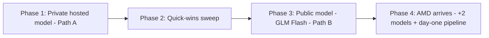

# OpenRouter Integration Plan

## Purpose

One consolidated deliverable for the [[OpenRouter Initiative]], merging the two reference artifacts under `reference/openrouter/` — the concepts/integration/provider source doc and the product-owner annotations that verified its claims against OpenRouter's own documentation. It carries three things: (1) how OpenRouter works as a marketplace, (2) the two integration paths and the verified requirements for each, and (3) the **sequenced execution plan** the initiative will actually run.

Where the reference annotations verified a claim against OpenRouter's published docs, the mechanic is stated here with its confidence; those facts are the constraints this plan is built to satisfy. This note plans and links; canonical definitions live in their own homes ([[OpenRouter Private Model Integration]], [[OpenRouter Provider Integration]], [[Model Catalog Endpoint]], [[Billing & Payment]]).

## How OpenRouter Works (the scoreboard we don't control)

OpenRouter is a marketplace/abstraction layer in front of many providers. It makes **two independent routing decisions**: which model answers, and which provider serves that model. Rack AI competes only on the second — provider selection among competing endpoints for the *same* model (`measured`).[^routing]

- **Routing modes** are chosen per request: Balanced (price + speed), Nitro (fastest), Exacto (highest tool-calling accuracy). Provider selection defaults to load-balancing across top providers for uptime (`measured`).[^routing]
- **The fee is buyer-side, not a cut of provider revenue.** OpenRouter passes the provider's list price to the buyer and earns at the payment boundary (a platform fee of roughly 5.5% on credit purchases, ~5% crypto; a 5% BYOK surcharge above a free allowance). The effect on a provider is that the fee raises the *effective* price a user pays for its tokens, which can dampen price-routed traffic — not that it shrinks per-token revenue. Provider payout/settlement terms are unverified (`derived`).[^fee]
- **Price routes first, then performance.** If cost/token forces a price above the cheapest competent provider, performance alone wins little traffic. This is the central tension with a performance-led vision (`derived`).[^routing]

## The Two Integration Paths

These are two different products, not two configurations of one. This is the linchpin distinction the plan is built on.

| Path | What it is | Key dependencies | Maturity |
|------|-----------|------------------|:--------:|
| **A — [[OpenRouter Private Model Integration\|Private Models]]** | Register an existing RackAI tenant [[Model Deployment]] as a restricted, non-public model, callable only by approved users/orgs (never publicly listed, ranked, or benchmarked)[^private] | RackAI per-deployment endpoint (**exists**) + [[API Key]] support + OpenAI-format validation + Enterprise plan | Near-term (weeks *if* dependencies hold) |
| **B — [[OpenRouter Provider Integration\|Public Provider]]** | Rackspace operates public, multi-tenant inference-as-a-service that OpenRouter routes arbitrary traffic to | Inference-as-a-service, [[Billing & Payment]], [[Model Catalog Endpoint]] (`/models`), streaming/usage confirmation | Multi-quarter |

Path A is a documentation-and-access exercise on top of what already ships. Path B is a new product line and is where every P0 blocker lives. Both paths are now modeled in the strategy narratives: the [[Rack AI OpenRouter Strategic Vision]] and [[Rack AI OpenRouter Engineering Roadmap]] sequence Path A first, then execute the Path B build their phases describe.

## Verified Provider Requirements (Path B gates)

Sourced from OpenRouter's provider docs via the annotations, with confidence noted. These are the gates a public-provider application is checked against.

| Requirement | Priority | Verified mechanic | RackAI reality |
|-------------|:--------:|-------------------|----------------|
| Automated payment (auto top-up **or** invoicing) | P0 | Hard onboarding gate — OpenRouter must be able to pay the provider automatically (`measured`)[^providers] | No billing; billing is an explicit platform non-goal → [[Billing & Payment]] |
| `/models` catalog on OpenRouter's typed schema | P0 | Per-modality pricing/capacity/datacenter/compliance; `is_ready` gates go-live and requires a declared price (`measured`)[^providers] | Not provided today → [[Model Catalog Endpoint]] |
| Native token streaming (SSE, emit as generated) | P0 | Throughput = output tokens ÷ generation time, which includes TTFT; keep-alives avoid fetch-timeout failover (`measured` requirement; endpoint conformance `assumed` until tested)[^providers] | Unconfirmed — first-week validation task |
| OpenAI-compatible `/chat/completions` + token usage | P0 | Required for both streaming and non-streaming (`measured`)[^providers] | Endpoint shipped (strongest asset); usage payload is a validation task |
| Accurate error codes | P0 | Published code→uptime map: 401/402/404/5xx/mid-stream hurt uptime; 400/413/429/403 do not (`measured`)[^providers] | Returns k8s-style errors (e.g. 422); needs mapping layer + 429 |
| Admission control + early 429 under load | P1 | 429s are tracked separately and don't dent uptime; *chronic* 429s reduce evaluable volume (`measured`)[^providers] | KEDA autoscaling shipped; load-shedding/429 not — punches above its weight for rank |
| Reliable tool calling | P1 | Auto Exacto reorders tool requests by tokens/sec + tool-call success + benchmark accuracy vs peers; needs volume thresholds before evaluation (`measured`)[^providers] | Model/runtime-specific; harness must measure tool-call success |
| Compliance flags (ZDR, HIPAA, …) | P1 | Boolean flags that drive routing; declaring falsely routes traffic that can't be lawfully served (`measured`)[^providers][^residency] | RackAI makes no HIPAA/SOC2/GDPR/ZDR claims — declare only what's true |
| Multi-region / declared datacenters | P1 | Declared per modality (`measured`)[^providers] | Single-cluster by design — a known ceiling |

Uptime tiers (published, `measured`): ≥95% normal routing; 80–94% degraded/lower priority; <80% last-resort fallback; only computed after 100+ requests.[^providers] The full requirement register with owners lives in the [[Capability Gap Register]].

## The Sequenced Plan

The initiative runs in four ordered movements. The logic: buy real OpenRouter experience cheaply first, land one credible public model that fits our constrained hardware, clear the cheap blockers in one pass, then scale into a repeatable pipeline once AMD capacity expands what we can serve.

### Phase 1 — Private hosted model first (Path A): buy the experience

Pursue [[OpenRouter Private Model Integration]] first, deliberately, to obtain **integration experience, real telemetry, and early wins** before committing to the heavy public-provider build. Path A reuses the shipped per-deployment OpenAI-compatible endpoint, so it is a documentation-and-access exercise, not a new product.

- Confirm [[API Key]] support ETA (the primary dependency) and resolve the "straightforward?" caveats — endpoint auth, OpenRouter's private-model validation, Enterprise-plan mechanics.
- Validate a RackAI deployment as an OpenRouter private model end-to-end; write customer docs; pilot with one enterprise tenant.
- Confirm streaming + token-usage behavior on a real deployed model (also needed for Phase 3). Record pass/fail as a validation item.
- **Outcome:** first real OpenRouter telemetry, a revenue story, and de-risking of the whole initiative — with no billing dependency (usage bills to the tenant's own OpenRouter account).

**What Path A does and does not validate (be precise).** Private models are not publicly listed, ranked, or benchmarked. So Path A validates the **integration surface** — endpoint OpenAI-conformance, streaming/token-usage correctness, the OpenRouter onboarding relationship, and real request/latency telemetry under a real workload. It does **not** validate the competitive thesis — provider-selection routing, price-sensitivity, or rank dynamics — because none of those apply to a private, non-routed endpoint. Path A is integration de-risking, not strategy proof. The strategy is first tested in Phase 3.

### Phase 2 — Quick-wins sweep: knock out the cheap blockers in one pass

Between the paths, clear the low-lift, high-leverage items in a single sweep — the changes that protect OpenRouter rank and unblock Phase 3 without the big architectural lifts.

- **Error-code mapping layer** in the serving proxy (map to OpenRouter's expected codes; surface overload as 429, not 500s/timeouts).
- **Admission control + early 429 under load** — pull [[Admission Control Policy]] earlier; cheap and directly protects rank.
- **Streaming + token-usage confirmation** promoted from Phase 1 into recorded validation items — no P0 may sit at `assumed`.
- **Draft capability-declaration + compliance scope** honestly (mostly documenting known facts; get security's real read so we don't over-claim).
- **Outcome:** the parts of Path B that don't depend on billing or IaaS are done, so the public-model launch isn't waiting on them.

### Phase 3 — One public model (Path B): GLM 5.3 Flash

Target a single public model for provider hosting. The selection criteria are exactly the [[First Bet — GLM 5.3 Flash]] logic: a model that **fits our limited hardware** (NVL-PCIe topology ceiling, ~27B class — see [[Fleet Competitiveness]]), is **trending** (current breakout mover on the [[OpenRouter Leaderboard Snapshot]]), has **sufficient overall token usage**, and has **strong coding use cases** (its growth is in coding/agentic workloads). Execution follows the [[Phase 1 Execution Plan — GLM 5.3 Flash Proof Point]].

- Now the bigger Path B elements are tackled **according to priority**, in dependency order: **billing/payment** (the gate — escalate funding), then **inference-as-a-service** (the shared multi-tenant serving lift), then the **`/models` catalog** to OpenRouter's schema (needs pricing → needs billing).
- Confirm GLM fits 2–4 H100 at FP8 (the one open dependency — [[GPUs per Replica]], [[Open Questions]]); deploy via the standard contract; optimize for the prefix-heavy workload; meet API conformance before chasing rank; publish and measure against competing GLM providers.
- **Outcome:** Rack AI is a measurable public provider on one model that fits what we can serve well, with the first `measured` entries on its scorecard.

### Phase 4 — AMD arrives: add two models + the day-one pipeline

Once the [[AMD Instinct]] MI350P capacity arrives and is available (confirm quantity/ETA ~Oct 2026 — [[Open Questions]]), the constrained-hardware ceiling lifts enough to broaden the portfolio.

- **Evaluate 2 more models** to add to the public portfolio, screened through the same fit filter now that AMD expands servable model classes (carry GLM's config forward to the MI350P pool).
- **Establish the rapid deployment pipeline** — the [[Model Radar]] + [[Model Launch Factory]] machinery — needed to hit the <24h median / <72h P90 launch lag so we can **compete on day one** for newly released models.
- **Outcome:** the enduring asset — a repeatable weights→production→optimized→published pipeline — not just three hand-placed models.

## Sequencing at a Glance

| Phase | Move | Path | Primary dependency | Success signal |
|-------|------|:----:|--------------------|----------------|
| 1 | Private hosted model | A | [[API Key]] support | Live private model + first telemetry |
| 2 | Quick-wins sweep | — | Serving-proxy work (cheap) | Error mapping, 429/admission, streaming/usage confirmed |
| 3 | Public GLM Flash | B | [[Billing & Payment]], IaaS, `/models` | GLM public + measured scorecard |
| 4 | +2 models + pipeline | B | [[AMD Instinct]] MI350P capacity | Repeatable day-one launches |

## Go / No-Go Gates

Each phase advances only when its gate is met. Gates convert the plan's risks into explicit decision checkpoints rather than assumptions.

| Gate | Before | Criterion to pass | If it fails |
|------|--------|-------------------|-------------|
| **G1 — Path A dependencies hold** | Phase 1 | [[API Key]] support available; OpenRouter private-model validation + Enterprise-plan mechanics confirmed straightforward | Escalate/resequence; run the API-key-independent Phase 2 items in parallel meanwhile |
| **G2 — Integration surface proven** | Phase 3 | Streaming, token-usage, and error-code conformance all pass on a real deployment (recorded validation items — no P0 at `assumed`) | Hold public launch; fix conformance first |
| **G3 — Price competitiveness** | Phase 3 public launch | Projected GLM cost/token on SPOT H100 FP8 lands within the competitive band of current GLM providers on OpenRouter (price routes first) | Hold public launch; revisit hardware/quantization or defer to AMD economics |
| **G4 — Billing funded + owned** | Phase 3 build | Automated payment (auto top-up or invoicing) is funded with a named owner — it is currently a platform non-goal | Public path (Path B) stays blocked; remain on Path A |
| **G5 — AMD capacity available** | Phase 4 | MI350P quantity + ETA confirmed and capacity live | Portfolio expansion + day-one pipeline wait; GLM continues solo |

The critical path is **not fully serial**: the Phase 2 serving-proxy items (error-code mapping, streaming/usage confirmation, admission control + 429) do not depend on the G1 API-key gate and can proceed in parallel if Path A stalls.

## Executive Q&A — Risks & Mitigations

Anticipated questions from a technical executive reviewing this plan, with the honest answer and where it is tracked.

| Concern | Answer / mitigation |
|---------|---------------------|
| **Private models are invisible — what does Path A actually earn us?** | Integration de-risking, not strategy proof. It validates our endpoint conformance, streaming/usage, the OpenRouter relationship, and real telemetry; it does not test competitive routing or price-sensitivity (those first appear in Phase 3). Stated explicitly in Phase 1. |
| **Where are the economics — build cost, revenue, margin?** | `assumed` today; internal cost/GPU-hour is unestablished and OpenRouter payout terms are unverified. Phases 1–2 are cheap and exist precisely to produce the cost + telemetry data for a real Phase 3 business case. We do not ask for billing/IaaS investment until GLM's measured tokens/GPU-second and confirmed payout terms exist. See [[Capability Gap Register]], [[Cost per GPU-Hour]]. |
| **Price routes first — will we get any public traffic if our cost/token can't beat the cheapest competent GLM provider?** | Genuine risk. Gate **G3** makes it a go/no-go: benchmark projected cost/token against live competitor prices before the public launch, and hold if we can't reach the competitive band. |
| **Phase 3 hides the two biggest lifts (billing + IaaS) as bullets.** | Correct — they are multi-quarter workstreams, not steps. Billing is gated by **G4** (funding + owner; currently a platform non-goal); inference-as-a-service is the shared multi-tenant serving build. "Top-five rank / <24h launch" are Phase 3–4 outcomes, not near-term. |
| **Phase 1 is fully gated on API keys — what if it slips?** | Gate **G1** with a resequence path: the Phase 2 serving-proxy quick-wins run independently of the API-key gate, so a Path A stall does not stall the whole program. |
| **Single-cluster, no multi-region, no compliance certs — what revenue is off the table?** | No data-residency/geo-routed deals and no regulated-workload (HIPAA/etc.) deals until multi-cluster + certifications. Acceptable for a GLM coding-workload launch, which is not residency-sensitive — the constraint fits the chosen first model deliberately. |
| **Concentration risk: one model, one hardware type, one marketplace.** | Intentional for a fast proof point. SPOT H100 serving public traffic is a real tension against the >99.9% availability target — flagged. Phase 4's repeatable pipeline is the diversification hedge (more models, AMD capacity). |

## Open Decisions

- **Path A vs B commitment** — this plan recommends A-then-B; the sequencing above assumes leadership confirms it. Tracked in [[Open Questions]].
- **Billing ownership/funding** — the Phase 3 gate; billing is currently a platform non-goal. Tracked in [[Open Questions]] and [[Capability Gap Register]].
- **API Key ship status** — the Phase 1 gate. Tracked in [[Open Questions]].
- **AMD MI350P quantity + ETA** — the Phase 4 trigger (gate G5). Tracked in [[Open Questions]].
- **Price competitiveness (gate G3)** — whether projected GLM cost/token lands in the competitive band before public launch. Tracked in [[Open Questions]].
- **SPOT-capacity reliability** — whether preemptible SPOT H100 can meet >99.9% availability for public traffic. Tracked in [[Open Questions]].

## Confidence

`derived` — a recommended sequencing built from verified OpenRouter mechanics (`measured` where the sources below are OpenRouter's own docs) applied to the platform's shipped-vs-planned reality and the fleet's topology constraint. Numeric targets (24h launch, top-five rank) remain `assumed` until validated.

## Sources

Externally verifiable OpenRouter mechanics cited above trace to OpenRouter's own documentation (`measured`), except the fee schedule, which is `derived` from secondary sources. Content was rephrased for compliance with licensing restrictions.

[^routing]: OpenRouter — [Providers, Fallbacks & Auto Router](https://openrouter.ai/blog/insights/model-routing/) and [Provider selection](https://openrouter.ai/docs/guides/routing/provider-selection/). Two independent routing decisions, the three request-level routing modes, and price-first provider selection.
[^fee]: Fee schedule (`derived`, secondary): [amnic — OpenRouter Pricing](https://amnic.com/blogs/openrouter-pricing); [apimart — Pricing Explained](https://apimart.ai/blog/openrouter-pricing-explained-model-costs-credits-provider-routing); [Ry Walker — OpenRouter research](https://rywalker.com/research/openrouter). Provider payout/settlement terms remain unverified.
[^private]: OpenRouter — [Private Models](https://openrouter.ai/docs/guides/routing/private-models). Private models route only to approved users/orgs and never appear in public lists, rankings, search, charts, or benchmarks.
[^providers]: OpenRouter — [For providers](https://openrouter.ai/docs/guides/guides/for-providers) and [Become a Provider](https://openrouter.ai/providers/apply). Automated-payment gate, the typed `/models` schema and `is_ready` launch gate, streaming/keep-alive requirements, the error-code→uptime map, the 429 handling, Auto Exacto tool routing, and the uptime tiers.
[^residency]: OpenRouter — [AI data residency](https://openrouter.ai/blog/insights/ai-data-residency/). Compliance flags (ZDR, HIPAA, …) are exposed to buyers as functional routing controls.

## See Also

- [[OpenRouter Initiative]]
- [[OpenRouter Private Model Integration]]
- [[OpenRouter Provider Integration]]
- [[First Bet — GLM 5.3 Flash]]
- [[Phase 1 Execution Plan — GLM 5.3 Flash Proof Point]]
- [[Capability Gap Register]]
- [[Product Hub]]
