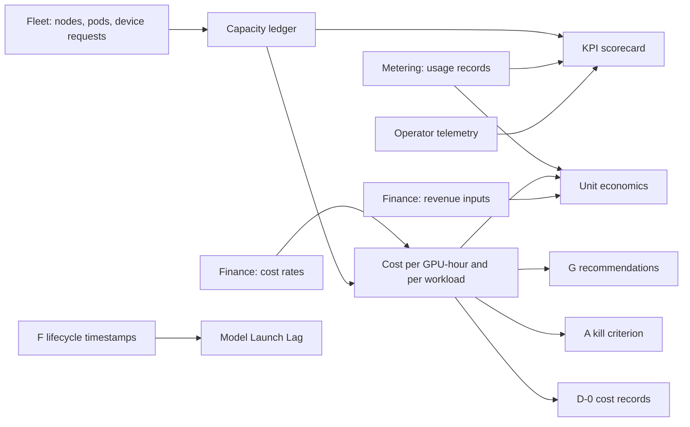

# Operator Economics & KPI Instrumentation — PRD

| Field | Value |
|:--|:--|
| Version | v0.2 |
| Status | Draft |
| Owner | rackai-product |
| Reviewers | Product owner; FinOps / finance; Metering team (platform engineering); Operations leadership; F owner (Model Launch Lag) |
| Product review | **Product-owner review disposition, 2026-10-10: conditional acceptance; not formal artifact approval.** PD-1 to PD-10 approved in principle (PD-3 as written; PD-4 with an explicit denominator and allocation basis, applied in v0.2). PD-11 to be revised into a reusable kill-threshold framework (done in v0.2, pending approval). FR-16 renamed to allocation utilisation. Shared contracts adopted |
| Product approval | not yet approved — recorded by the product owner only (who, date, version); passing checks is not approval |
| Date | 2026-10-10 |
| Roadmap items | Cost model (internal cost/GPU-hour); Unit economics & margin; Operator KPI instrumentation; Model Launch Lag instrumentation; Operational leverage (workloads/FTE) |
| Tech spec(s) | [[Operator Economics & KPI Instrumentation Tech Spec]] (v0.2 draft, not yet approved): covers Phase 1 and Phase 2; names the later phase only |

> **Artifact type: Product Requirements Document.** The canonical concepts are [[Cost per GPU-Hour]], [[Unit Economics Model]] (with its formulas) and [[Model Launch Lag]]. This PRD projects from them and must not redefine them. If they disagree, the canonical notes win and this PRD is stale.
>
> **Status banner.** *Draft PRD for a proposed initiative.* Requirements are intent, not commitments. No internal cost is modelled today, and none of the operator KPIs is measured (§2). Proposal **P-003** (decision **D2**). Every product decision below is *proposed*.
>
> **Scope line (read first).** This PRD owns **what operators and finance can know about RackAI's own economics and operating effectiveness**, in two separate halves: **financial economics** (internal cost per GPU-hour, cost per workload and per token, revenue and margin) and **operational effectiveness** (operator KPIs, Model Launch Lag, workloads per FTE). It does **not** own: usage capture itself (the [[Multi-Tenancy and Metering Spec]]); pricing, rating, invoicing or payment ([[Billing & Payment]]); raw operator telemetry such as GPU, VRAM, queue and power signals (Observability M1, [[Monitoring and Auditability Spec]]); anything a tenant sees, including the customer's spend and the evidence report (**D**); the evidence-informed recommendation that reads cost (**G**); the model lifecycle whose timestamps it measures (**F**).

## 1. Summary / Vision

RackAI meters usage but does not know what that usage costs. This PRD gives operators and finance one internal record of **which GPUs were available, which were allocated to what, and for how long**, captured from now on, and prices it with finance's cost inputs to produce cost per GPU-hour, cost per workload and, later, margin. On the operational side it turns the KPIs the corpus already defines (utilization, tokens per GPU-second, TTFT, Model Launch Lag) into measured numbers with history.

Why now: cost history can't be backfilled. GPU telemetry is kept for days, not months (§2). Every month without a ledger is a month of economics we can never reconstruct, and the Proof-1 commercial gate needs it (P-003).

## 2. Problem Statement

**What is missing today** (read-only survey; `RSS-Engineering/rackai@79ca4de` unless noted):

- **Usage is metered; cost is not.** `usage_records` holds tokens, workload type, execution type, GPU count and GPU type per workload (`pkg/metering/migrations/000001_usage_records.up.sql`). No CRD, table or service carries a price, rate or cost field. The only "price" in the code is a comment: execution type selects a price tier in the metering spec (`pkg/metering/event.go`). [[Cost per GPU-Hour]] has no value: *TBD*, `assumed`.
- **Inference rows carry no time.** `compute_secs`, `latency_secs` and `queue_secs` are zero on every inference row, and the operations guide says not to build a cost model on them (`docs/operations/metering.md`, Known gaps; `internal/meteringextproc/processor.go`).
- **Deployed GPU time is not metered at all.** The schema has a `model-deployment` workload type, but nothing produces those rows (`pkg/metering/event.go`; no producer in the tree). A dedicated model deployment holds its GPUs whether or not it serves traffic, and that is most of the cost.
- **Fine-tuning GPU time is metered on a branch, not on main.** The RACKAI-515 sidecar writes compute seconds (elapsed × GPU count) and token counts for fine-tuning rows (`RSS-Engineering/rackai@cfbfd8d:internal/ftmeteringsidecar/event.go`, migration `000006_usage_records_tokens`). It is not merged at `79ca4de`, where the usage API still says fine-tuning totals are zero until RACKAI-515 lands (`internal/usageservice/types.go`). The corpus records it as built (2026-10-08).
- **Capacity is a snapshot, never a history.** `AcceleratorClass.status` reports nodes, allocatable and used devices, now (`api/v1alpha1/acceleratorclass_types.go`; computed per pod in `internal/controller/acceleratorclass_controller.go`). Prometheus keeps GPU metrics for 7 days and the openCenter Mimir path for 30 (`charts/rackai-monitoring/values.yaml`). Nothing keeps a durable record of who held which GPUs.
- **No operator view exists.** The usage and observability APIs are tenant-namespaced only (`internal/usageservice/server.go`, `internal/observabilityservice/server.go`). The only fleet-grain series is a cluster-average GPU utilization rule (`charts/rackai-monitoring/templates/prometheusrule-cluster-recording-rules.yaml`). The console shows a current GPU-capacity bar and no usage, cost or KPI page (`rackai-ui@89bddb4:src/app/pages/home/gpu-overview/`). The docs have no metering or economics guide (`rackai-docs@ccb52a3`).
- **The KPIs are defined but unmeasured.** The four headline KPIs ([[KPI Hierarchy]]) have no baseline. [[Model Launch Lag]]'s <24h / <72h target is a roadmap target, never measured, and no pipeline stamps its start or stop event ([[KPI Telemetry Target List]] §4).

**Why it matters.** The operator identity rests on owning the economics ([[Three Battlegrounds]]). Without a cost floor every margin, price and placement trade-off stays `assumed`. PRD A's kill criterion needs cost per workload, and G's recommendations need cost data. **Hypothesis** (no evidence yet): a ledger of allocated GPU time, priced with finance's per-configuration rates, reconciles closely enough with finance's actual infrastructure cost to make decisions on.

## 3. Product Principles

1. **Capture quantities now; price them later.** GPU-hours lost are lost for good. Rates can arrive, and be corrected, after the fact.
2. **No invented numbers.** A cost is computed only from a rate finance supplied. With no rate, the answer is *no rate*, never zero and never a default.
3. **Allocated is what costs.** A GPU held by a workload costs the same whether it is busy or idle. Idle capacity nobody holds is shown as its own line, not hidden inside workloads.
4. **Every number says what it rests on.** Each figure carries the confidence of its weakest input (measured, derived, assumed), as the corpus's confidence-propagation rule requires.
5. **Internal economics stay internal.** Internal cost, rates and margin are for operators and finance only. Tenants see their usage and spend through D (the `charge` view), never our cost (the `internal` view).
6. **Two halves, shipped separately.** Operational KPIs don't wait for finance's cost inputs, and the cost model doesn't wait for KPI definitions.

## 4. Scope: Goals & Non-Goals

**Goals**
- From Phase 1 onwards, RackAI never again loses a period of GPU allocation history.
- Finance can state an internal cost per GPU-hour per hardware configuration, and cost per workload, from data that reconciles with the fleet.
- Product and finance can see cost per token, revenue per GPU-hour and margin per model, each labelled with its confidence.
- Operators can see the headline KPIs and Model Launch Lag with history and an honest baseline.

**Non-Goals / Out of Scope**
- Usage capture, quota and the billing link: [[Multi-Tenancy and Metering Spec]]. B reads usage; it does not change how usage is captured.
- Pricing, rating, invoices and payment: [[Billing & Payment]]. B's revenue inputs are finance-entered figures, not a billing system.
- Raw operator telemetry (GPU, VRAM, power, queue, cache): Observability M1 ([[Monitoring and Auditability Spec]]). B consumes it.
- Tenant-facing observability, spend and the evidence report: **D**. B contributes `cost` evidence records (D-0).
- Ranking placements by cost: **G**. B supplies the cost data G reads.
- The model lifecycle: **F**. B measures Model Launch Lag; F's lifecycle produces its timestamps.
- [[Cost per Outcome]] and the outcome-level FinOps platform ([[AI FinOps]]): research thread, not in this PRD.
- Energy accounting beyond the power share inside a cost rate.

## 5. Users & Personas

| Persona | Half | Needs from B |
|---|---|---|
| **Finance / FinOps** | Financial | Enter cost inputs per hardware configuration; see cost per GPU-hour, per workload, per model; reconcile with actuals; margin per model |
| **RackAI product owner** | Both | Pricing hypotheses on real cost; kill-criterion evidence for A; Proof-1 commercial gate |
| **Platform operator / SRE lead** | Operational | Allocation utilisation, GPU activity, tokens per GPU-second, TTFT and idle capacity by pool and model, with history, to drive reallocation and procurement |
| **Model enablement (F owner)** | Operational | Model Launch Lag per launch and over time |
| **Operations leadership** | Operational (later) | Workloads operated per ops FTE: the Proof-4 acceptance measure |
| **Downstream PRDs** (A, D, G) | Platform | Cost per workload (A), `cost` evidence records (D), cost inputs to recommendations (G) |

Tenants are **not** users of this PRD.

## 6. Core Entities

| Entity | Role here |
|---|---|
| [[Cost per GPU-Hour]] | The coefficient Phase 1 gives a value, per hardware configuration |
| [[Unit Economics Model]] | The loop and formulas Phase 2 computes: [[Cost per 1M Tokens]], [[GPU-Hours per 1M Tokens]], [[Revenue per GPU-Hour]], [[Gross Margin per Model]] |
| [[OpenRouter Price]] | One revenue input for margin |
| [[Model Launch Lag]] | The operational KPI Phase 2 measures |
| [[Productive GPU Utilization]], [[Tokens per GPU-Second]], [[TTFT]] | The other headline KPIs ([[KPI Hierarchy]]) |
| [[Metering]] | Source of usage (tokens, fine-tuning compute) |
| [[Accelerator Class]], [[GPU Fleet]], [[Capacity Pool]] | What a hardware configuration is, and where capacity sits |
| [[Model Deployment]], [[Fine-Tuning Job]], [[Organization]] | The workloads and tenants cost is attributed to |
| [[Workload Declaration]] | Attribution key for cost per workload (A) |

**Defined here, not yet canonical** (only B uses them; they move to a canonical note if a second PRD consumes them):
- **Capacity ledger**: the durable, interval-by-interval record of GPU devices available and allocated, per hardware configuration, with each allocation attributed to a workload or marked *unallocated* or *system*.
- **Cost rate**: finance's effective-dated, versioned all-in cost per GPU-hour for one hardware configuration, with its components.
- **Realised cost per 1M tokens**: a workload's allocated cost for a period divided by the tokens it served. The canonical [[Cost per 1M Tokens]] formula is the *marginal* view (throughput-based, no fixed replica term); realised cost is the loaded view. Both are always labelled.
- **KPI scorecard**: the operator view of the headline KPIs and guardrails, by fleet, pool and model, with history.

## 7. User Journeys / Scenarios

**Worked example — Phase 1 cost per GPU-hour.** The ledger has been capturing since install. At month end, finance enters an all-in rate for the *NVIDIA H100* configuration, effective from the 1st, with its components (power, DC allocation, depreciation, network, storage, licensing, ops). No value is assumed here: the rate is finance's.
1. B multiplies each interval's allocated GPU-hours by the rate in force for that configuration.
2. Finance sees, for the month: available GPU-hours, allocated GPU-hours by tenant and workload, unallocated GPU-hours, and the cost of each. Cost per GPU-hour is labelled `derived` (finance-supplied rate × sampled hours).
3. Finance enters the actual infrastructure cost for the estate. B shows the variance against the ledger total.
4. In month two finance corrects the depreciation component. B recomputes month one under the new rate version and keeps the original figures as the closed-period record.

**Worked example — cost per workload for PRD A.** A managed declaration and a pinned one run the same model for a month. B reports each one's allocated GPU-hours and cost, keyed by declaration revision and origin. PRD A's kill-criterion review reads both.

**Worked example — Model Launch Lag.** A new open-weights model is published. The onboarding request (F) records the publication time and its source. When the first production endpoint for the model becomes ready, the stop time is recorded. B reports the lag, and the median and P90 over the quarter, with *no baseline* until the first launches complete.

## 8. Functional Requirements

### 8.1 Financial economics

**Phase 1: capacity ledger and cost model**

| # | Requirement | Priority | Notes |
|---|-------------|:--------:|-------|
| FR-1 | RackAI records, at a fixed interval no coarser than one hour, the GPU devices **available** and **allocated** per hardware configuration, from the first install onward | MUST | Capacity ledger. Starts before any cost rate exists (PD-1) |
| FR-2 | Each allocation is attributed to its holder: customer org, organization, project, workload type, workload (deployment or job), model, hardware configuration, execution type, and the declaration and revision where one exists. Capacity no workload holds is recorded as *unallocated*; capacity held by platform components as *system* | MUST | Declaration labels per A's spec §7 |
| FR-3 | The ledger is durable and append-only, kept beyond telemetry retention (D-5). It is never backfilled. A missed interval is recorded as a gap, never as zero | MUST | Principle 1 |
| FR-4 | For each interval and configuration, allocated + unallocated + system equals available. Any mismatch is flagged to operators | MUST | Integrity check |
| FR-5 | An authorised finance user can enter a **cost rate** per hardware configuration: an all-in amount per GPU-hour, its components, a currency, an effective-from date and a source reference. Rates are versioned; old versions are kept | MUST | Values are finance's (D-2); none is preset |
| FR-6 | Cost is computed as allocated GPU-hours × the rate in force for that configuration and interval, and records the rate version used. Where no rate is in force the result is *no rate*, not zero. A rate change recomputes affected open periods; closed periods keep their figures, and a restatement is shown beside them | MUST | PD-2 |
| FR-7 | Finance can see cost per GPU-hour per configuration and period, with available, allocated and unallocated GPU-hours beside it | MUST | Row 12 |
| FR-8 | Finance and product can see cost per workload per period (deployment, fine-tuning job, declaration revision), including whether the workload is declaration-managed or hardware-pinned | MUST | For A's kill criterion (PD-10) |
| FR-9 | For fine-tuning, the **billable quantity** is J's per-stage GPU-seconds usage rows ([[Fine-Tuning Operations PRD]] PD-6); **internal cost** comes from the ledger. B reconciles the two per job and stage, and shows the differences, including any GPU stage the ledger saw but metering did not (today every evaluation stage) | SHOULD | Reconciliation is B's check. Depends on RACKAI-515 being merged |

**Phase 2: unit economics and margin**

| # | Requirement | Priority | Notes |
|---|-------------|:--------:|-------|
| FR-10 | Cost per 1M tokens per model and deployment, in two labelled views. **Marginal** is the canonical [[Cost per 1M Tokens]] formula. **Realised** is the workload's allocated cost for the period ÷ (output tokens served in the same period ÷ 1e6); input and cached tokens are reported beside it. Every figure names its **allocation basis**: `allocated-device-seconds` for a dedicated workload; `token-share` for a tenant's share of a shared deployment, i.e. that deployment's allocated cost × the tenant's share of its output tokens. A workload that held GPUs but served **no traffic** in the period reports its full allocated cost as *idle-allocated cost*, and its realised cost per token as *no traffic*, never infinity or zero | MUST | PD-4 (clarified v0.2) |
| FR-11 | An authorised finance user can enter **revenue inputs**: list price per model and channel (e.g. [[OpenRouter Price]]) and contracted rates per customer, effective-dated and versioned, each labelled with its basis | MUST | No billing system exists (PD-6, D-4) |
| FR-12 | Revenue per GPU-hour, gross margin per model and contribution margin per estate, each carrying the confidence of its weakest input | MUST | Row 16 |
| FR-13 | Finance can enter the actual infrastructure cost per estate and period; B shows the variance against the ledger-derived total, and whether it is inside finance's tolerance (D-3) | MUST | Kill criterion input (§18) |
| FR-14 | Each customer-scoped workload's cost per day is emitted as **separate** D-0 `cost` records: an `internal` view (RackAI's cost; `audience: operator`), and, once a price input exists, a `charge` view (billable quantity × price; `audience: customer`). B also emits a daily `coverage` record counted from its own records | MUST | Interface to D (§11) |

### 8.2 Operational effectiveness

**Phase 2: operator KPIs and Model Launch Lag**

| # | Requirement | Priority | Notes |
|---|-------------|:--------:|-------|
| FR-15 | Operators can see a **KPI scorecard** of the four headline KPIs ([[KPI Hierarchy]]) by fleet, pool and model, with history and a baseline marked *none* until measured | MUST | Row 17 |
| FR-16 | Three utilisation measures are reported separately and never merged. (a) **Allocation utilisation** (reservation): GPU-hours allocated to customer workloads ÷ available GPU-hours, from the ledger, with idle (unallocated) capacity % beside it. (b) **Physical GPU activity**: device busy/activity from operator GPU telemetry (DCGM, AMD exporters) for allocated devices. (c) **Useful inference throughput**: [[Tokens per GPU-Second]] (FR-17). The canonical [[Productive GPU Utilization]] stays *not defined* in the scorecard until D-8 decides what counts as productive; allocation utilisation is never labelled productive | MUST | Renamed v0.2 (PO review); D-8 |
| FR-17 | [[Tokens per GPU-Second]] is computed per model and deployment from tokens served (metering) and allocated GPU-seconds (ledger) | MUST | |
| FR-18 | TTFT and the guardrails that have a definition ([[Availability]], [[TPOT]]) come from existing operator telemetry and are kept as durable rollups. Guardrails with no agreed definition (error rate, queueing delay, capability coverage) are shown as *not defined*, not computed | SHOULD | B adds no latency capture (PD-9) |
| FR-19 | Every model launch has a **Model Launch Lag record**: start time and its evidence (when usable weights became public), stop time and its evidence (first production endpoint ready), and the lag. Median and P90 are reported per period | MUST | Row 18; PD-8 |
| FR-20 | Until F's lifecycle stamps the times automatically, an operator can record them by hand with their source; hand-entered times are labelled as asserted | MUST | Measure from the first onboarding |

**Later phase**

| # | Requirement | Priority | Notes |
|---|-------------|:--------:|-------|
| FR-21 | **Operational leverage**: workloads operated per ops FTE, with the Proof-4 acceptance measures beside it (time to onboard, change failure rate, placement automation rate, gross margin, utilization, SLO attainment) | MAY (later) | Row 74; FTE source D-7 |

### 8.3 Access and audit (both halves)

| # | Requirement | Priority | Notes |
|---|-------------|:--------:|-------|
| FR-22 | All economics and KPI views are platform-scoped and permission-gated to operators and finance. Rates, cost and margin are never returned by a tenant-scoped API or shown to a tenant | MUST | PD-5 |
| FR-23 | Every cost-rate change, revenue-input change, actuals entry, period close, restatement and hand-entered launch time is audited with who, when and the before/after values | MUST | |
| FR-24 | Every figure can be exported (API and CSV) with its inputs, rate versions and confidence label | SHOULD | Finance works in its own tools |

## 9. Non-Functional Requirements

- **Completeness.** Ledger capture completeness (intervals captured ÷ wall-clock intervals elapsed, reconciled against `AcceleratorClass` totals as an independent source) is reported. Reports distinguish *complete collection of the intervals captured* from *complete observation of the fleet* (gaps). This is not D's `coverage` status ([[Verification Status Vocabulary]]); B's daily `coverage` records feed that status. The target is a posture, not a number: no unexplained gaps. There is no baseline because nothing is captured today.
- **Integrity.** Ledger rows are append-only; corrections are new rows. Cost figures are reproducible from ledger rows and rate versions.
- **Confidentiality.** Internal cost and margin are commercially sensitive. They sit behind a platform-scoped permission, never in tenant data paths, logs or metric labels.
- **Low overhead.** Sampling must not measurably degrade the control plane. The interval is set in the spec and measured.
- **Retention.** Long enough for year-on-year cost trends and depreciation periods (D-5); not erasable inside the window.
- **Multi-install.** Every record carries its installation, so estates can be compared and summed later without a schema change.

## 10. Platform Integration

| System | Needs from it | Provides to it |
|---|---|---|
| Identity & access (IAC) | Platform-scoped permissions for operators and finance (view economics, manage rates and revenue inputs, record launch times) | New permissions; nothing new for tenant roles |
| Tenancy & isolation | Tenant, organization and project identity for attribution | Nothing tenant-visible |
| Metering, quotas & billing | Usage records (tokens; fine-tuning compute when RACKAI-515 merges) | The cost and revenue view billing does not have. Builds no rating or invoicing |
| Audit | Audit pipeline | Events for every rate, input, close and restatement (FR-23) |
| Monitoring & observability | Operator telemetry (Observability M1): GPU, latency, availability | Durable KPI rollups and the scorecard; alerts on ledger gaps |

## 11. Loop Role & Cross-PRD Interfaces

**Loop role:** *Prove it*, for the operator's half: we prove what our own operation costs and how well it runs. It serves the **operator** promise ([[Three Battlegrounds]]): own the economics.

| Interface | Direction | Other PRD | Defined where |
|---|---|---|---|
| Cost per workload (per declaration revision, managed vs pinned) | provides | A (kill criterion) | This PRD (FR-8) |
| Declaration attribution labels on derived deployments | consumes | A | [[Workload Declaration & Placement Tech Spec]] §7 |
| `cost` evidence records (`internal` view to operators, `charge` view to customers) and daily `coverage` | provides | D | D-0 envelope ([[Customer Observability & Evidence Report PRD]]); B names the `cost` claim (spec §4.8) |
| Cost data per model × hardware | provides | G | This PRD (FR-8, FR-10); G reads it |
| Model Launch Lag (measured) | provides | F (success metric) | [[Model Launch Lag]] (canonical); record in this PRD (FR-19) |
| Lifecycle timestamps (weights public, endpoint ready) | consumes | F | [[Model Lifecycle PRD]] |
| Fine-tuning billable GPU-seconds (usage rows) | consumes | J | [[Fine-Tuning Operations PRD]] PD-6, PD-9 (J emits usage; B computes cost and charge, and reconciles them, FR-9) |
| Usage records | consumes | Metering (no PRD letter) | [[Multi-Tenancy and Metering Spec]] |

## 12. Failure Handling

Stated in [[Failure Mode Taxonomy]] terms (v0.2). B is an observer: none of its failures stops or slows a customer workload.

| Failure | Class | Response | Continues / stops / degrades | Notified | Exposure limit |
|---|---|---|---|---|---|
| Ledger sampler down or behind | Evidence | **Fail open** for the platform: the interval is recorded as a gap and never interpolated | Workloads continue; figures spanning the gap **degrade** (marked incomplete) | Operator (alert) | Buffered intervals (bounded, set in the spec); beyond that, a recorded gap |
| Ledger store unavailable | Evidence | Buffer, then gap, as above | As above | Operator | As above |
| Audit write fails for a rate, input, close or launch time | Evidence | **Fail closed**: the input is refused | Nothing changes | The user who entered it (error) | None: no unaudited input exists |
| Invalid rate or input | Admission | **Fail closed**: refused with the reason | Nothing changes | The user | None |
| Authorisation source unavailable | Authority | **Fail closed** for every economics read and write | Workloads unaffected | Caller (error); operator if prolonged | None |
| No cost rate in force | — (not a failure) | Cost reported as *no rate*; never zero, never a default | Cost figures **degrade** (incomplete totals) | Finance (dashboard) | n/a |
| Usage missing for a period | Metering (consumed) | Realised cost per token and tokens per GPU-second **degrade** to *no usage data*; no `charge` record is emitted | Internal cost continues from the ledger | Operator | Metering's own exposure limit applies (owned by Metering and J/I, not B) |
| D-0 emission fails | Evidence | Retry, idempotent | Emission **degrades**; D's `coverage` for B shows incomplete | Operator (alert) | Until D's coverage alert threshold |
| Reconciliation outside tolerance | — (a finding, not a failure) | Period is flagged; close **fails closed** without a recorded finance override | Open period continues | Finance | n/a |

**Guaranteed never to happen:** an invented or defaulted cost value; internal cost or margin exposed to a tenant; a closed period silently changed; a workload stopped or slowed by an economics failure or a kill-threshold breach (§18).

## 13. Data Retention & Compliance

The ledger holds capacity and attribution metadata, no customer content. Rates, revenue inputs and actuals are commercially sensitive finance data. Retention is set per installation (D-5), at least as long as `usage_records` (default 365 days per the metering spec) and long enough for year-on-year comparison. Records are not erasable inside the window. Audit of changes follows the platform audit retention.

## 14. Scope & Phasing

| Phase | Gate | Delivers | Roadmap items |
|---|---|---|---|
| **1** (financial) | MOE-0 | Capacity ledger (FR-1 to FR-4), cost rates and cost per GPU-hour (FR-5 to FR-7), cost per workload (FR-8, FR-9), access and audit (FR-22 to FR-24) | Cost model (internal cost/GPU-hour) |
| **2** (financial) | MOE-1 | Cost per token, revenue inputs, margin, reconciliation, `cost` evidence records (FR-10 to FR-14) | Unit economics & margin |
| **2** (operational) | MOE-1 | KPI scorecard (FR-15 to FR-18); Model Launch Lag records (FR-19, FR-20) | Operator KPI instrumentation; Model Launch Lag instrumentation |
| **Later** (operational) | MOE-2 | Operational leverage (FR-21) | Operational leverage (workloads/FTE) |

Sequencing: ship the ledger first, on its own, even before finance has a single rate. Model Launch Lag hand entry (FR-20) can start with the first onboarding, before the rest of Phase 2.

## 15. Acceptance Criteria & Success Metrics

**Acceptance criteria** (each pass/fail; proposed, not approved). Each names its expected result, evidence source and release gate ([[Release Readiness States]]). Milestones are in the spec (§13).

| # | Criterion (expected result, pass/fail) | Verifies | Evidence source | Gate |
|---|---|---|---|---|
| AC-1 | On a test estate with known workloads, every interval over a 24-hour run has a ledger record per configuration, and each allocation names its holder (or *unallocated* / *system*) with every FR-2 attribute, including evaluation-stage fine-tuning pods | FR-1, FR-2 | Integration test report (CI); ledger query output | M1 · MOE-0 |
| AC-2 | When the sampler is stopped for several intervals and restarted, those intervals appear as gaps, not zeros, and no earlier row has changed | FR-3 | Fault-injection test report; row checksum before/after | M1 · MOE-0 |
| AC-3 | For every interval, allocated + unallocated + system = available, and the totals equal `AcceleratorClass` status; an injected mismatch raises an operator alert | FR-4 | Property-test report; alert firing record | M1 · MOE-0 |
| AC-4 | A finance user can create a rate version; a tenant admin, ML engineer or billing-admin is refused; every change is audited with acting principal and before/after values | FR-5, FR-22, FR-23 | Route-map test report; `economics` audit rows | M2 · MOE-0 |
| AC-5 | With no rate in force, cost is reported as *no rate*; after a rate is entered, cost equals allocated GPU-hours × rate to the cent, and records the rate version | FR-6, FR-7 | API test report | M2 · MOE-0 |
| AC-6 | Changing a rate recomputes open periods; a closed period keeps its original figure and shows the restatement beside it | FR-6 | API test report across a period close | M3 · MOE-1 |
| AC-7 | For a managed and a pinned deployment of the same model, cost per workload is reported per declaration revision with its origin | FR-8 | API test report with A's labels set | M2 · MOE-1 (blocked-by: A M4 declaration labels) |
| AC-8 | Marginal and realised cost per 1M tokens are both returned, each naming its allocation basis and denominator; a workload with allocation and no traffic returns its full idle-allocated cost and *no traffic* for realised cost per token; a shared deployment's tenant shares sum to its allocated cost | FR-10 | API test report over dedicated, shared and zero-traffic fixtures | M3 · MOE-1 |
| AC-9 | Margin per model returns the confidence of its weakest input (e.g. `assumed` when revenue is a list-price input) | FR-11, FR-12 | API test report | M3 · MOE-1 |
| AC-10 | Entering actuals outside tolerance flags the period and blocks close until a finance override is recorded | FR-13 | API test report; audit row of the override | M3 · MOE-1 |
| AC-11 | Each customer-scoped workload produces one `internal` `cost` record per day with `audience: operator`, and a `charge` record with `audience: customer` only when a price input exists. Both validate against D-0 and carry `scope.authorityPrincipal`; re-emitting creates no duplicate; the daily `coverage` counts match B's ledger and carry a watermark | FR-14 | `pkg/evidence` validation report; D's `coverage_results` for B | M3 · MOE-1 (blocked-by: D M1 `pkg/evidence`; C M2 `authority.PrincipalFor`) |
| AC-12 | The scorecard shows allocation utilisation, GPU activity, tokens per GPU-second, TTFT and Model Launch Lag by fleet, pool and model for a past period older than the telemetry retention window, and never labels allocation utilisation as productive | FR-15 to FR-18 | Integration test report with aged data; console check | M4 · MOE-1 |
| AC-13 | A launch recorded by hand shows its lag labelled *asserted*; one stamped by F's lifecycle shows it labelled *measured*; median and P90 are correct over a seeded set | FR-19, FR-20 | API test report | M4a (asserted) · M4 (measured; blocked-by: F production-publication marker) |
| AC-14 | No tenant-scoped endpoint, log line or metric label contains a rate, internal cost or margin value | FR-22 | Negative API sweep report; e2e log and label scan | M2 · MOE-0, re-run at M5 · MOE-1 |
| AC-15 | A kill-threshold breach (§18) opens a product review record naming the owner and due date, and changes no workload, price or product state | §18, PD-11 | Test: breach fixture → review record; no state change in placement, metering or catalog | M3 · MOE-1 |

**Success metrics** (ladder; baselines are "none today"; targets are postures to instrument, not values):

1. **Capture:** ledger capture completeness from install. Baseline: nothing captured.
2. **Cost known:** share of GPU-hours priced with a finance rate (vs *no rate*). Baseline: none; [[Cost per GPU-Hour]] is *TBD*.
3. **Cost trusted:** reconciliation variance against finance actuals, per closed period, inside finance's tolerance. Baseline: none.
4. **Cost used:** decisions that cite B's figures (pricing, PRD A kill review, procurement trigger, G recommendations). Baseline: none.
5. **Operations measured:** headline KPIs with a measured baseline. Baseline: zero of four.
6. **Launch lag:** median and P90 of [[Model Launch Lag]], starting from the first onboarding. The <24h / <72h figures stay roadmap targets until measured.

## 16. Dependencies

- **Metering** ([[Multi-Tenancy and Metering Spec]]): usage records; RACKAI-515 merged to main for fine-tuning cross-checks (FR-9); metering enabled in each install (it is off by default in the chart).
- **Finance:** cost components and rates per configuration (D-2), revenue inputs (D-4), actuals (FR-13). These are finance data, not engineering outputs.
- **A (consumer requirement / requested interface change to A):** declaration attribution labels on derived deployments must be *must have*; A spec §7 lists them as *nice to have* in A's M4. For product review.
- **C:** the authority principal for an Organization, from C's `authority.PrincipalFor` ([[Authority Context]]; C spec §4.13, C M2), stamped on B's evidence records. B never derives it from CustomerOrg.
- **J:** per-stage GPU-seconds usage rows (the billable quantity, J PD-6). Evaluation-stage metering is a gap today; B's ledger still sees the GPU time.
- **Observability M1:** operator telemetry for TTFT and guardrails.
- **F:** lifecycle timestamps for Model Launch Lag.
- **D:** the D-0 evidence envelope.
- **Decision (row 11):** per-profile SLO thresholds, only if "productive" is refined to SLO-meeting time (D-8). B does not decide it.
- **Depended on by:** A (kill criterion), D (cost records), F (success metric), G (cost data), J (fine-tuning cost).

## 17. Risks & Mitigations

| Risk | Mitigation |
|---|---|
| Finance can't supply rates at configuration grain soon | The ledger doesn't need them (PD-1); cost stays *no rate* and the gap is visible |
| Allocation-based cost overstates the cost of lightly used workloads | That is the true cost of holding GPUs; allocation utilisation, GPU activity and idle-allocated cost are shown beside it (PD-3, PD-4) and unallocated capacity is separate |
| Ledger sampling misses short-lived pods | Sampling interval set and measured in the spec; fine-tuning cross-check (FR-9) |
| Internal cost leaks to tenants | Platform-only permission, no tenant data path, negative test (AC-14) |
| Margin read as fact while revenue is a list price | Confidence label on every figure (AC-9); revenue labelled until billing exists |
| B drifts into building billing or customer spend | Non-goals; D owns spend, Billing & Payment owns rating |

## 18. Kill / Falsification Criterion

The bet is that **an allocation ledger priced with finance's rates gives decision-grade internal economics**, and that **measured KPIs change operating decisions**.

### 18.1 Kill-threshold framework (reusable; revised v0.2)

A kill threshold is a record with six fields. A threshold missing any field is not armed. Other PRDs (e.g. I) may adopt the same shape.

| Field | Meaning |
|---|---|
| **Metric** | The measured quantity, with its canonical note |
| **Measurement window** | The period(s) over which it is evaluated |
| **Minimum data coverage** | What share of the window must be captured and reconciled for the evaluation to count. Below it, the result is *insufficient data*, never *breach* |
| **Confidence requirement** | The weakest acceptable confidence of the inputs (e.g. `derived` with finance-supplied rates); weaker inputs give *insufficient data* |
| **Threshold** | The breach condition, set by its named owner. No default value |
| **Action** | Always an **explicit product review**: a review record with owner, evidence and a due date. A breach **never** automatically stops, terminates, re-prices or withdraws a product or a workload |

Outcomes: *within threshold*, *breach → product review*, or *insufficient data* (itself reported to the owner).

### 18.2 B's thresholds

| | Financial half | Operational half |
|---|---|---|
| Metric | Variance of ledger-derived total cost against finance actuals, per estate (FR-13) | Number of reallocation, procurement or launch-prioritisation decisions that cite the scorecard or launch lag |
| Window | Two consecutive closed periods | MOE-1 operating period |
| Minimum data coverage | Ledger capture completeness and rate coverage per closed period, at a level finance sets (D-3) | Scorecard available for the whole window (AC-12 passed) |
| Confidence | `derived` or better: finance-supplied rates and actuals | Decisions recorded in MOE-1 review notes |
| Threshold | Outside finance's tolerance (D-3) in both periods, and not explained by missing inputs | Zero citing decisions |
| Action | Product review. The proposed outcome: stop building margin on the ledger, keep the ledger (still the only allocation history), and move the cost model to finance's tools, fed by ledger exports | Product review. The proposed outcome: stop extending the scorecard and keep only the KPIs a decision used |

## 19. Open Decisions

| # | Decision | Owner | Blocks |
|---|----------|-------|--------|
| D-1 | Who owns the cost model and its inputs: FinOps or the Metering team? (P-003's adoption blocker; row 12 names Abhimanyu as potential owner) | Product owner, with finance | Phase 1 ownership |
| D-2 | Cost components and how shared costs (power, DC, network, ops) are allocated per hardware configuration | Finance | FR-5 values |
| D-3 | Reconciliation tolerance and period-close cadence | Finance | FR-13, §18 |
| D-4 | Revenue inputs until a billing system exists: list prices only, or contracted rates too, and who enters them | Product owner, with finance | FR-11 |
| D-5 | Ledger retention period per installation (at least the `usage_records` default) | Product owner, with compliance | FR-3, §13 |
| D-6 | What evidence fixes the Model Launch Lag clock start (e.g. the upstream publication time), and who records it | F owner, with product owner | FR-19, FR-20 |
| D-7 | FTE data source and the definition of an "operated workload" | Operations leadership | FR-21 (later) |
| D-8 | What counts as **productive** GPU time for [[Productive GPU Utilization]]: allocated time that served traffic, physically active time, or SLO-meeting time (goodput, which depends on row 11)? Until decided, the scorecard shows the three FR-16 measures and marks productive *not defined* | Product owner | FR-16 headline KPI |

## 20. Proposed Product Decisions

| # | Decision | Alternatives considered | Why this one | Status |
|---|---|---|---|---|
| PD-1 | **Capture quantities now, price later.** Phase 1's first deliverable is the capacity ledger, shipped before any cost rate exists; rates are effective-dated and applied to the history | Wait for finance's cost model; compute from Prometheus on demand | History can't be backfilled and telemetry is kept for days (§2). Rates can be applied after the fact; hours can't | proposed — approved in principle 2026-10-10 (PO review) |
| PD-2 | Cost per GPU-hour is **per hardware configuration, all-in, effective-dated and finance-owned**. B never presets or defaults a value; no rate means *no rate* | One blended fleet rate; an engineering placeholder | Matches the canonical definition; avoids invented numbers | proposed — approved in principle 2026-10-10 (PO review) |
| PD-3 | **Cost follows allocated GPU time**, busy or idle. Unallocated capacity is its own line and is not spread across workloads by default | Utilization-weighted cost; spread all capacity across workloads | Allocation is what a tenant takes from the fleet; spreading hides idle cost that procurement and pricing need to see | proposed — approved in principle 2026-10-10 (PO review), as written |
| PD-4 | **Two cost-per-token views, always labelled:** marginal (canonical formula) and realised (allocated cost ÷ output tokens in the same period). Margin uses realised. Every figure names its allocation basis (`allocated-device-seconds` or `token-share` of a shared deployment) and denominator; zero-traffic workloads show idle-allocated cost and *no traffic* (FR-10) | Marginal only; realised only | Marginal drives routing and efficiency; realised is what the business pays. Showing one alone misleads | proposed — approved in principle 2026-10-10 (PO review), with clarification (explicit denominator and allocation basis, including no-traffic workloads), applied v0.2 |
| PD-5 | **Internal economics are operator and finance only.** A new platform-scoped permission; the tenant `billing-admin` role gets nothing new | Expose cost to tenant billing admins | Commercially sensitive; tenant spend belongs to D | proposed — approved in principle 2026-10-10 (PO review) |
| PD-6 | **Revenue for margin is a finance-entered input** (list price, contracted rate), labelled with its basis, until a billing system of record exists. B builds no pricing or billing | Wait for billing; build rating in B | Margin is needed at the Proof-1 gate; billing is a separate gap | proposed — approved in principle 2026-10-10 (PO review) |
| PD-7 | **The two halves are separate sections and ship separately.** KPI work doesn't wait for finance inputs | One combined release | Different users, inputs and readiness | proposed — approved in principle 2026-10-10 (PO review) |
| PD-8 | **B owns the Model Launch Lag record and its computation; F's lifecycle supplies the timestamps.** Hand entry, labelled *asserted*, is allowed from the first onboarding | F owns the metric end to end; wait for automation | Answers PRD A's hand-off to F: B instruments, F uses it as a success metric. A baseline exists before the target is committed | proposed — approved in principle 2026-10-10 (PO review) |
| PD-9 | **B adds no latency or GPU telemetry capture.** It computes KPIs from existing operator telemetry, metering and the ledger, and keeps durable rollups only where history must outlive telemetry retention | Build a separate KPI pipeline | Reuse before duplicating; raw telemetry is Observability M1's | proposed — approved in principle 2026-10-10 (PO review) |
| PD-10 | **Cost per workload is keyed by declaration revision and origin** (managed vs hardware-pinned), so PRD A can compare them, using A's attribution labels | Per deployment only | Answers PRD A's hand-off: cost per workload is evidence for A's kill criterion | proposed — approved in principle 2026-10-10 (PO review) |
| PD-11 | **Kill thresholds use the reusable framework in §18.1** (metric, window, minimum data coverage, confidence requirement, owner-set threshold, action). A breach always opens an explicit product review and never silently stops or terminates a product or workload. B's thresholds are in §18.2; finance sets the tolerance (D-3) | A fixed percentage now; automatic stop on breach; the v0.1 two-line criterion | There is no baseline to set a percentage honestly; a review keeps the decision with the product owner; the framework can be reused by I | proposed — revise (PO review 2026-10-10): add measurement window, minimum data coverage, confidence requirement and defined action, with review on breach, and make it reusable — revised v0.2, pending approval |

## See Also

- [[Cost per GPU-Hour]] — the coefficient Phase 1 gives a value
- [[Unit Economics Model]] — the economic loop and formulas Phase 2 computes
- [[Model Launch Lag]] — the launch KPI Phase 2 measures
- [[KPI Hierarchy]] and [[KPI Telemetry Target List]] — the KPI set and its measurement contract
- [[Multi-Tenancy and Metering Spec]] — usage capture B reads
- [[Operator Economics & KPI Instrumentation Tech Spec]] — the engineering design
- [[Workload Declaration & Placement PRD]] — whose kill criterion reads cost per workload
- [[PRD Coverage Plan]] — where B sits and why it is wave 1
- [[RackAI Roadmap]] — P-003 and decision D2
