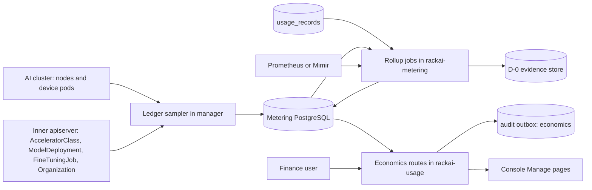
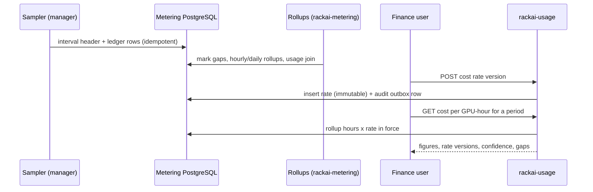

# Operator Economics & KPI Instrumentation — Technical Specification

| Field | Value |
|:--|:--|
| Version | v0.2 |
| Status | Draft |
| Author | Wiki agent for rackai-product (draft for platform engineering) |
| Reviewers | Platform engineering (control plane, metering); FinOps / finance; UI; Docs; Product owner |
| Engineering approval | not yet approved |
| Product review | **Product-owner review disposition, 2026-10-10: conditional acceptance; not formal artifact approval.** PRD B PD-1 to PD-10 approved in principle; PD-4 clarified (denominator, allocation basis, no-traffic workloads; §4.6); PD-11 revised to the reusable kill-threshold framework (PRD §18.1); FR-16 renamed to allocation utilisation (§4.9); shared contracts adopted (§9, §13). No ruling on DV-1 or DV-2 |
| Product approval | not yet approved |
| Date created | 2026-10-10 |
| Based on PRD(s) | [[Operator Economics & KPI Instrumentation PRD]] (v0.2 draft, not yet approved; spec drafted alongside per product-owner instruction 2026-10-10) |
| Roadmap items | Cost model (internal cost/GPU-hour); Unit economics & margin; Operator KPI instrumentation; Model Launch Lag instrumentation; Operational leverage (workloads/FTE) |
| Jira epic(s) | RACKAI-586 (cost model, row 12); others none yet: one epic per milestone (§13) to be created by platform engineering |

> **Artifact type: Technical Specification.** An authored engineering design. Its concepts have canonical notes: [[Cost per GPU-Hour]], [[Unit Economics Model]], [[Cost per 1M Tokens]], [[Gross Margin per Model]], [[Revenue per GPU-Hour]], [[Model Launch Lag]], [[Productive GPU Utilization]], [[Tokens per GPU-Second]], [[Accelerator Class]]. This spec designs how to compute them and does not redefine them.
>
> **Status banner.** *Proposed design; nothing is built.* Every design statement is `assumed`. Statements about today's code are `derived` from the read-only survey in §3, pinned to commits. *Operational leverage (workloads/FTE)* is a later phase: this spec names it (§13, Later) but does not design it, because its input (FTE data) has no source yet (PRD D-7).

### 0. Status markers (convention)

- **AS BUILT (YYYY-MM-DD, TICKET):** what shipped where it differs from the design above it.
- **PROPOSED, NOT BUILT (YYYY-MM-DD):** designed here, not implemented.
- **RETAINED FOR THE RECORD:** a rejected or replaced design kept for the decision record.

## 1. Overview

This spec adds an internal **economics** capability to the RackAI control plane (`RSS-Engineering/rackai`). It has four parts:

1. A **capacity ledger** sampler in the manager. It reuses the `AcceleratorClass` controller's per-pod device accounting and writes one row per interval for each device holder, with *unallocated* and *system* rows, into the metering PostgreSQL database.
2. **Cost rates and revenue inputs** entered by finance, effective-dated and versioned, plus cost computed at query time as allocated GPU-hours × the rate in force.
3. **Unit economics and KPI rollups** materialised by the existing `rackai-metering` service loop, which joins the ledger with `usage_records`.
4. **Model Launch Lag records**, hand-entered first and stamped by F's lifecycle later.

Everything is served through new **platform-scoped** routes on the existing `rackai-usage` service. There is no new service and no new database. The change is **additive**: no existing table, CRD or endpoint changes shape. Two cross-spec exceptions are listed in §1.6: a new audit category, and a request that A's declaration labels move from *nice to have* to *must*.

### 1.1 Goals

- G-1: Durable allocation history from the first install. Gaps are explicit, and the ledger stays consistent with the fleet (FR-1 to FR-4).
- G-2: Finance-owned, versioned cost rates; reproducible cost per GPU-hour and per workload; *no rate* is never zero (FR-5 to FR-9).
- G-3: Marginal and realised cost per token, revenue inputs, margin with confidence propagation, reconciliation and period close (FR-10 to FR-13).
- G-4: `cost` evidence records in the D-0 envelope, idempotent and with internal fields marked (FR-14).
- G-5: KPI rollups that outlive telemetry retention, and launch-lag records (FR-15 to FR-20).
- G-6: Platform-only access, full audit, export (FR-22 to FR-24).

### 1.2 Non-Goals

- **Changing usage capture**, including producing `model-deployment` usage rows (metering spec §6.5) or filling inference `compute_secs`. The ledger measures allocated GPU time independently; the metering spec keeps its own plan.
- **Pricing, rating, invoicing:** [[Billing & Payment]]. Revenue inputs are figures finance types in.
- **Raw operator telemetry and recording rules:** Observability M1 ([[Monitoring and Auditability Spec]]). This spec reads Prometheus and Mimir; it ships only rollup jobs and ledger alerts.
- **Tenant-facing anything:** D. No tenant route, field or label changes.
- **G's ranking** and **F's lifecycle automation.** This spec exposes the data and the record API they call.
- **Operational leverage (FR-21):** later; named only.

### 1.3 Requirements Traceability

All 24 functional requirements of `prd-operator-economics`:

| PRD · req | Spec section(s) | Milestone | Status |
|---|---|---|---|
| prd B · FR-1 ledger at fixed interval from install | §4.1, §4.2, §6.1 | M1 | covered |
| prd B · FR-2 attribution of each allocation | §4.2 (holder resolution) | M1 | covered (declaration fields depend on A's labels, Q-3) |
| prd B · FR-3 durable, append-only, no backfill, gaps explicit | §4.1, §4.3, §9 | M1 | covered (retention value: PRD D-5) |
| prd B · FR-4 allocated + unallocated + system = available | §4.2 (balance), §7 | M1 | covered |
| prd B · FR-5 cost rates entered by finance | §4.4, §5 | M2 | covered (values: PRD D-2) |
| prd B · FR-6 cost = hours × rate; no rate ≠ 0; recompute, close, restate | §4.5, §4.7 | M2 (compute), M3 (close) | covered |
| prd B · FR-7 cost per GPU-hour per configuration | §4.5, §5 | M2 | covered |
| prd B · FR-8 cost per workload incl. declaration origin | §4.5, §5 | M2 | covered (Q-3) |
| prd B · FR-9 fine-tuning reconciliation of J's billable GPU-seconds against the ledger | §4.6 | M2 | partial: needs RACKAI-515 on main (Q-8); evaluation stage unmetered today, so it shows as an unmetered stage |
| prd B · FR-10 marginal and realised cost per 1M tokens | §4.6 | M3 | covered (inference join key: Q-2) |
| prd B · FR-11 revenue inputs | §4.4 | M3 | covered (scope: PRD D-4) |
| prd B · FR-12 revenue/GPU-hour, margin, confidence propagation | §4.6 | M3 | covered |
| prd B · FR-13 actuals and reconciliation | §4.7 | M3 | covered (tolerance: PRD D-3) |
| prd B · FR-14 `cost` evidence records (D-0) | §4.8 | M3 | covered: separate `internal` (operator) and `charge` (customer) records, plus daily coverage, per D's final envelope (Q-5 resolved) |
| prd B · FR-15 KPI scorecard | §4.9, §5, M5 UI | M4, M5 | covered |
| prd B · FR-16 allocation utilisation, physical GPU activity and useful throughput, kept separate | §4.9 | M4 | covered (what counts as productive: PRD D-8) |
| prd B · FR-17 tokens per GPU-second | §4.9 | M4 | covered (Q-2) |
| prd B · FR-18 TTFT and defined guardrails as rollups | §4.9 | M4 | covered (no new capture) |
| prd B · FR-19 launch-lag record, median/P90 | §4.10 | M4 | covered (stop event: DV-2) |
| prd B · FR-20 hand entry labelled asserted | §4.10, §5 | M4a | covered |
| prd B · FR-21 operational leverage | — | Later | deferred (PRD D-7) |
| prd B · FR-22 platform-scoped access, never tenant-visible | §5, §7, §8 | M1–M3 | covered |
| prd B · FR-23 audit of every input change | §4.11, §7 | M2, M3, M4a | covered |
| prd B · FR-24 export with inputs and confidence | §5 | M2 | covered |

**Acceptance criteria → design and test:**

| AC | Designed in | Proven by (§12); evidence source | Milestone | Release gate / blockers |
|---|---|---|---|---|
| AC-1 | §4.1, §4.2 | envtest + fake AI cluster with seeded deployments, jobs and system pods; 24 simulated hours | M1 | MOE-0 |
| AC-2 | §4.3 | Stop the sampler runnable for N intervals; assert gap rows and an unchanged checksum over earlier rows | M1 | MOE-0 |
| AC-3 | §4.2 balance | Property test over generated node/pod sets; injected mismatch fires `EconomicsLedgerImbalance` | M1 | MOE-0 |
| AC-4 | §4.4, §5, §7 | Route-map table test per built-in role; audit query | M2 | MOE-0 |
| AC-5 | §4.5 | Query test: no rate → `status: no-rate`; with rate, exact `NUMERIC` arithmetic | M2 | MOE-0 |
| AC-6 | §4.5, §4.7 | Close a period, add a rate version, assert original plus restatement | M3 | MOE-1 |
| AC-7 | §4.2, §4.5 | Seed derived deployments with A's labels (`origin` customer vs system-inferred) | M2 | MOE-1; blocked-by: A M4 declaration labels |
| AC-8 | §4.6 | Query test over dedicated, shared and zero-traffic fixtures; asserts basis, denominator and *no traffic* | M3 | MOE-1 |
| AC-9 | §4.6 confidence | Query test: list-price revenue → `assumed` | M3 | MOE-1 |
| AC-10 | §4.7 | API test: out-of-tolerance close rejected without an override | M3 | MOE-1 |
| AC-11 | §4.8 | Registry validation via `pkg/evidence`; emit twice and assert one record per view; `internal` records are `audience: operator`; coverage counts equal `capacity_daily` | M3 | MOE-1; blocked-by: D M1 `pkg/evidence`; C M2 `authority.PrincipalFor` (Q-12) |
| AC-12 | §4.9 | Seed rollups older than 30 days; assert the three utilisation measures stay separate and none is labelled productive | M4 | MOE-1; blocked-by: Observability M1 GPU activity series |
| AC-13 | §4.10 | API test; seeded median/P90 | M4a, M4 | MOE-1; measured path blocked-by: F production-publication marker |
| AC-14 | §7, §8 | Negative test over every tenant route; log and metric-label scan in e2e | M2, M5 | MOE-0 (API), MOE-1 (console) |
| AC-15 | PRD §18.1; §4.7 | Breach fixture opens a review record; assert no state change in placement, metering or catalog | M3 | MOE-1 |

### 1.4 Deliberate Divergences from the PRD

| # | Divergence | Touches | Classification | Status |
|---|---|---|---|---|
| DV-1 | **Two quantities, two views, one check (revised in the reconciliation pass, 2026-10-10).** The **billable quantity** (`charge` view) for fine-tuning is J's per-stage GPU-seconds usage rows ([[Fine-Tuning Operations PRD]] PD-6, PD-9). The **internal cost** (`internal` view) for every workload type, including fine-tuning, comes from B's capacity ledger (allocated devices × time × rate), so costs stay comparable across workload types. **Reconciliation between the two is B's check** (FR-9, §4.6). J emits usage; B computes cost and charge and emits both `cost` views. This differs from J spec §4.5.3, which prices J's `compute_secs` for B's cost; B uses them for the charge view and the reconciliation only | FR-8, FR-9, FR-14 | non-material (mechanism; no requirement changes) | **confirmed by the product owner, 2026-10-10** (non-material); J spec §4.5.3 aligned |
| DV-2 | **The automatic Model Launch Lag stop is the first `Ready=True` transition of a `ModelDeployment` that F marks as a production publication.** Until F defines that marker, every stop is hand-entered (*asserted*). FR-19's automatic path therefore depends on F | FR-19, FR-20 | non-material (FR-20 already allows hand entry) | **confirmed by the product owner, 2026-10-10** (non-material) |

No material divergence. The sampling interval (§4.1) is finer than FR-1's "no coarser than one hour" and is not a divergence.

### 1.5 Terminology

| Term | Definition |
|:--|:--|
| Hardware configuration | One `AcceleratorClass` (vendor, GPU type, resource name) in one installation. The pricing grain for cost rates |
| Interval | One sampling period; `interval_start` is aligned to the interval length |
| Holder | What holds devices in an interval: `deployment`, `finetuning-job`, `system` or `unallocated` |
| Ledger row | One `capacity_allocation` row: an interval, a node, a holder and its device count |
| Rate version | One immutable row of `cost_rate`; a correction is a new version |
| Open / closed period | A calendar month per installation. Closed periods freeze figures and the rate versions used |
| Restatement | A closed period recomputed under later rate versions, shown beside the closed figure |
| Install ID | The installation identifier stamped on every row (metering spec: cross-instance work needs it) |

### 1.6 Relationship to Other Specs and Canonical Notes

- **[[Multi-Tenancy and Metering Spec]]:** read-only consumer of `usage_records`. The new tables live in the same database. Their migrations join the `pkg/metering` migration set and are numbered after RACKAI-515's (§3.5). `usage_records` is not changed.
- **[[Accelerator Selection Spec]]:** reuses the `AcceleratorClass` controller's device accounting (§3.3). Additive; status is unchanged.
- **[[Monitoring and Auditability Spec]]:** **exception.** Adds the audit category `economics` to the closed set (`pkg/audit/outbox.go`, `knownAuditCategory`), as A's spec added `placement`. Adds the manager's first economics metrics and `PrometheusRule` alerts.
- **[[Identity and Access Control Spec]]:** new platform-scoped resource `economics` in `internal/authz/scope.go` and the route map. No change to tenant roles.
- **[[Workload Declaration & Placement Tech Spec]]:** consumes its labels `rackai.rackspace.com/declaration`, `/declaration-revision` and `/origin` on derived `ModelDeployment`s (A spec §7, Appendix A). **Exception requested (a change to A's spec, for product review):** A's spec lists that attribution as M4 *nice to have*. Cost per workload by declaration (PRD B FR-8, PD-10) needs it as *must have* (Q-3). Until then, cost per workload is reported per deployment, and the declaration fields are null.
- **D-0 evidence envelope** (D's spec, [[Customer Observability & Evidence Report Tech Spec]]): this spec names the `cost` kind's claim payload for both views, and B's daily `coverage` record (§4.8). It does not change the envelope.
- **Canonical notes implemented:** [[Cost per GPU-Hour]] (gets values per configuration), [[Cost per 1M Tokens]], [[Revenue per GPU-Hour]], [[Gross Margin per Model]], [[Productive GPU Utilization]], [[Tokens per GPU-Second]], [[Model Launch Lag]].

## 2. Architecture

### 2.1 System Components

The ledger sampler, the rollup jobs and the API surface, each placed in an existing binary.

### 2.2 Component Responsibilities

| Component | Responsibility | Owner | New / changed / existing |
|---|---|---|---|
| Ledger sampler (`internal/economics/ledger`) | Leader-elected manager runnable: per interval, list device pods per `AcceleratorClass` through the existing index, resolve holders, write ledger rows and the interval header | Platform eng (control plane) | new, in the existing manager |
| Ledger writer (`pkg/economics`) | pgx writer, insert-only role, `ON CONFLICT DO NOTHING`, bounded in-memory buffer | Platform eng (metering) | new package, follows `pkg/audit` writer |
| Migrations (`pkg/metering/migrations`) | Ledger, rate, revenue, close, launch-lag and rollup tables; RLS; roles | Platform eng (metering) | extended |
| Rollup jobs (`internal/meteringservice`) | Hourly and daily rollups, gap marking, usage join, KPI rollups, D-0 emission | Platform eng (metering) | extended loop |
| Economics API (`internal/usageservice`) | Platform-scoped read and input routes; cost computed at query time | Platform eng (metering) | extended service |
| Authz | `economics` resource (platform scope); route map entries | Platform eng (IAC) | extended |
| Audit | `economics` category | Platform eng | extended |
| Console | Platform-admin economics and KPI pages under Manage | UI | new pages |
| Docs | Operator/finance guide; API reference | Docs | new pages |

### 2.3 Dependency Map



### 2.4 Data Flow



## 3. Codebase Grounding (read-only)

Surveyed read-only through the local mirrors kept outside the wiki (push disabled). Nothing was written to any code repo, and nothing was built or run. The RACKAI-515 branch was read with `git show` and `git grep` only.

### 3.1 Repos & revisions read

| Repo | Commit SHA | Paths read | Why relevant |
|---|---|---|---|
| RSS-Engineering/rackai | `79ca4de` (main) | `pkg/metering/{event.go,migrations/}`, `internal/meteringextproc/{config.go,processor.go}`, `internal/usageservice/{server.go,types.go}`, `internal/observabilityservice/{server.go,metrics.go}`, `internal/meteringservice/run.go`, `api/v1alpha1/{acceleratorclass,modeldeployment}_types.go`, `internal/controller/{acceleratorclass_controller.go,indexers.go,platformrole_builtin.go}`, `internal/runtime/adapter.go`, `internal/naming/llmisvc.go`, `internal/authz/{scope.go,routemap.go}`, `pkg/audit/writer.go`, `cmd/main.go`, `charts/rackai/values.yaml`, `charts/rackai-monitoring/{values.yaml,templates/}`, `docs/operations/metering.md`, `docs/metering_m2.md`, `docs/architecture/finetuning-telemetry.md` | Usage, capacity, monitoring, authz and audit extension points |
| RSS-Engineering/rackai | `cfbfd8d` (branch `private/Rohitrajak1807/RACKAI-515-metering-core-tmp`, not merged) | `internal/ftmeteringsidecar/event.go`, `pkg/metering/migrations/000005`–`000007` | Fine-tuning metering as written; migration numbering |
| RSS-Engineering/rackai-ui | `89bddb4` | `src/app/pages/home/gpu-overview/`, `src/app/pages/manage/`, `src/api-client/RackAI.tsx` | Where operator pages go |
| RSS-Engineering/rackai-docs | `ccb52a3` | `mkdocs.yml`, `docs/` | No metering or economics guide exists |

### 3.2 Existing patterns

- **Device accounting already exists, as a snapshot.** The `AcceleratorClass` controller matches nodes by `nodeSelectorTerms`, sums node allocatable for the class's resource, and sums each bound, non-terminal pod's effective device request with `resourcehelper.PodRequests`, through a device-pod-by-node index (`RSS-Engineering/rackai@79ca4de:internal/controller/acceleratorclass_controller.go` ~L300–349; `internal/controller/indexers.go`, `indexDevicePodByNodeName`). It writes only totals to `status.{nodes,allocatableDevices,usedDevices}` (`api/v1alpha1/acceleratorclass_types.go`). The sampler reuses the same index and request function per pod, so the ledger's totals equal the status totals by construction.
- **Two apiservers, one client.** Workload pods and nodes are read through `AIClusterClient` (`cmd/main.go`). CRDs are on the inner apiserver.
- **Holder labels.** Serving resources carry `rackai.rackspace.com/owner` (`internal/naming/llmisvc.go`, applied in `internal/runtime/adapter.go` `inferenceServiceMeta`). Fine-tuning training and evaluation resources carry `rackai.rackspace.com/finetuningjob` (the job name) and `rackai.rackspace.com/finetuningjob-job-type` (the stage) (`internal/controller/finetuningjob_controller.go`, `finetuningjob_helpers.go`). Whether every predictor pod inherits the owner label is to be confirmed (Q-1).
- **PostgreSQL writers are embedded in producers.** `pkg/audit` is an in-process pgx writer with `ON CONFLICT (idempotency_key) DO NOTHING` (`pkg/audit/writer.go`). The manager already holds one (`cmd/main.go`, `newAuditRecorder`), and falls back to a no-op when the database is not configured.
- **Metering store and loops.** `usage_records` is immutable, one row per workload, keyed on `workload_id` (`pkg/metering/migrations/000001_usage_records.up.sql`). `rackai-metering` runs a ticker-driven drain loop (`internal/meteringservice/run.go`). Migrations are embedded golang-migrate files run by a migration job (`charts/rackai-postgres/templates/metering-migration-job.yaml`).
- **Usage API style.** Stdlib `ServeMux` with method-qualified patterns, no catch-all, tenant-namespaced paths (`internal/usageservice/server.go`). Authorisation through the front proxy's ext_authz and the route map (`internal/authz/routemap.go`, `usage` → `usage:view`, project scope).
- **Monitoring.** DCGM and AMD exporters are scraped; there is a cluster-average GPU utilization rule but no tenant or pool rules (`charts/rackai-monitoring/templates/prometheusrule-cluster-recording-rules.yaml`). Prometheus keeps 7 days (`charts/rackai-monitoring/values.yaml` `retention: 7d`); the openCenter Mimir path keeps 30 days. The observability API caps queries at 90 days (`internal/observabilityservice/metrics.go`, `maxQueryWindow`).
- **Defensive data rules the metering code already follows:** absent is not zero (comments on `compute_secs` and `*_secs`, `docs/operations/metering.md`), timestamp sanity bounds, enum validation for pricing dimensions (`pkg/metering/event.go`, `internal/meteringextproc/config.go`). This spec follows them.
- **Not followed:** the metering outbox (`metering_event_outbox`) is not used for ledger rows. It carries completion events keyed on `workload_id` only (`pkg/metering/event.go`), and ledger rows are not usage events. The ledger has its own idempotency key.

### 3.3 Extension points

| What | Where | Change |
|---|---|---|
| Device-pod index and per-pod request accounting | `rackai@79ca4de:internal/controller/acceleratorclass_controller.go`, `indexers.go` | Additive: extract the per-pod accounting into a shared helper used by both the controller and the sampler (§3.6, in scope) |
| Manager runnables | `rackai@79ca4de:cmd/main.go` | Additive: register a leader-elected sampler runnable behind `economics.enabled` (default off, like metering) |
| Metering migrations | `rackai@79ca4de:pkg/metering/migrations/` | Additive: new tables only (§4) |
| Metering service loop | `rackai@79ca4de:internal/meteringservice/run.go` | Additive: rollup and emission tickers alongside the drain loop |
| Usage service routes | `rackai@79ca4de:internal/usageservice/server.go` | Additive: `/platform/economics/...` routes (§5) |
| Authz scopes and routes | `rackai@79ca4de:internal/authz/scope.go`, `routemap.go` | Additive: resource `economics` (platform scope), actions `view`, `manage` |
| Audit categories | `rackai@79ca4de:pkg/audit/outbox.go` | Additive to a closed set: `economics` (exception, §1.6) |
| Console Manage area | `rackai-ui@89bddb4:src/app/pages/manage/`, `src/api-client/RackAI.tsx` | Additive: platform-admin pages, gated by `usePermissions` and a `window.RACKAI_FEATURES` flag |
| Docs nav | `rackai-docs@ccb52a3:mkdocs.yml` | Additive: operator and finance guide; API reference from `openapi-external.yaml` |

No breaking change.

### 3.4 Standards to enforce

- Kubebuilder and controller-runtime conventions for the runnable (leader election, `crmetrics.Registry`); no new CRD.
- golang-migrate numbering in `pkg/metering/migrations`, with `.up`/`.down` pairs and migration tests (`pkg/metering/migrations_test.go`). New tables are born with RLS and an insert-only writer role, the shape `000001`'s header defers for `usage_records`.
- Money is PostgreSQL `NUMERIC` with an explicit currency; never float.
- Every pricing-relevant enum is validated, and every table has a `CHECK` constraint on it. The metering code's comments record what an unchecked `TEXT` enum costs.
- Absent is `NULL` or an explicit status, never `0`.
- Route map: method-qualified, no catch-all, every route has a permission.
- Ginkgo/Gomega + envtest; golangci-lint; CI workflows `.github/workflows/{test,lint,test-e2e,charts}.yml`.
- Charts: values under the existing `rackai-manager`, `rackai-metering` and `rackai-usage` charts; an `economics.enabled` flag with a chart guard requiring `global.metering.enabled`.
- Docs: hand-maintained `mkdocs.yml` nav; API reference vendored from `openapi-external.yaml`.

### 3.5 Dependencies & fork prevention

- **Single source of truth for device accounting:** one helper used by the controller and the sampler, so ledger totals and `AcceleratorClass.status` can't drift.
- **Single schema owner:** the `pkg/metering` migration set. **Numbering hazard:** the RACKAI-515 branch already uses `000005`–`000007` (`rackai@cfbfd8d:pkg/metering/migrations/`). This spec's migrations must be numbered after whatever lands on main first. Rebase them, never renumber merged ones.
- **API contract:** `openapi-external.yaml` in `rackai` is the source for the UI client types (hand-mirrored today) and for the docs' Redoc bundle.
- **Labels:** A's label keys are taken from A's spec (Appendix A) and defined once in a shared constants file, not re-spelled.
- **Environments:** off by default. Dev and staging enable it with metering. Production enables it at install so capture starts immediately (PD-1). Rates are per installation and are not copied between environments.

### 3.6 Improvement & modularity opportunities

| Opportunity | Scope |
|---|---|
| Extract per-pod device accounting from the `AcceleratorClass` controller into `internal/capacity` | **In scope** (M1); prevents two implementations |
| The usage API comment says `computeSeconds` mixes fine-tuning and deployment time (`internal/usageservice/types.go`). The ledger makes deployment GPU time available; a later metering change could take it from there | Proposed follow-up (Q-7) |
| `queue_secs`/`latency_secs`/`compute_secs` default to `0` rather than `NULL` | Proposed follow-up for the metering team; this spec doesn't depend on it |
| A platform-scope read path for the observability service (today tenant-only) | Proposed follow-up (with D); this spec reads Prometheus directly for rollups |

## 4. Data Model

All tables live in the metering database, schema `economics`. Each carries `install_id`. RLS is forced. Roles: `economics_writer` (sampler: insert on ledger tables only), `economics_service` (rollups and API: insert on rollups, rates, inputs, closes and launch lag; select on all and on `usage_records`). Nothing is ever updated in place except `capacity_interval.status`, the rollups (recomputed) and the open launch-lag stop fields.

### 4.1 `capacity_interval`

`(install_id, interval_start TIMESTAMPTZ, interval_seconds INT, status CHECK IN ('complete','partial','gap'), sampler_version, captured_at)`, PK `(install_id, interval_start)`.

- **Interval:** default 60 s (target; tune by measurement, Q-4). Aligned to wall-clock multiples.
- The sampler writes the header after its rows (`complete`), or `partial` if any class failed.
- The rollup job inserts `gap` for every aligned interval with no header older than two intervals. A late sampler write for that interval is refused (`ON CONFLICT DO NOTHING`), so a gap is never silently filled. No backfill (FR-3).

### 4.2 `capacity_allocation`

`(install_id, interval_start, accelerator_class, vendor, gpu_type, resource_name, node, holder_kind CHECK IN ('deployment','finetuning-job','system','unallocated'), holder_uid, holder_namespace, holder_name, customer_org, organization, project, workload_type, model, execution_type, declaration, declaration_revision, origin, devices INT CHECK (devices >= 0))`, PK `(install_id, interval_start, node, holder_uid)` (`holder_uid = 'unallocated'` for the free row).

**Holder resolution (per device pod):**
1. Pod labelled `rackai.rackspace.com/owner` → `ModelDeployment` in that namespace: `deployment`. Model, project and execution type come from the deployment. Declaration, revision and origin come from A's labels when present, else `NULL`.
2. Pod labelled `rackai.rackspace.com/finetuningjob` → the `FineTuningJob` of that name in the pod's namespace: `finetuning-job`, with project from `spec.project` (`EffectiveProjectOf`) and `stage` from `rackai.rackspace.com/finetuningjob-job-type` (training or evaluation). The ledger samples **every** device pod, so **evaluation-stage GPU time is covered by the ledger** even though no metering producer emits it today, on main or on the RACKAI-515 branch (finding from J).
3. Any other device pod (platform namespaces, cache jobs): `system`, with namespace and name kept.
4. The organization is the namespace, and the customer org is the organization's CustomerOrg, matching `usage_records.tenant_id`/`org_id`.

**Balance:** per (interval, class, node), `allocatable − Σ devices of holder rows` gives the `unallocated` row. If it is negative (over-subscription, or device-plugin drift), the row is written as `0`, the interval is `partial`, and `rackai_economics_ledger_imbalance` increments (FR-4).

Short-lived pods: a pod is counted in an interval if it is bound and non-terminal at sample time. With a 60 s interval the error is bounded by one interval per pod lifetime. The fine-tuning reconciliation (§4.6) measures it.

### 4.3 Rollups

`capacity_hourly` and `capacity_daily`: device-seconds by `(install_id, bucket, accelerator_class, holder_kind, holder_uid, organization, project, model, declaration_revision)`, plus `covered_seconds` and `gap_seconds` per bucket. They are recomputed idempotently from `capacity_allocation` for any bucket touched in the last 48 h. Raw rows are kept for the ledger retention (PRD D-5; set per install, minimum the `usage_records` default of 365 days per the metering spec). Rollups are kept at least as long.

### 4.4 Inputs: `cost_rate`, `revenue_input`, `actual_cost`

- **`cost_rate`:** `(id, install_id, accelerator_class, effective_from DATE, amount_per_gpu_hour NUMERIC(14,6) CHECK > 0, currency CHAR(3), components JSONB, source_ref TEXT NOT NULL, version INT, supersedes UUID, entered_by, entered_at)`. `components` is a map of component → amount whose keys are the canonical components (power, dc_allocation, depreciation_or_lease, network, storage, licensing, ops_overhead; [[Cost per GPU-Hour]]). Their sum must equal `amount_per_gpu_hour` when present. The rate in force for (class, instant) is the highest version with the latest `effective_from ≤ instant`. **No seed data and no default row** (PD-2).
- **`revenue_input`:** `(id, install_id, kind CHECK IN ('list-price','contracted'), model, channel, customer_org NULL, unit CHECK IN ('per-1m-input-tokens','per-1m-output-tokens','per-gpu-hour'), amount NUMERIC, currency, effective_from, basis CHECK IN ('asserted','contract'), source_ref, version, supersedes, entered_by, entered_at)`.
- **`actual_cost`:** `(install_id, period CHAR(7), amount, currency, source_ref, entered_by, entered_at, version)`.

### 4.5 Cost computation (query time)

`cost(bucket, holder) = device_seconds / 3600 × rate_in_force(class, bucket_start)`, summed. The response carries the rate version per class and segment. When no rate is in force, that segment reports `status: "no-rate"` and contributes nothing to totals, and the total carries `incomplete: true` (FR-6).

- **Cost per GPU-hour per configuration:** the rate itself, with available, allocated, unallocated and system GPU-hours beside it (FR-7). A fleet-weighted figure is `Σ cost ÷ Σ available hours` and is labelled *including idle*.
- **Cost per workload:** grouped by `holder_uid`, or by `declaration_revision` when present, with `origin` (FR-8).

### 4.6 Unit economics (rollup + query)

- **Usage join (inference):** `usage_records` rows with `workload_type = 'inference'` grouped by `(tenant_id, project_id, model_id, bucket)`. They map to a deployment through the serving path's model segment (`internal/meteringextproc/processor.go`, `parseNsModel`). The exact key mapping to `ModelDeployment` is Q-2. Unmapped tokens are reported as `unattributed`, never dropped.
- **Realised cost per 1M tokens** (PD-4, clarified v0.2). The denominator is the **output tokens served by the workload in the same period** ÷ 1e6. Input and cached tokens are reported beside it, and the canonical [[Cost per 1M Tokens]] unit choice is not restated. Every response names `allocationBasis`:
  - `allocated-device-seconds`: a dedicated workload; the numerator is its own allocated cost (§4.5).
  - `token-share`: a tenant's share of a shared (platform-owned) deployment. The numerator is that deployment's allocated cost × the tenant's share of its output tokens in the period. Shares sum to the deployment's allocated cost; a remainder from `unattributed` tokens is reported as its own line.
  - **No traffic:** a workload with allocation and zero output tokens in the period returns `idleAllocatedCost` = its full allocated cost, and `realisedCostPer1M: null` with `status: no-traffic`. Never infinity or zero.
  - **No allocation:** tokens with no ledger allocation (e.g. a gap) return `status: no-allocation-data`.
- **Marginal cost per 1M tokens** = [[GPU-Hours per 1M Tokens]] × rate, using measured [[Tokens per GPU-Second]] (§4.9), labelled `marginal`.
- **Revenue per GPU-hour, gross margin per model, contribution margin per estate** follow the canonical formulas, with revenue from `revenue_input` (FR-11, FR-12).
- **Confidence propagation:** each figure returns `confidence` = the weakest of: ledger hours `measured` (sampled), rate `derived` (finance-supplied), revenue `assumed` for list-price or asserted inputs and `derived` for contract inputs, tokens `measured`.
- **Fine-tuning reconciliation (FR-9; B's check):** per job and stage, ledger device-seconds (internal cost basis) vs J's billable GPU-seconds (`usage_records.compute_secs`, `workload_type = 'fine-tuning'`, joined on `workload_id` = J's `claim.stages[].workloadId`), reported as variance. A stage the ledger saw with no usage row (today, every evaluation stage) is reported as **unmetered stage**, never as zero variance. Variance above an operator-set threshold (no default) alerts `EconomicsBillableVariance`. **PROPOSED, NOT BUILT (2026-10-10):** active only once RACKAI-515 is on main (Q-8).

### 4.7 Period close: `period_close`

`(install_id, period, closed_at, closed_by, figures JSONB, rate_versions JSONB, actual_cost_version, variance NUMERIC, tolerance NUMERIC, override_by NULL, override_reason NULL)`. Closing freezes the figures. Close is refused when the variance is outside the finance-set tolerance (PRD D-3; a configuration value with no default) unless an override with a reason is supplied (FR-13). Later rate versions effective inside a closed period produce a **restatement**, computed on read and shown beside the frozen figure. The frozen figure never changes.

### 4.8 `cost` evidence records (D-0) (FR-14)

Aligned on 2026-10-10 with D's final envelope ([[Customer Observability & Evidence Report Tech Spec]] §4.1–§4.3, §4.7). The rollup job writes the records through `pkg/evidence.EnqueueTx`, in-process and in the same transaction as its rollup write. There is no HTTP intake.

**Two separate records per subject per evidence day (UTC), one per view.** There is no `claim.internal` field: the audience is set per record.

| View | `audience` | Quantity source | Amount | Emitted when |
|---|---|---|---|---|
| `internal` | `operator` | B's capacity ledger (allocated device-seconds) | Allocated GPU-hours × the cost rate in force (§4.5) | Always, for every customer-scoped holder with allocation that day. With no rate in force, `amount` is null and `status: no-rate` |
| `charge` | `customer` | The billable usage rows. Fine-tuning: J's per-stage GPU-seconds rows (J PD-6). Inference: token counts in `usage_records` | Billable quantity × the price input in force (`revenue_input`, §4.4) | Only when a price input exists for that model, channel or customer (D's D-4). Otherwise no charge record is emitted |

Fleet-level figures (unallocated and system capacity) are never emitted. A shared, platform-owned endpoint uses the platform's own CustomerOrg in scope, with `audience: operator`, and only the `internal` view.

| Envelope field | Value |
|---|---|
| `recordId` | `UUIDv5(NS("prd-operator-economics"), "cost" + "\|" + sourceId)`, with `NS(c) = UUIDv5(URL, "rackai.rackspace.com/evidence/" + c)` |
| `sourceId` | `"<organization>/<project>\|<subject uid>\|<YYYY-MM-DD>\|<view>"`. A correction appends `#rN` |
| `schemaVersion` | D-0 envelope version |
| `claimVersion` | `cost/v1` |
| `contributor` / `kind` / `audience` | `prd-operator-economics` / `cost` / per view, as above |
| `scope` | `{ customerOrg, authorityPrincipal, organization, project }`. Organization and project come from the ledger (internal) or the usage row (charge). `authorityPrincipal` is the represented customer for that Organization, taken from C's `authority.PrincipalFor` (`pkg/authority`, C spec §4.13; Q-12 resolved; blocked-by: C M2). It is never reconstructed from CustomerOrg |
| `subjects[]` | `deployment` or `job` (`ref` namespace/name, `uid`); `declaration` and `revision` when A's labels are present; `model` |
| `period` | one UTC evidence day, half-open `[from, to)` |
| `claim` | Shared fields: `view`, `currency`, `amount` (null if `no-rate`), `unitBasis`, `rateRef?`. **Internal:** `unitBasis: allocated-gpu-hours`, `gpuHours`, `acceleratorClass`, `gpuType`, `ledgerCoverage {coveredSeconds, gapSeconds}`, `rateRef` (rate version IDs), `status: priced \| no-rate`. **Charge:** `unitBasis: gpu-seconds \| tokens-1m`, `quantity`, `usageWorkloadIds[]`, `rateRef` (price input version IDs) |
| `basis` | `source: derived`. Typed `evidenceRefs[]`: `{type: ledger, ref, query, window}` or `{type: usage-record, ref: workloadId}`, plus `{type: input, ref: rate or price version}`. `confidence` is the §4.6 propagated value and never exceeds `derived`, because the money side rests on finance-entered inputs. B never uses `asserted`: the actor is a system |
| `verification` | not set (`cost` is not a performance kind) |
| `actor` | `{ type: system, id: rackai-metering }` |
| `correlationId` | the declaration revision when present, else the subject UID, so D can join with A's placement records |
| `supersedes` / `producedAt` | the prior `recordId` on a correction / emission time |

**Corrections.** A rate or price change effective on an open day emits a new record with `supersedes` and a `#rN` suffix. Records for days in a closed period (§4.7) are never superseded. Restatements stay in B's API only.

**Coverage.** After each evidence day closes, B emits one `coverage` record per organization through `Coverage.Emit`, with `audience: operator`. `counts[]` holds one entry each for `cost`/`internal` and `cost`/`charge`, counted from B's **system of record**, not from what was enqueued:
- internal: the distinct customer-scoped holders in `capacity_daily` for that organization and day;
- charge: the distinct billable usage subjects with a price input in force.

An organization with no allocation emits zero counts. `sourceOfRecord` is `economics.capacity_daily` and `usage_records`. The `watermark` is the latest ledger interval included, and it is reconciled against the wall-clock interval population and the `AcceleratorClass` totals as an independent check. So coverage can say whether collection of the captured records was complete, separately from whether the fleet was observed completely (gap intervals). Coverage records carry `scope.authorityPrincipal` like the `cost` records.

### 4.9 KPI rollups: `kpi_rollup`

`(install_id, day, grain CHECK IN ('fleet','pool','model'), key, metric, value NUMERIC NULL, status CHECK IN ('measured','no-data','not-defined'), basis, inputs JSONB)`.

| Metric | Computed from | Notes |
|---|---|---|
| `allocation_utilisation` | ledger: customer-held device-seconds ÷ available (reservation) | Plus `idle_capacity_pct`. Never labelled productive (FR-16 renamed v0.2) |
| `gpu_activity` | operator GPU telemetry (DCGM, AMD exporters) for allocated devices, daily average and P95 | Physical activity; from Observability M1 series, no new capture |
| `productive_gpu_utilization` | — | `not-defined` until PRD D-8 decides what counts as productive (served traffic, physical activity or goodput; goodput depends on row 11) |
| `tokens_per_gpu_second` | `usage_records` output tokens ÷ ledger device-seconds, per model and deployment | Useful inference throughput; Q-2 join |
| `ttft_p50`, `ttft_p95` | Prometheus/Mimir vLLM histograms, queried daily before retention expires | No new capture (PD-9) |
| `availability`, `tpot_p50` | Existing telemetry where the metric exists | |
| `error_rate`, `queueing_delay`, `capability_coverage` | — | `not-defined` until product defines them ([[KPI Telemetry Target List]] §6) |
| `model_launch_lag_median`, `_p90` | `launch_lag_record` (§4.10) | Per quarter and rolling |

A rollup query that fails is retried on the next tick while the source window is still retained. Past retention, the day is `no-data`, never zero.

### 4.10 `launch_lag_record` (FR-19, FR-20)

`(id, install_id, model, model_version, start_at, start_evidence {kind CHECK IN ('upstream-publication','asserted'), ref}, stop_at NULL, stop_evidence {kind CHECK IN ('lifecycle-event','asserted'), ref}, lag_seconds GENERATED, basis CHECK IN ('measured','asserted'), entered_by, entered_at)`.

- The basis is `measured` only when both ends are lifecycle-stamped; otherwise `asserted`.
- **Automatic stop:** **PROPOSED, NOT BUILT (2026-10-10):** a manager watch on `ModelDeployment` `Ready` transitions closes an open record when the deployment carries F's production-publication marker (DV-2). Until F defines the marker, stops are hand-entered.
- Start evidence semantics (which upstream timestamp counts) is PRD D-6 with F.

### 4.11 Audit

Category `economics`, table `audit.economics_audit_log`, forced RLS consistent with the existing category tables. **Event kinds:** `cost_rate_created`, `revenue_input_created`, `actual_cost_entered`, `period_closed`, `period_close_overridden`, `period_close_rejected`, `launch_time_recorded`, `export_generated`. Each carries actor, before/after (for a version: the superseded row), and a correlation ID. Writes to inputs are refused when the audit write fails: the input and its audit row go in one transaction, which is possible because both live in PostgreSQL on the same server (if the audit schema is in a different database, the outbox pattern applies; Q-6).

## 5. API Surface

New routes on `rackai-usage`, behind the front proxy. All are additive. None is tenant-scoped. Resource `economics`, scope **platform** (`internal/authz/scope.go`).

| Method | Path | Permission | Notes |
|---|---|---|---|
| GET | `/platform/economics/ledger/completeness?from&to` | `economics:view` | Covered, partial and gap intervals |
| GET | `/platform/economics/capacity?from&to&step&groupBy=class\|holderKind\|organization\|project\|model` | `economics:view` | GPU-hours available, allocated, unallocated, system |
| GET | `/platform/economics/cost/gpu-hour?period&class` | `economics:view` | FR-7 |
| GET | `/platform/economics/cost/workloads?period&groupBy=holder\|declarationRevision&origin` | `economics:view` | FR-8 |
| GET | `/platform/economics/unit?period&model` | `economics:view` | FR-10, FR-12; marginal and realised; confidence |
| GET, POST | `/platform/economics/rates` | view / `economics:manage` | POST creates a version; no PUT, no DELETE |
| GET, POST | `/platform/economics/revenue-inputs` | view / manage | Same |
| GET, POST | `/platform/economics/actuals` | view / manage | |
| GET, POST | `/platform/economics/periods/{period}/close` | view / manage | POST closes; 409 outside tolerance without `override` |
| GET | `/platform/economics/kpis?from&to&grain&key` | `economics:view` | Scorecard |
| GET, POST, PATCH | `/platform/economics/launch-lag` | view / `economics:record-launch` | PATCH only sets an open record's stop |
| GET | any of the above with `Accept: text/csv` | `economics:view` | FR-24; includes inputs, versions, confidence |

Errors follow the usage service: 400 validation, 403 permission, 404, 409 conflict, 503 database. Pagination: `limit` + `continue`, as usage records do. The proposed role mapping is for C and IAC to confirm (Q-10): a new built-in platform role `finance` gets `economics:view`, `economics:manage`; the platform admin binding (aurora-system) gets `economics:view`, `economics:record-launch`. Tenant roles, including `billing-admin`, get nothing.

## 6. Request Lifecycle

### 6.1 Sampling (every interval, leader only)

1. Align `interval_start`. List `AcceleratorClass`es (inner apiserver) and, per class, the matching nodes and device pods (AI cluster cache, existing index).
2. Resolve holders (§4.2), compute balances, build rows.
3. Insert the rows and then the `capacity_interval` header in one transaction, `ON CONFLICT DO NOTHING`.
4. On database error, buffer in memory (bounded: the default holds 15 intervals, a target to tune). When the buffer is full, drop the oldest interval; the rollup job then marks it a gap. Workloads are never affected.
5. Export `rackai_economics_samples_total{result}`, `rackai_economics_sample_duration_seconds`, `rackai_economics_buffered_intervals`.

### 6.2 Entering a rate and reading cost

```mermaid
sequenceDiagram
  participant Fin as Finance user
  participant P as Front proxy (ext_authz)
  participant U as rackai-usage
  participant DB as PostgreSQL
  Fin->>P: POST /platform/economics/rates
  P->>P: economics:manage at platform scope?
  alt denied
    P-->>Fin: 403
  else allowed
    P->>U: forward with principal
    U->>U: validate (class exists, components sum, currency, source_ref)
    U->>DB: BEGIN; insert rate version; insert audit row; COMMIT
    U-->>Fin: 201 with version
  end
  Fin->>U: GET /platform/economics/cost/gpu-hour?period=2026-11
  U->>DB: hourly rollup joined with rates in force
  U-->>Fin: per class: rate version, hours, cost or no-rate, gaps, confidence
```

## 7. Platform Integration Contract

| Concern | What this spec requires / emits |
|---|---|
| Identity & authorization | Audit and evidence actors are the acting principal from C's [[Authority Context]], never reconstructed. New platform-scoped resource `economics`, actions `view`, `manage`, `record-launch`. Proposed role mapping in §5, to be confirmed by C/IAC (Q-10). Enforced at the front proxy; `rackai-usage` re-checks that the principal is platform-bound. Sampler service account: read nodes and pods (AI cluster), read CRDs (inner); DB role `economics_writer` |
| Tenancy & isolation | Rows carry tenant attribution but are readable only at platform scope. No tenant route reads `economics.*`. RLS restricts `economics_*` roles to their install |
| Metering & quotas | Reads `usage_records`. Emits no metering events and enforces no quota. Does not change `usage_records` |
| Audit | Category `economics` (§4.11); correlation IDs: input version ID; `holder_uid` / declaration revision for evidence |
| Monitoring & alerting | Metrics: `rackai_economics_samples_total{result}`, `rackai_economics_sample_duration_seconds`, `rackai_economics_buffered_intervals`, `rackai_economics_ledger_gap_intervals`, `rackai_economics_ledger_imbalance_total`, `rackai_economics_rollup_lag_seconds`, `rackai_economics_evidence_emitted_total{result}`. Labels never carry money values or tenant names beyond what platform metrics already carry. Alerts (`PrometheusRule`): `EconomicsLedgerGap` (any gap interval in the last hour), `EconomicsSamplerDown`, `EconomicsLedgerImbalance`, `EconomicsRollupStalled`, `EconomicsKpiSourceExpiring` (a rollup day not yet computed within 2 days of the source's retention), `EconomicsBillableVariance` (fine-tuning ledger vs billable GPU-seconds, §4.6). ServiceMonitor via the existing manager and metering monitors |
| Tenant-visible observability | **None.** Allowlist is empty. AC-14 tests it |
| Billing | Produces no invoices. Revenue inputs are finance figures. `cost` evidence goes to D as separate records: `internal` (operator) and, when a price input exists, `charge` (customer; quantity from billable usage rows) |

## 8. Security & Isolation

- Commercially sensitive data (rates, cost, margin) sits behind platform scope, in RLS-forced tables, under dedicated roles. The tenant-facing usage routes don't join economics tables.
- The sampler's writer role is insert-only on ledger tables and can't read rates.
- No money value appears in logs, metric labels or error messages. Rate amounts are logged only as a version ID.
- Sovereign installs (single CustomerOrg): the ledger stays in the install's database. Nothing leaves the install unless finance exports it.

## 9. Failure Handling & Delivery Guarantees

Restated in [[Failure Mode Taxonomy]] classes and response terms (v0.2). The economics capability is an observer: no failure here stops, slows or contains a customer workload, and a kill-threshold breach only opens a product review (PRD §18.1).

| Failure | Class | Response | Continues / stops / degrades | Notified (via) | Exposure limit | Guarantee; loss detection |
|---|---|---|---|---|---|---|
| Ledger sampler down or behind | Evidence | **Fail open** (observer); buffer, then gap | Workloads continue; figures spanning the gap **degrade** (`incomplete: true`) | Operator (`EconomicsSamplerDown`, `EconomicsLedgerGap`) | `bufferIntervals` (Appendix A); beyond it, a recorded gap | At-most-once per interval; never interpolated; `capacity_interval` gap rows |
| Ledger store unavailable | Evidence | As above | As above | Operator (alerts) | As above | As above |
| Rollups stalled | Evidence | **Degrade**: reads serve the last rollup with its `as of` | Raw capture continues | Operator (`EconomicsRollupStalled`) | Rollup window (48 h) before raw rows must be reprocessed | Idempotent recompute |
| Input validation fails (rate, revenue, actuals, close, launch time) | Admission | **Fail closed**: refused with the reason | Nothing changes | The caller (HTTP 400/409) | None | — |
| Audit write fails for an input | Evidence | **Fail closed**: the input and its audit row commit together or not at all | Nothing changes | The caller (503); operator if repeated | None: no unaudited input | Audit row per input (Q-6) |
| Authorisation source unavailable | Authority | **Fail closed** for every economics route | Workloads unaffected | Caller (403/503) | None | — |
| Usage rows missing or late | Metering (consumed) | **Degrade**: token-based figures `no-data`; no `charge` record emitted | Internal cost continues from the ledger | Operator | Metering's own exposure limit (owned by Metering, J and I, not B) | `usage_records` watermark in rollups |
| No cost rate in force | — (not a failure) | Cost `no-rate`, never zero | Totals **degrade** (`incomplete: true`) | Finance (dashboard) | n/a | — |
| KPI source past retention before rollup | Evidence | **Degrade**: day becomes `no-data`, never zero | Other KPIs continue | Operator (`EconomicsKpiSourceExpiring`) | 2 days before source retention | — |
| D-0 emission fails | Evidence | Retry through `pkg/evidence.EnqueueTx`; idempotent `recordId`; corrections supersede | Emission **degrades**; D's `coverage` for B shows `incomplete` | Operator (`rackai_economics_evidence_emitted_total{result="error"}`) | D's `evidence.coverage.alertAfter` | No duplicates; D's completeness check against B's `coverage` records |
| Fine-tuning variance above threshold | — (a finding) | Flag and alert | Nothing stops | Operator, finance (`EconomicsBillableVariance`) | n/a | Per-stage variance report |

**Containment** is not applicable: B performs no safety action.

## 10. Data Retention

Raw ledger rows and rollups: per-install `economics.retentionDays`, minimum the `usage_records` default of 365 days (metering spec, resolved 2026-07-28). The product value is PRD D-5. Purge is a CronJob with a purger role and window-bounded `DELETE` policy, mirroring the audit pattern. Inputs, closes and launch-lag records are not purged by the ledger window; they follow the audit retention. Records are not erasable inside the window.

## 11. Non-Functional Requirements

| Requirement | Target | Basis |
|:--|:--|:--|
| Sampling interval | 60 s | target (unmeasured); Q-4 |
| Sample duration at the largest supported fleet | well inside the interval | target (unmeasured); measure in M1 |
| Ledger capture completeness | no unexplained gaps | target (posture); no baseline (nothing captured today) |
| Ledger total = `AcceleratorClass.status.usedDevices` at the same instant | equal by construction | target; property test (AC-3) |
| Cost query P95 for a 13-month range | inside the usage service's own target class | target; `usage_records` 13-month history misses its 500 ms P95 today (965 ms monthly, measured on 3M seeded rows, RACKAI-555, `rackai@79ca4de:pkg/metering/migrations/000004_usage_records_bucket_stats.up.sql`), which is why queries read rollups, not raw rows |
| Storage growth | linear in nodes × holders × intervals | target; size in M1 |

## 12. Testing Strategy

- **Unit:** holder resolution table tests; balance computation; rate-in-force selection; confidence propagation; UUIDv5 record IDs.
- **Integration (envtest + fake AI cluster client + PostgreSQL):** 24 simulated hours with seeded deployments, fine-tuning jobs and system pods (AC-1); sampler stop/start with a checksum (AC-2); balance property test and injected mismatch (AC-3); rate and close lifecycle (AC-5, AC-6, AC-10); usage join with and without rows (AC-8, AC-9); evidence emit-twice (AC-11); aged KPI rollups (AC-12); launch-lag records (AC-13).
- **Authz:** route-map table test for every built-in role at every scope (AC-4); a negative sweep of every tenant route for economics fields (AC-14).
- **e2e (`test-e2e.yml`):** enable `economics.enabled` with metering; log and metric-label scan for money values (AC-14).
- **Migrations:** up/down and ordering tests in `migrations_test.go`, including running after the RACKAI-515 migrations.

## 13. Milestones

### M1 — Capacity ledger (start capture)

**Jira (Epic):** RACKAI-586 (proposed home; owner per PRD D-1) · **Goal:** every install with economics enabled records GPU allocation history from day one. · **Satisfies:** FR-1–FR-4, FR-22 (no routes yet) · **Gate:** MOE-0 · **Prerequisite for:** M2–M4

| Item | For requirement | Jira | Estimate | Priority |
|---|---|---|---|---|
| Extract per-pod device accounting into `internal/capacity`; controller uses it unchanged | FR-1, FR-4 | TBD | TBD | Must have |
| Ledger migrations (`capacity_interval`, `capacity_allocation`, roles, RLS) | FR-1, FR-3 | TBD | TBD | Must have |
| Sampler runnable, holder resolution, balance, buffer | FR-1, FR-2, FR-4 | TBD | TBD | Must have |
| Gap marking and hourly/daily rollups in `rackai-metering` | FR-3 | TBD | TBD | Must have |
| Metrics, alerts, chart flag and guard | FR-3, FR-4 | TBD | TBD | Must have |
| Coverage and capacity read routes (platform scope) | FR-22 | TBD | TBD | Nice to have |

**Engineering checklist:** ledger totals equal `AcceleratorClass` status in the property test. Sampler duration measured on the largest test fleet. Gap alert confirmed firing. Migrations ordered after RACKAI-515.
**Release checklist (MOE-0):** On the rehearsal estate, every interval since enablement is either captured or shown as a gap (AC-1, AC-2). Every allocation names its holder (AC-1). Free capacity appears as *unallocated* (AC-3).

**Release readiness** ([[Release Readiness States]]): implementation complete — not started · integration ready — not started · acceptance proven — not started · customer available — not started (internal: operators and finance only; no tenant availability).
**Release blockers:** none (cross-PRD). Internal prerequisite: metering PostgreSQL enabled in the install (`global.metering.enabled`).

### M2 — Cost rates, cost per GPU-hour, cost per workload

**Jira (Epic):** TBD · **Goal:** finance can enter rates and read cost per GPU-hour and per workload. · **Satisfies:** FR-5–FR-9, FR-22–FR-24 · **Gate:** MOE-0

| Item | For requirement | Jira | Estimate | Priority |
|---|---|---|---|---|
| `cost_rate` migration; rate-version API; validation | FR-5 | TBD | TBD | Must have |
| Cost query with rate-in-force and `no-rate` | FR-6, FR-7 | TBD | TBD | Must have |
| Cost per workload, by holder and by declaration revision | FR-8 | TBD | TBD | Must have |
| `economics` authz resource, routes, role mapping | FR-22 | TBD | TBD | Must have |
| `economics` audit category and events | FR-23 | TBD | TBD | Must have |
| CSV export | FR-24 | TBD | TBD | Nice to have |
| Fine-tuning reconciliation, ledger vs J's billable GPU-seconds, incl. unmetered-stage report (after RACKAI-515 merge) | FR-9 | TBD | TBD | Nice to have |

**Engineering checklist:** no seed or default rate exists in any chart or migration. Money is `NUMERIC` throughout. Tenant-route negative sweep is green.
**Release checklist (MOE-0):** A finance user enters a rate and sees cost per GPU-hour with its rate version; before that, *no rate* (AC-5). Tenant roles get 403 (AC-4). Managed vs pinned cost per workload is visible where A's labels exist (AC-7).

**Release readiness** ([[Release Readiness States]]): implementation complete — not started · integration ready — not started · acceptance proven — not started · customer available — not started (internal: operators and finance only; no tenant availability).
**Release blockers:** `blocked-by: A M4 declaration attribution labels` (for AC-7 only; cost per deployment ships without it). `blocked-by: C/IAC economics:* role mapping` (Q-10). `blocked-by: Metering RACKAI-515 merge to main` (FR-9 reconciliation only).

### M3 — Unit economics, reconciliation, evidence

**Jira (Epic):** TBD · **Goal:** cost per token, margin and reconciliation, and `cost` records for D. · **Satisfies:** FR-10–FR-14, FR-6 (close and restatement) · **Gate:** MOE-1

| Item | For requirement | Jira | Estimate | Priority |
|---|---|---|---|---|
| Usage join (inference) and `unattributed` bucket | FR-10 | TBD | TBD | Must have |
| Marginal and realised cost per 1M tokens | FR-10 | TBD | TBD | Must have |
| `revenue_input`; revenue/GPU-hour; margin; confidence | FR-11, FR-12 | TBD | TBD | Must have |
| `actual_cost`, `period_close`, restatement | FR-6, FR-13 | TBD | TBD | Must have |
| D-0 `cost` emission | FR-14 | TBD | TBD | Must have |

**Engineering checklist:** confidence propagation test covers every input combination. Evidence records validate against D's `pkg/evidence` kind registry; coverage counts match `capacity_daily`.
**Release checklist (MOE-1):** Margin per model shows its confidence (AC-9). A close outside tolerance is blocked without override (AC-10). D receives one `cost` record per workload per period (AC-11).

**Release readiness** ([[Release Readiness States]]): implementation complete — not started · integration ready — not started · acceptance proven — not started · customer available — not started (internal: operators and finance only; no tenant availability).
**Release blockers:** `blocked-by: D M1 pkg/evidence and kind registry` (FR-14). `blocked-by: C M2` (`authority.PrincipalFor`, Q-12). `blocked-by: finance D-3 tolerance` (close).

### M4a — Model Launch Lag hand entry (early)

**Jira (Epic):** TBD · **Goal:** measure lag from the first onboarding. · **Satisfies:** FR-19 (records), FR-20 · **Gate:** before MOE-1

| Item | For requirement | Jira | Estimate | Priority |
|---|---|---|---|---|
| `launch_lag_record`, API, audit | FR-19, FR-20, FR-23 | TBD | TBD | Must have |

**Engineering checklist:** asserted vs measured labelling enforced by `CHECK`. **Release checklist:** an operator records a launch and sees its lag labelled *asserted* (AC-13).

**Release readiness** ([[Release Readiness States]]): implementation complete — not started · integration ready — not started · acceptance proven — not started · customer available — not started (internal: operators and finance only; no tenant availability).
**Release blockers:** none (cross-PRD).

### M4 — KPI rollups and automatic launch stop

**Jira (Epic):** TBD · **Goal:** headline KPIs with durable history. · **Satisfies:** FR-15–FR-19 · **Gate:** MOE-1

| Item | For requirement | Jira | Estimate | Priority |
|---|---|---|---|---|
| `kpi_rollup`; utilization and idle %; tokens per GPU-second | FR-16, FR-17 | TBD | TBD | Must have |
| TTFT, availability, TPOT daily rollups from Prometheus/Mimir | FR-18 | TBD | TBD | Must have |
| `not-defined` guardrails | FR-18 | TBD | TBD | Must have |
| KPI API | FR-15 | TBD | TBD | Must have |
| Automatic launch stop on F's marker | FR-19 | TBD | TBD | Nice to have (needs F) |

**Engineering checklist:** `EconomicsKpiSourceExpiring` confirmed firing. **Release checklist (MOE-1):** the scorecard shows all four headline KPIs for a period older than telemetry retention (AC-12).

**Release readiness** ([[Release Readiness States]]): implementation complete — not started · integration ready — not started · acceptance proven — not started · customer available — not started (internal: operators and finance only; no tenant availability).
**Release blockers:** `blocked-by: Observability M1 GPU activity series` (gpu_activity). `blocked-by: F production-publication marker` (automatic stop only; DV-2). `blocked-by: PRD B D-8` (productive headline only; shows not-defined meanwhile).

### M5 — Console and docs

**Jira (Epic):** TBD · **Goal:** operators and finance use it without the API. · **Satisfies:** FR-15, FR-22 (UI), FR-24 · **Gate:** MOE-1

| Item | For requirement | Jira | Estimate | Priority |
|---|---|---|---|---|
| Manage → Economics and KPI pages (platform admin, feature flag) | FR-15, FR-22 | TBD | TBD | Must have |
| Operator and finance guide; API reference additions | FR-24 | TBD | TBD | Must have |

**Engineering checklist:** pages hidden without `economics:view`; component tests. **Release checklist:** a tenant user never sees the menu (AC-14).

**Release readiness** ([[Release Readiness States]]): implementation complete — not started · integration ready — not started · acceptance proven — not started · customer available — not started (internal: operators and finance only; no tenant availability).
**Release blockers:** `blocked-by: C/IAC economics:* role mapping` (Q-10).

### Later (not this revision): operational leverage

FR-21 (workloads per ops FTE) needs an FTE source (PRD D-7). A later revision of this spec designs it on top of the ledger (operated workloads) and the KPI rollups.

## 14. Open Questions

| # | Question | Owner | Blocks | Status |
|---|---|---|---|---|
| Q-1 | Does every predictor pod (all runtimes) carry `rackai.rackspace.com/owner`, and every training and evaluation pod `rackai.rackspace.com/finetuningjob` and `/finetuningjob-job-type`? | Platform eng (runtime) | §4.2 holder resolution | open |
| Q-2 | Exact mapping from an inference `usage_records.model_id` (path segment) to a `ModelDeployment` | Metering team | FR-10, FR-17 | open |
| Q-3 | **Requested change to A's spec, for product review:** move A's declaration attribution labels (A spec §7; M4 *Nice to have*) to *must have* | Product owner, with A spec owners | FR-8 by declaration (PD-10) | open |
| Q-4 | Sampling interval vs control-plane cost at fleet scale | Platform eng | §4.1 | open |
| Q-5 | Does the D-0 envelope get an audience/visibility field, or does `claim.internal` suffice? | D owner | FR-14 | resolved 2026-10-10: D-0 sets `audience` per record; B emits separate `internal` (operator) and `charge` (customer) records (§4.8) |
| Q-6 | Is the audit schema in the same PostgreSQL database as metering (one transaction), or is the outbox needed? | Platform eng | §4.11 | open |
| Q-7 | Should metering later take deployment GPU time from the ledger instead of building §6.5 heartbeats? | Metering team | none (follow-up) | open |
| Q-8 | When does RACKAI-515 merge to main? | Metering team | FR-9; migration numbering | open |
| Q-9 | Idempotency-key convention for POSTs on `rackai-usage` | Platform eng | §9 inputs | open |
| Q-10 | Role mapping for `economics:*`: a new built-in `finance` platform role? | C / IAC owners | §5 | open |
| Q-11 | Per-install currency handling, and whether cross-install rollups convert currency | Finance | multi-install reporting | open |
| Q-12 | **Consumer requirement / requested interface to C:** an authority-principal lookup per Organization (from the [[Authority Context]] resolution), so B can stamp `scope.authorityPrincipal` without reconstructing it | C owner | FR-14, AC-11 | resolved 2026-10-10: `authority.PrincipalFor(ctx, organization) → AuthorityPrincipal{Kind, Name, UID, AsOf}`, in-process in `pkg/authority` (C spec §4.13, C M2). It returns the CustomerOrg only while its single-customer attribute is valid, otherwise the Organization, and an error rather than a guess. On error B does not emit the record and retries; the gap shows in coverage. `blocked-by: C M2` |

## 15. References

- [[Operator Economics & KPI Instrumentation PRD]]
- [[Multi-Tenancy and Metering Spec]], [[Monitoring and Auditability Spec]], [[Identity and Access Control Spec]], [[Accelerator Selection Spec]]
- [[Workload Declaration & Placement Tech Spec]] §7 and Appendix A (labels)
- [[Cost per GPU-Hour]], [[Unit Economics Model]], [[Model Launch Lag]], [[KPI Telemetry Target List]]
- RACKAI-586 (cost model), RACKAI-515 (fine-tuning metering), RACKAI-555 / RACKAI-559 (usage history performance)

## Appendix A. Engineering Details

**Example rate version (shape only; no value is a real or proposed figure):**

```json
{ "acceleratorClass": "<class>", "effectiveFrom": "YYYY-MM-01", "amountPerGpuHour": "<finance value>",
  "currency": "USD", "components": { "power": "<v>", "dc_allocation": "<v>", "depreciation_or_lease": "<v>",
  "network": "<v>", "storage": "<v>", "licensing": "<v>", "ops_overhead": "<v>" },
  "sourceRef": "<finance document reference>" }
```

**Chart values (proposed):** `rackai-manager.economics.enabled` (default `false`; guard: requires `global.metering.enabled`), `.sampleInterval` (`60s`), `.bufferIntervals` (`15`); `rackai-metering.economics.rollupInterval`, `.closeTolerance` (no default; close refused until set), `.retentionDays`.

## Appendix B. Where Things Live

| Component | Repo / path (proposed) |
|---|---|
| Device accounting helper | `rackai:internal/capacity/` |
| Sampler | `rackai:internal/economics/ledger/`, registered in `cmd/main.go` |
| Writer | `rackai:pkg/economics/` |
| Migrations | `rackai:pkg/metering/migrations/0000NN_economics_*.sql` |
| Rollups and emission | `rackai:internal/meteringservice/` |
| Routes | `rackai:internal/usageservice/economics*.go` |
| Authz | `rackai:internal/authz/{scope.go,routemap.go}` |
| Audit category | `rackai:pkg/audit/outbox.go` and migration |
| Alerts | `rackai:charts/rackai-monitoring/templates/prometheusrule-economics.yaml` |
| Console | `rackai-ui:src/app/pages/manage/economics/` |
| Docs | `rackai-docs:docs/operations/economics.md`, `mkdocs.yml` |

## See Also

- [[Operator Economics & KPI Instrumentation PRD]] — the requirements this spec implements
- [[Cost per GPU-Hour]] — the coefficient this spec gives values
- [[Unit Economics Model]] — the formulas this spec computes
- [[Model Launch Lag]] — the launch KPI this spec records
