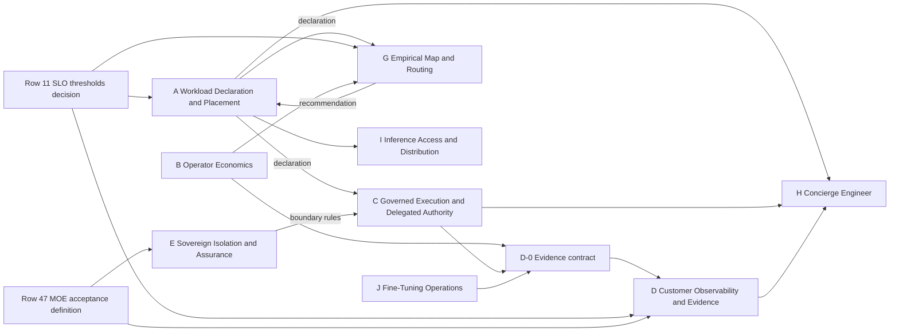

# PRD Coverage Plan

> **What this is.** A planning view of the canonical roadmap table (`05-wiki/RackAI Roadmap.csv`, 79 rows as of 2026-10-10). For each row it shows whether a PRD exists, which proposed PRD should cover it, or why it needs no PRD. **Status (2026-10-10):** PRD A is approved, and its tech spec is product-approved and in engineering review. PRDs B–J and their tech specs are at v0.2 with the product owner's review disposition applied (conditional acceptance; not formal approval). They await formal product approval and engineering review. Groupings, names and waves were approved by the product owner on 2026-10-10 after a critical review. Row numbers are CSV line numbers (header = line 1); the stable key is the **Milestone** name, which each PRD must cite exactly (see [[#How PRDs attach to roadmap items]]).
>
> **Standards.** New PRDs use `templates/prd.md` v2 (`.kiro/steering/prd-standards.md`). Their engineering designs use `templates/tech-spec.md` (`type: spec`, `.kiro/steering/tech-spec-standards.md`). Both templates were shaped on the engineering team's own PRDs and tech specs (received 2026-10-10 in `reference/PRD/`).

## Two Questions, Kept Apart

This plan measures **specification coverage**: is there an agreed product contract for the row? It does not measure **delivery readiness**: has engineering built and validated that contract? A PRD can exist for something unbuilt, and something can be built while its PRD is stale (the engineering PRDs below are). Every table therefore carries a **Delivery** column taken from the roadmap's *Status* field, and the two are never summed together.

## Coverage at a Glance

| Specification coverage | Rows | Delivery today (Done / In progress / Not started) | What it means |
|---|:-:|:-:|---|
| Covered: engineering PRD + tech spec exist | 12 | 4 / 5 / 3 | IAC, Monitoring, Metering, Auditability/Observability, Accelerator Selection. No new PRD; keep their as-built state current in the source notes |
| Covered: wiki PRD exists | 8 | 0 / 0 / 8 | [[Solution Marketplace PRD]] (MK.S0–S5) |
| **Gap: needs a new PRD (10 proposed PRDs)** | **37** | 0 / 4 / 33 | Grouped below (A–J). Four rows are already being built without a PRD: 15, 26, 27, 32 |
| Later horizon: one future PRD | 5 | 0 / 0 / 5 | Residency & multi-region (MOE-3). Write when MOE-3 enters the six-month horizon |
| Engineering-only: tech spec, no PRD | 5 | 0 / 2 / 3 | Internal platform work with no product decision to make |
| Decision or acceptance definition, not a PRD | 4 | 0 / 0 / 4 | Inputs that several PRDs depend on |
| Technique / experiment: experiment brief, not a PRD | 4 | 0 / 0 / 4 | Recorded as evidence when run |
| Operating model, not a product | 1 | 0 / 0 / 1 | Managed-ops / FDE motion |
| Out of scope / won't build | 3 | 0 / 0 / 3 | No document needed |

## How the PRDs Fit the Operating Loop

The ten PRDs are not ten products. The differentiated experience is their integration, which the roadmap already names as the operating loop: *you tell us what you want, what matters, and what you won't compromise; we deliver the how, stay inside your boundaries, and prove what we accomplished* ([[RackAI Roadmap]], The Operating Loop). Each PRD owns one step of that loop and states it in its **Loop Role & Cross-PRD Interfaces** section (template v2, §11). No new grouping scheme is introduced.

| Loop step | PRDs | Which promise it serves ([[Three Battlegrounds]]) |
|---|---|---|
| **Declare** — what you want and won't compromise | A | Contract between the two |
| **Stay inside your boundaries** | C (who may act), E (where execution happens) | Sovereign provider: authority, data, execution boundaries |
| **Deliver the how** | A (realise placement), G (recommend), F, I, J, H | Operator |
| **Prove it** | D (owns the evidence report), B (economics) | Both: each side proves its half |

**Shared interfaces between PRDs** (each defined once, in one place):

| Interface | Defined in | Consumed by |
|---|---|---|
| Workload declaration (intent + constraints) | A, with a thin canonical note written alongside it | C, E, G, H, I |
| Placement recommendation (options, confidence, evidence) | G | A (human-approved at MOE-1; automation later uses the same interface) |
| Boundary rules (what may cross, where execution may run) | E | C enforces them |
| Evidence contract (what each PRD contributes to the report) | D, sketched in wave 1 | B, C, E, G contribute; H reads |

**Two ownership rules, ratified 2026-10-10:**
1. **C vs E.** C owns *who or what may act, which actions are permitted, and how that is enforced and evidenced* (authorization, delegated authority, execution policy). E owns *where execution happens, what may cross the customer's boundary, and how we prove the boundary held* (isolation, information flow, assurance). E defines boundary rules as constraints; C enforces actions against them, so an exception (e.g. approving data egress) is a C authorization of an E rule. Both serve the **sovereign** promise. Neither builds the customer-facing evidence report; both contribute to D.
2. **A vs G.** A owns the placement contract and its execution: it takes the declaration, checks feasibility against hard constraints, and realises the chosen placement. G owns the evidence-informed recommendation. **G only ranks options that already satisfy A's hard constraints, and never relaxes one.** That keeps "never silently relaxed" true as automation grows.

## Proposed PRDs (grouped)

Grouping rule: one PRD per set of roadmap items that share **users, canonical entities and a release boundary**. Later-horizon items sit in the same PRD as **named later phases** (§14 of the template), so the boundary is visible now without speccing them in depth. Where a PRD introduces a concept other PRDs share, its canonical note is written **in the same change as the PRD**, not as a separate gate beforehand.

### Wave 1 (write first): A, B, C, J, plus D's evidence contract

#### A. Workload Declaration & Placement PRD — `prd-workload-declaration-placement`

**Loop role:** Declare; Deliver (realise placement). The intent + constraints contract: the customer declares model, workload profile and SLO, residency, approved vendors and economics; RackAI checks feasibility and realises placement behind a supply abstraction. Proposal **P-004**. C, E, G, H and I all consume the declaration, which is why A is first.

| Row | Milestone | Stage | Disposition | MoSCoW | Gate | Delivery | Phase in PRD |
|---|---|---|---|---|---|---|---|
| 13 | Supply-abstraction interface | T1.S2 | Decision Required | Must | MOE-0 | Not started | Phase 1 |
| 14 | Workload declaration (intent + constraints) | T1.S2 | Decision Required | Must | MOE-1 | Not started | Phase 1 |
| 43 | Supply abstraction v1 - second impl (AMD/partner) | T1.S4 | Gap | Should | MOE-4 | Not started | Later phase |
| 70 | Heterogeneous supply | T1.S4 | Gap | Won't | MOE-4 | Not started | Later phase (named only) |

**Status (2026-10-10): PRD approved; tech spec product-approved, in engineering review** — [[Workload Declaration & Placement PRD]] v1.0 (product decisions and acceptance criteria approved; open decisions D-1 to D-8 remain). Tech spec: [[Workload Declaration & Placement Tech Spec]] v0.3, product-approved 2026-10-10 with the DV-3 interim; engineering approval pending (pushed at `e1ae63f` for review). Roadmap rows 13, 14, 43 and 70 link both the PRD and the spec. **Canonical note written with it:** [[Workload Declaration]] (six PRDs consume it). Supply target / accelerator pool / execution location are defined inside A until G becomes their second consumer. Builds on [[Model Deployment Specification]], [[Sovereignty Levels]], [[Accelerator Selection Spec]] (manual selection and inventory; its Phase 4 model-aware placement feeds G's recommendation, not A's mechanism).

#### B. Operator Economics & KPI Instrumentation PRD — `prd-operator-economics`

**Loop role:** Prove (economics). Two distinct halves, kept as separate sections: **financial economics** (cost/GPU-hour, cost per token, margin) and **operational effectiveness** (operator KPIs, model launch lag, workloads per FTE). Users are operators and finance, not tenants. Proposal **P-003**. Cost history can't be backfilled, which is why it is wave 1.

| Row | Milestone | Stage | Disposition | MoSCoW | Gate | Delivery | Phase in PRD |
|---|---|---|---|---|---|---|---|
| 12 | Cost model (internal cost/GPU-hour) | T5.S2 | Gap | Must | MOE-0 | Not started | Phase 1 (financial) |
| 16 | Unit economics & margin | T5.S3 | Gap | Must | MOE-1 | Not started | Phase 2 (financial) |
| 17 | Operator KPI instrumentation | T3.S1 | Gap | Should | MOE-1 | Not started | Phase 2 (operational) |
| 18 | Model Launch Lag instrumentation | T3.S1 | Gap | Should | MOE-1 | Not started | Phase 2 (operational; F uses it as a success metric) |
| 74 | Operational leverage (workloads/FTE) | T5.S4 | Gap | Won't | MOE-2 | Not started | Later phase (operational) |

Canonical homes exist: [[Cost per GPU-Hour]], [[Unit Economics Model]], [[Model Launch Lag]]. Depends on the Metering spec (usage records; fine-tuning sidecar metering written under RACKAI-515 but not merged to main at `rackai@79ca4de`).

**Status (2026-10-10): PRD and tech spec drafted (v0.2), PO review disposition applied (conditional acceptance; not approved)** — [[Operator Economics & KPI Instrumentation PRD]] and [[Operator Economics & KPI Instrumentation Tech Spec]] v0.2. PO review: PD-1–PD-10 approved in principle; PD-11 revised (reusable kill-threshold framework, §18.1); FR-16 renamed *allocation utilisation*.

#### C. Governed Execution & Delegated Authority PRD — `prd-governed-execution-authority`

**Loop role:** Stay inside your boundaries (who may act). Renamed from "Enterprise Control Envelope": that name is decision **D3** as a whole, which also covers E's isolation and assurance. C covers authorization, delegated authority, execution policy and enforcement. It **consumes** the shipped identity and access services (IAC spec) rather than re-specifying them. Proposal **P-006**.

| Row | Milestone | Stage | Disposition | MoSCoW | Gate | Delivery | Phase in PRD |
|---|---|---|---|---|---|---|---|
| 40 | Governed execution harness v1 | T2.S3 | Gap | Must | MOE-0 | Not started | Phase 1 |
| 38 | IAC M4 (org-level RBAC + metering/billing/quota perms) | T2.S3 | Decision Required | Should | MOE-1 | Not started | Open decision → Phase 2 |
| 39 | Authority under incomplete intent | T2.S3 | Decision Required | Should | MOE-1 | Not started | Open decision → Phase 2 |
| 72 | Governed harness - full runtime | T2.S5 | Gap | Won't | Beyond MOE-4 | Not started | Later phase |
| 73 | Govern & assure inside the perimeter | T2.S5 | Gap | Won't | MOE-4 | Not started | Later phase |

Canonical homes exist: [[Governed Harness]], [[Agent Identity]], [[Action Controls]]. Row 38 carries a recorded conflict: the roadmap says IAC M4 was dropped, but org-scoped RoleBindings are built and work whenever RBAC enforcement is on; `rbac.multiOrg.enabled` gates only multiple CustomerOrgs (code check 2026-10-10, `rackai@79ca4de`; see [[Governed Execution & Delegated Authority PRD]] D-1). Resolve it as the PRD's first open decision.

**Status (2026-10-10): PRD and tech spec drafted (v0.2), PO review disposition applied (conditional acceptance; not approved)** — [[Governed Execution & Delegated Authority PRD]] and [[Governed Execution & Delegated Authority Tech Spec]] v0.2. PO review: most PDs approved in principle; PD-6 (single-authoriser exception) and PD-8 (narrow RackAI platform-safety containment) revised; PD-1 held for Erik. New: [[Authority Context]], authority principal per X-1 (`CustomerOrg.spec.authorityPrincipal`, `authority.PrincipalFor`), `model.retire` never emergency-eligible (X-3).

#### J. Fine-Tuning Operations PRD — `prd-fine-tuning-operations`

**Loop role:** Deliver the how (fine-tuning served, not built). Moved into wave 1 because the partner build is already moving: a late PRD would let engineering and the partner settle the product boundary before product does. Wave 1 covers **only the boundary**: what RackAI serves vs what the partner builds, the partner's responsibilities, and fine-tuning job metering and cost. The implementation schedule doesn't change. Proposal **P-001**, decision **D4**.

| Row | Milestone | Stage | Disposition | MoSCoW | Gate | Delivery | Phase in PRD |
|---|---|---|---|---|---|---|---|
| 27 | Uniphore: SFT/LoRA | T4.S3 | Committed | Must | Not gated | In progress | Phase 1 (boundary; retroactive for what is built) |
| 33 | Fine-tuning domain-model experiment | T4.S4 | Experiment | Should | Not gated | Not started | Phase 2 |
| 26 | DPO fine tuning | T4.S3 | Experiment | Could | Not gated | In progress | Technique note |

Row 27 is in build (RACKAI-385) with only umbrella coverage in the [[RackAI Platform PRD]] (§13) and no tech spec on file. Ground it in the actual code (read-only) before writing.

**Status (2026-10-10): PRD and tech spec drafted (v0.2), PO review disposition applied (conditional acceptance; not approved)** — [[Fine-Tuning Operations PRD]] and [[Fine-Tuning Operations Tech Spec]] v0.2 (boundary only; fine-tuning metering RACKAI-515 written but not merged). PO review: PD-1–PD-11 approved in principle; PD-5 scoped to the managed fine-tuning service (S-7); DV-1 approved with migration; DV-3 revised (attribution gaps fail visibly).

#### D-0. Evidence contract (sketch, part of wave 1)

Not a separate PRD: the first section of D, drafted alongside wave 1 so A, B, C and J contribute evidence in one shape instead of each inventing their own. It defines what an evidence record is, who contributes which kind (performance vs SLO, cost, policy decisions, boundary held), and how records join. The full D PRD follows in wave 2.

### Wave 2: MOE-1 Musts

**Status (2026-10-10): drafted as section 1.2 of the D PRD** — [[Customer Observability & Evidence Report PRD]] §1.2 and [[Customer Observability & Evidence Report Tech Spec]] §4: a versioned platform contract (envelope, kinds registry bound to [[Verification Status Vocabulary]], coverage reconciled against independent sources, `scope.authorityPrincipal`). All sibling specs conform.

#### D. Customer Observability & Evidence Report PRD — `prd-customer-observability-evidence`

**Loop role:** Prove it (owns the evidence report). What the customer sees (latency percentiles, TTFT, TPS, errors, quota, spend) and what we prove each period (performance vs SLO, cost, policy decisions, boundary held). The customer half of the "observability is two products" decision in [[Milestone Release Map]]. Builds on the D-0 evidence contract.

| Row | Milestone | Stage | Disposition | MoSCoW | Gate | Delivery | Phase in PRD |
|---|---|---|---|---|---|---|---|
| 9 | Customer observability (product surface) | T3.S1 | Gap | Must | MOE-1 | Not started | Phase 1 |
| 46 | MOE-1 evidence report | GATE: MOE-1 evidence | Decision Required | Must | MOE-1 | Not started | Phase 2 |

**Gated by:** row 11 (per-profile SLO thresholds; the report is measured against them) and row 47 (MOE acceptance definition). **Canonical notes written with it:** Customer Observability, Evidence Report. Delivery substrate: the In-Tenant Observability spec (row 8), whose tenant latency series are currently empty because the recording rules aren't shipped.

**Status (2026-10-10): PRD and tech spec drafted (v0.2), PO review disposition applied (conditional acceptance; not approved)** — [[Customer Observability & Evidence Report PRD]] and [[Customer Observability & Evidence Report Tech Spec]] v0.2. Canonical notes: [[Customer Observability]], [[Evidence Report]]. PO review: PDs approved in principle, PD-8/PD-9 revised (authority-principal scoping, two-level completeness); DV-1/DV-2 approved; DV-3 revised (joint attainment `not_measured`, lower bound labelled an estimate).

#### E. Sovereign Isolation & Assurance PRD — `prd-sovereign-isolation-assurance`

**Loop role:** Stay inside your boundaries (where execution happens). Isolation, execution boundaries, what may cross them, and the product controls and evidence that let the first attestation be achieved. Defines boundary rules that C enforces. Decision **D3**.

| Row | Milestone | Stage | Disposition | MoSCoW | Gate | Delivery | Phase in PRD |
|---|---|---|---|---|---|---|---|
| 42 | Customer isolation + private inference | T2.S4 | Gap | Must | MOE-1 | Not started | Phase 1 |
| 41 | First applicable assurance attestation | T2.S4 | Gap | Must | MOE-1 | Not started | Phase 1 (product controls only) |

Projects from [[Sovereignty Levels]] (Level 1, Dedicated). The attestation programme itself (auditor, scope) is a compliance workstream; the PRD covers only the product controls and evidence. Gated by row 47.

**Status (2026-10-10): PRD and tech spec drafted (v0.2), PO review disposition applied (conditional acceptance; not approved)** — [[Sovereign Isolation & Assurance PRD]] and [[Sovereign Isolation & Assurance Tech Spec]] v0.2. PO review: PD-1 conditionally approved (dedicated nodes ≠ dedicated cluster); PD-2 revised per X-1; PD-4 revised (severity-based containment S1–S4, security review E D-12); DV-2 approved; DV-3 revised (`held` = control operating).

#### F. Model Lifecycle PRD — `prd-model-lifecycle`

**Loop role:** Deliver the how (models enter, upgrade and retire on command): request/onboard → qualify → benchmark → canary upgrade → retire. The roadmap hub already flags that sunsetting has no PRD.

| Row | Milestone | Stage | Disposition | MoSCoW | Gate | Delivery | Phase in PRD |
|---|---|---|---|---|---|---|---|
| 59 | M2: Request new model support | T1.S3 | Committed | Must | MOE-1 | Not started | Phase 1 |
| 61 | Model version upgrade (canary rollout) | T1.S3 | Gap | Must | MOE-1 | Not started | Phase 1 |
| 60 | M2: Sunsetting a model | T1.S3 | Gap | Should | MOE-2 | Not started | Phase 2 |
| 32 | Multi-model operation | T4.S2 | Committed | Should | MOE-2 | In progress | Phase 2 |

Canonical homes exist: [[Model Services]], [[Model Radar]], [[Model Launch Factory]], [[Canary & Rollback]]. Row 59 is committed (RACKAI-354, owner Erik): check the code and engineering's design before writing. Open decision: whether new-model requests go through SNOW. Success metric: [[Model Launch Lag]] (instrumented by B).

**Status (2026-10-10): PRD and tech spec drafted (v0.2), PO review disposition applied (conditional acceptance; not approved)** — [[Model Lifecycle PRD]] and [[Model Lifecycle Tech Spec]] v0.2. PO review: PDs approved in principle with a PD-4 transition plan; PD-6 revised (contract-affecting upgrades need consent); PD-8 approved, with security withdrawal via `model.security-withdraw`; `scid` from G (X-2); DV-1/DV-3 conditional.

#### G. Empirical Map & Evidence-Informed Routing PRD — `prd-empirical-map-routing`

**Loop role:** Deliver the how (decision intelligence, not execution). Characterise real traffic, record per-workload × model × hardware cost and reliability, and supply **recommendations with confidence and evidence** through one decision interface that A executes. At MOE-1 a human approves; later automation uses the same interface. Proposal **P-005**. The roadmap says *prototype first*, so this PRD leads with a prototype phase.

| Row | Milestone | Stage | Disposition | MoSCoW | Gate | Delivery | Phase in PRD |
|---|---|---|---|---|---|---|---|
| 28 | Empirical Map v1 + transferable/isolated split | T3.S3 | Experiment | Must | MOE-1 | Not started | Phase 1 (prototype) |
| 29 | Workload characterization | T3.S2 | Gap | Should | MOE-2 | Not started | Phase 1 |
| 30 | Evidence-informed routing (routing reads the map) | T3.S4 | Gap | Should | MOE-2 | Not started | Phase 2 |
| 21 | Accelerator selection (evidence-informed) | T4.S5 | Gap | Could | MOE-4 | Not started | Later phase (moved from A: it is a recommendation) |
| 64 | Day-zero model factory, closed-loop optimization | T3.S5 | Gap | Won't | Beyond MOE-4 | Not started | Later phase |

Canonical homes exist: [[Empirical Map]], [[Traffic Class]], [[Request Routing]]. Gated by row 11 (SLO thresholds); depends on B (cost data).

**Status (2026-10-10): PRD and tech spec drafted (v0.2), PO review disposition applied (conditional acceptance; not approved)** — [[Empirical Map & Evidence-Informed Routing PRD]] and [[Empirical Map & Evidence-Informed Routing Tech Spec]] v0.2 (designs rows 28–30). PO review: PD-1–PD-11 approved in principle. G owns `scid` ([[Serving Configuration Identity]], X-2); ranking evidence kept apart from verification evidence; Phase-1 flow is operator-mediated.

### Wave 3: Should / not gated

#### H. Concierge Engineer PRD — `prd-concierge-engineer`

**Loop role:** Deliver the how, as a *consumer* of the platform: it uses A's declaration, C's authority and D's evidence through public APIs and is never an alternative control plane. One PRD across three stages: answer (read-only), act with confirmation, governed autonomy.

| Row | Milestone | Stage | Disposition | MoSCoW | Gate | Delivery | Phase in PRD |
|---|---|---|---|---|---|---|---|
| 48 | Concierge Engineer v0 (Answer) | CE.S0 | Gap | Should | MOE-1 | Not started | Phase 1 |
| 49 | Concierge Engineer v1 (Act with confirmation) | CE.S1 | Gap | Could | MOE-2 | Not started | Phase 2 |
| 50 | Concierge Engineer v2 (Governed autonomy) | CE.S2 | Gap | Won't | Beyond MOE-4 | Not started | Later phase |

v0 needs D; v1 needs A and C. Its concept is used only here, so the canonical note can come later (currently described only in [[RackAI Roadmap]]).

**Status (2026-10-10): PRD and tech spec drafted (v0.2), PO review disposition applied (conditional acceptance; not approved)** — [[Concierge Engineer PRD]] and [[Concierge Engineer Tech Spec]] v0.2. PO review: PD-1–PD-12 approved in principle, with a sovereignty gate (PD-8) and C Phase 2 as an explicit release blocker for v1; usage, estimated charges and actual charges kept separate; DV-3 revised (non-executable quota draft).

#### I. Inference Access & Distribution PRD — `prd-inference-access-distribution`

**Loop role:** Deliver the how (how customers reach shared inference). Renamed from "Inference as a Service Channels". It covers the **access surfaces** for the shared, time-sliced endpoint offer, which is **Level 0** in [[Sovereignty Levels]]: the direct RackAI API/portal, OpenRouter distribution, and BYOM through supported interfaces. Every surface **consumes** the same platform contracts (identity, metering, quotas, model availability, service behaviour) from the IAC and metering specs; I does not re-specify the underlying inference service. That keeps OpenRouter and direct inference from becoming two loosely related products.

| Row | Milestone | Stage | Disposition | MoSCoW | Gate | Delivery | Phase in PRD |
|---|---|---|---|---|---|---|---|
| 15 | GLM 5.3 Flash deployment + OpenRouter Path A | T4.S1 | Committed | Must | MOE-0 | In progress | Context: covered by execution plan |
| 77 | OpenRouter: Inference aaS in OpenRouter | T4.S1 | Committed | Should | Not gated | Not started | Phase 1 |
| 76 | OpenRouter: BYOM in OpenRouter | T4.S1 | Committed | Could | Not gated | Not started | Phase 2 |
| 78 | Inference as a Service (direct) | T4.S1 | Decision Required | Could | Not gated | Not started | Open decision → Phase 2 |

Row 78 is still a pending decision. The PRD frames it and does not presume the answer. Row 15 is planned in [[Phase 1 Execution Plan — GLM 5.3 Flash Proof Point]] and [[OpenRouter Integration Plan]]; this PRD cites them rather than repeating them.

**Status (2026-10-10): PRD and tech spec drafted (v0.2), PO review disposition applied (conditional acceptance; not approved)** — [[Inference Access & Distribution PRD]] and [[Inference Access & Distribution Tech Spec]] v0.2. PO review: PD-1–PD-7 and PD-9 approved in principle; PD-8 revised (maximum unreconciled exposure, automatic paid-admission suspension); PD-10 revised to B's framework; **DV-2 rejected**: no shared endpoint until E's `BoundaryCacheIsolated=True` (E M3).

### Later horizon (do not write yet)

**K. Residency & Multi-Region PRD** (`prd-residency-multi-region`): rows 62 (M2: Multi region support), 66 (Multi-cluster governance / global front door), 67 (Data-residency controls), 68 (Residency-aware placement and failover), 69 (Per-jurisdiction compliance evidence). All are Won't for this horizon and gated at MOE-3, i.e. [[Sovereignty Levels]] Level 2. All are Not started. Write it when MOE-3 enters the six-month horizon. Until then, A and E list it as a later phase.

## Already Covered (no new PRD)

| Row | Milestone | PRD | Tech spec | Delivery |
|---|---|---|---|---|
| 2 | IAC M1 | IAC PRD (engineering) | [[Identity and Access Control Spec]] | Done |
| 3 | IAC M2 | IAC PRD (engineering) | [[Identity and Access Control Spec]] | Done |
| 4 | IAC M3 | IAC PRD (engineering) | [[Identity and Access Control Spec]] | Done |
| 5 | Platform M1-M2 | Monitoring PRD (engineering) | [[Monitoring and Auditability Spec]] | In progress |
| 6 | Platform M3-M4 | Monitoring PRD (engineering) | [[Monitoring and Auditability Spec]] | In progress |
| 7 | Metering M1 | Multi-Tenancy & Metering PRD (engineering) | [[Multi-Tenancy and Metering Spec]] | In progress |
| 35 | Metering M3 | Multi-Tenancy & Metering PRD | [[Multi-Tenancy and Metering Spec]] | Not started |
| 36 | Metering M4 | Multi-Tenancy & Metering PRD | [[Multi-Tenancy and Metering Spec]] | Not started |
| 37 | Uniphore: single-cluster tenancy | Multi-Tenancy & Metering PRD | [[Multi-Tenancy and Metering Spec]] | In progress |
| 8 | Observability M1 (operator intelligence) | Auditability & Observability PRD | [[Monitoring and Auditability Spec]] (In-Tenant Observability) | Not started (Decision Required: confirm scope vs D) |
| 34 | IAC M3 (audit) + Auditing M1-M3 | Auditability & Observability PRD | [[Monitoring and Auditability Spec]] (Auditability) | In progress |
| 20 | Accelerator inventory & consumption telemetry | none (spec carries its own R-n) | [[Accelerator Selection Spec]] | Done |
| 51–58 | Marketplace MK.S0–MK.S5 (8 rows) | [[Solution Marketplace PRD]] | none yet | Not started (rows 54 and 57 are open decisions inside that PRD) |

"Covered" means a contract exists, not that it is current or built. The engineering PRDs are v1 narrative documents, and their tech specs have moved past them (e.g. the IAC spec's declared divergences and the as-built notes). Don't rewrite them. The specs and their as-built notes are the record, ingested in the source notes above.

## No PRD Needed

| Row | Milestone | Why not | What it needs instead |
|---|---|---|---|
| 19 | M2: Inference routing | Engineering substrate (llm-d), product intent already in the [[RackAI Platform PRD]] §12 | Tech spec |
| 25 | Shared KV cache (improvement) | Technique behind routing | Tech spec / experiment brief |
| 10 | M2: AI Performance Benchmarks | Internal process | Tech spec or runbook |
| 79 | Object Store | Infrastructure choice | Decision record + tech spec |
| 80 | CI system | Internal build/release pipeline | Tech spec |
| 11 | Per-profile SLO thresholds | A ratified decision (policy), not a feature | Policy note. **Gates A (profiles in the declaration), D, G** |
| 47 | Minimum Operable Estate spec | Acceptance definition | Complete in [[Minimum Operable Estate]]. **Gates D, E** |
| 44 | MOE-0 (operator rehearsal) | Release gate | Tracked in [[Minimum Operable Estate]] |
| 45 | MOE-1 (paid identity proof) | Release gate | Tracked in [[Minimum Operable Estate]] |
| 22 | AMD AIM engine / AMD+NVIDIA nodes | Technique, struck in source | Experiment brief if revived |
| 23 | Speculative decoding | Technique | Experiment brief / evidence |
| 24 | Refrag | Technique | Experiment brief / evidence |
| 31 | Semantic router | Technique | Experiment brief / evidence |
| 65 | Managed-ops / FDE motion, multi-estate onboarding | Operating model, not product | Operating-model note |
| 63 | M2: GPU node access support | Out of scope (GPU IaaS boundary) | none |
| 71 | Dynamic fleet & capacity mgmt | Beyond MOE-4 | none this horizon |
| 75 | Fine-Tuning: Checkpointing + resume | Out of scope | none |

## Sequencing and Prerequisites

1. **Wave 1 (A, B, C, J + D-0):** A is the contract others consume; B starts the cost history that can't be backfilled; C unblocks the MOE-0 harness; J fixes the partner boundary while the build is moving; D-0 gives every wave-1 PRD one evidence shape.
2. **Wave 2 (D, E, F, G):** the MOE-1 Musts. Decide row 11 and finish row 47 first. C's Phase 1 doesn't wait for E: it enforces against E's boundary rules once E defines them, and C's §11 names that interface from the start.
3. **Wave 3 (H, I):** Should or ungated. I is unblocked sooner if the row 78 decision lands.

**Canonical notes** are created when a concept must be shared across capabilities, in the same change as the PRD that introduces it (One-Concept Rule, check P-01): [[Workload Declaration]] (written with A); Customer Observability and Evidence Report (with D-0/D). Supply abstraction terms become canonical when G consumes them. Concierge Engineer can wait: only H uses it.

## How PRDs attach to roadmap items

- **In each PRD:** the document control table's *Roadmap items* row lists the Milestone names exactly as in the CSV, and §14 maps each item to a phase. This is required by the PRD standard (Roadmap Traceability).
- **In the roadmap table (applied 2026-10-10):** `05-wiki/RackAI Roadmap.csv` has two link columns, **PRD** and **Tech spec**, holding knowledge-console links (`https://knowledge.rackspace-cloud.com/browse/rackai/<id>`). They are filled for the 20 rows covered today: the engineering source notes, plus [[Solution Marketplace PRD]] for MK.S0–S5. Rows in the gap groups stay empty until their PRD or spec exists. Planned IDs live only in this plan.
- **Many-to-many:** a row may link several PRDs or specs (`; `-separated), a PRD may be implemented by several specs, and one spec may implement several PRDs. Traceability is required in both directions; one-to-one is not.
- **Enforced:** `scripts/lint-prd-spec.py` (pre-commit) fails if a PRD or spec names a roadmap item whose row doesn't link back to it, or if a row links a note that doesn't name that row (Fitness P-09, T-10).

## Tech-Spec Follow-On (not this phase)

Each PRD (A–J) needs its requirements traced to one or more tech specs. That can mean a new spec, an extension of an existing engineering spec, or a spec shared with a related PRD (e.g. C and E may share an enforcement spec). Each new spec must first complete the read-only codebase grounding step against `RSS-Engineering/rackai`, `rackai-ui` and `rackai-docs` (`tech-spec-standards.md`, Fitness T-09); read-only copies are kept current with `scripts/code-mirror.sh sync`. Engineering-only specs also missing today: rows 19 (inference routing), 80 (CI), 79 (object store), 27 (fine-tuning in build, no spec received), 59 (model onboarding, RACKAI-354).

## See Also

- [[RackAI Roadmap]] — canonical roadmap narrative; the CSV is its table
- [[Milestone Release Map]] — tracks, capability stages and MOE releases used here
- [[Solution Marketplace PRD]] — the one wiki-authored PRD so far
- [[Capability Gap Register]] — capability gaps these PRDs address
- [[Minimum Operable Estate]] — the gates (MOE-0, MOE-1) the waves are ordered by
