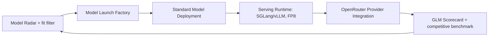

# Phase 1 Execution Plan — GLM 5.3 Flash Proof Point

## Thesis

Prove a **modular host-and-deploy pipeline** end-to-end on **one fitting model — [[GLM 5.3 Flash]]** — then parameterize that pipeline so the next model is a config change, not a project. GLM is the first block; the enduring asset is the repeatable pipeline behind it.

This makes concrete the roadmap's own early arc (M1 → M2 → M3 → M4) and applies the fit-first lesson from [[Fleet Competitiveness]]: lead with a model that fits our NVL-PCIe topology (~27B class), not the largest one.

## Why GLM as the first block

Summarized from [[First Bet — GLM 5.3 Flash]]: it is the best-ranked open-weight model on the [[OpenRouter Leaderboard Snapshot]] that also fits our topology, it is the current breakout mover (#2 this week, ↑>999%), its prefix-heavy workload suits our optimization levers, and it carries cleanly to the incoming [[AMD Instinct]] MI350P pool.

## How this maps to the roadmap (sequencing correction)

The roadmap names DeepSeek as the M2/M3 flagship. We keep the *sequence* and the *pipeline*; we swap the *proof-point model* to GLM because DeepSeek's large MoE fights the topology. See [[DeepSeek-First vs GLM-First Sequencing]] for the resolved decision.

| Roadmap milestone | Original | This plan |
|-------------------|----------|-----------|
| M1 — Know the Fleet | Inventory/telemetry/cost/harness | Done in part — [[Fleet Inventory]], topology ceiling captured |
| M2 — Serve One Model | DeepSeek on the standard stack | **GLM 5.3 Flash** on the standard stack |
| M3 — Become a Provider | Production DeepSeek traffic | Production **GLM** traffic + competitive measurement |
| M4 — Prove Repeatability | GLM via same platform | **Second fitting model** via the same platform |

## The Pipeline (the actual deliverable)

Each block is an existing canonical concept; GLM is the first payload through them:

| Block | Canonical note | GLM-specific focus |
|-------|----------------|--------------------|
| Discovery + fit screen | [[Model Radar]] | Screen candidates against [[GPUs per Replica]] on current topology |
| Launch pipeline | [[Model Launch Factory]] | Weights → validate → hardware-fit → benchmark → canary → publish |
| Deployment contract | [[Standard Model Deployment]] | One [[Model Deployment Specification]] for GLM |
| Runtime + optimization | [[Serving Runtime]] | SGLang RadixAttention + prefix cache + FP8 (prefix-heavy workload) |
| Distribution | [[OpenRouter Provider Integration]] | Full API conformance to avoid early down-rank |
| Measurement | [[GLM 5.3 Flash Scorecard]] | tokens/GPU-second, TTFT, cost/1M, availability |

## Near-Term Steps

1. **Confirm GLM 5.3 Flash fits 2–4 H100 at FP8** — the one open dependency ([[GPUs per Replica]], [[Open Questions]]).
2. **Stand up the standard deployment** for GLM on SPOT H100 via the [[Standard Model Deployment]] contract.
3. **Optimize for the workload** — SGLang prefix caching + FP8 + batching tuning ([[Serving Runtime]]).
4. **Meet OpenRouter API conformance** before chasing rank ([[OpenRouter Provider Integration]]) — this gates early ranking, see [[Fleet Competitiveness]].
5. **Publish + measure** against competing GLM providers ([[GLM 5.3 Flash Scorecard]], competitive benchmark pipeline).
6. **Parameterize** — capture everything reusable so the second fitting model reuses the pipeline (M4).

## What Success Looks Like (this phase)

- GLM 5.3 Flash live on OpenRouter through the standard pipeline, meeting API conformance.
- Measured tokens/GPU-second, TTFT, and cost/1M vs. competing GLM providers — the first entries that move the scorecard off `assumed`.
- A pipeline where launching the next fitting model is a config/spec change, not a new project.

Explicitly **not** in scope this phase: frontier-class models, top-10 overall rank — both need SXM/UBB8 ([[Fleet Competitiveness]]).

## Confidence

`derived` — a recommended execution plan from the leaderboard evidence and topology constraint. It upgrades as the GLM launch produces measured results.

## See Also

- [[First Bet — GLM 5.3 Flash]]
- [[Model Portfolio Capacity]]
- [[DeepSeek-First vs GLM-First Sequencing]]
- [[Product Hub]]
