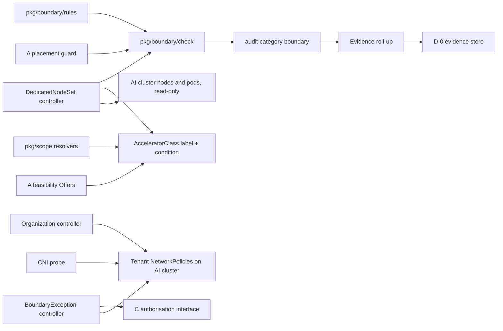
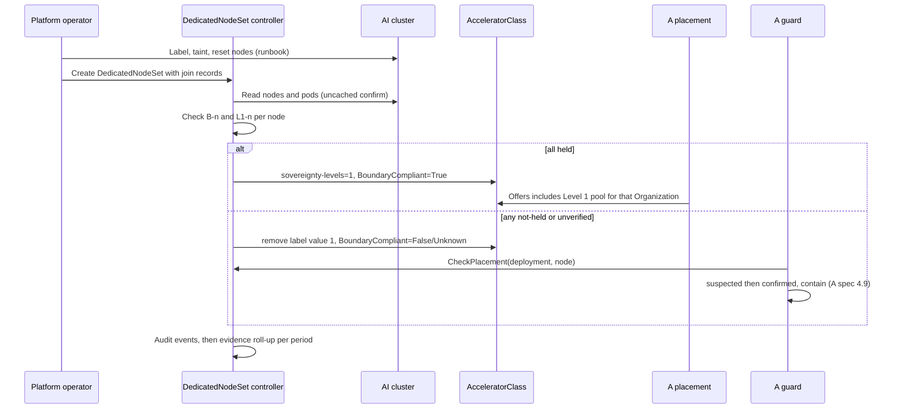

# Sovereign Isolation & Assurance — Technical Specification

| Field | Value |
|:--|:--|
| Version | v0.2 |
| Status | Draft |
| Author | Wiki agent for rackai-product (draft for platform engineering) |
| Reviewers | Platform engineering (control plane, dataplane); Security; UI; Docs; A, C and D owners |
| Engineering approval | not yet approved |
| Product review | **Product-owner review disposition, 2026-10-10: conditional acceptance; not formal artifact approval.** DV-2 approved (pre-staging with provenance and integrity documented as a Level 1 prerequisite); DV-3 revised (network `held` = control operating, never proof of absence); containment made severity-based (PRD PD-4 v0.2) as a requested change to A; failure handling restated in [[Failure Mode Taxonomy]] terms; milestones carry [[Release Readiness States]] and blockers |
| Product approval | not yet approved |
| Date created | 2026-10-10 |
| Based on PRD(s) | [[Sovereign Isolation & Assurance PRD]] (v0.2 draft, not yet approved; spec drafted alongside per product-owner instruction 2026-10-10) |
| Roadmap items | Customer isolation + private inference; First applicable assurance attestation |
| Jira epic(s) | none yet: one epic per milestone (§13) to be created by platform engineering |

> **Artifact type: Technical Specification.** An authored engineering design. Its concepts have canonical notes: [[Sovereignty Levels]], [[Organization]], [[Accelerator Class]], [[Capacity Pool]], [[Workload Declaration]]; the risk evidence is [[GPU Co-Tenancy Risk]]. This spec designs *how* to enforce and evidence the PRD's boundary rules and does not redefine the levels.
>
> **Status banner.** *Proposed design; nothing is built.* Design statements are `assumed`. Statements about today's code are `derived` from the read-only survey in §3, pinned to commits. The spec covers row *First applicable assurance attestation* only for its product controls and evidence (§4.8); the attestation programme is not designed here.

### 0. Status markers (convention)

- **AS BUILT (YYYY-MM-DD, TICKET):** what shipped where it differs from the design above it.
- **PROPOSED, NOT BUILT (YYYY-MM-DD):** designed here, not implemented.
- **RETAINED FOR THE RECORD:** a rejected or replaced design kept for the decision record.

## 1. Overview

This spec builds the boundary layer behind [[Sovereignty Levels]] Levels 0 and 1: a versioned **rule catalogue**, a cluster-scoped **`DedicatedNodeSet`** resource that turns an `AcceleratorClass` into a Level 1 pool, **tenant network fences** on the AI cluster, a **check engine** that evaluates every rule continuously, **`BoundaryException`** objects that only C can authorise, and **`boundary-held` / `boundary-exception` evidence** in the D-0 envelope. It is additive: no existing API changes shape. Two behaviours change for existing users, both behind flags: AcceleratorClasses bound to a node set can no longer be referenced by other tenants, and the Level 0 tenant ingress fence (off by default in Phase 1).

It plugs into A's design rather than beside it: A places only onto pools whose `rackai.rackspace.com/sovereignty-levels` label says `1` (A spec §3.3, §4.4); this spec makes that label trustworthy, supplies the exact toleration through `AcceleratorClass.spec.tolerations`, and feeds A's placement guard (A spec §4.9), which stays the single containment path.

### 1.1 Goals

- G-1. Make Level 1 a computed state of a pool, never a hand-set label (PRD FR-2, A Q-4).
- G-2. Enforce the reference restriction and toleration rules in the controller, so they hold with webhooks off (FR-3, FR-4).
- G-3. Fence the network: deny by default for Level 1 namespaces; an ingress fence for every tenant behind a flag (FR-6, FR-7).
- G-4. Evaluate every rule with a three-valued outcome and produce per-period evidence (FR-10, FR-12).
- G-5. Apply exceptions only on C's bound authorisation, failing closed until C exists (FR-16, FR-17).
- G-6. Ship a control catalogue whose evidence can be retrieved by control and period (FR-19, FR-20).

### 1.2 Non-Goals

- Placement, feasibility and containment: A's spec. This spec calls into A's guard; it adds no second stop path.
- Who may request or authorise exceptions, and the authorisation model itself: C's spec ([[Governed Execution & Delegated Authority Tech Spec]]).
- The evidence store, envelope and customer report: D's spec ([[Customer Observability & Evidence Report Tech Spec]]).
- Level 2 residency and multi-region (K, MOE-3); Level 3 (MOE-4).
- Automating node join and scrub (PRD Phase 2); writing labels or taints to nodes (operators do that by runbook in Phase 1).
- Pricing by level (FR-21, deferred; D-6).

### 1.3 Requirements Traceability

| PRD · req | Spec section(s) | Milestone | Status |
|---|---|---|---|
| prd-e · FR-1 | §4.1, §5 | M1 | covered |
| prd-e · FR-2 | §4.2, §4.3 | M1 | covered |
| prd-e · FR-3 | §4.4 | M1 | covered |
| prd-e · FR-4 | §4.2 (L1-2 check), §4.4 | M1 | covered |
| prd-e · FR-5 | §4.3 (L1-5) | M1 | covered |
| prd-e · FR-6 | §4.5 | M2 | divergent (§1.4 DV-2: model sources) |
| prd-e · FR-7 | §4.5 | M2 | covered (flag, default off in Phase 1) |
| prd-e · FR-8 | §4.6 (incl. `BoundaryCacheIsolated` signal) | M3 | covered |
| prd-e · FR-9 | §4.2 (join and leave records) | M1 | covered |
| prd-e · FR-10 | §4.3 | M1 (nodes), M2 (network), M3 (cache, runtime) | covered (DV-3 for network semantics) |
| prd-e · FR-11 | §4.7 (severity-based containment; requested change to A) | M3 | covered |
| prd-e · FR-12 | §4.9 | M4 | covered |
| prd-e · FR-13 | §4.9 (audit category `boundary`) | M1 (events), M4 (full set) | covered |
| prd-e · FR-14 | §4.10, §5 | M4 | covered (API); console SHOULD in M4 |
| prd-e · FR-15 | §7, Appendix A | M3 | covered |
| prd-e · FR-16 | §4.8 | M4 | covered |
| prd-e · FR-17 | §4.8 | M4 | covered |
| prd-e · FR-18 | §4.8, §4.9 | M4 | covered |
| prd-e · FR-19 | §4.11 | M4 | covered |
| prd-e · FR-20 | §4.11, §5 | M4 | partial (served from the audit read API until D's store exists; Q-6) |
| prd-e · FR-21 | — | Phase 2 | deferred (D-6, with B and Metering) |
| prd-e · FR-22 | §4.1 (enforcement state per rule), §4.11, M4 docs | M4 | covered |
| prd-e · FR-23 | §4.5 (*Model artefacts at Level 1*) | M2 | covered (consumer requirement on F) |
| prd-e · FR-24 | §4.7 (recovery) | M3 | covered |

### 1.4 Deliberate Divergences from the PRD

| # | Divergence | Why | Materiality |
|---|---|---|---|
| DV-1 | The `rackai.rackspace.com/sovereignty-levels: "1"` label on `AcceleratorClass` is **owned by the boundary controller**, not hand-set by a platform admin as A spec §8 describes | A hand-set label would make Level 1 an assertion; PRD FR-2 needs it computed. This is a change to A's spec contract (§1.6) | Non-material to this PRD (it implements FR-2). **Status: confirmed 2026-10-10: PRD A's product owner approved the label-ownership change (A4-5, A spec v0.4).** **A requested change to A's spec**: A spec §8 says Level 1 pools are labelled by a platform admin; this spec asks A to change that to "labelled only by the boundary controller while the bound node set is compliant". A's spec is product-approved, so the change needs **A's product review** as well as A's engineering agreement (Q-9) |
| DV-2 | **Level 1 workloads cannot pull model artefacts directly from public hubs** (e.g. Hugging Face). Allowed egress is to IP ranges only, because standard NetworkPolicy (what the chart assumes, e.g. k3s's built-in policy controller; `charts/rackai-manager/values.yaml`) has no hostname rules. Which CNI the production AI cluster runs is not recorded in the repo (Q-3). Model artefacts for Level 1 must be staged into the platform object store first. A direct pull needs a C-authorised exception (CIDR). PRD L1-6 says "the model sources the workload declares" | Hostnames behind a CDN can't be expressed as `ipBlock`; an open egress would defeat L1-6 | Material. **Status: approved (PO review 2026-10-10).** Pre-staging is a Level 1 prerequisite with artefact provenance and integrity (PRD FR-23, AC-15; §4.5). Staging and the provenance record are a consumer requirement on F (requested interface change to [[Model Lifecycle Tech Spec]] intake) |
| DV-3 | For network rules (B-3, L1-6), `held` means the **control was operating**: the expected policies exist and match their digest, **and** the CNI passed its enforcement probe in the period. Individual flows are not observed, so `held` is never presented as proof that no forbidden flow occurred | Flow logging is CNI-specific and not available on the current stack | Material. **Status: revised per PO review 2026-10-10** to the `boundary` status of [[Verification Status Vocabulary]]; records carry `claim.basisKind: control-operating` and the customer view labels it (PRD FR-14, AC-11). Pending approval of v0.2 |
| DV-4 | **B-5 (no content in exported telemetry)** is verified only as configuration (runtime adapters don't enable request logging) plus an operator's record (actor: human operator, basis `asserted`); there is no content scanning | No safe, cheap content detector exists in the stack | Non-material if the evidence basis says so: the controller's record is `derived`, the operator's record `asserted` (PRD NFR *honest evidence*). B-5 is *monitored*, not enforced, in Phase 1 (PRD §6). **Status: confirmed by the product owner, 2026-10-10 (non-material)** |

### 1.5 Terminology

| Term | Definition |
|:--|:--|
| Rule ID | `B-n` (baseline, all levels) or `L1-n` (Level 1), as in PRD §6 |
| Rule set version | Semantic version of the compiled-in catalogue (`pkg/boundary/rules`) |
| Outcome | The `boundary` status of [[Verification Status Vocabulary]]: `held`, `not-held` or `unverified`, for one rule, one subject, one check or one period. `held` means the control was configured and operating; it is proof that no forbidden flow occurred only for a rule whose basis is *observed state* |
| Severity | S1 to S4, PRD §12; set per confirmed failure by `pkg/boundary/severity` |
| Quarantine | Exclusion of a pool from new placement while existing use continues ([[Failure Mode Taxonomy]]) |
| Subject | What a rule is checked against: `nodeset`, `node`, `namespace`, `deployment` |
| Dedication taint | `rackai.rackspace.com/dedicated=<organization>:NoExecute` |
| System pod allowlist | Chart value naming the platform DaemonSets permitted on dedicated nodes |
| CNI probe | A pair of pods in a reserved namespace that tries a denied connection to prove NetworkPolicy is enforced |

### 1.6 Relationship to Other Specs and Canonical Notes

- **[[Workload Declaration & Placement Tech Spec]] (A).** Consumed: the pool labels (`/sovereignty-levels`, A §3.3), `AcceleratorClass.spec.tolerations` (built by A M2; A §3.3, §4.4 step 1), the fit check's taint handling (A §4.4), and the placement guard (A §4.9). **Requested changes to A's spec** (A is product-approved, so each needs A's product review and engineering agreement, Q-9): (1) DV-1, the boundary controller owns the value `"1"` of the sovereignty label, replacing A §8's "labelled by a platform admin"; (2) A's guard calls `boundary.CheckPlacement` (§4.7) and its containment policy acts by severity: stop or relocate only for S1 (A4-6); (4) A's reason table gains `ModelSourceNotStaged` and `ArtefactIntegrityFailed` (§4.5); (3) A's `Offers` must exclude a Level 1 class whose `BoundaryCompliant` condition is not `True`. All three are additive and need A's engineering agreement.
- **[[Governed Execution & Delegated Authority Tech Spec]] (C).** Consumed: an authorisation interface for exceptions (§4.8). C defines its shape; this spec proposes one mirroring A's `authority.ForPolicyChange`.
- **[[Customer Observability & Evidence Report Tech Spec]] (D).** Consumed: the D-0 envelope and evidence store. This spec contributes kinds `boundary-held` and `boundary-exception`.
- **[[Identity and Access Control Spec]]**, **[[Monitoring and Auditability Spec]]**, **[[Multi-Tenancy and Metering Spec]]**: extended additively (permissions, an audit category, metrics). No metering change in this revision.
- **[[Accelerator Selection Spec]]**: `AcceleratorClass` is extended only by labels and a condition; the tolerations field is A's.

## 2. Architecture

### 2.1 System Components

New code lives in the existing manager (`cmd/main.go`), in a new `pkg/boundary` tree and two new controllers. No new service or deployment.

### 2.2 Component Responsibilities

| Component | Responsibility | Owner | New / changed / existing |
|---|---|---|---|
| `pkg/boundary/rules` | Compiled-in rule catalogue and version; control catalogue (§4.1, §4.11) | Platform eng | new |
| `pkg/boundary/check` | One pure check function per rule over observed state; returns an outcome with what was observed | Platform eng | new |
| DedicatedNodeSet controller | Reconciles `DedicatedNodeSet`; watches AI-cluster nodes and pods on set nodes; writes check state; owns the Level 1 label and `BoundaryCompliant` condition on the bound `AcceleratorClass` | Platform eng | new |
| Organization controller | Gains tenant boundary NetworkPolicies on the AI cluster next to the trainer-metrics policy (§4.5) | Platform eng | changed (additive) |
| CNI probe | Periodic enforcement probe in a reserved namespace (§4.5) | Platform eng | new |
| BoundaryException controller | Validates, asks C, applies and removes exception policies (§4.8) | Platform eng | new |
| `pkg/scope` resolvers | Reject a dedicated class referenced from another Organization; reject shared caches at Level 1 (§4.4, §4.6) | Platform eng | changed (additive) |
| Evidence roll-up | Periodic job turning check history into `boundary-held` records (§4.9) | Platform eng | new |
| A's placement guard | Calls `boundary.CheckPlacement`; stops or relocates only for S1 under A's containment policy | A | changed (requested change to A spec) |
| Console | Boundary status on the Organization and deployment pages | UI | new |

### 2.3 Dependency Map



### 2.4 Data Flow



## 3. Codebase Grounding (read-only)

Surveyed read-only through local mirrors kept outside the wiki. Nothing was written to any code repo. HEAD matched the commits pinned in A's spec.

### 3.1 Repos & revisions read

| Repo | Commit SHA | Paths read | Why relevant |
|---|---|---|---|
| RSS-Engineering/rackai | `79ca4de` | `internal/controller/{namespace.go,namespace_networkpolicy_test.go,organization_controller.go,finetuningjob_controller.go}`, `internal/webhook/v1alpha1/customerorg_webhook.go`, `api/v1alpha1/{acceleratorclass,organization,customerorg}_types.go`, `pkg/scope/{modeldeployment_resolve,finetuningjob_resolve,acceleratorclass_scope}.go`, `pkg/metering/event.go`, `internal/meteringextproc/config.go`, `pkg/audit/outbox.go`, `internal/audit/recorder.go`, `internal/runtime/`, `hack/cli/examples/lmcache-shared-kv-modelclass.yaml`, `scripts/deployment/setup-rackai-dataplane.sh`, `charts/rackai-manager/{values.yaml,templates/aicluster-rbac.yaml}`, `charts/rackai/values.yaml`, `charts/rackai-usage/templates/networkpolicy.yaml`, `cmd/main.go`, `docs/operations/rbac.md` | Namespaces, network policy, install mode, pools, metering, audit, caches |
| RSS-Engineering/rackai-ui | `89bddb4` | `src/api-client/RackAI.tsx`, `src/app/pages/manage/`, `src/app/pages/deployed-models/` (as surveyed for A) | Where boundary status renders |
| RSS-Engineering/rackai-docs | `ccb52a3` | `docs/user/guides/rackai-user-guide.md` (*Organizations and Multi-Tenancy*), `mkdocs.yml` | Today's isolation promise; where the level guide goes |

### 3.2 Existing patterns

- **Per-Organization AI-cluster objects** are created by the Organization controller, one idempotent step per reconcile: namespace, then the trainer-metrics NetworkPolicy (`RSS-Engineering/rackai@79ca4de:internal/controller/namespace.go`, `reconcileAIClusterNamespace`, `reconcileAIClusterNetworkPolicy`; order in `internal/controller/organization_controller.go`). Objects on the AI cluster carry **no owner reference** (cross-cluster); cleanup is by namespace deletion. The new tenant boundary policies follow exactly this pattern.
- **Fail visibly, never inert.** A NetworkPolicy that can't be created fails the reconcile rather than being skipped, and the chart warns that an unenforcing CNI makes the policy inert (`namespace.go` comments; `charts/rackai-manager/values.yaml`, `trainerMetricsNetworkPolicy`). This spec keeps the first and adds a live probe for the second (§4.5).
- **Narrow selectors are deliberate.** The trainer policy selects trainer pods only and is ingress-only, because an empty selector would cut gateway ingress and naming Egress would break model and dataset fetches. The tenant boundary policies therefore always ship with their allow rules in the same reconcile step, and egress deny applies only where L1-6 applies (§4.5). Tests use fake clients (`internal/controller/namespace_networkpolicy_test.go`: placement on the AI cluster, disabled flag, idempotence, adopting a widened selector); the new tests extend that file's pattern.
- **Deny-by-default chart policies** exist already (`charts/rackai-usage/templates/networkpolicy.yaml`, default empty allow list).
- **Install-mode guard in a webhook.** The single-CustomerOrg guard and the `cmsAccountId` invariant live in `internal/webhook/v1alpha1/customerorg_webhook.go`; a "sovereign" install is that single-CustomerOrg mode, seeded via Helm (`rbac.defaultOrg.cmsAccountId`; `docs/operations/rbac.md`). No sovereignty field exists. This spec does not touch the install mode (PRD PD-9).
- **Resolution in `pkg/scope`** returns sentinel errors; `AcceleratorClass` is cluster-scoped and resolved by name for both deployments and fine-tuning jobs (`pkg/scope/modeldeployment_resolve.go` step 6; `pkg/scope/finetuningjob_resolve.go`). The reference restriction (§4.4) is a new sentinel in the same step.
- **AI-cluster reads.** The manager's AI-cluster grant covers `nodes` get/list/watch only, and `pods` get/list/watch/delete (`charts/rackai-manager/templates/aicluster-rbac.yaml`). The node-set controller is **read-only on nodes**, consistent with that grant; operators label and taint by runbook. An uncached reader (`AIClusterAPIReader`, `cmd/main.go`) is used for confirmations, as A's guard does.
- **Metering dimensions** are validated enums (`pkg/metering/event.go`, `ExecutionTypes()`); `executionType` defaults to `tenant-specific` because each model instance is per namespace (`internal/meteringextproc/config.go`). Not reused for levels (PRD PD-8).
- **Audit:** closed category set with UUIDv5 idempotency (`pkg/audit/outbox.go`, `knownAuditCategory`). A new `boundary` category follows the A `placement` precedent.

### 3.3 Extension points

| Extension | Where | Additive / breaking |
|---|---|---|
| New CRDs `DedicatedNodeSet` (cluster-scoped) and `BoundaryException` (namespaced) | `rackai@79ca4de:api/v1alpha1/` (new files) | additive |
| `AcceleratorClass` label `rackai.rackspace.com/dedicated-to` and condition `BoundaryCompliant`; boundary controller as field manager for `/sovereignty-levels` value `"1"` | `api/v1alpha1/acceleratorclass_types.go` (constants); status conditions already exist | additive (DV-1 changes who writes one label value) |
| Reference restriction sentinel `ErrAcceleratorClassNotPermitted` | `pkg/scope/modeldeployment_resolve.go`, `pkg/scope/finetuningjob_resolve.go` | **behaviour change** for classes bound to a node set only; unbound classes unaffected |
| Tenant boundary NetworkPolicies on the AI cluster | `internal/controller/namespace.go` (new `reconcileAIClusterBoundaryPolicies` beside `reconcileAIClusterNetworkPolicy`) | additive for Level 1 namespaces; Level 0 ingress fence behind `boundary.network.tenantIngressFence.enabled` (default false) |
| Shared-cache detection | `pkg/boundary/cache`, called from `pkg/scope` resolution | additive (rejects only at Level 1) |
| `Organization.status.boundary` summary | `api/v1alpha1/organization_types.go` | additive |
| `boundary.CheckPlacement` used by A's guard | A's `pkg/placement` guard | additive |
| Audit category `boundary` (constant, table, migration) | `pkg/audit/outbox.go`, `pkg/audit/migrations/` | additive |
| Authz routes and permissions | `internal/authz/routemap.go`, `internal/controller/platformrole_builtin.go` | additive |
| Webhooks for the two CRDs and the label guard | `internal/webhook/v1alpha1/` | additive (webhooks optional; controller re-checks) |
| CLI `rackaictl boundary` (status, nodeset, exception) | `hack/cli/cmd/` | additive |
| Console boundary panel | `rackai-ui@89bddb4:src/app/pages/manage/`, deployed-model details | additive |
| Docs: "Isolation levels" guide; correction of the *Isolation* section | `rackai-docs@ccb52a3:docs/user/guides/`, `mkdocs.yml` | additive |
| Example manifest for the shared LMCache cache: per-Organization instance | `rackai@79ca4de:hack/cli/examples/lmcache-shared-kv-modelclass.yaml` | additive (docs-only change) |

**Not extended:** the CustomerOrg webhook and install mode; `executionType`; the trainer-metrics policy (kept as is; the boundary policies add to it).

### 3.4 Standards to enforce

- **API conventions** (`docs/architecture/overview.md` P1, P7, P9): CEL first, webhooks for cross-object rules, controller re-checks everything because `webhook.enabled=false` by default. `DedicatedNodeSet` is cluster-scoped and references an Organization by `{namespace, name}`, the same shape cluster-scoped `AcceleratorClass` consumers already use; no other cross-namespace reference is added.
- **Determinism:** check functions are pure over a snapshot; outcomes and record IDs are reproducible from the same inputs (A spec §3.4).
- **Three-valued outcomes everywhere:** no boolean "ok" fields in status or evidence.
- **No silent defaults for policy-owned values:** `boundary.checkInterval`, `boundary.maxCheckAge`, `boundary.evidence.period`, `boundary.runtimeBaseline`, `boundary.gpuSharing.*` and `boundary.systemPods` have no chart defaults; the chart refuses to render `boundary.enabled=true` with any unset (Q-1, Q-2, Q-4). Unset at runtime means `unverified`, never `held`.
- **Charts:** CRDs via `chart-generator.sh` into `charts/rackai-apiserver/templates/bootstrap.yaml`; `make manifests generate` leaves no diff.
- **Tests:** Ginkgo `unit` / `integration` labels; envtest; fake AI-cluster clients as in `namespace_networkpolicy_test.go`; e2e on kind with an enforcing CNI for AC-5 and AC-6.
- **Migrations:** golang-migrate up/down pairs, applied before the category is written.
- **Docs:** every new page in `mkdocs.yml`; strict build.

### 3.5 Dependencies & fork prevention

- **Single sources of truth:**
  - Rule and control catalogue: `pkg/boundary/rules` (code). The API, CLI, docs page and evidence all render from it; the docs page is generated at release, not hand-written.
  - Level 1 state: the `BoundaryCompliant` condition and label on `AcceleratorClass`, written only by the boundary controller. A reads it; nothing else writes it.
  - Toleration: `AcceleratorClass.spec.tolerations` (A). The boundary controller verifies it; it does not stamp pods.
  - Containment: A's guard only.
  - Exception authorisation: C's interface only.
  - Evidence shape: D-0.
- **Fork risks:** the console mirrors outcome and rule types by hand today (I-4 in A's spec; Q-10 there); the rule catalogue endpoint lets the UI render rule text from the server instead of duplicating it. The docs guide is generated from the catalogue at release.
- **Environments:** one flag, `boundary.enabled`. The chart refuses to render it on unless `webhook.enabled=true`, `rbac.enforcement.mode=enforce` and every policy-owned value is set. `boundary.network.tenantIngressFence.enabled` is separate and default false in Phase 1 (PRD FR-7). Dev, staging and production differ only in values, never in which checks run.
- **Dataplane:** the dataplane installer (`scripts/deployment/setup-rackai-dataplane.sh`) must add the dedication toleration to the platform DaemonSets named in `boundary.systemPods` and must confirm an enforcing CNI. Both are release-checklist items (M1, M2).

### 3.6 Improvement & modularity opportunities

| # | Opportunity | Scope |
|---|---|---|
| I-1 | AI-cluster NetworkPolicies are built inline in `namespace.go`. Move them into a small `internal/aicluster/netpol` package with one builder per policy, so trainer, boundary and exception policies share helpers and tests | **in scope** (M2) |
| I-2 | The shared LMCache example uses one unnamespaced Redis across Organizations; its own comments name the side channel. Ship the example with a per-Organization instance | **in scope** (M3, docs/example only) |
| I-3 | The user guide's *Isolation* section promises namespace isolation without saying what the network or hardware does. Replace with the level guide | **in scope** (M4) |
| I-4 | `executionType` is a model-instance dimension with no field to set it from (`internal/meteringextproc/config.go`). Add a sovereignty-level usage attribute alongside it | proposed follow-up (D-6, Q-8) |
| I-5 | No controller metrics registry exists; A's spec adds `internal/metrics` (A I-7). Reuse it | **in scope** (M3; depends on A M4) |

## 4. Data Model

### 4.1 Rule and control catalogue (`pkg/boundary/rules`)

Compiled-in, versioned (`RuleSetVersion`, semantic). Each rule: `{ id, levels[], subjectKinds[], requirement, default: deny | allow, check, exceptable, controls[] }`. The Phase-1 set is PRD §6 (B-1 to B-5, L1-1 to L1-7). Changing a rule's meaning bumps the minor version; adding a rule bumps the minor version; removing or weakening one is a major version and needs product approval. Every evidence record carries the version. Each rule also carries `basisKind` (`control-operating`, `observed-state` or `operator-record`) and `enforcement[level]` (`enforced`, `monitored` or `off`) for the current release, as in PRD §6; customer-facing docs and console text are generated from these fields (PRD FR-22).

### 4.2 `DedicatedNodeSet` (cluster-scoped, platform admin)

**Spec**
- `organization: { namespace, name }` — the one Organization served (PRD PD-2).
- `acceleratorClassName` — the class this set turns into a Level 1 pool. One class per set; one set per class.
- `nodes[]: { name, join: { at, by, runbookRef, physicalGpus, gpuResetAt, storageWipedAt } }` — explicit membership. Join records are made by a human operator and audited with that operator as actor, basis `asserted` (PRD PD-10).
- `leaving[]: { name, scrub: { at, by, runbookRef, gpuResetAt, storageWipedAt } }` — nodes being released.

**Validation:** a node may appear in at most one set's `nodes[]` (webhook rejects; controller marks both sets `not-held` for L1-1 if it happens with webhooks off). A node in any set's `leaving[]` without a scrub record cannot be added to another set. `physicalGpus` is required.

**Status**
- `phase: Pending | Compliant | NonCompliant | Unverified`
- `ruleSetVersion`
- `nodes[]: { name, checks[]: { rule, outcome, observed, checkedAt } }`
- `lastFullCheckAt`, `conditions[]` (`Compliant`)

**Controller behaviour**
1. Watch the set, its `AcceleratorClass`, its nodes (AI cluster) and pods with `spec.nodeName` in the set (field-selector watch per node).
2. On any event, and every `boundary.checkInterval`, evaluate per node:
   - **L1-1:** node carries `rackai.rackspace.com/dedicated-to=<org>` and `rackai.rackspace.com/sovereignty-level=1`; the class's `nodeSelectorTerms` match **exactly** the set's nodes (no extra node in the cluster matches, none of the set is missed).
   - **L1-2:** node carries the dedication taint with effect `NoExecute`; the class's `spec.tolerations` contains exactly the matching `Equal` toleration and no `Exists` toleration for that key or with an empty key.
   - **L1-4:** every pod on the node is in the Organization's namespace, or matches `boundary.systemPods` (namespace plus DaemonSet owner name). Anything else is a violation.
   - **L1-5:** node `status.allocatable` for the vendor GPU resource equals `join.physicalGpus` (time-slicing inflates it); no MIG or partition resource names are advertised; and the vendor sharing labels configured in `boundary.gpuSharing` show no sharing. If `boundary.gpuSharing` is unset for the vendor, L1-5 is `unverified` (Q-2).
   - **L1-7:** the node has a join record with `gpuResetAt` and `storageWipedAt`. The record is the operator's (`asserted`); the check result is `derived` from it.
   - **B-4:** `status.nodeInfo.containerRuntimeVersion` and kubelet version meet `boundary.runtimeBaseline`. GPU toolkit version is asserted in the join record until the dataplane exposes it (Q-4).
3. A mismatch seen on a cached read is *suspected*; it becomes *not-held* only when an uncached read separated by `boundary.confirmationInterval` shows it again, mirroring A §4.9. A required attribute that is unreadable twice is `not-held` ("say what you can verify").
4. `phase = Compliant` only when every rule is `held` for every node and the namespace rules (§4.5) are `held` for the Organization. Then set the class's label `rackai.rackspace.com/sovereignty-levels: "1"`, `rackai.rackspace.com/dedicated-to: <org>` and `BoundaryCompliant=True`. Otherwise remove the value `"1"`, set `BoundaryCompliant=False` (any not-held) or `Unknown` (any unverified), and emit audit events.
5. **Leaving:** a node moved to `leaving[]` stops counting toward the set at once. The controller expects the dedication label and taint to be removed only after the scrub record is present, and flags a node that loses them earlier.

### 4.3 Check engine (`pkg/boundary/check`)

`Check(rule, snapshot) → Result{ outcome, observed, reason }` per rule; pure. Snapshots are built by the controllers. A rule whose inputs are missing returns `unverified` with reason `InputUnavailable`. Results are written to status (current state) and to the `boundary` audit category on every **change** of outcome, plus one `check_passed` heartbeat per rule and subject per `boundary.checkInterval` so evidence can prove coverage (§4.9).

### 4.4 Reference restriction (L1-3)

In `pkg/scope` step 6 (deployments) and the fine-tuning resolver: if the resolved class carries `rackai.rackspace.com/dedicated-to` and it differs from the workload's Organization namespace, return `ErrAcceleratorClassNotPermitted` (reason `AcceleratorClassNotPermitted`). The webhook rejects the same case at admission when enabled. Classes without the label behave as today. A's feasibility excludes such classes from other Organizations' offers.

### 4.5 Tenant network fences (B-3, L1-6)

All objects live on the AI cluster in the Organization's namespace, created by the Organization controller after the namespace (same step as the trainer policy). Names are fixed; each carries `rackai.rackspace.com/boundary-policy` and a spec digest annotation.

| Policy | When | Selects | Rules |
|---|---|---|---|
| `rackai-boundary-tenant-ingress` | Level 0 fence flag on, or Organization has a node set | all pods | Ingress allowed only from the same namespace, the gateway namespaces (`boundary.network.gatewayNamespaces`) and the monitoring namespace. Ingress only, so egress is unchanged |
| `rackai-boundary-default-deny` | Organization has a node set | all pods | Ingress and Egress listed, no rules (deny both) |
| `rackai-boundary-allow-core` | with default-deny | all pods | Egress to the same namespace; DNS (`kube-system`, TCP/UDP 53); the platform object store namespace (`boundary.network.objectStoreNamespace`). Ingress from the same namespace, gateway namespaces, monitoring |
| `rackai-boundary-exception-<id>` | per applied exception (§4.8) | all pods | Egress to the exception's `ipBlock` and ports only |

**Platform-owned shared-endpoint namespaces.** A namespace that serves many tenants (I's shared endpoints, [[Inference Access & Distribution Tech Spec]]) belongs to no Organization, so the per-Organization reconcile never reaches it. The **boundary controller** owns its fence, keyed on the namespace label `rackai.rackspace.com/shared-endpoint=true` (I's chart sets the label and renders no policy of its own). For each labelled namespace on the AI cluster, while `boundary.network.tenantIngressFence.enabled` is on, it renders `rackai-boundary-tenant-ingress` with the same rules as above (ingress only from the same namespace, the gateway namespaces and monitoring), records B-3 outcomes with the namespace as subject (`audience: operator`, platform CustomerOrg scope), and alerts if a labelled namespace's policy is missing or altered. Fail mode: as §9, *network policy create/update fails*.

Where the Level 0 fence is off, B-3 is reported `not-held` (enforcement `off`) for that namespace: never `held` and never omitted (PRD §6).

The trainer-metrics policy is unchanged and coexists (NetworkPolicies are additive).

**Model artefacts at Level 1 (DV-2).** Default-deny egress blocks direct pulls from public hubs. **Pre-staging is a Level 1 prerequisite (DV-2, approved).** A Level 1 deployment may reference only artefacts in the platform object store that carry a **staging manifest**: `{ source URI, revision, stagedBy (human operator or F's intake job identity), stagedAt, files[]: { path, sha256 } }`. The manifest is produced by F's intake (consumer requirement / requested interface change to [[Model Lifecycle Tech Spec]] M2); E does not stage. E checks at resolution that the manifest exists and covers every referenced file; the runtime's model-load step verifies each file's SHA-256 against the manifest before serving (an init step added by the runtime builders; per-adapter feasibility is Q-3). A missing manifest gives *not offered*, reason `ModelSourceNotStaged`; a digest mismatch stops start-up with condition `ArtefactIntegrityFailed` (A's reason table gains both values; requested change to A, §1.6). The evidence basis for integrity is `derived` (digest comparison by the system).

**CNI enforcement probe.** A reserved namespace `rackai-boundary-probe` holds a target pod behind a deny-all policy and a client pod that attempts a connection every `boundary.checkInterval`. A successful connection means NetworkPolicy is **not** enforced: every network rule becomes `not-held` for every Organization, and a paging alert fires. A probe that cannot run makes them `unverified`.

**Network rule outcome (DV-3, revised):** `held` = the control was operating (expected policies present with matching digests **and** a passing probe in the window); `not-held` = a policy missing or altered (after confirmation) or a failing probe; `unverified` = otherwise. `basisKind: control-operating`: never evidence that no forbidden flow occurred.

### 4.6 Shared serving caches (B-2)

`pkg/boundary/cache` holds a table of known cache connectors and the runtime arguments or environment variables that name a remote endpoint (Phase 1: LMCache's remote URL, as used by `hack/cli/examples/lmcache-shared-kv-modelclass.yaml`; exact keys confirmed against the runtime adapters, Q-5). At resolution, a remote endpoint is permitted only if it resolves to a Service in the workload's own namespace or a Service labelled `rackai.rackspace.com/organization=<org>`. Otherwise: at Level 1, resolution fails (`ErrSharedCacheNotPermitted`); at Level 0, the deployment proceeds, a B-2 `not-held` result is recorded and operators are alerted (rejection at Level 0 in Phase 2).

**In-instance prefix caches.** A deployment that serves one Organization may keep its runtime's in-process prefix cache: the cache can't span tenants. A deployment that serves **more than one Organization** (a platform-owned shared endpoint, e.g. those listed by [[Inference Access & Distribution Tech Spec]]) is `held` for B-2 only if the in-process prefix cache is explicitly disabled in its rendered runtime arguments (e.g. vLLM's `no-enable-prefix-caching`, as some catalog entries already set; `rackai@79ca4de:internal/bootstrap/catalog/`). E cannot verify per-tenant scoping *inside* a shared cache, so an enabled cache on a multi-tenant deployment is `not-held`, not `unverified`, until the serving stack (RACKAI-311) exposes a checkable per-tenant scoping setting; the check table then gains that setting (Q-5).

**The checkable signal E provides (consumed by I, its DV-2 and Q-7).** From **M3**, for every `ModelDeployment` at any level, the boundary controller sets:
- status condition **`BoundaryCacheIsolated`** on the `ModelDeployment`: `True` (B-2 held), `False` (reason `RemoteCacheShared` or `PrefixCacheSpansTenants`), or `Unknown` (reason `InputUnavailable` or `ConnectorUnrecognised`). It is recomputed whenever the deployment's rendered runtime arguments, its ModelClass or its serving scope change;
- the metric `rackai_boundary_check_outcome{rule="B-2",subject_kind="deployment",outcome}`;
- a per-period `boundary-held` record for rule B-2 with the deployment as subject (§4.9). For a platform-owned shared endpoint, the scope is the platform's own CustomerOrg and `audience: operator`.

A consumer that gates on "no cross-tenant cache" reads `BoundaryCacheIsolated=True`. `False` and `Unknown` both mean *not proven*. The probe-based test in I (its AC-9) stays complementary: E's signal is a configuration check (`derived`), not an observation of cache behaviour.

### 4.7 Severity-based containment and recovery (FR-11, FR-24)

**Owner split.** E detects, confirms, classifies severity, quarantines the pool, removes foreign pods when safe, and defines recovery. **A's guard is the only component that stops or relocates a protected workload**, under A's containment policy. The severity input to that policy is a **requested interface change to A** (A v0.4 row A4-6), not part of A's current contract.

**Interface (proposed to A):** `boundary.CheckPlacement(ctx, deploymentRef, nodeName) → { outcome, severity: S1 | S2 | S3 | S4 | none, rules[], since, deadline? }` over the node rules (L1-1, L1-2, L1-4, L1-5, L1-7, B-4) and the Organization's namespace rules, from the latest snapshot. A's containment policy maps severity to action: **S1** → contain (stop or relocate to a compliant Level 1 pool, A §4.9); **S2, S3, S4** → no action on the workload, condition `BoundaryDegraded` with the severity, customer notified. A never relocates to a pool that is not `Compliant`.

**Severity (`pkg/boundary/severity`, deterministic, table-driven; classes per PRD §12, under security review D-12):**
- S1: L1-5 `not-held` on a node hosting the protected workload; CNI probe failing for a Level 1 namespace; a remote shared cache bound to a running Level 1 deployment; an S2 past `boundary.containment.s2RemovalDeadline`.
- S2: L1-4 `not-held` (foreign pod present), with or without a missing taint.
- S3: L1-1, L1-2 or L1-6 configuration drift with no foreign pod; B-4 `not-held`; an S3 past `boundary.containment.s3RestoreDeadline` raises an operator page (it does not stop the workload).
- S4: any rule `unverified` with no `not-held`.

**Sequence on confirmation (all severities):**
1. Quarantine: remove the class's `"1"` label, `BoundaryCompliant=False` (or `Unknown` for S4). A's `Offers` excludes it at once, so new placements stop.
2. Record `severity_assigned` (audit) with the confirmed rules.
3. **S2 foreign-pod removal, when safe.** Safe = the node carries the dedication taint (so the pod can't return), the pod is owned by a RackAI-managed controller that will reschedule it elsewhere, and its disruption budget allows eviction. Then the controller uses the **Eviction API** (needs a new AI-cluster grant `pods/eviction` create, additive). Otherwise (non-RackAI pod, missing taint, budget refuses) the operator runbook removes it. Either way the foreign workload's own owner is notified through its normal pod events; its customer is not told whose node it was.
4. Escalation at the S2 deadline to S1 is automatic; the deadline values are set by Security (D-12) and have no chart default.

**Recovery (FR-24).** The quarantine lifts only when every rule is `held` for one full `boundary.confirmationInterval` cycle **and** (S1, S2) an operator recovery record `{ by, at, runbookRef, cause }` exists on the node set (`status.recoveries[]`, human actor, `asserted`) **and** (S1) a security sign-off reference is recorded. A workload A stopped resumes only through a new A proposal (A §4.9.1). Evidence shows the rule `not-held` from first confirmation to recovery confirmation.

### 4.8 `BoundaryException` (namespaced, Organization namespace) (FR-16 to FR-18)

**Spec:** `{ rule: L1-6 | B-5, scope: { egress[]: { cidr, ports[] } } | { telemetry: <named export> }, window: { from, to }, justification }`. Immutable after creation (CEL `self == oldSelf`); a change means a new object. `rule` must be exceptable per the catalogue; others are rejected (webhook, then controller).

**Status:** `{ phase: Pending | Authorised | Applied | Expired | Rejected, requestedBy, ruleSetVersion, authorisation: { ref, authoriser, emergency, context }, specDigest, appliedAt, removedAt, conditions[] }`.

- `requestedBy` is the requester's [[Authority Context]] reference, stamped at admission from C's resolved context (acting principal, authority principal, tenant scope; never client-supplied), so C can enforce that the authoriser differs from the requester. An object created while webhooks are off has no stamp; the controller treats it as `Rejected` (`RequesterUnstamped`).
- `ruleSetVersion` is the catalogue version at admission. `specDigest` = SHA-256 over the canonical `spec` **plus** `ruleSetVersion`, so a rule-set change invalidates any earlier authorisation.
- C reads `spec.rule`, `spec.scope`, `spec.window`, `spec.justification`, `status.specDigest`, `status.requestedBy` and `status.ruleSetVersion` ([[Governed Execution & Delegated Authority Tech Spec]] §4.10). C never computes the digest.

**Controller:**
1. Compute `specDigest`. Call C: `ForBoundaryException(ctx, AuthorityContext, exceptionUID, specDigest) → authorised{ref, authoriser, emergency, context} | denied | absent` (C spec §4.5), passing the requester's [[Authority Context]] from `status.requestedBy`. The returned `context` is recorded with the authorisation. `emergency` is always false for exceptions; a `true` value is treated as `denied` and alerted.
2. `absent` or `denied`: not applied (`ExceptionUnauthorized`). **Until C's model exists, every exception is `absent`, so none is applied (fail closed).**
3. `authorised` and `now` inside the window: call C's `Consume`, render `rackai-boundary-exception-<id>`; record `exception_applied`. Re-verify the authorisation at each resync; if it is withdrawn, remove the policy.
4. At `window.to`: delete the policy, record `exception_expired`. Exceptions are never extended in place.
5. Evidence: a `boundary-exception` record at apply, expiry and rejection (§4.9).

### 4.9 Audit and evidence (FR-12, FR-13, FR-18)

**Audit category `boundary`:** table `audit.boundary_audit_log`, migration `audit-00N_boundary`, RLS as the other category tables. Event kinds: `check_outcome_changed`, `check_passed`, `nodeset_compliant`, `nodeset_noncompliant`, `nodeset_unverified`, `node_joined`, `node_leaving`, `node_scrubbed`, `cni_probe_passed`, `cni_probe_failed`, `reference_rejected`, `shared_cache_detected`, `exception_requested`, `exception_applied`, `exception_expired`, `exception_rejected`, `severity_assigned`, `pool_quarantined`, `foreign_pod_evicted`, `foreign_pod_removal_escalated`, `recovery_recorded`, `quarantine_lifted`, `artefact_integrity_failed`. Kubernetes status holds current state; PostgreSQL holds history; decision and record IDs are UUIDv5 and idempotent in both (A spec §4.11 model). Check and safety paths are not gated on the audit store; writes retry and raise `boundaryAuditPending`.

**Evidence roll-up.** Every `boundary.evidence.period`, for each subject and rule: outcome `not-held` if any confirmed violation overlaps the period; else `unverified` if any interval longer than `boundary.maxCheckAge` lacks a `check_passed` or outcome event; else `held`.

**`boundary-held` record (D-0 envelope):**
- `sourceId` = `<subject kind>/<subject UID>|<rule>|<period.from>`; corrections append `#rN` and set `supersedes`
- `recordId` = UUIDv5(NS(`prd-sovereign-isolation-assurance`), `boundary-held|` + `sourceId`), with NS(contributor) = UUIDv5(URL, `rackai.rackspace.com/evidence/` + contributor) (D-0). A check or decision ID is never used as a recordId
- `contributor: prd-sovereign-isolation-assurance`, `kind: boundary-held`, `schemaVersion`, `claimVersion: 1`
- `audience`: `customer` for subjects owned by a customer Organization; `operator` for platform-owned subjects (shared endpoints, the CNI probe), whose scope is the platform's own CustomerOrg
- `scope: { customerOrg, organization, project?, authorityPrincipal }`: `authorityPrincipal` is taken from C's [[Authority Context]] for the Organization (never inferred from the CustomerOrg or installation). For system-produced records it comes from C's `authority.PrincipalFor(ctx, organization)` (C spec §4.13, C M2); on error, the record is not emitted and the gap is counted in `coverage`, never guessed
- `subjects[]`: `{ type: deployment | nodeset | namespace, ref }`, plus the declaration revision when A provides it
- `period { from, to }`
- `claim` (schema `boundary-held/v1`), one record per rule with its own `outcome`: `{ ruleSetVersion, rule, level, outcome: held | not-held | unverified, basisKind: control-operating | observed-state | operator-record, enforcement: enforced | monitored | off, severity?, checks: { count, firstAt, lastAt }, gaps[]: { from, to }, violations[]: { at, reason, confirmedAt, containedAt? }, exceptions[]: exceptionRef }`
- `basis` (D-0 rules; confidence never exceeds source):
  - `measured` only where a probe or telemetry reference exists: the network rules' CNI probe results (`evidenceRefs[]: { type: probe, ref, window }`) and metric series (`{ type: telemetry, ref, query, window }`).
  - `derived` for everything the controller infers from Kubernetes state and configuration: node, pod and taint observations, policy digests, cache configuration, runtime versions; and for L1-7 and B-4 parts that rest on operator join and scrub records (`{ type: audit, ref }` to those records). Audit IDs alone are `derived`.
  - `asserted` is never used on these records, because their actor is a system.
- `verification: { type: boundary, status: held | not-held | unverified, reason? }` ([[Verification Status Vocabulary]]); mirrors `claim.outcome`, and the D-0 kinds registry binds `boundary-held` to `type: boundary`
- `actor: { type: system, id: boundary-controller, attribution: system }` per C's attribution contract ([[Authority Context]]). No record uses `system:unknown`: a missing principal is recorded as attribution `principal-not-captured`, which is a coverage gap, not an actor
- `correlationId`, `producedAt`
- Written through `pkg/evidence.EnqueueTx` in the same transaction as the audit row

**Operator records.** The join and scrub entries in a `DedicatedNodeSet` (§4.2) are made by a **human operator** and audited with `actor: { type: operator, id: <operator>, attribution: attributed }` from the operator's Authority Context; their basis is `asserted` (PRD PD-10). The `boundary-held` records that rely on them cite them as `derived` evidence.

**Daily `coverage` record.** Once a day, E emits a `coverage` record counted from its own system of record (the `boundary` audit table): per Organization and for the platform, the number of (subject, rule, period) triples expected, emitted, and missing. It carries `sourceOfRecord: audit.boundary_audit_log` and a `watermark` (the latest audit event ID and timestamp included). The expected population comes from node-set and Organization state, not from the records themselves (S-3). It shows complete *collection*, not that the controls held. `sourceId` = `coverage|<scope>|<day>`; `audience` follows the scope; actor system (attribution `system`); basis `derived`; `verification.type: coverage`.

**`boundary-exception` record:** same envelope; `sourceId` = `<exception UID>|<event>`; `audience: customer`; `claim` (schema `boundary-exception/v1`, `claimVersion: 1`): `{ exceptionRef, rule, scope, window, ruleSetVersion, requestedBy, authorisationRef, authoriser, event: applied | expired | rejected, at }`; `actor: { type: system, id: boundary-controller, attribution: system }` (the controller applies the exception; the human authoriser is named in the claim and in C's own `authority-decision` record, which E references); basis `derived` with `{ type: authority-decision, ref }`; `verification: { type: boundary, status }` for the excepted rule (`held` while the rule holds with this exception applied, otherwise `not-held` or `unverified`).

Until D's store exists, records are written alongside their audit rows (as A's interim records) and mapped when D-0 lands (Q-6).

### 4.10 Tenant-visible status (FR-14)

`Organization.status.boundary: { levels[], ruleSetVersion, rules[]: { rule, outcome, lastCheckedAt }, lastEvaluatedAt }`, aggregated across the Organization's node sets and namespace rules. Node names, other tenants' pods and probe internals are never included. A deployment's Level 1 outcome is surfaced through A's declaration status (`placement` summary) as `boundary: held | not-held | unverified` (A §1.6 exception 2).

### 4.11 Control catalogue (FR-19, FR-20)

Compiled with the rules. Each control: `{ id, name, objective, rules[], evidenceKinds[], frameworkRefs[] }`. `frameworkRefs` stays empty until the compliance workstream maps it (PRD D-2).

| Control | Rules |
|---|---|
| CTL-1 Dedicated compute | L1-1, L1-4, L1-5, L1-7 |
| CTL-2 Placement restriction | L1-2, L1-3 |
| CTL-3 Network isolation | B-3, L1-6 |
| CTL-4 No shared serving state | B-2 |
| CTL-5 Logical tenant separation | B-1 |
| CTL-6 Runtime stack patching | B-4 |
| CTL-7 Telemetry content minimisation | B-5 |
| CTL-8 Boundary exception management | FR-16 to FR-18 (with C) |
| CTL-9 Boundary monitoring and evidence | FR-10 to FR-15 |

## 5. API Surface

All resources are served through the inner apiserver's CRD REST paths and the front proxy, as today.

| Method · path | Scope | Permission | Notes |
|---|---|---|---|
| `GET /apis/rackai.rackspace.com/v1alpha1/dedicatednodesets[/{name}]` | platform | `boundary-nodeset:read` | Platform staff only |
| `POST/PUT/DELETE …/dedicatednodesets` | platform | `boundary-nodeset:manage` | Platform admin |
| `GET/POST …/namespaces/{org}/boundaryexceptions` | tenant | `boundary-exception:request` (create), `boundary:read` (get) | Who may request is C's call (Q-7) |
| `GET …/namespaces/{ns}/organizations/{org}` (status) | tenant | existing org read | `status.boundary` (§4.10) |
| `GET /boundary/rules` | any authenticated | none beyond authentication | Catalogue and version |
| `GET /boundary/controls`, `GET /boundary/controls/{id}/evidence?from=&to=` | platform | `boundary-evidence:read` | Served from the audit read API (`internal/auditservice`) until D's store exists |

Errors: `AcceleratorClassNotPermitted`, `SharedCacheNotPermitted`, `RuleNotExceptable`, `ExceptionUnauthorized`, `ModelSourceNotStaged`. Proposed role mapping (C confirms, Q-7): platform staff → nodeset and evidence permissions; tenant admin → request exceptions; all tenant roles → `boundary:read`. No breaking changes.

## 6. Request Lifecycle

**Level 1 pool comes into service:** operator runbook (reset, wipe, label, taint, verify system pods tolerate) → create `DedicatedNodeSet` with join records → controller checks every rule, uncached confirmation → class becomes Level 1 for the Organization → Organization controller renders deny-by-default policies → probe passes → A offers the pool.

**Co-residency path (S2):** foreign pod binds to a dedicated node → pod watch fires → L1-4 suspected → uncached re-read after `confirmationInterval` → `not-held`, severity S2 → quarantine (class loses `"1"`; A stops offering it) → foreign pod evicted when safe, else runbook → protected workload keeps running with `BoundaryDegraded` (S2), customer told → checks `held` for a full cycle + operator recovery record → quarantine lifts. If the pod is still present at the S2 deadline → S1 → A stops or relocates the protected workload (A §4.9); it resumes only through a new A proposal.

**Exception path:** §4.8 steps 1–5.

## 7. Platform Integration Contract

| Concern | What this spec requires / emits |
|---|---|
| Identity & authorization | Permissions `boundary:read`, `boundary-nodeset:read`, `boundary-nodeset:manage`, `boundary-exception:request`, `boundary-evidence:read`; role mapping confirmed by C (Q-7). Exception authorisation consumed from C (§4.8). Only the boundary controller's service account writes the Level 1 label value and `BoundaryCompliant` |
| Tenancy & isolation | This spec *is* the tenancy boundary for Levels 0 and 1: Organization namespace policies on the AI cluster; dedicated node sets per Organization; reference restriction |
| Metering & quotas | None in this revision. Sovereignty-level usage attribute deferred (FR-21, Q-8) |
| Audit | Category `boundary` (§4.9); deterministic IDs; correlation ID from node set or exception through checks to evidence |
| Monitoring & alerting | Metrics: `rackai_boundary_check_outcome{rule,subject_kind,outcome}` (gauge), `rackai_boundary_checks_total{rule,outcome}`, `rackai_boundary_nodeset_phase{phase}`, `rackai_boundary_cni_probe_success`, `rackai_boundary_exceptions{phase}`, `rackai_boundary_audit_pending`, `rackai_boundary_check_age_seconds{rule}`. Alerts (`PrometheusRule`): Level 1 rule `not-held` (page for S1/S2, ticket for S3); CNI probe failed (page); Level 1 rule unverified longer than `maxCheckAge` (ticket); exception applied without matching authorisation (page, should be impossible); audit pending |
| Tenant-visible observability | Allowlist: `Organization.status.boundary` (§4.10), the deployment's `boundary` outcome in A's placement summary, own `BoundaryException` objects. Never node names, other tenants' pods, system pod lists or probe details |
| Billing | None produced in this revision |

## 8. Security & Isolation

- **Threats addressed:** silicon co-tenancy (L1-4, L1-5, PD-1 whole node); cross-tenant network access (B-3, L1-6); cross-tenant caches (B-2); misuse of a dedicated pool by another tenant (L1-3); taint bypass via catch-all tolerations (L1-2, L1-4); GPU memory or disk remanence across tenants (L1-7); silently inert network policy (CNI probe); over-claiming in evidence (three-valued outcomes).
- **Residual risk, stated:** shared RackAI and Kubernetes control planes; shared gateway; operator access (C's domain); node-local hardware state between reset and wipe is asserted, not measured, in Phase 1.
- **Integrity without webhooks:** every rule the webhooks enforce is re-checked in the controller or resolver.
- **Least privilege:** the controller stays read-only on AI-cluster nodes; NetworkPolicy writes reuse the existing grant.
- **No secrets** in any boundary object.

## 9. Failure Handling & Delivery Guarantees

Classes and response terms are those of [[Failure Mode Taxonomy]].

| Failure | Class | Response | Continues | Stops / degrades | Notified (how) | Exposure limit |
|---|---|---|---|---|---|---|
| AI-cluster reads fail | Evidence | **Quarantine** affected Level 1 pools; rules `unverified` (S4) | Running workloads | New Level 1 placement | Operator (ticket, then page past `maxCheckAge`); customer (status) | `boundary.maxCheckAge` |
| Confirmed boundary failure | Execution | **Quarantine**; **contain** by severity (§4.7) | S2–S4: protected workload | S1: protected workload stopped or relocated by A | Customer and operator (condition, alert, evidence) | S2 removal deadline, then S1 |
| Network policy create/update fails | Admission | **Fail closed**: the Organization reconcile fails with a visible condition; never reports success | Existing pods | Level 1 pool not offered; B-3/L1-6 `not-held` | Operator (alert) | — |
| CNI probe fails (connection succeeds) | Execution | **Contain** as S1 for Level 1 namespaces; Level 0 B-3 `not-held` | Level 0 serving | Level 1 workloads via A | Customer and operator (page) | None |
| Artefact digest mismatch at load | Admission | **Fail closed**: the replica doesn't start (`ArtefactIntegrityFailed`) | Other replicas | That replica | Customer and operator | — |
| C unreachable or `absent` | Authority | **Fail closed** for new exceptions; containment still completes | Applied exceptions until window end or a failed re-check past `confirmationInterval` | New exceptions | Requester (status) | Window |
| Audit or evidence store down | Evidence | Checks, quarantine and containment **proceed**; rows back-filled and flagged `boundaryAuditPending` | Everything | Evidence roll-up for affected periods waits | Operator (alert) | Back-fill before the period's report |
| Containment step fails (eviction refused, A's stop fails) | Containment | **Escalate**: page and runbook; never delete the protected workload or relax a rule | — | — | Operator (page); customer | — |
| Evidence roll-up misses a period | Evidence | Rerun is idempotent; gap sweep over `(subject, rule, period)` and the daily `coverage` record expose it | — | — | Operator (alert) | — |
| Controller restart | Execution | Status rebuilt from a full check; nothing reported `held` until a check passes | Running workloads | New Level 1 placement until checked | — | One check cycle |

Delivery: audit events at-least-once via the outbox, deduplicated by ID; evidence records exactly-once by ID.

## 10. Data Retention

Check history, node join and scrub records, exception records and evidence follow the platform audit retention setting, which must cover the attestation observation period (PRD D-2). `DedicatedNodeSet` objects keep `leaving[]` entries until the scrub record is archived to audit. No customer content is held.

## 11. Non-Functional Requirements

| Requirement | Target | Basis |
|:--|:--|:--|
| Time from a Level 1 violation event to confirmed `not-held` | Bounded by `boundary.confirmationInterval` plus one watch delay | target (unmeasured); value Q-1 |
| Maximum time a rule may go unchecked before `unverified` | `boundary.maxCheckAge` | target (unmeasured); value Q-1 |
| Resolution latency added by the reference and cache checks | Negligible next to existing resolution | target (unmeasured) |
| Watch load on the AI cluster | One node watch plus per-node pod watches for set nodes only | target (unmeasured) |
| Evidence completeness | One record per subject, rule and period, no gaps | target; gap sweep measures it |

## 12. Testing Strategy

- **Unit:** each check function over table-driven snapshots (held, not-held, unverified per rule); record ID determinism; catalogue invariants (every rule has a check and a control; level-defining rules not exceptable).
- **Integration (envtest + fake AI cluster):** node-set lifecycle and label ownership (AC-1); reference restriction with webhooks on and off (AC-2); toleration rules (AC-3); GPU sharing by allocatable inflation and partition resources (AC-4); foreign-pod injection: quarantine at once, safe eviction, protected workload keeps running, escalation to S1 at the deadline and A's stop or relocation, recovery gating (AC-8 a–c); severity table determinism; staging manifest missing and digest mismatch (AC-15); generated level guide states enforcement and residual risk (AC-14); exception with `absent`, `denied`, `authorised`, expiry (AC-10); tenant status allowlist (AC-11); controls evidence retrieval (AC-12); check engine stopped (AC-13).
- **E2E (kind with an enforcing CNI):** Level 1 namespace connectivity matrix (AC-5); Level 0 fence with gateway serving (AC-6), including a namespace labelled `rackai.rackspace.com/shared-endpoint=true`: a pod in a tenant namespace cannot connect to the shared endpoint's pods directly, serving through the gateway still works, and removing the policy produces a B-3 *not-held* record and an alert; CNI probe passes, and fails on a cluster with policy enforcement disabled.
- **Evidence:** schema validation against D-0; gap injection gives `unverified` (AC-9); shared-cache configuration at Levels 0 and 1 (AC-7).
- **CI:** unit and integration in `test.yml`; e2e in `test-e2e.yml`.

## 13. Milestones

Both roadmap rows sit inside PRD Phase 1. MOE-0 needs M1 on the rehearsal estate (one hand-built node set; PRD §14 prototype). MOE-1 needs M1–M4.

### M1 — Rule catalogue, dedicated node sets, reference restriction

**Jira (Epic):** TBD · **Goal:** a hand-built node set becomes a computed Level 1 pool only its Organization can use. · **Satisfies:** FR-1–FR-5, FR-9, FR-10 (node rules), FR-13 (node events) · **Prerequisite for:** A offering Level 1; M2–M4

| Item | For requirement | Jira | Estimate | Priority |
|---|---|---|---|---|
| `pkg/boundary/rules` and `check` with node rules | FR-1, FR-10 | TBD | TBD | Must have |
| `DedicatedNodeSet` CRD, webhook, controller | FR-2, FR-9 | TBD | TBD | Must have |
| Label ownership and `BoundaryCompliant` on `AcceleratorClass` (DV-1) | FR-2 | TBD | TBD | Must have |
| Reference restriction in `pkg/scope` (deployments and fine-tuning) | FR-3 | TBD | TBD | Must have |
| Toleration verification (needs A M2 `spec.tolerations`) | FR-4 | TBD | TBD | Must have |
| `boundary` audit category, migration, node events | FR-13 | TBD | TBD | Must have |
| Operator runbook: join, leave, scrub, system-pod tolerations | FR-9 | TBD | TBD | Must have |

**Readiness ([[Release Readiness States]]):** implementation complete → integration ready → acceptance proven (AC-1, AC-2, AC-3, AC-4 detection, AC-13) → customer available at MOE-1 (rehearsal-only at MOE-0). **Release blockers:** `blocked-by: A M2 AcceleratorClass.spec.tolerations`; `blocked-by: A M2 Offers excludes classes without BoundaryCompliant=True` (requested change); `blocked-by: A product review of DV-1 label ownership` (Q-9).

**Engineering Checklist:** label value `"1"` cannot be hand-set (webhook on) and is reverted (webhook off); a node in two sets is detected; uncached confirmation exercised in tests; `make manifests generate` clean.
**Release Checklist:** an operator can build a set on the rehearsal estate and see it go Compliant; removing one taint makes it NonCompliant and A stops offering it; another Organization cannot reference the class.

### M2 — Network fences and CNI probe

**Jira (Epic):** TBD · **Goal:** Level 1 namespaces deny by default with explicit crossings; every tenant can get an ingress fence. · **Satisfies:** FR-6, FR-7, FR-10 (network rules) · **Prerequisite for:** MOE-1

| Item | For requirement | Jira | Estimate | Priority |
|---|---|---|---|---|
| `internal/aicluster/netpol` refactor (I-1) | FR-6, FR-7 | TBD | TBD | Must have |
| Boundary policies in the Organization reconcile | FR-6, FR-7 | TBD | TBD | Must have |
| CNI probe and its alerts | FR-10 | TBD | TBD | Must have |
| `ModelSourceNotStaged` and staging runbook (DV-2) | FR-6 | TBD | TBD | Must have |
| Level 0 fence flag and serving regression test, including platform-owned shared-endpoint namespaces (label-keyed, boundary controller) | FR-7 | TBD | TBD | Must have |

**Readiness:** implementation complete → integration ready → acceptance proven (AC-5, AC-6, AC-15) → customer available at MOE-1. **Release blockers:** `blocked-by: Dataplane (platform engineering) enforcing CNI on the AI cluster`; `blocked-by: F M2 intake staging manifest (provenance and digests)` (requested change, DV-2); `blocked-by: A M2 reason values ModelSourceNotStaged, ArtefactIntegrityFailed` (requested change).

**Engineering Checklist:** connectivity matrix green on an enforcing CNI; probe fails on a non-enforcing cluster; trainer metrics scrape and fine-tuning fetches still work for Level 0.
**Release Checklist:** a Level 1 tenant can serve through the gateway and reach nothing undeclared; the dataplane installer confirms an enforcing CNI.

### M3 — Guard integration, caches, runtime stack, alerts

**Jira (Epic):** TBD · **Goal:** a confirmed boundary failure quarantines the pool at once and is contained by severity, with A stopping or relocating only at S1; the software baseline is checked. · **Satisfies:** FR-8, FR-10 (cache, runtime), FR-11, FR-15, FR-24

| Item | For requirement | Jira | Estimate | Priority |
|---|---|---|---|---|
| `pkg/boundary/severity`, quarantine, safe eviction (`pods/eviction` grant), recovery records | FR-11, FR-24 | TBD | TBD | Must have |
| `boundary.CheckPlacement` with severity, and A's containment-policy wiring (needs A M4) | FR-11 | TBD | TBD | Must have |
| `pkg/boundary/cache`, resolver hook and the `BoundaryCacheIsolated` condition on every `ModelDeployment` (the signal I consumes) | FR-8 | TBD | TBD | Must have |
| B-4 runtime baseline check; B-5 configuration check | FR-10 | TBD | TBD | Must have |
| Metrics and `PrometheusRule` alerts | FR-15 | TBD | TBD | Must have |
| Per-Organization LMCache example (I-2) | FR-8 | TBD | TBD | Nice to have |

**Readiness:** implementation complete → integration ready → acceptance proven (AC-4 S1 handling, AC-7, AC-8) → customer available at MOE-1. **Release blockers:** `blocked-by: A M4 placement guard with severity-based containment policy (A4-6)` (requested change); `blocked-by: A M4 internal/metrics registry (A I-7)`; `blocked-by: Security D-12 severity review and deadline values`.

**Engineering Checklist:** S2 fault injection quarantines at once, evicts safely, leaves the protected workload running and escalates to S1 at the deadline; no stop path outside A exists; recovery is refused without the record; alerts confirmed firing.
**Release Checklist:** when co-tenancy is confirmed, new placements stop at once, the foreign pod is removed, the customer is told and keeps serving, and only an unresolved fault stops or moves their workload; a Level 1 deployment pointing at a shared cache is refused; I can read `BoundaryCacheIsolated`.

### M4 — Evidence, exceptions, controls, visibility

**Jira (Epic):** TBD · **Goal:** every period is provable, exceptions go through C, and compliance can pull evidence per control. · **Satisfies:** FR-12, FR-14, FR-16–FR-20

| Item | For requirement | Jira | Estimate | Priority |
|---|---|---|---|---|
| Evidence roll-up and gap sweep | FR-12 | TBD | TBD | Must have |
| `BoundaryException` CRD and controller; C interface stub returning `absent` | FR-16–FR-18 | TBD | TBD | Must have |
| Control catalogue and evidence endpoints | FR-19, FR-20 | TBD | TBD | Must have |
| `Organization.status.boundary`; A placement summary field | FR-14 | TBD | TBD | Must have |
| Console boundary panel | FR-14 | TBD | TBD | Nice to have |
| Docs: generated level and rule guide; *Isolation* section corrected (I-3) | FR-14 | TBD | TBD | Must have |

**Readiness:** implementation complete → integration ready → acceptance proven (AC-9, AC-10, AC-11, AC-12, AC-14) → customer available at MOE-1. **Release blockers:** `blocked-by: D M1 evidence contract and store (pkg/evidence.EnqueueTx, kinds registry)`; `blocked-by: C M3 boundary-exception interface (ForBoundaryException)`; `blocked-by: C Authority Context (ent-authority-context) for requestedBy and the authority principal`. Until C M3, exceptions stay unapplied, which does not block M4's other ACs.

**Engineering Checklist:** records validate against D-0 (or the interim schema with a mapping); gap injection yields `unverified`; an exception never applies with `absent`.
**Release Checklist:** a customer sees their boundary status per rule; compliance retrieves a full period of evidence for every control; an exception request without C's authorisation stays unapplied and says why.

## 14. Open Questions

| # | Question | Owner | Blocks | Status |
|---|---|---|---|---|
| Q-1 | Values for `checkInterval`, `confirmationInterval`, `maxCheckAge`, `evidence.period` | Platform engineering with product | M1 exit (rehearsal values), MOE-1 (final) | open |
| Q-2 | GPU sharing signals per vendor: which node labels or resources show time-slicing, MPS, MIG and AMD partition modes on our device plugins | Platform engineering (dataplane) | L1-5 `held` at MOE-1 | open |
| Q-3 | DV-2 resolved (pre-staging approved 2026-10-10). Remaining: load-time digest verification per runtime adapter (vLLM, optimized NIM/vLLM, AIM, llmisvc) and which CNI the production AI cluster runs | Platform engineering, with F | M2 | open |
| Q-4 | Security baseline for container runtime, kubelet and GPU toolkit versions, and how the toolkit version is exposed | Security, with dataplane | B-4 `held` | open |
| Q-5 | Exact cache-connector keys and prefix-cache flags per runtime adapter for B-2 detection; the per-tenant cache-scoping setting to add once RACKAI-311 exposes one | Platform engineering (routing, RACKAI-311) | M3 | open |
| Q-6 | D-0 store availability; interim evidence location and mapping | D owner | M4 final form | open |
| Q-7 | Who may request and authorise exceptions, and the role mapping for the new permissions. The interface is settled (C spec §4.10, 2026-10-10) | C owner, with product owner | M4 (until C's adapter ships it returns `absent`, so no exception is applied) | open |
| Q-8 | Sovereignty-level usage attribute (PRD D-6, FR-21) | B owner, with Metering | Phase 2 | open |
| Q-9 | DV-1 and the other requested changes to A's spec in §1.6: A's product review and engineering agreement | Product owner (A review), with A owner (platform engineering) | M1 | open |
| Q-11 | Dedication unit vs CustomerOrg-level policy (PRD D-11) | — | — | resolved (2026-10-10, PO ruling X-1: the Organization is the isolation principal; the authority principal is C's) |
| Q-12 | Severity review: classes, S2 removal and S3 restore deadlines (`boundary.containment.*`, no defaults) (PRD D-12) | Security, with product owner | M3 | open |
| Q-13 | New AI-cluster grant `pods/eviction` create for safe foreign-pod removal | Platform engineering | M3 | open |
| Q-10 | Fine-tuning jobs of a Level 1 Organization (PRD D-4): reference restriction applies today; must they run on Level 1 nodes? | Product owner, with J | Level 1 coverage of training | open |

## 15. References

- [[Sovereign Isolation & Assurance PRD]] · [[Workload Declaration & Placement Tech Spec]] · [[Governed Execution & Delegated Authority Tech Spec]] · [[Customer Observability & Evidence Report Tech Spec]]
- [[Sovereignty Levels]] · [[GPU Co-Tenancy Risk]] · [[Identity and Access Control Spec]] · [[Monitoring and Auditability Spec]] · [[Multi-Tenancy and Metering Spec]]
- Code: `RSS-Engineering/rackai@79ca4de` paths in §3.1

## Appendix A. Engineering Details

**Example `DedicatedNodeSet` (illustrative):**

```yaml
apiVersion: rackai.rackspace.com/v1alpha1
kind: DedicatedNodeSet
metadata:
  name: acme-risk-l1
spec:
  organization: { namespace: default-org, name: acme-risk }
  acceleratorClassName: acme-risk-l1-gpu
  nodes:
    - name: gpu-node-a
      join: { at: "<time>", by: "<operator>", runbookRef: "<ticket>", physicalGpus: 8, gpuResetAt: "<time>", storageWipedAt: "<time>" }
```

**Node preparation (runbook, Phase 1):** label `rackai.rackspace.com/dedicated-to=<org>` and `rackai.rackspace.com/sovereignty-level=1`; taint `rackai.rackspace.com/dedicated=<org>:NoExecute`; confirm every DaemonSet in `boundary.systemPods` tolerates the taint; confirm the GPU device plugin advertises whole GPUs only.

**Chart values (no defaults for policy-owned values):** `boundary.enabled`, `boundary.checkInterval`, `boundary.confirmationInterval`, `boundary.maxCheckAge`, `boundary.evidence.period`, `boundary.systemPods[]`, `boundary.gpuSharing.<vendor>`, `boundary.runtimeBaseline`, `boundary.network.gatewayNamespaces[]`, `boundary.network.objectStoreNamespace`, `boundary.network.tenantIngressFence.enabled` (default false), `boundary.containment.s2RemovalDeadline`, `boundary.containment.s3RestoreDeadline`.

## Appendix B. Where Things Live

| Component | Location (proposed) |
|---|---|
| Rule and control catalogue, checks, cache detection | `rackai/pkg/boundary/{rules,check,cache}` |
| CRDs | `rackai/api/v1alpha1/{dedicatednodeset,boundaryexception}_types.go` |
| Controllers | `rackai/internal/controller/{dedicatednodeset,boundaryexception}_controller.go`; boundary policies in `internal/controller/namespace.go` via `internal/aicluster/netpol` |
| Webhooks | `rackai/internal/webhook/v1alpha1/` |
| Audit category | `rackai/pkg/audit/` |
| Chart values | `charts/rackai-manager/values.yaml` |
| CLI | `rackai/hack/cli/cmd/boundary*.go` |
| Console | `rackai-ui/src/app/pages/manage/` |
| Docs | `rackai-docs/docs/user/guides/` |

## See Also

- [[Sovereign Isolation & Assurance PRD]] — the requirements this spec implements
- [[Sovereignty Levels]] — the canonical levels
- [[Workload Declaration & Placement Tech Spec]] — placement and the guard this spec feeds
