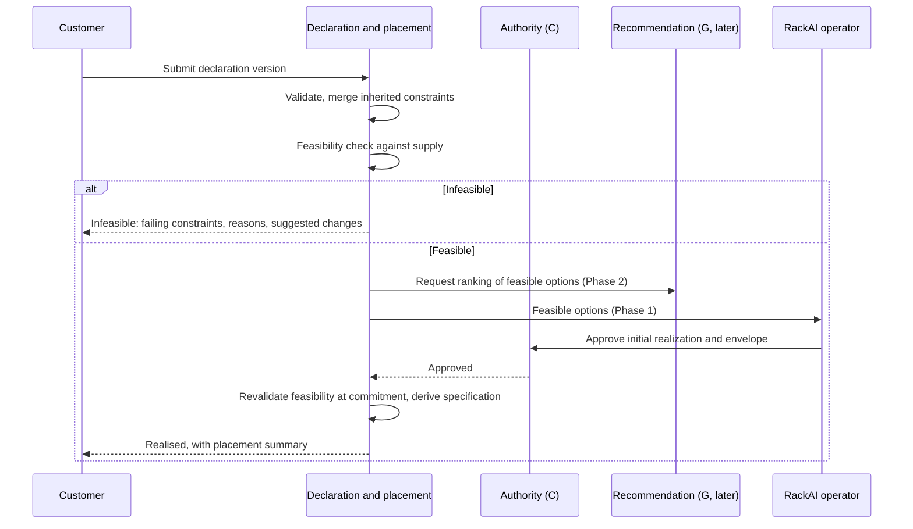

# Workload Declaration & Placement — PRD

| Field | Value |
|:--|:--|
| Version | v1.0 |
| Status | Approved |
| Owner | rackai-product |
| Reviewers | Product owner; Platform engineering (control plane); Governance (C/E owners) |
| Product approval | **Approved by the product owner, 2026-10-10, v1.0**: all product decisions PD-1 to PD-10 and acceptance criteria AC-1 to AC-14. Open decisions D-1 to D-8 remain open with their owners. Passing checks is not approval |
| Date | 2026-10-10 |
| Roadmap items | Supply-abstraction interface; Workload declaration (intent + constraints); Supply abstraction v1 - second impl (AMD/partner); Heterogeneous supply |
| Tech spec(s) | [[Workload Declaration & Placement Tech Spec]] (v0.4, 2026-10-10: v0.3 product-approved with the DV-3 interim; v0.4 applies the product owner's review rulings A4-1 to A4-13; engineering approval pending): covers Phase-1 FRs, defers Phase-2 FRs; extends the [[Accelerator Selection Spec]] additively |

> **Artifact type: Product Requirements Document.** The canonical concept is [[Workload Declaration]]; this PRD projects from it and from the intent-and-constraints contract in [[Three Battlegrounds]], and must not redefine them. If they disagree, the canonical notes win and this PRD is stale.
>
> **Status banner.** *Approved PRD for a proposed capability.* The product contract (decisions §20, acceptance criteria §15) is approved; nothing is built yet: there is no declaration object, no feasibility check and no supply abstraction today (§2). Approval fixes *what* we will build, not that it exists. Proposal **P-004**.
>
> **Scope line (read first).** This PRD owns **the customer's declaration contract and the placement mechanism**: what a customer declares, how RackAI decides whether it can be met, and how the chosen placement is realised and kept inside the declaration. It does **not** own: *which* placement is best, using evidence (**G**, [[Empirical Map]]); *who* may approve, override or act, and how that is enforced (**C**, Governed Execution & Delegated Authority); *what* an isolation or sovereignty level guarantees technically (**E**); the customer-facing evidence report (**D**); multi-region residency (**K**); fine-tuning job placement (open decision D-8).

## 1. Summary / Vision

Today a RackAI customer deploys a model by picking hardware. This PRD changes the contract: the customer says **what the workload needs and what it must never violate** (a [[Workload Declaration]]), and RackAI decides **how**: the accelerator, nodes, replicas and configuration, drawn from supply it addresses through one abstraction. When the declaration can't be met, RackAI says exactly which constraint fails and what would fix it, instead of quietly relaxing anything.

Why now: every later capability (governed execution, evidence-informed routing, the Concierge Engineer, inference access) consumes the declaration, and the control plane gets more expensive to abstract from a single owned fleet with every month it hardens (P-004).

## 2. Problem Statement

**What is broken today** (read-only code survey, `RSS-Engineering/rackai@79ca4de`, `rackai-ui@89bddb4`, `rackai-docs@ccb52a3`):

- **Customers specify hardware, not intent.** A deployment names a model class and, optionally, an `AcceleratorClass`; with none, the default scheduler picks any node that fits (`rackai@79ca4de:api/v1alpha1/modeldeployment_types.go`). There is no field for a workload profile, latency SLO, residency, sovereignty level, vendor policy or cost preference. The only performance knobs are autoscaling targets per replica.
- **No feasibility answer before resources are committed.** Unknown hardware is rejected at admission, but there is no capacity check; a deployment that can't be scheduled just sits pending, and the reason surfaces only when it is affinity-related (`AcceleratorPending`). Other cases fall through to a generic not-ready state.
- **The customer can't see why.** The UI shows a binary *Deployed / Deploying* badge; status conditions exist in the data model but no page renders them (`rackai-ui@89bddb4:src/app/pages/deployed-models/DeployedModelCard.tsx`).
- **One execution cluster, no supply abstraction.** The control plane drives exactly one workload cluster from one kubeconfig; there is no supply target, pool, region or location concept (`rackai@79ca4de:cmd/main.go`, `docs/architecture/overview.md`). The `"auto"` accelerator value is a reserved placeholder (RACKAI-251).

**Why it matters.** The adopted principle is *RackAI chooses by default; customers constrain when necessary* (2026-10-06). It can't be delivered while the only thing a customer can express is a GPU choice: the optimisation thesis needs RackAI to own the "how", and the sovereign promise needs the customer's hard constraints to be explicit, so we can prove they held. **Hypothesis** (no customer evidence yet): MOE-1 customers will accept RackAI choosing hardware when their hard constraints are explicit and visibly enforced.

## 3. Product Principles

1. **RackAI chooses by default; customers constrain when necessary.** Hardware is a constraint a customer *may* state, not the base consumption model.
2. **Hard constraints are never silently relaxed.** If they can't all hold, the answer is *infeasible, here's why*, never a quiet compromise. (This is where operator and sovereign meet: [[Three Battlegrounds]].)
3. **Say what you can verify.** A constraint RackAI cannot verify at placement time is never presented as met. *Infeasible* (known not to work) and *performance unverified* (feasible, but no evidence yet that the service level will be met) are different answers.
4. **The declaration is the customer's; the specification is ours.** The [[Model Deployment Specification]] is derived from the declaration, never authored in its place.
5. **One decision interface, human approval where it matters.** Authorized operators approve initial realizations and material changes to a placement envelope; routine operations inside an approved envelope run under established policy. Later automation uses the same interface, never a side door.
6. **Nothing that works today breaks.** Existing hardware-pinned deployments keep running and become declarations with a hard pin.

## 4. Scope: Goals & Non-Goals

**Goals**
- A customer can state intent and constraints once and get either a placement that honours every hard constraint or a precise infeasibility answer.
- RackAI, not the customer, makes hardware and configuration choices for unpinned workloads.
- Placement addresses supply through an abstraction, so a second supply source can be added without changing the customer contract.
- Every placement decision is attributable to a declaration version and leaves evidence.

**Non-Goals / Out of Scope**
- Choosing the *best* option from measured evidence: **G**. A produces the feasible set and executes; G ranks within it.
- Who may approve, override or change a placement, and how authority is enforced: **C**. A asks C; it doesn't decide authority.
- Defining what an isolation or sovereignty level guarantees technically (e.g. what "dedicated" means at node level): **E**. A places to E's rules.
- The customer-facing evidence report: **D**. A contributes records to D's evidence contract (D-0).
- Multiple regions, jurisdiction pinning and residency-aware failover: **K** (MOE-3). Phase 1 has one location; the attribute exists so K adds values without changing the contract.
- Fine-tuning job placement: open decision **D-8**.
- Quota policy definition: Metering M3/M4. A consumes quota as an input (D-4).

## 5. Users & Personas

| Persona | Side | Needs from A |
|---|---|---|
| **Customer application owner / ML engineer** | Customer | Declare a workload in their own terms; know fast whether it can run; understand why not |
| **Customer platform or security admin** | Customer | Set organisation-wide constraints (approved vendors, sovereignty minimum) that every declaration inherits; via **C** |
| **RackAI operator** | RackAI | See the feasible options for a declaration, approve a placement (MOE-1), handle infeasible and at-risk cases |
| **RackAI product & finance** | RackAI | Know what customers ask for (profiles, constraints, pins) to shape supply and pricing |
| **Downstream PRDs** (C, E, G, H, I) | Platform | One stable declaration contract to consume |

## 6. Core Entities

| Entity | Role here |
|---|---|
| [[Workload Declaration]] | The contract this PRD delivers (canonical; written with this PRD because six PRDs consume it) |
| [[Model Deployment Specification]] | RackAI's realisation record, derived from a declaration version |
| [[Model Deployment]] | The running workload the placement realises |
| [[Capacity Pool]] | Where capacity is drawn from; constrained by the declaration |
| [[Organization]] | Tenant scope; source of inherited constraints |
| [[Sovereignty Levels]] | The declared level is a hard constraint (Level 0 and 1 in Phase 1) |
| [[Traffic Class]] | The measured counterpart of the declared workload profile (used by G) |
| [[Empirical Map]] | G's source of recommendations; not part of A |

**Defined here, not yet canonical** (only A uses them until G is written; they move to a canonical note when a second PRD consumes them):
- **Supply target**: a source of capacity RackAI can place onto (owned fleet = implementation #1; partner, customer or hyperscaler later).
- **Accelerator pool**: a set of interchangeable accelerators within a supply target. Today's `AcceleratorClass` is the nearest existing concept.
- **Execution location**: where a placement physically runs (cluster, region). One location in Phase 1.
- **Placement envelope**: the approved bounds of a realised placement: supply target, accelerator pool(s) and types, execution location, sovereignty-relevant settings, and replica bounds. Routine operations stay inside it; anything outside it is a *material change*.

## 7. User Journeys / Scenarios

**Worked example — feasible.** A regulated customer declares: model *GLM 5.3 Flash*; profile *interactive*; service level per the ratified interactive thresholds (D-1); expected load *steady, moderate concurrency*; sovereignty *Level 1 (dedicated)*; hardware *NVIDIA only*; economics *lean toward cost*. Their organisation inherits *approved vendors: NVIDIA, AMD*.
1. A validates the declaration and shows the inherited constraints beside it. *NVIDIA only* narrows the inherited list, which is allowed; widening it would be rejected (FR-3).
2. A runs the feasibility check: which supply targets, pools and locations satisfy every hard constraint, and is there capacity?
3. A returns the feasible options, each marked *performance verified* (benchmark evidence shows the service level can be met) or *performance unverified*. An authorized operator chooses one and approves the initial realization under C's rule (later, G's ranked recommendation informs the choice). Choosing an unverified option is recorded as such; it does not claim the service level will be met.
4. At commitment, A revalidates feasibility (capacity and policy may have changed). If it still holds, A derives the deployment specification (accelerator, count, parallelism, runtime settings), records the declaration version, the approved placement envelope and the rationale, and realises the deployment. If it no longer holds, nothing is committed and the customer is told why.
5. The customer sees *Realised*, with the placement summary. Audit and evidence records are emitted.

**Worked example — infeasible.** Same declaration, but *hardware: AMD only* and *Level 1*. No dedicated AMD capacity is offered. A answers **Infeasible**, naming the *hardware* and *sovereignty* constraints together as the conflict, with reason *not offered*, and suggests the smallest changes that would make it feasible: *allow NVIDIA*, or *accept Level 0 (shared)*, noting that Level 0 changes the isolation guarantee. Nothing is created. The suggestions are never applied automatically.

**Lifecycle (request path).**

## 8. Functional Requirements

**Declaration**

| # | Requirement | Priority | Notes |
|---|-------------|:--------:|-------|
| FR-1 | A customer can create a declaration with: named model, workload profile, service-level targets, expected load, sovereignty level, hardware/vendor allow- or deny-list, location, economics preference | MUST | Attribute set per [[Workload Declaration]]; capability-class declarations are FR-18 |
| FR-2 | Every constraint is stored and shown as **hard** or **soft**. Defaults per PD-2; the customer may make a default-soft constraint hard, but not the reverse for inherited ones | MUST | |
| FR-3 | Inherited constraints (organisation policy, approved vendors, sovereignty minimum) are applied to every declaration and shown with their source. A declaration that would weaken one is rejected, naming the source | MUST | Inherited constraints are set through C |
| FR-4 | Declarations are versioned. Each realised placement records the version it satisfies | MUST | |
| FR-5 | Declaration create, read, amend and withdraw are available through the API and CLI; the console provides the same | MUST (API, CLI); SHOULD (console in Phase 1) | API-first, consistent with existing practice |
| FR-6 | Existing deployments that name an `AcceleratorClass` keep running unchanged and are represented as declarations with a hard hardware constraint | MUST | PD-5; no forced migration |

**Feasibility and infeasibility**

| # | Requirement | Priority | Notes |
|---|-------------|:--------:|-------|
| FR-7 | Before any resources are committed, RackAI decides whether the declaration is **feasible** (every hard constraint can be met with available capacity), and **revalidates feasibility at the moment of deployment commitment**. If it no longer holds at commitment, nothing is committed and the result is reported | MUST | Today there is no admission-time capacity check |
| FR-8 | An infeasible result names every failing or conflicting hard constraint and gives a reason category: *conflict* (constraints contradict each other or inherited policy), *not offered* (no supply RackAI offers can satisfy it, including a service level that evidence shows no option can meet), or *no capacity* (satisfiable supply exists but is full). A feasible option with no evidence either way that its service level can be met is **not** infeasible: it is marked *performance unverified* (PD-2) | MUST | |
| FR-9 | Where a change to the declaration would make it feasible, the result suggests the smallest such change(s) and states any guarantee the change would weaken. Suggestions are never applied automatically | MUST | PD-3 |
| FR-10 | RackAI never relaxes a hard constraint, and never substitutes a model, hardware, location or sovereignty level outside the declaration. If a violation nonetheless occurs at runtime (e.g. misconfiguration, node relabelling), it is **detected, contained** (the workload is stopped or moved back inside its constraints) and **evidenced** (audit event, evidence record, customer and operator notified) | MUST | Invariant; see AC-5 |
| FR-11 | When soft preferences can't all be met, the accepted placement states which were traded off and why | MUST | |
| FR-12 | For *no capacity*, the customer can choose to withdraw or wait; waiting declarations are re-checked when capacity changes and the customer is told when they become feasible | SHOULD | Reservation and queue semantics: D-7 |

**Placement**

| # | Requirement | Priority | Notes |
|---|-------------|:--------:|-------|
| FR-13 | Placement addresses capacity through the supply abstraction (supply target → accelerator pool → execution location). The owned fleet is implementation #1. No customer-visible behaviour depends on which supply target is used | MUST | Row 13. Mechanism belongs to the tech spec |
| FR-14 | A single **decision interface** accepts a proposed placement (from an operator in Phase 1, from G later), re-checks it against every hard constraint, and rejects any that violates one, with the reason. A proposal outside an approved placement envelope is routed for approval (FR-15) | MUST | A/G boundary: G only ranks within the feasible set |
| FR-15 | An **authorized operator** approves every **initial realization** and every **material change to a placement envelope** (new supply target, pool or accelerator type, location, sovereignty-relevant setting, or replica bounds beyond those approved). **Routine operations inside an approved envelope** (scaling within bounds, replacing failed nodes within the same pool) proceed under established policy without per-action approval, and are audited. Who is authorized, and the policy, are decided by C | MUST | PD-4 |
| FR-16 | RackAI derives the [[Model Deployment Specification]] from the declaration and the approved placement, recording the declaration version, the approved placement envelope, the choices made (accelerator, count, parallelism, runtime settings), whether performance was verified, and the rationale | MUST | |
| FR-17 | Accuracy-affecting choices (quantization below the model's reference precision, model substitution) are made only where the declaration allows them | MUST | PD-6 |
| FR-18 | A customer can declare a capability class ("a model that meets X") instead of a named model, and RackAI selects the model | MAY (Phase 2) | Needs G evidence; D-5 |
| FR-19 | After realisation, RackAI may re-place or rescale a workload within its hard constraints without a new declaration. Re-placements that disrupt service follow C's authority rule | SHOULD | PD-7; D-3 |

**Visibility and evidence**

| # | Requirement | Priority | Notes |
|---|-------------|:--------:|-------|
| FR-20 | The customer can see each declaration's state (Draft, Submitted, Infeasible, Accepted, Realised, Amended, Retired), the reason for any non-realised state, and whether the realised placement's performance is verified or unverified, in the API and console | MUST | Fixes today's gap: reasons exist but aren't shown |
| FR-21 | Each submission outcome, approval, realisation, re-placement and infeasibility emits an audit event and an evidence record in the shape defined by D-0 | MUST | Feeds D |
| FR-22 | The feasibility check considers the organisation's quota once quota policy exists, expressed in declaration terms rather than GPU counts | SHOULD (Phase 2) | D-4; depends on Metering M3/M4 |

## 9. Non-Functional Requirements

- **Integrity of hard constraints.** Zero placements that violate a hard constraint at commitment. This is an invariant, not a target, and it must be testable (AC-5) and auditable after the fact. At runtime, any violation is detected, contained and evidenced (FR-10); detection and containment times are target postures for the tech spec to set and measure.
- **Responsiveness.** A feasibility answer arrives in interactive time, so a customer gets an answer while they wait, not after the deployment fails. The exact bound is a target posture for the tech spec to set and measure; there is no baseline today.
- **Fail closed.** If feasibility, inherited policy or the decision interface is unavailable, nothing is placed (§12).
- **Tenancy.** Declarations are scoped to one organisation; no declaration, option list or reason reveals another tenant's workloads or capacity use.
- **Compatibility.** Existing deployment APIs keep working (FR-6). The declaration API is versioned.
- **Supply independence.** The customer contract is identical whichever supply target serves it.

## 10. Platform Integration

| System | Needs from it | Provides to it |
|---|---|---|
| Identity & access (IAC) | Permissions to declare, amend, withdraw, and (operator) approve placement | New permission set for declarations |
| Tenancy & isolation | Organisation and project scope; E's rules for what each sovereignty level requires | Declarations scoped per organisation |
| Metering, quotas & billing | Quota in declaration terms (Metering M3/M4; D-4) | Usage attributed to the declaration version and placement |
| Audit | Audit event pipeline (Auditability spec) | Events for every decision (FR-21) |
| Monitoring & observability | Capacity and inventory signals (accelerator inventory, shipped) | Declaration and placement state metrics; at-risk signals |

## 11. Loop Role & Cross-PRD Interfaces

**Loop role:** *Declare* (the customer's what) and the execution half of *deliver the how* (realise the placement). It serves the contract between the two centres: the customer's hard constraints are the sovereign side's envelope; realising them is the operator side's job.

| Interface | Direction | Other PRD | Defined where |
|---|---|---|---|
| Workload declaration (intent + constraints) | provides | C, E, G, H, I | [[Workload Declaration]] (canonical) |
| Feasible option set | provides | G | This PRD (FR-7, FR-14) |
| Placement recommendation (ranked options, confidence, evidence) | consumes | G | G's PRD (Phase 2) |
| Authority to approve, override, re-place disruptively, set inherited constraints | consumes | C | C's PRD |
| Boundary rules (what each sovereignty level requires of placement) | consumes | E | E's PRD |
| Evidence records | provides | D | D-0 evidence contract |

## 12. Failure Handling

- **Feasibility or policy service unavailable:** submissions wait in *Submitted*; nothing is placed. The customer sees why.
- **Decision interface receives a violating proposal:** rejected with the failing constraint; nothing changes.
- **Feasibility changed between check and commitment:** revalidation at commitment catches it; nothing is committed and the customer sees the new result.
- **Capacity lost after realisation** (node failure, pool shrink): RackAI re-places within the approved envelope under routine policy. If that isn't possible, a move elsewhere within the hard constraints is a material envelope change and needs approval (FR-15). If no compliant capacity exists, the workload is reported *at risk* to the customer and operator. It is never moved outside the declaration.
- **Hard constraint found violated at runtime:** detected, contained (stopped or moved back inside its constraints) and evidenced to customer and operator (FR-10). Containment never relaxes another hard constraint.
- **Declaration amended while realised:** the running placement stays until the new version is accepted and realised; if the new version is infeasible, the old one keeps running and the customer is told.
- **Guaranteed never to happen:** a hard constraint violated, an inherited constraint weakened, a suggestion applied without the customer amending the declaration.

## 13. Data Retention & Compliance

Declarations hold workload metadata and constraints, not customer content or prompts. All versions are retained for the workload's life and then per the platform's audit retention setting. Declarations are evidence that boundaries were requested and held, which MOE-1 assurance relies on (E, D).

## 14. Scope & Phasing

| Phase | Gate | Delivers | Roadmap items |
|---|---|---|---|
| **1** | MOE-0 → MOE-1 | Declaration v1 (FR-1 to FR-6), feasibility and infeasibility (FR-7 to FR-11), supply abstraction with the owned fleet as implementation #1 (FR-13), decision interface with operator approval (FR-14 to FR-17), visibility and evidence (FR-20, FR-21) | Supply-abstraction interface; Workload declaration (intent + constraints) |
| **2** | MOE-1 → MOE-2 | Wait-for-capacity (FR-12), G recommendations through the decision interface, capability-class declarations (FR-18), in-constraint re-placement (FR-19), quota in declaration terms (FR-22) | — |
| **Later** | MOE-4 | A second supply implementation behind the same interface; then heterogeneous supply (owned, partner, customer, hyperscaler) | Supply abstraction v1 - second impl (AMD/partner); Heterogeneous supply |
| **Elsewhere** | MOE-3 | Multi-region and jurisdiction pinning | K: Residency & Multi-Region |

Sequencing note: prototype the declaration with one MOE-0 workload before generalising (operate before automate).

## 15. Acceptance Criteria & Success Metrics

**Acceptance criteria** (Phase 1; each pass/fail; approved 2026-10-10):

| # | Criterion (observable, pass/fail) | Verifies | How tested |
|---|---|---|---|
| AC-1 | A customer submits a declaration containing every Phase-1 attribute through the API and receives a versioned identifier; reading it back returns the same values | FR-1, FR-4, FR-5 | API test |
| AC-2 | Every constraint in a stored declaration, and in its API response, is labelled hard or soft, with defaults applied per PD-2 | FR-2 | API test |
| AC-3 | For each infeasibility category (conflict, not offered, no capacity), a test declaration returns *Infeasible* naming every failing hard constraint and the category, with at least one suggested change where one exists, and no deployment, pod or reservation is created. Separately, a feasible declaration with no performance evidence returns *Feasible, performance unverified*, not *Infeasible*, and nothing in the response states or implies that the service level will be met | FR-7, FR-8, FR-9, PD-2 | Test matrix: one case per category plus one unverified case; check no resources exist for infeasible cases |
| AC-4 | When the only pool satisfying the hard constraints is full, the result is *no capacity*; the workload is not placed on any non-satisfying pool | FR-10 | Negative test with capacity exhausted |
| AC-5 | (a) Across the full placement test suite, zero placements violate a hard constraint at commitment, verified by comparing each realised specification with its declaration version. (b) When feasibility changes between check and commitment, nothing is committed and the new result is reported. (c) When a hard-constraint violation is injected at runtime, it is detected, the workload is contained (stopped or moved back inside its constraints without relaxing another), and an audit event, an evidence record and customer and operator notifications are produced | FR-7, FR-10, NFR integrity | (a) property-style test plus audit query; (b) commit-race test; (c) fault-injection test |
| AC-6 | A proposed placement that violates any hard constraint is rejected by the decision interface with the failing constraint named; state is unchanged | FR-14 | API test |
| AC-7 | Every initial realization and every material change to a placement envelope has a recorded approval by an operator authorized under C's policy, and an unauthorized approval is rejected. Routine operations inside an approved envelope (scaling within bounds, node replacement in the same pool) complete without per-action approval and are audited. An operation outside the envelope is blocked until approved | FR-14, FR-15 | API test per case plus audit check |
| AC-8 | Each realised deployment's specification records the declaration version, the approved placement envelope, the choices made, whether performance was verified or unverified at approval, and the rationale, all retrievable through the API | FR-16 | API test |
| AC-9 | A declaration that would weaken an inherited constraint is rejected, naming the inherited source | FR-3 | API test |
| AC-10 | After upgrade, existing deployments with an explicit `AcceleratorClass` keep serving without change and are listed as declarations with a hard hardware constraint | FR-6 | Upgrade test on a copy of a real estate |
| AC-11 | The customer can see the state and reason for any declaration that is not realised, in both API and console, including the pending reasons that today are never shown | FR-20 | API test plus console check |
| AC-12 | Every decision listed in FR-21 produces an audit event and an evidence record that validates against the D-0 contract | FR-21 | Event schema test |
| AC-13 | With the feasibility check or inherited-policy source unavailable, a submitted declaration is not placed and shows why | §12 | Fault-injection test |
| AC-14 | The placement test suite, including commit-time revalidation and envelope checks, passes unchanged against a second, test-only supply implementation, showing no placement path depends on the owned fleet | FR-7, FR-13, FR-15 | Run the suite against a mock supply target |

**Success metrics** (ladder; baselines are "none today" unless stated; targets are postures to instrument, not values):

1. **Contract adoption:** share of new deployments created from a declaration. Baseline 0%.
2. **RackAI chooses:** share of declarations with no hardware pin. Baseline: none; every deployment today chooses hardware or takes the default scheduler. A *diagnostic*, not the falsification test: a pin can be a legitimate constraint.
3. **Integrity:** hard-constraint violations at commitment (must stay at zero, an invariant) and runtime violations detected and contained (tracked).
4. **Useful infeasibility:** share of infeasible declarations that become feasible after one amendment.
5. **Verified placements:** share of realised placements whose performance was verified at approval. Baseline: none.
6. **Time to endpoint:** time from submission to a realised endpoint. No baseline today; instrument in Phase 1.
7. **Outcome (measured by D):** [[SLO Attainment]] of declared workloads against their declared service levels.

## 16. Dependencies

- **Decision (row 11):** per-profile SLO thresholds. The workload-profile and service-level attributes depend on them (D-1).
- **C:** approval authority, inherited-constraint administration, disruptive re-placement rule.
- **E:** what each sovereignty level requires of placement (dedicated means what, at node level).
- **D-0:** the evidence record contract.
- **G (Phase 2):** recommendations through the decision interface.
- **Metering M3/M4:** quota policy and admission control (FR-22).
- **Engineering:** the [[Accelerator Selection Spec]] (accelerator classes, inventory), the IAC and Auditability specs, and console work to show states and reasons.
- **Depended on by:** C, E, G, H, I.

## 17. Risks & Mitigations

| Risk | Mitigation |
|---|---|
| Customers reject managed placement | Hardware pins stay fully supported as hard constraints (FR-6); record why customers decline or reverse managed placement; kill criterion §18 |
| GPU-centric quota plans contradict the declaration model | Quota in declaration terms is an explicit open decision (D-4) with Metering; Phase 1 works without it |
| Service levels promised without evidence (overpromising) | *Performance unverified* is a separate, visible state; operator acknowledgment records acceptance of the risk and never implies attainment (PD-2) |
| The supply abstraction looks premature on a single cluster | Phase 1 delivers the interface plus a test-only second implementation (AC-14), not multi-provider scheduling |
| A drifts into evidence-informed decision-making (G's job) | The decision interface only checks constraints and executes; ranking is G's (§11) |
| Reasons stay invisible, as with today's conditions | Console visibility is an acceptance criterion (AC-11), not polish |

## 18. Kill / Falsification Criterion

The bet is that MOE-1 customers will accept **managed placement**: RackAI choosing the how inside their hard constraints. It is falsified by **genuine customer rejection of managed placement**, not by how often customers pin hardware, because a pin can be a legitimate constraint.

**Falsified if** most MOE-1 customers who were offered managed placement decline it, or reverse it after trying it, for reasons of **performance** (it didn't meet their service level), **economics** (it cost more than choosing themselves) or **control** (they won't delegate the choice), **and** the rejection persists after RackAI has addressed the stated concern within the approved scope.

**Evidence:** the reasons recorded when a customer declines or reverses managed placement (amendment records and operator notes), MOE-1 customer reviews, [[SLO Attainment]] of managed vs pinned workloads, and cost per workload from B. Pin frequency is a diagnostic only.

**If falsified:** keep the declaration (its constraints and evidence still serve the sovereign promise), stop treating managed placement as the default, rethink G's commercial premise, and revisit the placement principle with the product owner. The threshold ("most") is proposed for approval (PD-10).

## 19. Open Decisions

| # | Decision | Owner | Blocks |
|---|----------|-------|--------|
| D-1 | Workload profile set and per-profile service-level thresholds (roadmap row 11) | Product owner | FR-1 service-level attribute; AC-1 |
| D-2 | Org-level permissions: the roadmap says IAC M4 was dropped, but org-scoped role bindings are built and switched off. Which governs inherited constraints? | Product owner, with C | FR-3 administration |
| D-3 | Who may approve placements at MOE-1, and who may authorise a disruptive re-placement | Product owner, with C (row 39) | FR-15, FR-19 |
| D-4 | Quota model in declaration terms vs today's GPU-centric plans | Product owner, with Metering (Rohit) | FR-22 |
| D-5 | Capability-class declarations: may RackAI choose the model? Within what quality bar? | Product owner | FR-18 |
| D-6 | Supply-abstraction vocabulary and how it maps onto today's `AcceleratorClass` | Platform engineering (tech spec) | FR-13 |
| D-7 | *No capacity*: wait list only, or reservations with time bounds? | Product owner | FR-12 |
| D-8 | Do fine-tuning jobs use the same declaration and placement? *Proposed answer (2026-10-10, not approved): [[Fine-Tuning Operations PRD]] PD-10. Phase 1: no declaration for fine-tuning jobs, and `"auto"` is rejected at admission. Phase 2: jobs are checked against inherited hard constraints through A's feasibility interface. Annotated per product-owner review ruling A4-11.* | Product owner, with J | Scope |

## 20. Proposed Product Decisions

All decisions approved by the product owner on 2026-10-10.

| # | Decision | Alternatives considered | Why this one | Status |
|---|---|---|---|---|
| PD-1 | The declaration is a **first-class, versioned customer object**, distinct from the deployment; the specification is derived from it | Add constraint fields to today's deployment | Keeps what and how separate; versions and evidence attach to the customer's statement; one declaration can be re-placed without the customer rewriting anything. (How engineering implements it is the spec's choice.) | **approved 2026-10-10** |
| PD-2 | **Hard by default:** model, sovereignty level, location, hardware lists, inherited constraints. **Soft by default:** economics. **Service level** is declared per target and handled two distinct ways. (1) **Known infeasibility:** evidence shows no option can meet it, so the result is *Infeasible* (category *not offered*). (2) **Feasible, performance unverified:** no evidence either way, so the option is marked unverified. An authorized operator may approve an unverified option; that acknowledgment records acceptance of the risk and **never implies verified SLO attainment**. The customer sees the unverified status until measured attainment (D) replaces it | Everything soft; service level always hard; unverified treated as infeasible (v0.1) | Separates what we know won't work from what we haven't yet proven, so we neither block feasible workloads nor imply a promise we can't back (principle 3) | **approved 2026-10-10** (revised v0.2) |
| PD-3 | Infeasible means **report, never relax**. Suggestions are offered, never applied | Auto-apply the nearest feasible alternative | The sovereign promise; a silent relaxation is the failure we most need to avoid | **approved 2026-10-10** |
| PD-4 | **Authorized operators approve initial realizations and material changes to the placement envelope.** Routine operations inside an approved envelope proceed under established policy (set by C), audited but without per-action approval. Automation later uses the same decision interface | An operator approves every placement action (v0.1); automatic placement from day one | Puts human judgement where the risk is (first placement, envelope changes) without turning routine operation into an approval queue; consistent with the human-operated → automated ladder | **approved 2026-10-10** (revised v0.2) |
| PD-5 | Existing hardware-pinned deployments become declarations with a **hard hardware pin**; no forced migration | Require re-declaration | Principle 6; zero disruption to Uniphore and current tenants | **approved 2026-10-10** |
| PD-6 | **Accuracy-affecting choices** (lower quantization, model substitution) only where the declaration allows | RackAI free to quantise for cost | These change what the customer gets, not just how; they belong to the customer | **approved 2026-10-10** |
| PD-7 | **Re-placement within hard constraints** is RackAI's call when it doesn't disrupt service; disruptive re-placement follows C's rule | Every re-placement needs customer approval; none does | Lets the operator operate, while authority over disruption stays with C | **approved 2026-10-10** |
| PD-8 | **Phase 1 covers model-serving deployments only** | Include fine-tuning jobs now | Narrowest real instance first; fine-tuning placement is D-8 with J | **approved 2026-10-10** |
| PD-9 | **One location in Phase 1**, with the location attribute present so MOE-3 adds values without a contract change | Defer the attribute | Avoids a breaking change later at no cost now | **approved 2026-10-10** |
| PD-10 | Falsification tests **genuine customer rejection of managed placement**: falsified if **most** MOE-1 customers offered managed placement decline or reverse it for performance, economics or control reasons, and the rejection persists after RackAI addresses the stated concern within approved scope. Hardware-pin frequency is a diagnostic, not the test (§18) | Pin frequency as the test (v0.1); a fixed percentage now | A pin can be a legitimate constraint; what would falsify the bet is customers rejecting the managed choice itself. No baseline exists to set a number honestly | **approved 2026-10-10** (revised v0.2) |

## See Also

- [[Workload Declaration]] — the canonical concept this PRD builds on
- [[Three Battlegrounds]] — the intent-and-constraints contract
- [[PRD Coverage Plan]] — where A sits among the ten PRDs and why it is first
- [[Model Deployment Specification]] — the realisation record derived from a declaration
- [[Workload Declaration & Placement Tech Spec]] — the Stage-2 engineering design for this PRD
- [[Accelerator Selection Spec]] — today's accelerator classes and inventory, which the Stage-2 spec is likely to extend
- [[RackAI Roadmap]] — P-004 and the Workload Placement Policy
