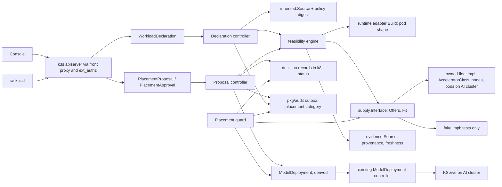
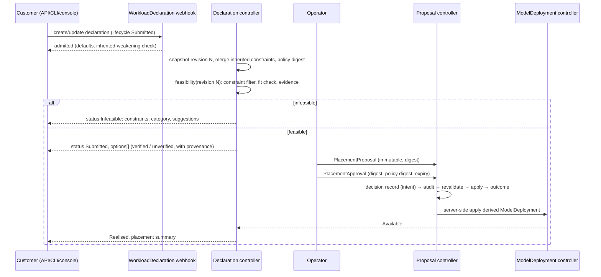

# Workload Declaration & Placement — Technical Specification

| Field | Value |
|:--|:--|
| Version | v0.5 |
| Status | In review: v0.3 product-approved 2026-10-10; v0.4 applies the product owner's review rulings A4-1 to A4-14 (§0.1); v0.5 fixes nine code-review findings (§0.2); DV-7 and R5-9 approved by the product owner 2026-10-10; engineering approval pending |
| Author | Wiki agent for rackai-product (draft for platform engineering) |
| Reviewers | Platform engineering (control plane); Product owner; UI; Docs; Governance (C/E owners) |
| Engineering approval | not yet approved |
| Product approval | **Approved by the product owner, 2026-10-10, v0.3, "approve spec with DV-3 interim"**: the spec is approved with DV-3's interim behaviour (disruptive policy changes rejected until C's authority model exists, §4.5 step 9). DV-2 and DV-4 approved with clarification; DV-3 stays open pending C (Q-16). The MOE-0 manual runtime check (§13.0) was approved the same day ("MOE-0 manual check is fine"). Passing checks is not approval |
| Product review (v0.4) | **Product-owner review disposition, 2026-10-10** (batch B–J review): A4-1, A4-3 to A4-9 and A4-11 to A4-13 approved; A4-14 approved the same day ("approve A4-14"); DV-5 and DV-6 confirmed ("confirm the rest"); A4-2 revised per X-1; A4-10 kept as a requirement, design deferred. Applied in v0.4 (§0.1). The disposition is recorded as given; formal re-approval of v0.4 and engineering approval are separate recorded actions |
| Product review (v0.5) | **DV-7 and R5-9 approved by the product owner, 2026-10-10** ("approve DV-7 and R5-9"): the customer-visible `Contained` phase, and MOE-0 requiring an approval TTL (C's value or an explicit rehearsal-only value). R5-1 to R5-6 and R5-8 correct internal inconsistencies found in code review (non-material). Formal re-approval of the whole v0.5 text and engineering approval are separate recorded actions |
| Date created | 2026-10-10 |
| Based on PRD(s) | [[Workload Declaration & Placement PRD]] (v1.0, approved 2026-10-10) |
| Roadmap items | Supply-abstraction interface; Workload declaration (intent + constraints); Supply abstraction v1 - second impl (AMD/partner); Heterogeneous supply |
| Jira epic(s) | none yet: one epic per milestone (§13) to be created by platform engineering |

> **Artifact type: Technical Specification.** This is an authored engineering design. Its concepts have canonical notes: [[Workload Declaration]], [[Model Deployment Specification]], [[Accelerator Class]], [[Capacity Pool]], [[Sovereignty Levels]]. This spec designs *how* to build them and does not redefine them.
>
> **Status banner.** *Proposed design; nothing is built.* Every design statement is `assumed`. Statements about today's code are `derived` from the read-only survey in §3, pinned to commits. Later roadmap items (second supply implementation, heterogeneous supply) get the **interface** here; their implementations are a later revision of this spec.

### 0. Status markers (convention)

- **AS BUILT (YYYY-MM-DD, TICKET):** what shipped where it differs from the design above it.
- **PROPOSED, NOT BUILT (YYYY-MM-DD):** designed here, not implemented.
- **RETAINED FOR THE RECORD:** a rejected or replaced design kept for the decision record.

**RETAINED FOR THE RECORD (v0.1 → v0.2, 2026-10-10):** v0.1 had five designs that v0.2 replaces after product review:
- containment that could delete the derived deployment as a fallback;
- a feasibility capacity check that summed GPUs across a pool;
- approvals bound only by proposal name;
- an audit write described as "the same transaction" as the Kubernetes change;
- adoption that treated inferred declarations like customer-authored ones.

The v0.2 replacements are in §4.4, §4.6–§4.9 and §4.11.

### 0.1 v0.4 changes (product-owner review disposition, 2026-10-10)

Requested by the batch B–J PRDs and ruled on by the product owner. Each change is applied in the section named.

| # | Ruling | Change | Where |
|---|---|---|---|
| A4-1 | approve | Final C signature (C spec §4.5): `ForPolicyChange(ctx, AuthorityContext, policyUID, generation, impactDigest) → authorised{ref, authoriser, emergency, context} \| denied \| absent`. `pendingImpact` gains `author`, `since` and `tightenOnly`. A calls C's `Consume` after writing its decision record | §4.5 |
| A4-2 | **revise (X-1)** | Inherited policy is owned by the customer's **authority principal** from [[Authority Context]]: the CustomerOrg only when it is explicitly validated as single-customer, otherwise the Organization. Invariant: *no customer can create, approve, weaken or inherit authority over another customer's workload through a shared parent.* A consumes the authority principal (C) and the isolation principal (E, the Organization) and never treats them as interchangeable | §4.5, §7 |
| A4-3 | approve, with clarification | Placement authority sits at platform scope (C's `placement-operator` role). Proposer and approver are distinct; approvals expire and are replay-protected (already §4.7) | §4.7, §7 |
| A4-4 | approve | Permissions renamed to `declaration:write` / `declaration:read`, so they no longer collide with IAC's `workload` resource. Nothing is built, so no migration is needed; IAC's `workload:execute`/`cancel` are unchanged | §5, §7 |
| A4-5 | approve | E owns computed boundary compliance: E's boundary controller sets the Level 1 pool labels while the node set is compliant. A consumes them | §4.4, §8 |
| A4-6 | approve | E's foreign-pod detection feeds A's **containment policy** (E's severity-based containment), not an unconditional stop | §4.9 |
| A4-7 | approve | Evidence records adopt the D-0 envelope and deterministic record identity | §4.11 |
| A4-8 | approve | G owns the performance-verification rules; A's Phase-1 table may only quarantine evidence. *Unverified never means infeasible*, and the four option states are always distinguishable | §4.6, §4.6.1 |
| A4-9 | approve | Declaration attribution labels on usage are **Must have** | §7, M4 |
| A4-10 | defer design, retain requirement | A candidate revision alongside a realised workload (needed for F's canary) is a retained requirement. Its design comes in a later revision (Q-18) | §14 |
| A4-11 | approve | PRD A D-8 annotated with J's proposed answer | PRD A §19 |
| A4-12 | approve | "First PrometheusRule" corrected: seven templates already ship | §1.6, §7 |
| A4-13 | approve, prioritise | §4.6, §4.6.1 and §4.7 restored | §0 |
| A4-14 | **approve** (product owner, 2026-10-10; raised by E after the review) | New reasons `ModelSourceNotStaged` and `ArtefactIntegrityFailed`, for Level 1 placements whose model artefacts are not pre-staged with verified integrity (E DV-2, approved). At submission they are *not offered* reasons; at commit or runtime they are `AtRisk` reasons | §4.6, Appendix A |

**CORRECTION (2026-10-10, after `e1ae63f`):** the v0.3 editing pass accidentally deleted §4.6, §4.6.1 and §4.7 from the committed text. They are restored verbatim from v0.2, with the one v0.3 wording change in them (*stop-capable* → *containment-qualified*, §4.6 step 2). This is not a design change: the restored sections are the design that was reviewed and product-approved.

### 0.2 v0.5 changes (code review, 2026-10-10)

A `/code-review` of the published text (`e1ae63f`) found ten defects; the first (§4.6, §4.6.1 and §4.7 missing) was already fixed in v0.4 (A4-13). The other nine are fixed below. Original v0.4 design text that a fix replaces is noted in the row, per the as-built discipline.

| # | Finding | Fix | Classification | Where |
|---|---|---|---|---|
| R5-1 | The violation ID hashed the node's `resourceVersion`, which changes on every node status heartbeat, so one fault produced a new ID (and a new containment, audit rows and notifications) on every resync | The ID is computed from the **observed values of the failing attributes** instead, so the same fault keeps one ID and a genuinely different fault gets a new one | non-material (internal correctness) | §4.9 |
| R5-2 | The single `inFlightDecision` claim let a placement commit waiting on the audit store block a containment for the same declaration | Safety decisions (containment, enforcement of an authorised policy change) never wait on the placement claim. They take a separate per-violation slot and pre-empt a placement decision that has not reached stage 4 | non-material (restores the stated rule "safety actions are not gated on audit") | §4.9, §4.11, §9 |
| R5-3 | The policy digest hashed each policy's `metadata.generation`, so a pending (or rejected-and-reverted) disruptive edit invalidated every pending approval although effective policy had not changed | The digest uses each policy's **`status.effectiveGeneration`** and effective spec only | non-material (internal consistency with §4.5 step 1) | §4.5 |
| R5-4 | §4.11 defined the evaluation decision ID as the revision only, while Appendix A included the policy digest; under §4.11, a re-evaluation after a policy change would be dropped by the idempotent insert | §4.11 now matches Appendix A: (revision, policy digest) | non-material (consistency) | §4.11 |
| R5-5 | In-flight commitments were never released (a deployment stuck unschedulable held phantom headroom forever) and partly bound deployments were counted twice | A commitment covers only **not-yet-bound replicas** and ends when each replica is bound or reported `Unschedulable` by the scheduler, or the decision is abandoned, contained or retired | non-material (internal correctness) | §4.4 |
| R5-6 | The fit check placed only `minReplicas`; with `minReplicas = 0` it placed nothing and reported feasible | The fit places **at least one replica** (`max(minReplicas, 1)`), and `fittableReplicas` against `maxReplicas` is reported as a stated trade-off | non-material (aligns with FR-7: "can be met with available capacity"); for confirmation | §4.4, §4.6 |
| R5-7 | A contained (stopped) workload showed phase `Realised`, while §4.9.1 treats it as having no active realization | New phase **`Contained`** (DV-7) | **material** (customer-visible state not in PRD FR-20's list); **approved 2026-10-10** | §1.4, §4.9.1, Appendix A |
| R5-8 | Retention finalizers kept placement objects in etcd for up to the compliance window (2557 days), blocking namespace and CustomerOrg deletion and duplicating audit history | At retirement, or when the namespace is terminating, the controller **archives** each object to the `placement` audit category, then releases its finalizer. Retention then follows the audit store's policy | non-material (the audit store is already the system of record for history, §4.2) | §4.2, §10, §4.11 |
| R5-9 | The chart refused to render without values that §13.0 only requires at MOE-1, so the MOE-0 rehearsal could not enable placement | Each policy-owned value is required **only when its feature is on**: guard timings when `placement.guard.enabled` (off at MOE-0), evidence `maxAge` only when a verifying evidence source is configured. The approval TTL is always required, so **MOE-0 needs C's TTL value or an explicit, rehearsal-only value** recorded in the rehearsal log | **material** (changes the MOE-0 gate's decisions); **approved 2026-10-10** | §3.5, §13.0 |

**RETAINED FOR THE RECORD (v0.2 → v0.3, 2026-10-10):** v0.2's DV-3 design let a policy author's own `acknowledgeAffectedWorkloads` list make a disruptive change effective. The product owner ruled that naming the affected workloads is necessary but not sufficient. It is replaced by impact presentation plus an authorisation under C's delegated-authority model (§4.5).

## 1. Overview

This spec adds a customer-facing **WorkloadDeclaration** resource and a placement pipeline behind it to the RackAI control plane (`RSS-Engineering/rackai`). The pipeline has five stages. It merges inherited constraints. It checks feasibility against supply reached through a new **supply abstraction**. That check is a per-node fit check of the exact pod shape the runtime would build, not a GPU count. It returns either feasible options or an itemised infeasibility. It accepts proposed placements through one **decision interface**, which enforces operator approval bound to an immutable proposal version and the policy state at approval time. Last, it derives a `ModelDeployment` from the approved placement and keeps it inside its declaration at runtime.

Every decision is first recorded durably in Kubernetes, then audited idempotently in PostgreSQL. A crash can therefore always be recovered by reconciliation, with no new service. The change is **additive**. Existing `ModelDeployment`, `ModelClass` and `AcceleratorClass` contracts keep working, and pinned deployments are adopted as *system-inferred* declarations without being modified. The console (`rackai-ui`) gains declaration and approval pages, and the docs (`rackai-docs`) gain a guide and API reference.

### 1.1 Goals

- G-1: A versioned declaration object holding hard and soft constraints, plus the inherited constraints merged into it (FR-1 to FR-4).
- G-2: One feasibility engine with an itemised result, run at submission and again at commitment. Its capacity answer comes from a schedulability check, not from aggregate counts (FR-7 to FR-9, FR-11).
- G-3: A supply interface (supply target → accelerator pool → execution location). The owned fleet is implementation #1 and a test-only fake is implementation #2 (FR-13, AC-14).
- G-4: One decision interface. Approvals are single-use and bound to a proposal digest, a declaration revision, a policy digest and an expiry, and approval is enforced fail-closed (FR-14, FR-15).
- G-5: A derived `ModelDeployment` that records its declaration revision, envelope, rationale and performance provenance (FR-16, FR-17).
- G-6: A runtime guard that tells suspected violations from confirmed ones, contains confirmed ones deterministically by stopping the workload, and evidences both (FR-10).
- G-7: Visibility of states and reasons in the API, CLI and console. Every decision gets a durable intent, idempotent audit and evidence, and recovery after a crash (FR-20, FR-21).
- G-8: No break for existing deployments, and inferred declarations are never presented as customer-authorised (FR-6).

### 1.2 Non-Goals

- **Ranking options with evidence:** G ([[Empirical Map]]). This spec exposes the feasible set and a decision interface G will call. The schedulability check (§4.4) is a yes/no fit test, **not an optimiser**: it never picks a "best" node or packing.
- **Who is authorised, approval lifetime, and authority policy:** C (Q-2, Q-3, Q-14).
- **What a sovereignty level requires at node level:** E (Q-4).
- **The evidence report and the evidence contract itself:** D and D-0 (Q-5).
- **Multi-region:** K. The location field exists, with one value (PD-9).
- **Phase-2 FRs:** wait-for-capacity (FR-12), capability-class declarations (FR-18), in-constraint re-placement (FR-19) and quota in declaration terms (FR-22). These are deferred (§1.3).
- **The P4 model-aware "auto" scheduler** (RACKAI-251, [[Accelerator Selection Spec]] Phase 4), and any replacement Kubernetes scheduler. The Kubernetes scheduler stays authoritative for binding pods.
- **Fine-tuning jobs** (PD-8, D-8).
- **No new service.** Everything runs in the existing manager binary and the existing PostgreSQL audit store.

### 1.3 Requirements Traceability

All 22 functional requirements of `prd-workload-declaration-placement`:

| PRD · req | Spec section(s) | Milestone | Status |
|---|---|---|---|
| prd A · FR-1 declaration attributes | §4.1 | M1 | covered (the service-level enum waits on D-1, Q-1) |
| prd A · FR-2 hard/soft labelling, PD-2 defaults | §4.1 (`hardness`), §4.6 | M1 | covered |
| prd A · FR-3 inherited constraints, no weakening | §4.5, §6.1 | M1 | covered (the policy source depends on C/D-2, Q-2); disruptive policy changes to realised workloads: partial, DV-3 open pending C (Q-16) |
| prd A · FR-4 versioning, version recorded on placement | §4.2, §4.7 | M1 | covered |
| prd A · FR-5 API + CLI + console CRUD | §5, §13 M1 (API/CLI), M5 (console) | M1, M5 | covered |
| prd A · FR-6 pinned deployments adopted | §4.8 | M1 | covered (system-inferred origin, no approval or customer authorisation fabricated, DV-4 approved; unpinned legacy: Q-8) |
| prd A · FR-7 feasibility before commit and at commit | §4.4 (fit), §4.6, §6.1, §6.2 | M2, M3 | covered |
| prd A · FR-8 infeasibility categories, unverified ≠ infeasible | §4.4, §4.6, §4.6.1 | M2 | covered |
| prd A · FR-9 smallest suggested changes, never applied | §4.6 (suggestions) | M2 | covered |
| prd A · FR-10 never relax; runtime detect / contain / evidence | §4.6, §4.7, §4.9 | M3 (commit), M4 (runtime) | covered (Phase-1 containment = stop, DV-1; qualified runtimes only, DV-2 approved) |
| prd A · FR-11 soft trade-offs stated | §4.6 (`tradeoffs`) | M2 | covered |
| prd A · FR-12 wait for capacity | — | Phase 2 | deferred (D-7) |
| prd A · FR-13 supply abstraction, owned fleet impl #1 | §4.3, §4.4 | M2 | covered; impl #2 (real) and heterogeneous supply are roadmap-later, interface only |
| prd A · FR-14 decision interface rechecks every proposal | §4.7, §6.2 | M3 | covered |
| prd A · FR-15 approval of initial realization and material envelope changes | §4.7, §6.2, §7 | M3 | covered (who, and approval lifetime: C/D-3, Q-3, Q-14) |
| prd A · FR-16 derive the specification with rationale | §4.7 (derivation), §4.10 | M3 | covered |
| prd A · FR-17 accuracy-affecting choices only if allowed | §4.1 (`accuracy`), §4.7 | M3 | covered |
| prd A · FR-18 capability-class declarations | — | Phase 2 | deferred (D-5; needs G) |
| prd A · FR-19 in-constraint re-placement | §4.7 (envelope classifier reused) | Phase 2 | deferred (D-3) |
| prd A · FR-20 states, reasons, verified/unverified in API and console | §4.2 status, §4.6.1, §13 M5, Appendix A | M1–M3 (API), M5 (console) | covered; adds the `Contained` phase (DV-7, approved 2026-10-10) |
| prd A · FR-21 audit + evidence per decision | §4.11, §7 | M3 (audit in the commit path), M4 (evidence, gap sweep) | partial: interim evidence shape until D-0 (Q-5) |
| prd A · FR-22 quota in declaration terms | §4.6 (input slot) | Phase 2 | deferred (D-4) |

**Acceptance criteria → design and test:**

| AC | Designed in | Proven by (§12) | Milestone | Delivery gate (§13.0) |
|---|---|---|---|---|
| AC-1 | §4.1, §4.2, §5 | API test: create → read revision | M1 | MOE-0 |
| AC-2 | §4.1 `hardness`, defaulting | API test over all constraint kinds | M1 | MOE-0 |
| AC-3 | §4.4, §4.6, §4.6.1 | Table test: conflict / not-offered / no-capacity / unverified, plus a check that no resources were created | M2 | MOE-0 |
| AC-4 | §4.4 fit check | Negative test: fake supply where aggregate GPUs suffice but no single node fits | M2 | MOE-0 |
| AC-5 (a)(b) | §4.7, §4.11 | (a) property test on derivation; (b) commit-race test, plus crash-recovery tests | M3 | MOE-0 |
| AC-5 (c) | §4.9 | Fault injection: suspected (transient) versus confirmed (persistent) node relabel | M4 | MOE-1 |
| AC-6 | §4.7 decision interface | API test | M3 | MOE-0 |
| AC-7 | §4.7 approval binding, §4.8 (adoption is not an initial realization), §7 | API tests: authorised / unauthorised / routine / out-of-envelope / stale / replayed / expired; adopted declarations carry no approval, and their first material change requires one | M3 | MOE-0 |
| AC-8 | §4.10 | API test on the derived `ModelDeployment` annotations and the proposal record | M3 | MOE-0 |
| AC-9 | §4.5 | API test | M1 | MOE-0 |
| AC-10 | §4.8 | Upgrade test on a copy of a real estate; asserts the system-inferred origin and the absence of any approval or customer-authorisation record | M1 | MOE-0 (rehearsal copy), MOE-1 (live estate) |
| AC-11 | §4.2 status, M5 UI | API test plus a console component test | M5 | MOE-1 |
| AC-12 | §4.11 | Event schema test (interim schema, re-run when D-0 lands) | M3 (audit), M4 (evidence) | MOE-1 |
| AC-13 | §9 | Fault injection (policy source down, supply down, audit store down) | M2, M3 | MOE-0 |
| AC-14 | §4.4 fake supply | Whole placement suite parameterised over both supply implementations | M2 | MOE-0 |

### 1.4 Deliberate Divergences from the PRD

Each item is classified against the materiality rule in the tech-spec standard. Changing a requirement, an acceptance criterion, a hard-constraint guarantee, a boundary or customer-visible behaviour counts as material. **Material items need product approval before this spec can be approved.** DV-2 and DV-4 were approved with clarifications on 2026-10-10 and are incorporated as given. **DV-3 stays open** pending C's authority-model decision (Q-16). **DV-7 (v0.5) approved by the product owner 2026-10-10.** The PRD's requirements are unchanged; see §14 for what each item blocks.

| # | Divergence | Touches | Classification | Status |
|---|---|---|---|---|
| DV-1 | **Runtime containment is *stop* only in Phase 1** (FR-10 allows "stopped or moved back"). Moving back is re-placement, which is FR-19 (Phase 2, D-3) | FR-10, AC-5(c) | non-material (narrowing within the FR's wording) | product owner kept stop-only scope 2026-10-10 |
| DV-2 | **Only qualified runtimes are offered for declaration-managed placement.** A runtime path is offered only after **containment qualification** (§4.9.1) has shown three things: that execution stops, that the resulting stopped state is confirmed, and that evidence was produced. A `ModelClass` whose runtime path is unqualified, or failed qualification, is filtered out of feasibility with reason *not offered: runtime not qualified for managed placement*. **Scope of the exclusion:** declaration-managed placement only. The runtime is not removed from any other RackAI service, and directly created `ModelDeployment`s are unaffected | FR-8, FR-10, customer-visible feasibility | material | **approved with clarification, product owner 2026-10-10** |
| DV-3 | **Disruptive inherited-policy changes.** A `PlacementPolicy` change that would put realised workloads outside their inherited constraints is a *disruptive policy change*. A computes the affected workloads and the consequences, and presents them **before** authorisation. The change becomes effective only with an authorisation under **C's delegated-authority model** that is bound to that exact impact. A then enforces it: it contains the affected workloads (stop) and records evidence. Unauthorised changes are rejected. Naming the affected workloads is necessary but not sufficient. C defines who may authorise, and the emergency security-policy path (§4.5). Until C decides, disruptive changes are rejected (fail closed) and non-disruptive changes apply as normal | FR-3, FR-10; C's authority (D-2, D-3); customer-visible (a workload stops) | material | **revision required, product owner 2026-10-10. Revised in v0.3; interim (fail closed) approved with the spec 2026-10-10; open pending C's authority-model decision (Q-16)** |
| DV-4 | **Adopted deployments are system-inferred** (§4.8). Legacy adoption is not a new initial realization and needs no retroactive operator approval under AC-7. Adopted declarations are identified as system-inferred, and **no approval and no customer authorisation is fabricated** for them. A customer revision is what makes one customer-authored. Any later material placement change follows the normal approval rules | FR-6, AC-7, AC-10 interpretation; customer-visible label | material (interprets an approved acceptance criterion) | **approved with clarification, product owner 2026-10-10** |
| DV-5 | **"Verified" can lapse.** A realised placement's performance status changes from *verified* to *unverified* if its evidence goes stale or no longer matches the running configuration (§4.6.1) | FR-20, PD-2 | non-material (applies principle 3 and PD-2; no requirement changes) | **confirmed by the product owner, 2026-10-10** (non-material) |
| DV-6 | **Suspected violations are operator-visible only.** The customer is notified when a violation is *confirmed* (§4.9) | FR-10 notification | non-material (FR-10 is about violations, and a suspicion is not yet one) | **confirmed by the product owner, 2026-10-10** (non-material) |
| DV-7 | **A contained workload has its own phase, `Contained`** (v0.5, R5-7). FR-20's phase list has no state for a workload that RackAI has stopped because a hard constraint was violated; v0.4 reported it as `Realised`, which tells the customer a stopped workload is running. `Contained` means: not serving, kept (never deleted), and resumable only through a new approved proposal (§4.9.1) | FR-20 (phase list), AC-11 | material (adds a customer-visible state) | **approved, product owner 2026-10-10** |

There are also three clarifications that are not divergences. The declaration version is an integer revision (§4.2). In Phase 1, "routine operation" means scaling within replica bounds plus pod or node replacement in the same pool (§4.7). Deployments without a pin are not adopted until Q-8 is answered.

### 1.5 Terminology

| Term | Definition |
|:--|:--|
| `WorkloadDeclaration` | CRD carrying the customer's declaration ([[Workload Declaration]]) |
| `WorkloadDeclarationRevision` | Immutable, controller-written snapshot of one declaration version, with its merged inherited constraints and their digest |
| `SupplyTarget` | Cluster-scoped CRD for one source of capacity (PRD §6 "supply target") |
| Pool | An accelerator pool within a supply target (PRD §6). In implementation #1 a pool is one `AcceleratorClass` (Q-6) |
| Pod shape | The predictor pod template the runtime adapter would build for a derived spec: requests, limits, affinity, tolerations, shared memory and replica topology |
| Fit check | `supply.Fit`: a deterministic yes/no test of whether *n* replicas of a pod shape can be bound to nodes in a pool now and on allocatable capacity. It is not an optimiser |
| `PlacementProposal` | Immutable input to the decision interface: one option for one revision, with its envelope and a digest |
| `PlacementApproval` | Immutable, single-use approval of one proposal digest under one policy digest, with an expiry; the approver is stamped by admission |
| Policy digest | Hash of the merged inherited constraint set and the generations of the `PlacementPolicy` objects it came from |
| Decision record | Durable intent, written to Kubernetes status before any side effect (§4.11) |
| Suspected / confirmed violation | §4.9 |
| Placement guard | Controller that compares the observed placement with the envelope and the hard constraints |

### 1.6 Relationship to Other Specs and Canonical Notes

- **[[Accelerator Selection Spec]]**, extended additively:
  - `AcceleratorClass` becomes the pool record of supply implementation #1. Its aggregate `status` counts are only a fast pre-filter; the fit check (§4.4) is authoritative for feasibility.
  - **Exception:** this spec adds `spec.tolerations` to `AcceleratorClass`, which that spec designed but which is not built (§3.3).
  - The `"auto"` sentinel is unchanged.
- **[[Identity and Access Control Spec]]**: new resources and permissions in the authz route map. Approvals rely on its second authorisation layer (the bridged identity) and its permission check.
- **[[Monitoring and Auditability Spec]]**: **exception**. This spec adds an audit category `placement`. It adopts the existing "audited before side effect" pattern and extends it into an explicit, cross-store consistency model (§4.11). It also adds the first controller metrics and placement alert rules. Seven `PrometheusRule` templates already ship in `charts/rackai-monitoring` (RACKAI-475), so these rules are added alongside them.
- **[[Multi-Tenancy and Metering Spec]]**: adds declaration attribution labels (§7). Quota is deferred.
- **Canonical notes implemented:** [[Workload Declaration]], [[Model Deployment Specification]], [[Capacity Pool]], [[Sovereignty Levels]] (levels 0 and 1).

## 2. Architecture

### 2.1 System Components

All new backend components live in the existing manager binary (`cmd/main.go`) as new reconcilers and webhooks. No new service or repo is added. PostgreSQL stays limited to audit and metering.

### 2.2 Component Responsibilities

| Component | Responsibility | Owner | New / changed / existing |
|---|---|---|---|
| `WorkloadDeclaration` CRD + webhook | Customer object; defaults hardness; CEL plus webhook validation; rejects weakening of inherited constraints | control plane | new |
| `WorkloadDeclarationRevision` CRD | Immutable version snapshots (written only by the controller; why it is a separate CRD is in §4.2) | control plane | new |
| Declaration controller | Revisions, inherited merge, feasibility, `status.phase`, options | control plane | new |
| `pkg/placement/supply` | Supply interface, including `Fit`; owned-fleet implementation; fake implementation | control plane | new |
| `pkg/placement/feasibility` | Feasibility engine (constraint filter + fit + evidence) | control plane | new |
| `pkg/placement/inherited` | Inherited-constraint source, policy digest, effective/pending generations, impact computation (Phase-1 implementation, §4.5) | control plane (policy owned by C) | new |
| `pkg/placement/authority` | Read-only interface to C's authorisation for disruptive policy changes; Phase-1 implementation returns `absent` (§4.5) | control plane (authority owned by C) | new |
| `pkg/placement/evidence` | Performance-evidence source with provenance and freshness rules (§4.6.1) | control plane (data owned by G later) | new |
| `pkg/placement/decision` | Decision records, idempotency keys, recovery (§4.11) | control plane | new |
| `PlacementProposal` / `PlacementApproval` CRDs + webhooks | Decision interface input; bound, single-use approvals (why these are separate CRDs is in §4.7) | control plane | new |
| Proposal controller | Recheck, envelope classification, approval binding, commit-time revalidation, derivation, apply | control plane | new |
| Placement guard | Suspected/confirmed detection; deterministic stop containment | control plane | new |
| `AcceleratorClass` | Pool record for implementation #1; gains `spec.tolerations` | control plane | changed (additive) |
| Runtime adapters | Expose the pure `Build` output so feasibility can derive the pod shape; verify stop support per path | control plane | changed (no behaviour change) |
| `ModelDeployment` webhook | Rejects direct edits to placement fields of declaration-managed deployments | control plane | changed (additive) |
| Authz route map + built-in roles | New routes and permissions | control plane (policy by C) | changed (additive) |
| `pkg/audit` | New `placement` category, table and migration | control plane | changed (additive) |
| `rackaictl` | `workload` and `placement` command groups | CLI | new |
| Console | Declaration form, list and detail pages, shared conditions/reasons component, operator approvals page | rackai-ui | new + changed |
| Docs | User guide, engineer guide, API reference vendoring, CLI reference | rackai-docs | new |

### 2.3 Dependency Map



### 2.4 Data Flow



## 3. Codebase Grounding (read-only)

Surveyed read-only through local mirrors kept outside the wiki (`scripts/code-mirror.sh`, push disabled). Nothing was written to any code repo. Mirrors were refreshed on 2026-10-10. HEAD had not moved since PRD A's survey.

### 3.1 Repos & revisions read

| Repo | Commit SHA | Paths read | Why relevant |
|---|---|---|---|
| RSS-Engineering/rackai | `79ca4de` | `api/v1alpha1/{acceleratorclass,modeldeployment,modelclass,model,project,organization}_types.go`, `pkg/scope/`, `internal/controller/`, `internal/webhook/v1alpha1/`, `internal/runtime/`, `internal/discovery/`, `internal/authz/`, `pkg/audit/`, `pkg/metering/`, `cmd/main.go`, `hack/cli/cmd/`, `docs/architecture/`, `docs/api/`, `.github/workflows/`, `Makefile`, `charts/` | Backend extension points |
| RSS-Engineering/rackai-ui | `89bddb4` | `src/api-client/`, `src/app/data/{deployed-models,accelerator-classes,organizations}/`, `src/app/pages/models/deploy-model/`, `src/app/pages/deployed-models/`, `src/app/pages/manage/`, `src/app/hooks/`, `src/app/plugins/RackAI.tsx`, `ONBOARDING.md` | Console declaration, state and approval pages |
| RSS-Engineering/rackai-docs | `ccb52a3` | `mkdocs.yml`, `docs/user/guides/`, `docs/user/api-reference/`, `docs/guides/`, `docs/superpowers/specs/` | Where the guides and API reference go |

### 3.2 Existing patterns

- **Kubebuilder v4, one API group/version** `rackai.rackspace.com/v1alpha1`, with no conversion webhooks. The design principles are bare-name references, CEL/markers first with webhooks for the rest, no cross-namespace references, and "v1alpha1 = break freely" (`RSS-Engineering/rackai@79ca4de:docs/architecture/overview.md`, principles P1, P6, P7, P9). The new CRDs follow these, except that "break freely" is not used once customers depend on the declaration (§3.4).
- **Two apiservers.** RackAI CRDs live on the inner k3s apiserver; workloads run on the outer AI cluster through one `AIClusterClient` per reconciler, plus an uncached `AIClusterAPIReader` (`rackai@79ca4de:cmd/main.go` with `gpu-infra-kubeconfig.yaml`; `internal/controller/modeldeployment_controller.go` struct fields). The guard's confirmation reads use the uncached reader (§4.9).
- **Scope/resolve pattern.** Resolution and validation sit in `pkg/scope` and return sentinel errors (`rackai@79ca4de:pkg/scope/modeldeployment_resolve.go`), classified into reasons by `classifyReconcileError`. The feasibility engine calls this resolver on the candidate derived spec in memory, so it catches what the real reconcile would reject.
- **Pure runtime builders.** `internal/runtime` adapters implement `Name`/`Build`/`SupportsAutoscaling`, and `Build` must be pure (`rackai@79ca4de:internal/runtime/adapter.go`). The fit check derives the pod shape from `Build` instead of re-implementing resource logic. This is the main fork-prevention seam for feasibility (§3.5).
- **Capacity today** is aggregate per `AcceleratorClass`: `nodes`, `allocatableDevices`, and `usedDevices` summed from non-terminal pod requests (`rackai@79ca4de:internal/controller/acceleratorclass_controller.go`, `updateStatus`). The per-node pod index that this controller already keeps is what the fit check reuses.
- **Conditions:** `metav1.Condition`, with helpers in `internal/controller/conditions.go` and typed reason constants. **Finalizers, not owner references, across apiservers.** Derived `ModelDeployment`s are on the same inner apiserver as their declaration, so they *can* carry owner references to it.
- **Webhooks** use `CustomValidator`/`CustomDefaulter` (`rackai@79ca4de:internal/webhook/v1alpha1/webhook.go`) and are **off by default** (`webhook.enabled=false`). Integrity, approval binding and replay checks therefore run in the controller.
- **Audit ordering pattern.** `RecordConfigChange` is synchronous and "audited before finalizer removal". The outbox uses deterministic UUIDv5 idempotency keys over (object UID, event kind), and the category set is closed (`rackai@79ca4de:pkg/audit/outbox.go`, `knownAuditCategory`). §4.11 generalises this ordering. ModelDeployment emits no audit events today.
- **Scaling:** `ScalingSpec` has `minReplicas`, `maxReplicas` and `autoscalingEnabled` (`rackai@79ca4de:api/v1alpha1/modelclass_types.go`). Scale-to-zero is a stub in `reconcileNormal`, so stopping on every runtime path is unverified (Q-7, DV-2).
- **Tests:** Ginkgo/Gomega + envtest, `unit`/`integration` labels, fake clients; e2e on kind. CI: `make test`, a `make generate manifests fmt` drift check, golangci-lint (`.github/workflows/{test,lint,test-e2e}.yml`).
- **UI:** React 18, Redux Toolkit, hand-written axios client against CRD REST paths, hand-mirrored TS types, MUI v7, Jest + RTL, `useState` forms (`rackai-ui@89bddb4:src/api-client/RackAI.tsx`, `ONBOARDING.md`).
- **Docs:** MkDocs Material with a hand-maintained nav. The API reference is vendored per release from `rackai/docs/api/openapi-external.yaml` (`rackai-docs@ccb52a3:docs/user/api-reference/index.md`).

### 3.3 Extension points

| Extension | Where | Additive / breaking |
|---|---|---|
| New CRDs `WorkloadDeclaration`, `WorkloadDeclarationRevision`, `PlacementProposal`, `PlacementApproval`, `PlacementPolicy` (namespaced) and `SupplyTarget` (cluster-scoped) | `rackai@79ca4de:api/v1alpha1/` (new files) | additive |
| `AcceleratorClass.spec.tolerations` (designed in the Accelerator Selection spec, **not built**; the comment at `pkg/scope/modeldeployment_resolve.go` mentions Spec.Tolerations but no field exists) | `rackai@79ca4de:api/v1alpha1/acceleratorclass_types.go`; stamping beside `acceleratorPodAffinity` in `internal/runtime/accelerator.go` and its four callers | additive (optional field) |
| Pool metadata labels on `AcceleratorClass`: `rackai.rackspace.com/supply-target`, `/location`, `/sovereignty-levels` | `acceleratorclass_types.go` constants | additive (labels) |
| A shared pod-shape helper over adapter `Build` output (requests, limits, affinity, tolerations, shm) | `rackai@79ca4de:internal/runtime/adapter.go` | additive (read-only use of the pure `Build`) |
| Fit check reusing the AC controller's per-node pod index | `rackai@79ca4de:internal/controller/acceleratorclass_controller.go` (index moved into a shared package) | additive (refactor, I-3) |
| `ModelDeployment` webhook: block direct edits to placement fields on deployments labelled `rackai.rackspace.com/declaration`, except by the placement controller's service account | `rackai@79ca4de:internal/webhook/v1alpha1/modeldeployment_webhook.go` | additive (only affects new, labelled objects) |
| Authz routes and permissions | `rackai@79ca4de:internal/authz/routemap.go`, `internal/controller/platformrole_builtin.go` | additive |
| Audit category `placement` (constant, table, migration) | `rackai@79ca4de:pkg/audit/outbox.go`, `pkg/audit/migrations/` | additive |
| CLI command groups `workload`, `placement` | `rackai@79ca4de:hack/cli/cmd/` | additive |
| External OpenAPI | `rackai@79ca4de:docs/api/openapi-external.yaml` | additive |
| Console routes, nav, and the deployed-model badge reusing the conditions component | `rackai-ui@89bddb4:src/app/plugins/RackAI.tsx`, `src/app/pages/deployed-models/DeployedModelCard.tsx`, `ModelDeploymentDetailsPanel.tsx` | additive / display-only change |
| Docs nav and pages | `rackai-docs@ccb52a3:mkdocs.yml`, `docs/user/guides/`, `docs/guides/` | additive |

**Not extended:** the `"auto"` sentinel, and the existing `ModelDeployment` reconcile flow. Declarations sit *upstream* and write `ModelDeployment` specs.

### 3.4 Standards to enforce

- **API conventions:** markers and CEL first, webhooks only for cross-object rules; DNS-1123 names; bare-name references; no cross-namespace references. `make manifests generate` must leave no diff.
- **Immutability by CEL:** `self == oldSelf` on the spec of `WorkloadDeclarationRevision`, `PlacementProposal` and `PlacementApproval`. The controller re-checks digests, so immutability does not depend on webhooks.
- **Customer-contract versioning:** `v1alpha1` until first customer use; the `v1beta1` graduation decision is a release-checklist item (Q-9). After first use, field changes are additive only.
- **Integrity checks run in the controller**, because webhooks may be off (§8).
- **Deterministic logic:** the feasibility engine, fit check, containment and idempotency keys must give the same result for the same inputs. No map-iteration order and no wall-clock dependence except for the explicit expiry and freshness checks.
- **Conditions and reasons:** typed constants; every non-ready phase carries a reason and a message.
- **Tests:** Ginkgo `unit` and `integration` labels; envtest; the AC suite parameterised over both supply implementations (AC-14).
- **Migrations:** golang-migrate up/down pairs in `pkg/audit/migrations`, applied before the category is written.
- **Charts:** CRDs ship through `chart-generator.sh` into `charts/rackai-apiserver/templates/bootstrap.yaml`. New chart values (`placement.*`) have no silent defaults for policy-owned values (§3.5).
- **Docs:** each new page registered in `mkdocs.yml`; `make check` strict build; the API reference vendored at release.

### 3.5 Dependencies & fork prevention

- **Single sources of truth:**
  - CRD schemas: `rackai/api/v1alpha1`.
  - External API: `openapi-external.yaml`.
  - Permissions: `routemap.go` + `platformrole_builtin.go`.
  - **Pod shape:** runtime adapter `Build`, so feasibility and the real reconcile cannot disagree about resources.
  - **Reference resolution:** `pkg/scope`.
  - Feasibility: `pkg/placement/feasibility`, one package used at submission, recheck and commit.
  - Decision records and idempotency keys: `pkg/placement/decision`.
  - Reason codes: Go constants; the UI maps reasons to text in one table, falling back to the server message.
- **Fork risks and how each is closed:**
  - UI types: diffed against `openapi-external.yaml` at M5 (codegen is a follow-up, Q-10).
  - Docs API reference: vendored in the same release.
  - CLI: imports `api/v1alpha1` from the same commit.
- **Environments:** one flag, `placement.enabled`. The chart refuses to render with it on unless `webhook.enabled=true` and `rbac.enforcement.mode=enforce`. It also refuses if a policy-owned value **for an enabled feature** is unset (v0.5, R5-9): `placement.approval.ttl` (C, Q-14) always; `placement.guard.confirmationInterval` and `placement.guard.containmentDeadline` (Q-15) when `placement.guard.enabled=true`; `placement.evidence.maxAge` (Q-13) when a verifying evidence source is configured. A value set for a rehearsal estate must carry `rehearsalOnly: true`, and the chart refuses `rehearsalOnly` values when `placement.estate=production`. Dev, staging and production cannot silently differ in integrity guarantees, and no number is invented in the chart. *(v0.4 text required all four values unconditionally, which blocked the MOE-0 rehearsal.)*

### 3.6 Improvement & modularity opportunities

| # | Opportunity | Scope |
|---|---|---|
| I-1 | Affinity stamping is duplicated across four runtime builders. Add one helper returning affinity *and* tolerations | **in scope** (M2) |
| I-2 | `AcceleratorPending` matches a substring of the pod-condition message. The guard instead reads structured node labels (as `deriveObservedAccelerator` does) | **in scope** for the guard (M4); changing the existing detection is a follow-up (Q-11) |
| I-3 | The per-node pod index lives inside the AC controller, and the single `AIClusterClient` is wired per reconciler. Move the index into a shared package and hide the client behind the owned-fleet supply | **in scope** (M2, new seams only) |
| I-4 | UI types are hand-mirrored; generate them from `openapi-external.yaml` | proposed follow-up (Q-10) |
| I-5 | UI CI runs `yarn test` only; add tsc and eslint | proposed follow-up (Q-10) |
| I-6 | Stale metadata (`Region` in `PROJECT`, `overview.md` scope and "AC reconciler planned", the tolerations comment) | proposed follow-up (Q-11) |
| I-7 | No controller metrics exist; add an `internal/metrics` registry | **in scope** (M4) |
| I-8 | Scale-to-zero is a stub; qualify containment on each runtime path (vLLM, optimized NIM/vLLM, AIM, llmisvc) with evidence (§4.9.1) | **in scope** (M4, needed by DV-2) |

## 4. Data Model

All new namespaced resources live in the tenant (Organization) namespace, carry `spec.project` (bare name), and are labelled by the shared `projectLabeller` defaulter.

### 4.1 `WorkloadDeclaration` (namespaced)

**Spec**
- `lifecycle`: `Draft | Submitted | Withdrawn` (customer intent; default `Draft`).
- `model`: `{ name }`, a bare-name reference to a `Model`. A `capability` field is reserved and rejected by CEL in Phase 1.
- `profile`: enum from D-1 (Q-1). Interim values are `interactive`, `throughput` and `long-context`; they must be ratified before MOE-1.
- `serviceLevels[]`: `{ metric: ttftP99Ms | itlP99Ms | outputTokensPerSecond | attainment, target, hardness }` (default `hard`).
- `expectedLoad`: `{ requestsPerSecond?, concurrency?, inputTokens?, outputTokens?, growth? }` (soft; also used to decide whether evidence covers the load, §4.6.1).
- `sovereigntyLevel`: `0 | 1`.
- `hardware`: `{ allowVendors[], denyVendors[], allowAcceleratorTypes[], denyAcceleratorTypes[] }`.
- `location`: `{ allow[] }`, a single value in Phase 1.
- `economics`: `cost | balanced | performance` (soft).
- `accuracy`: `{ allowQuantizationBelowReference: bool (default false), allowModelSubstitution: false (forced in Phase 1) }`.
- `hardness`: a map used only to harden soft defaults. CEL rejects softening.

**Metadata:** `rackai.rackspace.com/origin: customer | system-inferred` (§4.8). It is set by the webhook and the controller, and customer writes to it are rejected.

**Defaults (PD-2):** hard: model, sovereignty level, location, hardware lists, inherited constraints. Soft: economics, expected load. Service level: declared per target, default hard.

**Status**
- `phase`: `Draft | Submitted | Infeasible | Accepted | Realised | Amended | Retired`.
- `currentRevision`, `realisedRevision`.
- `conditions[]`: `Validated`, `InheritedMerged`, `Feasible`, `Approved`, `Realised`, `ConstraintsHeld`, `CustomerAuthorised` (Appendix A).
- `effectiveConstraints[]`: `{ kind, value, hardness, source: declared | inherited:<policy> | inferred }`.
- `feasibility`: latest result for `currentRevision` (§4.6), with `evaluationId`.
- `placement`: summary of the realised placement, including `performance: { status: verified | unverified, reason, evidenceRef, evidenceAsOf }`.
- `inFlightDecision`: the single decision in progress for this declaration, if any (§4.11).

### 4.2 `WorkloadDeclarationRevision` (namespaced, immutable)

The controller writes one per spec change made while `Submitted`, as `<decl>-r<N>`. It holds the spec snapshot, the merged inherited set, the **policy digest**, and the creation time. It carries an owner reference to the declaration and an archival finalizer (§10): it is released once the revision's content is archived to the audit store, not after the compliance window (v0.5, R5-8). Phase mapping is unchanged: `Amended` while a newer revision is pending, and `Retired` once withdrawn and the derived deployment is gone.

**Why a separate CRD.** Revisions are *not independently managed*: customers never create, edit or delete them, the webhook and RBAC allow only the controller's service account to write them, and owner references collect them with the declaration. They exist as objects for three reasons:
1. **Immutable content.** A proposal, an approval and an audit record must reference content that cannot change. `metadata.generation` identifies a version but cannot reproduce it after an amendment.
2. **Readable through the same authorised API.** Customers and operators read history through the k8s REST path and route map like every other resource. The PostgreSQL audit store is a different consistency domain (§4.11) and is not the system of record for declaration content.
3. **Bounded objects.** Keeping history in `WorkloadDeclaration.status` would grow without bound and make the content mutable by the controller.

*Alternatives rejected:* `apps/v1 ControllerRevision` (opaque `RawExtension` data, not in the external OpenAPI, and not covered by the RackAI route map, so tenants cannot read it through the authorised path); history in the declaration's status; history only in audit.

### 4.3 `SupplyTarget` (cluster-scoped, platform admin)

- `spec`: `{ implementation: owned-fleet | fake, displayName, locations[] }`. `fake` is rejected unless the manager runs with `--placement-test-supply`; no production chart sets that flag.
- `status`: `{ pools[]: { name, vendor, acceleratorType, location, sovereigntyLevels[], nodes, allocatableDevices, usedDevices }, conditions[] }`.
- Phase 1 has exactly one owned-fleet target, created by the chart.

### 4.4 Supply interface and schedulability (`pkg/placement/supply`)

Signatures only:
- `Offers(ctx) ([]PoolOffer, error)`: pools and their attributes, plus aggregate counts (pre-filter only).
- `Fit(ctx, pool, shape PodShape, replicas int) (FitResult, error)`. `FitResult { fitsAllocatable: bool, fitsNow: bool, fittableReplicas, limiting[]: gpu | cpu | memory | sharedMemory | taint | nodeSelector | unschedulableNode | topology | runtime, snapshotVersion }`.
- `Bind(ctx, option) (PlacementBinding, error)`, `Observe(ctx, deploymentRef) (ObservedPlacement, error)`.

**Pod shape.** The engine builds the candidate derived `ModelDeploymentSpec` in memory and resolves it with `pkg/scope` (catching missing credentials, LoRA references and class errors). It then calls the runtime adapter's pure `Build`. The predictor pod template that `Build` returns is the shape: GPU requests per replica, CPU, memory, shared memory (counted as memory), node affinity, tolerations, and any anti-affinity. The fit check therefore tests exactly what the real reconcile would submit.

**Fit check (owned fleet).** Deterministic first fit, **not an optimiser**:
1. Eligible nodes are those that are Ready and schedulable (not cordoned), match the pool's `nodeSelectorTerms`, and have every taint tolerated by the shape.
2. Each node's free resources = allocatable − requests of non-terminal pods bound to it (from the shared per-node pod index) − **in-flight commitments**. In-flight commitments are read from decision records (§4.11). This stops two commits from both counting the same headroom. **(v0.5, R5-5)** A commitment covers only a committed decision's **not-yet-bound replicas** (shape × (committed replicas − replicas of that deployment already bound), so a bound pod is counted once, from the pod index). It ends, per replica, when the replica is bound or the scheduler reports it `Unschedulable` (the deployment is then `AtRisk`, §4.4 below), and entirely when the decision is `Abandoned`, the workload is contained, or it is retired. No timer and no new value are introduced. *(v0.4 counted the whole shape until every pod bound, with no release.)*
3. **Topology (Phase 1):** every GPU of a replica must sit on one node. A shape that needs more GPUs per replica than any eligible node *allocates* fails `topology`. Multi-node replicas are not offered in Phase 1. Interconnect requirements beyond a single node are Q-17.
4. **Runtime:** the candidate runtime path must support the pool's vendor (the existing capability gate in the reconcile flow, reused), and it must hold a current containment qualification (DV-2, §4.9.1).
5. Place **`max(minReplicas, 1)`** replicas one at a time onto eligible nodes in a fixed order (sorted by node name), decrementing free resources, and honouring the shape's anti-affinity. **(v0.5, R5-6)** At least one replica must fit, so a scale-from-zero workload is never feasible on a pool that cannot start it. `fittableReplicas` (how many replicas fit now, up to `maxReplicas`) is reported as a stated trade-off when it is below `maxReplicas`; headroom above it is not promised, because a fit is not a reservation. *(v0.4 placed `minReplicas` only, so `minReplicas = 0` always fitted.)*

`fitsAllocatable` runs the same steps on allocatable alone (ignoring other pods). If `fitsAllocatable` is false, the result is ***not offered*** (the pool can never host this shape). If `fitsAllocatable` is true and `fitsNow` is false, the result is ***no capacity***. AC-4's negative case is a pool whose aggregate free GPUs suffice while no single node does: it must return *no capacity* or *not offered*, never feasible.

**What a fit is not.** A fit is a point-in-time check, not a reservation. Workloads other than RackAI's can take capacity, and the Kubernetes scheduler stays authoritative. That is why commit-time revalidation reruns the fit (§4.7). A derived deployment that is still unschedulable after commit shows `AtRisk` (reason `UnschedulableAfterCommit`) with an operator alert. It is a capacity condition, not a violation.

**Implementation #2 (fake):** scripted nodes, taints, pods and capacity in memory. It implements the same `Fit` algorithm over its own data and runs the full AC suite (AC-14). The real second implementation and heterogeneous supply plug in here later; each must implement `Fit` to the same contract.

### 4.5 Inherited constraints (`pkg/placement/inherited`)

Interface: `For(ctx, org, project) (InheritedSet, PolicyDigest, error)`. The **Phase-1 implementation** is a namespaced `PlacementPolicy` CRD in the Organization namespace (approved vendors, sovereignty minimum, allowed locations), writable with `placement-policy:manage`. Who holds that permission is C's decision. **Scope (v0.4, X-1):** inherited policy is owned by the customer's *authority principal* from [[Authority Context]]. That is the CustomerOrg only when the CustomerOrg's validated `spec.authorityPrincipal` marker is present and valid ([[Governed Execution & Delegated Authority Tech Spec]] §4.13; a requested IAC field), otherwise the Organization. `inherited.Source` merges CustomerOrg-level policy only while that marker is valid, and records the [[Authority Context]] it used with each revision and decision. Invariant: *no customer can create, approve, weaken or inherit authority over another customer's workload through a shared parent.* The isolation principal (E) is always the Organization; A never treats the two principals as interchangeable. The policy digest is the hash of the canonical merged set plus each source policy's UID and **`status.effectiveGeneration`** (v0.5, R5-3). It is computed only from effective policy, so a pending or rejected edit (which bumps `metadata.generation`) never changes the digest or makes approvals stale. *(v0.4 used `generation`.)*

**Weakening rule (FR-3, AC-9):** a declared constraint may narrow an inherited one, never widen it. The webhook rejects early, the controller re-checks, and the rejection names the policy and the field.

**Policy changes (deterministic):**
- **Undecided declarations** (Draft or Submitted): the next reconcile re-merges, and feasibility is re-evaluated under the new digest.
- **Pending proposals and approvals:** any digest change makes them stale (§4.7). The binding is exact, so a re-approval is needed even if the option still satisfies the new policy.
- **Realised workloads: disruptive policy changes (DV-3; open pending C, Q-16).** A stays inside the C/A boundary: **C decides who may authorise and under what rule. A computes the impact, presents it, verifies that an authorisation exists and matches, enforces the change and records evidence.**
  1. **Effective versus pending.** `inherited.Source` reads only a policy's *effective* generation (`status.effectiveGeneration`, with its snapshot in `status.effectiveSpec`). A new `spec` generation is *pending* until the controller makes it effective.
  2. **Impact.** For each pending generation the controller evaluates every realised declaration in scope against the new inherited set. It writes `status.pendingImpact { generation, impactDigest, affected[]: { declaration, revision, failingConstraint, consequence: stop }, customerVisibleEffects }`. The webhook returns the same impact as an admission warning.
  3. **Non-disruptive** (empty `affected[]`): the generation becomes effective at once, and the change is audited.
  4. **Disruptive** (non-empty `affected[]`): the generation stays pending, with condition `PolicyChangePendingAuthorization`, and the impact is shown to the author and to the authorising parties in the API and console *before* any authorisation. Effective policy is unchanged, so running workloads are untouched.
  5. **Authorisation (owned by C).** A consumes an authorisation reference from C's delegated-authority model through one interface, `authority.ForPolicyChange(ctx, AuthorityContext, policyUID, generation, impactDigest) → authorised{ref, authoriser, emergency, context} | denied | absent` (C's final signature, C spec §4.5; v0.4). `pendingImpact` also records `author`, `since` and `tightenOnly`. A calls C's `Consume` after writing its decision record. It is honoured only if it is bound to exactly this policy generation and impact digest. It is single-use. It is re-checked at enforcement, as in §4.7. If the impact changes (a workload was added, retired or amended), the digest changes, the authorisation is stale, and a new authorisation is needed. A never authorises a disruptive change itself, and the policy author's own acknowledgment does not count as authorisation.
  6. **Enforcement.** With a valid authorisation, the controller makes the generation effective. Through the decision-record stages of §4.11 (keyed by policy UID, generation and impact digest) it contains each affected workload as a confirmed violation with reason `InheritedPolicyTightened`: stop per §4.9, with customers and operators notified. It records evidence of the impact presented, the authorisation reference, each containment and its confirmed stopped state.
  7. **Rejection.** With `denied`, or with `absent` past a deadline set by C, the pending generation is rejected (`PolicyChangeUnauthorized`), the spec is reverted to the effective generation, and the outcome is audited. Effective policy never changes without authorisation.
  8. **Emergency security-policy path.** C defines it: who may invoke it, what evidence it needs, and any after-the-fact review. A provides the same enforcement path with an `emergency` marker on the authorisation, so that a faster authorisation still produces the same impact presentation, containment and evidence. No emergency bypass exists inside A.
  9. **Until C's model exists (Phase 1 interim).** `authority.ForPolicyChange` returns `absent`. **Disruptive policy changes are therefore rejected (fail closed)**, and non-disruptive changes apply. This is a temporary limit, not a new authority rule.

### 4.6 Feasibility engine (`pkg/placement/feasibility`)

**Inputs:** the revision, the inherited set and digest, `[]PoolOffer`, the `Fit` function, and the evidence source. A quota slot exists for FR-22 and is unused in Phase 1.

**Algorithm (deterministic):**
1. **Conflict detection** (declared vs inherited, declared vs declared) → *conflict*.
2. **Constraint filter:** pools that satisfy vendor/type, location, sovereignty level (within the pool's `sovereigntyLevels`) and model fit. Model fit means a `ModelClass` for the `Model` whose runtime supports the vendor and is containment-qualified, and whose precision/quantization is allowed by `accuracy`. None left → *not offered*, naming the eliminating constraint set.
3. **Schedulability (§4.4):** for each candidate (pool, ModelClass), derive the shape and call `Fit` at `max(minReplicas, 1)` (§4.4 step 5). All candidates fail `fitsAllocatable` → *not offered* (reason: workload shape cannot be hosted, with the limiting resources). All candidates that remain fail `fitsNow` → *no capacity*.
4. **Service-level evidence (§4.6.1):** for each schedulable candidate and each hard service-level target, the result is `meets | fails | unknown`. All candidates `fails` → *not offered* (reason: service level). `unknown` → option marked *unverified*, never infeasible on that basis.
5. **Soft scoring for display only** and stated trade-offs (FR-11), including `fittableReplicas` below `maxReplicas` (R5-6). This order is not a recommendation (G owns ranking).
6. **Suggestions (FR-9):** try single-constraint relaxations in a fixed order (vendor, type, sovereignty level, location, service-level target), then pairs. Report the smallest set that yields a schedulable candidate, with any weakened guarantee. Suggestions are never applied.
7. **Level 1 artefact staging (v0.4, A4-14):** for a Level 1 candidate, the model artefact must be pre-staged with a verified integrity record from E's staging manifest ([[Sovereign Isolation & Assurance Tech Spec]] §4.5). Otherwise the candidate is *not offered*, with reason `ModelSourceNotStaged` (no staged artefact) or `ArtefactIntegrityFailed` (digest mismatch). The same check at commit or load sets `AtRisk` with the same reasons.

**Result:** `{ evaluationId, revision, policyDigest, feasible, options[]: { supplyTarget, pool, modelClass, location, replicas, shapeDigest, fit: { fittableReplicas, snapshotVersion }, performance: { status, reason, evidenceRef, evidenceAsOf }, tradeoffs[] }, infeasible: { category, constraints[], limiting[], message, suggestions[] }, evaluatedAt }`.

**Tenancy:** tenants see *available / unavailable* and the limiting resource kind. They never see node names, other tenants' pods or exact counts; those go only to the operator view.

#### 4.6.1 Performance evidence: provenance and freshness

An option is ***verified*** only when the evidence source returns a record that meets **all** of the following. Otherwise it is ***unverified***, with the first failing reason.

| Rule | Requirement | Unverified reason |
|---|---|---|
| Provenance | The record names its source type (`benchmark-run` with a run ID from the benchmark evidence register, or `production-telemetry` with a query and window), who curated it, and when | `NoEvidence` |
| Configuration match | Exact match against the candidate on model and version (artifact digest), runtime path and image digest, accelerator type, GPUs per replica, precision/quantization, and a digest of the `ModelClass` args (parallelism, runtime flags) | `ConfigMismatch` |
| Workload match | Measured under the declared profile, at a load that covers the declared `expectedLoad` (concurrency and token lengths). Without a declared load, the profile's reference load from D-1 applies | `LoadNotCovered` |
| Target match | A measured value for each hard service-level metric being verified, under the same metric definition | `MetricNotMeasured` |
| Freshness | Measured no longer ago than `placement.evidence.maxAge`, a chart value set by product (Q-13). Re-checked at commit, and again on a schedule after realisation | `StaleEvidence` |

**Known infeasibility needs the same standard.** A `fails` result, which drives *not offered*, must satisfy every rule above. Weaker evidence counts as `unknown`, so we never refuse a workload on evidence we would not accept for a "verified" claim.

**After realisation (DV-5):** if the evidence goes stale or the running configuration drifts (e.g. a runtime image change), `placement.performance` changes to *unverified* with its reason. That is visible to the customer and audited. Nothing else changes, because this is a performance claim, not a constraint.

**Phase-1 source:** an operator-curated, read-only table (a `ConfigMap` or CRD per Q-13) whose rows carry the fields above. G replaces the source behind the same interface. **v0.4 (A4-8):** G owns the rules for `performance: verified` ([[Empirical Map & Evidence-Informed Routing PRD]] PD-3 to PD-7; [[Verification Status Vocabulary]]). They need a B4 qualification record or the workload's own production telemetry, matched by `scid` ([[Serving Configuration Identity]]). Until G's source is live, the Phase-1 table may **quarantine** evidence but can never promote anything to *verified*, so at MOE-0/1 options will normally be *feasible, unverified*. **Unverified never means infeasible.** Every option shows both axes, so customers can tell *feasible and verified*, *feasible but unverified*, *infeasible* and *not offered / not qualified* apart.

### 4.7 `PlacementProposal` and `PlacementApproval` (the decision interface)

**`PlacementProposal`** (namespaced, **spec immutable**):
- `spec { declaration, revision, option, envelope { supplyTarget, pools[], acceleratorTypes[], location, sovereigntyLevel, minReplicas, maxReplicas }, rationale, basis { evaluationId, policyDigest, shapeDigest, evidenceRef } }`.
- `status { digest, decision: Pending|Rejected|AwaitingApproval|Committed|Superseded, reason, failingConstraints[], consumedApproval, committedAt, performanceAtApproval, decisions[] }`.

`status.digest` is a SHA-256 over the canonical JSON of the spec plus the proposal UID, computed by the controller. Changing anything means creating a new proposal; an older proposal for the same declaration is then marked `Superseded`.

**`PlacementApproval`** (namespaced, **immutable, single-use**):
- `spec { proposal, proposalUID, proposalDigest, acknowledgeUnverified }`.
- Fields stamped at admission and not settable by the client: `approver` (from admission `userInfo`), `policyDigest` (the proposal's basis), `issuedAt`, and `notAfter = issuedAt + placement.approval.ttl` (C, Q-14).

The CLI and console send the `proposalDigest` they displayed. The webhook rejects the approval if that digest no longer matches ("proposal changed since you viewed it"), or if the proposal is not `AwaitingApproval`. Approvals have an owner reference to their proposal.

**Why separate CRDs, and why approval is not a field on the proposal.** Proposal and approval have *different actors and different permissions* (`placement:propose` vs `placement:approve`). The authz route map authorises by resource and verb (`rackai@79ca4de:internal/authz/routemap.go`). An approval held as a field would be a `PATCH` on the proposal, the same route as any proposal edit, so the two could not be told apart. CRDs on the k3s apiserver support only `status` and `scale` subresources, so a custom `/approve` subresource would need an aggregated API server, which is a new service. A separate, immutable approval object gives the approval its own route and permission, an admission-stamped identity, and a stable ID to bind and consume.

Neither object is *independently managed*. Approvals have no lifecycle of their own: they are consumed or go stale with their proposal, and they are garbage-collected with it. The operator console shows a queue of *proposals awaiting approval*; approvals are not managed as standalone pages.

**Proposal controller (FR-14, FR-15):**
1. **Recheck:** re-run the engine for the named revision. Reject (naming the constraint) if the option breaks any hard constraint, the envelope exceeds the option, or `revision` is not the declaration's current revision (AC-6). State is unchanged.
2. **Classify:** an *initial realization* or a *material change* (any envelope field differs from the committed envelope, per FR-15) → `AwaitingApproval`. Otherwise → routine.
3. **Approval binding.** An approval is **honoured** only if *all* of these hold at commit:
   - `proposalUID` and `proposalDigest` equal the proposal's.
   - The proposal's `revision` equals the declaration's `currentRevision`.
   - The current policy digest equals the approval's `policyDigest`.
   - The current time is before `notAfter`.
   - The approver still holds `placement:approve` at the declaration's scope (re-checked through the authservice permission check).
   - The approval's UID has not been consumed.
   - The performance status still matches what was approved: if it was verified at approval, it must still be verified; an unverified approval needs `acknowledgeUnverified: true`.

   **Outcomes:**
   - *Expired*, or *approver lost permission*: the approval is ignored (reason `ApprovalExpired` / `ApproverNotAuthorised`), and the proposal stays `AwaitingApproval` for a fresh approval.
   - *Digest, revision, policy or performance mismatch*: the approval is `Stale`, the proposal becomes `Superseded`, and the declaration is re-evaluated. A new proposal and a new approval are needed.
   - **Replay:** an approval is consumed in the commit's decision record (§4.11) *before* any side effect, under optimistic concurrency. It cannot be reused for the same proposal (for example after containment) or for any other one: the UID binding prevents the second, and the consumed marker prevents the first.
4. **Commit-time revalidation (FR-7, AC-5b):** re-read offers and the inherited set, re-run the constraint filter and `Fit` with in-flight commitments, and re-check evidence freshness. If anything differs from the approved basis, nothing is applied and the decision is recorded as `Abandoned`. The declaration goes back to `Submitted` or `Infeasible` with the new result.
5. **Derive and apply (FR-16, FR-17):** build the `ModelDeploymentSpec` from the revision, the option and the class. No quantization override unless `accuracy` allows it. Add labels for declaration, revision and proposal, the annotation `rackai.rackspace.com/decision-id`, and an owner reference to the declaration. Apply with server-side apply under the placement field manager. The apply is idempotent per decision ID.

**Routine operations inside the envelope** (scaling within bounds, pod or node replacement in the same pool) need no proposal. The guard's observation records audit them (AC-7).

### 4.8 Adoption of existing deployments (FR-6, PD-5, AC-10; DV-4)

On upgrade, with `placement.enabled=true`, the adoption reconciler finds `ModelDeployment`s that have no declaration label and whose *effective* accelerator class (`scope.EffectiveAcceleratorClassName`) is a real class. For each it creates:
- A `WorkloadDeclaration` with `origin: system-inferred`. Its constraints are labelled `source: inferred`: the model, `hardware.allowAcceleratorTypes = [class]` (hard; the pin is real, PD-5), `sovereigntyLevel = 0` (the observed reality, not a customer statement) and the single location. Its `phase` is `Realised`, and its condition is `CustomerAuthorised=False` (reason `SystemInferred`).
- A `PlacementProposal` with `basis.kind: adopted` and `decision: Adopted` (not `Committed`), recording the observed envelope. It has **no approval reference and no approval object**, and it is never shown as approved. Adoption is recorded as a system decision (actor = the adoption controller's service account, event `adopted`). It is not an operator approval, not an initial realization, and does not need retroactive approval under AC-7 (DV-4, approved 2026-10-10).
- **Nothing is fabricated.** No `PlacementApproval` is created. `CustomerAuthorised` stays `False` until a customer-authored revision exists. The evidence record names the system actor and the source `ModelDeployment`, never an operator or the customer.

The `ModelDeployment` is not modified, apart from the declaration label added under a separate field manager.

**What "system-inferred" means downstream:**
- The console and API show *"Inferred from an existing deployment — not confirmed by you"*.
- Evidence records carry `origin: system-inferred`.
- PRD success metric 1 (contract adoption) counts only customer-origin declarations.
- The guard enforces the hard pin, because the pin was the customer's own choice on the original deployment.
- **Confirmation:** the customer converts the declaration by submitting a revision (with or without changes). That revision is customer-authored. It sets `CustomerAuthorised=True` and follows the normal pipeline.
- **Later changes:** any material placement change to an adopted workload, whether from a customer revision or from an operator proposal, follows the normal approval rules (§4.7). The adopted envelope is the baseline that a change is compared against.

Deployments with `""` or `"auto"` stay unmanaged (Q-8).

### 4.9 Placement guard (FR-10, AC-5c; DV-1, DV-2, DV-6)

**Inputs:** derived `ModelDeployment`s, their pods (through `supply.Observe`), node label and taint changes, and a periodic resync.

**Checks:** each bound pod's node attributes (vendor, type, location, sovereignty labels, the pool's `nodeSelectorTerms`) are compared with the committed envelope and the hard constraints, and the derived spec is compared with its revision (drift).

**Suspected versus confirmed (deterministic):**

| State | Entered when | Effect |
|---|---|---|
| **Suspected** | A cached observation shows a mismatch, **or** a required attribute is missing or unreadable (e.g. a node's sovereignty label is absent, or the node is NotReady with unknown labels) | `ConstraintsHeld=Unknown` (reason `ViolationSuspected`); operator-visible only (DV-6); audit event `violation_suspected` and operator alert; **no containment** |
| **Confirmed** | Two **uncached** reads (`AIClusterAPIReader`) of the pod and its node, separated by `placement.guard.confirmationInterval` (Q-15), both show the pod bound to a node that fails the check. Or an unreadable required attribute is still unreadable at the second read: *say what you can verify*, so an unverifiable hard constraint is treated as violated. Or the cause is a disruptive policy change authorised under C's model and enforced under §4.5 | `ConstraintsHeld=False` (reason `ViolationConfirmed` / `InheritedPolicyTightened`); customer and operator notified; contain |
| **Confirmed, foreign workload (v0.4, A4-6)** | E's boundary controller reports a foreign pod on a dedicated (Level 1) node ([[Sovereign Isolation & Assurance PRD]] PD-4) | New placements onto the pool **stop at once**. Containment follows **E's severity-based containment policy**: quarantine the pool; remove the foreign pod where safe; stop or relocate the protected workload only when isolation can't otherwise be restored; fail closed where continued operation would break a hard sovereignty guarantee. It is not an unconditional stop |
| **Cleared** | A suspected state whose second read passes | `ConstraintsHeld=True`; audit `violation_cleared` |

A confirmed violation gets an ID: UUIDv5 over (deployment UID, pod UID, node name, failed check, a canonical digest of **the observed values of the attributes that failed**). The same fault therefore always produces the same ID, and a genuinely different fault (the values change again) produces a new one. **(v0.5, R5-1)** *v0.4 used the node's `resourceVersion`, which changes on every node status heartbeat, so one fault got a new ID on every resync.* For a policy-induced violation the inputs are (deployment UID, `policy-change`, policy UID, effective generation).

**Containment = stop (deterministic, idempotent, no deletion):**
1. **Record the decision first** (`contain`, keyed by the violation ID) in the proposal's decision record (§4.11). Containment is a **safety action**, so it is *not* gated on the audit store: its audit write is retried after the stop. It also **does not wait on the placement claim** (`inFlightDecision`): it uses its own per-violation slot and pre-empts any placement decision that has not reached stage 4 (§4.11, R5-2).
2. Set the desired state on the derived `ModelDeployment` under the placement field manager: `scaling.minReplicas = scaling.maxReplicas = 0`, `autoscalingEnabled = false`, and annotation `rackai.rackspace.com/contained-by=<violationId>`. The whole deployment stops (all replicas), never a subset, so there is no partial state. Re-applying is a no-op, and the guard re-applies if something else changes it.
3. **Verify:** no predictor pods remain within `placement.guard.containmentDeadline` (Q-15). Then `ConstraintsHeld=False` with reason `Contained`.
4. **If stopping fails** (pods remain past the deadline): reason `ContainmentFailed`, a paging alert, and an operator runbook. **The controller never deletes the deployment or its runtime objects on its own.** Deleting is an explicit, audited operator action and part of the runbook. It is not a fallback.

**Qualified runtimes only (DV-2, approved 2026-10-10).** Feasibility offers only runtime paths that hold a current containment qualification (§4.9.1).

#### 4.9.1 Containment qualification

Qualification establishes **demonstrated, reliable** containment for one runtime path (`vllm`, `optimized-nim-vllm`, `aim`, the `llmisvc` serving path). A path is qualified only if all three checks pass:
1. **Execution stops.** On a qualification estate (kind e2e plus staging), apply the stop of §4.9 step 2 to a running deployment on that path. The scale-to-zero stub and `ScalingSpec` validation must be completed first if needed (Q-7).
2. **The resulting state is confirmed.** Uncached reads show zero predictor pods, the KServe or llmisvc object reporting zero ready replicas, and the inference endpoint no longer serving requests, all within `placement.guard.containmentDeadline`. The check is repeated over the number of runs set in Q-7 to show reliability. Re-applying the stop must be a no-op.
3. **Evidence is produced.** A qualification record goes to the `placement` audit category with its evidence record: `{ runtimePath, adapter version, runtime image digest, estate, runs, results, timings, test reference, date, outcome }`.

**Binding.** A qualification is bound to the runtime path, the adapter version and the runtime image digest. A change to any of them makes the path unqualified until it is re-qualified. Re-qualification runs in CI (`test-e2e.yml`) whenever any of them changes.

**Allowlist.** `placement.containableRuntimes` lists qualified paths, and each entry must cite its qualification record ID. The controller ignores any entry without a matching `runtime_qualified` record for the deployed adapter and image, and alerts on it.

**Scope.** A path that is unqualified or failed qualification is **not offered for declaration-managed placement** (reason *runtime not qualified for managed placement*). It stays available everywhere else in RackAI, including `ModelDeployment`s created directly.

**Release from containment.** A contained deployment stays stopped, and the declaration's phase is **`Contained`** (DV-7, approved 2026-10-10; v0.4 showed `Realised`). Resuming takes a **new `PlacementProposal`** for the same or a different envelope. Stopped counts as having no active realization, so resuming is an initial realization and needs a fresh approval. The consumed approval cannot be replayed (§4.7). Containment never relaxes another hard constraint, since stopping cannot violate one.

### 4.10 Specification record (FR-16, AC-8)

The [[Model Deployment Specification]] for a realised placement is a pair:
- The committed `PlacementProposal`: the revision, the envelope, the choices, the basis (evaluation, policy digest, shape digest, evidence reference), `performanceAtApproval`, the rationale, and either the consumed approval or the `adopted` basis.
- The derived `ModelDeployment`: the realised spec, plus labels and the decision ID pointing back.

`GET` on the declaration returns `status.placement` with references to both.

### 4.11 Decision records, audit and evidence: the consistency model (FR-21, AC-12)

**The problem.** A decision changes Kubernetes objects on the inner apiserver and writes audit and evidence rows to PostgreSQL. These are **two stores with no shared transaction**. v0.1's "same transaction" wording is withdrawn (§0).

**The model.**
- **Kubernetes is the system of record for decisions.** PostgreSQL is the system of record for audit history.
- Every decision gets a deterministic **decision ID**: UUIDv5 over (subject UID, decision kind, a discriminator). The discriminator is the (revision, policy digest) pair for evaluations, the approval UID for commits and the violation ID for containment (Appendix A). **(v0.5, R5-4)** *v0.4 said "the revision" here, which disagreed with Appendix A and would have dropped the audit row of a re-evaluation after a policy change.*
- The ID is the idempotency key in **both** stores: the `decision-id` annotation on Kubernetes side effects, and the outbox primary key in PostgreSQL (`ON CONFLICT DO NOTHING`).
- **Only one *placement* decision per declaration is in flight at a time.** `WorkloadDeclaration.status.inFlightDecision` is claimed with optimistic concurrency (`resourceVersion`), so concurrent reconciles cannot both act.
- **Safety decisions never wait on that claim (v0.5, R5-2).** A containment, or the enforcement of an authorised disruptive policy change, is recorded in `status.safetyDecisions[]` (one entry per violation ID, also claimed with optimistic concurrency) and runs at once. If a placement decision is in flight and has not reached stage 4, it is marked `Abandoned` (reason `PreemptedByContainment`) and never applies; its consumed approval is not reusable, and resuming needs a new proposal (§4.9.1). If it has already applied (stage 4), the stop overrides it through the placement field manager. *v0.4 made containment take the same single claim, so a commit waiting on a down audit store could block a stop.*

**Stages of a placement decision (commit):**

| Stage | Durable write | Store | If the process dies after this stage |
|---|---|---|---|
| 1 `Intended` | Decision record appended to `PlacementProposal.status.decisions[]` (ID, kind, consumed approval UID, inputs digest), plus `inFlightDecision` claimed | Kubernetes | Resume at 2 |
| 2 `Audited` | Outbox row for the intent (audit event + interim evidence record, one PostgreSQL transaction); then the stage is marked in status | PostgreSQL, then Kubernetes | Re-insert is a no-op (idempotent); resume at 3 |
| 3 `Revalidated` / `Abandoned` | Commit-time revalidation result recorded | Kubernetes | Revalidate again (deterministic for unchanged inputs; a changed input correctly abandons) |
| 4 `Applied` | Server-side apply of the derived `ModelDeployment` with `decision-id` | Kubernetes | Re-apply is a no-op |
| 5 `Recorded` | Outcome outbox row (`placement_committed` or `commit_revalidation_failed`); stage marked; `inFlightDecision` released | PostgreSQL, then Kubernetes | Re-insert is a no-op |

**Rules:**
- **Placement actions are gated on audit.** If stage 2 cannot write (audit store down), nothing is applied; the decision waits in `Intended` and the controller requeues with backoff (fail closed, AC-13).
- **Safety actions are not gated on audit.** Containment and the stop it performs run stages 1 → 4 even with the audit store down. Their audit rows are written by stage 5 once the store is back. Until then the decision is flagged `auditPending` and an alert fires.
- **Audit-only decisions** (feasibility evaluated, suspected violation, cleared, adoption, archival) skip the side-effect stages. Their record is the status field that holds the result, with its ID. Their outbox insert is retried until it succeeds.
- **Recovery on start and on every reconcile:** for each declaration with an `inFlightDecision`, read the stage and resume from it. Before stage 4 the controller looks for a `ModelDeployment` carrying the decision ID. If it exists, the apply happened before a crash, so the controller records `Applied` and continues. It never applies twice.
- **Gap sweep (in-process, no new service):** a periodic job compares recent decision IDs in Kubernetes status with outbox and audit rows, re-enqueues anything missing (a no-op if present), and exports `rackai_placement_audit_gaps`. A non-zero value for longer than one sweep alerts. Existing dead-letter handling applies to poison rows.
- **Status stays bounded.** `decisions[]` keeps the in-flight decision and the most recent completed ones (count set in code). Full history lives in audit.

**Audit category `placement`:** table `audit.placement_audit_log`, migration `audit-00N_placement`, forced RLS consistent with the M2 category tables. **Event kinds:** `declaration_submitted`, `feasibility_evaluated`, `proposal_rejected`, `placement_approved`, `approval_stale`, `approval_expired`, `decision_intended`, `placement_committed`, `commit_revalidation_failed`, `realised`, `inherited_weakening_rejected`, `policy_change_applied`, `policy_change_impact_presented`, `policy_change_authorized`, `policy_change_rejected`, `runtime_qualified`, `runtime_qualification_failed`, `violation_suspected`, `violation_cleared`, `violation_confirmed`, `violation_contained`, `containment_failed`, `performance_status_changed`, `adopted`, `commit_preempted_by_containment` (v0.5), `declaration_archived` (v0.5).

**Evidence records** (interim, in the same PostgreSQL transaction as their audit row): `{ decisionId, declarationRef, revision, origin, decision, constraints[], option, approver | system, policyDigest, performance { status, evidenceRef, evidenceAsOf }, timestamp, correlationId }`. **v0.4 (A4-7):** these records adopt the D-0 envelope ([[Customer Observability & Evidence Report Tech Spec]] §4.4):
- `recordId = UUIDv5(NS(prd-workload-declaration-placement), kind|sourceId)`, with A's decision ID as the `sourceId`;
- kinds `placement-decision`, `constraint-violation` and `containment-qualification` (the §4.9.1 qualification records);
- `scope.authorityPrincipal` taken from [[Authority Context]] (for controller-produced records with no request, from C's `authority.PrincipalFor(ctx, organization)`, C spec §4.13), and typed `verification.type` (`performance` on placement records, `containment` on qualification records), per [[Verification Status Vocabulary]];
- coverage records carry a `watermark` and `sourceOfRecord` (the decision records in Kubernetes status), so D can check observation as well as collection;
- `claimVersion` and `audience` (suspected and cleared violations are `operator`);
- corrections by `supersedes` / `#rN`;
- a daily `coverage` record;
- writes through `pkg/evidence.EnqueueTx` in the same transaction as the audit row.

## 5. API Surface

Everything is Kubernetes-style REST through the existing front proxy at `/apis/rackai.rackspace.com/v1alpha1/namespaces/{ns}/...`. Every endpoint is new (additive). None is breaking.

| Resource / path | Verbs | Permission (new) | Notes |
|---|---|---|---|
| `workloaddeclarations` | create, get, list, patch, delete | `declaration:write` (write), `declaration:read` | Withdraw sets `lifecycle=Withdrawn`; delete only after `Retired`; the `origin` label is not customer-writable |
| `workloaddeclarations/{name}/status` | get | `declaration:read` | Feasibility, options, reasons, performance provenance |
| `workloaddeclarationrevisions` | get, list | `declaration:read` | Read-only; written only by the controller |
| `placementpolicies` | CRUD | `placement-policy:manage` / `declaration:read` | Inherited constraints; `status.effectiveGeneration`, `status.pendingImpact` (§4.5). Disruptive changes need C's authorisation |
| `placementproposals` | create, get, list | `placement:propose`, `declaration:read` | Spec immutable; status carries the digest |
| `placementapprovals` | create, get, list | `placement:approve` | Immutable; stamped fields; single-use |
| `/apis/.../supplytargets` (cluster) | get, list | platform scope | The operator view includes exact capacity and fit details |

**Errors:** admission rejections use `Invalid` with field paths. Stale-digest approval → `Conflict`-style `Invalid` with reason `ProposalChanged`. Infeasibility is a status result, not an HTTP error.

**CLI:**
- `rackaictl workload declare|get|list|amend|withdraw|explain|confirm`. `confirm` submits a revision for a system-inferred declaration.
- `rackaictl placement options|propose|approve [--acknowledge-unverified]`. `approve` shows the digest and sends it.

## 6. Request Lifecycle

### 6.1 Submission → feasibility

1. The customer creates the declaration with `lifecycle=Submitted`. The webhook (if enabled) applies hardness defaults, CEL rules and the weakening check.
2. The controller snapshots revision N, merges the inherited set and computes the policy digest (failing closed if the source is unavailable).
3. The engine runs the constraint filter, then fit, then evidence. Status gets `feasibility` and `phase`. A `feasibility_evaluated` record is written, keyed by the evaluation ID.
4. CLI `--wait` and the console poll the status.

### 6.2 Proposal → approval → commit (including stale, replay and race)

```mermaid
sequenceDiagram
  participant Op as Operator
  participant PP as PlacementProposal (immutable)
  participant PA as PlacementApproval (single-use)
  participant PC as Proposal controller
  participant AZ as authservice permission check
  participant PGo as Audit outbox (PostgreSQL)
  participant MD as ModelDeployment
  Op->>PP: create proposal (option, envelope, basis)
  PC->>PC: recheck; digest; classify
  PC-->>PP: AwaitingApproval (digest D, policy digest P)
  Op->>PA: approve (shows D; webhook stamps approver, P, notAfter)
  PC->>PC: binding check: D, revision, P, notAfter, unconsumed
  PC->>AZ: approver still has placement:approve?
  alt stale (D/revision/P/performance changed)
    PC-->>PP: Superseded; approval Stale
  else expired or not authorised
    PC-->>PP: stays AwaitingApproval
  else bound
    PC->>PP: stage 1 Intended (consume approval, claim in-flight)
    PC->>PGo: stage 2 audit intent (idempotent)
    PC->>PC: stage 3 revalidate (filter, Fit with in-flight, evidence freshness)
    alt changed
      PC->>PP: Abandoned → stage 5 outcome audit
    else holds
      PC->>MD: stage 4 server-side apply (decision-id)
      PC->>PGo: stage 5 outcome audit; release in-flight
    end
  end
```

## 7. Platform Integration Contract

| Concern | What this spec requires / emits |
|---|---|
| Identity & authorization | New permissions: `declaration:write`, `declaration:read`, `placement:propose`, `placement:approve`, `placement-policy:manage`. Role mapping (v0.4, A4-3, per [[Governed Execution & Delegated Authority PRD]] PD-5): admin and ml-engineer → declaration write/read; developer and viewer → read; the platform-scope `placement-operator` role → propose/approve, with the proposer and approver always distinct. All of it is carried in C's [[Authority Context]]. The approver is stamped at admission and re-verified at commit. Approvals are bound to a digest, a revision, a policy digest and an expiry (TTL set by C, Q-14), and are single-use. Only the placement service account writes revisions, the `origin` label and derived placement fields. Approval is authoritative only with `rbac.enforcement.mode=enforce` (chart guard) |
| Tenancy & isolation | Namespaced in the Organization namespace, project-scoped; no cross-namespace references. Tenants see availability and limiting resource kinds only. `SupplyTarget`, node names and exact capacity are platform-scoped |
| Metering & quotas | No new metering events. Derived deployments carry declaration and revision labels for usage attribution (M4, **must have**, v0.4 A4-9). Quota deferred (FR-22, D-4) |
| Audit | `placement` category; deterministic decision IDs shared across Kubernetes and PostgreSQL; the staged consistency model, gap sweep and recovery (§4.11); correlation ID from revision through proposal, approval and derived deployment |
| Monitoring & alerting | Metrics: `rackai_declarations{phase}`, `rackai_feasibility_evaluations_total{result,category}`, `rackai_feasibility_duration_seconds`, `rackai_fit_checks_total{result,limiting}`, `rackai_placement_commit_revalidation_failures_total`, `rackai_placement_approvals_total{outcome=honoured,stale,expired,replay_rejected}`, `rackai_placement_violations_total{state=suspected,confirmed}`, `rackai_placement_containment_seconds`, `rackai_placement_audit_gaps`, `rackai_placement_time_to_realised_seconds`. Alerts (`PrometheusRule`): confirmed violation; `ContainmentFailed` (paging); suspected violation (ticket); audit gap or `auditPending`; revalidation failure rate; `UnschedulableAfterCommit`; stuck in Submitted (Q-12). Plus a ServiceMonitor for the manager |
| Tenant-visible observability | Allowlist: `status.phase`; conditions, except `ViolationSuspected` (operator-only, DV-6); `effectiveConstraints` with source; the feasibility result without exact capacity; the `placement` summary with performance status, reason and `evidenceAsOf`; `origin` and `CustomerAuthorised`. Never node names, other tenants' usage or supply internals |
| Billing | None produced. Declaration attribution on usage is available for B |

## 8. Security & Isolation

- **Integrity invariant at commitment** is enforced in the controller three times: at recheck, at commit-time revalidation (including `Fit` and the policy digest), and by a pre-apply assertion that the derived spec satisfies the revision. It does not depend on webhooks.
- **Approval forgery and replay:** the approver, policy digest and expiry are stamped at admission, never client-supplied. Approvals are immutable and bound to an exact proposal digest and policy digest, consumption is recorded before any side effect, and the controller re-verifies everything at commit. An approval created while webhooks are off has no stamp and is ignored.
- **Tampering with derived deployments:** the webhook blocks it. If webhooks are off, the guard detects drift against the revision, classifies it confirmed on uncached re-read, and contains it.
- **Sovereignty Level 1:** only pools labelled Level 1 by **E's boundary controller** while the bound node set is compliant (v0.4, A4-5; [[Sovereign Isolation & Assurance Tech Spec]] §4.2). Labels: `rackai.rackspace.com/sovereignty-levels: "1"` and `/dedicated-to: <org>`; nodes carry the taint `rackai.rackspace.com/dedicated=<org>:NoExecute`, tolerated through `AcceleratorClass.spec.tolerations`. Q-4 is answered by E PD-1/PD-2. A platform admin cannot hand-label a pool Level 1. A pool without the label is never treated as dedicated. A missing label on a node under a Level 1 workload is first suspected, then confirmed if still unverifiable (§4.9).
- **Policy-induced stops** need an authorisation under C's delegated-authority model, bound to the presented impact (§4.5). The author's acknowledgment alone is not enough. No policy change stops a workload silently or without authorisation. Until C's model exists, disruptive changes are rejected.
- **No secrets** in declarations.

## 9. Failure Handling & Delivery Guarantees

| Class | Behaviour | Fail mode |
|---|---|---|
| Inherited-policy source unavailable | Declaration stays `Submitted` (reason `PolicyUnavailable`), requeue with backoff | **closed** (AC-13) |
| Supply `Offers`/`Fit` error or stale snapshot | `Feasible=Unknown` (reason `SupplyUnavailable`); nothing proposed or committed | **closed** (AC-13) |
| Evidence source unavailable | Options *unverified* (reason `EvidenceUnavailable`); never verified, never infeasible | closed for verified claims; open for feasibility |
| Authservice permission check unavailable | Approval not honoured; proposal stays `AwaitingApproval` | **closed** |
| Stale, expired or replayed approval | §4.7: `Superseded`, or kept `AwaitingApproval`; replay rejected | closed |
| Violating proposal | Rejected; state unchanged | closed |
| Feasibility, fit, policy or evidence changed before commit | Stage 3 `Abandoned`; nothing applied; new result shown | closed (AC-5b) |
| Audit store unavailable, placement decision | Waits at stage 1; nothing applied; requeue | **closed** (AC-13) |
| Audit store unavailable, containment | Stop proceeds; audit retried; `auditPending` alert | **open for safety** (stop is never blocked) |
| Confirmed violation while a placement decision is in flight (v0.5, R5-2) | Containment runs at once in its own slot; an in-flight placement decision before stage 4 is `Abandoned` (`PreemptedByContainment`); after stage 4 the stop overrides it | **open for safety** |
| Controller crash at any stage | Resume from the recorded stage; idempotent re-apply and re-insert (§4.11) | recover |
| Derived apply fails | Retried idempotently; after repeated failure `Realised=False` (reason `ApplyFailed`) and the decision is `Abandoned` | retry, then closed |
| Pods unschedulable after commit | `AtRisk` (reason `UnschedulableAfterCommit`), operator alert; no move | closed |
| Suspected violation | Confirm with uncached re-read; no containment until confirmed | hold |
| Confirmed violation | Stop (§4.9); evidence; notify | closed |
| Containment does not complete | `ContainmentFailed`, page, runbook; **no automatic deletion** | escalate |
| Capacity lost after realisation | Routine replacement in the pool; if impossible, `AtRisk` and alert; a move is a material change | closed |
| Disruptive policy change | Pending; impact presented; effective only with a bound authorisation from C, and then affected workloads stopped with evidence; unauthorised, stale or absent → rejected and reverted (DV-3) | closed |
| C's authority source unavailable | Disruptive change stays pending, never applied | closed |
| Runtime loses qualification (adapter or image change) | No longer offered for new declaration-managed placements; running workloads keep running and an operator alert fires | closed for new placement |

**Delivery:** outbox delivery is at-least-once with deterministic idempotency keys. Loss is detected by the gap sweep (`rackai_placement_audit_gaps`), the dead-letter table and `audit_events_dropped_total` (a ServiceMonitor is added in M4).

## 10. Data Retention

Declarations, revisions, proposals and approvals are kept in Kubernetes for the workload's life. **(v0.5, R5-8)** At retirement, or when their namespace is terminating (e.g. a CustomerOrg cascade delete), the controller **archives** each object's final content to the `placement` audit category (event `declaration_archived`, keyed by the object UID, idempotent) and then releases its finalizer. If the audit store is down, release waits for the archive write (bounded by the store's recovery), so nothing is lost and deletion is never held for the compliance window. Retention of the archived history then follows the audit store's existing policy (`complianceRetentionDays`, up to 2557 days). *v0.4 kept the objects themselves in etcd for the whole window, which blocked namespace and CustomerOrg deletion and duplicated the audit store's history.* Audit rows follow the existing policy. Evidence-source rows are kept for as long as any realised placement references them. No customer content or prompts are stored.

## 11. Non-Functional Requirements

| Requirement | Target | Basis |
|:--|:--|:--|
| Integrity: violating placements at commitment | zero (invariant) | invariant; proven by the AC-5 suite |
| Feasibility answer latency (including fit) | interactive. The bound is set after the M2 measurement (Q-12) | target (unmeasured; no baseline) |
| Violation confirmation time | ≤ one guard resync + `confirmationInterval` (value per Q-15) | target (unmeasured) |
| Containment time after confirmation | ≤ `containmentDeadline` (value per Q-15) | target (unmeasured) |
| Approval validity | ≤ `placement.approval.ttl` (value per Q-14) | policy (C) |
| Evidence freshness for "verified" | ≤ `placement.evidence.maxAge` (value per Q-13) | policy (product) |
| Audit gap | zero gaps persisting longer than one sweep | target (unmeasured) |
| Time from submission to realised | instrumented; no Phase-1 target | target (unmeasured); PRD success metric 6 |
| Audit write | follows the existing outbox posture (insert P99 < 100 ms, as specified there) | target from the [[Monitoring and Auditability Spec]], not load-tested |
| Compatibility | existing ModelDeployment APIs unchanged; adopted deployments keep serving | AC-10 upgrade test |

## 12. Testing Strategy

The structure is unchanged from v0.1. New cases are marked **(v0.2)**.

- **Unit (`unit` label):**
  - Feasibility engine table tests (one per category plus unverified, suggestions, trade-offs).
  - Derivation property test.
  - Envelope classifier.
  - Hardness and CEL rules.
  - **(v0.2)** Fit check table tests: aggregate GPUs suffice but no node fits; taint without toleration; cordoned node; shared memory pushing a node over its memory; anti-affinity; in-flight commitments consuming headroom; topology (GPUs per replica greater than any node).
  - **(v0.2)** Evidence rules: each unverified reason; `fails` evidence that is stale counts as `unknown`.
  - **(v0.2)** Approval binding: digest, revision, policy, expiry, consumed and performance mismatch.
  - **(v0.2)** Decision ID determinism.
- **Integration (envtest, `integration` label):**
  - Full lifecycle against **both** supply implementations (AC-14).
  - Commit race (AC-5b), unauthorised approval (AC-7), weakening (AC-9), outages (AC-13), audit schema (AC-12), no resources created when infeasible (AC-3).
  - **(v0.2)** Stale approval after an amendment; after a policy change; expired approval; replay of a consumed approval against the same proposal after containment and against a different proposal.
  - **(v0.2)** Crash recovery: kill the controller after each of stages 1 to 5 and assert exactly one derived apply, exactly one audit row per decision ID, and correct final state.
  - **(v0.2)** Audit store down: placement waits; containment proceeds with `auditPending`; the gap sweep backfills.
  - **(v0.3)** Disruptive policy change: impact computed and presented before authorisation, and effective policy unchanged while pending. No authorisation → rejected and reverted. Author acknowledgment alone → rejected. Authorisation bound to a different impact digest (a workload added after presentation) → stale. Valid authorisation (from a fake C authority source) → effective; affected workloads stopped and confirmed; evidence includes the impact and the authorisation reference. Replayed authorisation → rejected. Emergency-marked authorisation → same enforcement and evidence path. Non-disruptive change → applies at once.
  - **(v0.3)** Adopted declarations: `origin: system-inferred`, `CustomerAuthorised=False`, `decision: Adopted`. **No `PlacementApproval` exists**, and no record names an operator or the customer as authoriser. Confirmation by revision sets `CustomerAuthorised=True`. A later material change to an adopted workload requires approval (AC-7).
  - **(v0.5)** Violation ID stability: the same persistent fault across several resyncs and node heartbeats yields one violation ID, one containment and one set of notifications; changing the failing label value again yields a new ID (R5-1).
  - **(v0.5)** Audit store down with a commit waiting at stage 1, then a confirmed violation: containment runs at once, the commit is `Abandoned` (`PreemptedByContainment`) and never applies (R5-2).
  - **(v0.5)** A pending disruptive policy edit, then its rejection and revert: no pending approval goes stale and no declaration is re-evaluated (R5-3).
  - **(v0.5)** Re-evaluation of the same revision after an effective policy change produces a second `feasibility_evaluated` row with a different decision ID (R5-4).
  - **(v0.5)** In-flight commitments: a stuck-unschedulable deployment releases its commitment; a deployment with 2 of 4 replicas bound counts only the 2 pending replicas (R5-5).
  - **(v0.5)** `minReplicas = 0` on a pool that cannot host one replica → not offered or no capacity, never feasible; `fittableReplicas` below `maxReplicas` appears as a trade-off (R5-6).
  - **(v0.5)** A contained workload shows phase `Contained` (R5-7, DV-7).
  - **(v0.5)** Namespace termination archives every placement object to audit and then completes; with the audit store down it waits and completes after recovery (R5-8).
- **e2e (kind):**
  - **(v0.2)** A transient relabel (reverted within the confirmation interval) → suspected, then cleared, with no containment.
  - **(v0.2)** A persistent relabel → confirmed → stopped with no deletion; then a forced `ContainmentFailed` path → alert, and the deployment still exists (AC-5c).
  - **(v0.3)** Containment qualification per runtime path (§4.9.1): stop, confirmed stopped state (pods, replicas, endpoint), reliability over repeated runs, evidence record. An allowlist entry without a matching record is ignored. Changing the image digest unqualifies the path. An unqualified path is not offered for managed placement, and a direct `ModelDeployment` on that path still deploys.
- **Upgrade:** adoption on a copy of a real estate; `ModelDeployment` specs byte-identical apart from the label; serving continues (AC-10).
- **UI:** Jest/RTL for the conditions/reasons component, the declaration form, the approval page (digest shown and sent, permission gating), and the inferred-declaration banner (AC-11).
- **Chart (v0.5, R5-9):** renders for a rehearsal estate with only the approval TTL set (`rehearsalOnly: true`) and the guard off; refuses a `rehearsalOnly` value with `placement.estate=production`; refuses guard-on without guard timings.
- **CI:** all of the above in `make test` / `test-e2e.yml`. Docs `make check`.

## 13. Milestones

Jira epics are not yet created ("TBD").

### 13.0 Delivery boundaries: MOE-0 versus MOE-1

Both gates sit inside PRD Phase 1 (MOE-0 → MOE-1). They use the existing milestones; no work is added. The roadmap rows are *Supply-abstraction interface* (MOE-0 Operator rehearsal) and *Workload declaration (intent + constraints)* (MOE-1 First operated estate).

| | **MOE-0: operator rehearsal** | **MOE-1: first operated estate** |
|---|---|---|
| Milestones complete | M1, M2, M3 | M4, M5 (M1–M3 re-verified) |
| Where it runs | Rehearsal or staging estate only, `placement.enabled` there only; adoption rehearsed on a copy of a real estate | Production estate(s) for MOE-1 customers |
| Who uses it | RackAI operators, through the API and CLI, with **one** rehearsal workload ("operate before automate", PRD §14) | Customers (API, CLI, console) and operators (console approvals) |
| Integrity at commitment | Required (AC-5a/b) | Required |
| Runtime violations | The guard is not yet deployed. Operators check the placement by hand against the declaration after each rehearsal step. This is a rehearsal-only control and is not acceptable for customers (**approved by the product owner for MOE-0, 2026-10-10**) | Guard with suspected/confirmed detection and stop containment (AC-5c) |
| Audit | `placement` category in the commit path (§4.11; built in M3) | Plus evidence records, gap sweep, alerts (AC-12) |
| Console | Not required | Required (AC-11) |
| Acceptance criteria that must pass | AC-1–AC-4, AC-5(a)(b), AC-6–AC-10 (AC-10 on the copy), AC-13, AC-14 | All of AC-1–AC-14, including AC-5(c), AC-11, AC-12, and AC-10 on the live estate |
| Decisions needed before the gate | Q-6 (pool vocabulary), Q-8 (unpinned legacy), Q-1 interim enum accepted for rehearsal, DV-2 and DV-4 approved 2026-10-10, **an approval TTL: C's value (Q-14) or an explicit rehearsal-only value recorded in the rehearsal log** (v0.5, R5-9; approved 2026-10-10) | D-1 ratified (Q-1); C: Q-2, Q-3, Q-14, Q-16; E: Q-4 if any Level 1 workload; D-0: Q-5; Q-7 and Q-15 (stop and timing); Q-13 (evidence); Q-9 (`v1beta1`); runtime qualification complete for every offered path; C's authority model for DV-3 (if it is not decided, MOE-1 runs with disruptive policy changes rejected) |

### 13.0.1 Release blockers and readiness states (v0.4)

Per [[Release Readiness States]], each milestone moves through *implementation complete → integration ready → acceptance proven → customer available*. It may not be marked *integration ready* while a blocker below is open.

| Milestone | Release blockers (`blocked-by`) |
|---|---|
| M1 | `blocked-by: C M2` (authority principal, `PrincipalFor`, `CustomerOrg.spec.authorityPrincipal`; X-1). `blocked-by: IAC` (the `authorityPrincipal` field, requested) |
| M2 | `blocked-by: E M2` (boundary-controller Level 1 labels; only if Level 1 is offered). `blocked-by: G` (live `evidence.Source`) is **not** a blocker: without it every option is *unverified*, which is allowed |
| M3 | `blocked-by: C M2` (`Decide` / `Consume`, the `placement-operator` role, the approval TTL value C D-2) |
| M4 | `blocked-by: D M1` (`pkg/evidence.EnqueueTx`, D-0 registry). `blocked-by: E` (severity-based containment policy, for foreign-pod triggers). Disruptive policy changes stay rejected until C's policy-change authorisation ships (DV-3 interim) |
| M5 | `blocked-by: M1–M4` at *integration ready* |

### M1 — Declaration object, versioning, inherited constraints, adoption

**Jira (Epic):** TBD · **Goal:** declarations can be created, versioned, read, amended and withdrawn through the API and CLI, with inherited constraints applied; pinned deployments are adopted as system-inferred. · **Satisfies:** FR-1–FR-6 (API, CLI), FR-20 (API) · **Gate:** MOE-0 · **Prerequisite for:** M2–M5

| Item | For requirement | Jira | Estimate | Priority |
|---|---|---|---|---|
| `WorkloadDeclaration` + `WorkloadDeclarationRevision` types, CEL (including immutability), defaulting, `origin` label | FR-1, FR-2, FR-4, FR-6 | TBD | TBD | Must have |
| `PlacementPolicy` type + `inherited.Source` + policy digest + weakening check | FR-3 | TBD | TBD | Must have |
| Declaration controller: revisions, merge, phase and conditions | FR-4, FR-20 | TBD | TBD | Must have |
| Authz routes, permissions, role mapping; revision writes limited to the service account | FR-5, §7 | TBD | TBD | Must have |
| Adoption reconciler (system-inferred, `CustomerAuthorised=False`, `confirm` path) | FR-6 | TBD | TBD | Must have |
| CLI `workload` group; `openapi-external.yaml` additions | FR-5 | TBD | TBD | Must have |

**Engineering checklist:** CEL and webhook rules tested with webhooks on and off. Revision immutability is enforced without webhooks. Adoption rehearsed on a copy of a real estate. No `make manifests generate` drift.
**Release checklist (MOE-0):** Submitting a declaration returns a revision whose read-back values match (AC-1). Every constraint shows hard/soft and its source (AC-2). Weakening an inherited constraint is rejected, naming the source (AC-9). Pinned deployments appear as *inferred* declarations and keep serving (AC-10, on the copy).

### M2 — Supply abstraction, schedulability and feasibility

**Jira (Epic):** TBD · **Goal:** every submitted declaration gets a feasibility answer grounded in a per-node fit of the real pod shape, from the owned fleet and from the fake supply. · **Satisfies:** FR-7 (submission), FR-8, FR-9, FR-11, FR-13 · **Gate:** MOE-0 · **Prerequisite for:** M3

| Item | For requirement | Jira | Estimate | Priority |
|---|---|---|---|---|
| `SupplyTarget`; `supply.Interface` with `Fit`; owned-fleet implementation (shared per-node pod index, I-3) | FR-7, FR-13 | TBD | TBD | Must have |
| Pod-shape derivation from adapter `Build` + in-memory `pkg/scope` resolve | FR-7, FR-8 | TBD | TBD | Must have |
| Fake supply with the same `Fit` contract + parameterised suite | FR-13, AC-14 | TBD | TBD | Must have |
| `AcceleratorClass.spec.tolerations` + shared stamping helper (I-1) | FR-13 | TBD | TBD | Must have |
| Feasibility engine + suggestions + trade-offs | FR-7, FR-8, FR-9, FR-11 | TBD | TBD | Must have |
| `evidence.Source` with provenance/freshness rules; Phase-1 curated source | FR-8, FR-20, PD-2 | TBD | TBD | Must have |
| CLI `workload explain`, `placement options` | FR-9, FR-20 | TBD | TBD | Nice to have |

**Engineering checklist:** Feasibility and fit latency measured on staging, and a bound proposed (Q-12). The fit check's result agrees with the real scheduler on a staging sample (a fit that passes binds; a fit that fails stays Pending). Fail-closed paths fault-injected (AC-13). No exact capacity in tenant responses.
**Release checklist (MOE-0):** Every infeasibility category returns *Infeasible* with constraints, category, limiting resources and a suggestion, and nothing is created (AC-3). An unverified option shows its reason (AC-3). A pool with enough aggregate GPUs but no fitting node is never reported feasible (AC-4). The suite passes on the fake supply (AC-14).

### M3 — Decision interface, bound approvals, durable commit, derivation

**Jira (Epic):** TBD · **Goal:** an authorised operator approves an immutable proposal, and RackAI realises it through a recoverable, audited, revalidated commit. · **Satisfies:** FR-7 (commit), FR-10 (commit), FR-14–FR-17, FR-21 (audit) · **Gate:** MOE-0 · **Prerequisite for:** M4, M5

| Item | For requirement | Jira | Estimate | Priority |
|---|---|---|---|---|
| `PlacementProposal` (immutable, digest) and `PlacementApproval` (immutable, stamped, single-use) types + webhooks | FR-14, FR-15 | TBD | TBD | Must have |
| Proposal controller: recheck, classify, approval binding (stale/expired/replay), commit revalidation with `Fit` and in-flight commitments | FR-7, FR-14, FR-15 | TBD | TBD | Must have |
| `pkg/placement/decision`: decision IDs, staged records, in-flight claim, recovery | FR-21, §4.11 | TBD | TBD | Must have |
| Audit category `placement`: migration, table, RLS, event kinds (needed by the commit path) | FR-21 | TBD | TBD | Must have |
| Derivation + accuracy guard + labels, decision-id and owner reference | FR-16, FR-17 | TBD | TBD | Must have |
| `ModelDeployment` webhook protecting derived placement fields | FR-10 | TBD | TBD | Must have |
| Chart guard (`placement.enabled` requires webhooks, RBAC enforce and the policy-owned values) | FR-15, §3.5 | TBD | TBD | Must have |
| CLI `placement propose/approve` (digest displayed and sent) | FR-14, FR-15 | TBD | TBD | Must have |

**Engineering checklist:** Commit-race and crash-recovery tests green at every stage (AC-5b). The derivation property test is green (AC-5a). Stale, expired and replayed approvals are rejected. The audit-down test shows that placement waits.
**Release checklist (MOE-0):** A violating proposal is rejected and nothing changes (AC-6). Initial realisations and envelope changes need a bound, unexpired, authorised approval, while scaling within bounds does not (AC-7). The specification record is retrievable with its basis (AC-8).

### M4 — Placement guard, evidence, metrics

**Jira (Epic):** TBD · **Goal:** runtime violations are separated into suspected and confirmed, confirmed ones are stopped deterministically without deletion, and every decision is evidenced and gap-checked. · **Satisfies:** FR-10 (runtime), FR-21 (evidence) · **Gate:** MOE-1

| Item | For requirement | Jira | Estimate | Priority |
|---|---|---|---|---|
| Placement guard: suspected/confirmed state machine, uncached confirmation, violation IDs | FR-10 | TBD | TBD | Must have |
| Stop containment + `ContainmentFailed` escalation + runbook | FR-10 | TBD | TBD | Must have |
| Containment qualification per runtime path, evidence records, allowlist bound to records, CI re-qualification (I-8, §4.9.1) | FR-10, DV-2 | TBD | TBD | Must have |
| Disruptive policy changes: effective/pending generations, impact computation and presentation, fail-closed rejection; `authority.ForPolicyChange` interface with the Phase-1 `absent` implementation (§4.5) | FR-3, FR-10, DV-3 | TBD | TBD | Must have |
| Enforcement path for C-authorised disruptive changes (containment + evidence), switched on when C's model lands | FR-3, FR-10, DV-3 | TBD | TBD | Must have once C decides (Q-16) |
| Interim evidence record; mapping to D-0 | FR-21 | TBD | TBD | Must have |
| Gap sweep, metrics registry (I-7), ServiceMonitor, `PrometheusRule` alerts | FR-21, §7 | TBD | TBD | Must have |
| Performance-status re-check after realisation (DV-5) | FR-20 | TBD | TBD | Must have |
| Declaration labels → metering attribution | §7 | TBD | TBD | Must have (v0.4, A4-9: B's cost per workload and PRD A's kill criterion need it) |

**Engineering checklist:** Transient-relabel and persistent-relabel e2e tests green. `ContainmentFailed` path exercised, with the deployment still present. Every offered runtime path has a current qualification record. A disruptive policy change is rejected while C's authority source is absent. Alerts confirmed firing. Gap sweep backfill verified.
**Release checklist (MOE-1):** An injected persistent violation is confirmed, the workload is stopped, and the customer and operator see it, with audit and evidence (AC-5c). A transient one is never contained. Each FR-21 decision yields an audit event and an evidence record (AC-12).

### M5 — Console and docs

**Jira (Epic):** TBD · **Goal:** customers and operators do in the console what M1–M4 offer through the API, and the docs cover the feature. · **Satisfies:** FR-5 (console), FR-20 · **Gate:** MOE-1

| Item | For requirement | Jira | Estimate | Priority |
|---|---|---|---|---|
| UI data layer for the new resources | FR-5 | TBD | TBD | Must have |
| Declaration form (separate from `DeployModelForm`) with hard/soft, inherited source, and the inferred banner with confirm | FR-1–FR-3, FR-5, FR-6 | TBD | TBD | Must have |
| Shared conditions/reasons component; reused on `DeployedModelCard` and the details panel | FR-20, AC-11 | TBD | TBD | Must have |
| Declaration list/detail: phase, feasibility, limiting resources, suggestions, placement summary, performance status with evidence date | FR-20 | TBD | TBD | Must have |
| Operator approvals queue under Manage (proposal digest shown and sent), gated by `placement:approve` | FR-15 | TBD | TBD | Must have |
| Docs: user guide, engineer guide (approvals, containment runbook), CLI reference, API reference vendoring | FR-5 | TBD | TBD | Must have |
| `v1beta1` graduation decision | §3.4 | TBD | TBD | Must have (decision) |

**Engineering checklist:** TS types diffed against `openapi-external.yaml`. Docs `make check` passes. Approval-page gating and digest handling tested.
**Release checklist (MOE-1):** In the console, every non-realised declaration shows its state and reason (AC-11). Inferred declarations are labelled as such. An operator can approve from the console. The guide and runbook are published.

### Later (not this revision): second supply implementation and heterogeneous supply

*Supply abstraction v1 - second impl (AMD/partner)* (MOE-4) and *Heterogeneous supply* plug into `supply.Interface` (§4.4), including `Fit`, without changing the customer contract. AC-14's fake implementation and the fit contract tests are the contract they must pass. Their design is a later revision of this spec.

## 14. Open Questions

| # | Question | Owner | Blocks | Status |
|---|---|---|---|---|
| Q-1 | Profile enum, service-level thresholds and reference load (PRD D-1) | Product owner | MOE-1 (interim enum accepted for MOE-0) | open |
| Q-2 | Inherited-constraint source: is `PlacementPolicy` C's object or an interim one? Org- or tenant-scoped (D-2)? | Product owner with C | M1 | proposed answer (v0.4): authority principal per X-1 ([[Governed Execution & Delegated Authority PRD]] PD-4, [[Authority Context]]); pending approval of PRD C |
| Q-3 | Who holds `placement:approve` / `placement:propose` at MOE-1; role mapping (D-3) | Product owner with C | M3 at MOE-1 | proposed answer (v0.4): platform-scope `placement-operator` role, distinct proposer and approver (C PD-5; A4-3 approved); pending approval of PRD C |
| Q-4 | What makes a pool Level 1 (E) | E owner | Level 1 offers | proposed answer (v0.4): E PD-1/PD-2, boundary-controller-owned labels (A4-5); pending approval of PRD E |
| Q-5 | D-0 evidence contract shape; mapping of the interim record | D-0 owner | M4 final schema | resolved (v0.4, A4-7): D-0 envelope, [[Customer Observability & Evidence Report Tech Spec]] §4.4 |
| Q-6 | Pool = `AcceleratorClass` for implementation #1, or a pool spanning several classes (D-6) | Platform engineering | M2 | open |
| Q-7 | Does every runtime path accept and honour zero replicas (`ScalingSpec` validation, the scale-to-zero stub, KServe/llmisvc)? What work completes it? How many qualification runs count as "reliable"? | Platform engineering with product | M4; DV-2 qualification | open |
| Q-8 | Adopt unpinned legacy deployments (`""`/`"auto"`), and with what constraint? | Product owner | M1 scope | open |
| Q-9 | Graduate `WorkloadDeclaration` to `v1beta1` before first customer use? | Platform engineering | MOE-1 | open |
| Q-10 | UI type codegen; tsc/eslint in UI CI (I-4, I-5) | UI lead | none (follow-up) | open |
| Q-11 | Stale metadata cleanup; structured `AcceleratorPending` (I-2, I-6) | Platform engineering | none (follow-up) | open |
| Q-12 | Feasibility latency bound; "stuck in Submitted" alert threshold | Platform engineering with product | M2 exit | open |
| Q-13 | Evidence: accepted source types, the curated source's form, and the `maxAge` freshness bound | Product owner with G | M2 (rules), MOE-1 (values) | proposed answer (v0.4): G PD-3 to PD-7 (A4-8 approved); values (`maxAge`) still open |
| Q-14 | Approval TTL (`placement.approval.ttl`) and whether approver identity must differ from proposer | C owner | M3 at MOE-1 | proposed answer: C PD-6 (distinct roles always; TTL value in C D-2); pending approval of PRD C |
| Q-15 | Guard `confirmationInterval` and `containmentDeadline` values | Platform engineering with product | M4 | open |
| Q-16 | C's delegated-authority model for disruptive policy changes (DV-3). Questions for C: who may authorise; whether the authoriser must differ from the policy author; the authorisation's form and how A reads it (`authority.ForPolicyChange`); the deadline after which a pending change is rejected; the **emergency security-policy path** (who, what evidence, after-the-fact review) | C owner, with product owner | DV-3 closure; the enforcement path in M4 (until then, disruptive changes are rejected) | proposed answer: C PD-7/PD-8 and `ForPolicyChange` (A4-1); the interim (reject) stands until PRD C is approved |
| Q-17 | Interconnect topology requirements beyond "one replica, one node" (NVLink/xGMI, multi-node replicas) | Platform engineering | none in Phase 1 (follow-up) | open |
| Q-18 | Candidate revision alongside a realised workload, so F's canary can run on declaration-managed workloads (retained requirement, design deferred; A4-10, [[Model Lifecycle PRD]] D-5) | Platform engineering with product | F's declaration-managed canary (F DV-1) | open |

## 15. References

- [[Workload Declaration & Placement PRD]] (v1.0), the requirements implemented here
- [[Workload Declaration]], [[Model Deployment Specification]], [[Accelerator Class]], [[Capacity Pool]], [[Sovereignty Levels]]
- [[Accelerator Selection Spec]], [[Identity and Access Control Spec]], [[Monitoring and Auditability Spec]], [[Multi-Tenancy and Metering Spec]]
- [[PRD Coverage Plan]], A's ownership boundaries with C, E and G
- Code read at `RSS-Engineering/rackai@79ca4de`, `RSS-Engineering/rackai-ui@89bddb4`, `RSS-Engineering/rackai-docs@ccb52a3`

## Appendix A. Engineering Details

**Condition reasons (declaration).**
- `Validated`: `Valid` / `InvalidSpec`.
- `InheritedMerged`: `Merged` / `PolicyUnavailable` / `WeakensInherited`.
- `Feasible`: `Feasible` / `Conflict` / `NotOffered` / `NoCapacity` / `SupplyUnavailable` / `PerformanceUnverified` (with status True) / `ModelSourceNotStaged` / `ArtefactIntegrityFailed` (Level 1 staging, v0.4 A4-14).
- `Approved`: `AwaitingApproval` / `Approved` / `ApprovalStale` / `ApprovalExpired` / `ApproverNotAuthorised` / `ApprovalRejected`.
- `Realised`: `Committed` / `CommitRevalidationFailed` / `ApplyFailed` / `PreemptedByContainment` (v0.5) / `Ready`.
- `ConstraintsHeld`: `Held` / `ViolationSuspected` (operator-only) / `ViolationConfirmed` / `InheritedPolicyTightened` / `Contained` / `ContainmentFailed` / `AtRisk` / `UnschedulableAfterCommit`.
- `CustomerAuthorised`: `CustomerAuthored` / `SystemInferred`.
- **PlacementPolicy conditions:** `Effective` / `PolicyChangePendingAuthorization` / `PolicyChangeUnauthorized` / `PolicyChangeAuthorizationStale` / `AuthoritySourceUnavailable`.

**Performance reasons.** `Verified`, `NoEvidence`, `ConfigMismatch`, `LoadNotCovered`, `MetricNotMeasured`, `StaleEvidence`, `EvidenceUnavailable`.

**Fit limiting kinds.** `gpu`, `cpu`, `memory`, `sharedMemory`, `taint`, `nodeSelector`, `unschedulableNode`, `topology`, `runtime`.

**Phase derivation.** Phase is derived from the conditions, in this order of precedence:

| Phase | When |
|---|---|
| `Retired` | Withdrawn and the derived deployment is gone |
| `Amended` | Realised and currentRevision > realisedRevision |
| `Contained` | `ConstraintsHeld=False` with reason `Contained` or `ContainmentFailed` (v0.5, DV-7; approved 2026-10-10) |
| `Realised` | `Realised=True` and not contained |
| `Accepted` | `Approved=True` and not yet realised |
| `Infeasible` | `Feasible=False` with a category |
| `Submitted` | Submitted, otherwise |
| `Draft` | lifecycle is Draft |

**Decision ID inputs.**

| Decision | UUIDv5 namespace inputs |
|---|---|
| evaluation | (declaration UID, `evaluate`, revision, policy digest) |
| commit | (proposal UID, `commit`, approval UID, or `adopted`) |
| containment | (deployment UID, `contain`, violation ID); violation ID per §4.9 (R5-1) |
| archival | (object UID, `archive`) (v0.5, R5-8) |
| disruptive policy change | (policy UID, `policy-change`, generation, impact digest) |
| runtime qualification | (runtime path, `qualify`, adapter version, image digest) |

**Labels and annotations.** Labels: `rackai.rackspace.com/declaration`, `/declaration-revision`, `/placement-proposal`, `/supply-target`, `/location`, `/sovereignty-levels`, `/origin`. Annotations: `rackai.rackspace.com/decision-id`, `/contained-by`.

## Appendix B. Where Things Live

| Concern | Location (proposed) |
|---|---|
| Types | `rackai/api/v1alpha1/{workloaddeclaration,workloaddeclarationrevision,placementproposal,placementapproval,placementpolicy,supplytarget}_types.go` |
| Engine and interfaces | `rackai/pkg/placement/{feasibility,supply,supply/ownedfleet,supply/fake,inherited,evidence,decision,derive,shape}` |
| Controllers | `rackai/internal/controller/{workloaddeclaration,placementproposal,placementguard,placementadoption}_controller.go` |
| Webhooks | `rackai/internal/webhook/v1alpha1/{workloaddeclaration,placementproposal,placementapproval,placementpolicy}_webhook.go`; changes in `modeldeployment_webhook.go` |
| Shared node/pod index | moved from `internal/controller/acceleratorclass_controller.go` to a shared package (I-3) |
| Authz | `rackai/internal/authz/routemap.go`, `internal/controller/platformrole_builtin.go` |
| Audit | `rackai/pkg/audit/outbox.go`, `pkg/audit/migrations/` |
| Metrics | `rackai/internal/metrics/` (new) |
| CLI | `rackai/hack/cli/cmd/{workload,placement}.go` |
| OpenAPI | `rackai/docs/api/openapi-external.yaml` |
| UI | `rackai-ui/src/app/data/workload-declarations/`, `src/app/pages/workloads/`, `src/app/components/conditions/`, `src/app/pages/manage/placements/` |
| Docs | `rackai-docs/docs/user/guides/declaring-workloads.md`, `docs/guides/placement-approvals.md`, `mkdocs.yml` |

## See Also

- [[Workload Declaration & Placement PRD]]: the requirements this spec implements
- [[Workload Declaration]]: the canonical concept this spec builds
- [[Accelerator Selection Spec]]: the accelerator classes and inventory this spec extends
