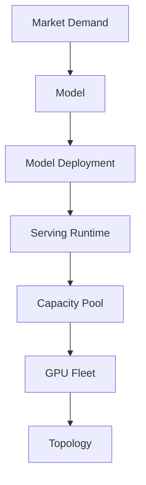

# Serving Platform MOC

## Purpose

A map of content that walks the canonical abstraction chain of the Rack AI inference platform, from market demand down to physical GPU topology. Each stage links to its canonical entity note; the chain must not be bypassed. OpenRouter consumers see Model endpoints, never infrastructure.

## Abstraction Chain

1. **Market Demand** — signal from OpenRouter traffic and the ecosystem that drives which models to serve.
2. **[[Model]]** — the canonical open-weight model Rack AI chooses to serve.
3. **[[Model Deployment]]** — a running instance of a model, declaring a [[Model Deployment Specification]].
4. **[[Serving Runtime]]** — the inference engine and configuration executing the deployment.
5. **[[Capacity Pool]]** — the software-controlled pool of GPU capacity the deployment draws from.
6. **GPU Fleet** — the physical [[GPU Node]] and [[GPU Cluster]] resources backing the pools.
7. **[[Topology]]** — the interconnect and placement (NVLink/NVSwitch, fabric, NUMA) that constrains performance.

## Chain Diagram

## Key Workflows

- [[Model Launch Factory]] — industrializes weights → validated runtime → Rack AI endpoint → OpenRouter.
- [[Standard Model Deployment]] — the repeatable deployment path through the standard serving contract.
- [[Request Routing]] — directs incoming traffic to the right deployment and hardware.
- [[Autoscaling]] — adds/removes serving capacity within latency and topology constraints.
- [[Admission Control]] — protects TTFT and availability under overload.
- [[Closed-Loop Optimization]] — continuously tunes configuration, capacity, and economics.

## See Also

- [[Wiki Hub]]
- [[Entity Index]]
- [[Rack AI Knowledge Base Architecture]]
