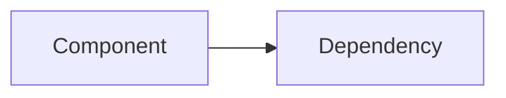
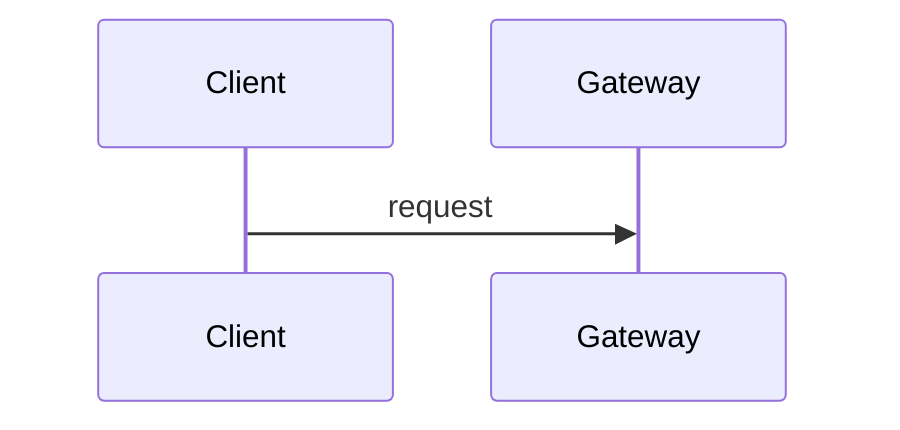

<!-- type: `spec` is a first-class note type (ID prefix `spec-`). See .kiro/steering/tech-spec-standards.md. -->
<!-- related MUST include the ID of every PRD it implements (if any) and the canonical concept note's ID. summary MUST be <= 120 chars (Fitness S-16). -->
<!-- This template is a portable standard shared across sibling wiki repos — do not add product-specific content to the template itself. -->
<!-- Codebase grounding (§3) is mandatory and READ-ONLY: never write to, push to, or open PRs against the product code repos from this work. -->
<!-- Shape: the house engineering design-doc shape (Overview → Architecture → resources/APIs → lifecycle → failure → NFR → Milestones → Open Questions), plus requirement traceability and as-built markers. Sections marked (if applicable) may be dropped; say "n/a" rather than silently omitting a section the reader would expect. -->

# {Thing} — Technical Specification

| Field | Value |
|:--|:--|
| Version | v0.1 |
| Status | Draft / In review / Approved / Building / Shipped (as-built maintained) |
| Author | |
| Reviewers | |
| Date created | YYYY-MM-DD |
| Based on PRD(s) | [[{Thing} PRD]] (version) — one or more PRDs; or "none: see §1.3" |
| Roadmap items | Milestone names exactly as they appear in the canonical roadmap table, separated by `;` (Fitness T-10: each listed row's *Tech spec* column must link this note) |
| Jira epic(s) | |

> **Artifact type: Technical Specification.** This is an authored engineering design, not a knowledge-graph definition. Concepts it uses have canonical notes (linked in §1.6); this spec designs *how* to build them and must not re-define them. Where this spec and a canonical note disagree, raise it — do not silently fork the definition.
>
> **Status banner.** State plainly whether this is a *proposed design* (nothing built), *in build*, or *shipped with as-built annotations*. Design intent is `assumed` until code/release evidence exists. Mark drift inline with the markers in §0.

### 0. Status markers (convention)

Use these inline, dated, and with a ticket where possible, so readers can tell design from reality without a separate document:

- **AS BUILT (YYYY-MM-DD, TICKET-123):** what was actually built where it differs from the design text above it. Keep the original design text; do not rewrite history.
- **PROPOSED, NOT BUILT (YYYY-MM-DD):** designed here, not implemented.
- **RETAINED FOR THE RECORD:** a design that was rejected or replaced, kept for the decision record.

## 1. Overview

One or two paragraphs: what this builds, for whom, and whether it is additive to or changes existing contracts.

### 1.1 Goals

Engineering outcomes, each traceable to a PRD requirement or stated reason.

### 1.2 Non-Goals

What this spec does not build, and where it is handled instead (another spec, a later phase, another team).

### 1.3 Requirements Traceability

Every functional requirement this spec covers from each PRD it implements, and where. When the spec serves several PRDs, prefix requirements with the PRD (e.g. `prd-x FR-1`); when a PRD is split across several specs, cover only this spec's share and name the sibling spec for the rest. A PRD requirement that is not covered must appear here as deferred or divergent — never silently dropped. If there is no PRD, list the spec's own requirements here as `R-n` (grouped by phase if phased).

| PRD · req | Spec section(s) | Milestone | Status |
|---|---|---|---|
| prd-x · FR-1 | §4.1, §5 | M1 | covered / partial / deferred / divergent (§1.4) / in sibling spec |

### 1.4 Deliberate Divergences from the PRD

Where this spec intentionally extends beyond, narrows, or departs from the PRD — each with the justification — so reviewers evaluate it explicitly rather than discover it as a gap. "None" is a valid answer.

### 1.5 Terminology

Only spec-local terms (identifiers, internal component names). For domain concepts, link the canonical note instead of redefining it.

| Term | Definition |
|:--|:--|
| | |

### 1.6 Relationship to Other Specs and Canonical Notes

Which specs this depends on, extends, or changes (with the exact section), and the canonical concept notes it implements. Any change to another spec's contract is listed here as an explicit exception.

## 2. Architecture

### 2.1 System Components

### 2.2 Component Responsibilities

| Component | Responsibility | Owner | New / changed / existing |
|---|---|---|---|

### 2.3 Dependency Map

### 2.4 Data Flow

## 3. Codebase Grounding (read-only)

**Required before any design below is written** (Fitness T-09, enforced by `scripts/lint-prd-spec.py`). Investigate the relevant parts of the product's code repositories (listed in the repo's operating standards) **read-only**: never write to them, push, branch, or open PRs from this work. Cite code as `owner/repo@<commit-sha>:path` (line ranges optional); quote at most short signatures, never copy code into the wiki. Shipped reality beats design: if the code differs from earlier specs or canonical notes, record it here and raise it.

### 3.1 Repos & revisions read

| Repo | Commit SHA | Paths read | Why relevant |
|---|---|---|---|
| owner/repo | `abc1234` | `pkg/...`, `api/...` | |

### 3.2 Existing patterns

How the relevant code is built today (resource/CRD conventions, controller structure, API style, error handling, config, testing) and how the new work follows them. Name any pattern this spec deliberately does **not** follow, and why.

### 3.3 Extension points

What is extended rather than built new: types, interfaces, CRDs, endpoints, UI components, docs sections. For each, `repo@sha:path` and whether the change is additive (no contract break) or breaking.

### 3.4 Standards to enforce

Conventions the implementation must hold to (naming, API versioning, lint/format, migrations, Helm/chart layout, test coverage, docs updates), with where each is defined in the repos.

### 3.5 Dependencies & fork prevention

Shared libraries, modules and charts this touches; how versions are pinned; and how the change avoids forks or drift across repos (backend / UI / docs) and environments (dev / staging / production). Name the single source of truth for every shared contract (schemas, API client, permissions).

### 3.6 Improvement & modularity opportunities

Where the existing code makes this change harder than it should be, and the smallest refactor or seam that would make this and future changes easier. Mark each as *in scope for this spec* or *proposed follow-up* (raise follow-ups as Open Questions with an owner; this spec does not silently expand scope).

## 4. Data Model

### 4.n {Resource / CRD / table}

For each new or changed resource: **Spec** (fields, types, defaults, validation), **Status** (conditions, observed state), **Controller Behaviour** (reconcile logic, ownership, finalizers, events). For storage: schema, indexes, migrations (named, ordered, owned by which chart/service), and upgrade ordering.

## 5. API Surface

New and changed endpoints: method, path, scope, request/response shape, error codes, pagination/filtering, required permission. Mark breaking changes explicitly. Link the API reference for unchanged endpoints rather than restating them.

## 6. Request Lifecycle

End-to-end flow for the main paths (happy path and the most important failure path), usually as a sequence diagram plus numbered steps.

## 7. Platform Integration Contract

Every spec answers each row, even if the answer is "none". This is where cross-spec gaps are caught before build.

| Concern | What this spec requires / emits |
|---|---|
| Identity & authorization | permissions introduced, scopes, service identities |
| Tenancy & isolation | namespace / project / tenant boundaries touched |
| Metering & quotas | metering events emitted, quota checks enforced |
| Audit | audit event types emitted, correlation IDs carried |
| Monitoring & alerting | metrics, logs, alerts, dashboards added |
| Tenant-visible observability | fields exposed to tenants (allowlist) |
| Billing | billing-relevant records produced or consumed |

## 8. Security & Isolation

Threats addressed, isolation guarantees, secrets handling, cross-tenant guarantees. For regulated or sovereign contexts, name the controls.

## 9. Failure Handling & Delivery Guarantees

What fails open vs closed, retry/idempotency semantics, delivery guarantees per event class, degraded-mode behaviour, and how loss is detected.

## 10. Data Retention (if applicable)

What is kept, for how long, where, and who can delete it; compliance retention windows.

## 11. Non-Functional Requirements

| Requirement | Target | Basis |
|:--|:--|:--|
| | | target (unmeasured) / measured — cite benchmark or telemetry source |

Targets are design postures until measured. A number presented as measured must cite its source.

## 12. Testing Strategy

Unit, integration, end-to-end, and isolation/negative tests that prove the requirements in §1.3; what runs in CI.

## 13. Milestones

### M1 — {name}

**Jira (Epic):** TICKET · **Goal:** one sentence · **Satisfies:** FR-n / R-n · **Prerequisite for:** (if gating)

**Breakdown**

| Item | For requirement | Jira | Estimate | Priority |
|---|---|---|---|---|
| | | | | Must have / Nice to have |

**Engineering Checklist** — what must be verified before the milestone is called done (e.g. alert confirmed firing, migration rehearsed, isolation test green).

**Release Checklist** — the user-visible behaviour that must be true at release, phrased as observable outcomes.

## 14. Open Questions

| # | Question | Owner | Blocks | Status |
|---|---|---|---|---|
| Q-1 | | | | open / resolved (date, answer) |

## 15. References

PRD, related specs, canonical notes, API reference, tickets.

## Appendix A. Engineering Details (if applicable)

Long-form detail that would interrupt the main flow: full CRD schemas, example manifests, alert rules, Helm values.

## Appendix B. Where Things Live

Repos, packages, charts, and paths for each component, so the as-built state can be checked against code.

## See Also

- [[{Thing} PRD]] — the requirements this spec implements
- [[{Canonical Note}]] — the canonical concept this spec builds
