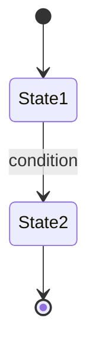

# {Workflow Name}

## Purpose

What this workflow accomplishes and when it runs.

## Trigger

What initiates this workflow (event, schedule, threshold, operator action).

## State Machine

## Steps

1. Step — owner, formula/metric referenced, decision
2. …

## Events Emitted

| Event | When | Consumers |
|-------|------|-----------|
| [[evt-...]] | | |

## Dependencies

| Depends On | Type | Notes |
|------------|------|-------|
| [[...]] | DEPENDS_ON | |

## Ownership

Which team owns this workflow end to end.

## See Also

- [[Operations Hub]]
